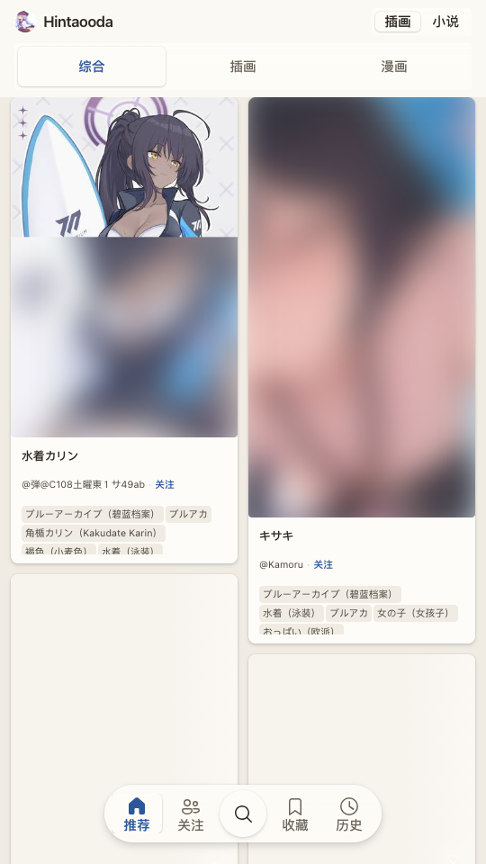
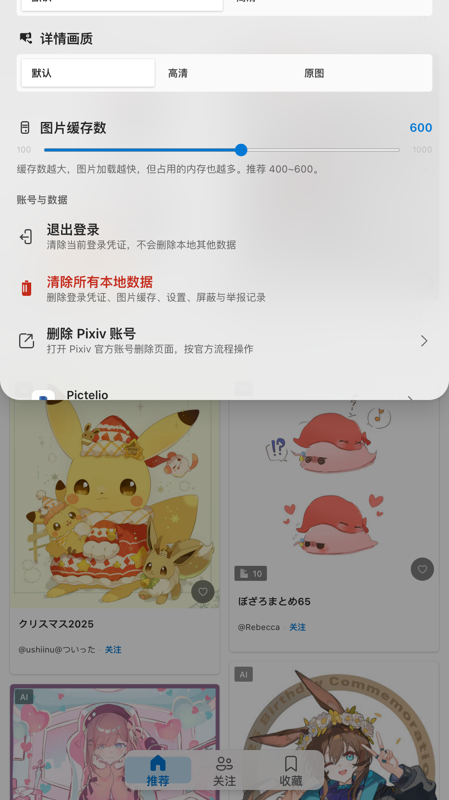
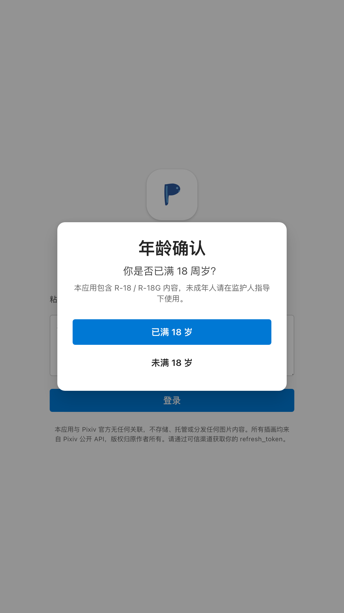

<div align="center">
  
  <h1 align="center">Pictelio</h1>
  <p align="center">
    <strong>A third-party Pixiv illustration browser built with SolidJS</strong>
    <br>
    Packaged as a native Android app with Capacitor
  </p>
  <p align="center">
    <a href="https://github.com/a1121611810/pixivizer/blob/main/LICENSE">
      
    </a>
    
    
    
    
    
    <br>
    
  </p>
</div>

---

## Screenshots

<div align="center">
  <table>
    <tr>
      <td align="center"><strong>Feed</strong></td>
      <td align="center"><strong>Detail</strong></td>
      <td align="center"><strong>Settings</strong></td>
      <td align="center"><strong>Login</strong></td>
    </tr>
    <tr>
      <td></td>
      <td></td>
      <td></td>
      <td></td>
    </tr>
  </table>
</div>

---

## Features

- **Browse** — Recommended and Following feeds for both illustrations and novels
- **Illust Detail** — Full-resolution images, multi-page support, Ugoira animated playback
- **Novel Reader** — Virtualized text layout, keyword search, series navigation with reading progress
- **Layout Modes** — Waterfall masonry, single column, or grid
- **Social** — Bookmark, comment, follow/unfollow artists
- **Content Control** — Age gate on first launch, R18/R18G blurred filtering
- **Theme** — Light, Dark, and System-follow themes

---

## Quick Start

**Prerequisites:** Node.js 20.19+, pnpm 11.9.0

```bash
pnpm install
pnpm dev          # Vite dev server at localhost:5173
```

> Web dev needs an HTTP proxy to reach Pixiv. The project reads `https_proxy` / `HTTP_PROXY` env vars and falls back to `http://127.0.0.1:10808`.

```
https_proxy=http://127.0.0.1:7890 pnpm dev
```

**Build APK:** Requires Android Studio, JDK 21, Android SDK (minSdkLevel=30, WebView≥85).

```bash
pnpm build:android          # Debug APK
pnpm build:android:release  # Signed Release APK
pnpm dev:android            # Hot-reload development
```

See [`docs/platform-compatibility.md`](docs/platform-compatibility.md) for platform requirements and [`docs/release-signing.md`](docs/release-signing.md) for release signing.

---

## Tech Stack

**Framework** SolidJS · **Routing** TanStack Router · **Data** TanStack Query · **DB** TanStack DB · **Virtual** TanStack Virtual · **Build** Vite + vite-plus · **Style** UnoCSS + Fluent Design 2 · **Mobile** Capacitor · **Test** Vitest · **Type** TypeScript 6 (strict)

---

## Project Structure

```
pixivizer/
├── packages/
│   ├── app/               # SolidJS SPA (src/ → api, components, routes, stores, styles, utils, native)
│   └── website/           # Astro landing page (src/ → pages, layouts, styles)
├── docs/                  # Architecture docs, release guides, privacy policy
├── scripts/               # Deploy & utility scripts
└── openwiki/              # Auto-generated architectural documentation
```

---

## Available Scripts

<details>
<summary>Click to expand</summary>

Command convention (see `docs/adr/ADR-0059-root-script-convention.md`): a bare command targets `pictelio-app` by default, `<command>:<package-dir>` targets the matching workspace package, and `<command>:all` runs every package that has that script, in parallel.

| Command | Description |
|:--------|:------------|
| `pnpm dev` | Start `pictelio-app` Vite dev server (localhost:5173) |
| `pnpm dev:app-lynx` | Start `pictelio-app-lynx` dev server |
| `pnpm dev:website` | Start landing page (Astro) dev server |
| `pnpm dev:all` | Start all dev servers in parallel |
| `pnpm build` | TypeScript check + Vite build (`pictelio-app`) |
| `pnpm build:app-lynx` | Build `pictelio-app-lynx` |
| `pnpm build:website` | Build landing page |
| `pnpm check` | TypeScript type-check only (`pictelio-app`) |
| `pnpm check:app-lynx` | Type-check `pictelio-app-lynx` |
| `pnpm check:ugoira` | Type-check `@pictelio/ugoira` |
| `pnpm check:all` | Type-check all packages in parallel |
| `pnpm preview` | Preview production build (`pictelio-app`) |
| `pnpm test` | Run Vitest unit tests (`pictelio-app`) |
| `pnpm test:all` | Run all packages' unit tests in parallel |
| `pnpm test:app:all` | Run `pictelio-app` unit tests + agent-browser E2E |
| `pnpm test:agent-browser` | Run AI-driven E2E browser tests |
| `pnpm lint` | Run oxlint (`pictelio-app`) |
| `pnpm fmt` | Run oxfmt formatter (`pictelio-app`) |
| `pnpm build:android` | Build Debug APK |
| `pnpm build:android:release` | Build signed Release APK |
| `pnpm dev:android` | Hot-reload Android development |
| `pnpm sync:app-lynx-bundle` | Sync lynx bundle into Android assets |
| `pnpm cap:*` | Capacitor sync / copy / open |
| `pnpm release` | Interactive one-shot release (bump version → build → tag → GitHub Release) |
| `pnpm deploy` | Preview landing page to `_site/` |
| `pnpm openwiki:update` | Sync OpenWiki docs from source |

</details>

---

Pictelio is not affiliated with Pixiv Inc. All content displayed is sourced from [Pixiv](https://www.pixiv.net) public API and belongs to their respective creators.

This project is for learning and research purposes only. If you are evaluating it, please delete the app and all cached content within 24 hours. Do not use it for any purpose that violates Pixiv's Terms of Service or applicable laws.

## License

[MIT](LICENSE) © 2026
