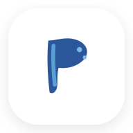
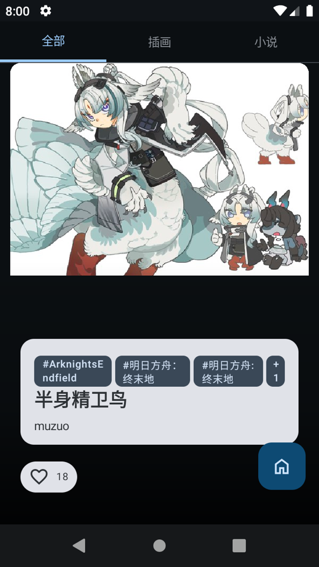
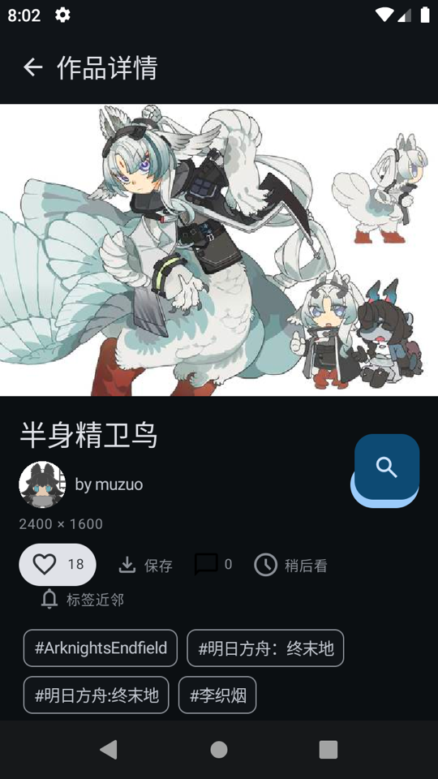
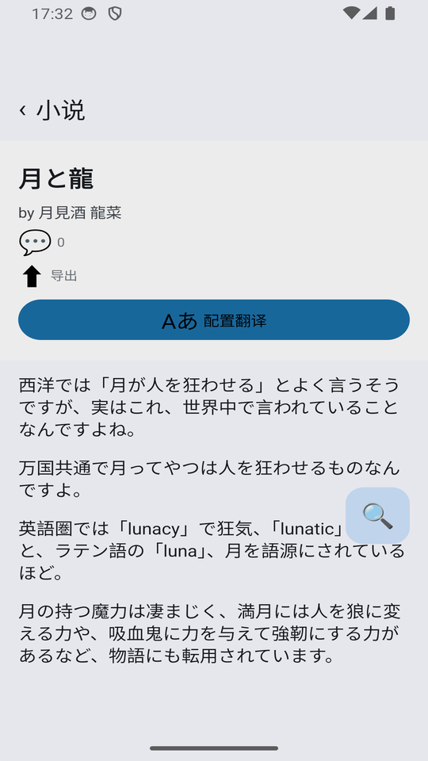
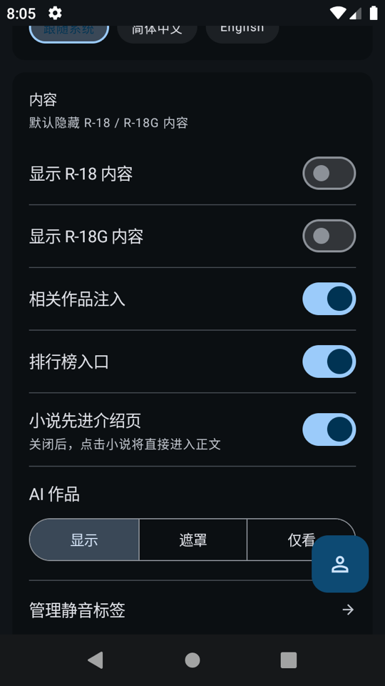
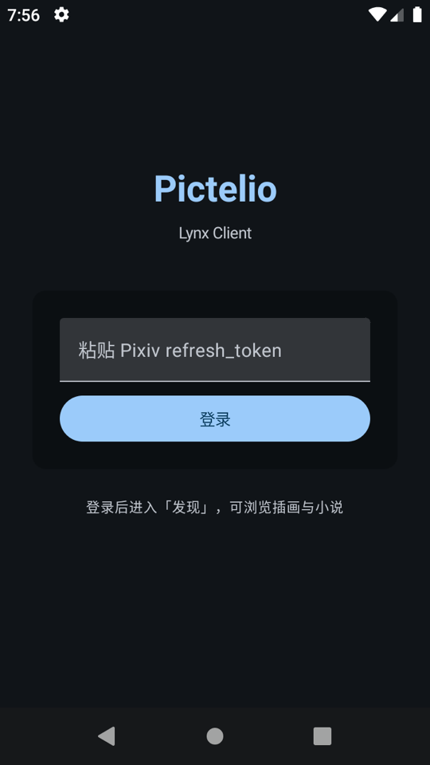

<div align="center">
  
  <h1 align="center">Pictelio</h1>
  <p><strong>A Pixiv client for Android, built on Lynx.</strong></p>
  <p>
    <a href="https://github.com/a1121611810/Pictelio/releases"></a>
    <a href="https://a1121611810.github.io/Pictelio/"></a>
    <a href="https://github.com/a1121611810/Pictelio/actions/workflows/ci.yml"></a>
    <a href="LICENSE"></a>
    <br>
    
    
    
    
  </p>
</div>

<a href="packages/website/public/screenshots/01_feed.png"></a>
<a href="packages/website/public/screenshots/02_detail.png"></a>
<a href="packages/website/public/screenshots/03_novel.png"></a>
<a href="packages/website/public/screenshots/06_settings.png"></a>
<a href="packages/website/public/screenshots/07_login.png"></a>

---

Pictelio reads Pixiv through its public API. It is a third-party client, not affiliated with Pixiv Inc. The app runs on one engine — the earlier WebView build, and its source, are gone.

## What it does

- **Discover** — Recommended works, illustration and novel feeds, search with advanced filters, and rankings.
- **Updates** — New work from artists you follow, your watchlist, and your notifications.
- **Shelf** — Bookmarks with tags, watch later, and the page you stopped reading.
- **Advanced** — Network and platform diagnostics.

Illustration detail goes full resolution, across every page, with Ugoira animation. The novel reader lays text out virtually, searches inside a chapter, and translates with your own OpenAI key. Export to EPUB, PDF, DOCX, Markdown, and more. Add comments, follow artists, and download work for later.

Content control is yours: R18 and R18G visibility, AI-generated filtering, and muted tags, each scoped to your account. Appearance follows Material Design 3 in light, dark, or your system setting.

## Build from source

You need Node.js 22.22.2 or later and pnpm 11.9.0. Building the APK also needs JDK 21 and the Android SDK.

```bash
pnpm install
pnpm dev                # client dev server
pnpm dev:android-host   # build a debug APK and install it
```

For a signed release build, see [docs/release-signing.md](docs/release-signing.md). The full walkthrough is in [docs/release-checklist.md](docs/release-checklist.md).

**The dev server needs a proxy.** It reads `https_proxy`, `HTTPS_PROXY`, `http_proxy`, or `HTTP_PROXY`, and falls back to `http://127.0.0.1:7897`.

**You sign in with a refresh token.** Paste your own Pixiv refresh token on the login screen. The Pixiv client constants in `packages/app-lynx/credentials.json5` ship with the repo. Your token never does.

The root `package.json` is the full command list. Bare `dev`, `build`, `check`, `test`, and `preview` all target the client; host actions are always named explicitly.

## Documentation

- [AGENTS.md](AGENTS.md) — the rules that govern changes here. Read this first.
- [openwiki](openwiki/quickstart.md) — architecture, domain, integrations, and testing. Regenerated on a schedule.
- [docs/adr](docs/adr/) — 199 decision records. Look for one before you change behavior.
- [docs/privacy-policy.md](docs/privacy-policy.md) — what the app stores and what it sends.

---

Pictelio is meant for learning and research. If you are evaluating it, please delete the app and all cached content within 24 hours. Do not use it in ways that violate Pixiv's Terms of Service or applicable law.

[MIT](LICENSE) © 2026 a1121611810
