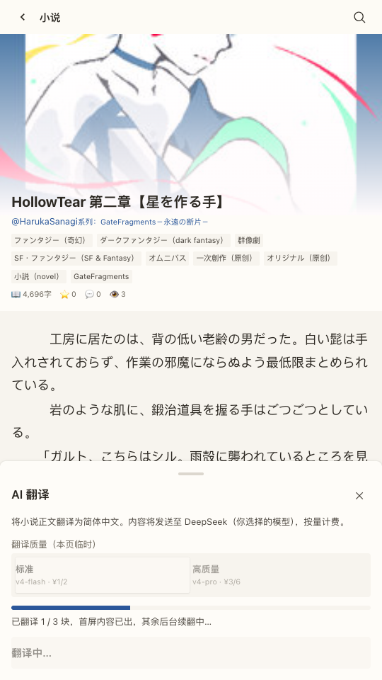

<div align="center">
  
  <h1 align="center">Pictelio</h1>
  <p align="center">
    <strong>A third-party Pixiv browser</strong>
    <br>
    Pictelio 自 v6.3.0 起为 <strong>Lynx 单引擎</strong>客户端，原 WebView 客户端已随 #610 整体下线。
    <br>
    该客户端为唯一运行时形态；<code>packages/app/src/</code> 中的 WebView 源码仍在库中但不参与构建与运行。
  </p>
  <p align="center">
    <a href="https://github.com/a1121611810/pixivizer/blob/main/LICENSE">
      
    </a>
    
    
    
    <br>
    
  </p>
</div>

---

## Screenshots

<div align="center">
  <table>
    <tr>
      <td align="center"><strong>Feed</strong></td>
      <td align="center"><strong>Detail</strong></td>
      <td align="center"><strong>Novel</strong></td>
      <td align="center"><strong>Translate</strong></td>
    </tr>
    <tr>
      <td></td>
      <td></td>
      <td></td>
      <td></td>
    </tr>
    <tr>
      <td align="center"><strong>Settings</strong></td>
      <td align="center"><strong>Login</strong></td>
    </tr>
    <tr>
      <td></td>
      <td></td>
    </tr>
  </table>
</div>

---

## Features

- **Browse** — Recommended and Following feeds for both illustrations and novels
- **Illust Detail** — Full-resolution images, multi-page support, Ugoira animated playback
- **Novel Reader** — Virtualized text layout, text-selection search, series navigation with reading progress
- **Feed Layouts** — Two-column waterfall on illustration feeds, single column on list feeds (ranking, watchlist, novels)
- **Social** — Bookmark, comment, follow/unfollow artists
- **Content Control** — Per-account R18 / R18G visibility, tag muting, AI-restricted content handling
- **Theme** — Light, Dark, and System-follow themes

---

## Quick Start

**Prerequisites:** Node.js 22.22.2+, pnpm 11.9.0

```bash
pnpm install
pnpm dev          # Vite dev server at localhost:5173
```

> `pnpm dev` is the retained WebView client dev server (`pictelio-app`); its sources stay in the repo but are not
> built or shipped (see the single-engine note at the top). Browser development of the Lynx client — the shipping
> app — uses `pnpm dev:app-lynx`. Both reach Pixiv over an HTTP proxy: the project reads `https_proxy` / `HTTP_PROXY`
> env vars and falls back to `http://127.0.0.1:7897`.

```
https_proxy=http://127.0.0.1:7890 pnpm dev:app-lynx
```

**Build APK:** Requires Android Studio, JDK 21, Android SDK (minSdkLevel=28).

```bash
pnpm build:android          # Debug APK
pnpm build:android:release  # Signed Release APK
pnpm dev:android            # Hot-reload development
```

See [`docs/platform-compatibility.md`](docs/platform-compatibility.md) for platform requirements and [`docs/release-signing.md`](docs/release-signing.md) for release signing.

---

## Tech Stack

**Client** Vue 3 + vue-lynx (Lynx) · **Routing** vue-router · **Data** TanStack Vue Query · **Build** Rspeedy (rsbuild) + Gradle · **Style** Tailwind CSS + Material Design 3 · **Tooling** vite-plus (lint / fmt / test) · **Test** Vitest · **Type** TypeScript (strict)

---

## Project Structure

```
pixivizer/
├── packages/
│   ├── app/               # pictelio-app — SolidJS SPA sources, retained in-repo but not built or shipped
│   ├── app-lynx/          # pictelio-app-lynx — vue-lynx client, the shipping app (login / recommended / novel / profile)
│   ├── ugoira/            # @pictelio/ugoira — Ugoira (Pixiv animated illust) zip frame-processing pure functions
│   ├── update-check/      # @pictelio/update-check — shared update-check library (version compare / version.json fetch)
│   ├── novel-export/      # @pictelio/novel-export — shared novel multi-format export library (extract / block parse / payload)
│   ├── search-core/       # @pictelio/search-core — shared search core (filter state → request params / URL codec / cache keys)
│   ├── ranking-core/      # @pictelio/ranking-core — shared ranking core (dimension catalog / request builder / cache keys)
│   ├── net-diagnostics/   # @pictelio/net-diagnostics — shared network self-check library (check plan / verdict / report)
│   └── website/           # pictelio-website — Astro landing page (src/ → pages, layouts, styles)
├── docs/                  # Architecture docs, release guides, privacy policy
├── scripts/               # Deploy & utility scripts
└── openwiki/              # Auto-generated architectural documentation
```

---

## Available Scripts

<details>
<summary>Click to expand</summary>

Command convention (see `docs/adr/ADR-0059-root-script-convention.md`): the root `package.json` is the authoritative
script list. A bare command targets `pictelio-app` by default, `<command>:<package-dir>` targets the matching workspace
package, and `<command>:all` runs every package that has that script, in parallel. `lint` / `fmt` / `fmt:check` /
`outdated` are the exceptions: they are repo-wide single commands with no `<command>:<package>` variant.

| Command | Description |
|:--------|:------------|
| `pnpm dev` | Start `pictelio-app` Vite dev server (localhost:5173) |
| `pnpm dev:app` | Same as `pnpm dev` (explicit alias) |
| `pnpm dev:app-lynx` | Start `pictelio-app-lynx` dev server |
| `pnpm dev:website` | Start landing page (Astro) dev server |
| `pnpm dev:all` | Start all dev servers in parallel |
| `pnpm build` | Vite build via vite-plus (`pictelio-app`); use `pnpm check` for type-check |
| `pnpm build:app-lynx` | Build `pictelio-app-lynx` |
| `pnpm build:website` | Build landing page |
| `pnpm check` | TypeScript type-check only (`pictelio-app`) |
| `pnpm check:app-lynx` | Type-check `pictelio-app-lynx` |
| `pnpm check:ugoira` | Type-check `@pictelio/ugoira` |
| `pnpm check:all` | Type-check all packages in parallel |
| `pnpm preview` | Preview production build (`pictelio-app`) |
| `pnpm test` | Run Vitest unit tests (`pictelio-app`) |
| `pnpm test:all` | Run all packages' unit tests in parallel |
| `pnpm test:app:all` | Run `pictelio-app` unit tests + agent-browser E2E |
| `pnpm test:agent-browser` | Run AI-driven E2E browser tests |
| `pnpm test:android:e2e` | Run Appium E2E tests on the Android emulator |
| `pnpm lint` | Run oxlint across the repo (single config source: root `vite.config.ts`) |
| `pnpm fmt` | Run oxfmt formatter across the repo |
| `pnpm build:android` | Build Debug APK |
| `pnpm build:android:release` | Build signed Release APK |
| `pnpm dev:android` | Hot-reload Android development |
| `pnpm sync:app-lynx-bundle` | Sync lynx bundle into Android assets |
| `pnpm release` | Interactive one-shot release (bump version → build → tag → GitHub Release) |
| `pnpm deploy` | Preview landing page to `_site/` |

</details>

---

Pictelio is not affiliated with Pixiv Inc. All content displayed is sourced from [Pixiv](https://www.pixiv.net) public API and belongs to their respective creators.

This project is for learning and research purposes only. If you are evaluating it, please delete the app and all cached content within 24 hours. Do not use it for any purpose that violates Pixiv's Terms of Service or applicable laws.

## License

[MIT](LICENSE) © 2026
