# 通知中心 + 标签静音：模拟器验收取证（#736 第一批）

> 日期：2026-09-26 ｜ 环境：pictelio_ui AVD（Android 14，emulator-5554）｜ 构建：`feat/notifications-tag-mute` @ cd2a54f1（fullDebug，`pnpm build:android` 全流水线）
> 登录：`am start --es pictelio_dev_refresh_token <token>`（LynxActivity dev hook）；模拟器全局代理 `10.0.2.2:7897`
> 结论：**全部场景 PASS**。本批覆盖 ADR-0188 D7 角标/路由与 ADR-0162 结构规避的组头展开真数据流取证；标签长按手势与跨引擎词表迁移取证完成。

## 场景矩阵

| # | 场景 | 端 | 结果 | 证据 |
| --- | --- | --- | --- | --- |
| 1 | 侧栏铃铛入口 + 未读角标（红点） | webview | ✅ |  |
| 2 | `/notifications` 真数据渲染（组头/纯文本剥离/相对时间/i.pximg 缩略图经代理） | webview | ✅ | 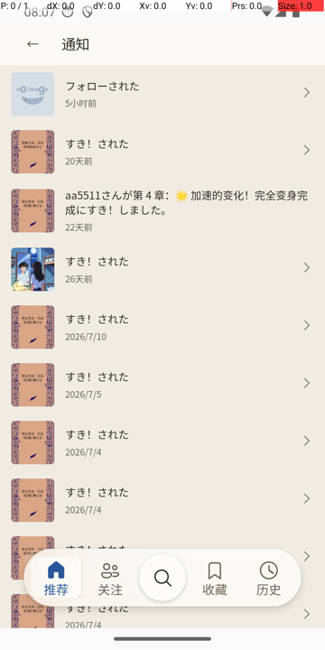 |
| 3 | 组头「フォローされた」展开 → view-more 子列表就地摊平 | webview | ✅ | 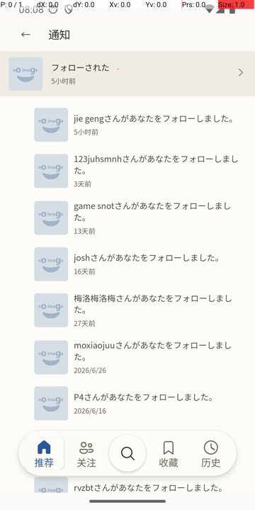 |
| 4 | 子行点击 → `pixiv://users/{id}` → `/user/:id` 路由 | webview | ✅ | 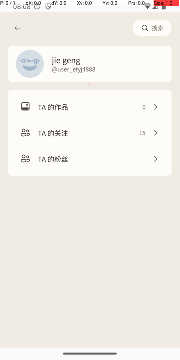 |
| 5 | 进入通知页后铃铛角标消失（本地已读记忆推进，D5） | webview | ✅ | （见存档说明） |
| 6 | 详情页长按标签 → 轻提示「已静音标签「原神」」且不触发搜索跳转 | webview | ✅ | 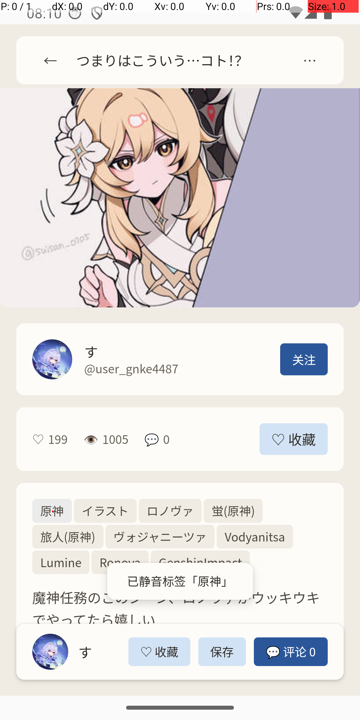 |
| 7 | 设置 → 内容 → 管理静音标签 → MuteTagSheet 读回「原神」 | webview | ✅ | 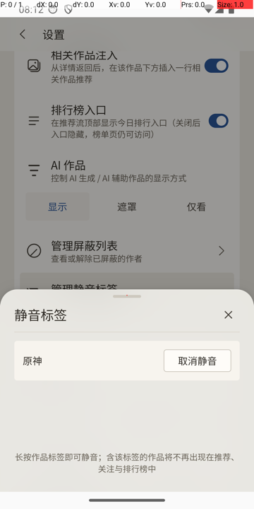 |
| 8 | 下拉刷新后含「原神」标签作品移出推荐流（快照语义：刷新重组装生效） | webview | ✅ | 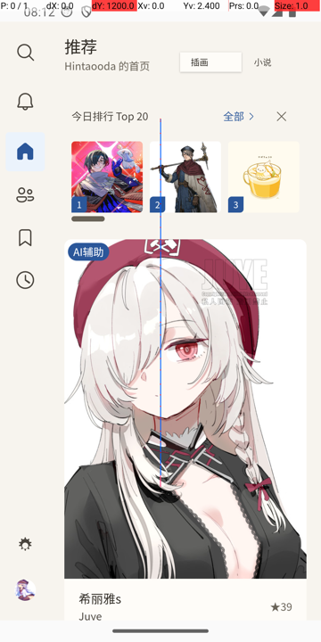 |
| 9 | 引擎切换 WebView→Lynx（确认切换→重启生效） | 双端 | ✅ | 过程截图存档 |
| 10 | lynx Me 功能入口卡「通知」行（networkCheck 之后）+ 无未读圆点（读到 webview 推进的共享已读键） | lynx | ✅ | 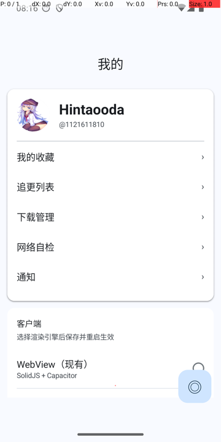 |
| 11 | lynx `/notifications` 真数据渲染 + logcat 实证 `PictelioPrefs.prefsSet.notifications_last_read_time`（拉取成功才推进，D5） | lynx | ✅ | 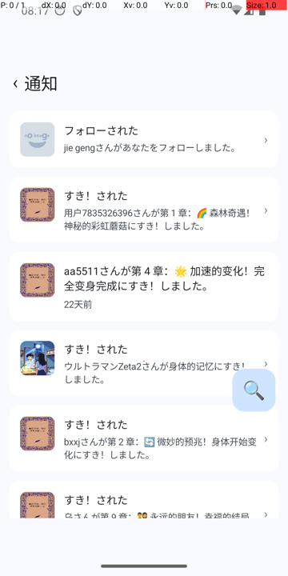 |
| 12 | **lynx 组头展开（ADR-0162 结构规避取证）**：子列表在组头 item 内条件段就地渲染，行序无错位、无静默丢弃；logcat 无 JS error（仅 fiber FlushActionsAsRoot 常规噪声） | lynx | ✅ | 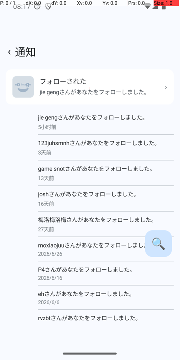 |
| 13 | lynx 子行点击 → `/user/:id`（空态正常） | lynx | ✅ | 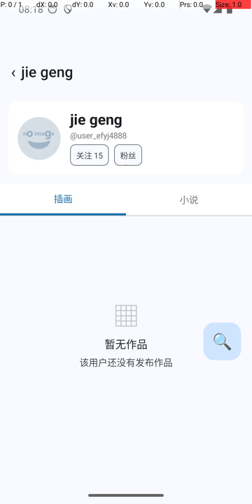 |
| 14 | lynx Me 内容组「管理静音标签」行 → `/mute-tags` 显示「原神」（**跨引擎共享键**：webview 写入 → lynx 读回） | lynx | ✅ | 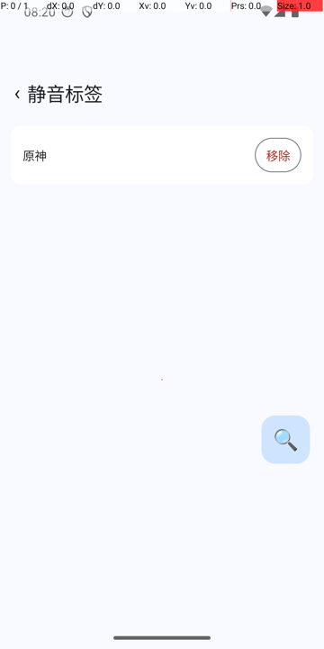 |
| 15 | lynx 详情页长按「#少女前線」→ snackbar「已静音「少女前線」」且不触发搜索跳转（TagPressChip/useLongPress view 层手势） | lynx | ✅ | 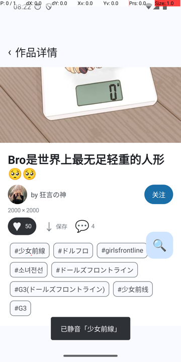 |

## 关键取证说明

1. **场景 12 是本批核心**：Round 1 review 曾把「组头展开 = 原生 list 中途插入」判为 Blocking（ADR-0162「插入=静默丢弃」），修复改为子列表内嵌组头 item 内条件段（结构规避）。本次真机展开 30 条子列表渲染完整、顺序正确，阻塞关闭的设备证据落档。
2. **场景 10/14 双向验证 `mute_tags_${uid}` 与 `notifications_last_read_time` 的跨引擎同键**（ADR-0103 共享 SharedPreferences）：webview 静音/已读状态在 lynx 侧直接生效。
3. **场景 8 的口径**：过滤在刷新重组装时生效（非已渲染列表热移除），与 spec 边界 #4/#9 一致；webview 首卡由「つまりはこういう…コト!?（原神，★199）」变为「希丽雅s（★39）」。

## 未覆盖（留待后续批次）

- 未读 0→1 的角标重现（需新通知到达；webview 依赖前台恢复节流 ≥5min、lynx 依赖 Me `onActivated` 重入——守卫测试已钉挂点）
- 通知行小说路由（`pixiv://novels`）、http(s) 外链分支
- 排行榜名次留洞的视觉确认（lynx 静音后名次空洞）
- 断网/弱网下通知页与静音写失败分支
