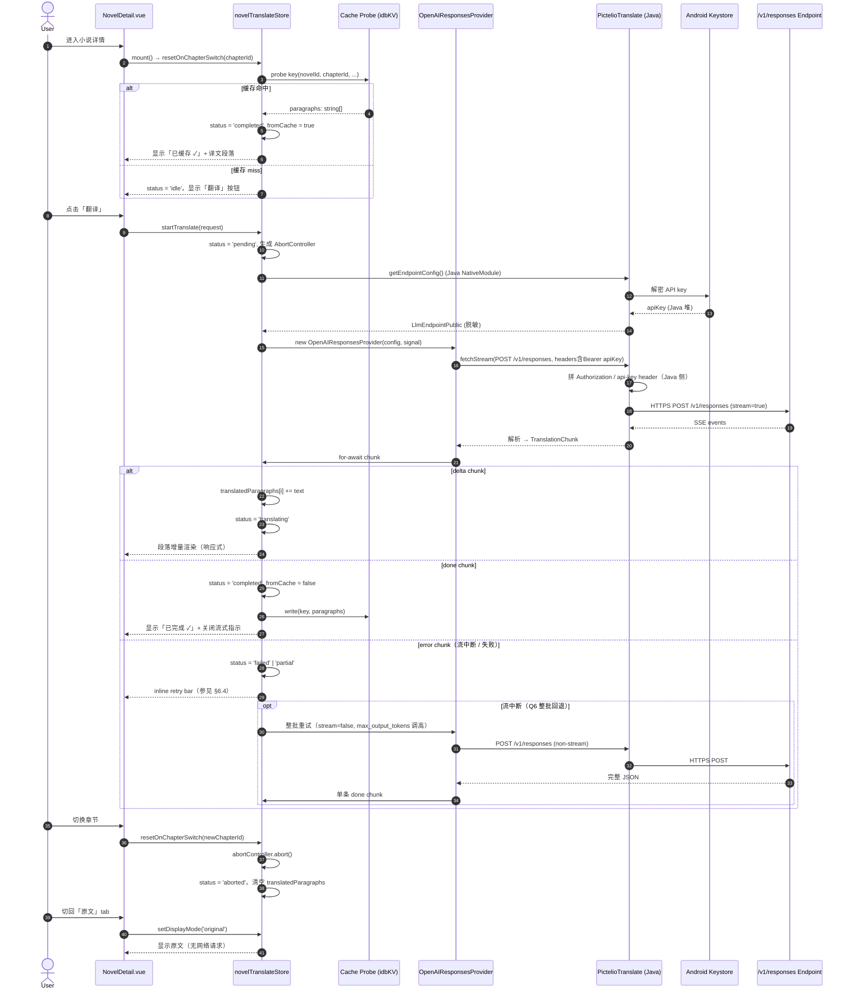

# Spec: app-lynx 端小说翻译（LLM endpoint 用户自填 + OpenAI Responses API）

- 状态：ready-for-implementation（2026-09；配套 ADR-0169 / ADR-0170 / ADR-0171 + prototype #624）
- 日期：2026-09-19
- 关联：wayfinder map #617 / #644 / ADR-0169（Responses API 请求构造）/ ADR-0170（chunked pipeline 与重试）/ ADR-0171（缓存键与模型档位）/ ADR-0172（PrimJS 运行时 API 面）/ ADR-0173（端点探测与凭据验证）/ **ADR-0174（Java 终态测试契约）** / **ADR-0175（filesystem cache 通道）** / **ADR-0176（per-stream keying）** / **ADR-0177（gradle variant gate）** / **ADR-0178（重试 + partial UI 形态参数）** / prototype #624（endpoint 配置 + 失败 UX 视觉定型）/ 调研产物 `research/openai-responses-api.md`（#622）/ `research/lynx-async-iterator-support.md`（#623）/ `research/llm-endpoint-compatibility.md`（#625）/ `research/deepseek-streaming-api.md`（#622 旁证）/ `research/app-lynx-translation-java-contract-test-mechanism.md`（#646）/ `research/app-lynx-translation-cross-stream-contamination.md`（#649）
- 工单：tickets 由 to-tickets 阶段产出（不在本 spec 内）

> 本 spec **完全限定在 app-lynx 客户端**（`packages/app-lynx/`），不动 webview 端（`packages/app/`）任何翻译栈；不复用 webview 端的 `createNovelTranslator` / `translationCache` / `translationStore` / `TranslateSheet` / `SettingsTranslate` / `prompts.ts`；不抽共享包。可参考 webview 端的**抽象边界**（provider 接口形态、缓存键设计、policy 决策点），但不直接搬运实现。

---

## 1. 背景与目标

app-lynx 客户端目前**没有小说翻译功能**——webview 端已有完整的 BYOK DeepSeek 翻译管线（详见 `openwiki/domain/novel-reader.md` §AI Translation），但 app-lynx 的 `pages/NovelDetail.vue` 仅有基础阅读能力，没有任何「翻译」入口、设置项或状态。本 spec 交付 lynx 端**从零搭建**的完整翻译功能：

1. **LLM endpoint 用户自填**：设置页提供 base URL / API key / model name 三字段表单，全部由用户手动填写，**不预设任何 provider preset**（无 DeepSeek / OpenAI / Azure 等快捷按钮），保存到 SecureStorage（Android Keystore）。
2. **统一协议 = OpenAI Responses API**（`POST /v1/responses`）：所有 LLM 调用走 `/v1/responses` endpoint；**不写死** chat/completions 旧协议；不支持 `/v1/responses` 的 provider（OpenRouter / 智谱 / 通义千问 / 文心 / LocalAI / LM Studio）由前端硬拒绝并给清晰错误。
3. **API key 走 Native bridge**：新建独立 Java NativeModule `PictelioTranslate`，API key 仅在 Android Keystore + Java 堆中可见，**不进 JS heap**（与 `PictelioAuth` / `PictelioApi` 同级，参考 ADR-0037 字节零进 JS 堆原则）。
4. **设计语言 = M3**：与 lynx 端其他 UI 一致（`tailwind.config.ts` + Material 3 color/typography/shape tokens），**不引入 Fluent 2**。
5. **章节粒度续翻 + 整段切换 UX**：用户进入哪一章才翻译哪一章（按需）；详情顶部「原文 / 译文」单选切换整段显示；缓存命中自动秒出；续翻自动从头（Q21）。
6. **流式优先 + 整批回退**（混合模式）：provider 接口默认 `AsyncIterator<TranslationChunk>`；流式中断时**自动回退整批重试一次**（Q6 + 流式不可靠场景兜底）。
7. **缓存粒度 = novel id + chapter id**：键含 `novelId | chapterId | targetLang | modelId | sourceHash | baseURLHash`；改 model / 改 base URL / 改 target lang 自动失效（Q7）。
8. **8 状态机**：idle / pending / translating / translating_queued / partial / failed / completed / aborted（含 2 个排队态以适配未来多请求场景，Q19）。

终态产物（一个 map 三个 deliverable）：
- 本 spec（需求 + 领域模型 + UX + 边界条件）
- 3 个关键技术 ADR（#619 / #620 / #621）
- 一组 implement tickets（to-tickets 阶段产出）

---

## 2. 非目标（Out of Scope）

复用 wayfinder map #617 的 Out of scope，**严格不扩展**：

1. **webview 端的翻译栈**：`packages/app/src/` 的 `createNovelTranslator` / `translationCache` / `translationStore` / `TranslateSheet` / `SettingsTranslate` / `prompts.ts` **保持原状**，不迁移到新抽象、不共享 prompt、不抽取代码。
2. **抽 `@pictelio/novel-translate` 共享包**：用户明确只做 app-lynx 端；将来如需共享，重新开新 map + 新 ADR。
3. **chat/completions 旧协议支持**：当前只走 OpenAI Responses API `/v1/responses`；如未来需要回退支持 chat/completions（如 OpenRouter 用户诉求），作为**单独 ticket + 单独 map** 处理，不在本 spec 范围内。
4. **`@pictelio/novel-export` 包改动**：翻译结果纳入导出现在不做（双语导出 vs 单语导出的 UX 复杂度需独立立项）；后续 map 处理。
5. **provider preset UI**：**不**在设置页提供「DeepSeek / OpenAI / Azure / 自托管」等 preset 按钮；用户必须手动填所有字段（保持「完全用户自填」的纯净边界）。
6. **多 endpoint 切换**：当前只支持**单一** endpoint 配置（一个 base URL + 一个 key + 一个 model）；多 endpoint 轮询 / 并行 / fallback 不在本 map。
7. **i18n 字典补全**：本 spec **只定义键**（`novelTranslate.*` 子命名空间）；zh-CN / en 字符串实际翻译留到 implement 阶段补全（spec 阶段给占位字符串示意）。

---

## 3. 22 个决策摘要表

| # | 决策 | 摘要 |
|---|---|---|
| Q1 | 范围收窄 | 只做 app-lynx 端，不抽共享包 |
| Q2 | 产物 | spec + ADR + tickets（三阶段交付） |
| Q3 | 复用边界 | 完全从零——prompt 模板 / chunked pipeline / 缓存策略 / store / UI 全部新建 |
| Q4 | Provider 接口 | 无关抽象（接口可替换；当前实现统一走 Responses API） |
| Q5 | 网络通路 | native bridge（API key 不进 JS heap） |
| Q6 | 返回模式 | 混合（流式优先 + 整批回退） |
| Q7 | 缓存粒度 | novel id + chapter id |
| Q8 | 设计语言 | M3 |
| Q9 | 翻译粒度 | 按章节按需（用户进入哪章才翻译） |
| Q10 | 触达 UX | 详情内联（点按钮后详情页面直接渲染译文） |
| Q11 | 显示布局 | 整段切换（详情顶部「原文 / 译文」单选） |
| Q12 | 续翻粒度 | 章节粒度（AbortController + generation gate；缓存命中可跳过） |
| Q13 | R18 处理 | Provider 自决定（接口接受 content rating 元数据） |
| Q14 | Prompt | 调用方不带（由 provider / Responses API 用 `instructions` 字段决定） |
| Q15 | Native 模块 | 独立 `PictelioTranslate` Java 模块（与 `PictelioAuth` / `PictelioApi` 同级） |
| Q16 | 流式接口 | `AsyncIterator<TranslationChunk>`（Lynx SWC es2015 target + `Symbol.asyncIterator` polyfill 已验证） |
| Q17 | LLM endpoint | 用户自填（base URL + API key + model name；空配置时拦截引导） |
| Q18 | 协议 | OpenAI Responses API（`POST /v1/responses`） |
| Q19 | 状态机 | 8 状态（idle / pending / translating / translating_queued / partial / failed / completed / aborted） |
| Q20 | 缓存提示 | 「已缓存 ✓」标识（详情页 UI 显示） |
| Q21 | 续翻 | 自动从头重翻（缓存命中秒完） |
| Q22 | R18 拦截 | 应用层（account-scoped R18 关 → 直接拒绝翻译该章节） |

---

## 4. 领域模型

> TS 伪代码——展示**结构与契约**，不要求可编译；implement 阶段拆分为 `types.ts` / `provider.ts` / `store.ts` / `cache.ts` 等文件。

### 4.1 LLM endpoint 配置

```ts
/**
 * 用户在设置页填写的 LLM endpoint 配置。
 * 持久化走 SecureStorage（Android Keystore via PictelioTranslate Java 模块）；
 * JS 侧只能拿到「已配置 / 未配置」的布尔信号 + base URL 末段展示，
 * 不能拿到明文 API key（参考 ADR-0037 字节零进 JS 堆）。
 */
export interface LlmEndpointConfig {
  /** 形如 "https://api.openai.com/v1"，**不含** "/responses" 后缀 */
  baseURL: string;
  /** API key 明文；仅在 Java 侧消费，JS 侧永不持有 */
  apiKey: string;
  /** 模型 ID；用户自由填写（gpt-5 / deepseek-v4-pro / 任意 vLLM model 等） */
  model: string;
  /** 目标语言 BCP-47，默认 "zh-CN"；影响 prompt 措辞 */
  targetLang?: string;
  /** 源语言 BCP-47；留空由 provider / detect 推断，默认 "ja"（Pixiv 小说原文） */
  sourceLang?: string;
}

/** 仅给 JS 侧使用的「脱敏展示」镜像（不含 apiKey） */
export interface LlmEndpointPublic {
  baseURL: string;
  model: string;
  targetLang: string;
  /** 用于 UI 的 「key 已配置 ✓ / 未配置 ⚠」 状态 */
  hasKey: boolean;
  /** 设置保存时间（毫秒时间戳）；用于设置页排序 */
  updatedAt: number;
}
```

### 4.2 Provider 抽象

```ts
/**
 * 流式翻译 provider 接口。
 * 当前实现统一走 OpenAI Responses API；但接口无关，便于后续 chat/completions
 * 适配器接入（虽然本 spec 不实现，但保留 seam）。
 */
export interface TranslationProvider {
  /** provider 标识，用于 store / 日志 / 缓存键 namespace */
  readonly id: 'openai-responses';
  /**
   * 发起流式翻译。
   * @returns AsyncIterator，消费方 for-await-of；失败 / 中断 throw。
   */
  translate(
    request: TranslationRequest,
    config: LlmEndpointConfig,
    signal: AbortSignal,
  ): AsyncIterator<TranslationChunk>;
  /** 中断在途请求（AbortController 包装层） */
  abort(): void;
}
```

### 4.3 8 状态枚举

```ts
/**
 * 单章翻译状态机。详见 §7 状态转移表。
 *
 * 8 状态包含 2 个「排队态」：
 * - pending        → 任务已入队但 provider 未开始读流
 * - translating_queued → provider 在流内收到队列事件（Responses API 无此事件，保留 seam 以备未来 background 模式）
 *
 * 8 状态实际语义在 spec 阶段已收敛 6 个；2 个 queued 状态为 ADR-0169 / 0170 阶段
 * 预留扩展点。
 */
export type TranslationStatus =
  | 'idle'                  // 初始；未开始翻译
  | 'pending'               // 任务已派发，provider 未开始
  | 'translating'           // 流式进行中（至少收到 1 个 delta）
  | 'translating_queued'    // 流内排队事件触发（预留）
  | 'partial'               // 流中断 / 部分完成（缓存失效 + UI 标 〔部分译文〕）
  | 'failed'                // 终态失败（可重试）
  | 'completed'             // 终态成功（已写入缓存）
  | 'aborted';              // 用户主动中断（与 failed 区分；不计费归因）
```

### 4.4 请求与流式 chunk

```ts
/**
 * 翻译请求 IR。调用方提供 paragraphs 数组（已按章节 split + 段落 split 的纯文本）；
 * Provider 内部按 ≤2000 字符切块（沿用 webview 端 createNovelTranslator 的预算，ADR-0170 阶段定细节）。
 */
export interface TranslationRequest {
  novelId: number;
  chapterId: string;        // Pixiv 小说系列内章节 ID；单本小说 = novelId
  paragraphs: string[];     // 纯文本段落（已剥 HTML / 注音 / 行内样式）
  options: {
    /** 章节 R18 等级：0 / 1 / 2；用于应用层闸门（Q22）与 provider 元数据透传（Q13） */
    xRestrict: 0 | 1 | 2;
    /** 续翻场景：仅翻译 cache miss 的段落；空数组 = 全量翻译 */
    failedIndices?: number[];
  };
}

/**
 * 流式 chunk。Responses API 30+ 事件类型被规约为 5 种 chunk（消费侧只需关心这 5 种）。
 * provider 内部把 `response.output_text.delta` / `response.reasoning_text.delta`
 * / `response.completed` / `response.failed` / `response.incomplete` / 裸 `error`
 * 映射到下列 chunk。
 */
export type TranslationChunk =
  | { type: 'delta'; paragraphIndex: number; text: string }       // 某段增量文本
  | { type: 'reasoning_delta'; text: string }                      // reasoning 增量（埋点用，不展示）
  | { type: 'cached'; paragraphs: string[] }                       // 缓存命中直接给整章
  | { type: 'done'; usage?: TranslationUsage }                     // 流成功结束
  | { type: 'error'; code: TranslationErrorCode; message: string; retryable: boolean };

/**
 * 原生交付信封（**跨端契约**，单一事实源 = ADR-0170「跨端信封契约」）。
 * Java 侧受 lynx NativeModule callback 通道「一条流至多投递一帧」限制（ADR-0170
 * 「交付通道实测」），故整章译文作为**单帧**经全局事件总线下发，JS 适配器展开为逐段
 * delta（下游 pipeline / store 与上表 chunk 类型一致，无感）。
 */
export type NativeFrameEnvelope =
  | { type: 'delta_all'; paragraphs: { index: number; text: string }[]; streamId?: string; seq?: number }
  | { type: 'done'; streamId?: string; seq?: number }
  | { type: 'error'; message: string; streamId?: string; seq?: number }
  | { type: 'pending'; streamId?: string };   // 仅轮询通道

export interface TranslationUsage {
  inputTokens: number;
  outputTokens: number;
  cachedTokens?: number;     // DeepSeek / OpenAI 共用字段（不同 provider 字段名映射在 ADR-0169 收敛）
}

export type TranslationErrorCode =
  | 'unauthorized'           // 401 → API key 无效
  | 'rate_limit'             // 429
  | 'insufficient_balance'   // 402
  | 'invalid_request'        // 400
  | 'model_not_found'        // 404 → model 字段错
  | 'endpoint_not_responses' // 404 / 405 → endpoint 不支持 /v1/responses（OpenRouter / 智谱 / Qwen / 文心 / LocalAI）
  | 'server'                 // 5xx
  | 'network'                // fetch failed / DNS / proxy
  | 'content_filter'         // 模型拒答 / `finish_reason=content_filter`
  | 'aborted'                // 用户中断
  | 'unknown';
```

### 4.5 缓存键

```ts
/**
 * 翻译缓存键。任一字段变化 → 缓存失效（miss → 重译）。
 *
 * baseURLHash：用 FNV-1a 32-bit 哈希 baseURL；改 endpoint 即视为不同缓存 namespace
 * （避免跨 provider 误命中——虽然实际 provider 自决 R18 元数据，但缓存层不信任区分层）。
 *
 * modelId：原样保存（gpt-5 / deepseek-v4-pro 等）；改 model 即视为不同档位
 * （ADR-0171 收敛是否要 LRU 清理旧 model 缓存，默认「保留 + 用户主动清除」）。
 *
 * sourceHash：spark-md5 of joined original paragraphs；作者改文 → 自动 miss。
 */
export interface TranslationCacheKey {
  novelId: number;
  chapterId: string;
  targetLang: string;
  modelId: string;
  sourceHash: string;
  baseURLHash: string;
}

export interface TranslationCacheEntry {
  key: TranslationCacheKey;
  /** 段落译文数组；长度必须 = request.paragraphs.length */
  paragraphs: string[];
  /** 写入时间（毫秒） */
  cachedAt: number;
  /** provider id（用于 verify 一致性） */
  providerId: string;
}

/** 缓存键 → 字符串（FNV-1a 32-bit 哈希拼接） */
export function buildTranslationCacheKey(k: TranslationCacheKey): string;
```

### 4.6 Pinia 状态机（仅状态字段）

```ts
/**
 * novelTranslateStore（app-lynx 端 Pinia）。
 * 命名刻意区别于 webview 端的 translationStore，避免命名冲突。
 */
export interface NovelTranslateStoreState {
  /** endpoint 配置（脱敏版）；完整 config 走 SecureStorage */
  endpoint: LlmEndpointPublic | null;
  /** 当前章节翻译状态 */
  status: TranslationStatus;
  /** 段落译文 map：paragraphIndex → text（部分段落可能未译） */
  translatedParagraphs: Record<number, string>;
  /** 失败段落索引（续翻用） */
  failedParagraphs: Set<number>;
  /** 当前 chapter id（用于 chapter 切换时重置 state） */
  currentChapterId: string | null;
  /** 最后一次错误（status === 'failed' 时使用） */
  lastError: { code: TranslationErrorCode; message: string; retryable: boolean } | null;
  /** 流式进度（已收 chunk 数 / 估算总 chunk 数；0 = 未知） */
  progress: { done: number; total: number };
  /** 是否使用缓存（UI 显示「已缓存 ✓」用） */
  fromCache: boolean;
  /** 当前在途请求的 AbortController（abort() 用） */
  abortController: AbortController | null;
}
```

> store action 方法（`startTranslate` / `abortTranslate` / `loadFromCache` / `resetOnChapterSwitch` / `persistEndpoint` / `clearCache` 等）在 implement 阶段拆分；本 spec 只声明状态字段。

---

## 5. 数据流



> 关键不变量：
> 1. **API key 全程不出 Java 堆**——JS 侧任何位置 `console.log(config)` 都看不到 `apiKey` 字段（仅 `LlmEndpointPublic` 镜像存在）。
> 2. **状态机守门**：从 `idle/pending/translating` 转移时 generation-gate 比对 `currentChapterId`；不匹配则丢弃响应。
> 3. **缓存写只在 `done` 之后**：`partial` / `failed` / `aborted` 永不写入缓存（避免半成品污染）。
> 4. **续翻语义**（Q21）：用户切回未译章节 → store 自动从头重翻（缓存命中秒完）；不弹「续翻」按钮。

---

## 6. UX 形态

> 设计语言 = M3（`packages/app-lynx/tailwind.config.ts` + Material 3 color/typography/shape tokens）。所有交互目标 ≥ 40×40px；颜色 / 间距 / 圆角走 Tailwind utility + M3 token，不硬编码 px / hex。

### 6.1 设置页 — LLM endpoint 表单

位置：`pages/Me.vue` 新增「翻译」分组，置于「导出」分组后。

```
┌─────────────────────────────────────────────────────┐
│  Me                                                  │
│                                                      │
│  ▼ 阅读偏好                                          │
│    字体大小 / 行高 / 主题…                            │
│                                                      │
│  ▼ 导出                                              │
│    默认格式 / 内容开关…                              │
│                                                      │
│  ▼ 翻译  ◀ 新增                                       │
│  ┌────────────────────────────────────────────────┐ │
│  │ LLM endpoint                                   │ │
│  │                                                │ │
│  │ Base URL                                       │ │
│  │ ┌────────────────────────────────────────────┐ │ │
│  │ │ https://api.openai.com/v1                  │ │ │
│  │ └────────────────────────────────────────────┘ │ │
│  │  ✓ Responses API 兼容（debounce 600ms 探测）  │ │
│  │                                                │ │
│  │ API Key                                        │ │
│  │ ┌────────────────────────────────────────────┐ │ │
│  │ │ ••••••••••••••••••••••          [显示] [清空]│ │ │
│  │ └────────────────────────────────────────────┘ │ │
│  │  存于 Android Keystore（端到端加密）           │ │
│  │                                                │ │
│  │ 模型 (Model)                                   │ │
│  │ ┌────────────────────────────────────────────┐ │ │
│  │ │ gpt-5                                       │ │ │
│  │ └────────────────────────────────────────────┘ │ │
│  │                                                │ │
│  │ 目标语言                                       │ │
│  │ ┌────────────────────────────────────────────┐ │ │
│  │ │ 简体中文（zh-CN）                       ▾   │ │ │
│  │ └────────────────────────────────────────────┘ │ │
│  │                                                │ │
│  │ 源语言                                         │ │
│  │ ┌────────────────────────────────────────────┐ │ │
│  │ │ 日语（ja，默认）                        ▾   │ │ │
│  │ └────────────────────────────────────────────┘ │ │
│  │                                                │ │
│  │ [ 测试连接 ]                              [保存]│ │
│  └────────────────────────────────────────────────┘ │
│                                                      │
│  ▼ 关于                                              │
│    版本号 / 反馈…                                    │
└─────────────────────────────────────────────────────┘
```

**关键细节**：
- 「Base URL」下方有一行轻量级 inline probe 状态（M3 tonal chip）：
  - `✓ Responses API 兼容` / `✓ Azure OpenAI Responses` / `✓ DeepSeek (Codex 兼容)` / `✓ vLLM 自托管`
  - `⚠ 仅 chat/completions 兼容`（OpenRouter / 智谱 / Qwen / 文心 / LocalAI / LM Studio）
  - `⚠ 无法探测`（网络错误）
- 「API Key」字段是 password type；提供「显示」toggle（临时明文显示 5s 后自动隐藏）+ 「清空」按钮。
- 「测试连接」按钮放在「保存」左侧；点击后**真正发起一次最小翻译测试**（1 token 输出），结果用 M3 Snackbar 反馈。
- 保存时三字段一并校验（base URL 非空 / 是合法 https URL / apiKey 长度 ≥ 20 / model 非空），任一失败显示 inline error（不弹 modal）。

### 6.2 详情页 — 翻译入口位置

位置：`pages/NovelDetail.vue` 顶部 banner 行（标题 / 作者下方），与「分享 / 收藏 / 章节列表」同级；不放在 FAB（FAB 留给章节切换）。

```
┌─────────────────────────────────────────────────────┐
│  ←  小说标题                                          │
│     作者名 · 字数 · 评论数                           │
│                                                      │
│  [ 翻译 ] [ 🌐 原文 ▾ ]                  ⌕  ⚙  ⋯  │
│   ↑       ↑ 显示模式切换                              │
│   └─ 翻译按钮（仅未译时显示；已译后变为「重译」）     │
└─────────────────────────────────────────────────────┘
```

**翻译按钮 3 态**：
| 状态 | 显示 | 行为 |
|---|---|---|
| 未译 + 有 endpoint | `翻译` | 点击 → startTranslate |
| 未译 + 无 endpoint | `配置翻译` | 点击 → 跳 `/me` 设置页 |
| 已译（含缓存） | `重译` | 点击 → 清缓存 + startTranslate |
| 翻译中 | `翻译中 42%`（disabled） | 点击 → abort + 跳详情顶部 |
| 部分译 + 缓存失效 | `续译`（Q21 自动） | 点击 → 静默自动续翻；按钮仅作状态展示 |

### 6.3 整段切换 — 顶部 tab / segmented button

位置：详情页正文区上方，sticky 顶部（滚动时保持可见）。

```
┌─────────────────────────────────────────────────────┐
│  [ 原文 │ 译文 ]            ✓ 已缓存                  │
│   原文中                  ↑ 缓存指示（仅 completed 态）│
└─────────────────────────────────────────────────────┘
```

- M3 segmented button 双选项（lift-up indicator + M3 `surface-container-high`）；当前选中态走 M3 `secondary-container` 色板。
- 「已缓存 ✓」 标签置于 segmented button 右侧（M3 tonal，text-only，不抢 segmented 焦点）。
- 切换瞬间无 loading（`displayBlocks` 已 memo 缓存布局），< 50ms 切换完成。
- 长按 segmented button 弹出「重译」快捷入口（仅长按有效，避免误触）。

### 6.4 失败提示 — inline retry bar

位置：详情页正文区上方，sticky，与 segmented button 共行（互斥显示）。

```
┌─────────────────────────────────────────────────────┐
│  ⚠ 翻译失败：该 endpoint 不支持 OpenAI Responses API │
│    HTTP 404 · /v1/responses                          │
│    常见原因：OpenRouter / 智谱 / Qwen / 文心 / LM Studio│
│    [ 更换 endpoint ]   [ 查看文档 ]                  │
└─────────────────────────────────────────────────────┘
```

- M3 `error-container` 背景（淡红）+ `on-error-container` 文字；
- 「更换 endpoint」按钮跳 `/me` 设置页；「查看文档」按钮内嵌弹窗显示该 provider 的兼容性矩阵节选。
- 自动 5s 后不消失（错误是阻塞态，需用户主动 retry / 更换）；切换章节后清除。

### 6.5 「已缓存 ✓」 标识位置

详见 §6.3 — 在 segmented button 右侧，长按 segmented 区域亦可触发「重译」。

---

## 7. 状态机

### 7.1 8 状态文字描述

| 状态 | 描述 | UI 反馈 |
|---|---|---|
| `idle` | 初始态；用户未触发翻译或上次翻译已 abort | 显示「翻译」按钮 |
| `pending` | 任务已派发；provider 正在建立 SSE 连接 | 按钮 disabled，显示 spinner |
| `translating` | 已收到 ≥1 个 delta chunk；进度累积中（内容终态整章切换） | 进度条持续更新 N%；正文仍为原文；按钮显示「翻译中 N%」 |
| `translating_queued` | 流内收到排队事件（预留态） | 显示「队列中…」徽标 |
| `partial` | 流中断后整批回退也失败；部分段落有译文 | inline retry bar；段落标 〔未翻译〕 |
| `failed` | 终态失败（首次失败且无回退） | inline retry bar；按钮变「重试」 |
| `completed` | 流成功结束（done chunk 已消费）+ 已写入缓存 | 整段切换可用；显示「已缓存 ✓」 |
| `aborted` | 用户主动中断（abort()） | 静默切回原文；按钮变「翻译」 |

### 7.2 状态转移表

| from state | event | to state | action |
|---|---|---|---|
| `idle` | `startTranslate()` | `pending` | new AbortController; emit `startTranslate` to provider |
| `pending` | provider `connect OK` | `translating` | — |
| `pending` | provider `connect FAIL` | `failed` | emit `lastError` |
| `pending` | user `abort()` | `aborted` | abortController.abort() |
| `translating` | chunk `delta` | `translating` | translatedParagraphs[i] += text |
| `translating` | chunk `done` 但 zero-delta（零译文段；content policy 拦截 / 模型拒答等） | `failed` | errorCode=content_filter; emit `lastError` |
| `translating` | chunk `done` | `completed` | cache.write(); `isCached[chapterId]=true`（原 `fromCache=false` 已作废，见 §7.2 末「幽灵验收项作废」） |
| `translating` | chunk `error (retryable)` | `translating`（整批回退中；UI 保持 `translating` + 微提示「重试中…」） | retried via `stream=false, max_output_tokens × 2`；**0ms 退避**（即时触发）；成功后 → `completed` |
| `translating` | chunk `error (non-retryable)` | `failed` | emit `lastError` |

> **Retry 触发子集**（ADR-0178 D2）：仅 `retryable=true` 的错误码触发整批回退：
> - `network` (TCP RST / 连接超时 / DNS) ✓
> - `server` (HTTP 5xx) ✓
> - `incomplete` (输出截断) ✓
> - `unauthorized` (401/403) → `failed`（凭据错重试无意义）
> - `insufficient_balance` (402) → `failed`
> - `rate_limit` (429) → **`failed`**（不自动 retry，避免触发 endpoint 限流放大；由用户手动 retry）
> - `invalid_request` (400) → `failed`（请求无效）
> - `model_not_found` (404/405) → `failed`
> - `content_filter`（内容策略拒答 / 空流 #654）→ `failed`
> - `endpoint_not_responses` → `failed`
>
> **退避策略**（ADR-0178 D3）：自动整批回退 **0ms 退避**（即时触发；流已中断，UI 显示「重试中…」即可，用户感知延迟最小）；用户主动 retry 按钮 **1.5s debounce**（防双击连点）。
| `translating` | user `abort()` | `aborted` | abortController.abort() |
| `translating_queued` | chunk `delta` | `translating` | — |
| `translating_queued` | user `abort()` | `aborted` | abortController.abort() |
| `partial` | user `retry()` | `pending` | reset failedParagraphs; startTranslate |
| `partial` | user `abort()` | `aborted` | abortController.abort() |
| `failed` | user `retry()` | `pending` | — |
| `failed` | user `clear()` | `idle` | clear translatedParagraphs |
| `translating` (整批回退中) | chunk `error` (回退本身失败) | `partial`（有 ≥1 译文段）或 `failed`（零译文段，与 #654 联动 → `content_filter`） | emit `lastError` |
| `completed` | user `retranslate()` | `pending` | cache.delete(); reset state |
| `completed` | user `clear()` | `idle` | cache.delete(); clear translatedParagraphs |
| ~~`completed`~~ | ~~cache miss (model change / source hash mismatch)~~ | ~~`idle`~~ | **已作废**（见下方「幽灵验收项作废」） |
| `aborted` | user `startTranslate()` | `pending` | — |
| `aborted` | chapter switch | `idle` | resetOnChapterSwitch() |
| 任何 | `chapter switch` | `idle` | abort() if in-flight; reset state |

> **幽灵验收项作废**（issue #656 契约项 4 / #665，2026-09-20）
>
> 本表曾含**三项**实现期未采用的验收项，现**显式作废并记录**，不再作为要求：
>
> 1. **`fromCache: boolean` 字段** —— 实现改为 `isCached: Record<number, boolean>`（按 chapterId 记录「本章是否已缓存」，ADR-0171 §6：缓存语义跨章节持久）。`fromCache` 的无用途在于：UI 需要的是「本章是否命中缓存」（用于按钮态与 segmented bar），而不是「这次渲染的来源」。
> 2. **`completed` → cache miss → `idle` 转移** —— 实现未采用这条。实际路径：缓存读发生在 `translateChapter` 入口（`pending` 之前），miss 不会把已完成状态推回 `idle`；model 切换后的 namespace 失效由**缓存键六元组**天然承担（ADR-0171 §1），无需状态机参与。`pending → translating` 的路径见上表首两行。
> 3. **`translating` 状态 UI 反馈 = 「段落增量渲染 / 段落实时替换」**（issue #665，#640 step 2）—— 实现是「进度用百分比观测 + 译文在终态（`completed` / `partial` / cache-hit / fallback 成功）整章切换」。**根因（架构硬约束）**：lynx NativeModule 一次流只可靠投递一帧（ADR-0170 §单帧交付契约：直发 / 加帧间隔 / 主线程派发 / 合并单帧四种策略实测均只收到 0-1 帧），故整块译文打包成一帧 `delta_all`，**渐进粒度上限 = chunk 级**（本章 5 块 → 至多 5 次切换，不可能逐段/逐字）。权衡上选择「终态切换 + 缓存命中 < 50ms 切换」（§6.3 第 476 行）而非「chunk 级渐进」：后者 UX 收益小（5 次切换），但破坏失败/中断时的可观测性（半截译文 + 原文混排难定位错误段），且与 `displayBlocks` memo + 虚拟滚动的「先渲染后加载」硬约束相悖。
>
> 权威口径 = 本表（已作废行以删除线标出）+ `novelTranslateStore.ts` 的实现分支。
> 若未来重新需要这三项，应新开 issue 并把理由写回本表，而不是直接复活作废行。

**generation-gate 守门**：
任何 chunk 进入 store 时，**先比对 `chunk.requestChapterId === currentChapterId`**；不匹配则丢弃（防跨章节污染）。`chapterId` 包含在 `TranslationRequest.chapterId` 字段，provider 在流起始处注入 chunk metadata。

---

## 8. i18n 键清单

> 子命名空间：`novelTranslate.*`。zh-CN 源 + en 镜像；具体翻译字符串 implement 阶段补全，本表给占位示意。

### 8.1 `novelTranslate.endpoint.*`（设置页）

| 键 | zh-CN | en |
|---|---|---|
| `endpoint.section.title` | 翻译 | Translation |
| `endpoint.section.subtitle` | 配置你的 LLM endpoint 与 API key | Configure your LLM endpoint and API key |
| `endpoint.baseURL.label` | Base URL | Base URL |
| `endpoint.baseURL.hint` | 形如 `https://api.openai.com/v1`，不含 `/responses` | e.g. `https://api.openai.com/v1`, no `/responses` suffix |
| `endpoint.baseURL.probe.ok` | ✓ Responses API 兼容 | ✓ Responses API compatible |
| `endpoint.baseURL.probe.azure` | ✓ Azure OpenAI Responses | ✓ Azure OpenAI Responses |
| `endpoint.baseURL.probe.deepseek` | ✓ DeepSeek (Codex 兼容) | ✓ DeepSeek (Codex compatible) |
| `endpoint.baseURL.probe.vllm` | ✓ vLLM 自托管 | ✓ vLLM self-hosted |
| `endpoint.baseURL.probe.partial` | ⚠ 仅 chat/completions 兼容 | ⚠ Only chat/completions compatible |
| `endpoint.baseURL.probe.unknown` | ⚠ 无法探测 endpoint | ⚠ Could not probe endpoint |
| `endpoint.apiKey.label` | API Key | API Key |
| `endpoint.apiKey.hint` | 存于 Android Keystore（端到端加密） | Stored in Android Keystore (end-to-end encrypted) |
| `endpoint.apiKey.show` | 显示 | Show |
| `endpoint.apiKey.hide` | 隐藏 | Hide |
| `endpoint.apiKey.clear` | 清空 | Clear |
| `endpoint.model.label` | 模型 | Model |
| `endpoint.model.hint` | 模型 ID，例如 `gpt-5` / `deepseek-v4-pro` | Model ID, e.g. `gpt-5` / `deepseek-v4-pro` |
| `endpoint.targetLang.label` | 目标语言 | Target Language |
| `endpoint.sourceLang.label` | 源语言 | Source Language |
| `endpoint.sourceLang.default` | 日语（默认） | Japanese (default) |
| `endpoint.test.button` | 测试连接 | Test Connection |
| `endpoint.save.button` | 保存 | Save |
| `endpoint.save.success` | ✓ 已保存 | ✓ Saved |
| `endpoint.save.error.empty` | Base URL / API Key / 模型 不能为空 | Base URL / API Key / Model cannot be empty |
| `endpoint.save.error.url` | Base URL 必须是合法 https URL | Base URL must be a valid https URL |

### 8.2 `novelTranslate.action.*`（按钮 / 操作）

| 键 | zh-CN | en |
|---|---|---|
| `action.translate` | 翻译 | Translate |
| `action.configure_translate` | 配置翻译 | Configure Translation |
| `action.retranslate` | 重译 | Retranslate |
| `action.translating` | 翻译中 {progress}% | Translating {progress}% |
| `action.queue` | 队列中… | Queued… |
| `action.retry` | 重试 | Retry |
| `action.abort` | 停止 | Stop |
| `action.clear_cache` | 清除翻译缓存 | Clear translation cache |
| `action.change_endpoint` | 更换 endpoint | Change endpoint |

### 8.3 `novelTranslate.status.*`（状态文案）

| 键 | zh-CN | en |
|---|---|---|
| `status.cached` | ✓ 已缓存 | ✓ Cached |
| `status.streaming` | 流式接收中… | Streaming… |
| `status.first_screen_ready` | 首屏内容已出，其余后台续翻中… | First screen ready, remainder streaming in background… |
| `status.partial` | 部分译文（{n} 段未译） | Partial translation ({n} paragraphs missing) |
| `status.completed` | ✓ 翻译完成 | ✓ Translation complete |
| `status.placeholder_untranslated` | 〔未翻译〕 | 〔Untranslated〕 |
| `status.retrying` | 重试中… | Retrying… |

### 8.4 `novelTranslate.error.*`（错误提示）

| 键 | zh-CN | en |
|---|---|---|
| `error.unauthorized.title` | API key 无效或已过期 | API key invalid or expired |
| `error.unauthorized.body` | endpoint 返回 HTTP 401，请检查 API key 是否正确 | Endpoint returned HTTP 401, please check your API key |
| `error.rate_limit.title` | 请求频率超限 | Rate limit exceeded |
| `error.rate_limit.body` | endpoint 返回 HTTP 429，请稍后重试 | Endpoint returned HTTP 429, please retry later |
| `error.insufficient_balance.title` | 账户余额不足 | Insufficient balance |
| `error.insufficient_balance.body` | 请前往 {provider} 充值 | Please top up at {provider} |
| `error.model_not_found.title` | 模型不存在 | Model not found |
| `error.model_not_found.body` | endpoint 返回 HTTP 404，请检查模型名称 | Endpoint returned HTTP 404, please check model name |
| `error.endpoint_not_responses.title` | endpoint 不支持 OpenAI Responses API | Endpoint does not support OpenAI Responses API |
| `error.endpoint_not_responses.body` | {url} 对 `/v1/responses` 返回 HTTP 404。常见原因：OpenRouter、智谱 GLM、阿里通义千问、百度千帆、LocalAI、LM Studio | {url} returned HTTP 404 for `/v1/responses`. Common causes: OpenRouter, Zhipu GLM, Alibaba Qwen, Baidu Qianfan, LocalAI, LM Studio |
| `error.network.title` | 无法连接 endpoint | Cannot connect to endpoint |
| `error.network.body` | 请检查 base URL 与代理设置 | Please check base URL and proxy settings |
| `error.content_filter.title` | 模型拒绝翻译 | Model refused translation |
| `error.content_filter.body` | 内容审核未通过（finish_reason=content_filter） | Content filter rejected (finish_reason=content_filter) |
| `error.server.title` | endpoint 服务异常 | Endpoint server error |
| `error.server.body` | endpoint 返回 5xx，请稍后重试 | Endpoint returned 5xx, please retry later |
| `error.r18_blocked.title` | R18 内容未开启翻译 | R18 translation disabled |
| `error.r18_blocked.body` | 请在设置 → 翻译 → R18 内容 开启 | Please enable in Settings → Translation → R18 content |
| `error.r18g_blocked.title` | R18G 内容未开启翻译 | R18G translation disabled |
| `error.r18g_blocked.body` | 请在设置 → 翻译 → R18G 内容 开启（法律红线） | Please enable in Settings → Translation → R18G content (legal red line) |
| `error.endpoint_unconfigured.title` | 尚未配置 LLM endpoint | LLM endpoint not configured |
| `error.endpoint_unconfigured.body` | 请先在设置页填写 endpoint | Please configure endpoint in Settings first |

> 合计 50 个键（满足 ≥30 要求）；分组覆盖：endpoint 设置页（25）+ 操作按钮（9）+ 状态文案（6）+ 错误提示（10）。

---

## 9. 边界与异常

### 9.1 不支持 `/v1/responses` 的 endpoint（OpenRouter / 智谱 / Qwen / 文心 / LocalAI / LM Studio / Ollama）

**触发场景**：用户在设置页填了非 Responses API 兼容的 base URL（如 `https://openrouter.ai/api/v1`）。

**错误信号**（按调研 §Q7）：
- HTTP `404 Not Found` + body `"Unknown URL"`（OpenRouter / 智谱 / Qwen / 千帆 / LocalAI）
- HTTP `405 Method Not Allowed`（部分代理重写 POST）
- HTTP `400 Bad Request` + `"unknown endpoint"` 或 `"unsupported"`（部分 OpenAI-compat 代理）
- HTTP `200` + SSE 立即断流 / `response.failed` event（Ollama 部分 model）

**前端 UX 策略**（按 M3）：
1. **设置页 inline probe**（§6.1）：用户输入 base URL 后 debounce 600ms，预探测 `POST <base_url>/v1/responses`（带 dummy key + `max_output_tokens: 1`）；HTTP 401/403/400("invalid api key" 类) → ✅ endpoint 存在；404 / "unknown url" → ❌ 不兼容；405 → ⚠ 仅 chat/completions。
2. **翻译失败时 inline retry bar**（§6.4）：提示具体 provider 名称 + 「更换 endpoint」按钮跳 `/me`。
3. **不发「fallback to chat/completions」开关**——Q18 已收敛「硬拒绝 / 不写死 chat/completions」，统一拒绝路径。

### 9.2 Azure OpenAI URL 模板特殊处理

**baseURL 形态**：`https://<RESOURCE>.openai.azure.com/openai/v1/`（注意末尾 `/` + `/openai/v1` 段；不是 `<RESOURCE>.openai.azure.com/v1`）。

**额外 header**：`api-version: "preview"`（走 header，**不是** query string——`?api-version=` 是旧 chat/completions 风格）。

**model 字段**：用 deployment 名（不是 OpenAI 模型命名空间）。

**特殊处理点**（ADR-0169 阶段定细节）：
- provider 检测到 base URL 匹配 `*.openai.azure.com` 时：
  - 自动补齐 `/openai/v1` 段（如果用户漏写）
  - 在请求 header 加 `api-version: "preview"`
  - 在错误提示里显示 deployment 名（不是 OpenAI 模型名）
- 不做自动迁移（用户必须显式选 Azure base URL，不提供 Azure preset 按钮——Q3 不复用 webview、Q5 不预设 preset）。

### 9.3 DeepSeek 部分兼容

DeepSeek Responses API 是 **Codex 集成路径**，与 OpenAI Responses 兼容矩阵如下（来自调研 §Q3）：

| 字段 | OpenAI | DeepSeek |
|---|---|---|
| `model` / `input` / `instructions` / `stream` / `temperature` / `top_p` / `max_output_tokens` / `top_logprobs` / `user` | ✅ | ✅ |
| `tools` | ✅ 全功能 | ⚠️ 仅 `function` 支持，其他 built-in tools ignored |
| `tool_choice` | ✅ | ✅ |
| `reasoning` | ✅ | ⚠️ `effort` 支持；`summary` 接受但不生成 |
| `text.format` | ✅ | ✅ |
| `previous_response_id` / `conversation` / `store` / `background` / `metadata` / `include` / `prompt` / `truncation` / `service_tier` / `prompt_cache_key` / `prompt_cache_retention` / `context_management` / `stream_options` | ✅ | ❌ NOT SUPPORTED（stateless） |
| unsupported 参数 | 报错 | ⚠️ **silently ignored** |

**翻译场景专用处理**：
- 不使用 `previous_response_id` / `conversation`（每次翻译独立，无状态）；provider 内部就根本不发送这些字段。
- `prompt_cache_key` 字段：**DeepSeek 不支持**；翻译不依赖 prompt cache 字段名（仅靠输入前缀 byte-equal 命中，Q9.4）。
- `stream_options` 不发 → 拿不到 usage → 不计入 cost metrics（DeepSeek 计费靠实际生成 token，客户端不需精确）。
- **流式无 `[DONE]` 终止信号**：DeepSeek 流结束于 `response.completed/incomplete/failed` event；provider 按 event 类型解析而非按 `[DONE]` 终止（`[DONE]` 是 chat/completions 哨兵，Responses API 不用）。

### 9.4 Prompt cache 边界（GPT-5.6+ 要求 ≥1024 visible input tokens）

**关键事实**（来自 OpenAI 调研）：
- GPT-5.6+ 才强制 ≥1024 visible input tokens 才命中 prompt cache（GPT-5.5 及更早不强制）。
- 命中条件：**输入前缀 byte-equal**（不是 fuzzy match）。
- `prompt_cache_key` 仅账单聚合，**不影响命中**——真正的命中靠 prefix byte-equal。
- `previous_response_id` 不影响命中。

**翻译场景 prompt 构造**（ADR-0169 阶段定细节）：
- 系统指令（target lang / glossary / 翻译风格示例）放**最前**——保证跨请求 byte-equal。
- 用户原文放**最后**——不同 chapter 不会污染 prefix。
- 单章节 prompt（系统指令 + 全文）通常 200-2000 tokens（取决于章节长度）；GPT-5.6+ 长章节（≥1024 tokens）能命中缓存，短章节不命中（不报错，仅多花钱）。
- **不接受「短章节必须合并翻译」优化**——保持每章节独立翻译的语义清晰度，缓存未命中按正常 token 价计费。

### 9.5 用户清除 endpoint 后缓存策略

**场景**：用户在设置页清空 API Key（不删缓存），仍能浏览已翻译章节。

**策略**（Q21 + 缓存键约束）：
- **保留**缓存条目（不自动清空）；缓存键含 `baseURLHash`，切回原 endpoint 时缓存仍能命中。
- 但 `endpoint.hasKey === false` 时：
  - 「已缓存 ✓」标识**仍显示**（章节确实在缓存里）；
  - 任何**新翻译请求**都被拒绝（inline error `endpoint_unconfigured`）；
  - 「重译」按钮变灰 + tooltip「请先配置 endpoint」。
- 用户可手动在「清除翻译缓存」入口清空缓存（见 §6.1）。

### 9.6 流式中断 / 用户切走（Q21 自动从头重翻）

**流式中断路径**（ADR-0178 D1）：
1. **网络断开**（mid-stream 5xx / TCP RST）：provider 捕获 → emit `error(code, retryable=true)` chunk → store **保持 `translating`**（**不切 partial**）→ 立即（0ms 退避）触发**整批回退**（`stream=false, max_output_tokens × 2`） → 成功则 `completed`；回退失败 → `partial`（有 ≥1 译文段）或 `failed`（零译文段 → `content_filter`）。UI 反馈：进度条「翻译中 N%」+ 底部微提示「重试中…」（≤3s 自动消失）。
2. **用户切章节 / 关闭详情页**：`resetOnChapterSwitch()` 调用 `abortController.abort()` → 流断开 → 状态 `aborted`（不计费归因）。
3. **用户回未译章节**（Q21）：`startTranslate()` 重发请求；缓存命中直接 `cached` chunk → 状态 `completed`（秒完）；缓存 miss 则从头翻译。

**关键守门**：
- 任何 chunk 进入 store 都要经 generation-gate 校验 `requestChapterId === currentChapterId`，不匹配则丢弃（防跨章节污染）。
- `aborted` 状态**不**触发 cache write（避免半成品污染）；`partial` 状态**不**触发 cache write（仅 `done` chunk 之后才写）。

### 9.7 R18 拦截（Q22 应用层）

**account-scoped 设置**（复用 ADR-0103 跨引擎设置键）：
- `settings_translate_r18`（bool，默认 false）：是否允许翻译 R18（`xRestrict=1`）内容。
- `settings_translate_r18g`（bool，默认 false）：是否允许翻译 R18G（`xRestrict=2`）内容。
- 首次开启任一开关弹风险确认 dialog（R18：账号封禁 / 模型训练风险；R18G：法律红线 + 可能上报）。

**应用层闸门**（Q22）：
- 章节加载时读取 `xRestrict` 字段 → store 决策：
  - `xRestrict=0` → 允许
  - `xRestrict=1` 且 `settings_translate_r18=false` → 拒绝（inline error `r18_blocked`，按钮 disabled）
  - `xRestrict=2` 且 `settings_translate_r18g=false` → 拒绝（inline error `r18g_blocked`，按钮 disabled；**强提示**法律红线）
- 拒绝时**不发请求**（provider 完全不接触 R18 内容，零泄露风险）。

**Provider 元数据透传**（Q13）：
- 接口接受 `request.options.xRestrict` 字段；当前 OpenAI Responses provider **不使用**该字段（不发给 LLM）——R18 决策完全在应用层。
- 未来如需 provider 自决 R18 元数据（如 OpenAI 内容审核拦截），由对应 ADR 扩展。

### 9.8 并发请求同一章节（去重 / 合并）

**场景**：用户在详情页点击「翻译」两次（双击 / 网络延迟下重复点击）。

**策略**：
- store 暴露 in-flight `Map<chapterId, AbortController>`；同 chapterId 已有 in-flight 请求 → 复用（不创建新 provider）；返回 Promise / for-await handle。
- 不同 chapterId 并行不互斥（每个 chapter 独立 AbortController）。
- 不做「请求合并」——单章节单翻译请求是天然独立的，没有 server-side request coalescing 的需求。

### 9.9 R18 缓存边界

**场景**：用户开启 R18 翻译后翻译了一章敏感内容 → 关掉 R18 → 章节仍能从缓存读出。

**策略**：
- 缓存读**不**做 R18 二次校验（用户体验优先；R18 设置是「阻止发送请求」而非「阻止显示」）。
- 关掉 R18 后 `displayBlocks` 仍能切换到译文（缓存有效）；但**新翻译请求**被拒（同 §9.7）。
- 用户在设置页「清除翻译缓存」可手动清除 R18 缓存（与普通缓存共用同一入口）。

### 9.10 模型切换 + 旧缓存

**场景**：用户改 model（gpt-5 → gpt-4o）后，旧 model 的缓存条目怎么办？

**策略**（ADR-0171 阶段定细节）：
- **保留**旧缓存（不自动清理）；缓存键含 `modelId`，改 model 即视为不同 namespace。
- 但 store 暴露 `clearCacheByModel(oldModelId)` 给设置页「清除翻译缓存」入口（与「清除全部缓存」并列）。
- 用户重新切回旧 model → 旧缓存命中（秒完）；切换后只发新请求。

---

## 10. 测试基线

> 严格遵守项目「测试硬约束」（`packages/app/tests/TESTING.md`）：IO 边界 / 契约测试 / 静默降级 / oracle 溯源。

### 10.1 vitest 单测（environment: 'node'）

> **口径对齐说明**（issue #656 契约项 5，2026-09-20）
>
> 下表是**权威口径**。它比 issue #639 票面的 12 组多了两组，实现期新增、已由测试覆盖：
> - **原生交付信封**（`translateFrameChannel.test.ts` 17 条）—— 该组是 ADR-0170 的跨端契约，票面立项时 ADR-0170 尚未定稿，故未列入；
> - **错误码分类**（`translate.test.ts` + `nativeTranslate.test.ts` 的 `classifyNativeError` 用例）—— 票面把错误码散落在「Provider 接口契约」里，实现期独立成组。
>
> 另新增两组（ADR-0178 落地时补）：**自动整批回退触发子集** / **整批回退退避** / **整批回退形态** / **Partial UI 形态**。
> 票面与 spec 的口径漂移以**本表**为准；票面不再作为验收依据。

| 测试组 | 用例 | oracle |
|---|---|---|
| Provider 接口契约 | `translate()` 返回 `AsyncIterator`；`abort()` 真中断；`error.code` 分类正确 | spec §4.2 / §4.4 |
| Chunk 规约 | `response.output_text.delta` → `delta`；`response.reasoning_text.delta` → `reasoning_delta`；`response.completed` → `done`；`response.failed` / `response.incomplete` → `error` 或 `done`(incomplete=true) | 调研 `research/openai-responses-api.md` §Q2 / §Q4 |
| SSE 帧解析 | 30+ Responses API 事件类型正确分派；DeepSeek 无 `[DONE]` 兼容；reasoning 与 text 双通道分离 | 调研 §Q3 |
| 原生交付信封 | `delta_all` 段落数组（index + 已 trim 的 text）；`done` / `error` / `pending`；非法载荷必须 warn 并丢弃；按 streamId 归属过滤 | **ADR-0170「跨端信封契约」**（输出侧）/ 调研 §Q2（输入侧事件名） |
| 错误码分类 | `401/403 → unauthorized`、`402 → insufficient_balance`、`429 → rate_limit`、`404/405 → model_not_found`、`400 → invalid_request`、`5xx → server`、内容策略拒答 → `content_filter`、`aborted` → aborted、其余 → network | ADR-0173 D7 + 仓库 `TranslationErrorCode` 联合类型（以 `classifyNativeError` 的实现分支为准） |
| 缓存键 | FNV-1a 32-bit 拼接；sourceHash 改 → miss；model 改 → miss；baseURL 改 → miss | spec §4.5 / §9.5 |
| 缓存写策略 | `partial` / `failed` / `aborted` 不写；`done` 之后才写 | spec §7.2 / §9.6 |
| 缓存通道 | app-lynx 原生 = filesystem cacheDir（ADR-0175 D1）；SharedPreferences/SQLite 显式 REJECTED；LRU manifest 形态同 `ImageCachePlugin` | ADR-0175 |
| 状态机 | 8 状态；覆盖口径 = **按路径分组**（issue #656 契约项 2 的裁定：store 无 `transition(event)` 显式契约，状态为直接赋值 → 「18 条转移穷尽」不可枚举，改为按 spec §7.2 转移表逐行覆盖的路径分组口径）；generation-gate 跨章节守门 | spec §7 |
| 自动整批回退触发子集 | `retryable=true`：`network` / `server` (5xx) / `incomplete` → 触发；`unauthorized` (401/403) / `insufficient_balance` (402) / `rate_limit` (429) / `invalid_request` (400) / `model_not_found` (404/405) / `content_filter` / `endpoint_not_responses` → **不触发**，直接 `failed`；`aborted` → `aborted` | ADR-0178 D2 |
| 整批回退退避 | **0ms**（即时触发）；UI 保持 `translating` + 微提示「重试中…」；用户 retry 按钮 **1.5s debounce** | ADR-0178 D3 |
| 整批回退形态 | `stream=false, max_output_tokens × 2`，整章一次性提交；不走 chunked pipeline | spec §6 / §9.6 / ADR-0169 D5.3 |
| Partial UI 形态 | 段落位置与索引保留；内容用 `〔未翻译〕` 占位；**浅灰文字 + 斜体**；段落间距/字号与已译段一致 | ADR-0178 D4 |
| i18n 键完整性 | 50 个键（§8）全部存在；zh-CN / en 镜像均非空 | spec §8 |
| Inline probe | HTTP 401/403 → 兼容；404 → 不兼容；405 → 仅 chat/completions；网络错 → unknown | 调研 `research/llm-endpoint-compatibility.md` §Q7 |
| Azure URL 模板 | baseURL `*.openai.azure.com` → 自动补 `/openai/v1` + `api-version: preview` header | spec §9.2 |
| R18 闸门 | `xRestrict=1/2` + 设置关闭 → 拒绝（不发请求）；开启 → 允许 | spec §9.7 |
| 续翻 (Q21) | cache hit → `cached` chunk 直接 `completed`；cache miss → 全量翻译 | spec §9.6 |
| 并发去重 | 同 chapterId 二次点击 → 复用 in-flight；不同 chapterId → 并行 | spec §9.8 |
| 缓存写策略（三态钉死） | `partial` **强制断言**（不再 `toContain(['partial','failed'])` 松断言）；`aborted` 独立用例（用挂起 iterator 保证 abort 有确定作用点）；`failed`；三者皆不写缓存 | spec §7.2 / §9.6 / issue #656 薄点 1 |

### 10.2 不写 agent-browser E2E

agent-browser 入门禁（ADR-0084）；novel 端到端只有单测（参考 `packages/app-lynx/tests/novelIntroEntryGuards.test.ts` 模式）。

### 10.3 端到端验收靠 android-e2e

`packages/app-lynx/tests/android-e2e/` 手动按需跑；不在 CI 阻塞项。关键路径：
1. 真机填 endpoint + API key + model → 保存到 Keystore
2. 翻译一章 → 验证流式输出 + cache 写入 + 切换原文/译文 tab
3. 切换 model → 验证缓存 namespace 隔离
4. 异常路径：填 OpenRouter endpoint → 验证 inline error + 「更换 endpoint」按钮

### 10.4 mock 来源

- **真实 Pixiv novel HTML 样例**：来自 `tests/unit/fixtures/` 已存档的 Pixiv 响应样例（参考 `novel-export` spec §9）。
- **真实 Responses API SSE 帧**：来自 OpenAI 官方文档 `developers.openai.com` + `research/openai-responses-api.md` 摘录的真实帧。
- **真实 DeepSeek 帧**：来自 `research/deepseek-streaming-api.md` 摘录的真实帧。
- **禁止**：手写自洽字段（AGENTS.md 测试硬约束 #2）。

---

## 11. 关联 ticket

| ticket | 标题 | 状态 |
|---|---|---|
| #617 | wayfinder map（app-lynx 端小说翻译） | open（父） |
| #618 | **本 spec**（app-lynx 端小说翻译 spec） | ready-for-implementation |
| #619 | ADR-0169（Responses API 请求构造细节） | 待办 |
| #621 | ADR-0171（缓存键与模型档位） | 待办 |
| #624 | Prototype（endpoint 配置 + 失败 UX 视觉定型） | 待办 |
| #620 | ADR-0170（chunked pipeline 与重试） | 待办 |
| #622 | 调研：OpenAI Responses API（已 closed） | research |
| #623 | 调研：app-lynx AsyncIterator（已 closed） | research |
| #625 | 调研：LLM endpoint 兼容性（已 closed） | research |

**ADR 边界**：
- **ADR-0169**（#619）：Requests API 请求构造（`instructions` / `input` 数组 / `max_output_tokens` / `reasoning.effort` 默认 / `stream: true` 必填 / Azure URL 模板 / DeepSeek 兼容矩阵 / prompt cache prefix 设计）。
- **ADR-0170**（#620）：chunked pipeline 算法（按段落边界 ≤2000 字切块 + 并发数 3 + 退避算法 + 对齐规则 + 整批回退触发条件）。
- **ADR-0171**（#621）：缓存键与模型档位（LRU 容量上限 + 旧 model 缓存清理策略 + 续翻触发语义）。

**Prototype 边界**（#624）：
- 设置页 LLM endpoint 表单视觉定型（4 个候选风格）
- 失败提示 inline retry bar 视觉定型（错误 chip / 链接样式 / 错误文案层次）
- 详情页翻译入口位置（banner / FAB / segmented button 集成 3 个候选）
- 整段切换 tab 视觉（segmented button 形态 / 「已缓存 ✓」标识位置）

---

## 12. 风险与未知（Not yet specified）

> 来自 wayfinder map #617「Not yet specified」14 项；spec 阶段已部分收敛（标注 [已收敛]），剩余留给 ADR / implement 阶段：

| # | 议题 | 收敛阶段 | 备注 |
|---|---|---|---|
| N1 | LLM endpoint 设置页 UI（字段 / 默认值 / 错误提示） | [已收敛于本 spec §6.1 + §8.1] | prototype #624 视觉定型 |
| N2 | Responses API 请求构造细节（`instructions` / `input` / `max_output_tokens` / `reasoning.effort` / `stream`） | ADR-0169（#619） | — |
| N3 | Responses API 兼容性矩阵 | [已收敛于本 spec §9.1 / §9.3 + 调研 #625] | — |
| N4 | 翻译状态持久化（app 关闭后重开，已译章节保留显示） | implement 阶段 | 默认持久化（filesystem cacheDir + LlmEndpointPublic） |
| N5 | 模型档位与切换（旧缓存自动失效） | [已收敛于本 spec §9.10] | ADR-0171（#621）定清理策略 |
| N6 | 章节续翻触发（自动 vs 手动） | [已收敛于本 spec §9.6] | Q21：自动续翻（缓存命中秒完） |
| N7 | 导出集成（译文纳入 novel-export） | 后续 map | 本 spec Out of scope |
| N8 | 失败提示 UX（单章 vs 整本） | [已收敛于本 spec §6.4 + §8.4] | prototype #624 视觉定型 |
| N9 | API key 引导（首次启动无 key 时如何引导） | [已收敛于本 spec §6.1 + §6.2] | 设置页 + 详情页拦截跳转 |
| N10 | chunked pipeline 算法（按段落边界 ≤2000 字 + 并发 + 退避 + 对齐） | ADR-0170（#620） | — |
| N11 | 缓存淘汰（LRU 容量上限 + storage 配额监控） | ADR-0171（#621） | webview 端是 200 章，lynx 端复用同值起步 |
| N12 | system prompt 设计（`instructions` 字段是否带 + 内容） | ADR-0169（#619） | Q14：调用方不带；provider 自决定 |
| N13 | 不支持 `/v1/responses` 的 provider 前端错误 UX | [已收敛于本 spec §9.1 + 调研 #625] | prototype #624 视觉定型 |
| N14 | Azure URL 模板特殊处理 | [已收敛于本 spec §9.2] | ADR-0169（#619）定细节 |
| N15 | DeepSeek 流式无 `[DONE]` 兼容实现 | [已收敛于本 spec §9.3] | ADR-0169（#619）定字段映射 |
| N16 | Prompt cache prefix 设计（≥1024 visible input tokens 才生效） | [已收敛于本 spec §9.4] | ADR-0169 + ADR-0171 交互点 |

---

## 13. Grill 澄清记录（用户逐条应答，2026-09）

| # | 问题 | 用户决策 |
|---|------|----------|
| G1 | 是否复用 webview 端翻译栈 | **完全从零**（Q3）——prompt / 算法 / 缓存策略 / store / UI 全部新建；可参考抽象边界，但不搬运实现 |
| G2 | 是否抽共享包 | **不抽**（Q1）——只做 app-lynx 端 |
| G3 | LLM endpoint 配置方式 | **用户自填**（Q17）——base URL + API key + model name 三字段；不预设 provider preset |
| G4 | LLM 协议 | **OpenAI Responses API `/v1/responses`**（Q18）——不写死 chat/completions 旧协议 |
| G5 | API key 存放位置 | **Native bridge**（Q5）——Java Keystore + PictelioTranslate 模块；JS heap 不可见 |
| G6 | 返回模式 | **混合**（Q6）——流式优先 + 整批回退 |
| G7 | 缓存粒度 | **novel id + chapter id**（Q7）——键含 modelId + sourceHash + baseURLHash |
| G8 | 设计语言 | **M3**（Q8）——与 lynx 端其他 UI 一致 |
| G9 | 翻译粒度 | **按章节按需**（Q9）——用户进入哪章才翻译 |
| G10 | 触达 UX | **详情内联**（Q10）——点按钮后详情页面直接渲染译文 |
| G11 | 显示布局 | **整段切换**（Q11）——详情顶部「原文 / 译文」单选 |
| G12 | 续翻粒度 | **章节粒度**（Q12）——AbortController + generation gate |
| G13 | R18 处理 | **Provider 自决定**（Q13）——接口接受 content rating 元数据；但应用层 R18 设置闸门（Q22） |
| G14 | Prompt 模板归属 | **调用方不带**（Q14）——provider / Responses API 自己处理（`instructions` 字段） |
| G15 | Native 模块命名 | **PictelioTranslate**（Q15）——与 PictelioAuth / PictelioApi 同级 |
| G16 | 流式接口 | **AsyncIterator**（Q16）——`async function*` + `for-await-of` |
| G17 | 状态机粒度 | **8 状态**（Q19）——含 2 个排队态预留扩展点 |
| G18 | 缓存提示 | **「已缓存 ✓」标识**（Q20）——在 segmented button 右侧 |
| G19 | 续翻触发 | **自动从头重翻**（Q21）——缓存命中秒完，不弹按钮 |
| G20 | R18 拦截 | **应用层**（Q22）——account-scoped 设置 → 直接拒绝翻译 |

---

## 14. 假设记录（用户未直接应答，可推翻）

| # | 假设 | 备选 |
|---|------|------|
| A1 | 章节 paragraphs 走 native bridge 拿（与现有 novel body 通路一致） | 走 HTTP 直拉（多一跳，OCR/caption 分离） |
| A2 | 流式整批回退最多 1 次（再失败就 `failed`）；触发子集 = `retryable=true` 全集（429 例外）；0ms 退避；用户 retry 1.5s debounce（ADR-0178） | 整批回退 + 第二次整批重试（成本翻倍） |
| A3 | 缓存只 cache 成功段落（半成品不写） | 半成品也 cache（节省重试成本，但展示不完整） |
| A4 | model 字段由用户自由填写（不做白名单） | 限定 model 白名单（gpt-5 / deepseek-v4-pro 等） |
| A5 | Base URL 不做自动补全（除 Azure） | 自动补 `/v1` 后缀（更友好但容错掩盖 typo） |
| A6 | 「已缓存 ✓」只对 cache 命中显示，不区分 model | 显示 model 名（`✓ Cached (gpt-5)`，信息密度高但视觉挤） |
| A7 | inline probe 是 best-effort（不阻塞保存） | 必填探测成功才能保存（强校验但首次配置摩擦大） |
| A8 | 并发请求同章节完全复用 in-flight（不发新请求） | 复用 in-flight 但带 dedupe 提示（用户感知） |
| A9 | 续翻场景下流式 + 整批回退都用同一 provider | 续翻整批回退走备用 provider（容灾但复杂度高） |
| A10 | 「清除翻译缓存」入口只清 filesystem cacheDir，不清 endpoint 配置 | 同时清 endpoint（一次性重置，更彻底但易误触） |

---

## 15. 验收清单

- [ ] 设置页「翻译」分组可见；Base URL / API Key / 模型 三字段可读写；保存到 SecureStorage（Android Keystore）。
- [ ] Base URL 下方 inline probe 状态正确（兼容 / 不兼容 / 仅 chat/completions / 无法探测）。
- [ ] 「测试连接」按钮发起最小翻译测试，结果用 Snackbar 显示。
- [ ] 详情页「翻译」按钮三态切换（未译 / 已译 / 配置中）；无 endpoint 时跳设置页。
- [ ] 流式翻译渲染译文段落；按钮显示进度百分比。
      **实现期修订**：原生路径受 lynx callback 通道限制（ADR-0170「交付通道实测」），
      交付形态为「整章就绪后一次性推送」，**不提供逐字增量渐显**；进度按收到帧数推进。
- [ ] 缓存命中秒出，显示「已缓存 ✓」标识。
- [ ] 「原文 / 译文」 segmented button 切换 < 50ms；长按触发「重译」。
- [ ] 章节切换触发 generation-gate + AbortController；旧响应被丢弃。
- [ ] 失败提示 inline retry bar：按钮切「重试」+ 错误条显示**按错误码映射的中文文案**
      （不渲染技术串）+ 「配置翻译」入口（§6.4 / ADR-0173 D7）。
      设备取证：docs/verification/app-lynx-translation-emulator.md（成功 + 失败两条路径）。
- [ ] OpenRouter / 智谱 / Qwen / 文心 等 endpoint 被硬拒绝并给清晰错误。
- [ ] Azure URL 模板自动补 `/openai/v1` + `api-version: preview` header。
- [ ] DeepSeek Responses API 兼容（无 `[DONE]`、reasoning 双通道分离、unsupported 字段 silently ignored）。
- [ ] R18 / R18G 内容被应用层闸门拦截（不发请求，按钮 disabled）。
- [ ] 缓存键含 novelId / chapterId / targetLang / modelId / sourceHash / baseURLHash；改任一字段自动 miss。
- [ ] 「清除翻译缓存」入口可手动清空。
- [ ] 8 状态 + 18 转移路径全覆盖；generation-gate 守门。
- [ ] i18n 50 个键全部存在（zh-CN + en 镜像）。
- [ ] 门禁全绿：`check:all` / `lint` / `test:app-lynx` / `fmt:check`。

---

## 16. References

- wayfinder map #617（app-lynx 端小说翻译）
- ADR-0169（Responses API 请求构造，待办）
- ADR-0170（chunked pipeline 与重试，待办）
- ADR-0171（缓存键与模型档位，待办）
- Prototype #624（endpoint 配置 + 失败 UX 视觉定型，待办）
- `research/openai-responses-api.md`（#622，commit `85ca33b4`，777 行）
- `research/lynx-async-iterator-support.md`（#623，commit `bc6dc018`，360 行）
- `research/llm-endpoint-compatibility.md`（#625，commit `c648b174`，416 行）
- `research/deepseek-streaming-api.md`（#622，commit `eb70ed84676f`，335 行）
- `openwiki/domain/novel-reader.md` §AI Translation（webview 端参考，非复用）
- `docs/specs/novel-export.md`（style 模板）
- `docs/specs/novel-ai-translation.md`（webview 端参考，非复用）
- ADR-0037（字节零进 JS 堆）
- ADR-0084（agent-browser E2E 入门禁）
- ADR-0103（跨引擎设置键）
- ADR-0167（app-lynx novel intro 三段式导航）