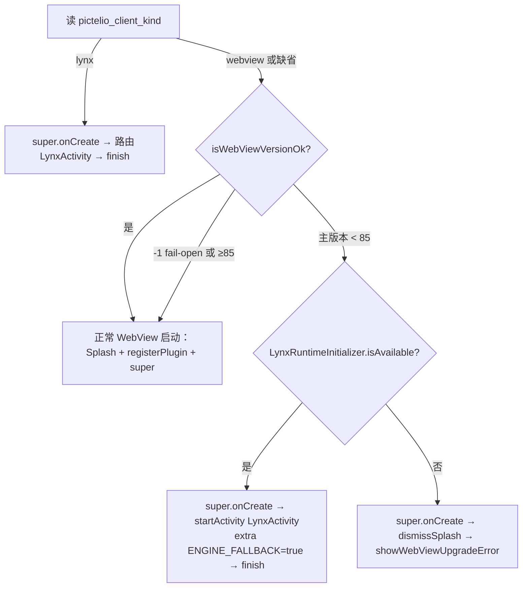

# Spec: 引擎可用性与降级（WebView 不可用时优先 Lynx）

- 状态：implemented（2026-09-11；app 1431 / app-lynx 993 / Java testFull 全绿；pictelio_low full 2/2 + webview 1/1 + pictelio_ui 6/6 E2E 通过；并已用模拟器手工截图三场景复核：pictelio_ui 正常路径、pictelio_low full 自动降级+提示条+键消费、pictelio_low webview-only 升级页。仅真机硬件批次待跑）
- 日期：2026-09-11
- 关联：ADR-0153（本方案决策）、ADR-0061 / ADR-0062 / ADR-0064 / ADR-0102、`packages/app/CONTEXT.md`（词条：首选引擎 / 生效引擎 / 引擎可用性 / 引擎降级）
- 来源：目标「WebView 层不符合时先看 Lynx 是否符合，符合则自动切 Lynx，不符合才弹静态升级页」（OS 层拦截不变）

## 1. 背景与目标

`full` 包当前在系统 WebView 主版本 < 85 时直接停在静态升级页（`MainActivity.showWebViewUpgradeError()`），而同一 APK 内的 Lynx 引擎（自绘渲染）不依赖系统 WebView，在 API 28+ 可用。

目标：**WebView 不可用时，若 Lynx 可用则本次以 Lynx 生效；Lynx 也不可用才显示升级页**。OS 层（`minSdkVersion = 28`）不变。

## 2. 非目标（Out of Scope）

- **不落盘首选引擎**：不改写 `pictelio_client_kind`；WebView 升级后下次启动自动回 webview。
- **不改 `-1` fail-open**：`getCurrentWebViewPackage()` 取不到版本时仍放行，不降级。
- **不做 Lynx 探针渲染**：判定在 LynxView 创建前完成；R8/行为类渲染失败不预判，交给 `LynxActivity` 现有错误兜底。
- **不动 `webview` / `lynx` 两个单引擎 flavor**；不动 `MainActivityWebview`。
- **不引入 static 会话标记**（与「用户显式切回 webview 时再次降级」冲突，见 ADR-0153 决策 5）。
- **不提升 `MIN_WEBVIEW_VERSION`**（`toSorted` 已知债务 ADR-0145 另议）。
- **不给 Lynx-only 包加任何 WebView 逻辑**。

## 3. 状态与判定

### 3.1 启动状态机（full 包 `MainActivity.onCreate`）



- 降级分支**镜像 lynx 分支的 Android 硬约束**：先 `super.onCreate(savedInstanceState)`，再 `startActivity` + `finish()`（BridgeActivity 会创建 WebView，浪费可接受，与 ADR-0062 现状一致）。
- 降级分支**不复制** lynx 分支的 `isTaskRoot()` 守卫：fallback 路径恒为 launcher / `CLEAR_TASK` 入口，不涉及 ADR-0102 的重建叠层场景。
- 降级分支**不转发** `benchNav` extras（bench 走显式切换，不走降级）。

### 3.2 引擎可用性判定

```java
// WebView（不变）
private boolean isWebViewVersionOk() {
    int major = getWebViewMajorVersion();
    if (major < 0) return true;                       // 检测失败 → 放行（fail-open）
    return major >= OAuthConfig.MIN_WEBVIEW_VERSION;  // 85
}

// Lynx（新增，src/lynx/java/LynxRuntimeInitializer.java）
public static boolean isAvailable(Application app) {
    try { ensureInitialized(app); }
    catch (Throwable t) { Log.w(TAG, "Lynx 初始化失败，判定不可用", t); return false; }
    return LynxEnv.inst().hasInited() && LynxEnv.inst().isNativeLibraryLoaded();
}
```

- **`hasInited()` 不作为唯一判据**：`init()` 在 `liblynx.so`/`liblynxtrace.so` 加载失败时吞 `UnsatisfiedLinkError` 正常返回，`hasInited()==true` 而 native 未加载；只有 `isNativeLibraryLoaded()` 是真信号。
- `isNativeLibraryLoaded()` 内部会触发 `lazyInitIfNeeded()`；本工程未设置 lazy initializer，无副作用。
- **不调用 `getLynxVersion()`**（硬编码 `"0.0.1"`）。

### 3.3 `LynxRuntimeInitializer` 幂等修复（前置）

现状 `initialized.compareAndSet(false, true)` 在初始化**之前**置位：`init()` 抛 `UnsatisfiedLinkError` 后标志仍为 `true`，同进程内重试永久短路。改为**成功才置位、失败不 latch**：

```java
/** 可测幂等状态机：成功才置位；动作抛异常则保持未初始化，允许重试 */
static final class InitGate {
    private boolean done;
    synchronized void run(Runnable action) {
        if (done) return;
        action.run();          // 抛异常 → done 保持 false
        done = true;
    }
    synchronized boolean isDone() { return done; }
}
```

`ensureInitialized` 改用 `GATE.run(...)`；`PictelioApp.initLynx` / `LynxActivity` 现有 catch 行为不变。

## 4. 原生改动（file-by-file）

### 4.1 `src/main/java/io/pictelio/app/EngineFallbackNotice.java`（新增）

```java
public final class EngineFallbackNotice {
    private EngineFallbackNotice() {}
    /** 一次性降级通知键（SharedPreferences "CapacitorStorage"）；与 app-lynx TS 常量契约比对 */
    public static final String KEY = "pictelio_engine_fallback_notice";
    public static final String VALUE_TRUE = "true";
}
```

### 4.2 `src/lynx/java/io/pictelio/app/LynxActivity.java`

- 新增常量 `public static final String EXTRA_ENGINE_FALLBACK = "pictelio_engine_fallback";`
- 成员 `private boolean engineFallbackEntry;`，`onCreate` 最前面读取 extra；为真时写通知键：

```java
engineFallbackEntry = getIntent().getBooleanExtra(EXTRA_ENGINE_FALLBACK, false);
if (engineFallbackEntry) {
    getSharedPreferences("CapacitorStorage", MODE_PRIVATE).edit()
        .putString(EngineFallbackNotice.KEY, EngineFallbackNotice.VALUE_TRUE).apply();
}
```

- 写键必须在 `LynxRuntimeInitializer.ensureInitialized` / `renderTemplateUrl` **之前**，保证 app-lynx 首帧能读到。
- `showErrorFallback` 按钮分支：
  - `engineFallbackEntry` → 单按钮「退出应用」→ `finish()`（此时 Activity 栈只剩本实例，退出到桌面）；
  - 否则 `hasWebviewClient()` → 保留「返回 WebView」（`switchBackToWebview()` 不变）。

### 4.3 `src/full/java/io/pictelio/app/MainActivity.java`

在 lynx 分支之后、`SplashController.keepVisible()` 之前插入：

```java
if (!isWebViewVersionOk() && LynxRuntimeInitializer.isAvailable(getApplication())) {
    // 降级：WebView 不可用但 Lynx 就绪 → 本次以 Lynx 生效（不写 pictelio_client_kind）
    super.onCreate(savedInstanceState);   // Android 硬约束（同 lynx 分支）
    Intent it = new Intent(this, LynxActivity.class);
    it.putExtra(LynxActivity.EXTRA_ENGINE_FALLBACK, true);
    startActivity(it);
    finish();
    return;
}
```

- `webview` 包编译期引用不到 `LynxRuntimeInitializer` / `LynxActivity`，故该分支**只能**出现在 full sourceSet；`MainActivityWebview` 不动。

## 5. app-lynx 改动

### 5.1 `src/utils/engineFallbackNotice.ts`（新增）

- `export const ENGINE_FALLBACK_NOTICE_KEY = 'pictelio_engine_fallback_notice';`（契约测试锚点）
- `consumeEngineFallbackNotice(): Promise<boolean>` —— 经现有 Prefs seam 读 `PictelioPrefs`（原生）/ IndexedDB（web-core dev）；值为 `'true'` 时 **remove 并返回 true**；否则 false。读失败 `console.warn` 后返回 false（禁止静默，遵守测试硬约束 3）。

### 5.2 `src/stores/engineFallbackStore.ts`（新增，Pinia setup store）

- state：`notice = ref(false)`；actions：`check()`（调 consume）、`dismiss()`（`notice.value = false`）。
- `check()` 在 `App.vue onMounted` 调用（与 `initClientSetting()` 同批）。

### 5.3 `src/App.vue`

- `notice` 为真时渲染 **M3 可关闭提示条**（复用 `exitHint` 的定位/胶囊语言，避免全宽盒吞点击——ADR-0123）：文案「WebView 版本过低，本次已改用 Lynx 引擎运行；更新 WebView 后将自动恢复。」+「知道了」按钮 → `dismiss()`。
- 每次降级入口都会重新写入键，因此「用户切回 webview 又被弹回 Lynx」时提示条再次出现（ADR-0153 决策 6）。

## 6. 边界与错误路径

| # | 场景 | 期望 |
|---|------|------|
| E1 | WebView < 85，Lynx 可用，首选 webview | 直达 `LynxActivity`；不写首选；升级页不可达 |
| E2 | WebView < 85，Lynx 不可用（`init` 抛 / `isNativeLibraryLoaded()==false`） | 升级页（现状行为） |
| E3 | WebView 版本取不到（`-1`） | 放行，走正常 WebView（不降级） |
| E4 | `webview` 单引擎包 + WebView < 85 | 升级页（`MainActivityWebview` 不变） |
| E5 | `lynx` 单引擎包 | 无 WebView 检查 |
| E6 | 降级进入 Lynx 后渲染失败 | 兜底页仅「退出应用」；无「返回 WebView」（切断回环） |
| E7 | 用户主动切到 Lynx，渲染失败 | 兜底页保留「返回 WebView」；清首选 → MainActivity → 若 WebView 仍不可用则再降级一次（带 extra）→ 失败只能退出（单次弹跳后终止） |
| E8 | 用户首选 lynx 但 Lynx 不可用 | `LynxActivity` 「Lynx 环境初始化失败」兜底页（现状）；「返回 WebView」→ MainActivity → `isAvailable()` 仍 false → 升级页 |
| E9 | 用户从 Lynx 设置显式切回 webview | 再次降级回 Lynx + 提示条（ADR-0153 决策 5；不做特殊分支） |
| E10 | WebView 被用户升级后重启 | `isWebViewVersionOk()` 通过 → 正常 WebView；首选未被改写 |
| E11 | 降级入口写通知键失败 | `.apply()` 不抛；仅少一次提示，不阻断启动（`Log.w`） |

## 7. 回归与兼容

- `pictelio_client_kind` 契约不变（full 包 lynx 分支、`ClientInfoPlugin` / `PictelioAppModule` 读写路径均不动）。
- `full` 包在 webview 首选 + WebView 过低时会先 `PictelioApp.warmUpWebView()` 再初始化 Lynx（两份一次性开销）；`PictelioApp` 不改（改动最小化）。
- `switch-client-roundtrip-low` 断言翻转属**预期行为变更**，非回归。

## 8. 测试

### 8.1 单元（Java，Robolectric/JUnit）

`packages/app/android/app/src/test/java/io/pictelio/app/LynxRuntimeInitializerTest.java`（新增）：
- `InitGate`：动作成功 → 第二次 `run` 跳过；动作抛 `RuntimeException`/`Error` → `isDone()==false` 且第二次 `run` 重新执行。
- （oracle：ADR-0153 决策「成功才置位、失败可重试」）

### 8.2 契约（vitest）

`packages/app/tests/unit/utils/engineFallbackNoticeConsistency.test.ts`（新增，沿用 `backupRulesConsistency.test.ts` 的源码字面量提取模式）：
- 从 `packages/app/android/app/src/main/java/io/pictelio/app/EngineFallbackNotice.java` 提取 `KEY` 字面量，与 `packages/app-lynx/src/utils/engineFallbackNotice.ts` 的 `ENGINE_FALLBACK_NOTICE_KEY` 比对相等。
- （oracle：Java 常量源码，不手写自洽 mock）

### 8.3 app-lynx store 单测

`packages/app-lynx/src/utils/engineFallbackNotice.test.ts`（新增）：
- 键存在 `'true'` → 返回 true、删除键；键缺失 → false 且不删；原生模块不可用 → false + `console.warn`。

### 8.4 Android E2E

- **翻转** `packages/app/tests/android-e2e/specs/switch-client-roundtrip-low.spec.ts` 第 2 条用例：写 `pictelio_client_kind=webview`（或清除）→ force-stop → 启动 → 断言 top activity == `io.pictelio.app.LynxActivity`（原断言为停在 `MainActivity` 升级页），并断言页面源码不含「WebView 版本过低」。
  - 新增第 3 条：从 Lynx 方向再写 `webview` 并重启，仍回 `LynxActivity`（E9）。
- **webview flavor 回归**：扩展 `tests/android-e2e/env.ts` 支持 `ANDROID_E2E_FLAVOR=webview`（APK 路径 `apk/webview/debug/`），新增/扩展用例断言 `MainActivityWebview` 显示升级页（E4）。
- 环境：`pictelio_low`（android-28 / WebView 66）、`ANDROID_E2E_BUILD_MODE=e2e`。

### 8.5 真机批次（T5）

WebView 66 级别真机（或将 WebView 降级的设备）冷启直达 Lynx；提示条可见可关；环境 WebView 升级后自动回 webview。

## 9. 文档

- `docs/adr/ADR-0153-engine-availability-fallback.md`（已写）。
- `packages/app/CONTEXT.md`：新增「引擎可用性与降级」词条（已写）。
- `docs/platform-compatibility.md`：「不满足时的行为」列改为 **full 包优先降级 Lynx（可用时）；Lynx 不可用或单引擎包显示静态升级页**，并在实现细节段补判定口径。
- `docs/android-e2e-gate.md` + `docs/adr/ADR-0061` 记录被推翻（ADR 不回溯修改，由 ADR-0153 声明取代）。
- `openwiki/` **不动**（CI 定时重生成）。
