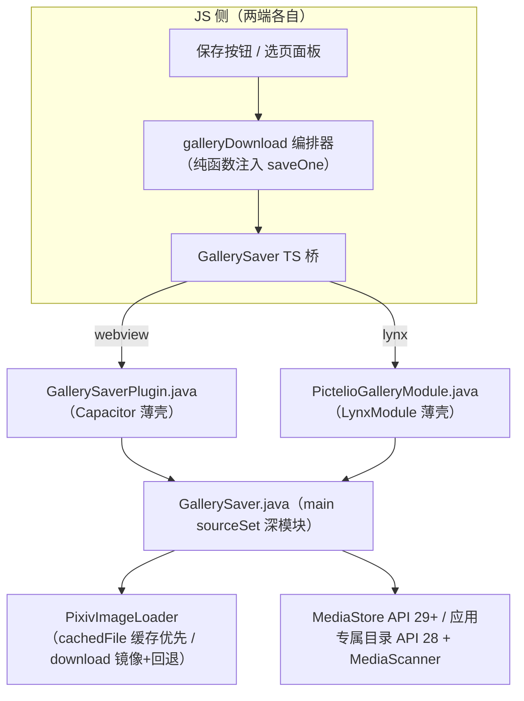

# Spec: 作品图片保存（单图保存 / 多图选页 / 批量下载）

- 状态：draft → accepted（自主模式：用户未参与 Grill，假设见 §8，可推翻重排）
- 日期：2026-09-10
- 关联：ADR-0145（待写，提交前补）；复用 ADR-0037（PixivApiPlugin 网关）、ADR-0143（图床下载源 Java 侧）、ADR-0125/0127/0128（ugoira 管线，本次不触碰）

## 1. 背景与目标

两端客户端（`pictelio-app` WebView 引擎 + `pictelio-app-lynx` Lynx 引擎）目前只能「看」不能「存」：全仓无任何 MediaStore / 相册写入代码（已 grep 核验）。本 spec 新增作品图片保存能力，功能族三件套：

1. **单图保存**：单页作品一键保存；多页作品在全屏查看器内保存当前页。
2. **多图选页**：多页作品保存时弹出缩略图选页面板（多选 / 全选）。
3. **批量下载**：作品级批量——选页面板全选（或一键全部）后批量保存，逐张进度 + 失败汇报。

## 2. 非目标（Out of Scope）

- **列表级跨作品批量下载**（在 Feed / 收藏 / 用户作品列表多选多个作品）——UI 面积大，需独立 Grill；本 spec 的「批量」= 单作品多页。
- **ugoira 动图保存**（zip / GIF / MP4 导出是格式深水区，另立项）。
- **保存去重**（同文件重复保存 → MediaStore 29+ 自动加 " (1)" 后缀；API 28 回退路径覆盖同名文件）。
- **原图以外的画质选项**（保存恒为原图；缺失时沿既有 `originalImageUrls()` 语义回退 large）。
- **iOS**（项目仅 Android）。

## 3. 架构（深模块 + 两端薄适配器）



### D1 原生深模块 `GallerySaver.java`（src/main，双引擎共享）

- 入口：`static SaveResult save(Context, PixivImageLoader, String officialUrl, String fileName)`。
- 字节获取：**缓存优先**——`PixivImageLoader.cachedFile(officialUrl)` 命中直接读文件（零下载）；未命中 `PixivImageLoader.download(officialUrl)`（图床 resolve + 镜像失败官方回退 + Referer/UA 注入全部复用，ADR-0143 语义不动）。字节在 Java 堆瞬时存在（与 `downloadZipOnce` / `loadBytes` 既有先例一致），不进 JS 堆。
- 落盘：
  - **API ≥ 29**：`MediaStore.Images` + `RELATIVE_PATH = Pictures/Pictelio`，`IS_PENDING` 两段式写入，返回 `content://` URI。
  - **API 28（minSdk）**：无权限方案——写应用专属外部目录 `getExternalFilesDir(Pictures)/Pictelio/`，`MediaScannerConnection.scanFile` 尽力入库（不给系统弹权限，避免两端各自实现权限管线；图库可见性在该 API 段为尽力而为，文档声明）。
- 防御：`fileName` 由 JS 生成，Java 侧剥离路径分隔符与控制字符（`sanitizeFileName`，纯函数可测）。
- mime/ext：从 URL 尾段推断（jpg/jpeg/png/gif/webp，默认 jpg）；`mimeFor(url)` / `extFor(url)` 纯函数。
- 失败：非 2xx / 空 body / MediaStore insert 返回 null / IO 异常 → 抛 `IOException`（消息可读），薄壳映射为 reject/错误回调——**无静默降级**。

### D2 两端薄壳（只做参数校验 + 线程 + 结果映射）

- **webview**：`GallerySaverPlugin`（`@CapacitorPlugin(name="GallerySaver")`），`@PluginMethod saveImage({url, fileName}) → {uri}`；阻塞执行（与 `PixivApiPlugin.request` 同姿态）；在 `MainActivity`（full）与 `MainActivityWebview` 两处 `registerPlugin`。
- **lynx**：`PictelioGalleryModule`（`@LynxMethod saveImage(url, fileName, cb)`），`cb(uri, "")` / `cb("", errMsg)`（**无 null 回调契约**，`PictelioApiModule` 同款）；独立 `CachedThreadPool`；`LynxRuntimeInitializer` 全局注册 `"PictelioGallery"`。

### D3 桥契约（两端同形，跨端契约测试锚定）

```
入参: { url: 官方原图 URL, fileName: "Pictelio_<illustId>[_p<N>].<ext>" }
出参: { uri: string }   // content:// 或 file:// 绝对路径
```

- 文件名**单一事实源在 JS**：`buildSaveFileName(illustId, page?, url)` 纯函数（两端同源复制 + 同规格测试，oracle = 本 spec §5；与 `resolvePageSrcs` 双端同源复制惯例一致）。
- app web 回退：`registerPlugin` 的 web 实现 = fetch 代理 URL → blob → `<a download>` 触发浏览器下载（开发便利，非产品路径）。
- lynx web-core：无 NativeModules → 显式失败信息「当前环境不支持保存到相册」+ console.warn（无静默）。

## 4. JS 编排器（`galleryDownload.ts`，两端同源复制）

```
saveIllustPages({ illust, pages: number[], saveOne, onProgress })
→ { saved: number; failures: Array<{ page: number; message: string }> }
```

- 顺序逐张保存（1 并发：对 CDN 温和、失败定位简单；原图可达数十 MB）。
- `pages` 为选中页号数组（0-based）；空数组直接返回零结果（no-op）。
- 逐张完成后回调 `onProgress(done, total, currentPage)`，供 UI 显示「保存中 done/total」。
- 单张失败不中断批次（聚合 `failures`），结束后由 UI 汇报（toast / 状态文本）+ `console.warn` 明细。
- `originalPageUrls(illust)` 纯函数：多页 `meta_pages[].image_urls.original ?? large`，单页 `meta_single_page.original_image_url ?? large`（与 `IllustDetail.originalImageUrls()` 逐字同语义；app 端路由改为复用本函数）。

## 5. UI 行为

### app（SolidJS / Fluent）

| 面                         | 行为                                                                                                                                                                                                               |
| -------------------------- | ------------------------------------------------------------------------------------------------------------------------------------------------------------------------------------------------------------------ |
| `BottomActionBar`          | 新增「保存」按钮（收藏/评论同级，非 ugoira 显示）。单页作品点击直接保存（按钮内联「保存中…」）；多页作品点击打开选页面板。                                                                                         |
| 选页面板 `PagePickerSheet` | 基于 `FluentDialog`：medium 缩略图网格 + 选中遮罩✓；头部「全选/清除」；底部「已选 n · 保存」；确认后关闭面板，toast 汇报进度与结果（复用 `toastMessage` 通道，进度文案独立信号避免 2.5s 自动隐藏误伤进行中状态）。 |
| `ImageViewer`              | 右上角新增保存按钮（40×40 overlay token，与左上关闭镜像）；点击保存当前页；进行中转圈、成功✓ 1.2s、失败✗ + console.warn（查看器内无 toast 通道，状态内联在按钮上）。                                               |
| toast                      | `已保存 n 张到相册` / `保存完成 x/y，z 张失败`；失败明细 console.warn。                                                                                                                                            |

### app-lynx（Vue / M3 Tailwind）

| 面                             | 行为                                                                                                                                                                                          |
| ------------------------------ | --------------------------------------------------------------------------------------------------------------------------------------------------------------------------------------------- |
| `IllustDetail.vue` 操作行      | `BookmarkButton` 旁新增「保存」按钮（非 ugoira 显示）；语义同 app：单页直存、多页开面板。                                                                                                     |
| 选页面板 `PagePickerSheet.vue` | `absolute inset-0` 覆盖层（CommentOverlay 同款挂载契约，DOM 在 scroll-view 之后）；3 列缩略图 + 选中遮罩；全选/清除 + 「已选 n · 保存」；保存中/结果状态内联在面板底部（lynx 无全局 toast）。 |
| 不可用环境                     | web-core 下点保存 → 面板/按钮报「当前环境不支持保存到相册」。                                                                                                                                 |

## 6. 测试策略（硬约束映射）

| 层          | 用例                                                                                            | oracle                                                             |
| ----------- | ----------------------------------------------------------------------------------------------- | ------------------------------------------------------------------ |
| Java 纯函数 | `sanitizeFileName` / `mimeFor` / `extFor`                                                       | 本 spec §3/§5 字面规则                                             |
| Java IO     | API 28 回退：文件写入 app-ext 目录 + 命名                                                       | 真实文件系统（Robolectric temp）                                   |
| Java IO     | MediaStore values 构造（display_name / relative_path / mime / pending）                         | 纯函数 `buildImageValues`；insert 返回 null → IOException 失败路径 |
| Java IO     | 缓存命中路径（loader.cachedFile 命中零下载）/ 未命中走 download                                 | 注入 loader 假件                                                   |
| TS 纯函数   | `buildSaveFileName` / `originalPageUrls` / 编排器（成功序、失败聚合、空选 no-op、进度回调次数） | spec §4/§5 + 真实 Pixiv 响应样例形态                               |
| TS 桥       | app web 回退（anchor 触发）/ lynx 无原生模块显式失败                                            | 桥契约 §3                                                          |
| 组件        | PagePickerSheet（渲染页数、勾选/全选、确认回调参数）                                            | spec §5                                                            |
| E2E         | agent-browser：详情页保存入口 → 面板 → 确认 → 结果 toast（web 回退路径 spy anchor）             | 用户可达路径原则                                                   |

## 7. 验收清单

- [ ] app：单页作品 → 底部条保存 → 相册出现 `Pictelio_<id>.jpg`（API 34 模拟器）
- [ ] app：多页作品 → 选页面板勾选部分页 → 保存成功且仅保存所选
- [ ] app：查看器内保存当前页成功
- [ ] lynx：同三场景（原生 LynxView）
- [ ] 批量中途单张失败 → 不中断、末尾可见失败汇报
- [ ] ugoira 作品不显示保存入口
- [ ] 全部门禁绿：`check:all` / `lint` / `test:app` / `test:app-lynx` / Java 单测 / `fmt:check`

## 8. 假设记录（用户未应答 Grill，可推翻）

| #   | 假设                                                  | 备选                                   |
| --- | ----------------------------------------------------- | -------------------------------------- |
| A1  | 「多图选页」为保存服务的选页                          | 阅读跳页面板（既有楼梯导航已覆盖跳页） |
| A2  | 「批量下载」= 作品级全部页批量                        | 列表级跨作品多选批量（需独立立项）     |
| A3  | 保存目标 = 系统相册（MediaStore）为主                 | 仅应用专属目录（不可见相册，弱需求）   |
| A4  | 画质恒原图                                            | 跟随 detailQuality 档位                |
| A5  | ugoira 不做                                           | zip 导出                               |
| A6  | 入口 = 详情底部条/操作行 + 查看器，不做 Feed 卡片入口 | 卡片长按菜单                           |
