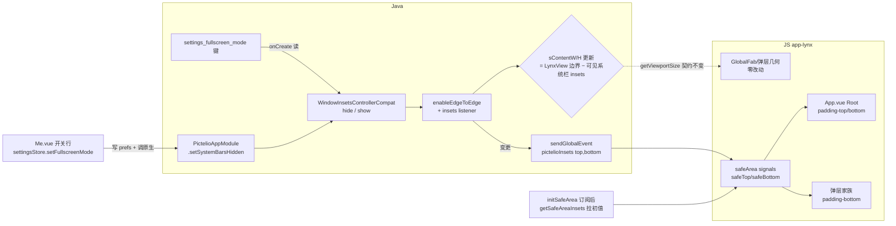

# lynx 系统栏策略：基底边到边 + 全屏模式开关 —— 功能规格

> 来源：wayfinder 地图 [#591](https://github.com/a1121611810/Pictelio/issues/591)；决策票 [#595](https://github.com/a1121611810/Pictelio/issues/595)（组合案拍板）；研究 [#592](https://github.com/a1121611810/Pictelio/issues/592)（平台事实，报告分支 `research/android-system-bars-facts`）/ [#593](https://github.com/a1121611810/Pictelio/issues/593)（Lynx 能力，分支 `research/lynx-insets-capability`）；基线 [#594](https://github.com/a1121611810/Pictelio/issues/594)（分支 `research/systembars-baseline`）。
>
> ADR 落点：**ADR-0168**（编号以落地时为准），随实施首票提交（docs-before-commit 惯例）；§9 列草案要点。
> 状态：spec 终稿，待 to-tickets。

## 1. Problem Statement

现状（#594 基线实证）：Android ≤14 上系统栏为独立条（API 34 黑/API 28 灰）与浅色 UI 割裂；Android 15+ 设备上 targetSdk 36 已被系统**强制边到边**而 LynxActivity/app-lynx **零 insets 补偿**（#592 F1.1/F1.2 文档锚定）——即现状在 15+ 是潜伏遮挡 bug、在 ≤14 是视觉割裂，且同一 APK 双形态分裂。

拍板方案（#595）：**基底固定边到边**（全版本形态一致，状态栏区域染 App surface 色 = 用户「着色」诉求的平台正确实现）+ **设置内「全屏模式」开关**（隐藏系统栏，opt-in 沉浸）。着色方案出局；不做 e2e on/off 开关（15+ 系统强制无法关闭，开关会静默失效）。

## 2. Decisions（ADR-0168 映射）

| # | 决策 | 结论 | 依据 |
|---|------|------|------|
| D1 | 基底 e2e | `WindowCompat.enableEdgeToEdge(window)` 于 `LynxActivity.onCreate`（`installSplashScreen` 与 `super.onCreate` 之后、`setContentView` 之前） | #592 F4.2；一行兼容 API 28→35+，自动处理透明/scrim/cutout |
| D2 | insets 管线 | 原生 `setOnApplyWindowInsetsListener(lynxView)` → JS 订阅 `pictelioInsets` 事件后经 **`PictelioAppModule.getSafeAreaInsets(cb)` 拉取初值**（数值载荷 `[top, bottom]`），后续变化由事件推送；JS 侧 `GlobalEventEmitter.addListener`（router.ts:315 `pictelioBack` 同款先例）。**修订（T1 实现期）**：初值从「globalProps 预注入」改为「订阅后拉取」——insets 首次分发发生在视图 attach 期，早于 JS 订阅（benchNav 四次广播同族竞态），纯推模式首帧必丢；拉取消除该竞态且少一个契约面 | #593：lynx JS 零内置 insets 通道；维护者口径 = 原生注入 |
| D3 | 可视内容区语义保持 | `LynxActivity.sContentW/H`（ADR-0131）改为「LynxView 边界 − 当前可见系统栏 insets」，随 insets 回调更新 → **`getViewportSize` 对 JS 的契约语义不变**（可视内容区），GlobalFab/viewportGeometry/弹层定位**零改动** | #594：现语义=窗口−双栏；e2e 后 LynxView 布局变全屏，不减 insets 则 FAB 贴手势条 |
| D4 | 状态栏图标深浅固定 | `isAppearanceLightStatusBars = true` 恒定（enableEdgeToEdge 之后覆盖调用）：app-lynx 无暗色 UI（全仓零 `prefers-color-scheme`），浅色底配深图标；lynx 暗色模式落地时再联动 | #592 F4.1：e2e 下唯一正规途径；避免系统暗色时 enableEdgeToEdge 联动出白图标 |
| D5 | 全屏模式开关 | 设置键 `settings_fullscreen_mode`（"true"/"false"，**默认 false**，设备级、随备份域）；UI 行在 Me.vue 设置卡；写键 + 调新增 `PictelioAppModule.setSystemBarsHidden(hidden, cb)`（`WindowInsetsControllerCompat` hide/show + `BEHAVIOR_SHOW_TRANSIENT_BARS_BY_SWIPE`）；冷启动 LynxActivity 读同键重设（F3.2：hide 在窗口获得控制权即生效，onCreate 调用安全） | #595；immersive 运行时可切可逆、compat 覆盖 API 28+ |
| D6 | 三键 scrim 保留缺省 | 保留 enableEdgeToEdge 缺省（三键导航 nav bar 80% scrim，随系统亮暗）；不调 `setNavigationBarContrastEnforced(false)` | 可读性兜底；后续一行可关，不入首批 |
| D7 | 显式排除 | 不做 e2e on/off 开关；不做状态栏着色（`setStatusBarColor` 15+ 静默透明）；IllustDetail/图片查看器全 bleed 沉浸**不入首批** | #595 裁决；#592 F2.1 |

## 3. 数据流

冷启动顺序：`installSplashScreen` → `super.onCreate` → `EdgeToEdge.enable(this)`（实际解析 androidx.activity 1.8.0，Java 入口为静态 `EdgeToEdge.enable`；core 无 `WindowCompat.enableEdgeToEdge` 变体——#592 报告 F4.2 该点已实证修正）→ 图标深浅覆盖（D4）→ 建 LynxView → `setContentView` → insets listener 注册 → `renderTemplateUrl` → JS 订阅后拉取初值（`getSafeAreaInsets`）。

## 4. 模块接口

### 4.1 Java（`src/lynx/`）

| 元素 | 签名/位置 | 语义与不变量 |
|------|----------|-------------|
| insets 监听 | `LynxActivity`，`lynxView.setOnApplyWindowInsetsListener`（API 20+） | 消费 `WindowInsetsCompat.Type.systemBars()` + `displayCutout()`；记录 `sInsetTop/Bottom`；重算 `sContentW/H`（D3）；值变化才发事件（防抖重复回调） |
| 初值拉取 | `@LynxMethod getSafeAreaInsets(Callback)`（`PictelioAppModule`） | `cb(top, bottom)` 数值 px；异常 `cb(0, 0)`（不抛）；JS 订阅事件后调用 |
| insets 事件 | `lynxView.sendGlobalEvent("pictelioInsets", JavaOnlyArray.of(top, bottom))` | 事件名/载荷顺序为 JS↔Java 契约（契约测试钉住） |
| 全屏切换 | `@LynxMethod setSystemBarsHidden(boolean hidden, Callback cb)`（`PictelioAppModule`） | `WindowInsetsControllerCompat(window, decorView)`：hide/show `Type.systemBars()` + behavior transient-swipe；主线程执行；cb 沿用 null-free 惯例 |
| 冷启动重设 | `LynxActivity.onCreate` 读 `SharedPreferences("CapacitorStorage")` 键 `settings_fullscreen_mode`（与 settingsStore 写入同键，`autoFallbackEngine` 双端共享先例） | `"true"` 时 apply hide；Activity 重建自动重设（F3.2） |

### 4.2 JS（`packages/app-lynx/`）

| 元素 | 位置 | 语义与不变量 |
|------|------|-------------|
| safeArea signals | 新 `src/utils/safeArea.ts`：`safeTop()`/`safeBottom()`（module-level ref）+ `initSafeArea()`（App.vue onMounted 调用） | `addListener('pictelioInsets', ...)` 后**立即拉取** `NativeModules.PictelioApp.getSafeAreaInsets` 初值（订阅后拉，spec D2 修订）；事件更新；emitter/NativeModules 不可用（web-core 预览）→ 恒 0 + 一次性 warn（router:317 先例） |
| Root 适配 | `App.vue` 根 `<page>`：`:style="{ paddingTop: safeTop()+'px', paddingBottom: safeBottom()+'px' }"` | 系统栏区域染 Root surface 色 = 「着色」效果的正确实现；列表/内容天然不被遮挡 |
| 弹层底部 | 弹层家族根容器补 `padding-bottom: safeBottom`：SearchSheet、CommentOverlay、NovelExportSheet、NovelCaptionSheet、PagePickerSheet、WatchlistPromptDialog、BookmarkPanel（top-[20vh]+h-[80vh] 与贴底等价）；WatchlistPromptDialog 居中不触底，实际不消费（契约测试钉住偏离）。实现为面板末尾 spacer `<view :style="{ height: safeBottom + 'px' }" />`（规避 vw/padding 类覆盖语义） | absolute `bottom-0` 定位不受父 padding 影响，需各自消费；复用同一 composable |
| 全屏开关状态 | `settingsStore`：`_fullscreenMode` ref + `setFullscreenMode(enabled)`（写 prefs 键 + 非静默 catch warn + 原生模式下调 `NativeModules.PictelioApp.setSystemBarsHidden`）；`loadSettings()` 恢复（损坏值 warn 维持默认，既有模式） | dev/web-core 无 NativeModules → 仅写键，catch 静默跳过原生调用（console.debug 可见） |
| 设置 UI | `Me.vue` 设置卡新增行（复用 `autoFallbackEngine` 行式样：标题 + M3 switch）+ i18n key（`me.client.fullscreenMode` 标题/副文案，双语言，跟随 Me 页既有命名空间） | 开关即时生效（走原生调用），无需重启 |
| 开关 UI 统一 | 开关 UI 由 `<M3Switch>` 组件统一（[ADR-0179](../adr/ADR-0179-app-lynx-m3-switch-component.md)）；新增开关必须经组件，禁止新增 inline 开关 markup | 12 处 inline markup 已收口，drift 免疫；future M3 规范升级 / token 改名仅 1 处改 |

### 4.3 契约锚点（契约测试钉住，`backupRulesConsistency` 模式）

- 键名 `settings_fullscreen_mode`：`settingsStore.ts` ↔ `LynxActivity`（Java 常量）
- 事件名 `pictelioInsets` + 载荷 `[top, bottom]` 顺序：`safeArea.ts` ↔ `LynxActivity`
- 拉取方法 `getSafeAreaInsets`（回调 `(top, bottom)`）：`safeArea.ts` ↔ `PictelioAppModule`

## 5. 状态与边界

| 场景 | 行为 |
|------|------|
| 首次初值 | JS `initSafeArea()` 订阅事件后立即拉取 `getSafeAreaInsets` → 首帧 padding 即正确（无闪 0）；事件只管后续变化 |
| 旋转/折叠屏 | `onApplyWindowInsets` 重新回调 → contentSize 重算 + 事件再发（数值载荷自描述） |
| 全屏模式开启 | systemBars insets=0 → 事件 `(t, 0)` → Root bottom-padding 归零、列表/FAB 扩展到手势区；transient bars 短暂出现时 insets 回调恢复、收起再归零（框架保证重应用，F3.2） |
| 键盘 | 不消费 `ime()` insets——键盘回避由 SDK 内建（KeyboardMonitor），行为与现状一致 |
| 三键导航设备 | nav bar 80% scrim（D6 缺省）；全屏模式 hide 导航条后边缘上滑唤出 |
| Android 15/16 强制 e2e | enableEdgeToEdge 与强制行为等价（幂等），双门控两侧形态一致；16 设备预测性返回不受影响（OnBackPressedDispatcher 路径） |
| web-core 预览 | 无 native：signals 恒 0 → padding 0 = 现状等价（预览不假红）；globalProps 类型可选链保护 |
| 冷启动全屏模式 | onCreate 读键 hide；bundle 渲染期间 splash 覆盖，无视觉跳变 |
| 设置写入失败 | prefs catch warn（不静默）；原生调用失败 cb 错误串 + warn，开关 UI 回读真实状态 |

## 6. 测试计划

**Java 单测（Robolectric）**：
1. insets→contentSize 计算（给定模拟 insets 断言 `contentSize()` = 边界−可见栏；覆盖「全屏隐藏→bottom=0」翻转）——oracle = D3 + #594 数值基线
2. `settings_fullscreen_mode` 键读取（true/false/缺失/损坏）
3. `setSystemBarsHidden`：静态核心 `applySystemBarsHidden` 由 Robolectric 断言（legacy 全屏位 + 导航栏隐藏位）；模块包装的 runOnUiThread 分支不单独测（LynxContext 构造不可测），归 T4 真机矩阵覆盖

**JS 单测（vitest + happy-dom）**：
1. safeArea signals：订阅后拉取初值 / 事件更新 / 无 native 恒 0 + warn 一次
2. settingsStore fullscreen：写键、损坏值 warn 维持默认、dev 模式跳过原生调用
3. Root/弹层 padding 绑定（模板结构断言，oracle = 本 spec §4.2）

**契约测试**：§4.3 三锚点（JS↔Java 字面量比对，任一漂移红灯）。

**模拟器验收（#594 同方法：dumpsys + activity top + screencap）**：
- API 34（pictelio_ui）：LynxView 边界 = 全屏 1080×2160；`getViewportSize` 返回值仍 ≈ 1080×2016；状态栏区域染 surface 色（对比基线截图）；FAB 位置像素不变
- API 28（pictelio_low）：三键 scrim 形态确认（#592 F4.2 落地验证）；全屏开关 hide 导航条 + 边缘唤出
- API 36：镜像就绪时跑同矩阵（阻塞记录见 #594 报告 §三）；未就绪则文档锚定 + 实施票挂账
- 开关即时性：tap → 截图帧内系统栏消失（无重启）

## 7. 实施切片建议（to-tickets 输入）

| 票 | 内容 | 依赖 |
|----|------|------|
| T1 Java 骨架 | D1/D2/D3/D4：e2e + insets listener + contentSize 迁移 + getSafeAreaInsets/事件 + setSystemBarsHidden + 冷启动读键（含 Java 单测） | — |
| T2 JS 适配 | safeArea store + Root padding + 弹层家族 + 契约测试（含 JS 单测 + 预览回归） | T1（事件/载荷契约） |
| T3 全屏开关 | settingsStore + Me.vue 行 + i18n keys + 原生调用接线 | T1 |
| T4 验收矩阵 | §6 模拟器验收 + 截图对比 + ADR-0168 落盘（docs-before-commit） | T1-T3 |

## 8. Glossary 同步

`packages/app-lynx/CONTEXT.md` 增补：**基底边到边（edge-to-edge base）**= 窗口内容延伸至系统栏下的固定布局基底，Android 15+ 由系统强制；**全屏模式（fullscreen mode）**= 设置开关控制的隐藏系统栏沉浸态，运行时可逆；**可视内容区（visible content area）**= 窗口减当前可见系统栏 insets 的区域，`getViewportSize` 的返回语义（ADR-0131，本 spec D3 保持）。

## 9. ADR-0168 草案要点

- **难逆**：窗口模式 + insets 管线 + 设置键三处联动，回退=二次迁移
- **无上下文会困惑**：为什么没有「边到边开关」（15+ 静默失效）；为什么全屏是设置开关而基底不是；为什么 getViewportSize 不返回全屏
- **真实权衡**：三候选（着色/e2e/全屏）× 平台强约束 → 组合案；Root 全局 padding（保底正确）vs 逐页全 bleed（沉浸优先）取前者，图片查看器后置
- 决策记录 = 本 spec §2 D1-D7 + 依据列
