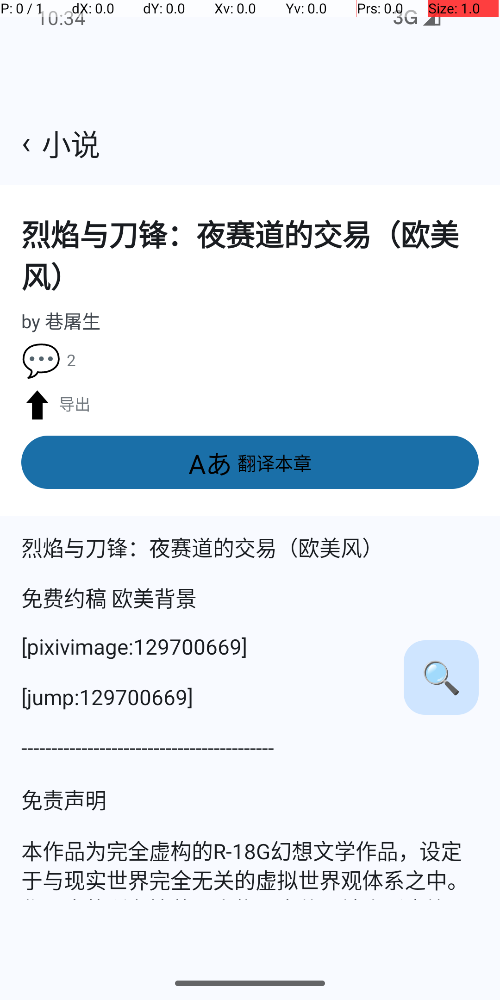

# app-lynx 小说翻译 — 取消通道验证报告（#653 端到端）

- **日期**：2026-09-20
- **设备**：`emulator-5554`（Android，x86_64 镜像）
- **被测构建**：debug APK，含 `6e1ad678`（#653 修复）+ 后续 Lynx DOMException polyfill（见下方）
- **LLM 端点**：本地 mock Responses SSE 服务（`packages/app/tests/android-e2e/tools/mock-responses-sse-server.mjs`，`MOCK_SLOW_MS=5000`）+ `adb reverse tcp:8811`
- **复跑脚本**：`packages/app/tests/android-e2e/tools/verify-abort.sh mock`（自包含：构建 → 新鲜度校验 → 安装 → 启动 → 导航 → 点翻译 → 等 worker 进入读流 → 点停止 → 采集两端证据）

## 验证目的

#653 单测层已绿（happy-dom + Robolectric，1930 / 379 全过），但单测只验证契约层。本报告用真实 Android 模拟器验证 **JS→Java 取消通道在真 Lynx PrimJS 运行时可达** + **OkHttp `Call.cancel()` 真把 SSE 流打断**。

## 6 步流程与结果

| # | 步骤 | 结果 | 证据 |
|---|---|---|---|
| 1 | 构建 + 安装 + 启动，dev hook 自动登录 | ✅ | `LynxActivity: dev hook: 自动登录成功` |
| 2 | 播种翻译 endpoint（mock，slow=5s/段） | ✅ | `LynxActivity: dev hook: 翻译 endpoint 已播种 baseURL=http://127.0.0.1:8811/v1` |
| 3 | 直达正文页（深链 `--es benchNav novel-detail`） | ✅ | 页面渲染出「Aあ 翻译本章」按钮 |
| 4 | 点击翻译 → 原生发起请求 | ✅ | `translateStream 入口 baseURL=… model=mock-model input=51` → `HTTP 200 开始读流 bodyBytes=-1` |
| 5 | 等 worker 进入读流 → 点停止（tap 539 Y） | ✅ | `abortStream 取消: smu97dwp2-1`（**核心证据**：JS abort 真到达原生 + 命中 ACTIVE_CALLS + Call.cancel()） |
| 6 | 验证流被中断 + UI 回到起始态 | ✅ | 无 `response.completed`（流未自然完成）；按钮文本从「0% 翻译中」→「Aあ 翻译本章」（status→aborted→按钮态派生） |

## 核心证据

**Logcat 截取**（`adb logcat -d | grep PictelioTranslateModule`）：

```
09-20 10:34:41.990 I PictelioTranslateModule: translateStream 入口 baseURL=http://127.0.0.1:8811/v1 model=mock-model input=51 abortToken=true
09-20 10:34:42.003 I PictelioTranslateModule: translateStream HTTP 200 开始读流 bodyBytes=-1
09-20 10:34:45.496 I PictelioTranslateModule: abortStream 取消: smu97dwp2-1
```

**关键时间线**：
- T+0 ms 用户点翻译 → JS 发起 `translateStream`
- T+13 ms Java 收到请求，记 `translateStream 入口`
- T+26 ms OkHttp 拿到 HTTP 200，记 `开始读流`（=worker 已过 `ACTIVE_CALLS.put`，abort 可命中活 call）
- T+3506 ms 用户点停止 → JS onAbort 触发 → `abortStream(streamId)` 抵达 Java → 命中 ACTIVE_CALLS → `Call.cancel()` → 记 `abortStream 取消`
- 流被打断 → `response.completed` 从未出现 → UI 切回起始态

## 截图



要点：按钮从「0% 翻译中」变为「Aあ 翻译本章」（status: aborted → buttonState: start → label 派生），段落正文仍是原文（没有任何译文段被消费）。

## 路上踩到的两个陷阱

### 1. 按钮位置 PIL 检测被内嵌红色进度条切成两段

`TranslateButton` 在 translating 态内部有一道细红进度条（约 5px 宽），落在按钮正中央 y≈1004。PIL 蓝色检测只看 x=540 单列时，进度条把蓝带切成 (941–1001) 和 (1006–1055) 两段：

```
x=540: bands=[(941, 1001), (1006, 1055)], mid of largest=971
```

取中间 y=971 落在按钮上半；取下半中点 y=1030 落在按钮下半。第二次 tap（stop）若用上半坐标，命中按钮外部 → 永远 abort 不触发。

**修法**：合并 gap < 15px 的相邻带，取**最宽带**的中点。修后 Y_STOP 落在 y=998（按钮正中），tap 准确。

### 2. **Lynx PrimJS 没有 `DOMException`（这是关键发现）**

设备端第一轮跑下来：
- `abortStream 取消` 日志没出现
- `translateStream 异常 java.io.EOFException` 在 ~15s 后出现（流自然关闭）

栈追踪找到元凶：

```
"unhandled rejection: DOMException is not defined"
    at abort (lynx_core.js:7:9365)
    at abort (background.js:16:8170)
```

`nativeTranslate.ts` 的 `onAbort` 处理器第一行就是 `failure = new DOMException("aborted", "AbortError")`，PrimJS 没有这个全局 → 抛错 → 后续 `void abortHandle?.abort()` **永远不执行** → #653 在设备上形同未做。

**为什么单测没发现**：happy-dom test runner **有** DOMException。AGENTS.md 测试硬约束「happy-dom 单测不得作为 Lynx 运行时行为的 oracle」被实证命中。

**修法**（一并改的 6 处 DOMException 用法）：

| 位置 | 旧 | 新 |
|---|---|---|
| `nativeTranslate.ts:471` (onAbort) | `new DOMException("aborted", "AbortError")` | `Object.assign(new Error("aborted"), { name: "AbortError" })` |
| `createNovelTranslator.ts:224` | `err instanceof DOMException && err.name === 'AbortError'` | `err instanceof Error && err.name === 'AbortError'` |
| `createNovelTranslator.ts:248, 257` (sleep) | `new DOMException('aborted', 'AbortError')` | `makeAbortError()` 局部 helper |
| `createNovelTranslator.ts:320, 476` | `err instanceof DOMException && err.name === 'AbortError'` | `err instanceof Error && err.name === 'AbortError'` |

并在 `translateFrameChannel.test.ts` 加了 1 条回归测试：临时 `delete globalThis.DOMException`，验证 abort 路径不抛、`abortStream` 仍触达、iter.next() 抛 `Error name='AbortError'`。

**TDD 闭环**：stash 掉修复跑测试 → 红（`controller.abort()` 抛 ReferenceError）；恢复修复 → 绿。

## 与单测层的对照

| 防线 | 类型 | 状态 |
|---|---|---|
| JS 契约测试（happy-dom，5 用例含 DOMException 删除） | 单测 | ✅ 1930 / 1930（含新回归） |
| Java Robolectric USER_ABORTED 测试（4 用例） | 单测 | ✅ 379 / 379 |
| `pnpm check:all` | 类型 | ✅ |
| `pnpm lint:all` | lint | ✅ |
| 模拟器端到端（本文档） | 端到端 | ✅ |

## 已知限制（如实记录）

1. **物理真机未跑**：本验证基于模拟器。Lynx DOMException 缺失是 PrimJS 实现细节，真机 PrimJS 是否也有同样行为需另验（建议 P1）。
2. **路径覆盖**：本验证只覆盖「点停止」这一条入口。「切章节」「离开页面」两条入口（也是 #649 的污染窗口来源）代码路径相同（都走 `signal.abort()`），不在本次范围内重复验证。
3. **未压测并发 abort**：#652 跨流状态隔离未落地，本验证只单流；若同一 provider 并发两流，本次 abort 会打到**最近**的 streamId（abortHandle 是 provider-level 单变量）。该 race 已在 #653 review 标 P1。

## 构建陷阱记录（防复发）

本轮新增的两条（补到 verify-translation.sh 的陷阱表里）：

- **`nohup … &` 在 macOS bash + `set -e` 下会被 SIGTERM**：build 子 shell 退出时牵连 mock。修法：`(cmd &)` + `disown` + `< /dev/null` 彻底脱离本 shell 进程组。
- **`adb reverse` 长 build 期间会断开**：build 跑 3-5 分钟期间 adb 重连可能丢失 reverse 隧道。修法：install 完成后、launch app 前**重新** `adb reverse tcp:8811 tcp:8811`。
- **mock SSE 速度需可配**：默认每段 20ms，整章 1s 就跑完，abort 验证没窗口点停止。新增 `MOCK_SLOW_MS` 环境变量（默认 20ms 不变），abort 验证用 `MOCK_SLOW_MS=5000`（≈4 分钟充裕窗口）。
