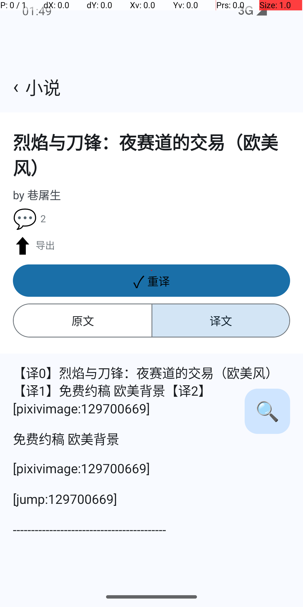

# app-lynx 小说翻译 — 模拟器验证报告（T12 #640）

- **日期**：2026-09-20
- **设备**：`emulator-5554`（Android，x86_64 镜像）
- **被测构建**：debug APK，`BENCH_NAV=1` + `PictelioTranslate` 原生模块
- **LLM 端点**：本地 mock Responses SSE 服务（`packages/app/tests/android-e2e/tools/mock-responses-sse-server.mjs`）+ `adb reverse`
- **复跑脚本**：`packages/app/tests/android-e2e/tools/verify-translation.sh mock`

## 7 步流程与结果

| # | 步骤 | 结果 | 证据 |
|---|---|---|---|
| 1 | 构建 + 安装 + 启动，dev hook 自动登录（`pictelio_dev_refresh_token`） | ✅ | `LynxActivity: dev hook: 自动登录成功（userInfo={…}）` |
| 2 | 播种翻译 endpoint（`pictelio_dev_llm_base_url/model/api_key`） | ✅ | `LynxActivity: dev hook: 翻译 endpoint 已播种 baseURL=http://127.0.0.1:8811/v1` |
| 3 | 授权 R-18 内容（`pictelio_dev_force_r18` + `settings_translate_r18_*`） | ✅ | 翻译入口在 R-18 作品上可见 |
| 4 | 直达正文页（`--es benchNav novel-detail --es benchNavNovelId <id>`） | ✅ | 页面渲染出「Aあ 翻译本章」按钮 |
| 5 | 点击翻译 → 原生发起请求（载荷正确） | ✅ | `translateStream 入口 baseURL=… model=mock-model input=NN` → `HTTP 200 开始读流` |
| 6 | 原生解析 SSE → 事件总线交付 → JS store 收敛 | ✅ | `SSE 流就绪待拉取 … frames=2 terminal=done` + `事件总线交付 frames=3` |
| 7 | 正文渲染译文 + 按钮态切换 | ✅ | 见 `app-lynx-translation-emulator-01-translated.png`：按钮「✓ 重译」、出现「原文/译文」切换条、正文为 `【译0】…【译1】…【译2】…` |

## 截图

要点：按钮从「0% 翻译中」变为「✓ 重译」；segmented button（原文/译文）出现；正文段落已替换为 mock 端点的译文（`【译N】…`）。

## 已知限制（如实记录）

1. **逐段增量流式未生效**：lynx NativeModule 的 Callback 通道在一条流内不可靠（四组对照实验见 ADR-0170「交付通道实测」），因此交付形态改为「整章就绪后一次性推送」。用户看到的是译文整章出现，而非逐字渐显。
2. **真实 LLM 端点未在本轮验证**：mock 端点验证的是链路；DeepSeek 对 R-18 正文返回 200 且零输出（已在授权确认 UI 提示该风险），真实端点的译文质量与内容策略行为需另测。
3. **物理真机未跑**：本报告全部基于模拟器；原生 `<list>` 结构未改动，按门禁边界不阻塞。

## 构建陷阱记录（防复发）

本轮之前连续几轮误判「构建成功」：构建命令写作 `gradle … | grep -E 'error:'`，grep 无匹配即返回 0，于是编译失败被吞、安装的始终是旧 APK（时间戳不变）。现已：

- 脚本统一 `set -eo pipefail`；
- 安装前**校验 APK 时间戳**必须晚于本次构建开始时刻，否则直接失败退出；
- 真实错误是 `JavaOnlyArray` 包名（`com.lynx.tasm.behavior` → `com.lynx.react.bridge`）。
