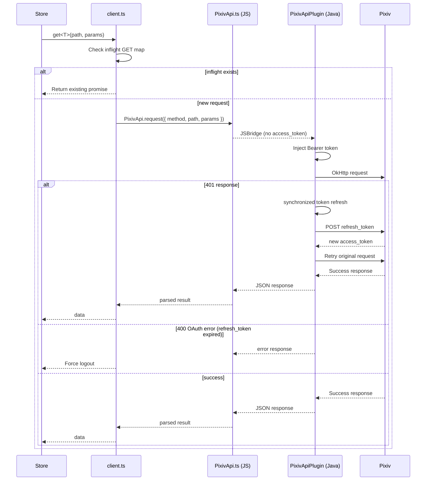

# API Layer & Authentication

## Architecture

The Pixiv API layer lives in `/packages/app/src/api/`. It consists of:

- **`client.ts`** — Core HTTP client (transport dispatch, error classification, GET dedup, DEV-mode auth)
- **`auth.ts`** — OAuth token refresh (refresh_token grant); delegates to `PixivApiPlugin` on native
- **`pkceAuth.ts`** — PKCE authorization code flow
- **`_oauthFetch.ts`** — Web-only OAuth fetch helper (DEV mode only)
- Domain modules: `illust.ts`, `novel.ts`, `user.ts`, `comment.ts`, `search.ts`
- **`queryKeys.ts`** — TanStack Query key factory
- **`queryClient.ts`** — Query client singleton with error normalization
- **`types.ts`** — Pixiv API response types and error types

## Transport Architecture (v3.18.0+)

Since v3.18.0, the client uses two distinct transport paths:

| Mode | Environment | Mechanism | Auth Token Location |
|------|-------------|-----------|-------------------|
| **Native** | Android (Capacitor) | `PixivApiPlugin` Java gateway via JSBridge | Java `volatile` field — **never** in JS heap |
| **Web** | Dev `pnpm dev` / PWA | `fetch` via Vite proxy | `devAccessToken` module variable |

Platform detection: `Capacitor.isNativePlatform()` — checked at request time.

### Native Transport (PixivApiPlugin Gateway)

All native Pixiv API requests route through the **PixivApiPlugin** Java Capacitor plugin (ADR-0037):

1. JS calls `PixivApi.request({ method, path, params, body })` — no access_token, no headers
2. Java side (OkHttp) constructs the full URL, injects `Authorization: Bearer`, `Referer`, `User-Agent`
3. If the response is **401**, Java internally refreshes the token (`synchronized` lock prevents concurrent refreshes) and retries once
4. Response JSON is returned to JS via JSBridge
5. **access_token is never passed back to JavaScript**

This replaces the previous architecture (three native paths: CapacitorHttp, PictelioHttp with DoH DNS, and fetch). The old `PictelioHttpPlugin.java` and `PictelioHttp.ts` were deleted.

### Web/Dev Transport

In development (`pnpm dev`) or PWA mode, the client uses standard `fetch` through a Vite proxy:

- `devAccessToken` is stored as a module variable (only in DEV builds, eliminated by Oxc minifier in production)
- 401 handling uses the older Promise queue pattern (`devAuth.onUnauthorized` / `devAuth.refreshPromise`)
- URLs are rewritten through Vite proxy (`/pixiv-api` → Pixiv API, `/pixiv-oauth` → auth endpoint)

## OAuth Authentication

### Token Refresh (auth.ts)

Primary auth flow uses a Pixiv `refresh_token`:

1. **Production (Native):** `refreshToken()` calls `PixivApi.setRefreshToken()` to pass the token to Java, then `AuthPlugin.refreshToken()` for the OAuth exchange. `import.meta.env.DEV` gates ensure the returned `access_token` is only set in JS during dev. In production builds, `access_token` is returned as an empty string.
2. **Dev mode:** Falls back to `_oauthFetch` using OAuth credentials from the Vite env.

Key source: `auth.ts`, `PixivApi.ts`.

### PKCE Flow (pkceAuth.ts)

For first-time login, Pictelio uses the PKCE authorization code flow:

1. `codeVerifier` and `codeChallenge` are generated
2. User is directed to Pixiv OAuth page in a WebView (`OAuthWebView` component)
3. The native `OAuthPlugin` intercepts the redirect and extracts the authorization code
4. `exchangeCodeForToken()` calls `OAuthPlugin.exchangeCode()`, then sets the access_token on PixivApiPlugin via `PixivApi.setAccessToken()` (Java-side storage)
5. `refresh_token` is persisted to `capacitor-secure-storage`

### OAuth Token Error Detection

Pixiv returns HTTP 400 (not 401) for expired `refresh_token`. The function `isOAuthTokenErrorResponse()` in `client.ts` detects this specific case (`400` + error body containing "invalid_request").

## Request Flow (Native Production)



## GET Request Deduplication

`client.ts` maintains an `inflightGetRequests` Map keyed by `GET:{path}:{JSON(params)}`. If a GET is already in-flight for the same URL+params, subsequent callers receive the same promise. Entries are deleted on resolution or rejection.

## Query Key System

`queryKeys.ts` defines a create-key factory following the TanStack Query convention:

```
['illust', id]           — Single illust detail
['illust', 'detail', id] — Detail with full info
['feed', tab, subTab]    — Feed pages
['novel', id]            — Single novel detail
['user', id, type]       — User profile / illusts
['search', query, type]  — Search results
```

Each store that uses `createTQFeedStore` defines its own query keys internally.

## Error Handling

- `normalizeQueryError.ts` — Converts errors to `ApiError` type with `type` (network, timeout, auth, server, parse, unknown) and `message`
- `extractPixivErrorMessage()` — Parses Pixiv's error response body (system errors, OAuth errors) into a human-readable message
- TanStack Query's `queryClient` default error handler logs to console

## Related

- [Store Pattern & State Management](/openwiki/domain/store-pattern.md) — How stores consume the API via TanStack Query
- [Android Native & Build](/openwiki/integrations/android-native.md) — Native auth plugins (AuthPlugin, OAuthPlugin) and PictelioHttp
- ADR-0004: 401 concurrent retry with Promise queue
- ADR-0028: OAuth transport deduplication
