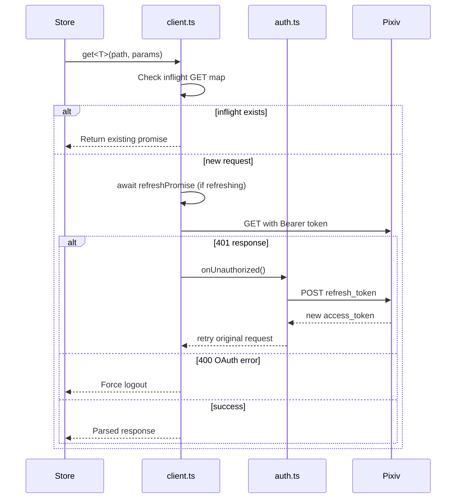

# API Layer & Authentication

## Architecture

The Pixiv API layer lives in `/packages/app/src/api/`. It consists of:

- **`client.ts`** — Core HTTP client (transport, auth injection, error handling, dedup)
- **`auth.ts`** — OAuth token refresh (refresh_token grant)
- **`pkceAuth.ts`** — PKCE authorization code flow
- **`_oauthFetch.ts`** — Web-only OAuth fetch helper
- Domain modules: `illust.ts`, `novel.ts`, `user.ts`, `comment.ts`, `search.ts`
- **`queryKeys.ts`** — TanStack Query key factory
- **`queryClient.ts`** — Query client singleton with error normalization
- **`types.ts`** — Pixiv API response types and error types

## Dual-Mode Transport

The client supports two transport modes:

| Mode | Environment | Mechanism | File |
|------|-------------|-----------|------|
| **Web** | Dev / PWA | `fetch` via Vite proxy | `client.ts` |
| **Native** | Android (Capacitor) | `CapacitorHttp` via `PictelioHttp.ts` | `native/PictelioHttp.ts` |

Platform detection: `Capacitor.isNativePlatform()` — configured once at module init.

## OAuth Authentication

### Token Refresh (auth.ts)

Primary auth flow uses a Pixiv `refresh_token`:

1. Token is stored in `capacitor-secure-storage` (Android Keystore)
2. `initializeAuth()` in `authStore.ts` loads the token and sets `accessToken`
3. When the API receives a 401, `onUnauthorized` triggers `refreshAccessToken`
4. A **Promise queue** (`refreshPromise`) ensures concurrent 401s share one refresh — subsequent 401s `await` the same promise instead of triggering their own

Key source: `setRefreshPromise()` / `getRefreshPromise()` in `client.ts` (implemented per ADR-0004).

### PKCE Flow (pkceAuth.ts)

For first-time login, Pictelio uses the PKCE authorization code flow:

1. `codeVerifier` and `codeChallenge` are generated
2. User is directed to Pixiv OAuth page in a WebView (`OAuthWebView` component)
3. The native `OAuthPlugin` intercepts the redirect and extracts the authorization code
4. Code is exchanged for `access_token` + `refresh_token`
5. `refresh_token` is persisted

### OAuth Token Error Detection

Pixiv returns HTTP 400 (not 401) for expired `refresh_token`. The function `isOAuthTokenErrorResponse()` in `client.ts` detects this specific case (`400` + error body containing "invalid_request").

## Request Flow



## GET Request Deduplication

`client.ts` maintains an `inflightGetRequests` Map keyed by `GET:{path}:{JSON(params)}`. If a GET is already in-flight for the same URL+params, subsequent callers receive the same promise. Entries are deleted on resolution or rejection.

## Query Key System

`queryKeys.ts` defines a create-key factory following the TanStack Query convention:

```
['illust', id]           — Single illust detail
['illust', 'detail', id] — Detail with full info
['feed', tab, subTab]    — Feed pages
['novel', id]            — Single novel detail
['user', id, type]       — User profile / illusts
['search', query, type]  — Search results
```

Each store that uses `createTQFeedStore` defines its own query keys internally.

## Error Handling

- `normalizeQueryError.ts` — Converts errors to `ApiError` type with `type` (network, timeout, auth, server, parse, unknown) and `message`
- `extractPixivErrorMessage()` — Parses Pixiv's error response body (system errors, OAuth errors) into a human-readable message
- TanStack Query's `queryClient` default error handler logs to console

## Related

- [Store Pattern & State Management](/openwiki/domain/store-pattern.md) — How stores consume the API via TanStack Query
- [Android Native & Build](/openwiki/integrations/android-native.md) — Native auth plugins (AuthPlugin, OAuthPlugin) and PictelioHttp
- ADR-0004: 401 concurrent retry with Promise queue
- ADR-0028: OAuth transport deduplication
