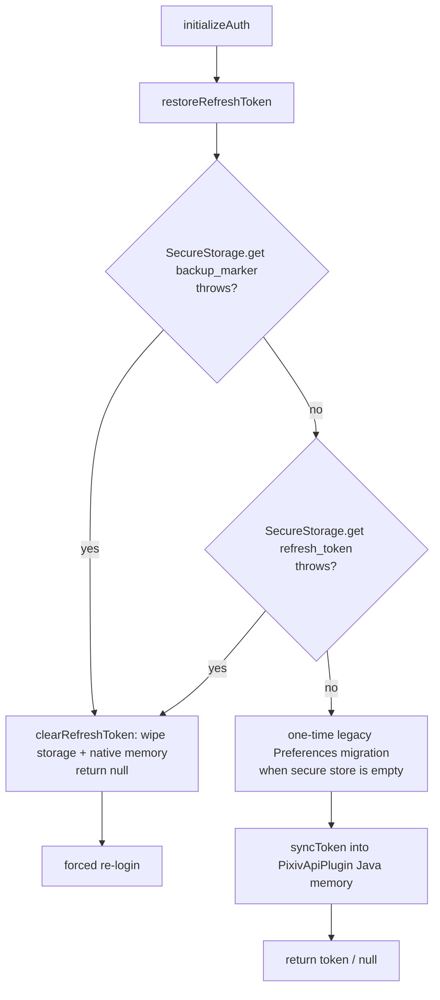

# API Layer & Authentication

## Architecture

The Pixiv API layer lives in `/packages/app/src/api/`. It consists of:

- **`client.ts`** — Core HTTP client (transport dispatch, error classification, GET dedup, DEV-mode auth)
- **`auth.ts`** — OAuth token refresh (refresh_token grant); delegates to `PixivApiPlugin` on native
- **`pkceAuth.ts`** — PKCE authorization code flow
- **`_oauthFetch.ts`** — Web-only OAuth fetch helper (DEV mode only)
- Domain modules: `illust.ts`, `novel.ts`, `user.ts`, `comment.ts`, `search.ts`
- **`queryKeys.ts`** — TanStack Query key factory
- **`queryClient.ts`** — Query client singleton with error normalization
- **`types.ts`** — Pixiv API response types and error types

## Transport Architecture (v3.18.0+)

Since v3.18.0, the client uses two distinct transport paths:

| Mode | Environment | Mechanism | Auth Token Location |
|------|-------------|-----------|-------------------|
| **Native** | Android (Capacitor) | `PixivApiPlugin` Java gateway via JSBridge | Java `volatile` field — **never** in JS heap |
| **Web** | Dev `pnpm dev` / PWA | `fetch` via Vite proxy | `devAccessToken` module variable |

Platform detection: `Capacitor.isNativePlatform()` — checked at request time.

### Native Transport (PixivApiPlugin Gateway)

All native Pixiv API requests route through the **PixivApiPlugin** Java Capacitor plugin (ADR-0037):

1. JS calls `PixivApi.request({ method, path, params, body })` — no access_token, no headers
2. Java side (OkHttp) constructs the full URL, injects `Authorization: Bearer`, `Referer`, `User-Agent`
3. If the response is **401**, Java internally refreshes the token (`synchronized` lock prevents concurrent refreshes) and retries once
4. Response JSON is returned to JS via JSBridge
5. **access_token is never passed back to JavaScript**

This replaces the previous architecture (three native paths: CapacitorHttp, PictelioHttp with DoH DNS, and fetch). The old `PictelioHttpPlugin.java` and `PictelioHttp.ts` were deleted.

### Web/Dev Transport

In development (`pnpm dev`) or PWA mode, the client uses standard `fetch` through a Vite proxy:

- `devAccessToken` is stored as a module variable (only in DEV builds, eliminated by Oxc minifier in production)
- 401 handling uses the older Promise queue pattern (`devAuth.onUnauthorized` / `devAuth.refreshPromise`)
- URLs are rewritten through Vite proxy (`/pixiv-api` → Pixiv API, `/pixiv-oauth` → auth endpoint)

## OAuth Authentication

### Token Refresh (auth.ts)

Primary auth flow uses a Pixiv `refresh_token`:

1. **Production (Native):** `refreshToken()` passes the `refresh_token` to Java as a call argument to `AuthPlugin.refreshToken()` for the OAuth exchange, then pushes the new `access_token` into `PixivApi.setAccessToken()`. `import.meta.env.DEV` gates ensure the returned `access_token` is only set in JS during dev. In production builds, `access_token` is returned as an empty string. Durable storage and Java memory sync of the `refresh_token` happen through the [Token Persistence & Backup Integrity](#token-persistence--backup-integrity) module — the old `PixivApi.setRefreshToken()` call was removed in the v3.21.6 security hardening.
2. **Dev mode:** Falls back to `_oauthFetch` using OAuth credentials from the Vite env.

Key source: `auth.ts`, `PixivApi.ts`, `secureStorage.ts`.

### PKCE Flow (pkceAuth.ts)

For first-time login, Pictelio uses the PKCE authorization code flow:

1. `codeVerifier` and `codeChallenge` are generated
2. User is directed to Pixiv OAuth page in a WebView (`OAuthWebView` component)
3. The native `OAuthPlugin` intercepts the redirect and extracts the authorization code
4. `exchangeCodeForToken()` calls `OAuthPlugin.exchangeCode()`, then sets the access_token on PixivApiPlugin via `PixivApi.setAccessToken()` (Java-side storage)
5. `refresh_token` is persisted via `saveRefreshToken()` (encrypted `capacitor-secure-storage` + Java memory sync, see below)

### Auth Initialization Dedup (`authStore.ts`)

`initializeAuth()` in `authStore.ts` uses a **promise-based dedup pattern**: instead of a simple boolean guard (`_authInitialized`), it stores the actual initialization promise in `_authPromise`. Concurrent callers (e.g. `main.tsx`'s `void initializeAuth()` and `RootLayout.onMount`'s `await initializeAuth()`) share the same async operation rather than racing.

- First call stores the Promise in `_authPromise` and begins the refresh flow
- Subsequent calls return the stored Promise — no duplicate refresh
- `loginWithToken()` and `loginWithPKCE()` reset `_authPromise = null` before starting, then set it to `Promise.resolve()` after success, ensuring a fresh init on the next `initializeAuth()` call after a login flow

Token restoration is converged into a single call: `initializeAuth()` now invokes `restoreRefreshToken()` from [Token Persistence & Backup Integrity](#token-persistence--backup-integrity), which internally runs the backup integrity check → read (with one-time legacy `@capacitor/preferences` migration) → native injection. Any storage exception is handled uniformly as "clear token → return null" (forced re-login) instead of the old split get/migrate path.

`setupUnauthorizedHandler()` additionally registers a **`refreshTokenRotated`** listener on `PixivApi` (skipped silently on Web, where the plugin is absent): if the Java-side 401 silent refresh receives a rotated `refresh_token`, Java updates its own memory and notifies JS, which updates the in-memory signal and calls `saveRefreshToken()` to persist the new value — preventing the app from restoring a stale token after restart. The listener is removed on `logout()`. (Defensive only: Pixiv does not currently rotate refresh tokens.)

### Token Persistence & Backup Integrity

Since v3.21.6 (security hardening, [ADR-0003](/docs/adr/0003-backup-security-three-layer-defense.md)), `/packages/app/src/utils/secureStorage.ts` is a deep module with a **single three-interface API**: `restoreRefreshToken()` / `saveRefreshToken()` / `clearRefreshToken()`. All token state changes must go through these three entry points, which together enforce the invariant "persisted state and native memory never drift". Implementation facts are grounded in [docs/research/android-token-storage.md](/docs/research/android-token-storage.md).

- **`restoreRefreshToken()`** — startup restore, three phases: (1) backup integrity check via the `__pictelio_backup_marker` marker — a marker read error means the Keystore key is unavailable (e.g. restored backup onto a different device); (2) read the token from `@aparajita/capacitor-secure-storage` via `SecureStorage.getItem` (raw string, not JSON-parsed) with `unquoteTokenValue` for backward compatibility with historical `SecureStorage.set` JSON-wrapped values; (3) inject the token into Java memory via `PixivApi.syncToken()`. Any storage exception (marker read failure or AES/GCM decryption error after Keystore key recreation) is handled uniformly as clear token + native memory → return `null` → forced re-login. First launch writes the marker.
- **`saveRefreshToken()`** — writes the token to secure storage via `SecureStorage.setItem` (raw string — aligned with the Lynx client's `SecureStorageCompat.setItem`), then syncs it to Java memory (`syncToken`). The raw-string format prevents cross-client parse errors: the WebView and Lynx clients share the same encrypted `SharedPreferences` key, and a JSON-wrapped write from one side would cause the other side's `JSON.parse` to throw `StorageError` (misinterpreted as storage corruption, triggering token clear → white screen, issue #127). Persistence failure does not block native injection.
- **`clearRefreshToken()`** — removes the token from secure storage and calls `syncToken(null)`, which also wipes Java memory and the historical plaintext residue in `PictelioPrefs.xml`.

The restore flow (the layer-③ defense):



The Android backup-exclusion layers (① `data_extraction_rules.xml`, ② `backup_rules.xml`) and the native `syncToken` memory model are documented in [Android Native & Build — Backup Rules](/openwiki/integrations/android-native.md#backup-rules--token-storage-exclusions-adr-0003), and the anti-drift test guarding the XML file names in [Testing Strategy](/openwiki/testing/overview.md#config-consistency-anti-drift-tests).

### OAuth Token Error Detection

Pixiv returns HTTP 400 (not 401) for expired `refresh_token`. The function `isOAuthTokenErrorResponse()` in `client.ts` detects this specific case (`400` + error body containing "invalid_request").

**Permanent vs transient error branching** (`authStore.ts`): When `performRefresh` catches an error, the auth store distinguishes:
- **Permanent errors** (OAuth HTTP 400-409): The `refresh_token` is irrecoverably expired or revoked. `isAuthErrorPermanent()` first short-circuits on `err instanceof TypeError` (always transient), then checks for `"HTTP 40"` in the error message (covering 400 through 409). Errors that match neither (unknown types) default to transient. Triggers full `logout()` which deletes the persisted token.
- **Transient errors** (TypeError/network timeout/HTTP 429 rate limiting): Temporary connectivity or throttling failure. `clearAuthState()` resets the in-memory signal state (`isLoggedIn`, `user`, `tokenReady`) and calls `appStateListener?.remove()` to prevent duplicate listener registration, but **preserves** the persisted `refresh_token` so the next `initializeAuth()` call (e.g. on app resume) can retry.

This replaces the earlier unconditional `logout()` on any refresh failure — introducing resilience to network flakiness during startup auth.

## Request Flow (Native Production)

<!-- openwiki: mermaid parse failed and this diagram was converted to a text fence so it does not break rendering. Fix the diagram source and restore the mermaid fence. Parser error: Parse error on line 40: ... end end Expecting 'SPACE', 'NEWLINE', 'INVALID', 'create', 'box', 'end', 'autonumber', 'activate', 'deactivate', 'title', 'legacy_title', 'acc_title', 'acc_descr', 'acc_descr_multiline_value', 'loop', 'rect', 'opt', 'alt', 'par', 'par_over', 'critical', 'break', 'else', 'participant', 'participant_actor', 'destroy', 'note', 'links', 'link', 'properties', 'details', 'ACT -->
```text
sequenceDiagram
    participant Store
    participant Client as client.ts
    participant JS as PixivApi.ts (JS)
    participant Java as PixivApiPlugin (Java)
    participant Pixiv

    Store->>Client: get<T>(path, params)
    Client->>Client: Check inflight GET map
    alt inflight exists
        Client-->>Store: Return existing promise
    else new request
        Client->>JS: PixivApi.request({ method, path, params })
        JS-->>Java: JSBridge (no access_token)
        Java->>Java: Inject Bearer token
        Java->>Pixiv: OkHttp request
        alt 401 response
            Java->>Java: synchronized token refresh
            Java->>Pixiv: POST refresh_token
            Pixiv-->>Java: new access_token
            Java->>Pixiv: Retry original request
            Pixiv-->>Java: Success response
            Java-->>JS: JSON response
            JS-->>Client: parsed result
            Client-->>Store: data
        else 400 OAuth error (refresh_token expired)
            Java-->>JS: error response
            Client-->>Store: authStore.performRefresh(err)
            alt permanent (OAuth 400)
                Client-->>Store: logout() — delete token
            else transient (TypeError / network)
                Client-->>Store: clearAuthState() — preserve token for retry
        else success
            Pixiv-->>Java: Success response
            Java-->>JS: JSON response
            JS-->>Client: parsed result
            Client-->>Store: data
        end
    end
```

## GET Request Deduplication

`client.ts` maintains an `inflightGetRequests` Map keyed by `GET:{path}:{JSON(params)}`. If a GET is already in-flight for the same URL+params, subsequent callers receive the same promise. Entries are deleted on resolution or rejection.

## Query Key System

`queryKeys.ts` defines a create-key factory following the TanStack Query convention:

```
['illust', id]           — Single illust detail
['illust', 'detail', id] — Detail with full info
['feed', tab, subTab]    — Feed pages
['novel', id]            — Single novel detail
['user', id, type]       — User profile / illusts
['search', query, type]  — Search results
```

Each store that uses `createTQFeedStore` defines its own query keys internally.

## Error Handling

- `normalizeQueryError.ts` — Converts errors to `ApiError` type with `type` (network, timeout, auth, server, parse, unknown) and `message`
- `extractPixivErrorMessage()` — Parses Pixiv's error response body (system errors, OAuth errors) into a human-readable message
- TanStack Query's `queryClient` default error handler logs to console

## Related

- [Feed Store Factory](/openwiki/domain/feed-and-browsing.md#feed-store-factory) — How stores consume the API via TanStack Query
- [Android Native & Build](/openwiki/integrations/android-native.md) — Native auth plugins (AuthPlugin, OAuthPlugin) and PictelioHttp
- ADR-0004: 401 concurrent retry with Promise queue
- ADR-0028: OAuth transport deduplication
