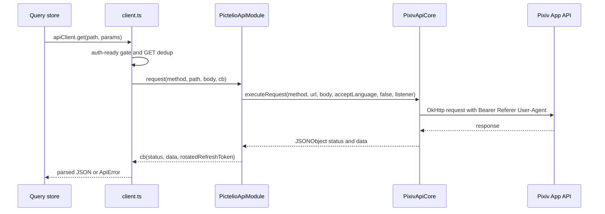
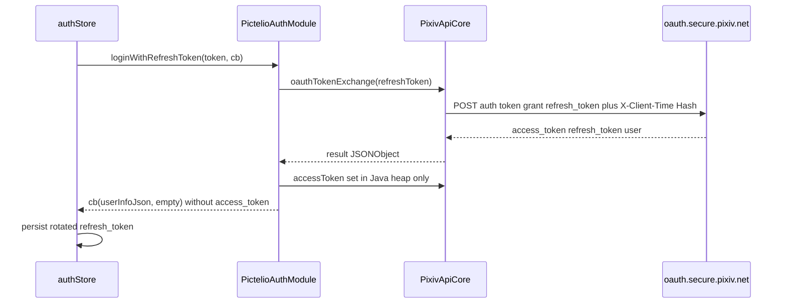
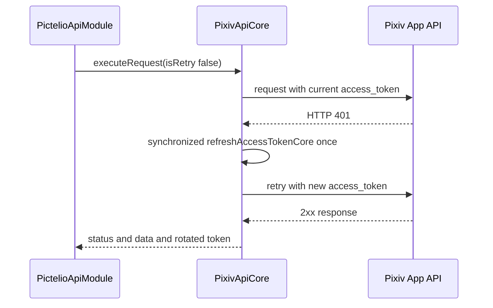
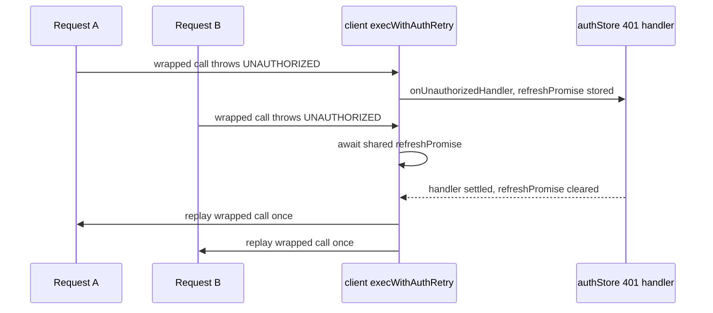

# API Layer & Authentication

## Architecture

The Pixiv API layer lives in `packages/app-lynx/src/api/`. Its surface is a small typed transport client (`apiClient`), thin per-entity endpoint adapters, and the TanStack Query key/client plumbing:

- **`client.ts`** — the core transport. It owns per-request native/web mode dispatch, URL rewriting and the bearer-token guard, error classification, GET dedup, the JS-side 401 single-flight, and the auth-ready gate.
- **`auth.ts`** — the OAuth refresh-token grant (`oauthTokenRequest` / `loginWithRefreshToken`), with the SparkMD5 `X-Client-Time`/`X-Client-Hash` signature.
- **`rateLimitBackoff.ts`** — pure capped-exponential + full-jitter backoff (ADR-0199).
- **`queryClient.ts` / `queryKeys.ts`** — TanStack Query singleton defaults and key factories.
- **`types.ts`, `id.ts`, `userAgent.ts`** — shared response/error types (including the `ApiErrorType` enum), branded IDs, and the UA/Referer/content-type/base-URL constants, which are read from the compile-time `__PUBLIC_CONFIG__` (the public fields of `credentials.json5`).
- **Per-entity endpoint modules** — `illust.ts`, `novel.ts`, `user.ts`, `comment.ts`, `search.ts`, `notification.ts`, `ranking.ts`, `ugoira.ts` (see [Endpoint Modules](#endpoint-modules)); `translate.ts` / `nativeTranslate.ts` belong to a separate LLM channel (see [Boundary with the LLM translation channel](#boundary-with-the-llm-translation-channel)).

The design principle inherited from [ADR-0037](../../docs/adr/ADR-0037-pixiv-api-plugin-gateway.md) is that **the `access_token` must never enter the JavaScript heap**. In the current Lynx client that principle is implemented by routing native API traffic through Lynx Native Modules into Java, rather than through the old Capacitor `PixivApiPlugin` (see [ADR-0053](../../docs/adr/ADR-0053-lynx-nativemodule-contract.md) and the extraction note in `PixivApiCore`'s header). The plugin class itself is gone — the webview client it belonged to was removed by [ADR-0203](../../docs/adr/ADR-0203-webview-client-source-removal.md) — leaving the Lynx modules as the only caller of `PixivApiCore`'s request path apart from the headerless diagnostic probe (`NetDiagProbe`).

## Transport Modes

`client.ts` selects a transport **per request**, inside `execute`/`executeRaw`, via `isNativeMode()`. Mode detection goes through `getNativeModules()`, which probes both the bare `NativeModules` global and `globalThis.NativeModules` (the Lynx runtime exposes `NativeModules` as a global object that is *not* on `globalThis`), and mode is native only when a real `Pictelio*` module is present — `PictelioApi`, `PictelioAuth`, `PictelioSecureStorage`, or `PictelioApp`. The web-core preview worker injects empty-shell `NativeModules` without those modules, so it is correctly classified as web.

| Mode | Environment | Mechanism | Auth token location |
|------|-------------|-----------|---------------------|
| **Native** | LynxView on Android | `NativeModules.PictelioApi.request(...)` → Java `PixivApiCore` | `PixivApiCore.accessToken` (volatile static, Java heap) — **never returned to JS** |
| **Web** | `web-core` dev preview | `fetch` via `/pixiv-api` proxy | `accessToken` module variable in JS |

### Native Transport (PictelioApi → PixivApiCore)

`execute()`/`executeRaw()` in native mode call `NativeModules.PictelioApi.request(method, path, body, callback)`. The JS side passes only `method`, a **relative** path, and a form-encoded body — no headers and no token:

1. `client.ts` rewrites absolute `next_url` values back to relative paths (see [URL Rewrite & Token Guard](#url-rewrite--token-guard)), appends the query string, and calls `PictelioApi.request`.
2. `PictelioApiModule.request` concatenates `PixivApiCore.apiBase()` + path, resolves the `Accept-Language` header from the `settings_language` pref on the worker thread (ADR-0200), and submits the blocking I/O to a cached thread pool (`API_EXECUTOR`), so the Lynx call thread is not occupied.
3. `PixivApiCore.executeRequest` builds an OkHttp request, injecting `Authorization: Bearer <accessToken>`, `Referer`, `User-Agent`, and (optionally) `Accept-Language`, then executes it against the shared `OkHttpClient`.
4. If the response is 401, Java silently refreshes once and retries (see [Java-Side 401 Refresh](#java-side-401-refresh-native-primary-path)).
5. The callback returns `(status, data, rotatedRefreshToken)` to JS — `data` is always the raw response-body string (Java never parses it; `execute` JSON-parses before resolving, while `executeRaw` resolves the raw text), and `rotatedRefreshToken` is non-empty only when the refresh rotated the refresh token.

A Java-side failure is reported as `cb(0, errMsg, "")`; the JS callback still hands `(status, null, parsed)` to `classifyError`, which is why such failures surface as `UNKNOWN` rather than `NETWORK` (see [Error Classification](#error-classification)).

The callback never includes the `access_token`; `PixivApiCore`'s `accessToken` is a `static volatile` field written only on the Java side.

### Web/Dev Transport

In web mode the client uses `fetch` (through the `requestFetch` wrapper, which resolves `fetch` off `globalThis` because the web-core bundling leaves the bare global undefined) to the Vite/rspeedy dev proxy: relative API paths become `/pixiv-api/*` and the OAuth endpoint becomes `/pixiv-oauth/auth/token`. The JS module variable `accessToken` (set via `setAccessToken`) supplies the `Authorization: Bearer` header, and `rewriteUrl`/`shouldAttachAuth` decide whether a header is attached at all.

### URL Rewrite & Token Guard

`rewriteUrl(path)` normalizes both directions:

- **Native mode** strips the Pixiv host from absolute `next_url` values (`https://app-api.pixiv.net/v1/...` → `/v1/...`) because the Java module concatenates `apiBase` + path; passing an absolute URL would produce a double-domain URL and a Pixiv 404. Relative paths pass through unchanged, `/pixiv-img` stays as-is, and `/pixiv-oauth` is replaced by `PIXIV_AUTH_BASE`.
- **Web mode** maps known Pixiv hosts to `/pixiv-api` / `/pixiv-oauth` proxy paths, and leaves other absolute URLs untouched.

`shouldAttachAuth(rewrittenUrl)` gates the bearer header **after** rewriting: web mode only attaches to local `/pixiv-*` paths; native mode only attaches to `http`-prefixed URLs whose hostname is in the trusted whitelist. `isTrustedPixivHost` parses the hostname from `PIXIV_API_BASE`/`PIXIV_AUTH_BASE` — via `extractHostname` from `utils/safeParseUrl`, never the `URL` global, whose `.hostname` is `undefined` on the Lynx runtime (ADR-0163) — and compares exactly (with lowercase normalization), which rejects pseudo-suffix domains such as `app-api.pixiv.net.evil.com`; this mirrors the webview client's ADR-0100 fix.

```mermaid
sequenceDiagram
    participant Store as Query store
    participant Client as client.ts
    participant Module as PictelioApiModule
    participant Core as PixivApiCore
    participant Pixiv as Pixiv App API

    Store->>Client: apiClient.get(path, params)
    Client->>Client: auth-ready gate and GET dedup
    Client->>Module: request(method, path, body, cb)
    Module->>Core: executeRequest(method, url, body, acceptLanguage, false, listener)
    Core->>Pixiv: OkHttp request with Bearer Referer User-Agent
    Pixiv-->>Core: response
    Core-->>Module: JSONObject status and data
    Module-->>Client: cb(status, data, rotatedRefreshToken)
    Client-->>Store: parsed JSON or ApiError
```

*Native request path: JS passes only method, relative path, and body; Java injects headers, performs the HTTP call, and returns status/body/rotated-token.*

## OAuth Authentication

### Refresh-Token Grant

The app-lynx client has a **single OAuth grant type: `refresh_token`**. There is no PKCE or password flow in this client; the Login page accepts a pasted refresh token (`Login.vue` → `auth.loginWithToken`), and everything else flows from that token.

`auth.ts`'s `oauthTokenRequest(grantType, extraParams)` is the single OAuth transport helper (the ADR-0028 deduplication: one shared function instead of per-file copies). It builds:

- `X-Client-Time` = current UTC ISO-8601 time (`...+00:00`), and
- `X-Client-Hash` = `MD5(time + HASH_SECRET)` via `spark-md5`,
- plus `App-OS` / `App-OS-Version` / `User-Agent`, and a form body containing `client_id`, `client_secret`, `grant_type`, `get_secure_url=1`, and the grant-specific parameters.

On the web path it `fetch`es `/pixiv-oauth/auth/token` and calls `setAccessToken(data.access_token)`; in native mode the same helper would target the absolute `PIXIV_AUTH_BASE` (no dev proxy) — but the native path never reaches it, because `authStore.performRefresh` delegates to `PictelioAuth` instead (below). The function is gated by `__DEV__` plus an `isOAuthCredsInjected` fail-closed check, so empty compile-time credentials never produce an outbound request in production builds (the `__DEV__` flag alone is unreliable: the vue-lynx plugin forces it true under dev).

### Native OAuth Exchange

In native mode, `authStore.performRefresh` does **not** call `oauthTokenRequest`. It calls `NativeModules.PictelioAuth.loginWithRefreshToken(token, callback)`, and `PictelioAuthModule` delegates to `PixivApiCore.oauthTokenExchange(refreshToken)` on its own `AUTH_EXECUTOR` thread pool (a synchronous OkHttp call on the Lynx thread would throw `NetworkOnMainThreadException`):

1. Java builds the same `X-Client-Time`/`X-Client-Hash` signature and posts `grant_type=refresh_token` to `OAuthConfig.AUTH_URL`.
2. On success it writes `PixivApiCore.accessToken` (and, if rotated, `PixivApiCore.refreshToken`) **into the Java heap only**.
3. The JS callback receives `userInfoJson` — `userId`, `userName`, `userAccount`, `profileImageUrls`, and the rotated `refreshToken` — but **never the access_token**.

`PictelioAuth.setAccessToken(token)` exists as a backup push path, and `PictelioAuth.clearTokens(cb)` nulls both Java-heap tokens on logout.

```mermaid
sequenceDiagram
    participant Store as authStore
    participant Auth as PictelioAuthModule
    participant Core as PixivApiCore
    participant OAuth as oauth.secure.pixiv.net

    Store->>Auth: loginWithRefreshToken(token, cb)
    Auth->>Core: oauthTokenExchange(refreshToken)
    Core->>OAuth: POST auth token grant refresh_token plus X-Client-Time Hash
    OAuth-->>Core: access_token refresh_token user
    Core-->>Auth: result JSONObject
    Auth->>Core: accessToken set in Java heap only
    Auth-->>Store: cb(userInfoJson, empty) without access_token
    Store->>Store: persist rotated refresh_token
```

*Native refresh-token exchange: the access_token stays in `PixivApiCore`; only user info and the rotated refresh token cross the bridge.*

> Initial-token acquisition (PKCE authorization code flow) is documented in `docs/pixiv-auth-methods.md`, but that document is now **archival**: the webview client it describes was removed by ADR-0203, and the current app-lynx client obtains its initial refresh token by user paste.

## Token Storage & Restore

`refresh_token` persistence follows ADR-0050 through `utils/tokenStorage.ts`, a dual-path wrapper:

- **Web-core** (the Lynx background worker has no `localStorage`): the token is stored in **IndexedDB** (`idbSet`/`idbGet`/`idbRemove`, key `refresh_token`).
- **Native** LynxView: `NativeModules.PictelioSecureStorage` reads/writes through `SecureStorageCompat`, which reproduces the main project's `@aparajita/capacitor-secure-storage` layout byte for byte: `AES/GCM/NoPadding` with a per-key AndroidKeyStore key aliased `capacitor-storage_<key>`, the `WSSecureStorageSharedPreferences` file, and ciphertext `Base64(ciphertext) + U+0010 + Base64(iv)`. Keeping that contract is what lets a login survive a client migration instead of forcing the user to paste a new refresh token.

`loadRefreshToken` on the native path applies `unquoteNativeString`, because the Lynx `Callback.invoke(String)` JSON-serializes string arguments — without the unquote the token would arrive wrapped in quotes and produce a 400 `invalid_grant` (issue #120).

### Restore Flow

`authStore.restoreToken()` is the startup entry point. It:

1. short-circuits if already ready, and dedups concurrent callers through `_restoreInFlight` (the promise is cleared in `finally`, so a failed restore is not memoized);
2. loads the persisted `refresh_token`;
3. runs `performRefresh(token)` — native exchange or web OAuth — and populates user state plus `_accessTokenReady`.

The 401 handler's refresh path (`registerUnauthorizedHandler`) prefers the in-memory `_refreshToken` but **falls back to the persistent layer** when memory is empty, self-healing the startup race where a request's 401 arrives before the restore exchange has completed (#815).

Every successful login/refresh and every rotated token from a Java-side 401 refresh is written back through `saveRefreshToken` (fire-and-forget with a warn on failure, so persistence failure does not block the in-memory state).

## 401 Handling & Concurrent Retry

There are two independent 401-refresh layers, and they cooperate rather than overlap: Java refreshes first on the native path, and the JS single-flight is the backstop for whatever still comes back as 401.

### Java-Side 401 Refresh (Native Primary Path)

`PixivApiCore.executeRequest` handles 401 **silently** on the native path. When `statusCode == 401 && !isRetry` it captures `tokenBefore = accessToken` and enters a `synchronized (PixivApiCore.class)` block, refreshing inside only when `accessToken == tokenBefore && !isRefreshing` (with `isRefreshing` set around `refreshAccessTokenCore()`). After the block:

- a successful refresh returns a non-null rotated token, and the original request is replayed with `isRetry == true` (the same `Accept-Language` value is threaded through the replay);
- otherwise, if `accessToken != tokenBefore`, another thread already rotated the token, so the request is replayed once with that shared new token and **no** second refresh;
- otherwise (refresh failed, or a refresh is still in flight) the 401 status is returned to JS unchanged, where the JS layer takes over.

The comparison is deliberately **reference identity** (`==`/`!=`): a successful refresh always assigns a new `String` instance, so `equals` would misread a same-value new instance as "not refreshed". The guard exists because the concurrency window is real — the Java-side note cites ADR-0159's bridge-thread unblocking (now an archival ADR for the retired Capacitor plugin bridge) as the point where multiple 401s could arrive simultaneously — and because Pixiv's OAuth endpoint is rate limited, so a redundant refresh risks a rate-limit failure that would leak a bare 401 to JS. `refreshAccessTokenCore()` returns null on failure (e.g. no saved refresh token or a rejected exchange).

```mermaid
sequenceDiagram
    participant Module as PictelioApiModule
    participant Core as PixivApiCore
    participant Pixiv as Pixiv App API

    Module->>Core: executeRequest(isRetry false)
    Core->>Pixiv: request with current access_token
    Pixiv-->>Core: HTTP 401
    Core->>Core: synchronized refreshAccessTokenCore once
    Core->>Pixiv: retry with new access_token
    Pixiv-->>Core: 2xx response
    Core-->>Module: status and data and rotated token
```

*Java-side 401 handling: a single synchronized refresh, then one replay of the original request.*

### JS-Side Single-Flight Queue (Web Mode and Native Backstop)

`execWithAuthRetry` — the outer wrapper around `execute`/`executeRaw` for `get`, `post`, **and** `requestRaw` — implements the ADR-0004 pattern, and it is **retry-once, not a re-entrant loop**:

- On a catcher, if `err.type === ApiErrorType.UNAUTHORIZED` and `onUnauthorizedHandler` is registered: waiters that find an existing module-level `refreshPromise` simply `await` it; the first 401 creates it as `onUnauthorizedHandler().finally(() => { refreshPromise = null })`.
- Each catcher then **replays the wrapped call exactly once**. If the replay throws `UNAUTHORIZED` again, that error propagates to its caller — there is no second refresh for the same request, so a dead session cannot spin.
- The promise is cleared as soon as the handler settles, so a *later* burst of 401s starts a fresh refresh, while everything inside one burst shares a single OAuth exchange. That sharing matters because Pixiv rotates single-use refresh tokens: N concurrent refreshes would consume the token N times and fail all but one.
- Non-`UNAUTHORIZED` errors bypass the branch entirely and are rethrown, which is what keeps 429 backoff (inside the wrapper) and 401 replay orthogonal.

`authStore.registerUnauthorizedHandler` installs the handler via `setOnUnauthorized`. The handler reads `_refreshToken` from memory, falls back to `loadRefreshToken()` when memory is empty (#815), runs `performRefresh`, and — only when the refresh failed **and** left `_accessTokenReady === false` with an error message — calls `reportSessionError` for the full-screen session error. `performRefresh` distinguishes **permanent** failures (credential errors containing "凭证" or "invalid", or a web-mode `UNAUTHORIZED` ApiError) — which set `authPermanentFailure` and clear state — from **transient** failures, which leave state ready for a later retry; it resolves to a boolean rather than throwing, so the shared promise normally settles and the waiters reach their replay.

```mermaid
sequenceDiagram
    participant RA as Request A
    participant RB as Request B
    participant C as client execWithAuthRetry
    participant H as authStore 401 handler

    RA->>C: wrapped call throws UNAUTHORIZED
    C->>H: onUnauthorizedHandler, refreshPromise stored
    RB->>C: wrapped call throws UNAUTHORIZED
    C->>C: await shared refreshPromise
    H-->>C: handler settled, refreshPromise cleared
    C->>RA: replay wrapped call once
    C->>RB: replay wrapped call once
```

*JS-side single flight: concurrent 401s in one burst share a single refresh and each replay once; a second UNAUTHORIZED from the replay is surfaced, not retried.*

The vocabulary here (`single-flight`, `retry-once`, `onUnauthorized`) is defined in [glossary-auth-retry](../../docs/adr/glossary-auth-retry.md); note that glossary describes the **retired** webview client (`nativeExecuteRequest`, `tokenReady`), so its `logout()`-on-failure flow does not match app-lynx, where a failed refresh leaves state to `authStore` and the `authPermanentFailure` flag.

### GET Deduplication and Retry Sharing

`request()` for `GET` keys an in-flight promise by `GET:<path>:<JSON params>` (from the caller-supplied, pre-rewrite path and parameters) in `inflightGetRequests`, so identical concurrent reads share one transport execution and one `ApiError` outcome. Two consequences matter:

- **Retries are shared, not multiplied.** The 429 backoff wrapper lives inside the deduped call, so joiners share a single backoff sequence instead of each starting its own (ADR-0199 R1), and the 401 single-flight likewise runs once per burst.
- **Calls that carry an `AbortSignal` never join the map**, because a shared promise would let one caller's abort cancel everyone's request; such calls get their own transport run (and their own backoff, which the signal can cancel during the wait). `requestRaw` is excluded from dedup for the same reason — a raw text body must not be handed to an unrelated caller.

Cleanup deliberately uses a two-callback `then(onFulfilled, onRejected)` rather than a single `finally`, because a derived promise with no rejection handler would produce an unhandled rejection.

### Token Barrier & Permanent-Failure Short-Circuit

The token barrier (ADR-0041, refined by ADR-0151 and the #815 correction) prevents the startup race where first-frame requests outrun the restore exchange:

- `authPermanentFailure` short-circuits at the top of `execute`/`executeRaw` with a synchronous throw, so no network traffic is generated once auth is known dead.
- `awaitAuthReady()` gates **GET** requests that have no JS `access_token`: it awaits the provider registered by `authStore` (`setAuthReadyProvider(() => useAuthStore().restoreToken())`, registered at `authStore` module load) with a 10-second cap (`withTimeout`), swallowing timeouts. It returns immediately when a JS `accessToken` already exists or no provider is registered (the web-core preview). Web mode then throws `UNAUTHORIZED` only if no token exists; native mode proceeds to the Java gateway.
- The gate is applied to the **native branch too** (the #815 correction): in native mode `accessToken` is always empty in JS, but the Java-heap token is produced asynchronously by the OAuth exchange, so "no JS token" is not a readiness signal. POST requests are deliberately not gated (no startup POST read path goes through this client; adding the gate would only delay writes) — a decision that must be revisited if a startup-time POST is ever routed through `apiClient`.

## Rate-Limit Backoff (429)

`rateLimitBackoff.ts` provides capped exponential backoff with full jitter (ADR-0199):

- `computeRateLimitBackoffDelayMs(attempt, config, random)` computes `floor(random() × min(maxDelayMs, baseDelayMs × 2^attempt))` — multiplier 2 and full jitter are fixed algorithm parameters, not user-configurable.
- `runWithRateLimitBackoff(fn, config, options)` retries only on `ApiErrorType.RATE_LIMIT` (HTTP 429), up to `maxRetries` additional attempts (default `3`, so at most 4 total attempts), waits via an injectable `sleep` (default `setTimeout` + abort listener), and — when retries are exhausted — throws the rate-limit error with `params.attempts` attached for observability. `enabled: false` or `maxRetries: 0` restores the zero-retry behavior.

In `client.ts`, `request`/`requestRaw` wrap the inner `execute`/`executeRaw` with `runWithRateLimitBackoff`, inside the outer `execWithAuthRetry`. This makes 429 backoff orthogonal to 401 refresh: a replayed request after refresh re-enters the backoff loop. The config is injected via `setRateLimitBackoffConfig` (mirroring the `setOnUnauthorized` seam) and read at each call, so a settings change applies to the next request; `settingsStore` assembles it from the four device-level `settings_rate_limit_*` keys without the client depending on Pinia. Each retry logs `[client] 429 限流退避重试` with the attempt number and delay. `Retry-After` is intentionally not honored: the native callback contract carries no response headers, and single-sided support would split behavior between the two transports.

## Error Classification

`classifyError(status, error, responseBody)` in `client.ts` is the single error-normalization point shared by `get`/`post`/`requestRaw`:

- a `proxy_error` body → `ApiErrorType.PROXY` (local proxy failure);
- a fetch rejection (`TypeError`) with no status → `NETWORK`;
- 401 → `UNAUTHORIZED`, 403 → `FORBIDDEN`, 429 → `RATE_LIMIT`;
- 400 with an OAuth-token error body → `UNAUTHORIZED` (see below), `>= 500` → `SERVER`, other positive statuses → `UNKNOWN`.

The classifier is shared across transports but receives different shapes from them. Web fetch rejections pass the `TypeError` and become `NETWORK`; a **native** transport failure arrives as `cb(0, errMsg, "")` and the JS branch classifies `(0, null, parsed)`, so the error string is never handed in as the `error` argument and the result is `UNKNOWN` ("未知错误") rather than `NETWORK`. The only explicit native `NETWORK` case is the missing-module throw (`原生 API 模块不可用`) when `isNativeMode()` is true but `getNativeModules().PictelioApi` is absent (for example when only an empty-shell `PictelioApp` exists).

`isOAuthTokenErrorResponse(status, body)` recognizes Pixiv's 400 `{ error: "invalid_grant" }` string form **and** the object form `{ error: { message: "...OAuth...invalid_request..." } }`, mapping both to `UNAUTHORIZED` so an expired/revoked refresh token enters the permanent-failure cleanup path. `extractPixivErrorMessage` pulls a human-readable message from Pixiv's `errors.system.message`/`message`/`error` shapes.

## Accept-Language Resolution

The `Accept-Language` header decides which language Pixiv returns for `tags[].translated_name`, and it is produced per channel (ADR-0200):

- **Web mode** snapshots `locale.value` from `i18n` when the headers object is built in `execute`/`executeRaw`, so an in-flight request keeps the language it started with and a language switch applies to the next request.
- **Native mode** never sends the header from JS. `PictelioApiModule.request` reads the `settings_language` pref on its worker thread and resolves it with the pure package-private `resolveAcceptLanguage(stored)`, where only `"en"` maps to `en` and everything else (`"zh-CN"`, `""`, null, invalid) maps to `zh-CN` — matching what the LynxView UI actually renders, since there is no `navigator` to detect a system locale. Read failures log a warning and fall back to `zh-CN` rather than failing the request.
- The header is injected in Java through a new nullable overload of `PixivApiCore.executeRequest` precisely so the bridge signature stays unchanged: under OTA version skew (new JS with an old APK or vice versa) a bridge parameter mismatch would fail every API request, whereas a prefs read is compatible in both directions. The old 5-argument signature is retained and delegates with `null` (no header).

## Endpoint Modules

Every per-entity module is a thin typed wrapper over the transport, not a second networking implementation:

- **Reads** are `apiClient.get<T>(path, params, signal)` against a Pixiv App API path, with the `AbortSignal` forwarded from the caller (screens pass one for cancellation).
- **Writes** are `apiClient.post(path, formFields)`: the client form-encodes the object and sets the Pixiv content type, so e.g. `postComment`/`deleteComment` and the bookmark/watchlist/follow endpoints are one-liners.
- **Pagination is server-driven**: `next_url` values are passed straight back into `apiClient.get(nextUrl, undefined, signal)` by `loadNext`, `loadRankingNext`, `loadRootCommentsNext`, `loadNotificationChildren`, `searchIllustNext`, `loadNovelSeriesChaptersNext`, and the watchlist pager — the module never rewrites the URL itself, leaving host stripping to `rewriteUrl` and bearer attachment to `shouldAttachAuth`.
- **`search.ts` is the one module that adds its own guard**: `assertPixivUrl` accepts only a `/pixiv-api` path or an absolute URL whose hostname is exactly `app-api.pixiv.net`, and otherwise warns and throws rather than silently falling back (SSRF defense in depth). `api/search.template.test.ts` enforces at source level that this assertion keeps using string hostname parsing instead of the Lynx-unusable `URL` global.
- **The one non-JSON endpoint** — the novel body at `/webview/v2/novel`, which returns HTML — goes through `apiClient.requestRaw`.

Endpoint coverage: `illust.ts` (recommended/follow/bookmarks/detail/related/user illusts, ugoira metadata, bookmark add/delete/detail/tags), `novel.ts` (recommended/follow/bookmarks/detail/series/chapters, watchlist, novel bookmarks, the HTML body readers), `user.ts` (detail, following/followers, mypixiv, follow/unfollow), `comment.ts` (root comments, replies, post, delete), `search.ts`, `ranking.ts`, `notification.ts`, and `ugoira.ts` (playback pipeline: metadata from `illust.ts`, then zip download plus frame extraction via the shared `@pictelio/ugoira` primitives and the native `ugoiraExtract*` methods — see [Image Pipeline](image-pipeline.md)).

### Notification Endpoints

`notification.ts` wraps exactly two GET endpoints, both confirmed by the 2026-09-26 live capture recorded in the module header:

- `loadNotifications(nextUrl?)` → `GET /v1/notification/list` for the first page, or transparent `next_url` passthrough afterwards.
- `loadNotificationChildren(id, nextUrl?)` → `GET /v1/notification/view-more` with `notification_id` required and the `older_than` cursor arriving through the server's `next_url`.

Both return `PixivNotificationListResponse` and inherit everything above for free — URL normalization, bearer gating, error classification, the 401 single-flight, and 429 backoff — and no Java change was needed, since `PictelioApiModule.request` forwards an arbitrary path with no endpoint whitelist. Query keys are `queryKeys.notifications.list()` (infinite query) and `queryKeys.notifications.children(id)`. Product semantics — unread badge, group expansion, `target_url` routing — live in [Notifications & Delivery Probe](../domain/notifications-and-delivery-probe.md).

### Boundary with the LLM translation channel

`translate.ts` (translation IR, chunk mapping, `OpenAIResponsesProvider`) and `nativeTranslate.ts` (the `PictelioTranslate` wrapper) form a channel that is deliberately **not** part of the Pixiv gateway: it never calls `apiClient`, never touches `PixivApiCore`, and classifies failures into `TranslationErrorCode` rather than `ApiErrorType`. On the native path the endpoint configuration and LLM API key live in Keystore and in the Java module (`setApiKey`, `clearEndpoint`, `probeEndpoint`), `getEndpoint` returns only a redacted mirror (`baseURL`/`model`/`targetLang`/`hasKey`/`updatedAt`), and Java assembles the `Authorization` header for `translateStream` — so the key is neither readable back into JS nor used to build requests there. The two documented exceptions are the one-shot configuration write that pushes the plaintext key across the bridge, and the web-core dev preview, where `OpenAIResponsesProvider` injects `Bearer <apiKey>` itself for testing. The channel's internals — chunked SSE pipeline, cache keying, retry and partial UI — belong to [Novel Reader](../domain/novel-reader.md).

## Query Key System & Query Client

`queryKeys.ts` uses `as const` factories under a `['pictelio', <resource>, ...]` namespace, with sub-namespaces `illusts` / `novels` / `users` / `search` / `watchlist` / `notifications` / `settings`. Key order is significant; the top-level `pictelio` prefix plus resource prefixes enable prefix-level invalidation (`queryClient.invalidateQueries({ queryKey: queryKeys.illusts.all })`). `mutationKeys` (`['mutation', <resource>, <action>]`) centralize mutation grouping for `setMutationDefaults`, and `invalidateKeys` centralizes the invalidation targets (whole `illusts` / `novels` prefixes, a user detail subtree, the watchlist).

`queryClient.ts` exports a per-app-cycle singleton (`createAppQueryClient`) with these defaults:

- `staleTime: 0` (mount-refetch, the project's "pessimistic refresh" convention), `retry: false` (401/4xx/5xx retry semantics belong to `apiClient`, not TanStack Query — keeping the Java `synchronized` refresh contract unbroken),
- `gcTime: 30s`, `refetchOnWindowFocus: false` (Lynx has no window focus event), `refetchOnReconnect: true`, `placeholderData: keepPreviousData`, `structuralSharing: true`.

Per-query overrides raise `gcTime` to 5 minutes for stable detail/user/novel content and lower it to 0 for recommended/follow/search feeds (avoiding stale reads).

## Focused Tests

- `client.test.ts` exercises both transports through stubbed `fetch` and `NativeModules`: URL rewrite plus bearer attachment, absolute-`next_url` normalization before the native call, 404/500 classification, the missing-`PictelioApi` `NETWORK` throw, 401 refresh-and-replay (web and native), the 401→429 composition (one refresh, then backoff attempts on the replayed request), the 429 wiring (`setRateLimitBackoffConfig({ enabled: false })` zero-retry, wait-time abort via the forwarded signal, native-callback retries), GET dedup with shared backoff, the #815 readiness gate in native mode, and `Accept-Language` presence on both the original and the replayed request.
- `rateLimitBackoff.test.ts` verifies the ADR-0199 delay formula with injected `random` endpoints, the retry/abort/exhaustion semantics with injectable `sleep`/`onRetry`, and the settings-tier invariants.
- `authStore.unauthorized.test.ts` covers the 401 handler: fallback to the persistent layer when memory has no token, and no session error when neither layer has one.
- `notification.test.ts` (captured fixtures plus both endpoints), `illust.test.ts`, `novel.test.ts`, `ranking.test.ts`, `search.test.ts`, `user.test.ts`, and `search.template.test.ts` lock the per-entity path/parameter contracts and `next_url` passthrough.

## Related

- [Image Pipeline](image-pipeline.md) — how image/ugoira downloads reuse `PixivApiCore.getSharedClient()` and the `PictelioApi` module.
- [Architecture Overview](overview.md) — where this layer sits in the app-lynx runtime.
- [Feed & Browsing](../domain/feed-and-browsing.md) — how stores consume the API via TanStack Query.
- [Novel Reader](../domain/novel-reader.md) — the BYOK translation channel's internals.
- [Notifications & Delivery Probe](../domain/notifications-and-delivery-probe.md) — notification product semantics behind the two endpoints above.
- [Android Native & Build](../integrations/android-native.md) — the Android host, `PixivApiCore`, and Lynx module registration.
- [Testing Strategy](../testing/overview.md) — behavioral-test conventions referenced above.
- [Quickstart](../quickstart.md) — running the web-core preview (which uses the web transport path).
- ADRs: [0037](../../docs/adr/ADR-0037-pixiv-api-plugin-gateway.md) (access_token Java-heap isolation gateway), [0053](../../docs/adr/ADR-0053-lynx-nativemodule-contract.md) (Lynx NativeModule contract), [0004](../../docs/adr/0004-401-concurrent-retry-promise-queue.md) (401 Promise queue), [0050](../../docs/adr/ADR-0050-lynx-login-persistence.md) (refresh_token persistence), [0199](../../docs/adr/ADR-0199-app-lynx-rate-limit-backoff.md) (429 backoff), [0200](../../docs/adr/ADR-0200-lynx-accept-language-header.md) (Accept-Language), [0203](../../docs/adr/ADR-0203-webview-client-source-removal.md) (webview client removal), plus ADR-0041/ADR-0151 (token barrier).
