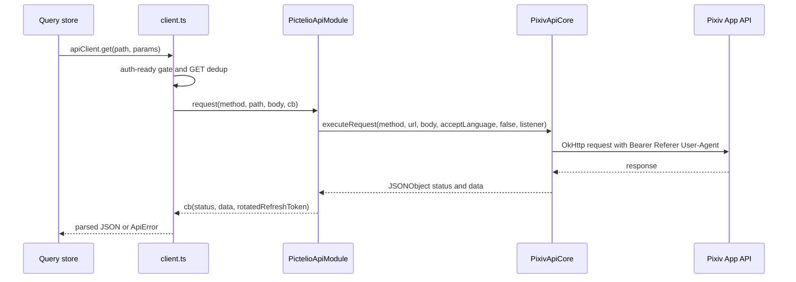
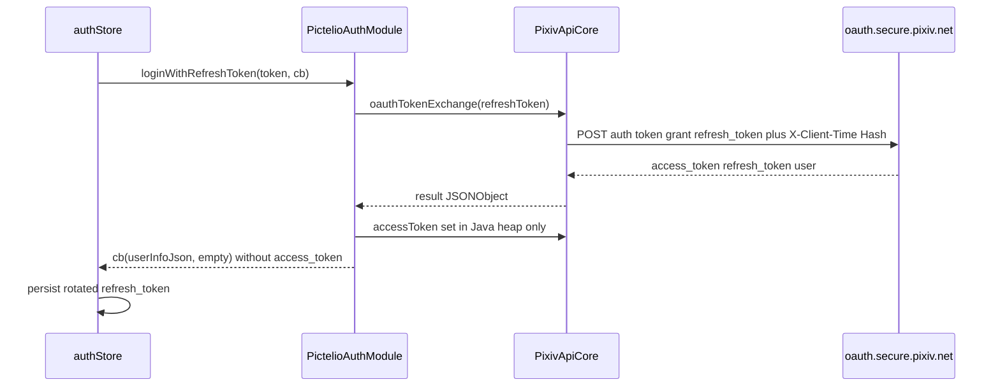
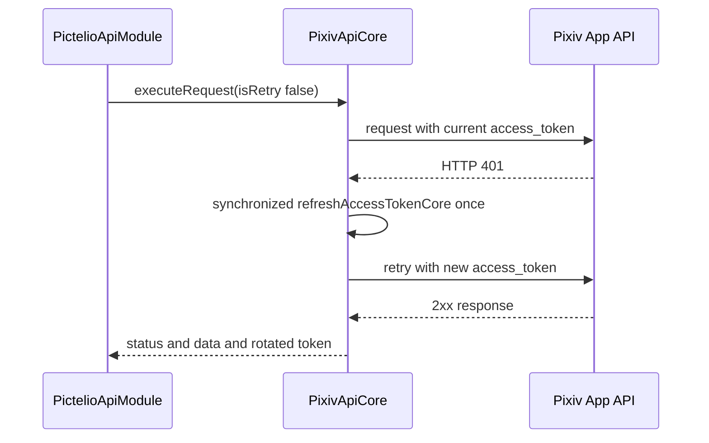

# API Layer & Authentication

## Architecture

The Pixiv API layer lives in `packages/app-lynx/src/api/`. Its surface is a small typed transport client (`apiClient`), thin per-entity endpoint adapters, and the TanStack Query key/client plumbing:

- **`client.ts`** — the core transport. It owns native/web mode dispatch, URL rewriting and the bearer-token guard, error classification, GET dedup, the JS-side 401 Promise queue, and the auth-ready gate.
- **`auth.ts`** — the OAuth refresh-token grant (`oauthTokenRequest` / `loginWithRefreshToken`), with the SparkMD5 `X-Client-Time`/`X-Client-Hash` signature.
- **`rateLimitBackoff.ts`** — pure capped-exponential + full-jitter backoff (ADR-0199).
- **`queryClient.ts` / `queryKeys.ts`** — TanStack Query singleton defaults and key factories.
- **`types.ts`, `id.ts`, `userAgent.ts`** — shared response/error types, branded IDs, and UA/Referer/content-type constants sourced from `__PUBLIC_CONFIG__`.
- **Per-entity endpoint modules** — `illust.ts`, `novel.ts`, `user.ts`, `comment.ts`, `search.ts`, `notification.ts`, `ranking.ts`, `ugoira.ts` (plus `translate.ts` / `nativeTranslate.ts` for the separate LLM-translation channel). Each is a thin mapping of `apiClient.get/post` calls onto Pixiv App API paths.

The design principle inherited from [ADR-0037](../../docs/adr/ADR-0037-pixiv-api-plugin-gateway.md) is that **the `access_token` must never enter the JavaScript heap**. In the current Lynx client that principle is implemented by routing native API traffic through Lynx Native Modules into Java, rather than through the old Capacitor `PixivApiPlugin` (see [ADR-0053](../../docs/adr/ADR-0053-lynx-nativemodule-contract.md) and the extraction of `PixivApiCore` described in its header comment).

## Transport Modes

`client.ts` selects a transport **per request** via `isNativeMode()`, which probes `NativeModules` (both the bare global and `globalThis`, because the Lynx runtime exposes it as a global that is *not* on `globalThis`) and returns true only when a real `Pictelio*` module is present. The web-core preview worker injects empty-shell `NativeModules` without those modules, so it is correctly classified as web.

| Mode | Environment | Mechanism | Auth token location |
|------|-------------|-----------|---------------------|
| **Native** | LynxView on Android | `NativeModules.PictelioApi.request(...)` → Java `PixivApiCore` | `PixivApiCore.accessToken` (volatile static, Java heap) — **never returned to JS** |
| **Web** | `web-core` dev preview | `fetch` via `/pixiv-api` proxy | `accessToken` module variable in JS |

### Native Transport (PictelioApi → PixivApiCore)

`execute()`/`executeRaw()` in native mode call `NativeModules.PictelioApi.request(method, path, body, callback)`. The JS side passes only `method`, a **relative** path, and a form-encoded body — no headers and no token:

1. `client.ts` rewrites absolute `next_url` values back to relative paths (see [URL Rewrite & Token Guard](#url-rewrite--token-guard)), appends the query string, and calls `PictelioApi.request`.
2. `PictelioApiModule.request` concatenates `PixivApiCore.apiBase()` + path, resolves the `Accept-Language` header from the `settings_language` pref on the worker thread (ADR-0200), and submits the blocking I/O to a cached thread pool (`API_EXECUTOR`), so the Lynx call thread is not occupied.
3. `PixivApiCore.executeRequest` builds an OkHttp request, injecting `Authorization: Bearer <accessToken>`, `Referer`, `User-Agent`, and (optionally) `Accept-Language`, then executes it against the shared `OkHttpClient`.
4. If the response is 401, Java silently refreshes once and retries (see [Java-Side 401 Refresh](#java-side-401-refresh-native-primary-path)).
5. The callback returns `(status, data, rotatedRefreshToken)` to JS — `data` is always the raw response-body string (Java never parses it; `execute` JSON-parses before resolving, while `executeRaw` resolves the raw text), and `rotatedRefreshToken` is non-empty only when the refresh rotated the refresh token.

The callback never includes the `access_token`; `PixivApiCore`'s `accessToken` is a `static volatile` field written only on the Java side.

### Web/Dev Transport

In web mode the client uses `fetch` through the Vite/rspeedy dev proxy: relative API paths become `/pixiv-api/*` and the OAuth endpoint becomes `/pixiv-oauth/auth/token`. The JS module variable `accessToken` (set via `setAccessToken`) supplies the `Authorization: Bearer` header, and `rewriteUrl`/`shouldAttachAuth` decide whether a header is attached at all.

### URL Rewrite & Token Guard

`rewriteUrl(path)` normalizes both directions:

- **Native mode** strips the Pixiv host from absolute `next_url` values (`https://app-api.pixiv.net/v1/...` → `/v1/...`) because the Java module concatenates `apiBase` + path; passing an absolute URL would produce a double-domain URL and a Pixiv 404. Relative paths pass through unchanged.
- **Web mode** maps known Pixiv hosts to `/pixiv-api` / `/pixiv-oauth` proxy paths, and leaves other absolute URLs untouched.

`shouldAttachAuth(rewrittenUrl)` gates the bearer header **after** rewriting: web mode only attaches to local `/pixiv-*` paths; native mode only attaches to `http`-prefixed URLs whose hostname is in the trusted whitelist. `isTrustedPixivHost` parses the hostname from `PIXIV_API_BASE`/`PIXIV_AUTH_BASE` and compares exactly (with lowercase normalization), which rejects pseudo-suffix domains such as `app-api.pixiv.net.evil.com` — a defense-in-depth mirror of the webview client's ADR-0100 fix.

```mermaid
sequenceDiagram
    participant Store as Query store
    participant Client as client.ts
    participant Module as PictelioApiModule
    participant Core as PixivApiCore
    participant Pixiv as Pixiv App API

    Store->>Client: apiClient.get(path, params)
    Client->>Client: auth-ready gate and GET dedup
    Client->>Module: request(method, path, body, cb)
    Module->>Core: executeRequest(method, url, body, acceptLanguage, false, listener)
    Core->>Pixiv: OkHttp request with Bearer Referer User-Agent
    Pixiv-->>Core: response
    Core-->>Module: JSONObject status and data
    Module-->>Client: cb(status, data, rotatedRefreshToken)
    Client-->>Store: parsed JSON or ApiError
```

*Native request path: JS passes only method, relative path, and body; Java injects headers, performs the HTTP call, and returns status/body/rotated-token.*

## OAuth Authentication

### Refresh-Token Grant

The app-lynx client has a **single OAuth grant type: `refresh_token`**. There is no PKCE or password flow in this client; the Login page accepts a pasted refresh token (`Login.vue` → `auth.loginWithToken`), and everything else flows from that token.

`auth.ts`'s `oauthTokenRequest(grantType, extraParams)` is the single OAuth transport helper (the ADR-0028 deduplication: one shared function instead of per-file copies). It builds:

- `X-Client-Time` = current UTC ISO-8601 time (`...+00:00`), and
- `X-Client-Hash` = `MD5(time + HASH_SECRET)` via `spark-md5`,
- plus `App-OS` / `App-OS-Version` / `User-Agent`, and a form body containing `client_id`, `client_secret`, `grant_type`, `get_secure_url=1`, and the grant-specific parameters.

On the web path it `fetch`es `/pixiv-oauth/auth/token` (or, in native dev, the absolute `PIXIV_AUTH_BASE`) and calls `setAccessToken(data.access_token)`. The function is gated by `__DEV__` plus an `isOAuthCredsInjected` fail-closed check so that empty compile-time credentials never produce an outbound request in production builds.

### Native OAuth Exchange

In native mode, `authStore.performRefresh` does **not** call `oauthTokenRequest`. It calls `NativeModules.PictelioAuth.loginWithRefreshToken(token, callback)`, and `PictelioAuthModule` delegates to `PixivApiCore.oauthTokenExchange(refreshToken)`:

1. Java builds the same `X-Client-Time`/`X-Client-Hash` signature and posts `grant_type=refresh_token` to `OAuthConfig.AUTH_URL`.
2. On success it writes `PixivApiCore.accessToken` (and, if rotated, `PixivApiCore.refreshToken`) **into the Java heap only**.
3. The JS callback receives `userInfoJson` — `userId`, `userName`, `userAccount`, `profileImageUrls`, and the rotated `refreshToken` — but **never the access_token**.

`PictelioAuth.setAccessToken(token)` exists as a backup push path, and `PictelioAuth.clearTokens(cb)` nulls both Java-heap tokens on logout.

```mermaid
sequenceDiagram
    participant Store as authStore
    participant Auth as PictelioAuthModule
    participant Core as PixivApiCore
    participant OAuth as oauth.secure.pixiv.net

    Store->>Auth: loginWithRefreshToken(token, cb)
    Auth->>Core: oauthTokenExchange(refreshToken)
    Core->>OAuth: POST auth token grant refresh_token plus X-Client-Time Hash
    OAuth-->>Core: access_token refresh_token user
    Core-->>Auth: result JSONObject
    Auth->>Core: accessToken set in Java heap only
    Auth-->>Store: cb(userInfoJson, empty) without access_token
    Store->>Store: persist rotated refresh_token
```

*Native refresh-token exchange: the access_token stays in `PixivApiCore`; only user info and the rotated refresh token cross the bridge.*

> Initial-token acquisition (PKCE authorization code flow) is documented in `docs/pixiv-auth-methods.md`, but that document is now **archival**: the webview client it describes was removed by ADR-0203, and the current app-lynx client obtains its initial refresh token by user paste.

## Token Storage & Restore

`refresh_token` persistence follows ADR-0050 through `utils/tokenStorage.ts`, a dual-path wrapper:

- **Web-core** (the Lynx background worker has no `localStorage`): the token is stored in **IndexedDB** (`idbSet`/`idbGet`/`idbRemove`, key `refresh_token`).
- **Native** LynxView: `NativeModules.PictelioSecureStorage` reads/writes the AndroidKeyStore-backed storage aligned with the main project's `@aparajita/capacitor-secure-storage` (same key and ciphertext format, so login state is shared with the webview client).

`loadRefreshToken` on the native path applies `unquoteNativeString`, because the Lynx `Callback.invoke(String)` JSON-serializes string arguments — without the unquote the token would arrive wrapped in quotes and produce a 400 `invalid_grant` (issue #120).

### Restore Flow

`authStore.restoreToken()` is the startup entry point. It:

1. short-circuits if already ready, and dedups concurrent callers through `_restoreInFlight` (the promise is cleared in `finally`, so a failed restore is not memoized);
2. loads the persisted `refresh_token`;
3. runs `performRefresh(token)` — native exchange or web OAuth — and populates user state plus `_accessTokenReady`.

The 401 handler's refresh path (`registerUnauthorizedHandler`) prefers the in-memory `_refreshToken` but **falls back to the persistent layer** when memory is empty, self-healing the startup race where a request's 401 arrives before the restore exchange has completed (#815).

Every successful login/refresh and every rotated token from a Java-side 401 refresh is written back through `saveRefreshToken` (fire-and-forget with a warn on failure, so persistence failure does not block the in-memory state).

## 401 Handling & Concurrent Retry

There are two independent 401-refresh layers, and they cooperate rather than overlap:

### Java-Side 401 Refresh (Native Primary Path)

`PixivApiCore.executeRequest` handles 401 **silently** on the native path: on a 401 with `isRetry == false` it takes a `synchronized (PixivApiCore.class)` block, checks `!isRefreshing` and that `accessToken` is still the same instance it saw, and calls `refreshAccessTokenCore()` once; then it retries the original request with `isRetry == true`. The token **reference-identity** comparison (`!=` not `equals`) is deliberate: a successful refresh always assigns a new `String` instance, so "someone else already refreshed" is detected as `accessToken != tokenBefore` and the request is replayed with the shared new token without a second refresh (ADR-0159 concurrency review). `refreshAccessTokenCore()` returns null on failure (e.g. no saved refresh token or a rejected exchange), in which case the original 401 is returned to JS.

```mermaid
sequenceDiagram
    participant Module as PictelioApiModule
    participant Core as PixivApiCore
    participant Pixiv as Pixiv App API

    Module->>Core: executeRequest(isRetry false)
    Core->>Pixiv: request with current access_token
    Pixiv-->>Core: HTTP 401
    Core->>Core: synchronized refreshAccessTokenCore once
    Core->>Pixiv: retry with new access_token
    Pixiv-->>Core: 2xx response
    Core-->>Module: status and data and rotated token
```

*Java-side 401 handling: a single synchronized refresh, then one replay of the original request.*

### JS-Side Promise Queue (Web Mode / Backstop)

For web mode (and as a backstop when a native response is still 401), `execWithAuthRetry` implements the ADR-0004 pattern: a module-level `refreshPromise` is shared so concurrent 401 responses await **one** `onUnauthorizedHandler` invocation, then each replays its request once. The handler is registered by `authStore.registerUnauthorizedHandler`, which runs `performRefresh`; on a failed refresh that also left `_accessTokenReady === false`, it reports a full-screen session error only when there really was an existing session.

`authStore.performRefresh` distinguishes **permanent** failures (credential errors containing "凭证" or "invalid", or a web-mode `UNAUTHORIZED` ApiError) — which set `authPermanentFailure` and clear state — from **transient** failures, which leave state ready for a later retry.

### Token Barrier & Permanent-Failure Short-Circuit

The token barrier (ADR-0041, refined by ADR-0151 and the #815 correction) prevents the startup race where first-frame requests outrun the restore exchange:

- `authPermanentFailure` short-circuits at the top of `execute`/`executeRaw` with a synchronous throw, so no network traffic is generated once auth is known dead.
- `awaitAuthReady()` gates **GET** requests that have no JS `access_token`: it awaits the provider registered by `authStore` (`setAuthReadyProvider(() => useAuthStore().restoreToken())`) with a 10-second cap (`withTimeout`), swallowing timeouts. Web mode then throws `UNAUTHORIZED` only if no token exists; native mode proceeds to the Java gateway.
- The gate is applied to the **native branch too** (the #815 correction): in native mode `accessToken` is always empty in JS, but the Java-heap token is produced asynchronously by the OAuth exchange, so "no JS token" is not a readiness signal. POST requests are deliberately not gated (no startup POST read path goes through this client; adding the gate would only delay writes).

## Rate-Limit Backoff (429)

`rateLimitBackoff.ts` provides capped exponential backoff with full jitter (ADR-0199):

- `computeRateLimitBackoffDelayMs(attempt, config, random)` computes `floor(random() × min(maxDelayMs, baseDelayMs × 2^attempt))` — multiplier 2 and full jitter are fixed algorithm parameters, not user-configurable.
- `runWithRateLimitBackoff(fn, config, options)` retries only on `ApiErrorType.RATE_LIMIT` (HTTP 429), up to `maxRetries` additional attempts (default `3`, so at most 4 total attempts), waits via an injectable `sleep` (default `setTimeout` + abort listener), and — when retries are exhausted — throws the rate-limit error with `params.attempts` attached for observability. `enabled: false` or `maxRetries: 0` restores the zero-retry behavior.

In `client.ts`, `request`/`requestRaw` wrap the inner `execute`/`executeRaw` with `runWithRateLimitBackoff`, inside the outer `execWithAuthRetry`. This makes 429 backoff orthogonal to 401 refresh: a replayed request after refresh re-enters the backoff loop. The config is injected via `setRateLimitBackoffConfig` (mirroring the `setOnUnauthorized` seam) so the settings store can tune `enabled`, `maxRetries`, `baseDelayMs`, and `maxDelayMs` without the client depending on Pinia. Each retry logs `[client] 429 限流退避重试` with the attempt number and delay.

## Query Key System & Query Client

`queryKeys.ts` uses `as const` factories under a `['pictelio', <resource>, ...]` namespace, with sub-namespaces `illusts` / `novels` / `users` / `search` / `watchlist` / `notifications` / `settings`. Key order is significant; the top-level `pictelio` prefix plus resource prefixes enable prefix-level invalidation (`queryClient.invalidateQueries({ queryKey: queryKeys.illusts.all })`). `mutationKeys` and `invalidateKeys` centralize mutation grouping and invalidation targets.

`queryClient.ts` exports a per-app-cycle singleton (`createAppQueryClient`) with these defaults:

- `staleTime: 0` (mount-refetch, the project's "pessimistic refresh" convention), `retry: false` (401/4xx/5xx retry semantics belong to `apiClient`, not TanStack Query — keeping the Java `synchronized` refresh contract unbroken),
- `gcTime: 30s`, `refetchOnWindowFocus: false` (Lynx has no window focus event), `refetchOnReconnect: true`, `placeholderData: keepPreviousData`, `structuralSharing: true`.

Per-query overrides raise `gcTime` to 5 minutes for stable detail/user/novel content and lower it to 0 for recommended/follow/search feeds (avoiding stale reads).

## Error Classification

`classifyError(status, error, responseBody)` in `client.ts` is the single error-normalization point shared by `get`/`post`/`requestRaw`:

- a `proxy_error` body → `ApiErrorType.PROXY` (local proxy failure);
- a fetch rejection (`TypeError`) with no status → `NETWORK`;
- 401 → `UNAUTHORIZED`, 403 → `FORBIDDEN`, 429 → `RATE_LIMIT`;
- 400 with an OAuth-token error body → `UNAUTHORIZED` (see below), `>= 500` → `SERVER`, other positive statuses → `UNKNOWN`.

`isOAuthTokenErrorResponse(status, body)` recognizes Pixiv's 400 `{ error: "invalid_grant" }` string form **and** the object form `{ error: { message: "...OAuth...invalid_request..." } }`, mapping both to `UNAUTHORIZED` so an expired/revoked refresh token enters the permanent-failure cleanup path. `extractPixivErrorMessage` pulls a human-readable message from Pixiv's `errors.system.message`/`message`/`error` shapes.

## Focused Tests

- `client.test.ts` exercises `requestRaw` (and the shared request pipeline) in both modes via stubbed `fetch` and `NativeModules`: URL rewrite + bearer attachment, 404/500/network classification, 401 refresh-and-replay, and the unlogged `UNAUTHORIZED` path.
- `rateLimitBackoff.test.ts` verifies the ADR-0199 delay formula with injected `random` endpoints and injectable `sleep`, the retry/abort/exhaustion semantics, and the config seam.

## Related

- [Image Pipeline](image-pipeline.md) — how image/ugoira downloads reuse `PixivApiCore.getSharedClient()` and the `PictelioApi` module.
- [Architecture Overview](overview.md) — where this layer sits in the app-lynx runtime.
- [Feed & Browsing](../domain/feed-and-browsing.md) — how stores consume the API via TanStack Query.
- [Android Native & Build](../integrations/android-native.md) — the Android host, `PixivApiCore`, and Lynx module registration.
- [Testing Strategy](../testing/overview.md) — behavioral-test conventions referenced above.
- [Quickstart](../quickstart.md) — running the web-core preview (which uses the web transport path).
- ADR-0037 — access_token Java-heap isolation gateway; ADR-0053 — Lynx NativeModule contract; ADR-0004 — 401 Promise queue; ADR-0041/ADR-0151 — token barrier; ADR-0028 — OAuth transport dedup; ADR-0050 — refresh_token persistence; ADR-0199 — rate-limit backoff.
