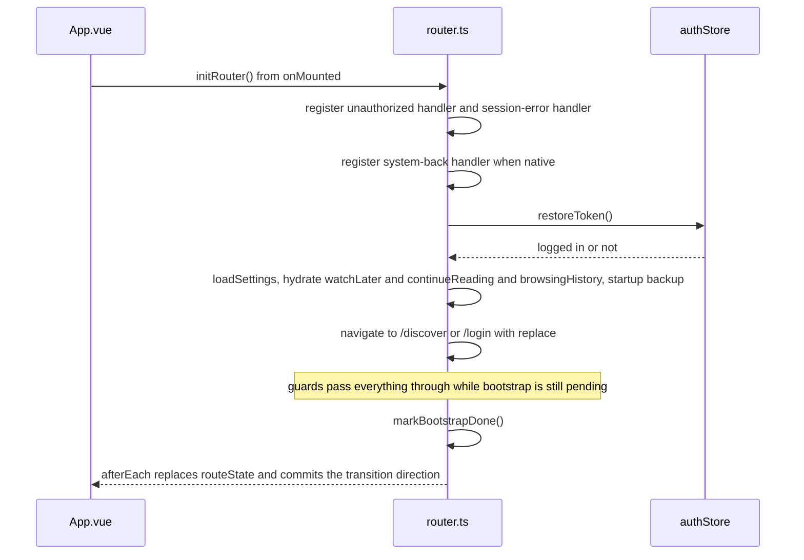
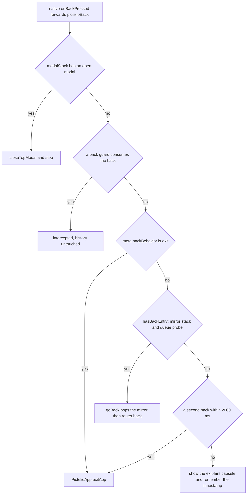
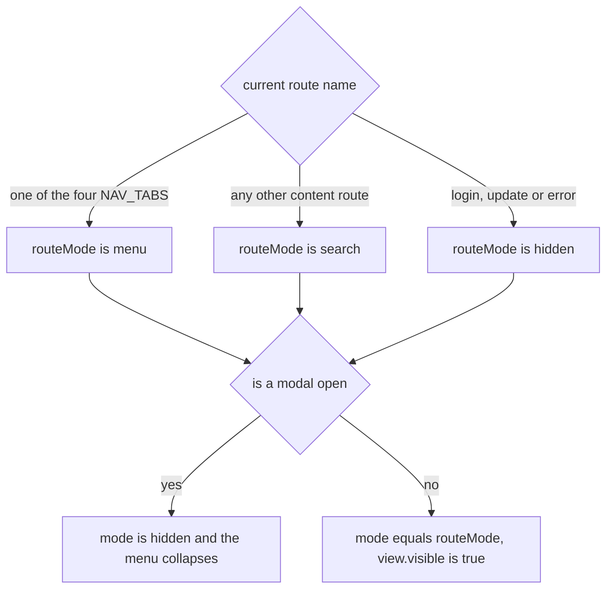
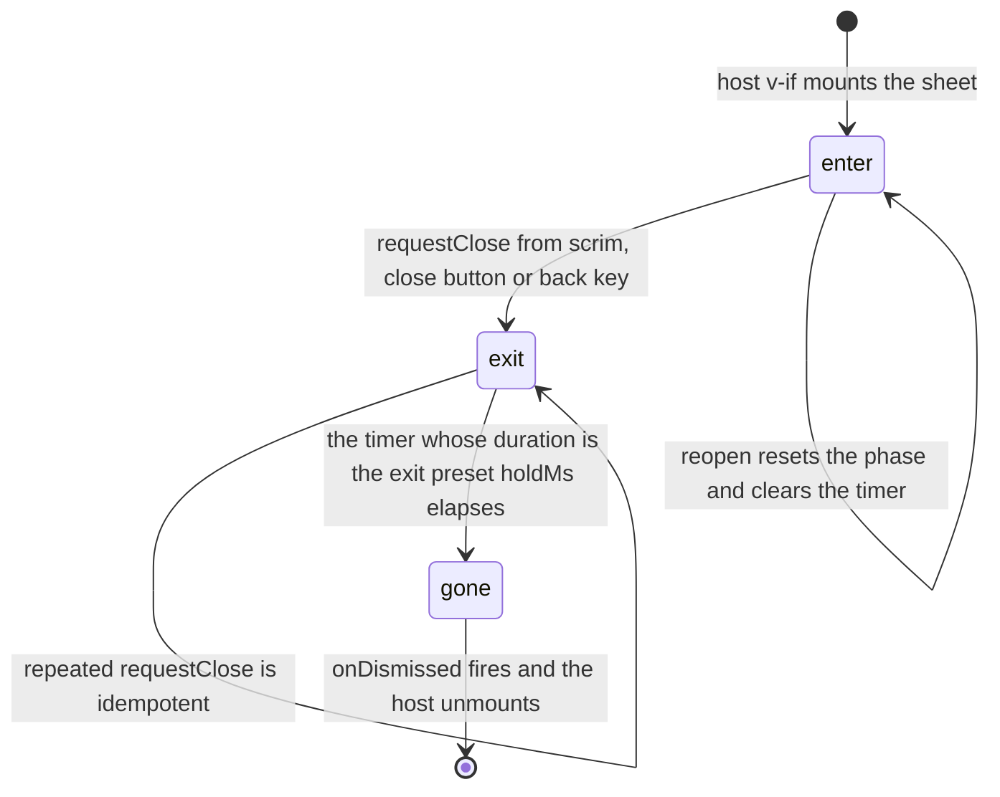

# App Shell & Navigation

Every page in `packages/app-lynx` is rendered inside one shell: `src/App.vue` owns the root `<page>`, the `<RouterView>`/`<KeepAlive>`/transition container, and the globally mounted overlays; `src/router.ts` owns the route table, per-route metadata and the navigation API that pages call; `src/routerCore.ts` owns the pure decisions (auth gate, back-route adjudication, back-guard registry, queue probe). This page documents that shell — not the pages inside it: feed pagination and list refresh internals belong to [Feed & Browsing](../domain/feed-and-browsing.md), novel reading and translation to [Novel Reader](../domain/novel-reader.md), and inset/occlusion numbers to [Viewport Geometry & Motion](../concepts/viewport-geometry-and-motion.md).

## Ownership Map

| Concern | Owner |
|---|---|
| Root composition, chrome mount order, root inline style | `src/App.vue` |
| Route table, `RouteMeta` contract, `navigate` / `goBack` / `requestBack` / `initRouter` | `src/router.ts` |
| Pure decisions: auth gate, back-route chain, back-guard registry, memory queue probe | `src/routerCore.ts` |
| Route state → top-inset spacer height | `composables/useTopInsetSpacer.ts` + `utils/topInset.ts` |
| Radial nav FAB behaviour / geometry / wiring | `primitives/createGlobalFab.ts`, `components/GlobalFab.vue`, `stores/globalFab.ts`, `components/navTabs.ts` |
| Modal stack and bottom-sheet shells | `stores/modalStack.ts`, `components/BottomSheet.vue`, `components/SheetShell.vue`, `composables/useSheetDismiss.ts` |
| Route transition direction and frames | `composables/routeTransition.ts` + the `@keyframes` block in `App.vue` |

## Route Table and Route Metadata

Routing is the official `vue-router` on `createMemoryHistory()` ([ADR-0138](../../docs/adr/ADR-0138-app-lynx-vue-router.md)); the previous hand-rolled in-memory router is gone. There is no URL and therefore no URL-based routing — memory history starts at *nowhere* and the app drives it programmatically. The single flat `routes` array in `router.ts` is the whole navigation surface (29 entries as of the current test contract).

Per-route behaviour lives in `meta`, declared through a `vue-router` module augmentation that is the *only* place these names are defined:

| Meta field | Type | Meaning |
|---|---|---|
| `requiresAuth` | `boolean`, optional | Business page: the global guard intercepts navigation when the session is cleared or the user is logged out |
| `backBehavior` | `'exit'`, optional | System back exits the app immediately, skipping history and the double-tap window |
| `topInset` | `TopInsetMode`, **required** | Who owns the status-bar inset on this route: `'self'` (page renders its own zero-content spacer) or `'bleed'` (content goes under the status bar) |

`topInset` is deliberately **required with no default**. A missing declaration fails `vue-tsc` (`pnpm check`) instead of silently falling back, because "which pages still need migrating" must be enumerable rather than discovered on a device. The value vocabulary is a closed two-item set and the single numeric source is `utils/topInset.ts`; an unknown mode falls back to `'self'` with a one-time warning. Geometry numbers are owned by [Viewport Geometry & Motion](../concepts/viewport-geometry-and-motion.md).

Marking rules that are easy to break:

- **System and session pages must stay unmarked.** `/update` and `/error` carry `backBehavior: 'exit'` and **no** `requiresAuth`. Both are the *destination* of flows that first clear the session (forced update check, 401 session expiry), so marking them would make the guard redirect its own destination back to `/login` and make those pages unreachable. `/login` (pre-login entry), `/network-check` (needed precisely when login/network fails) and `/platform-check` (debug-only page, reachable only through a deep link) are also unmarked for their own reasons.
- Every other route — the four destinations and all secondary business pages — is `requiresAuth: true`.

Dimension split ([ADR-0218](../../docs/adr/ADR-0218-app-lynx-top-nav-user-question-dimension.md)): the four top-level destinations answer four different user questions, and the media axis was demoted from navigation to in-page tabs.

| Route | Destination | Content |
|---|---|---|
| `/discover` (`Recommended.vue`) | 发现 "what's new" | Mixed feed plus an in-page `SubTabBar` (all / illust / novel) |
| `/updates` (`Updates.vue`) | 更新 "did what I follow update" | Three stacked sections: following, watchlist, notifications |
| `/shelf` (`Shelf.vue`) | 书架 "what I saved and haven't finished" | Bookmarks / watch later / continue reading previews |
| `/me` (`Me.vue`) | 我的 "account and settings" | Account, appearance, backup, download queue, entry into `/advanced` |

`/illusts` and `/novels` **keep their routes** (deep links, benchNav, and back targets from detail pages) but no longer appear in navigation; the debug/self-check items moved out of "me" into `/advanced`. `/notifications`, `/mypixiv`, `/mute-tags`, `/later`, `/continue`, `/downloads`, `/ranking` etc. are secondary pages reachable from in-page entry rows.

The split also carries a migration cost the shell absorbs: because entry rows moved, `Me.vue` renders an inline dismissible one-time notice (`stores/navMigrationNotice.ts`). Its flag is a **device-level** key with no uid suffix (`nav_migration_v1_seen`), deliberately outside the backup domain — the notice is about the app's navigation structure, not about the account — and a read failure resolves to "not seen yet" with a warning (worst case one extra showing, versus permanently silencing a user who never saw it).

## Boot, Start Route and Route State

`memory history`'s initial position is *nowhere*, so the router must be given an explicit start point. Two things happen:

1. **At module load** — `router.replace(DISCOVER_PATH)` (with `DISCOVER_PATH = '/discover'`) anchors the queue with `replace` semantics. `replace` matters, not `push`: a `push` start would leave the *nowhere* entry behind as a phantom "previous page" and the queue probe would report that going back is possible at the root.
2. **In `initRouter()`**, called from `App.vue`'s `onMounted`, the shell finishes wiring and then converges on the real landing route.

*Cold-start sequence: the first real landing happens while the guard is still in pass-through bootstrap mode, and only then does the guard start enforcing.*

`initRouter()` is also the place where shell-level startup duties live: the 401/unauthorized handler, the session-error handler (clearing history and `replace`ing to `/error`), system-back registration on native, `restoreToken()`, `loadSettings()`, the fire-and-forget hydrations (`watchLaterStore`, `continueReadingStore`, `browsingHistoryStore`) so that a deep link into those pages does not show "you have nothing" instead of "not loaded yet", and the startup auto-backup which must run after settings are loaded.

`afterEach` reconciles router state into the shell, synchronously in one batch:

- `routeState` (`{ name, path, params, topInset }`) is **replaced wholesale**, never mutated field-by-field. `topInset` is written in the same batch as `name`/`params` on purpose: registering it later (e.g. in a page's `setup`) would leave one frame where the root container still compensated for the inset.
- The pending transition intent is committed to `composables/routeTransition.ts` in the same microtask, which is *before* Vue's render flush — so the incoming page's first frame already carries the entry animation. The intent is reconciled against the actual landing path, so a navigation that was cancelled or redirected by a guard gets `none` instead of a transition for something that never happened.

`routeState`'s initial value is a **placeholder** that happens to equal the first real landing path (`/discover`, `topInset: 'self'`). `afterEach` replaces the object reference, so consumers that must observe every landing (for example the top-level reach metric in `App.vue`) watch `routeState.value` itself, not `routeState.value.path` — watching `.path` at cold start compares `/discover` with `/discover` and never fires.

## Auth Gate

The gate is a pure function, `decideRequiresAuth(requiresAuth, bootstrapping, cleared, loggedIn)`, wired into `router.beforeEach`. It has three outcomes:

| Inputs | Decision |
|---|---|
| `requiresAuth === false` | Pass — always, regardless of session state |
| `bootstrapping === true` | Pass — the guard never awaits the network |
| After `markBootstrapDone()`: `cleared === true` **or** logged out | `{ path: '/login', replace: true }` |

Two invariants make this work:

- **The guard must not await `restoreToken()`.** Awaiting would leave `<RouterView>` blank for the whole restore window, violating the "render first, load after" constraint. The cost is that a protected page can issue its first request during bootstrap and receive a 401; that is absorbed by the page-level 401 handling plus `initRouter()` convergence. `markBootstrapDone()` is called *after* the initial `navigate(...)` in `initRouter()` — the first landing is deliberately routed through the pass-through window.
- **`cleared` is set by `resetHistory()`** (logout, session expiry) and cleared by `markSessionEstablished()` (login success). It is checked *in addition to* `isLoggedIn`, so a logout that still has a token in memory cannot navigate back into business pages.

## Back Stack, Back Guards and the System-Back Chain

### What "can go back" means

`memory history` cannot be physically cleared and keeps stale entries across logout → re-login, so the official API alone cannot answer "may the user go back". The shell therefore combines two sources, and `hasBackEntry()` requires **both**:

1. a module-level **session mirror stack** (`_sessionStack`) that carries the clear-stack semantics — it is physically emptied by `resetHistory()` and `markSessionEstablished()`;
2. `hasBackEntryIn(history)` as a **drift watchdog** — `history.go(-1, false)` moves the pointer silently, a changed `location` means there is a previous entry, and `go(1, false)` restores it. The probe is synchronous, atomic, triggers no listeners and keeps no state.

Invariants around it:

- `navigate()` records the previous path in the mirror **only after the navigation landed where it was asked to** (`currentRoute.fullPath === path && prev !== path`). A push that a guard redirected to `/login` must not leave a garbage mirror entry.
- `navigate()` with an unresolvable path falls back to `replace('/login')`, preserving the pre-migration semantics for unknown routes.
- `goBack()` pops the mirror first, uses its top as the expected landing (for transition reconciliation), and then calls `router.back()`. If the mirror and the real queue disagree (mirror non-empty but the probe says nothing is behind), the mirror is cleared and the navigation degrades to `replace('/discover')` — declared as direction `back` even though it is physically a replace.
- Logout (`Me.vue`) and session expiry call `resetHistory()`; login success (`Login.vue`) calls `markSessionEstablished()`.

### Page-level back guards

Pages register interception callbacks through `registerBackGuard(guard)`, which returns an unregister function (pages call it on unmount/deactivate). Semantics are owned by `routerCore.ts`:

- Guards run in registration order and short-circuit on the first `true` ("this back has been consumed"; the router must not pop history).
- A guard that **throws** is treated as *not* intercepting, with a `console.warn` — fail-open, because a buggy guard must not wedge the back key.
- `requestBack()` (in-page back buttons, e.g. `PageTopBar`'s `@back` consumer) and the system-back bridge share the same guard chain, so both paths behave identically. One asymmetry is deliberate and worth knowing: **only the system-back chain consults the modal stack** — `requestBack()` runs guards and then `goBack()` without checking for an open sheet.

### System back

Native `LynxActivity` intercepts the gesture/key and forwards a `pictelioBack` global event ([ADR-0066](../../docs/adr/ADR-0066-lynx-system-back-bridge.md)); the JS side decides everything. The handler is registered once, native-mode only, and silently skips in web-core preview where `GlobalEventEmitter` does not exist.

*The single ordered decision chain, implemented as the pure `evaluateBackRoute` and consumed by `handleSystemBack`.*

`SYSTEM_BACK_EXIT_WINDOW_MS` is 2000 ms. The "exit" action calls `PictelioApp.exitApp(cb)` with a mandatory callback, because the Lynx native-module convention requires one. The root-route hint is the `exitHint` ref consumed by `App.vue` and auto-cleared after the same 2000 ms.

## Route Transitions

<!-- openwiki: broken internal link [../../docs/adr/ADR-0211-lynx-motion-contract.md] file "../../docs/adr/ADR-0211-lynx-motion-contract.md" does not exist. Fix the href or restore the target, then delete this comment. -->
Lynx has no router transition support, so transitions are built on the navigation side ([ADR-0211](../../docs/adr/ADR-0211-lynx-motion-contract.md) decision 6): `navigate()`/`goBack()` record an *intent* before navigating, `afterEach` commits it into `composables/routeTransition.ts`, and the wrapper inside `App.vue`'s `<RouterView>` renders it with an inline `:style`.

- `decideRouteDirection()` has exactly two rules: `replace: true` → `none`, otherwise the declared direction, defaulting to `forward`. Replace-path call sites (login, logout, first route, session-error page, benchNav deep links, FAB tab switching) are all "not a level change", which is what keeps deep links from sliding in.
- `forward` (deeper) slides the new page in from the right with a fade; `back` slides the re-entered page in from the left **without** a fade. The asymmetry is required: a strict mirror image would just be the same animation played backwards.
- `back` is **not** a real reverse. Vue-router push/back is a hard replacement and Lynx has no `transitionend`, so the outgoing page has already left the tree — there is no slide-out, only the re-entered page's slide-in.
- Each direction has an `-alt` keyframe variant because the same `animation-name` on the same element does not replay; same-direction consecutive navigations need the name to change.
- The short time the wrapper carries a `transform` makes it the containing block for `position: absolute` descendants, which would narrow in-page full-screen overlays to the content box for that window. It is a registered, bounded trade-off: no full-screen overlay can be opened during a navigation, and the timer removes the transform when it expires.

## Keep-Alive Route Instance Cache

[ADR-0049](../../docs/adr/ADR-0049-lynx-keepalive-page-cache.md) keeps list/static page instances alive so returning from a detail page does not refetch or lose scroll position. `App.vue` wraps the routed component in `<KeepAlive :include="['discover', 'updates', 'shelf', 'me', 'ranking', 'mypixiv']">`; matching is by component `name`, so every cached page declares `defineOptions({ name })` equal to its **route name**. Detail pages are deliberately excluded: they load by `:id`, and a cached instance would show the previous id's content.

Two consequences the shell must respect:

- Cached pages get `onActivated`, not `onMounted`, on re-entry — this is why e.g. the notification unread-badge refresh is wired in `onActivated` (a page inside `:include` mounts once per session).
- Modules that key on `onUnmounted` for cleanup break silently if their host is later added to `:include`; the route-transition chrome (`composables/useImmersiveChrome.ts`) documents exactly this precondition for its own host.

## The Four Destinations and the Radial Nav FAB

`components/navTabs.ts` `NAV_TABS` is the **single source of truth** for the four destinations (name / path / icon name / i18n label key / a11y label). `topLevelTabForPath()` derives the tab from a landed path by exact segment match (after stripping `?`/`#`) and is reused by the reach metric, so it does not keep a second path list.

The FAB is a *deep module* plus a thin renderer ([ADR-0120](../../docs/adr/ADR-0120-app-lynx-radial-nav-fab.md), [ADR-0121](../../docs/adr/ADR-0121-app-lynx-radial-fab-m3-size.md)): `primitives/createGlobalFab.ts` holds the state machine, and the page-action bridge and read model; `components/GlobalFab.vue` holds ring geometry and animation; `stores/globalFab.ts` is the Pinia wiring that injects `routeState`, `navigate`, `NAV_TABS`, the search opener, the modal probe and the badge reader.

**Visibility is two values, not one.** `routeMode` is derived purely from the route name; `mode` additionally collapses to `hidden` whenever a modal is open (otherwise the FAB floats above the sheet and can open search underneath it). Consumers that need stable geometry — notably `components/FabAllowanceSpacer.vue` — must read `routeMode`, because `mode` flips with sheet open/close and would make reserved content height jump.

*The display gate: `menu` for the four destinations, `search` for other content pages, `hidden` for session/system pages — then the modal exclusion on top.*

The outer ring is a **closed 4-item set**; a fifth destination is not a light change (the ring-item centre distance would drop below the 56 dp item diameter and force a larger radius plus device re-verification). Ring-item badges are injected through `navBadge`; only `updates` is wired (to `notificationStore.unreadCount`) and the value is prefetched at cold start in `App.vue`, because without that prefetch the badge is permanently 0 unless the user happens to open `/me`.

The page→FAB bridge is `usePage(routeName, { refresh?, backToTop?, extras? })`, keyed by **route name** so coexisting KeepAlive page instances cannot cross-talk; it returns an unregister function. The inner ring is always "global search item first, then the active page's actions" — and the active page is resolved by matching the route name against `NAV_TABS`, so **only registrations under the four tab route names are picked up**; a page that registers under a non-tab route name is inert (there is no active tab there and the FAB runs in `search` mode). A page that wants its list actions in the ring therefore both registers via `usePage` and turns off its own page-level FAB (`RefreshableList`'s `:fab="false"`); an empty registration (as `Me.vue` does) yields an inner ring containing only search. Non-tab content pages keep `RefreshableList`'s own FAB. `busy` is a mutual-exclusion dimension: refresh / async extras disable toggling and other items, while `select`, `close` and `search` stay allowed, and no page action is allowed to leak a rejection into the UI.

Shell-side constraints that shape the FAB and every other floating layer (see the platform glossary in [Viewport Geometry & Motion](../concepts/viewport-geometry-and-motion.md) for geometry):

- Native LynxView hit-testing **ignores `pointer-events`**, so any full-screen element must either be an interactive surface or be removed from the tree. The FAB therefore renders its expanded layer behind `v-if="view.isOpen"`, keeps its outer container as a zero-size anchor pinned at (0, 0) — children are positioned with `left/top` in `vw` because Lynx resolves absolute positioning against the nearest `view` ancestor, not the viewport — and the shell's transient notices are deliberately capsule-positioned instead of full-width.
- `GlobalFab` is mounted **outside** `KeepAlive` and is suppressed entirely while a page owns immersive chrome (`chromeSuppressed`, derived from the single ownership token in `composables/useImmersiveChrome.ts`).

## Page Chrome Ownership After the Header Removal

[ADR-0216](../../docs/adr/ADR-0216-four-root-pages-header-removal-and-fab-allowance-removal.md) removed the visible header row from the four root pages, and [ADR-0218](../../docs/adr/ADR-0218-app-lynx-top-nav-user-question-dimension.md) migrated that conclusion to the new four destinations. Two things that must not be conflated:

- **The header is gone; the inset is not.** "Let the content clear the status bar" is a zero-content spacer, "show a title row" is visible chrome. All four root pages still resolve their spacer through `composables/useTopInsetSpacer.ts` (the per-page ownership model of [ADR-0214](../../docs/adr/ADR-0214-top-inset-per-page-ownership.md)); deleting the header must never be read as permission to drop the spacer (the failure is invisible in compile, unit tests and gates; only a device shows the content under the status bar).
- **The rollback valve no longer restores the header.** `PICTELIO_HOME_BLEED` (polarity owned by `packages/app-lynx/homeBleedHeaderFlag.ts`, default on, `=0` only via exact string) now only flips the inset mode of `/discover` between `bleed` and `self`; the old 64 dp header does not come back. The route `meta.topInset` and the page template branch must both derive from the same build-time macro.

Secondary pages keep a visible header through `components/PageTopBar.vue`, which owns both variants (centred title; back arrow + title + right `#action` slot), renders the `'self'`-mode spacer *above* the row itself, keeps a single global height for both variants, and exposes `back` as an **emitted event** — the decision between `goBack()` and `requestBack()` belongs to the calling page.

The bottom side is asymmetric to the top on purpose: the root `<page>` keeps `paddingBottom: safeBottom` for ordinary page content (sheets each consume the bottom inset separately), while the **FAB allowance** is no longer a global reserved band. The global `pb-18` band was removed because every page paid a content-unrelated empty strip, and the allowance moved into each scrolling page's own content as a zero-content `FabAllowanceSpacer` at the end of the list, whose height follows the route-derived FAB geometry ([ADR-0217](../../docs/adr/ADR-0217-bottom-occlusion-allowance-scoped-to-scroll-content.md)). It must be the last child of the scroll content and must **not** be wrapped in `v-if`, or the most common state (content present, no "load more", not at the end) would lose it entirely.

This leaves a registered trade-off rather than a free win: where a page has not adopted the allowance, the FAB discards taps on the end of the list, and the FAB's horizontal occlusion band clips trailing row actions on every page. Both are geometry facts documented in [Viewport Geometry & Motion](../concepts/viewport-geometry-and-motion.md).

## Sheets and the Modal Stack

Back-key handling and the sheet subsystem are two halves of one contract.

**The modal stack** (`stores/modalStack.ts`) is a LIFO registry of close callbacks: `registerModal(close)` returns an unregister function, `hasOpenModal()` answers the back-key question, and `closeTopModal()` pops and invokes the top callback. Opening a sheet therefore has two obligations: mount it, and register its close callback. The global search sheet centralizes that in its store — `openSearch()` sets the flag and registers `closeSearch`, `closeSearch()` unregisters; every close path (scrim, ×, result tap, back key) funnels into it.

**Visibility is unmount-style by necessity.** Because `pointer-events` is not honoured natively ([ADR-0123](../../docs/adr/ADR-0123-app-lynx-fab-hit-testing-fix.md), [ADR-0147](../../docs/adr/ADR-0147-lynx-scrollview-overlay-hit-testing.md)), a sheet cannot be "hidden but present"; hosts control mounting with `v-if` and the sheet components own no `open` state. Both shells enforce the same hit-test semantics: the root `absolute inset-0` layer is only a positioning context and has no handler, the scrim is the full-screen interactive surface (`@tap` closes), the panel root stops propagation, and z-order comes from DOM order (scrim before panel), not `z-index`. The shells are part of the shared page-level component layer ([ADR-0194](../../docs/adr/ADR-0194-lynx-common-components.md)).

| Shell | Role |
|---|---|
| `components/BottomSheet.vue` | Full sheet shell for self-drawn sheets (title bar or draggable handle, panel-height variants `fixed` / `fit` / `content`, optional a11y labels, optional `motionPhase`) |
| `components/SheetShell.vue` | Geometry-only shell (scrim + panel + slot) for sheets that draw their own chrome, and the **single definer** of the repo's `sheet-*` / `dialog-*` keyframes |
| `composables/useSheetDismiss.ts` | The only implementation of sheet enter/exit timing |

Dismissal is an explicit two-phase state machine because Lynx has no `transitionend` and sheets are unmount-visible, so a CSS-only "animate then remove" is impossible.

*Sheet lifecycle: the close request attaches the exit animation, a timer of the same duration as that animation delays the real unmount, and `exiting` guards repeated requests.*

Details that matter when changing this:

- The timer duration and the exit animation come from the **same** `exit()` preset object, not from a copied number; with reduced motion the preset degrades to `none` and `holdMs` to 0, so no "animation stopped but the scrim lingers" window opens.
- `exiting` is for interaction guards only. It does not lock scrolling or CSS interaction — again because `pointer-events` cannot do that natively — so each sheet short-circuits its own tap entry points during exit.
- `dispose()` must run on unmount so no timer fires after the host is gone.
- While any modal is open, the FAB's `mode` is `hidden` and its menu is force-closed, so the FAB can neither be clicked above a sheet nor open search behind it.
- The back key closes only the topmost modal (`closeTopModal`), which is what makes "sheet over sheet" behave as a stack.

## Deep Links and Debug Entry Points

The shell has three programmatic entry paths in addition to user taps. They share one trait: they are validated, they warn loudly on malformed input, and they never silently no-op without a log.

**benchNav (debug only).** `am start --es benchNav <scenario>` reaches any page for device verification ([ADR-0136](../../docs/adr/ADR-0136-app-lynx-bench-nav-hook.md)), because injected taps on the radial FAB are unreliable on real devices. `registerBenchNavHandler()` runs at module load (before `initRouter`'s token restore, so the native broadcast window is not missed) and is registered only in native mode and only when the build-time `__BENCH_NAV__` flag is set — production builds eliminate the whole block. Static scenarios map event names to routes and navigate with `replace` (idempotent under the native repeat-broadcast windows); user-scoped scenarios resolve the id from `authStore.currentUser` at event time and warn when logged out; detail-page scenarios take a **numeric** payload and warn when it is missing or malformed. The JS event registry and the Java dispatch switch are parity-locked by a cross-language test.

**Notification click landing.** The routing half lives here: `router.ts` subscribes to the host's notification-target event, dedupes by the `clickId` the native side generates at tap time, and additionally **pulls** a pending click after subscribing — the four broadcast windows can all land before JS subscribes, and pull is the "missed it anyway" half. Two deliberate choices:

- It is **not** gated by `__BENCH_NAV__`, because notification landing is product behaviour that must exist in release, not a device-verification channel.
- It navigates to `/notifications` with **`push`, not `replace`**. The back decision reads the session mirror stack, and `replace` only rewrites the real queue — the two would disagree and repeated back presses would never leave the notifications page.

The probe semantics, counting and permission story of the delivery channel belong to [Notifications & Delivery Probe](../domain/notifications-and-delivery-probe.md).

**`pixiv://` notification targets.** A notification's `target_url` is resolved by `utils/notificationTarget.ts` into `pixiv://users/{id}` → `/user/{id}`, `pixiv://illusts/{id}` → `/illust/{id}`, `pixiv://novels/{id}` → the novel entry point (`openNovel`, so the intro-page setting is respected), `http(s)` → the system browser, and anything else → silently ignored (no throw). Parsing is string-based on purpose: the Lynx URL polyfill does not provide a working `hostname` ([ADR-0163](../../docs/adr/ADR-0163-qa-defense-lines.md)), so URL globals are banned and hostname work goes through `utils/safeParseUrl.ts`. The resolver is a pure function (node-testable); the jump layer is its thin runtime half and is consumed by the notifications pages.

## Invariants and Failure Modes

- **A required `topInset` with no default is the safety mechanism.** Adding a third mode, or reintroducing a "root compensates" mode, means reintroducing a silent full-site breakage class; unknown modes must keep falling back to `'self'`.
- **System pages stay unmarked by `requiresAuth`.** Any cleanup pass that "normalizes" route meta by marking every page will make `/update` and `/error` unreachable.
- **`hasBackEntry()` is a conjunction, not a query.** Removing the mirror loses the clear-stack semantics across logout → re-login; removing the probe loses drift detection.
- **The mirror update is conditional on the landing.** Unconditionally recording the previous path in `navigate()` reintroduces garbage entries after guard redirects.
- **`routeState` must be replaced, not patched,** and must keep its placeholder initial value self-consistent; the reach metric depends on observing the whole object.
- **`KeepAlive :include` and `defineOptions({ name })` are a matched pair.** A rename on either side silently drops caching; adding a page to `:include` silently changes its `onUnmounted` semantics.
- **`BackGuard` exceptions are swallowed by design.** A guard that must block a back press has to return `true`; throwing is not a way to block.
- **Full-screen layers are either interactive or absent.** Nothing in the shell may rely on `pointer-events` to pass touches through.
- **`requestBack()` does not consult the modal stack.** If a page both shows a sheet and has an in-page back button, the button will not close the sheet; that path must be routed through the sheet's own close request.
- **Sheet dismiss timers are paired with an animation preset and must be disposed.** A hand-written duration literal drifts from the animation; an undisposed timer can fire after unmount.
- **FAB visibility has two values.** Reading `mode` where geometry is derived makes reserved height jump whenever a sheet opens.

## Focused Tests

| Test | What it pins |
|---|---|
| `tests/router-shim-integration.test.ts` | Route-table integrity (29 routes, `/update` and `/error` carry `exit` and no `requiresAuth`), bootstrap convergence, guard redirect after bootstrap, cleared-session reachability of `/update` and `/error`, logout back semantics, mirror cleared on re-login, guarded pushes leaving no mirror entry, unknown path falling back to `/login` |
| `tests/vue-router-shim.test.ts` | `routerCore` pure functions: `hasBackEntryIn` probing semantics on a real `createMemoryHistory`, and the three-state `decideRequiresAuth` |
| `tests/benchnav-parity.test.ts` | Every `pictelioBenchNav*` event name in `router.ts` has a dispatch literal in `LynxActivity.java` |
| `src/router.test.ts` | Source-level anchor for the detail-page benchNav payload guard and its non-silent warning |
| `tests/routeTransitionGate.test.ts` | Transition direction sign, forward/back asymmetry, no duration literals in the frame bodies |
| `tests/topBarHeightContract.test.ts` | `PageTopBar` variants and the self-drawn headers share one height, and pages that lost their header are explicitly registered as "not a header" |
| `src/primitives/createGlobalFab.test.ts`, `src/primitives/globalFabNavBadge.test.ts` | FAB mode derivation, page-action bridge, busy exclusion, badge wiring and badge-inside-ring positioning |
| `src/components/BottomSheet.template.test.ts`, `src/components/SheetShell.test.ts`, `src/composables/useSheetDismiss.test.ts` | Sheet hit-test structure and the two-phase dismiss state machine |
| `src/stores/navMigrationNotice.test.ts` | Device-level one-time notice flag read/write and failure direction |

## Related Pages

- [Architecture Overview](overview.md) — monorepo layout, boot sequence, layer map
- [Viewport Geometry & Motion](../concepts/viewport-geometry-and-motion.md) — inset/occlusion numbers, FAB geometry contracts, motion tokens
- [MD3 Design System](../concepts/md3-design-system.md) — tokens, shapes, component conventions used by the shells
- [Feed & Browsing](../domain/feed-and-browsing.md) — what the destination pages render
- [Notifications & Delivery Probe](../domain/notifications-and-delivery-probe.md) — the notification landing's product half
- [Android Native & Build](../integrations/android-native.md) — the native side of the back bridge, benchNav dispatch and insets events
- [Testing Overview](../testing/overview.md) — how the gate suites above are run
he gate suites above are run
