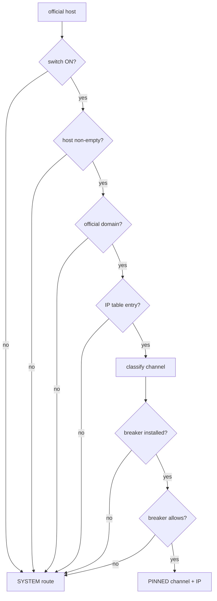
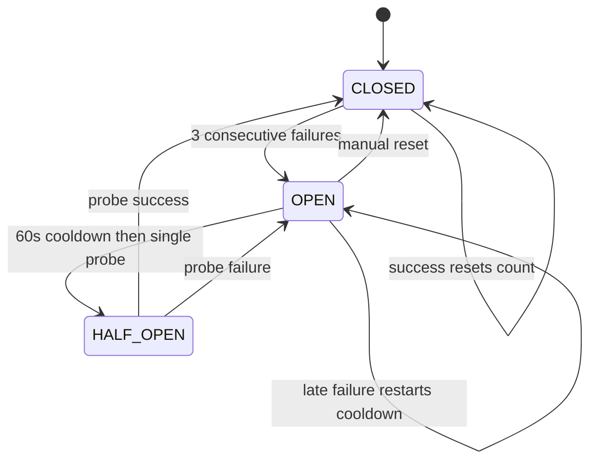
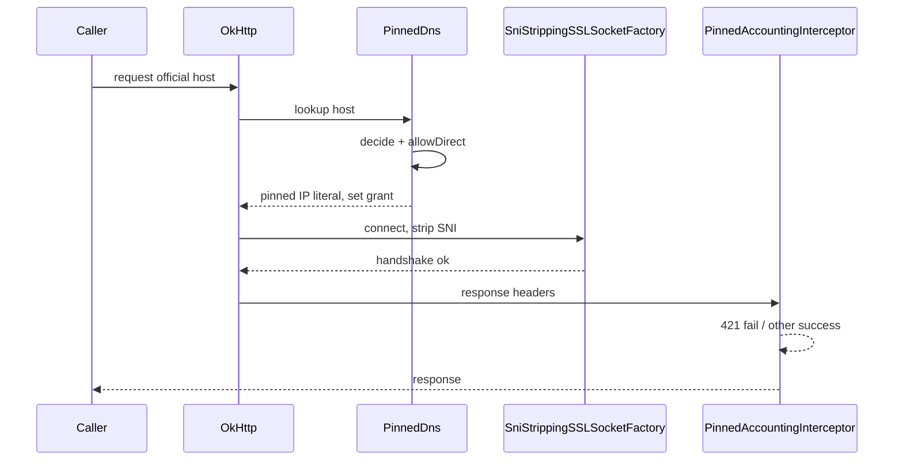

# Direct Access Transport (直连)

The **Direct Access** feature (`网络直连`, ADR-0144, spec [#385](https://github.com/a1121611810/Pictelio/issues/385), tickets #386–#392) is a Java-native OkHttp routing layer that lets the app reach Pixiv's official `*.pixiv.net` / `*.pximg.net` edges **without a user-provided proxy** — the condition that motivated it is mainland-China network policy, where DNS pollution plus HTTPS SNI blocking RST any ClientHello carrying a pixiv SNI.

It is **default-off**, lives entirely in the Java layer (JS is zero-knowledge), and is orthogonal to the image host (镜像站): the image host decides *which warehouse* (official vs mirror), while direct access decides *which route* to the official warehouse (system vs pinned). See [Image Host Selection](/openwiki/architecture/image-pipeline.md#image-host-selection).

## Why it exists

- Without it, a proxy-less user who has already logged in still needs a proxy to refresh the OAuth token, so the login state can drop at any time.
- A feasibility probe ([`docs/research/pixiv-direct-access-feasibility.md`](/docs/research/pixiv-direct-access-feasibility.md)) proved a proxy-free path: **pin the edge IP + send no SNI + route by Host header**. The no-SNI handshake still returns a valid `*.pixiv.net` wildcard certificate, so platform cert-chain + hostname validation is retained (unlike Pixez-compat's "disable verification" form). Routing to the *wrong* edge IP yields **421 Misdirected Request** rather than a block — the app treats 421 as a transport failure and falls back.
- Two vhost-specialized edges are pinned: the image edge `210.140.139.131` (pximg) and the API+OAuth edge `210.140.139.155` (pixiv.net). The OAuth refresh endpoint is reachable proxy-free but rate-limited with a ~30s short window, which informs the circuit-breaker cooldown.

## Component map

The feature is a self-contained **subpackage** `io.pictelio.app.directaccess/` under the main source set (ADR-0144 D7 — deliberately *not* a Gradle module, so its tests run in the existing `testFullDebugUnitTest` gate and a future module extraction stays a mechanical move). Eight main files:

| File | Role |
|------|------|
| [`DirectAccessPolicy.java`](/packages/app/android/app/src/main/java/io/pictelio/app/directaccess/DirectAccessPolicy.java) | Pure routing decision: official host in → `SYSTEM` or `PINNED(channel, ip)` out. Gate-ordered, zero I/O. |
| [`DirectAccessConfig.java`](/packages/app/android/app/src/main/java/io/pictelio/app/directaccess/DirectAccessConfig.java) | Config boundary: three-state switch, manual IP table, remote fetch, three-layer merge snapshot, owns the breaker singleton. |
| [`ChannelCircuitBreaker.java`](/packages/app/android/app/src/main/java/io/pictelio/app/directaccess/ChannelCircuitBreaker.java) | Dual-channel session circuit breaker (IMAGE vs API_REFRESH). |
| [`DirectAccessTransport.java`](/packages/app/android/app/src/main/java/io/pictelio/app/directaccess/DirectAccessTransport.java) | The only class in the package that knows OkHttp: installs the Dns / SSLSocketFactory / EventListener / interceptor four-piece wiring. |
| [`IpTableFetcher.java`](/packages/app/android/app/src/main/java/io/pictelio/app/directaccess/IpTableFetcher.java) | Remote IP-table fetch (injected seam; production uses a dedicated non-routing OkHttp client). |
| [`IpTableMerger.java`](/packages/app/android/app/src/main/java/io/pictelio/app/directaccess/IpTableMerger.java) | Three-layer merge (manual > remote > builtin) with strict IPv4-literal validation. |
| [`DirectIpTableDefaults.java`](/packages/app/android/app/src/main/java/io/pictelio/app/directaccess/DirectIpTableDefaults.java) | Built-in edge IP table (fallback layer). |
| [`DirectAccessInitProvider.java`](/packages/app/android/app/src/main/java/io/pictelio/app/directaccess/DirectAccessInitProvider.java) | Manifest self-assembly ContentProvider that warms the config singleton before `Application.onCreate`. |

## Routing decision (gate order)

`DirectAccessPolicy.decide(host, switchState, breaker, ipTable)` short-circuits to `SYSTEM` at the first failing gate; the order is contractual (ADR-0144 D2). The circuit-breaker gate must be **last** because `allowDirect` has a side effect (it consumes the half-open single-probe credential), and querying it before the table check would burn the probe with no request to account for it.

Gate order: switch → input → whitelist (reuses `ImageHostConfig.isOfficialDomain` as the single source of truth for `*.pixiv.net` / `*.pximg.net`) → IP-table entry (missing entry → system route, never guessing an edge) → channel classification (pximg suffix → IMAGE, pixiv.net suffix → API_REFRESH) → assembly present → circuit breaker.

## Circuit breaker (dual channel)

`ChannelCircuitBreaker` keeps **independent** counters per channel (one path down doesn't drag the other, user story 9). Session-level in-memory state only (not persisted; a process restart returns to CLOSED). In half-open, a single CAS grants exactly one request the probe credential — all others are treated as open. Late failures during OPEN restart the cooldown; a late success is a no-op (recovery only honors the half-open probe result). The manual reset is exposed on the settings card.

## Request flow

`DirectAccessTransport.install(builder, config)` is called once from `PixivApiCore.getClient()` (#390), so the shared client carries the routing for every official request — API, images, ugoira zips, and OAuth refresh — with zero call-site changes (ADR-0144 D1).

The four pieces:

- **`PinnedDns`** — on a `PINNED` decision, returns a pure IP literal (`InetAddress.getByAddress`, no DNS/PTR lookup) and records a `PinnedGrant` on a `ThreadLocal`. Every other host delegates to `Dns.SYSTEM` (byte-identical to no-direct behavior). The ThreadLocal works because OkHttp 4 executes a single call on a single thread (sync = caller, async = dispatcher) and never swaps threads mid-call.
- **`SniStrippingSSLSocketFactory`** — strips SNI only when the connected peer IP equals the pinned IP. Primary mechanism: pass the pinned IP *literal* as the peer host, which JDK/Conscrypt do not derive SNI from (an empty `serverNames` list proved ineffective on JDK 21, kept only as a secondary signal). Certificate-chain and hostname validation stay on the platform default.
- **`AttributionEventListener`** — a per-call factory instance that attributes transport-level failures (`connectFailed`, `callFailed` as a backstop).
- **`PinnedAccountingInterceptor`** — the sole authority for success/failure accounting on the response: `code == 421 && direct` → failure, anything else → success (4xx/5xx are application-level, not transport). It cleans up the grant in `finally`.

**Exactly-once accounting** (breaker contract 1): each `Dns.lookup` that produces `PINNED` consumes one probe credential and mints a fresh `PinnedGrant` with a CAS `accounted` latch. Four attribution points all CAS-dedupe to a single outcome: `connectFailed`, the interceptor `catch` (post-connect, pre-header failures), `callFailed` backstop (skipped once `headersArrived` — a mid-body stream drop on a large zip does not trip the breaker), and the interceptor's post-`proceed` path (421 → fail, else success).

## IP table (three layers)

`DirectAccessConfig` merges the IP table as **manual > remote > builtin**, entry-by-entry override (not whole-layer replacement). The remote table is the hosted file [`packages/website/pixiv-ip-table.json`](/packages/website/pixiv-ip-table.json), read raw from `raw.githubusercontent` `main` — the same mechanism as update-check's `version.json` (zero deploy change). Fetch triggers: switch OFF/UNSET→ON transition (including first-read-already-ON), 24h TTL expiry on the `currentTable()` path (ON only), and manual refresh. The fetch uses a **dedicated non-routing** OkHttp client (the IP-table fetch itself must never go direct, or it deadlocks bootstrap); results persist in a `cacheDir` envelope file (corrupt → discard); failure keeps the last valid table, else the builtin, with a warn. An anti-drift test pins the hosted file to the builtin constants.

## Settings & JS bridge

- **[`native/DirectAccess.ts`](/packages/app/src/native/DirectAccess.ts)** — a thin typed proxy over the existing `PixivApi` Capacitor plugin (no new plugin registered, #391): `directAccessStatus()` (switch state, per-channel phase, table entry count/source, last fetch time) and `directAccessCommand({ action: "reset" | "refresh" })`. Non-native environments return a safe default status (`UNSET`/both channels `CLOSED`) and reject commands (no silent degradation).
- **[`stores/directAccessStore.ts`](/packages/app/src/stores/directAccessStore.ts)** — settings source of truth, writing the same `direct_access_settings` key under `CapacitorStorage` that Java reads, in the exact `{"enabled", "manual":[{host,ip}]}` shape (fields must not drift; migrate strips unknown fields). Reuses the settings registry and mirrors Java's strict IPv4 validation.
- **[`components/settings/SettingsDirectAccess.tsx`](/packages/app/src/components/settings/SettingsDirectAccess.tsx)** — the `网络直连` settings card: on/off toggle, route label, per-channel phase badges, IP-table entry summary, reset-breaker / refresh-table commands, and a collapsible manual-IP editor.

The toggle writes `direct_access_settings`; Java's `DirectAccessConfig` re-reads on the next request's `raw.equals` hot path (no IPC needed).

## Wiring points

- **`PixivApiCore.getClient()` (#390)** — installs the transport on the shared OkHttp client; `config == null` (provider didn't run, e.g. JVM unit tests) → `install` no-op → pure system route, zero exceptions (the degradation contract).
- **`AuthPlugin.refreshToken()` (#386)** — converged onto `PixivApiCore.getSharedClient()` instead of its own client, so OAuth refresh shares the connection pool, dispatcher, timeouts, and direct-access route. Its `oauthRejectMessage` cross-endpoint contract is pinned by a test.
- **`DirectAccessInitProvider` (#392)** — a manifest-declared `ContentProvider` (exported=false, `${applicationId}.directaccessinit`) warms `DirectAccessConfig.get(context)` before `Application.onCreate`. The original `requireContext()` call crashed with `NoSuchMethodError` on minSdk 28 (it is API 30+); the fix uses `getContext()`.

## Watch-outs

- **Default off, first login excluded** — PKCE first login must carry SNI and password grant is out of scope; only post-login traffic (view/API/refresh/ugoira) is direct-eligible.
- **URL and Host header are never rewritten** — the cache-key "source-independent hit" invariant from ADR-0143 is inherited intact; no re-dispatch, no circular guard.
- **Off-whitelist hosts are byte-identical** — mirror URLs, GitHub (update-check), and OTA hosts are outside `*.pixiv.net` / `*.pximg.net` and always take the system route.
- **Proxy bypasses Dns** — a dev-machine proxy system property sidesteps the custom Dns (OkHttp prefers system proxy), which matches the product semantics ("no proxy needed when one exists"); tests set `NO_PROXY` explicitly.
- **Cat-and-mouse** — the pin table is updatable precisely because edge IP liveness and GFW policy shift; the three layers (passive breaker + remote table + manual edit) absorb that.

## Related

- [API Layer & Authentication](/openwiki/architecture/api-layer.md) — the shared OkHttp gateway and OAuth flows this rides on
- [Image Loading Pipeline — Image Host Selection](/openwiki/architecture/image-pipeline.md#image-host-selection) — the orthogonal image-host (warehouse) decision
- [Android Native & Build](/openwiki/integrations/android-native.md) — native plugin/module reference
- ADR-0144 / [spec #385](https://github.com/a1121611810/Pictelio/issues/385)
