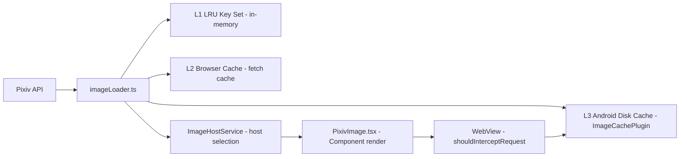

# Image Loading Pipeline

## Overview

The image loading pipeline is documented exhaustively in `/docs/image-loading-pipeline.md` (~40KB). This page summarizes the architecture and key components.



## Three-Layer Cache

| Layer | Store | Location | Eviction |
|-------|-------|----------|----------|
| **L1** | LRU `Set<string>` (URL keys) | `imageLoader.ts` | Periodic GC with context-aware scoring (image width, file size, staleness) |
| **L2** | Browser HTTP cache | `fetch` response cache | Standard HTTP caching |
| **L3** | Android disk cache | `ImageCachePlugin.java` (native) | LRU with configurable max size |

### L1 Cache (LRU Key Set)

The L1 cache stores only URL strings (not image blobs) in a `Set`. When a URL is accessed, it's removed and re-added to the set (LRU ordering). Periodic GC runs every 30 seconds:

- **Scoring function** considers: image width, estimated file size, time since last access
- **Threshold-based eviction:** URLs with score < `threshold` (dynamically adjusted) are evicted
- Cache capacity: default 500 entries (configurable)

Context-aware eviction (ADR-0030) prevents large, rarely-used images from crowding out frequently-viewed thumbnails.

## Image Host Selection

`imageHostStore.ts` and `imageHostService.ts` manage multiple Pixiv image CDN hosts:

```
i.pixiv.re       — Primary (official mirror)
i.pixiv.nl        — Alternative
api.pixiv.cat     — Alternative
i.pximg.net       — Direct Pixiv CDN
```

**Selection modes:**

| Mode | Behavior |
|------|----------|
| `race` | Request all hosts, use first response |
| `weighted` | Prefer highest-weighted healthy host |
| `fastest-ip` | DNS-resolve all, connect to fastest |
| `single` | Always use a single configured host |

Host health is tracked with success/failure counts and timeouts.

## PixivImage Component

`/packages/app/src/components/PixivImage.tsx` — The main image display component that:

1. Resolves the illust URL through the image host system
2. Applies Fluent Design image tokens (border-radius, shadow)
3. Handles loading states with skeleton shimmer
4. Integrates with the three-layer cache

## LazyDetailImage Component

`/packages/app/src/components/LazyDetailImage.tsx` — Lazy-loading wrapper for multi-page illust detail images with dual visibility detection:

1. **Eager signal-driven preload** — `preloaded()` memo now hardcodes `return true` (changed from `visiblePage + PRELOAD_WINDOW` windowing). All pages in a multi-page illust trigger `loadImage()` prefetch to disk cache immediately on mount, regardless of scroll position. The `PRELOAD_WINDOW` constant (`3`) and `visiblePage` prop are retained as transitive dependencies for external code but are no longer used in the preload decision.
2. **Local IntersectionObserver** — Always-active `createEverVisible` observer (removed `skipObserver` in v3.21.3). Elements entering the viewport independently trigger `loadImage()` regardless of `preloaded()`.

Since `preloaded()` is always `true`, the `shouldLoad()` memo (`preloaded() || ioVisible()`) is effectively always `true`. The only gate on image display is whether `cacheReadyFor() === props.src`.

**Native cache prefill (v3.21+):** A `createEffect` calls `loadImage(src)` from `imageLoader.ts`, which triggers native `PixivApiPlugin.prefetchImage()` (OkHttp + connection pool). This seeds the L3 Android disk cache before `PixivImage` renders, ensuring the WebView's `shouldInterceptRequest` can serve a cached `WebResourceResponse` rather than doing a synchronous network fetch on the UI thread. Starting in v3.21.2, `shouldInterceptRequest` itself uses the same shared `OkHttpClient` from `PixivApiPlugin.getSharedClient()`, so even cache-miss requests benefit from connection pooling.

**Race condition elimination (v3.21.1):** The initial implementation used a simple `cacheReady: boolean` signal. The current version uses `cacheReadyFor: Signal<string>` — keyed by the image URL string, not a boolean. A dedicated `createEffect` resets both `cacheReadyFor` to `""` and `retryTrigger` to `0` on `props.src` change (cross-illust navigation, v3.21.2 also resets the retry counter). The `loadImage().then()` success handler checks `if (props.src === src)` before marking the URL as ready, while the `.catch()` handler does not mark it — a stale-closure guard that prevents an in-flight async completion from incorrectly signaling a _different_ illust's image as ready, and ensures failures don't bypass the retry mechanism. The `canDisplayImage` memo returns true only when `cacheReadyFor() === props.src && shouldLoad()` (with an additional `props.src` truthiness guard). See the [detail image loading glossary](/docs/adr/glossary-detail-image-loading.md) for all related terminology.

**OkHttp concurrency** (`PixivApiPlugin`): `maxRequestsPerHost = 10`, `maxRequests = 20`, and `callTimeout` = `TIMEOUT_CONNECT + TIMEOUT_READ` (v3.21.3+). A custom `Dispatcher` with a cached thread pool prevents thread starvation under concurrent prefetches. Since `preloaded()` now triggers all pages immediately (up to `totalPages` parallel downloads), the per-host limit of 10 ensures no single CDN host is overwhelmed. The 4-page window from previous versions is no longer the limiting factor. See [ADR-0039](/docs/adr/ADR-0039-detail-image-cache-ready.md) for the full design rationale.

**Prefetch retry on failure (v3.21.2+):** If `loadImage()` → `PixivApiPlugin.prefetchImage()` fails or exceeds a 12-second timeout, `LazyDetailImage`'s `createEffect` catches the failure and retries via a `retryTrigger` signal, up to `MAX_RETRIES = 3` attempts with `RETRY_DELAY_MS = 2000` between them. The 12s timeout (v3.21.3+) uses `Promise.race` against `loadImage()` and guards against OkHttp queue congestion when many concurrent image requests are queued — timing out allows the retry to land on a different connection slot. Cleanup via `onCleanup` cancels any pending retry or timeout timer on component unmount or `props.src` change.

**Fallback on retry exhaustion (v3.21.4):** When all `MAX_RETRIES` attempts fail, the `.catch()` handler now falls through to `setCacheReadyFor(src)` instead of leaving the image in an unready state. This marks the image ready for `PixivImage` rendering, and `shouldInterceptRequest` performs a synchronous fallback download via the shared OkHttp client. The degraded performance (UI-thread fetch) is preferable to a permanently blank image area.

**Route-level preload kickoff (v4.0+):** `IllustDetail` (the route component) now calls `loadImage(url)` for all pages of multi-page illusts (`page_count > 1`) immediately upon receiving illust data — before any `LazyDetailImage` components mount. This starts the native `PixivApi.prefetchImage()` → OkHttp download → disk cache write earlier in the component lifecycle. `loadImage`'s in-flight deduplication in `imageLoader.ts` (`inflightRequests` Map, line 250) ensures that when `LazyDetailImage`'s `createEffect` later calls the same URL, it reuses the same promise instead of issuing a duplicate network request. The route-level preload does not set `cacheReadyFor` (that remains the responsibility of each `LazyDetailImage`), but seeding the L3 disk cache before component mount significantly improves the odds that `loadImage()` inside `LazyDetailImage` finds a cache hit and resolves quickly.

```mermaid
sequenceDiagram
    participant ILD as IllustDetail (route)
    participant IL as imageLoader.ts
    participant LDI as LazyDetailImage
    participant PP as PixivApiPlugin (native)
    participant DC as L3 Disk Cache
    participant WV as WebView shouldInterceptRequest

    ILD->>ILD: illust data arrives
    alt page_count > 1 (multi-page)
        ILD->>IL: loadImage(url) for all page URLs
        IL->>PP: prefetchImage(url)
        PP->>DC: OkHttp download → disk cache write
        Note over IL: inflight dedup registers URLs
    end
    ILD->>LDI: mount → preloaded() = true (always, all pages)
    LDI->>LDI: shouldLoad = preloaded || ioVisible → always true
    LDI->>IL: createEffect → loadImage(src) [dedup → no-op]
    Note over IL: Same promise reused via inflightRequests
    LDI->>LDI: cacheReadyFor = src (on then success)
    Note over LDI: Up to MAX_RETRIES retries; on exhaustion → setCacheReadyFor(src) as fallback
    Note over WV: Later, PixivImage renders
    WV->>DC: interceptImage() → cache HIT
    DC-->>WV: WebResourceResponse (instant)
    Note over WV: Cache hit via shared OkHttpClient; misses also use connection pool
```

## WebView Proxy Interception

On Android, `ImageCachePlugin.java` intercepts image requests via `shouldInterceptRequest()`:

- Checks the L3 disk cache before making a network request
- Returns cached response if available
- Falls through to network if not cached
- Implements SSRF protection via a URL whitelist (ADR-0002)

## Web Worker Measurement

`packages/app/src/primitives/createImageSizeWorker.ts` uses a Web Worker (`imageSize.worker.ts`) to:

- Fetch image metadata (width, height) without loading the full image
- Cache dimension results
- Used by the virtual scroller to calculate item sizes before rendering

## Ugoira (Animated Illust) Pipeline

Ugoira is Pixiv's animated illust format (ZIP of frames with timing data). Pictelio handles ugoira with a dedicated loading and playback pipeline.

### Inline Playback with Progress Indicator

Introduced in v3.17.4-3.17.5, the ugoira experience was rewritten to support **inline playback** directly on the illust detail page (replacing the previous full-screen viewer):

1. **Cover image remains in place** during loading — the illust detail page keeps the cover image rendered beneath the loading indicator
2. **Progress indicator** — an SVG ring progress bar with numeric percentage (0-100%) displays during ZIP download and frame extraction
3. **Seamless transition** — once all frames are decoded, the cover is replaced by `UgoiraViewer` with zero visual gap

### `downloadAndExtractUgoira()`

Shared function in `/packages/app/src/api/illust.ts` that consolidates the ZIP download + per-frame extraction logic:
- Stream-downloads the ugoira ZIP from Pixiv
- Decompresses each frame in sequence
- Supports a progress callback for the UI progress indicator
- Returns `{ blobUrls: string[], frames: UgoiraFrame[] }`

### UgoiraViewer Component

`/packages/app/src/components/UgoiraViewer.tsx` — the playback component with:

| Prop | Type | Purpose |
|------|------|---------|
| `illustId` | `number` | Pixiv illust ID for loading |
| `coverUrl` | `string` | Fallback cover image URL |
| `inline` | `boolean` | If true, renders inline with `aspectRatio` (not full-screen) |
| `aspectRatio` | `string` | Container aspect ratio for inline mode |
| `preloadedFrames` | `UgoiraFrame[]` | Optional pre-loaded frames (skips internal fetch) |

The `preloadedFrames` prop allows the parent (`IllustDetail`) to preload frames using `downloadAndExtractUgoira()` and pass them directly, enabling the progress indicator display on the parent's cover image before `UgoiraViewer` mounts.

### List Card Aspect Ratio

For ugoira illusts in feed lists (virtual scroll):
- **ImageCard** uses a fixed 1:1 square `aspect-ratio` for ugoira cards
- **VirtualFeed** `estimateSize` and **LazyImageCard** skeleton dimensions are synchronized to match the 1:1 aspect ratio
- This prevents layout shift and keeps grid consistency between static and animated cards

## Key Files

| Purpose | Path |
|---------|------|
| Image loader (L1 cache, GC, prefetch) | `/packages/app/src/utils/imageLoader.ts` |
| Image host selection and management | `/packages/app/src/stores/imageHostStore.ts` |
| Image host service | `/packages/app/src/services/imageHostService.ts` |
| PixivImage display component | `/packages/app/src/components/PixivImage.tsx` |
| LazyDetailImage lazy-loading wrapper | `/packages/app/src/components/LazyDetailImage.tsx` |
| Image cache native plugin | `/packages/app/src/native/ImageCache.ts` |
| Web Worker for size measurement | `/packages/app/src/primitives/createImageSizeWorker.ts` |
| Ugoira download + extraction | `/packages/app/src/api/illust.ts` (`downloadAndExtractUgoira()`) |
| Ugoira playback component | `/packages/app/src/components/UgoiraViewer.tsx` |
| Full pipeline documentation | `/docs/image-loading-pipeline.md` |
| ADR: Three-layer cache design | `/docs/adr/0003-image-cache-three-layer.md` |
| ADR: L1 key set migration | `/docs/adr/0014-l1-image-cache-key-set.md` |
| ADR: Periodic GC | `/docs/adr/0030-image-cache-periodic-gc.md` |
| ADR: SSRF whitelist | `/docs/adr/0002-ssrf-url-whitelist-strategy.md` |
| ADR: Detail image cache-ready rendering | `/docs/adr/ADR-0039-detail-image-cache-ready.md` |
| Glossary: Detail image loading | `/docs/adr/glossary-detail-image-loading.md` |

## Related

- [Architecture Overview](/openwiki/architecture/overview.md)
- [Android Native & Build](/openwiki/integrations/android-native.md)
- ADR-0003, ADR-0014, ADR-0030, ADR-0039
