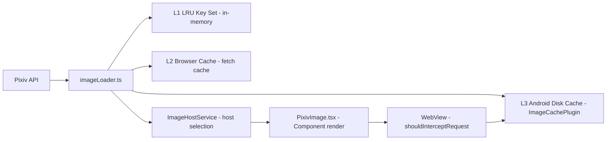
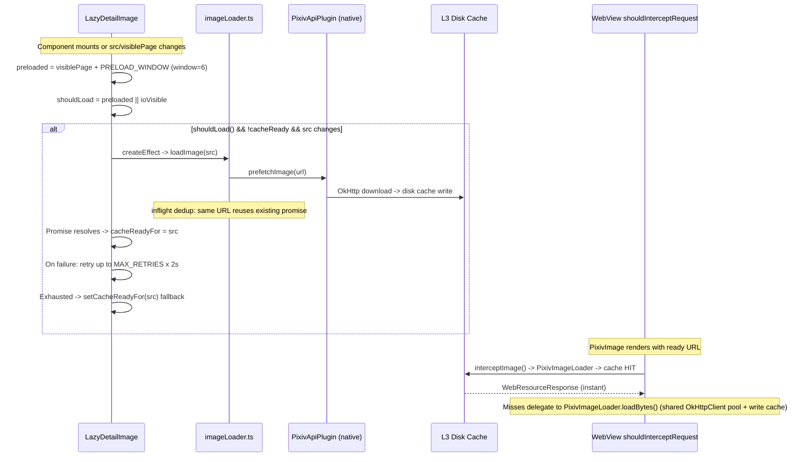

# Image Loading Pipeline

## Overview

The image loading pipeline is documented exhaustively in `/docs/image-loading-pipeline.md` (~40KB). This page summarizes the architecture and key components.



## Three-Layer Cache

| Layer | Store | Location | Eviction |
|-------|-------|----------|----------|
| **L1** | LRU `Set<string>` (URL keys) | `imageLoader.ts` | Periodic GC with context-aware scoring (image width, file size, staleness) |
| **L2** | Browser HTTP cache | `fetch` response cache | Standard HTTP caching |
| **L3** | Android disk cache | `ImageCachePlugin.java` / `PixivImageLoader.java` (native) | LRU with configurable max size |

### L1 Cache (LRU Key Set)

The L1 cache stores only URL strings (not image blobs) in a `Set`. When a URL is accessed, it's removed and re-added to the set (LRU ordering). Periodic GC runs every 30 seconds:

- **Scoring function** considers: image width, estimated file size, time since last access
- **Threshold-based eviction:** URLs with score < `threshold` (dynamically adjusted) are evicted
- Cache capacity: default 500 entries (configurable)

Context-aware eviction (ADR-0030) prevents large, rarely-used images from crowding out frequently-viewed thumbnails.

## User-Facing Cache Controls (ADR-0090)

The three internal cache layers are exposed to users as three **independent switches** on a dedicated `/image-cache` settings route ([`ImageCacheSettings.tsx`](/packages/app/src/routes/ImageCacheSettings.tsx)), replacing the old "图片缓存限制" LRU-entry-count slider which had no measurable effect on render speed:

| Switch | Layer | Mechanism | Default |
|--------|-------|-----------|---------|
| **A — 磁盘缓存** | L3 Android disk cache | `ImageCachePlugin.setDiskCacheEnabled()`; `MainActivity.interceptImage()` checks the flag + file existence | on |
| **B — 浏览器缓存** | Browser HTTP cache | `interceptImage()` adds `Cache-Control: public, max-age=31536000, immutable` to `WebResourceResponse`; a hit never reaches `shouldInterceptRequest` | on |
| **C — 后台预取** | JS prefetch (LRU + disk) | `VirtualFeed.tsx`'s prefetch `createEffect` gates on the `imageCachePrefetch` signal | on |

A real **磁盘缓存上限** slider (50–1000 MB) now bounds the disk layer. `cacheSize` (the legacy entry-count state) is kept internally for `resetUiStore` compatibility but no longer exposed in the UI. Explicitly rejected: blob URLs (blob lifetime binds to LRU eviction → broken `` refs) and Service Worker caching (Capacitor 8 has no SW by default and it would conflict with the local-server mechanism).

## Image Host Selection

`imageHostStore.ts` and `imageHostService.ts` manage multiple Pixiv image CDN hosts:

```
i.pixiv.re       — Primary (official mirror)
i.pixiv.nl        — Alternative
api.pixiv.cat     — Alternative
i.pximg.net       — Direct Pixiv CDN
```

**Selection modes:**

| Mode | Behavior |
|------|----------|
| `race` | Request all hosts, use first response |
| `weighted` | Prefer highest-weighted healthy host |
| `fastest-ip` | DNS-resolve all, connect to fastest |
| `single` | Always use a single configured host |

Host health is tracked with success/failure counts and timeouts.

## PixivImage Component

`/packages/app/src/components/PixivImage.tsx` — The main image display component that:

1. Resolves the illust URL through the image host system
2. Applies Fluent Design image tokens (border-radius, shadow)
3. Handles loading states with skeleton shimmer
4. Integrates with the three-layer cache

## LazyDetailImage Component

`/packages/app/src/components/LazyDetailImage.tsx` — Lazy-loading wrapper for multi-page illust detail images with dual visibility detection:

1. **Signal-driven preload** — `preloaded()` memo uses windowed logic: pages within `visiblePage + PRELOAD_WINDOW` (currently `PRELOAD_WINDOW = 6`) trigger `loadImage()` prefetch to disk cache. The `visiblePage` prop is tracked by the parent `IllustDetail` component as the user scrolls between pages, ensuring the next several pages are loaded ahead of the viewport.
2. **Local IntersectionObserver** — Always-active `createEverVisible` observer (removed `skipObserver` in v3.21.3). Elements entering the viewport independently trigger `loadImage()` regardless of `preloaded()`. This is the fallback path when `visiblePage` is undefined or the windowed preload is insufficient.

**Native cache prefill (v3.21+):** A `createEffect` calls `loadImage(src)` from `imageLoader.ts`, which triggers native `PixivApiPlugin.prefetchImage()` (OkHttp + connection pool). This seeds the L3 Android disk cache before `PixivImage` renders, ensuring the WebView's `shouldInterceptRequest` can serve a cached `WebResourceResponse` rather than doing a synchronous network fetch on the UI thread. The `shouldInterceptRequest` → `interceptImage()` path delegates to [`PixivImageLoader`](/openwiki/integrations/android-native.md#pixivimageloader) (shared singleton), which handles URL rewriting, disk cache read/write, and OkHttp download — reusing the connection pool from `PixivApiPlugin.getSharedClient()`. Per-URL locking prevents concurrent cache writes from multi-threaded WebView interception.

**Race condition elimination (v3.21.1):** The initial implementation used a simple `cacheReady: boolean` signal. The current version uses `cacheReadyFor: Signal<string>` — keyed by the image URL string, not a boolean. A dedicated `createEffect` resets both `cacheReadyFor` to `""` and `retryTrigger` to `0` on `props.src` change (cross-illust navigation, v3.21.2 also resets the retry counter). The `loadImage().then()` success handler checks `if (props.src === src)` before marking the URL as ready, while the `.catch()` handler does not mark it — a stale-closure guard that prevents an in-flight async completion from incorrectly signaling a _different_ illust's image as ready, and ensures failures don't bypass the retry mechanism. The `canDisplayImage` memo returns true only when `cacheReadyFor() === props.src && shouldLoad()` (with an additional `props.src` truthiness guard). See the [detail image loading glossary](/docs/adr/glossary-detail-image-loading.md) for all related terminology.

**OkHttp concurrency** (`PixivApiPlugin`): `maxRequestsPerHost = 10`, `maxRequests = 20`, and `callTimeout` = `TIMEOUT_CONNECT + TIMEOUT_READ` (v3.21.3+). A custom `Dispatcher` with a cached thread pool prevents thread starvation under concurrent prefetches. With `PRELOAD_WINDOW = 6`, up to 7 pages (visible page + 6 ahead) may download in parallel per illust. The per-host limit of 10 ensures no single CDN host is overwhelmed. See [ADR-0039](/docs/adr/ADR-0039-detail-image-cache-ready.md) for the full design rationale.

**Prefetch retry on failure (v3.21.2+):** If `loadImage()` → `PixivApiPlugin.prefetchImage()` fails or exceeds a 12-second timeout, `LazyDetailImage`'s `createEffect` catches the failure and retries via a `retryTrigger` signal, up to `MAX_RETRIES = 3` attempts with `RETRY_DELAY_MS = 2000` between them. The 12s timeout (v3.21.3+) uses `Promise.race` against `loadImage()` and guards against OkHttp queue congestion when many concurrent image requests are queued — timing out allows the retry to land on a different connection slot. Cleanup via `onCleanup` cancels any pending retry or timeout timer on component unmount or `props.src` change.

**Fallback on retry exhaustion (v3.21.4):** When all `MAX_RETRIES` attempts fail, the `.catch()` handler now falls through to `setCacheReadyFor(src)` instead of leaving the image in an unready state. This marks the image ready for `PixivImage` rendering, and `shouldInterceptRequest` delegates to [`PixivImageLoader.loadBytes()`](/openwiki/integrations/android-native.md#pixivimageloader) (synchronous download + disk cache write) or `PixivImageLoader.download()` (when disk cache is off). The degraded performance (UI-thread fetch) is preferable to a permanently blank image area.



## WebView Proxy Interception

On Android, `MainActivity.java` intercepts image requests via `shouldInterceptRequest()`, delegating to a shared [`PixivImageLoader`](/openwiki/integrations/android-native.md#pixivimageloader) singleton:

- **URL rewriting:** `PixivImageLoader.rewriteUrl()` converts `/pixiv-img/…` paths to Pixiv CDN URLs
- **Disk cache check:** `PixivImageLoader.cachedFile()` looks up the L3 disk cache (Base64 URL-safe filename) — hit returns a `WebResourceResponse` with `FileInputStream`
- **Cache miss with disk enabled:** `PixivImageLoader.loadBytes()` downloads via shared OkHttp pool, writes to disk cache, returns `byte[]` wrapped as `WebResourceResponse`
- **Cache miss with disk disabled:** `PixivImageLoader.download()` downloads without writing to disk
- **Per-URL locking** (`ConcurrentHashMap`) prevents concurrent cache writes from multi-threaded WebView interception
- SSRF protection via URL whitelist (ADR-0002)
- Errors are logged via `android.util.Log` instead of `printStackTrace()`

## Web Worker Measurement

`packages/app/src/primitives/createImageSizeWorker.ts` uses a Web Worker (`imageSize.worker.ts`) to:

- Fetch image metadata (width, height) without loading the full image
- Cache dimension results
- Used by the virtual scroller to calculate item sizes before rendering

## Ugoira (Animated Illust) Pipeline

Ugoira is Pixiv's animated illust format (ZIP of frames with timing data). Pictelio handles ugoira with a dedicated loading and playback pipeline.

### Inline Playback with Progress Indicator

Introduced in v3.17.4-3.17.5, the ugoira experience was rewritten to support **inline playback** directly on the illust detail page (replacing the previous full-screen viewer):

1. **Cover image remains in place** during loading — the illust detail page keeps the cover image rendered beneath the loading indicator
2. **Progress indicator** — an SVG ring progress bar with numeric percentage (0-100%) displays during ZIP download and frame extraction
3. **Seamless transition** — once all frames are decoded, the cover is replaced by `UgoiraViewer` with zero visual gap

### Streaming Playback (v4.23.0, ADR-0127 / ADR-0128)

Since v4.23.0, both clients play ugoira **progressively** instead of "download the whole ZIP, then play":

- **App (WebView) — `streamUgoiraFrames` (ADR-0127):** `packages/app/src/api/illust.ts` feeds the ZIP body reader into the shared [`@pictelio/ugoira`](/packages/ugoira/) `createStreamFrameSource`, which emits each frame as soon as its data is complete (fflate `ondata(final)` semantics), buffering out-of-order entries. The viewer creates a blob URL per frame and starts playback at the first frame — **first frame ≈2% download** (was 100%, ~8s for a 12.9MB/406-frame illust).
- **Lynx native — Java streaming (ADR-0128):** `UgoiraStreamEngine` + `ugoiraExtractStream`/`ugoiraExtractStreamPoll`/`ugoiraExtractStreamCancel` in [`PictelioApiModule.java`](/packages/app/android/app/src/lynx/java/io/pictelio/app/PictelioApiModule.java) stream the zip in Java (`ZipInputStream`, local-header-driven, no central directory), write frames to disk in batches, and deliver frame-URL batches through a pull-mode state machine (Lynx `Callback` is one-shot). First batch arrives at ~4.5–8.6% download.

Both paths keep frame bytes off the JS heap (ADR-0037); lynx native delivers only `file://` URL lists. The shared stream semantics (`createStreamFrameSource`) are pure-TS and covered by increment/out-of-order/corrupt tests; the Java batch core is pure-JVM and unit-tested.

### Native Extract-to-Disk (lynx, ADR-0125)

In native LynxView, the WebView `shouldInterceptRequest` proxy never runs, so relative `/pixiv-img/...` URLs are rejected by `LynxFetchModule` (no scheme). `PictelioApi.ugoiraExtract(zipUrl, framesJson, cb)` downloads the zip via OkHttp (with `Referer`/UA), decompresses with `ZipInputStream`, writes `cache/ugoira/<illustId>/frame_N.{png|jpg}`, and returns a `file://` URL list. [`PictelioImageService`](/packages/app/android/app/src/lynx/java/io/pictelio/app/PictelioImageService.java) gained a `file://` branch (`canParseUrl` + `loadAndDeliver` read-from-disk). On repeat playback, an integrity check (frame count matches `framesJson` and non-empty) skips the download entirely (ADR-0126).

### Playback Fixes (ADR-0126)

- **Lynx flicker:** `UgoiraViewer.vue` added `defer-src-invalidation` on `<image>` — the default clears the displayed frame before the next load, causing blank flashes at 20–80ms frame intervals. The attribute keeps the old frame until the new one loads.
- **App `range` mode:** the interceptor destroys 206 semantics (`Content-Length` invisible to fetch; `bytes=…` responses truncated or `ERR_FAILED`), so the official streaming scheme cannot work through `shouldInterceptRequest`. `extractRange` now degrades to the fflate full path with a `console.warn` (no silent fallback).

### `downloadAndExtractUgoira()` (legacy full path)

Shared function in `/packages/app/src/api/illust.ts` that consolidates the ZIP download + per-frame extraction logic (now the **full-download path**, still used by `range` mode and preloaded compatibility):
- Stream-downloads the ugoira ZIP from Pixiv
- Decompresses each frame in sequence
- Supports a progress callback for the UI progress indicator
- Returns `{ blobUrls: string[], frames: UgoiraFrame[] }`

### UgoiraViewer Component

`/packages/app/src/components/UgoiraViewer.tsx` — the playback component with:

| Prop | Type | Purpose |
|------|------|---------|
| `illustId` | `number` | Pixiv illust ID for loading |
| `coverUrl` | `string` | Fallback cover image URL |
| `inline` | `boolean` | If true, renders inline with `aspectRatio` (not full-screen) |
| `aspectRatio` | `string` | Container aspect ratio for inline mode |
| `preloadedFrames` | `UgoiraFrame[]` | Optional pre-loaded frames (skips internal fetch) |

The `preloadedFrames` prop allows the parent (`IllustDetail`) to preload frames and pass them directly, enabling the progress indicator display on the parent's cover image before `UgoiraViewer` mounts. The streaming path appends ready frames incrementally and the player waits at the tail for new frames (ADR-0127).

### List Card Aspect Ratio

For ugoira illusts in feed lists (virtual scroll):
- **ImageCard** uses a fixed 1:1 square `aspect-ratio` for ugoira cards
- **VirtualFeed** `estimateSize` and **LazyImageCard** skeleton dimensions are synchronized to match the 1:1 aspect ratio
- This prevents layout shift and keeps grid consistency between static and animated cards

## Key Files

| Purpose | Path |
|---------|------|
| Image loader (L1 cache, GC, prefetch) | `/packages/app/src/utils/imageLoader.ts` |
| Image host selection and management | `/packages/app/src/stores/imageHostStore.ts` |
| Image host service | `/packages/app/src/services/imageHostService.ts` |
| PixivImage display component | `/packages/app/src/components/PixivImage.tsx` |
| LazyDetailImage lazy-loading wrapper | `/packages/app/src/components/LazyDetailImage.tsx` |
| Image cache native plugin | `/packages/app/src/native/ImageCache.ts` |
| Web Worker for size measurement | `/packages/app/src/primitives/createImageSizeWorker.ts` |
| Ugoira download + extraction | `/packages/app/src/api/illust.ts` (`downloadAndExtractUgoira()`, `streamUgoiraFrames()`) |
| Ugoira streaming frame source (shared) | `/packages/ugoira/src/stream.ts` (`createStreamFrameSource`) |
| Ugoira playback component (app) | `/packages/app/src/components/UgoiraViewer.tsx` |
| Ugoira playback component (lynx) | `/packages/app-lynx/src/components/UgoiraViewer.vue` |
| Ugoira native extract + streaming | `/packages/app/android/app/src/lynx/java/io/pictelio/app/PictelioApiModule.java`, `UgoiraStreamEngine.java` |
| Ugoira `file://` frame service | `/packages/app/android/app/src/lynx/java/io/pictelio/app/PictelioImageService.java` |
| Full pipeline documentation | `/docs/image-loading-pipeline.md` |
| ADR: Three-layer cache design | `/docs/adr/ADR-0090-image-cache-three-layer.md` |
| ADR: L1 key set migration | `/docs/adr/0014-l1-image-cache-key-set.md` |
| ADR: Periodic GC | `/docs/adr/ADR-0030-image-cache-periodic-gc.md` |
| ADR: SSRF whitelist | `/docs/adr/0002-ssrf-url-whitelist-strategy.md` |
| ADR: Detail image cache-ready rendering | `/docs/adr/ADR-0039-detail-image-cache-ready.md` |
| Glossary: Detail image loading | `/docs/adr/glossary-detail-image-loading.md` |

## Related

- [Architecture Overview](/openwiki/architecture/overview.md)
- [Android Native & Build](/openwiki/integrations/android-native.md)
- ADR-0003, ADR-0014, ADR-0030, ADR-0039, ADR-0125, ADR-0126, ADR-0127, ADR-0128
