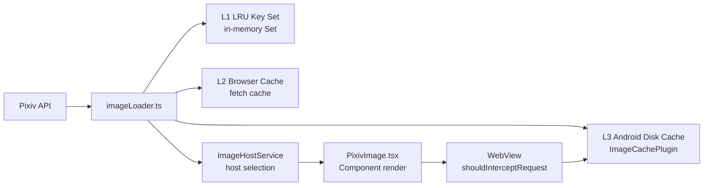

# Image Loading Pipeline

## Overview

The image loading pipeline is documented exhaustively in `/docs/image-loading-pipeline.md` (~40KB). This page summarizes the architecture and key components.



## Three-Layer Cache

| Layer | Store | Location | Eviction |
|-------|-------|----------|----------|
| **L1** | LRU `Set<string>` (URL keys) | `imageLoader.ts` | Periodic GC with context-aware scoring (image width, file size, staleness) |
| **L2** | Browser HTTP cache | `fetch` response cache | Standard HTTP caching |
| **L3** | Android disk cache | `ImageCachePlugin.java` (native) | LRU with configurable max size |

### L1 Cache (LRU Key Set)

The L1 cache stores only URL strings (not image blobs) in a `Set`. When a URL is accessed, it's removed and re-added to the set (LRU ordering). Periodic GC runs every 30 seconds:

- **Scoring function** considers: image width, estimated file size, time since last access
- **Threshold-based eviction:** URLs with score < `threshold` (dynamically adjusted) are evicted
- Cache capacity: default 500 entries (configurable)

Context-aware eviction (ADR-0030) prevents large, rarely-used images from crowding out frequently-viewed thumbnails.

## Image Host Selection

`imageHostStore.ts` and `imageHostService.ts` manage multiple Pixiv image CDN hosts:

```
i.pixiv.re       — Primary (official mirror)
i.pixiv.nl        — Alternative
api.pixiv.cat     — Alternative
i.pximg.net       — Direct Pixiv CDN
```

**Selection modes:**

| Mode | Behavior |
|------|----------|
| `race` | Request all hosts, use first response |
| `weighted` | Prefer highest-weighted healthy host |
| `fastest-ip` | DNS-resolve all, connect to fastest |
| `single` | Always use a single configured host |

Host health is tracked with success/failure counts and timeouts.

## PixivImage Component

`/packages/app/src/components/PixivImage.tsx` — The main image display component that:

1. Resolves the illust URL through the image host system
2. Applies Fluent Design image tokens (border-radius, shadow)
3. Handles loading states with skeleton shimmer
4. Integrates with the three-layer cache

## WebView Proxy Interception

On Android, `ImageCachePlugin.java` intercepts image requests via `shouldInterceptRequest()`:

- Checks the L3 disk cache before making a network request
- Returns cached response if available
- Falls through to network if not cached
- Implements SSRF protection via a URL whitelist (ADR-0002)

## Web Worker Measurement

`packages/app/src/primitives/createImageSizeWorker.ts` uses a Web Worker (`imageSize.worker.ts`) to:

- Fetch image metadata (width, height) without loading the full image
- Cache dimension results
- Used by the virtual scroller to calculate item sizes before rendering

## Key Files

| Purpose | Path |
|---------|------|
| Image loader (L1 cache, GC, prefetch) | `/packages/app/src/utils/imageLoader.ts` |
| Image host selection and management | `/packages/app/src/stores/imageHostStore.ts` |
| Image host service | `/packages/app/src/services/imageHostService.ts` |
| PixivImage display component | `/packages/app/src/components/PixivImage.tsx` |
| Image cache native plugin | `/packages/app/src/native/ImageCache.ts` |
| Web Worker for size measurement | `/packages/app/src/primitives/createImageSizeWorker.ts` |
| Full pipeline documentation | `/docs/image-loading-pipeline.md` |
| ADR: Three-layer cache design | `/docs/adr/0003-image-cache-three-layer.md` |
| ADR: L1 key set migration | `/docs/adr/0014-l1-image-cache-key-set.md` |
| ADR: Periodic GC | `/docs/adr/0030-image-cache-periodic-gc.md` |
| ADR: SSRF whitelist | `/docs/adr/0002-ssrf-url-whitelist-strategy.md` |

## Related

- [Architecture Overview](/openwiki/architecture/overview.md)
- [Android Native & Build](/openwiki/integrations/android-native.md)
- ADR-0003, ADR-0014, ADR-0030
