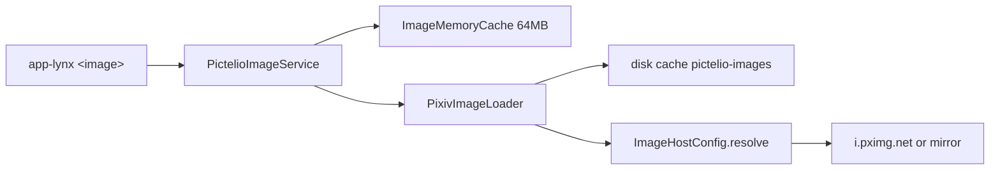
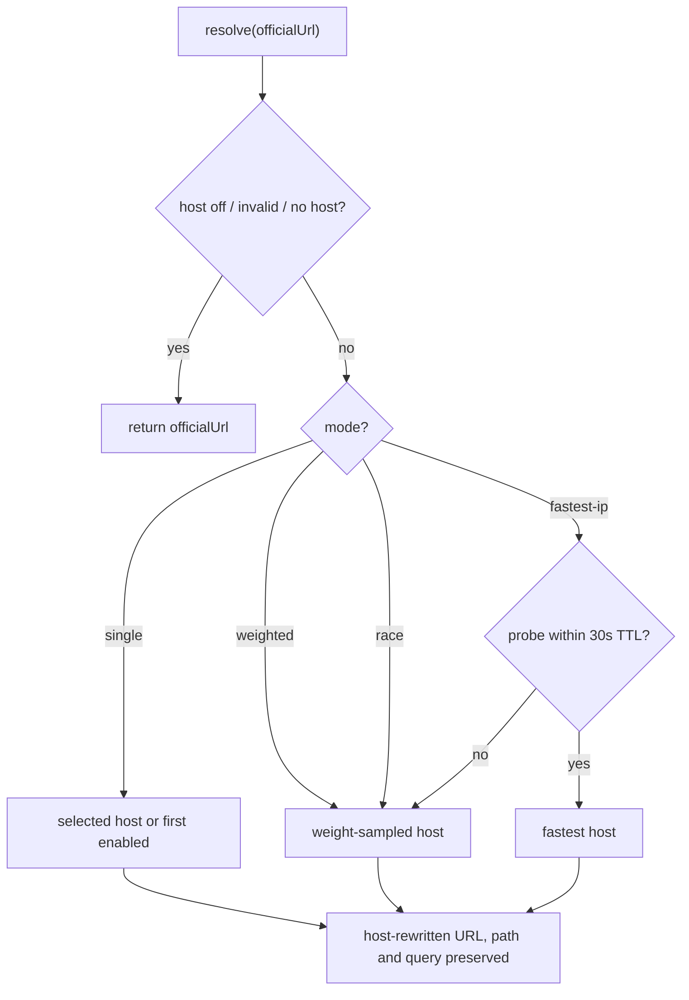
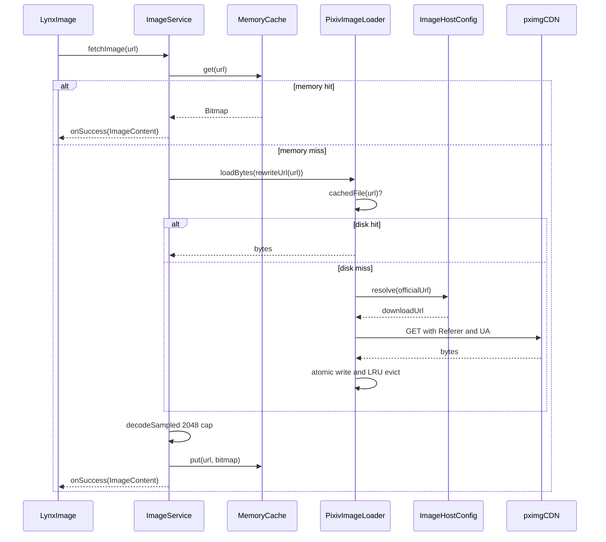
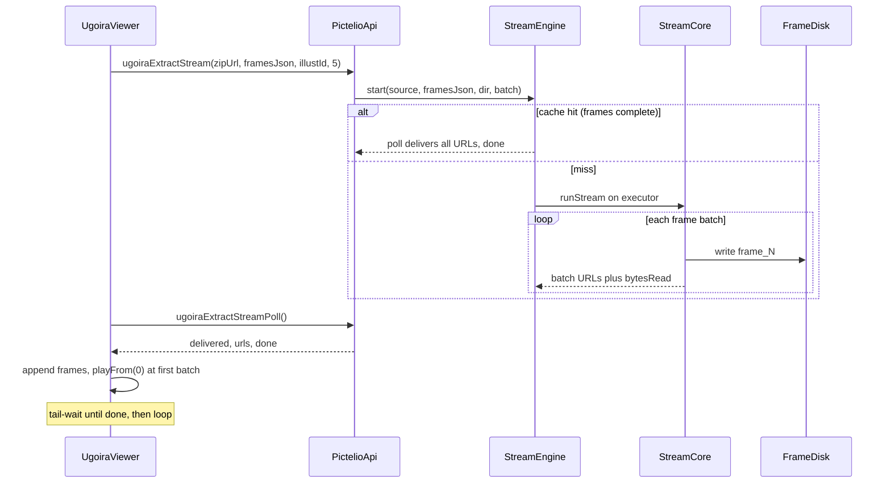

# Image Loading Pipeline

## Overview

Pictelio is now a **Lynx single-engine client**. The WebView client runtime, its Capacitor plugin layer, and its `packages/app` source tree were removed in [ADR-0203](../../docs/adr/ADR-0203-webview-client-source-removal.md); the image pipeline therefore no longer passes through `shouldInterceptRequest`, `imageLoader.ts`, or a browser HTTP cache. It now spans three packages:

- `packages/android-host` — the Android Gradle host plus the shared Java image core (`PixivImageLoader`, `ImageHostConfig`, `ImageMemoryCache`, `LruCache`) and the Lynx-specific `PictelioImageService`/`PictelioApiModule`/`UgoiraStreamEngine`.
- `packages/app-lynx` — the vue-lynx client, which renders `<image>` elements, rewrites Pixiv CDN URLs to proxy paths, and schedules ugoira playback.
- `packages/ugoira` — the shared pure-TS ugoira frame library consumed by the client.


```mermaid
flowchart LR
    Vue["app-lynx &lt;image&gt;"] --> Svc[PictelioImageService]
    Svc --> Mem[ImageMemoryCache 64MB]
    Svc --> Core[PixivImageLoader]
    Core --> Disk["disk cache pictelio-images"]
    Core --> Host[ImageHostConfig.resolve]
    Host --> CDN[i.pximg.net or mirror]
```

The single request path: a vue-lynx `<image>` element is routed to the native `PictelioImageService`, which checks the in-memory bitmap cache, falls back to `PixivImageLoader` for a disk-cache hit or a download (with `Referer`/`User-Agent`), samples-decodes the bytes, and hands back a `Bitmap`. The download source is decided per request by `ImageHostConfig.resolve(officialUrl)`.

## Cache Layers

The current cache story has two general-purpose tiers plus a dedicated ugoira frame cache.

| Tier | Store | Location | Eviction |
|------|-------|----------|----------|
| **L1** | Decoded `Bitmap` LRU | `ImageMemoryCache` (64 MB) | Byte-budget LRU (`width × height × 4`) |
| **L2** | Image bytes on disk | `PixivImageLoader` under `pictelio-images/` | Byte-budget LRU by `lastModified` (`CACHE_MAX_BYTES`, 300 MB) |
| **Ugoira** | Frame files on disk | `cache/ugoira/<illustId>/frame_N.{png,jpg}` | Count/size LRU (300 files / 50 MB) |

### L1 — native bitmap memory cache

[`ImageMemoryCache`](../../packages/android-host/android/app/src/main/java/io/pictelio/app/ImageMemoryCache.java) caches decoded `ARGB_8888` bitmaps keyed by the image URL, with byte size estimated as `width × height × 4`. Its 64 MB budget holds roughly four 2048×2048 originals, but typical list thumbnails are much smaller. It is built on the generic, pure-JVM [`LruCache`](../../packages/android-host/android/app/src/main/java/io/pictelio/app/LruCache.java), a `LinkedHashMap` in `accessOrder` mode whose `put` trims the oldest entries until the byte budget is satisfied; all operations are `synchronized` because Lynx image requests arrive on multiple threads.

A memory hit skips disk read and decode. The service delivers the cached instance directly, guarded by `cached.isRecycled()` — if the engine ever recycled the bitmap, the entry is removed and the URL is re-downloaded (ADR-0054/#147 follow-up; the earlier per-delivery `ARGB_8888` copy was removed after measurement showed it was pure overhead).

### L2 — shared disk cache in PixivImageLoader

The disk tier is owned by [`PixivImageLoader`](../../packages/android-host/android/app/src/main/java/io/pictelio/app/PixivImageLoader.java): files are keyed with `keyToFilename(url)` (Base64 URL-safe, no padding), stored under `OAuthConfig.CACHE_DIR` = `pictelio-images`, and evicted oldest-first by `lastModified` once the directory exceeds `OAuthConfig.CACHE_MAX_BYTES` (300 MB). Writes are atomic (`tmp` + `rename`), so a truncated write can never be read back as a hit, and `.tmp` residue is cleaned on failure.

### Ugoira frame cache

Ugoira frames live under `cache/ugoira/<illustId>/frame_N.{png|jpg}` and are bounded by an LRU cleanup (300 files or 50 MB, oldest `lastModified` first). A per-illust integrity check (frame count matches `meta.frames` and every file is non-empty) makes repeat playback zero-download.

### Historical: ADR-0090 three-switch UI (removed)

The WebView-era "three-layer cache" of [ADR-0090](../../docs/adr/ADR-0090-image-cache-three-layer.md) — three user switches for disk cache, browser `Cache-Control: immutable` headers, and JS prefetch — was a WebView/Capacitor construct. Its settings UI was removed with the WebView client as an accepted gap (ADR-0203). The Lynx equivalents are the native bitmap memory cache and the shared disk cache above; list-image eager-loading pressure is handled by the engine-level `lazy-load` attribute and batched data rendering instead of a JS prefetch cache ([ADR-0060](../../docs/adr/ADR-0060-lynx-feed-image-lazy-loading.md)).

## PixivImageLoader — shared image core

[`PixivImageLoader`](../../packages/android-host/android/app/src/main/java/io/pictelio/app/PixivImageLoader.java) (ADR-0054) is the single source of truth for image bytes, consumed by `PictelioImageService`, `GallerySaver` (via `loadFile`), and `NovelExporter` (via the injectable `loadBytes` test seam). Responsibilities:

- **URL rewrite** — `rewriteUrl()` maps `/pixiv-img/{path}` to `OAuthConfig.IMAGE_CDN_URL + "/" + path` (`https://i.pximg.net/...`) with `URI.normalize()` dot-segment folding; non-proxy URLs pass through unchanged.
- **Disk cache** — `cachedFile()`/`keyToFilename()`/`getCacheDir()` implement the read side; `writeFile()` is the atomic write; `enforceCacheLimit()` does oldest-first eviction.
- **Download** — `download()` resolves the source via `ImageHostConfig.resolve`, then `fetch()` injects `Referer: https://app-api.pixiv.net/` and the Pixiv iOS `User-Agent`, reusing `PixivApiCore.getSharedClient()` (connect 15 s / read 30 s / call 45 s, `maxRequestsPerHost=10`, `maxRequests=20`). Non-2xx or empty bodies throw `IOException` without writing to cache.
- **Concurrency** — `loadFile`/`loadBytes`/`loadFileWithProgress` use a per-URL lock in a `ConcurrentHashMap` plus double-checked cache read, so concurrent same-URL loads download exactly once.
- **Streaming** — `loadFileWithProgress(url, sink, cancel)` streams 8 KB chunks to the target file, reports progress every ~64 KB, honors cancellation, and atomically replaces the target on success.

The mirror path uses a smaller budget (`connect 5 s / call 15 s`) so a degraded mirror fails fast and falls back to the official URL rather than delaying first paint.

## Image host selection

The image-host (mirror) decision is a Java deep module, [`ImageHostConfig`](../../packages/android-host/android/app/src/main/java/io/pictelio/app/ImageHostConfig.java) (ADR-0143), with one public entry point:

```java
String resolve(String officialUrl)  // official URL in → actual download URL out
```

It reads `image_host_settings` JSON from `SharedPreferences("CapacitorStorage")`, parses lazily, and reuses the parsed config while the raw string is unchanged. Corrupt config, shape failure, a disabled master switch, non-`http(s)` input, or an empty usable-host list all return the official URL unchanged (with a `Log.w`, never a silent degrade). The write-side settings UI was removed with the WebView client, so the reader still honors any previously persisted mirror config but users now default back to the official host.


```mermaid
flowchart TD
    A["resolve(officialUrl)"] --> B{"host off / invalid / no host?"}
    B -- yes --> Z["return officialUrl"]
    B -- no --> C{"mode?"}
    C -- single --> S["selected host or first enabled"]
    C -- weighted --> W["weight-sampled host"]
    C -- race --> W
    C -- fastest-ip --> F{"probe within 30s TTL?"}
    F -- yes --> FH["fastest host"]
    F -- no --> W
    S --> R["host-rewritten URL, path and query preserved"]
    W --> R
    FH --> R
```

### Four-mode mapping

| Mode | Native behavior |
|------|-----------------|
| `single` | Use the selected host; if it is missing/disabled, fall back to the first enabled host. |
| `weighted` | Sample enabled `weight > 0` hosts independently per request (injected `Random`; weight 0 normalizes to 1). |
| `fastest-ip` | Use the in-memory probe result if it is within a 30 s TTL; otherwise immediately fall back to `weighted` while lazily kicking a single-flight probe. |
| `race` | Explicitly degrades to `weighted` — race was never implemented natively (labeled "Web-only" in the removed settings UI). |

The URL rewrite (`transform`) only replaces the host (protocol/host/port from the mirror baseUrl, official path + query preserved byte-for-byte), or substitutes a `{path}` template with the official path minus its leading `/`.

### Cache-key invariant

The **cache key is always the official URL**, never the resolved mirror URL. Switching source, toggling the host, or changing mirrors therefore never invalidates cached bytes; every download from any source is stored under the official-URL key. `PixivImageLoader` consumes the official input URL for cache addressing and ignores the `resolve` return value for keying (enforced by `PixivImageLoaderTest.keyToFilename_rewriteUrlProduct_equalsOfficialUrlKey`).

### Failure fallback and self-loop guard

Mirror failure (connection/HTTP/empty body) triggers **one official retry**; if both fail, the mirror's original error is thrown. A mirror whose hostname is on the official `pximg.net`/`pixiv.net` domain is skipped (`isOfficialDomain`), mirroring the removed JS `validateHostInput` write-side guard. `fastest-ip` probes run on a dedicated single-thread daemon executor with a 5 s call timeout, and a monotonic seed-overwrite rule prevents a reparse from clobbering a freshly completed probe result (issue #658).

## PictelioImageService — the Lynx image backend

[`PictelioImageService`](../../packages/android-host/android/app/src/lynx/java/io/pictelio/app/PictelioImageService.java) implements `ILynxImageService` and is the sole image backend for the vue-lynx client, registered via `LynxRuntimeInitializer` before any `LynxView` is created. It exists because Lynx does not download images itself and the default Fresco service cannot inject the `Referer` header `i.pximg.net` requires (403 without it).

- **Behavior registration** — the constructor calls `LynxEnv.inst().addBehaviors(...)` to register `<image>` (`UIImage`/`FlattenUIImage`/`AutoSizeImage`) and `<inline-image>` (`InlineImageShadowNode`); implementing the interface alone leaves a permanent skeleton on device.
- **`fetchImage`** — checks `ImageMemoryCache` first; on miss, calls `PixivImageLoader.loadBytes(rewriteUrl(url))`, `decodeSampled` (powers-of-two `inSampleSize`, 2048 px cap), stores the bitmap, and delivers `ImageContent(bitmap)` via `onSuccess`. Failures (including `OutOfMemoryError`) are caught on the worker thread and reported through `onFailure`.
- **`file://` frames** — a whitelisted branch reads bytes directly from `cache/ugoira/` (canonical-path prefix check) for ugoira playback, bypassing OkHttp.
- **`canParseUrl`** — accepts `http(s)`, `/pixiv-img/` proxy paths, and only `file://` URLs inside the ugoira cache.
- **Static-only** — `startAnimation`/`resumeAnimation`/`pauseAnimation`/`stopAnimation` return `false`; animation is driven by the JS `UgoiraViewer.vue` frame loop, not the native animation hooks.


```mermaid
sequenceDiagram
    participant Img as LynxImage
    participant Svc as ImageService
    participant Mem as MemoryCache
    participant Core as PixivImageLoader
    participant Host as ImageHostConfig
    participant CDN as pximgCDN

    Img->>Svc: fetchImage(url)
    Svc->>Mem: get(url)
    alt memory hit
        Mem-->>Svc: Bitmap
        Svc-->>Img: onSuccess(ImageContent)
    else memory miss
        Svc->>Core: loadBytes(rewriteUrl(url))
        Core->>Core: cachedFile(url)?
        alt disk hit
            Core-->>Svc: bytes
        else disk miss
            Core->>Host: resolve(officialUrl)
            Host-->>Core: downloadUrl
            Core->>CDN: GET with Referer and UA
            CDN-->>Core: bytes
            Core->>Core: atomic write and LRU evict
        end
        Svc->>Svc: decodeSampled 2048 cap
        Svc->>Mem: put(url, bitmap)
        Svc-->>Img: onSuccess(ImageContent)
    end
```

The TS-side counterpart is [`proxyImageUrl`](../../packages/app-lynx/src/utils/imageUrl.ts): it rewrites `https://i.pximg.net/...` to `/pixiv-img/...` and refuses any host outside `*.pximg.net` / `*.pixiv.net` (SSRF guard, returning an empty string). The native service accepts the `/pixiv-img/` path and maps it back to the CDN with `rewriteUrl`.

## Ugoira (animated illust) pipeline

Ugoira is Pixiv's animated format: a ZIP of frames plus per-frame `delay` timing in `meta.frames`. Pictelio splits the work between shared pure-TS frame extraction and native Java download/decode, keeping frame bytes off the JS heap (ADR-0037).

### Shared `@pictelio/ugoira` pure functions

[`packages/ugoira`](../../packages/ugoira/src/index.ts) is a zero-network, zero-framework pure-TS library consumed by `packages/app-lynx`:

- `parseZipEocd` / `parseZipCentralDir` / `computeFrameOffset` / `sliceStoreFrame` / `unzipFrames` implement full-file and Range-mode frame slicing for both `store` and `deflate` entries.
- [`createStreamFrameSource(fileOrder)`](../../packages/ugoira/src/stream.ts) (ADR-0127) is the streaming frame extractor: callers `push(chunk, final?)` and receive `onFrame(name, bytes)` **in `fileOrder`** as soon as each entry's data completes (fflate `ondata(final)` semantics), buffering out-of-order entries and dropping non-frame/duplicate entries. Corruption or a missing frame at end-of-stream throws a `ugoira:`-prefixed error for the caller to fall back to the full path.

### Web-mode playback

In web mode (dev/web-core preview), [`downloadUgoiraFrames`](../../packages/app-lynx/src/api/ugoira.ts) downloads the zip and produces base64 `data:` URLs — `fflate` full-unzip by default, or a `range` path that reads the EOCD + central directory + per-frame offsets. The `range` path degrades to `fflate` with a `console.warn` when Range is unavailable (ADR-0126); `ugoiraMode` only affects this web-mode path.

### Native extract-to-disk (ADR-0125)

Native LynxView cannot use the relative `/pixiv-img/` path for fetches (`LynxFetchModule` rejects scheme-less URLs), and `data:` URLs are not renderable through the custom image service. `PictelioApi.ugoiraExtract(zipUrl, framesJson, illustId, cb)` therefore downloads the zip in Java (`https`-only, `Referer`/UA injected), decompresses it with `ZipInputStream`, writes `cache/ugoira/<illustId>/frame_N.{png|jpg}`, and returns a `file://` URL list. A cache hit (integrity-checked) returns the URL list with zero download.

### Native streaming (ADR-0128)

Native first playback is progressive via [`UgoiraStreamEngine`](../../packages/android-host/android/app/src/lynx/java/io/pictelio/app/UgoiraStreamEngine.java) plus `ugoiraExtractStream`/`ugoiraExtractStreamPoll`/`ugoiraExtractStreamCancel` in [`PictelioApiModule`](../../packages/android-host/android/app/src/lynx/java/io/pictelio/app/PictelioApiModule.java). Because Lynx `Callback` is one-shot, delivery is a **pull-mode** state machine: `start` launches the stream, `poll` returns the frames delivered since the last poll (`{delivered, urls[], done, error}`), and `cancel` closes the input stream while preserving already-written frames. The zip is read with a local-header-driven `ZipInputStream` (no central directory), frames are written to disk in batches, and a frame-order assertion guards against mixed/missing frames. The first batch arrives at roughly 4.5–8.6% of the download.


```mermaid
sequenceDiagram
    participant V as UgoiraViewer
    participant A as PictelioApi
    participant E as StreamEngine
    participant C as StreamCore
    participant D as FrameDisk

    V->>A: ugoiraExtractStream(zipUrl, framesJson, illustId, 5)
    A->>E: start(source, framesJson, dir, batch)
    alt cache hit (frames complete)
        E-->>A: poll delivers all URLs, done
    else miss
        E->>C: runStream on executor
        loop each frame batch
            C->>D: write frame_N
            C-->>E: batch URLs plus bytesRead
        end
    end
    V->>A: ugoiraExtractStreamPoll()
    A-->>V: delivered, urls, done
    V->>V: append frames, playFrom(0) at first batch
    Note over V: tail-wait until done, then loop
```

`streamDownloadZip` also routes the zip through `ImageHostConfig.resolve`, but its mirror fallback covers only connection establishment / HTTP status / body acquisition — never a mid-stream failure (switching sources mid-zip would corrupt the entry stream).

### Playback component

[`UgoiraViewer.vue`](../../packages/app-lynx/src/components/UgoiraViewer.vue) schedules frames with `setTimeout(delay)` and plays from the first batch. In native mode it uses `ugoiraExtractStreamFrames` and falls back to the full `ugoiraExtractFrames` on stream error; in web mode it uses `downloadUgoiraFrames`. The `<image>` element sets `:defer-src-invalidation="true"` (ADR-0126) so a new frame load does not clear the previous frame before the next one is ready — eliminating the 20–80 ms frame-swap flicker — and the player waits at the list tail (50 ms polling) while streaming is still in progress.

## Key Files

| Purpose | Path |
|---------|------|
| Shared image core (rewrite/cache/download/locking) | `packages/android-host/android/app/src/main/java/io/pictelio/app/PixivImageLoader.java` |
| Image-host download-source decision | `packages/android-host/android/app/src/main/java/io/pictelio/app/ImageHostConfig.java` |
| Native bitmap memory cache + generic LRU | `packages/android-host/android/app/src/main/java/io/pictelio/app/ImageMemoryCache.java`, `LruCache.java` |
| Lynx image service (ILynxImageService) | `packages/android-host/android/app/src/lynx/java/io/pictelio/app/PictelioImageService.java` |
| Ugoira extract/stream native module | `packages/android-host/android/app/src/lynx/java/io/pictelio/app/PictelioApiModule.java` |
| Ugoira streaming engine | `packages/android-host/android/app/src/lynx/java/io/pictelio/app/UgoiraStreamEngine.java` |
| Shared pure-TS ugoira library | `packages/ugoira/src/index.ts`, `packages/ugoira/src/stream.ts` |
| Image URL proxying + quality | `packages/app-lynx/src/utils/imageUrl.ts`, `packages/app-lynx/src/utils/imageQuality.ts` |
| Ugoira data pipeline + playback | `packages/app-lynx/src/api/ugoira.ts`, `packages/app-lynx/src/components/UgoiraViewer.vue` |
| Native tests | `PixivImageLoaderTest`, `PixivImageLoaderProgressTest`, `ImageHostConfigTest`, `ImageMemoryCacheTest`, `LruCacheTest`, `PictelioImageServiceTest`, `PictelioApiModuleTest` (under `packages/android-host/android/app/src/test/`) |
| Shared ugoira tests | `packages/ugoira/tests/index.test.ts`, `packages/ugoira/tests/stream.test.ts` |

## Related

- [Architecture Overview](overview.md)
- [API Layer](api-layer.md)
- [Android Native & Build](../integrations/android-native.md)
- [Feed & Browsing](../domain/feed-and-browsing.md)
- [Quickstart](../quickstart.md)
- ADR-0054 ([unified image core](../../docs/adr/ADR-0054-image-pipeline-unified-core.md)), ADR-0090 ([three-layer cache](../../docs/adr/ADR-0090-image-cache-three-layer.md)), ADR-0125/0126/0127/0128 ([ugoira pipeline](../../docs/adr/ADR-0125-lynx-ugoira-unpacked-pipeline.md)), ADR-0143 ([image-host Java sink](../../docs/adr/ADR-0143-imagehost-download-source-java-sink.md)), ADR-0203 ([WebView removal](../../docs/adr/ADR-0203-webview-client-source-removal.md))
