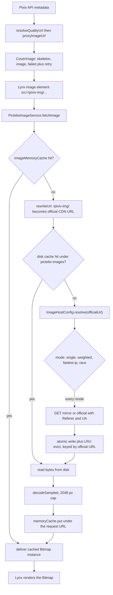
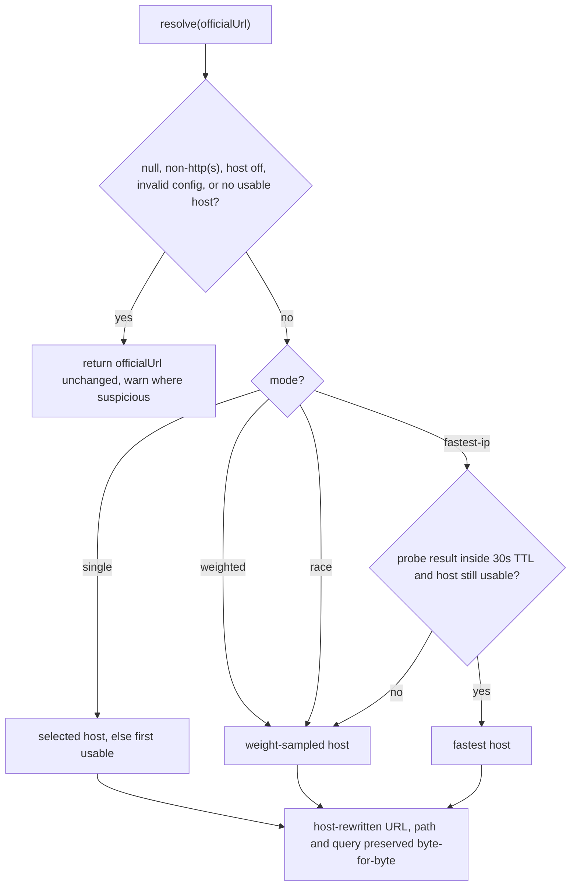
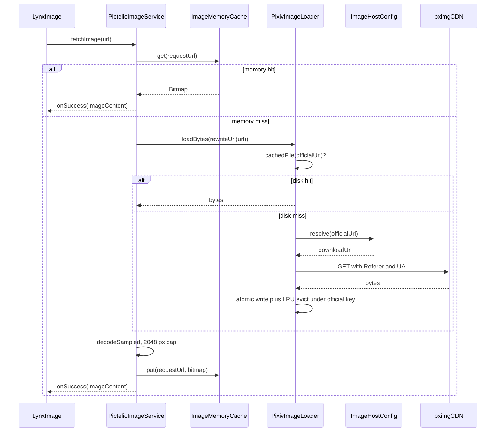
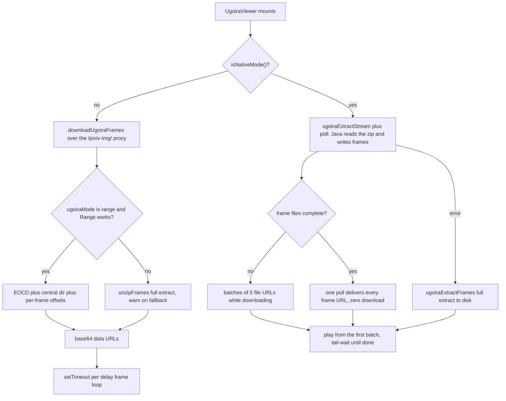

# Image Loading Pipeline

## Overview

Pictelio is a Lynx single-engine client; the WebView runtime, its Capacitor plugin layer and the `packages/app` source tree were removed ([ADR-0203](../../docs/adr/ADR-0203-webview-client-source-removal.md)). The image pipeline therefore no longer passes through `shouldInterceptRequest`, `imageLoader.ts`, a WebView HTTP cache, or any JS prefetch cache.

The pipeline has a deliberate **layering spine** with three owners:

| Layer | Owner | Responsibility |
|-------|-------|----------------|
| **Display task (JS)** | `packages/app-lynx` | Turn Pixiv metadata into a display URL and a layout: quality-tier fallback, `/pixiv-img/` proxy rewriting, explicit `vw` container heights, and the three-state render contract (`CoverImage`). Pure functions, node-testable. |
| **Bytes and caches (Java)** | `packages/android-host` (`src/main` shared core + `src/lynx` modules) | Decide the download source, fetch with `Referer`/`User-Agent`, own the disk cache and the decoded-bitmap memory cache, write and clean the ugoira frame cache. |
| **Render (engine)** | Lynx `<image>` + `PictelioImageService` | Lynx does not download images itself; the custom `ILynxImageService` feeds decoded `Bitmap`s and `file://` ugoira frames to the engine. |


```mermaid
flowchart TD
    Meta["Pixiv API metadata"] --> Q["resolveQualityUrl then proxyImageUrl"]
    Q --> Cmp["CoverImage: skeleton, image, failed plus retry"]
    Cmp --> Img["Lynx image element src=/pixiv-img/..."]
    Img --> Svc["PictelioImageService.fetchImage"]
    Svc --> L1{"ImageMemoryCache hit?"}
    L1 -- yes --> Deliver["deliver cached Bitmap instance"]
    L1 -- no --> Rew["rewriteUrl: /pixiv-img/ becomes official CDN URL"]
    Rew --> L2{"disk cache hit under pictelio-images?"}
    L2 -- yes --> Read["read bytes from disk"]
    L2 -- no --> Host["ImageHostConfig.resolve(officialUrl)"]
    Host --> Mode{"mode: single, weighted, fastest-ip, race"}
    Mode -- every mode --> Get["GET mirror or official with Referer and UA"]
    Get --> Store["atomic write plus LRU evict, keyed by official URL"]
    Store --> Read
    Read --> Dec["decodeSampled, 2048 px cap"]
    Dec --> Put["memoryCache.put under the request URL"]
    Put --> Deliver
    Deliver --> Render["Lynx renders the Bitmap"]
```

Request → host selection and rewrite → native cache tier → render. The keyed-by-official-URL write step is the pipeline's central invariant (see [Cache-key invariant](#cache-key-invariant)).

## JS side — building the display task

Everything in `packages/app-lynx/src/utils/` is pure and node-tested; components only wire props.

- **Proxy rewriting** — [`proxyImageUrl`](../../packages/app-lynx/src/utils/imageUrl.ts) maps `https://i.pximg.net/...` to `/pixiv-img/...` (leaving an existing `/pixiv-img/` path and other relative paths untouched) and returns an empty string for any absolute URL whose hostname is not `pximg.net`/`pixiv.net` (SSRF guard, hostname taken via `safeParseUrl`'s `extractHostname` — the `URL` global is banned in the Lynx runtime, [ADR-0172](../../docs/adr/ADR-0172-app-lynx-runtime-web-api-constraints.md)). [`thumbUrl`](../../packages/app-lynx/src/utils/imageUrl.ts) picks `square_medium || medium || large` for list cards. Components must never hard-code a CDN URL.
- **Quality tier** — [`resolveQualityUrl`](../../packages/app-lynx/src/utils/imageQuality.ts) resolves the display URL for one of three tiers with an explicit fallback chain (`medium` → `medium || large`; `large` → `large || medium`; `original` → `originalImageUrl || original || large || medium`). [`resolvePageSrcs`](../../packages/app-lynx/src/utils/imageQuality.ts) applies that per page and then proxies, returning one array element per page: a missing tier or a rejected proxy yields `""`, which `CoverImage` turns into the explicit failure state instead of silently dropping the page. The tier comes from `settings.detailQuality` (default `medium`).
- **Layout** — native LynxView cannot animate `aspect-ratio` inside a `scroll-view` ([ADR-0055](../../docs/adr/ADR-0055-lynx-native-render-compat.md)), so detail images use explicit `vw` heights: [`detailImageHeightVw`](../../packages/app-lynx/src/utils/imageLayout.ts) computes `${height / width * 100}vw` from the illust's dimensions (falling back to `100vw` = 1:1 when missing or non-positive), and [`pageHeightVw`](../../packages/app-lynx/src/utils/imageLayout.ts) does the same for one already-loaded page but returns `null` when the load event lacks usable dimensions, so the caller keeps the placeholder height instead of jumping the layout.
- **Render contract** — [`CoverImage.vue`](../../packages/app-lynx/src/components/CoverImage.vue) is the deep module ([ADR-0117](../../docs/adr/ADR-0117-app-lynx-cover-image-deep-module.md), [ADR-0118](../../docs/adr/ADR-0118-app-lynx-recommended-carousel-polish-r2.md), [ADR-0129](../../docs/adr/ADR-0129-app-lynx-detail-multi-image-list.md)). Its small interface (`src` + `layout: 'full' | 'box'`, optional `retry`, `lazyLoad`, box sizing `height`/`aspectRatio`/`minH`, `fit`/`ratio`, `correctHeightOnLoad`) hides: the three-state machine `deriveCoverState` (skeleton / image / failed, failed wins), `watch(src)` reset on list-item reuse, empty `src` → failed via `isUnloadableSrc` (a bare `<image src="">` never fires `@error`, which would shimmer forever), retry rebuilt from the **clean base** `src` with a one-shot `?retry=<ts>` cache-buster via `deriveRetryState` (no accumulating `&retry`), and rendering with the native `mode="aspectFill"` (CSS `object-fit` does not apply in LynxView). `RecommendedCover` is the `layout="full"` + `retry` adapter, `SkeletonImage` the `layout="box"` adapter, and `IllustDetail` uses box + `correctHeightOnLoad` to correct each page's height after `@load` carries the image's real dimensions.
- **Load pressure** — list images carry the engine-level `lazy-load` attribute (honoured by native LynxView, ignored by the web-core preview) plus data batched rendering, which is how the removed JS prefetch cache's job is done now ([ADR-0060](../../docs/adr/ADR-0060-lynx-feed-image-lazy-loading.md), [Feed image loading glossary](../../docs/adr/glossary-feed-image-loading.md)).

## Cache tiers

Two general-purpose tiers plus a dedicated ugoira frame cache:

| Tier | Store | Key | Eviction |
|------|-------|-----|----------|
| **L1** | [`ImageMemoryCache`](../../packages/android-host/android/app/src/main/java/io/pictelio/app/ImageMemoryCache.java) — decoded `Bitmap`s, 64 MB | The **request URL** (`fetchImage` input, normally the `/pixiv-img/` path) | Byte budget LRU via [`LruCache`](../../packages/android-host/android/app/src/main/java/io/pictelio/app/LruCache.java), size = `width × height × 4` |
| **L2** | [`PixivImageLoader`](../../packages/android-host/android/app/src/main/java/io/pictelio/app/PixivImageLoader.java) — bytes under `pictelio-images/` | `keyToFilename(rewriteUrl(request))` = the **official CDN URL**, Base64 URL-safe, no padding | Oldest-first by `lastModified` once the directory exceeds `CACHE_MAX_BYTES` (300 MB) |
| **Ugoira** | `cache/ugoira/<illustId>/frame_N.{png,jpg}` | `illustId` directory + `framesJson` index position | Count/size LRU before each write: 300 files or 50 MB, oldest `lastModified` first |

`LruCache` is a plain-JVM `LinkedHashMap` in `accessOrder` mode with a byte accountant; `put` trims the eldest entries until the budget fits and every operation is `synchronized` because Lynx image requests arrive on multiple threads. A single entry larger than the budget evicts itself.

L1 hits skip both disk read and decode: the service hands over the **cached instance itself** — the earlier per-delivery `ARGB_8888` copy (#147) was measured as pure overhead (185 deliveries, zero `isRecycled()` hits) and removed, keeping only a cheap `cached.isRecycled()` guard that falls back to a fresh load. L2 writes are atomic (`tmp` + `rename`, with a delete-and-retry for filesystems whose rename does not overwrite), so `cachedFile()`'s `exists() && length() > 0` test can never return a truncated image; `.tmp` residue is deleted on failure.

Note the two key domains: L1 is addressed by the caller's request URL, L2 by the official URL the request rewrites to. A `?retry=<ts>` cache-buster from `CoverImage`, or a switch between the proxy path and an absolute CDN URL, therefore misses both tiers — which is the intent of those two mechanisms. The resolved **mirror** URL is never a key in either tier.

## PixivImageLoader — the shared image core

[`PixivImageLoader`](../../packages/android-host/android/app/src/main/java/io/pictelio/app/PixivImageLoader.java) ([ADR-0054](../../docs/adr/ADR-0054-image-pipeline-unified-core.md)) is the single source of truth for image bytes, consumed by `PictelioImageService`, the download queue (`PictelioDownloader` via `loadFileWithProgress`), `PictelioGalleryModule`, `GallerySaver` (via `loadFile`) and `NovelExporter` (via the injectable `loadBytes` seam). What is owned there and nowhere else:

- **URL rewrite** — `rewriteUrl()` maps any URL containing `/pixiv-img/` to `OAuthConfig.IMAGE_CDN_URL + "/" + path` (`https://i.pximg.net/...`) with `URI.normalize()` dot-segment folding; URLs without that marker pass through unchanged, including already-absolute CDN URLs.
- **Disk cache** — `cachedFile()`, `keyToFilename()`, `getCacheDir()` on the read side; `writeFile()` is the atomic write; `enforceCacheLimit()` the oldest-first byte-budget eviction.
- **Download** — `download()` resolves the source with `ImageHostConfig.resolve`, then `fetch()` injects `Referer: https://app-api.pixiv.net/` and the Pixiv iOS `User-Agent`, reusing `PixivApiCore.getSharedClient()` (connect 15 s / read 30 s / call 45 s, `maxRequestsPerHost=10`, `maxRequests=20`). Non-2xx, `null` body and empty body all throw `IOException` **without writing to cache**.
- **Concurrency** — `loadFile` / `loadBytes` / `loadFileWithProgress` share a per-URL lock in a `ConcurrentHashMap` plus a double-checked cache read, so concurrent same-URL loads download exactly once.
- **Streaming** — `loadFileWithProgress(url, sink, cancel)` streams 8 KB chunks into the cache file, reports progress roughly every 64 KB (and once at the end), honours cancellation, and swaps the file in atomically.

## Image host selection

The image-host (mirror) decision is a Java deep module, [`ImageHostConfig`](../../packages/android-host/android/app/src/main/java/io/pictelio/app/ImageHostConfig.java) ([ADR-0143](../../docs/adr/ADR-0143-imagehost-download-source-java-sink.md)), with a single public entry point:

```java
String resolve(String officialUrl)  // official URL in → actual download URL out
```

It reads the `image_host_settings` JSON from `SharedPreferences("CapacitorStorage")` through a `RawProvider` seam, parses lazily and reuses the parsed config while the raw string is unchanged (all side dependencies — `Clock`, `Random`, `ProbeFn`, executor — are constructor-injected, so the decision logic is testable without network, clock or prefs). `null` input returns `null`; non-`http(s)` input, a disabled master switch, a corrupt or shape-invalid config (shape is validated: `masterEnabled` boolean, `mode` string, `hosts` array), or an empty usable-host list all return the official URL unchanged, with a `Log.w` — never a silent degrade. Host entries missing `id`/`baseUrl` or `enabled: false` are skipped; a `weight` of `0` normalises to `1`.

### Four-mode mapping

| Mode | Native behavior |
|------|-----------------|
| `single` | Use the host matching `selectedHostId`; if it is missing or unusable, fall back to the first usable host. |
| `weighted` | Sample usable hosts with `weight > 0` independently per request (injected `Random`; roll = `random() * total`, subtract per host, last host as the end-of-list fallback). |
| `fastest-ip` | Use the in-memory probe result only if still inside its TTL; otherwise **immediately** fall back to `weighted` while lazily kicking one single-flight probe — never blocking on the probe. |
| `race` | Explicitly degrades to `weighted` — race was never implemented natively ([ADR-0143](../../docs/adr/ADR-0143-imagehost-download-source-java-sink.md) records this as an explicit degradation, not a behaviour reduction). |


```mermaid
flowchart TD
    A["resolve(officialUrl)"] --> B{"null, non-http(s), host off, invalid config, or no usable host?"}
    B -- yes --> Z["return officialUrl unchanged, warn where suspicious"]
    B -- no --> C{"mode?"}
    C -- single --> S["selected host, else first usable"]
    C -- weighted --> W["weight-sampled host"]
    C -- race --> W
    C -- fastest-ip --> F{"probe result inside 30s TTL and host still usable?"}
    F -- yes --> FH["fastest host"]
    F -- no --> W
    S --> R["host-rewritten URL, path and query preserved byte-for-byte"]
    W --> R
    FH --> R
```

Mode mapping, TTL expiry and the fallback branches — TTL hits require the probed host to still be usable.

### URL rewrite contract

`transform(officialUrl, baseUrl)` either substitutes a `{path}` template (first occurrence only, replaced with the official path minus its leading `/` — the query is **not** part of the substitution) or replaces the authority: mirror scheme/hostname/port in front of the official path, query and fragment, byte-for-byte. An unparsable official URL, or a mirror `baseUrl` without scheme/host, returns the official URL with a `Log.w`. Hosts on the official `pximg.net`/`pixiv.net` domain are filtered out at parse time (`isOfficialDomain`, matching the removed JS `validateHostInput` write-side guard), which is the self-loop defence.

### Cache-key invariant

The **cache key is always the official URL**, never the resolved mirror URL. Switching source, toggling the host or changing mirrors therefore never invalidates cached bytes, and the same image has exactly one entry for its whole lifetime. `PixivImageLoader` addresses its cache with the official input URL and ignores the `resolve` return value for keying; the anti-drift assertion `PixivImageLoaderTest.keyToFilename_rewriteUrlProduct_equalsOfficialUrlKey` pins that the key function applied to the rewritten URL is the official key. The ugoira frame cache satisfies the same invariant structurally, because it is addressed by `illustId` + frame index rather than by URL.

### Failure fallback and budget boundaries

Mirror failure (connection, non-2xx, empty body) triggers **one official retry**; if the official retry also fails, the mirror's original exception is rethrown so the first failure context survives. How far that fallback reaches depends on payload size, and the asymmetry is deliberate:

- **Images** build a narrower mirror client (`connect 5 s / call 15 s`, sharing the pooled connection/thread resources) so a degraded mirror fails fast instead of delaying first paint; the official retry keeps the shared client's full budget.
- **Ugoira zips** (both the full `downloadZip` and the streaming `streamDownloadZip`) keep the shared budget — a multi-MB zip legitimately takes a budget-sized time on a slow-but-stable mirror — and may only fall back **before** the byte stream is handed to the consumer. Once frames are being read (or mid-download), a source switch is forbidden: already-delivered frames came from the mirror while continued reads would come from the official host, breaking the ZIP entry stream's physical continuity. `PictelioApiModuleTest.streamDownloadZip_mirrorMidStreamFailure_noSourceSwitch` pins this boundary.

The `fastest-ip` probe runs as a HEAD request for a fixed official sample URL on a dedicated single-thread daemon executor with a 5 s call timeout; results are cached for 30 s, and a rejected submission resets the in-flight flag with a warning rather than silently degrading the mode for the process lifetime. A persisted `fastestHostId`/`fastestHostExpiresAt` pair seeds the in-memory probe cache (`0` expiry means never expires), and seed overwrites are **monotonic** — a config reparse only replaces the cached result when its seed is not older (issue #658: the unconditional overwrite used to wipe a just-completed probe and force another real probe round).

## PictelioImageService — the Lynx image backend

[`PictelioImageService`](../../packages/android-host/android/app/src/lynx/java/io/pictelio/app/PictelioImageService.java) implements `ILynxImageService` and is the sole image backend for the vue-lynx client. It is registered by `LynxRuntimeInitializer.ensureInitialized` (alongside `LynxHttpService`/`LynxLogService`, before `LynxEnv.init` and before any `LynxView` exists). It exists because Lynx does not download images itself and the default Fresco service cannot inject the `Referer` header that `i.pximg.net` requires (403 without it).

- **Behavior registration** — the constructor calls `LynxEnv.inst().addBehaviors(...)` to register `<image>` (`UIImage` / `FlattenUIImage` / `AutoSizeImage`) and `<inline-image>` (`InlineImageShadowNode`); implementing the interface alone leaves a permanent skeleton on device. Registration failure is caught and logged (the unit-test classpath lacks gson).
- **`fetchImage`** → `deliver`: null/empty URL fails immediately; a `memoryCache` hit is delivered from a worker thread (with the recycled guard); a miss goes to `loadAndDeliver`, which reads `file://` frames from disk or calls `PixivImageLoader.loadBytes(rewriteUrl(url))`, `decodeSampled` (power-of-two `inSampleSize`, 2048 px cap), stores the bitmap and delivers `ImageContent(bitmap)`. All work runs on a cached thread pool; `Throwable` (including `OutOfMemoryError`) is caught on that worker so nothing is ever thrown into the JS thread, and failures are reported through `onFailure`.
- **`file://` frames** — only URLs whose canonical path is inside `cache/ugoira/` are accepted (`canParseUrl` plus a defensive second check in the load path), and those bytes are read directly, bypassing OkHttp. The whitelist conservatively rejects everything when the app context is unavailable.
- **`canParseUrl`** — accepts `http…` and `/pixiv-img/…`, and `file://` only inside the ugoira cache; `data:`/`asset:` and other schemes fall through to whatever else can serve them.
- **`prefetchImage` / `decodeImage`** — reuse the same loader (fire-and-forget, failures only logged); `releaseImage` is a no-op because the bitmaps are GC-managed.
- **Static only** — `startAnimation` / `resumeAnimation` / `pauseAnimation` / `stopAnimation` all return `false`; ugoira animation is driven by the JS frame loop, not the native animation hooks.


```mermaid
sequenceDiagram
    participant Img as LynxImage
    participant Svc as PictelioImageService
    participant Mem as ImageMemoryCache
    participant Core as PixivImageLoader
    participant Host as ImageHostConfig
    participant CDN as pximgCDN

    Img->>Svc: fetchImage(url)
    Svc->>Mem: get(requestUrl)
    alt memory hit
        Mem-->>Svc: Bitmap
        Svc-->>Img: onSuccess(ImageContent)
    else memory miss
        Svc->>Core: loadBytes(rewriteUrl(url))
        Core->>Core: cachedFile(officialUrl)?
        alt disk hit
            Core-->>Svc: bytes
        else disk miss
            Core->>Host: resolve(officialUrl)
            Host-->>Core: downloadUrl
            Core->>CDN: GET with Referer and UA
            CDN-->>Core: bytes
            Core->>Core: atomic write plus LRU evict under official key
        end
        Svc->>Svc: decodeSampled, 2048 px cap
        Svc->>Mem: put(requestUrl, bitmap)
        Svc-->>Img: onSuccess(ImageContent)
    end
```

The two key domains of the cache tiers, made explicit: the memory cache is keyed by the request URL, the disk cache by its rewritten official URL.

## Ugoira (animated illust)

Ugoira is Pixiv's animated format: a ZIP of frames plus per-frame `delay` timing in `meta.frames`. The work is split between shared pure-TS frame handling and native Java download/decode, keeping frame bytes off the JS heap ([ADR-0037](../../docs/adr/ADR-0037-pixiv-api-plugin-gateway.md)).

[`@pictelio/ugoira`](../../packages/ugoira/src/index.ts) is a zero-network, zero-framework pure-TS library. `packages/app-lynx` consumes its EOCD/central-directory parsing, local-header offset computation, raw-deflate inflation (`deflateInflate`) and full extract (`unzipFrames`); the whole-file slicers (`computeFrameOffset` / `sliceStoreFrame` / `sliceFrames`) stay in the same module and are exercised by the package's own tests. The library also exports [`createStreamFrameSource`](../../packages/ugoira/src/stream.ts) ([ADR-0127](../../docs/adr/ADR-0127-ugoira-streaming-playback.md)), which emits frames in `fileOrder` as each entry's data completes, buffers out-of-order entries, drops non-frame/duplicate names and throws `ugoira:`-prefixed errors on corruption or missing frames at end-of-stream — but its ADR-0127 consumer was the WebView app side and ADR-0127 explicitly excluded lynx wiring, so **it currently has no production consumer** beyond its unit tests.


```mermaid
flowchart TD
    Open["UgoiraViewer mounts"] --> Native{"isNativeMode()?"}
    Native -- no --> Web["downloadUgoiraFrames over the /pixiv-img/ proxy"]
    Web --> Range{"ugoiraMode is range and Range works?"}
    Range -- yes --> Rf["EOCD plus central dir plus per-frame offsets"]
    Range -- no --> Ffl["unzipFrames full extract, warn on fallback"]
    Rf --> Data["base64 data URLs"]
    Ffl --> Data
    Data --> Play["setTimeout per delay frame loop"]
    Native -- yes --> Stream["ugoiraExtractStream plus poll: Java reads the zip and writes frames"]
    Stream --> Hit{"frame files complete?"}
    Hit -- yes --> All["one poll delivers every frame URL, zero download"]
    Hit -- no --> Batch["batches of 5 file URLs while downloading"]
    Batch --> PlayFile["play from the first batch, tail-wait until done"]
    All --> PlayFile
    Stream -- error --> Full["ugoiraExtractFrames full extract to disk"]
    Full --> PlayFile
```

The three ugoira paths — web-mode in-heap frames, native full extract, native progressive streaming.

**Web mode** (dev/web-core preview). [`downloadUgoiraFrames`](../../packages/app-lynx/src/api/ugoira.ts) loads the metadata, proxies `zip_urls.medium`, then produces base64 `data:` URLs — either the `range` path (GET + `Range: bytes=0-0` to learn the total length, 30 KB tail scan for the EOCD, central directory, then per-frame ranges with look-ahead on the next local header) or the default `unzipFrames` full extract. A `range` failure logs a `console.warn` and degrades to `fflate` ([ADR-0126](../../docs/adr/ADR-0126-ugoira-flicker-and-range-fallback.md)); `ugoiraMode` affects only this path.

**Native extract-to-disk.** Native LynxView cannot fetch the relative `/pixiv-img/` path (`LynxFetchModule` rejects scheme-less URLs) and `data:` URLs are not renderable through the custom image service ([ADR-0125](../../docs/adr/ADR-0125-lynx-ugoira-unpacked-pipeline.md)). `PictelioApi.ugoiraExtract(zipUrl, framesJson, illustId, cb)` therefore validates `https://` plus a numeric `illustId`, short-circuits when `ugoiraExtractCached` finds the frame count matching `framesJson` with every file non-empty, and otherwise downloads the zip in Java (`Referer`/UA injected, routed through `ImageHostConfig.resolve`), scans it once with `ZipInputStream`, writes `cache/ugoira/<illustId>/frame_N.{png|jpg}` (extension from the ZIP entry name) and returns a `file://` URL list.

**Native streaming.** First native playback is progressive via [`UgoiraStreamEngine`](../../packages/android-host/android/app/src/lynx/java/io/pictelio/app/UgoiraStreamEngine.java) over `ugoiraExtractStream` / `ugoiraExtractStreamPoll` / `ugoiraExtractStreamCancel` ([ADR-0128](../../docs/adr/ADR-0128-ugoira-native-streaming-playback.md)). Because a Lynx `Callback` is one-shot, delivery is a **pull-mode** state machine: `start` either delivers a cache hit in one poll or launches the stream (auto-cancelling any previous stream), `poll` returns the frames delivered since the last poll as `{delivered, urls[], done, error}` and returns immediately when there is nothing new, and `cancel` closes the input stream while keeping already-written frames (the next open becomes a cache hit). `ugoiraStreamCore` reads local headers only (no central directory), asserts each ZIP entry name equals the expected `frames["file"]` name — an order mismatch is a readable error and the JS side degrades to the full path rather than showing wrong frames — writes each frame to disk, and emits a batch every `batchSize` frames; the first batch lands at roughly 4.5–8.6 % of the download.

**Playback.** [`UgoiraViewer.vue`](../../packages/app-lynx/src/components/UgoiraViewer.vue) schedules frames with `setTimeout(delay)`; in native mode it consumes `ugoiraExtractStreamFrames` and falls back to the full `ugoiraExtractFrames` on stream error (warned, not silent), in web mode it uses `downloadUgoiraFrames`. The `<image>` sets `:defer-src-invalidation="true"` ([ADR-0126](../../docs/adr/ADR-0126-ugoira-flicker-and-range-fallback.md)) so a new frame does not clear the previous one before it is ready; it must be a boolean binding (a bare attribute compiles to `""` and is truthy-checked as false on device, guarded by `ugoiraViewerTemplate.test.ts`). While streaming is unfinished the player waits at the frame-list tail with 50 ms polling instead of looping, and it plays from the first delivered batch.

## Retired seams

- **ADR-0090 three-switch cache UI (removed).** The WebView-era "three-layer cache" ([ADR-0090](../../docs/adr/ADR-0090-image-cache-three-layer.md)) — user switches for the Java disk cache, WebView `Cache-Control: immutable` headers, and JS prefetch — was a WebView/Capacitor construct. Its settings UI disappeared with the WebView client; the Lynx replacements are the bitmap memory cache, the shared disk cache, and engine-level `lazy-load` plus batched rendering.
- **WebView interception path (removed).** `shouldInterceptRequest` / `interceptImage`, the WebView HTTP cache, `imageLoader.ts` and the prefetch plugin no longer exist, so `/pixiv-img/` is now purely a JS→native convention that `PictelioImageService` maps back to the CDN with `rewriteUrl`.
- **`data:` URL ugoira frames in native mode (architecturally excluded).** The custom image service routes `data:` to OkHttp, which rejects the scheme; native frames are `file://` only.
- **Dead generated constant.** The credential-generated `TIMEOUT_IMAGE_PROXY_CONNECT`/`_READ` constants no longer have a consumer in any source set now that the WebView image proxy is gone.

The `docs/` pipeline write-up and the detail-image glossary ([glossary-detail-image-loading](../../docs/adr/glossary-detail-image-loading.md), `docs/image-loading-pipeline.md`) describe the retired WebView shape and are kept as decision history only.

## Test and evidence surface

| Layer | What pins it |
|-------|--------------|
| [`ImageHostConfigTest`](../../packages/android-host/android/app/src/test/java/io/pictelio/app/ImageHostConfigTest.java) | Everything through the single `resolve()` entry point with injected seams: four-mode mapping, TTL/seed semantics, `{path}` template, official-domain filtering, config reuse/reparse, and the stale-seed regression (#658) — no real HTTP, no real clock, no prefs. |
| [`PixivImageLoaderTest`](../../packages/android-host/android/app/src/test/java/io/pictelio/app/PixivImageLoaderTest.java) | `rewriteUrl`/`keyToFilename` contracts, the anti-drift `keyToFilename_rewriteUrlProduct_equalsOfficialUrlKey` assertion, download-then-cache round trips, 403/500/empty-body rejection without caching, atomic write, tmp cleanup, per-URL lock, and mirror hit / mirror 500 / connect-refused / both-fail / host-off semantics. |
| [`PixivImageLoaderProgressTest`](../../packages/android-host/android/app/src/test/java/io/pictelio/app/PixivImageLoaderProgressTest.java) | Streaming load progress reporting and cancellation. |
| [`ImageMemoryCacheTest`](../../packages/android-host/android/app/src/test/java/io/pictelio/app/ImageMemoryCacheTest.java), [`LruCacheTest`](../../packages/android-host/android/app/src/test/java/io/pictelio/app/LruCacheTest.java) | Byte-budget eviction and access-order refresh. |
| [`PictelioImageServiceTest`](../../packages/android-host/android/app/src/test/java/io/pictelio/app/PictelioImageServiceTest.java) | Robolectric `fetchImage` success / HTTP error / empty body / cache reuse across calls, static-only animation hooks, `canParseUrl`. |
| [`PictelioApiModuleTest`](../../packages/android-host/android/app/src/test/java/io/pictelio/app/PictelioApiModuleTest.java) | ugoira path: frame order/extension, missing/corrupt frames, cache-hit/miss matrix, `ugoiraStreamCore` batch timeline and reorder/missing-frame errors, engine lifecycle (batches, cache hit, source error, cancel-without-error, restart), and zip mirror fallback per phase including the mid-stream no-switch boundary. |
| `packages/ugoira/tests/` | `index.test.ts` (EOCD/central-dir/slicing/unzip) and `stream.test.ts` (incremental delivery order, reordered buffering, corruption errors). |
| app-lynx node tests | [`imageQuality.test.ts`](../../packages/app-lynx/src/utils/imageQuality.test.ts), [`imageLayout.test.ts`](../../packages/app-lynx/src/utils/imageLayout.test.ts), [`coverImage.test.ts`](../../packages/app-lynx/src/utils/coverImage.test.ts) for quality fallback, `vw` height maths and the three-state/retry logic; [`ugoiraViewerTemplate.test.ts`](../../packages/app-lynx/src/components/ugoiraViewerTemplate.test.ts) as a source-level guard on the `defer-src-invalidation` binding. Component rendering itself is verified in web-core preview and on device, not by node tests. |
| android-e2e | [`lynx-detail-image-probe.spec.ts`](../../packages/android-host/tests/android-e2e/specs/lynx-detail-image-probe.spec.ts) deep-links into an illust detail page, dumps logcat and classifies `图片加载失败` causes, with poster-region colour variance as the positive signal. |

## Key files

| Purpose | Path |
|---------|------|
| JS URL shaping / proxy whitelist | `packages/app-lynx/src/utils/imageUrl.ts` |
| JS quality tier + per-page resolution | `packages/app-lynx/src/utils/imageQuality.ts` |
| JS layout maths (`vw` heights) | `packages/app-lynx/src/utils/imageLayout.ts` |
| JS three-state image deep module (+ adapters) | `packages/app-lynx/src/components/CoverImage.vue`, `RecommendedCover.vue`, `SkeletonImage.vue` |
| Shared image core (rewrite / cache / download / locks) | `packages/android-host/android/app/src/main/java/io/pictelio/app/PixivImageLoader.java` |
| Image-host download-source decision | `packages/android-host/android/app/src/main/java/io/pictelio/app/ImageHostConfig.java` |
| Bitmap memory cache + generic LRU | `ImageMemoryCache.java`, `LruCache.java` (same directory) |
| Lynx image service | `packages/android-host/android/app/src/lynx/java/io/pictelio/app/PictelioImageService.java` |
| Registration of the image service | `packages/android-host/android/app/src/lynx/java/io/pictelio/app/LynxRuntimeInitializer.java` |
| Ugoira extract/stream native module + streaming engine | `PictelioApiModule.java`, `UgoiraStreamEngine.java` (same directory) |
| Shared pure-TS ugoira library | `packages/ugoira/src/index.ts`, `packages/ugoira/src/stream.ts` |
| Ugoira JS pipeline + playback | `packages/app-lynx/src/api/ugoira.ts`, `packages/app-lynx/src/components/UgoiraViewer.vue` |

## Related

- [Architecture Overview](overview.md)
- [API Layer](api-layer.md)
- [Android Native & Build](../integrations/android-native.md) — module registration, ProGuard and the native test suite as a whole
- [Downloads & Export](../domain/downloads-and-export.md) — the download queue's use of `loadFileWithProgress` and ugoira export targets
- [Feed & Browsing](../domain/feed-and-browsing.md) — where list thumbnails come from
- [Viewport Geometry & Motion](../concepts/viewport-geometry-and-motion.md) — the layout constraints behind explicit `vw` heights
- [Testing Overview](../testing/overview.md)
- ADRs: [ADR-0054](../../docs/adr/ADR-0054-image-pipeline-unified-core.md) (unified core), [ADR-0090](../../docs/adr/ADR-0090-image-cache-three-layer.md) (retired three-layer cache), [ADR-0117](../../docs/adr/ADR-0117-app-lynx-cover-image-deep-module.md) / [ADR-0129](../../docs/adr/ADR-0129-app-lynx-detail-multi-image-list.md) (CoverImage + multi-image detail), [ADR-0125](../../docs/adr/ADR-0125-lynx-ugoira-unpacked-pipeline.md) / [0126](../../docs/adr/ADR-0126-ugoira-flicker-and-range-fallback.md) / [0127](../../docs/adr/ADR-0127-ugoira-streaming-playback.md) / [0128](../../docs/adr/ADR-0128-ugoira-native-streaming-playback.md) (ugoira), [ADR-0143](../../docs/adr/ADR-0143-imagehost-download-source-java-sink.md) (image-host Java sink), [ADR-0203](../../docs/adr/ADR-0203-webview-client-source-removal.md) (WebView removal)
