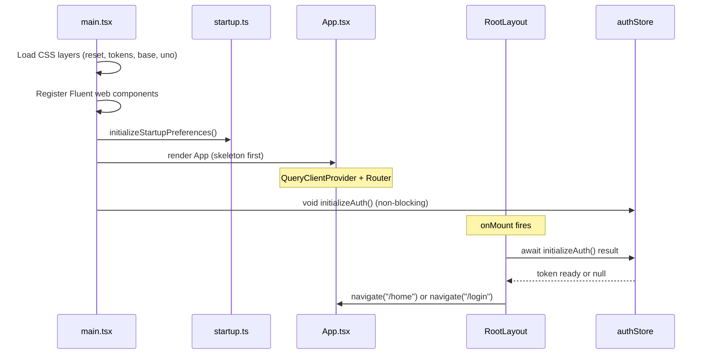

# Architecture Overview

## Monorepo Layout

`pixivizer/` is a **pnpm workspace** monorepo:

| Package | Location | Purpose |
|---------|----------|---------|
| `pictelio-app` | `/packages/app/` | SolidJS SPA — the core application |
| `pictelio-website` | `/packages/website/` | Astro landing page (GitHub Pages) |

Root `package.json` delegates all commands via `vp run --filter`. Build tooling uses **vite-plus** (`vp` CLI), which wraps Vite with oxlint, oxfmt, and vitest.

**Mobile targets:**
- **Android** — Four custom Capacitor plugins (Auth, ImageCache, OAuth, PixivApi) with Java implementations under `/packages/app/android/`. The **PixivApiPlugin** (v3.18.0+) replaced the now-deleted PictelioHttpPlugin as the single gateway for all Pixiv API requests (ADR-0037). See [Android Native & Build](/openwiki/integrations/android-native.md).
- **iOS** — Initially introduced in v3.18.0, iOS platform support and files (`/packages/app/ios/`) were **removed in v3.19.1** — the project is now **Android-only**.

## Boot Sequence

The application boots in `packages/app/src/main.tsx`:

1. **CSS loading** — Imports layer CSS: `reset.css` → `tokens.css` → `base.css` → `virtual:uno.css` → `novel-reader.css`
2. **Fluent Web Components** — Registers individual Fluent components (badge, button, dialog, etc.) and syncs theme via `MutationObserver` on `<html>.dark`
3. **Preference initialization** — `initializeStartupPreferences()` reads stored preferences before rendering
4. **Solid root render** — `render(() => <App />, root)` — renders **before** auth to show skeleton/UI immediately
5. **Auth initialization (non-blocking)** — `void initializeAuth()` called after render, does not block the first paint. `RootLayout.onMount` waits for auth result before navigating to `/home` or `/login`.



## Application Shell

`App.tsx` wraps everything in the QueryClient provider and the router:

```typescript
<QueryClientProvider client={queryClient}>
  <Router scrollRestoration>{routes}</Router>
</QueryClientProvider>
```

- **`queryClient`** (`/packages/app/src/api/queryClient.ts`) — TanStack Query client with custom error normalization
- **`routes`** (`/packages/app/src/router.tsx`) — `@solidjs/router` `RouteDefinition[]` array (migrated from `@tanstack/solid-router`). See [Routing](#routing).

## Immediate Navigation Pattern

Since v3.20.0, the project adopted the **immediate navigation pattern**: routes render chrome + skeleton screens instantly, and data loads in the component after mount. With the migration to `@solidjs/router` (v3.22.0, see [spec](/docs/spec/routing-migration.md)), this is now the **only** option — `@solidjs/router` does not have loader/Suspense concepts, so route transitions are synchronous by nature.

```
用户点击链接
  → 路由匹配（纯 Signal，零 async）
  → 组件即时挂载，无 Suspense 过渡
  → 渲染页面 chrome + 骨架屏
  → onMount / createEffect 发起数据请求
  → 数据到达 → 骨架屏替换为真实内容
```

## Routing

Routes are defined in `/packages/app/src/router.tsx` as a `@solidjs/router` `RouteDefinition[]` array (migrated from `@tanstack/solid-router` in v3.22.0). See [spec](/docs/spec/routing-migration.md).

Key differences from TanStack Router:
- **No loaders:** `@solidjs/router` does not have a loader concept. All data loading happens in component `onMount`/`createEffect`.
- **No Suspense transitions:** Route matching uses pure Signal + `createMemo`, no pending/Suspense state. Route switches are synchronous — no white flash.
- **Simpler API:** `path + component` only. No `createRoute()`, `asRoute()`, route tree construction, or `declare module` type registration.
- **Path syntax:** `$id` → `:id`, catch-all `$` → `*all`.
- **Outlet:** Child routes pass as `props.children` rather than TanStack `<Outlet>`.
- **History/navigate:** `navigate("/path")` with optional options as second argument.

| Route | Component | Data Loading |
|-------|-----------|-------------|
| `/login` | `Login` | — |
| `/home` | `HomePage` | All 4 tabs — recommended, follow, bookmarks, history — load data in `onMount` via `ensureLoaded` |
| `/illust/:id` | `IllustDetail` | `createEffect` on mount |
| `/novel/:id` | `NovelDetail` | `createEffect` on mount |
| `/me` | `PersonalCenter` | — |
| `/user/:id` | `PersonalCenter` | — |
| `/user/:id/illusts` | `UserIllusts` | `onMount` → `load(uid, contentType())` |
| `/user/:id/following` | `FollowListPage` | `onMount` → `load()` |
| `/user/:id/followers` | `FollowListPage` | `onMount` → `load()` |
| `/my/followers` | `FollowListPage` | `onMount` → `load()` |
| `/search` | `Search` | — |
| `/about` | `About` | — |
| `/age-confirmation` | `AgeConfirmation` | — |
| `/debug` | `DebugPage` | — |
| `/settings` | `Settings` | — |
| `/layout-settings` | `LayoutSettings` | — |
| `/image-host` | `ImageHostSettings` | — |
| `/image-cache` | `ImageCacheSettings` | — | |

> **v3.21.5+ (commit `9aba13f`):** All 17 route components were converted from `lazy(() => import(...))` to **top-level static imports**. In a local APK, lazy loading provides no network benefit — it only added 17 extra chunk requests. Routes are resolved synchronously from the single JS bundle. **v3.22.0:** With the migration to `@solidjs/router`, there are no route-level loaders or pending states at all — the framework is inherently synchronous.

## Splash Screen Lifecycle (v3.21.0)

The native Splash Screen uses AndroidX `core-splashscreen` (compat library) with dismiss controlled from JavaScript via a custom Capacitor plugin bridge:

1. **Native setup**: `MainActivity.onCreate()` calls `SplashScreen.installSplashScreen(this)` with `setKeepOnScreenCondition(() -> keepSplashVisible.get())`. The `keepSplashVisible` `AtomicBoolean` starts as `true`.
2. **JS bridge**: `splashBridge.ts` exports `markContentReady()`, which calls `AuthPlugin.hideSplash()`. The native method sets `keepSplashVisible` to `false`, triggering the SplashScreen exit.
3. **Idempotent**: `markContentReady()` guards with a module-level `contentReady` flag; subsequent calls are no-ops.
4. **No `@capacitor/splash-screen` dependency**: The bridge uses the existing `AuthPlugin` Capacitor plugin, avoiding an additional npm dependency.

**Close decision matrix:**

| Route | Who closes splash | When |
|-------|-------------------|------|
| `/login` | `Login.tsx` `onMount` | Login page renders (user needs to authenticate) |
| `/home` | `HomePage.tsx` `onMount` | **Immediate on mount** — `markContentReady()` called directly in `onMount`. Splash exit animation (120ms scale+fade) runs from `MainActivity`. Skeleton is guaranteed visible because `createTQFeedStore` now uses `enabled: false` (ADR-0042) and data loading is deferred via `setTimeout(0)` (ADR-0043). |
| Other routes (age-confirmation, etc.) | `__root.tsx` fallback | Auth init completes (after `setIsLoading(false)`) |

> **v3.21.5+:** Splash close for feed routes moved from `Feed.tsx` (waited for first data load) to `TabFeedPage.tsx` (closes immediately on component mount, showing skeleton content). The JS loading overlay in `__root.tsx` was also made invisible — the native Splash now handles the full loading indicator lifecycle, eliminating the redundant `LoadingSpinner` flash after Splash exit. The router's `defaultPendingComponent: LoadingSpinner` was also removed (`router.tsx` commit `607c6f4`), removing a second source of loading flash during lazy route resolution.
>
> **v3.21.6+ (commit `6ff2c6d`):** TabFeedPage splash dismiss refined from immediate `onMount` → `markContentReady()` to a **loading-triggered strategy**: a `createEffect` watches `loading()` (TanStack Query fetch start signal), and when `loading()` becomes `true`, it calls `markContentReady()` inside `requestAnimationFrame` — ensuring the skeleton screen has been painted to the display before the native Splash exits. A 100ms `setTimeout` fallback (reduced from 500ms) guarantees the splash is never left visible indefinitely. Splash exit animation duration reduced from 280ms to 100ms.
>
> **v3.21.7+ (commit `fa2015c`):** Loading-triggered strategy reverted back to simple `onMount` → `markContentReady()`. The `createEffect` watching `loading()` and the 100ms fallback timeout were both removed. This simplification is safe because the native splash exit animation was also removed — the splash now disappears immediately rather than animating, so there is no need to delay dismissal for animation synchronization. `MainActivity` no longer applies scale+fade to the splash icon view; it calls `splashScreenView.remove()` directly.
>
> **v3.21.8+ (committed, loading-triggered + exit animation):** TabFeedPage splash dismiss changed from a simple 400ms `onMount` timeout back to a **loading-triggered strategy**: a `createEffect` watches `loading()` (TanStack Query fetch start signal), and when `loading()` becomes `true`, it sets a 350ms `setTimeout` for `markContentReady()` — ensuring the skeleton screen has been painted to display before the native Splash exits. An 800ms `onMount` fallback guarantees the splash is never left visible indefinitely. The exit animation was **reintroduced** in `MainActivity` (`setOnExitAnimationListener`): the splash icon scales to 1.8x, fades to 0 over 120ms with `DecelerateInterpolator(2f)`, then the view is removed. This combines the skeleton-show guarantee of v3.21.6 (via `loading()` signal) with the visual polish of the original ADR-0040 animation.
>
> **Current (v3.22.0, simplified):** The loading-triggered strategy was replaced by a simple `onMount` → `markContentReady()` in HomePage. The skeleton guarantee is now achieved through **ADR-0042** (all queries `enabled: false`, data only loads on explicit `ensureLoaded`) and **ADR-0043** (data load deferred via `setTimeout(0)` to ensure skeleton paints before fetch). Splash exit animation retained.

This ensures the splash screen is dismissed at the earliest meaningful point — either when login UI is ready, feed content is visible, or the app has finished loading for non-feed pages. See [Android Native & Build](/openwiki/integrations/android-native.md#splash-screen-js-bridge) for full details.

**Root layout** (`/packages/app/src/routes/__root.tsx`) provides:
- NavBar component (auto-hiding on scroll)
- Bottom navigation bar
- Pull-to-refresh behavior
- Update dialog (startup check)
- Error boundary
- Page transition wrapper

## Design System

Pictelio enforces **Microsoft Fluent Design System 2**:

- **Tokens:** Colors, spacing, border-radius, shadows as CSS variables in `/packages/app/src/styles/tokens.css` (derived from `@fluentui/tokens`)
- **Animation:** Only Fluent-authorized curves (decelerate, standard, accelerate, linear) and durations (100/150/200/300/500ms)
- **States:** All interactive elements must cover hover, active, and focus-visible
- **Touch targets:** Minimum 40×40px
- **Web Components:** Fluent badge, button, checkbox, dialog, divider, drawer, message-bar, radio, spinner, switch, textarea

Style is enforced via code review and documented in the CI linting pipeline.

## CSS Architecture

CSS loads in strict order via `main.tsx` imports:

1. **`reset.css`** — `modern-css-reset`, normalizes browser defaults
2. **`tokens.css`** — Fluent design tokens as CSS custom properties (~500 lines)
3. **`base.css`** — Typography, layout utilities, prose styles (~300 lines)
4. **`virtual:uno.css`** — UnoCSS-generated utility classes (on-demand scanning)
5. **`novel-reader.css`** — Novel-specific reading layout styles

Font sizes use fluid `clamp(rem + vw)` via UnoCSS preflights, defined in `/packages/app/uno.config.ts`.

## Build Tooling

| Tool | Config | Purpose |
|------|--------|---------|
| vite-plus / Rolldown | `vite.config.ts` | Wraps Rolldown bundler with Oxc minifier (production), dev mode uses Vite dev server; integrates oxlint, oxfmt, vitest |
| Rolldown + Oxc | (via vite-plus) | Production bundler and Rust-based minifier (replaced terser in v3.18.0) |
| UnoCSS | `uno.config.ts` | On-demand atomic CSS generation |
| TypeScript | `tsconfig.json` | Strict mode, path aliases (`@/`) |
| oxlint | `.oxlintrc.json` | Fast Rust-based linter |
| oxfmt | (oxlint config) | Opinionated formatter |

**Credentials injection:** Pixiv API credentials are stored in `credentials.json5` (gitignored). `vite.config.ts` splits them into `__CREDENTIALS__` (full, for native plugins) and `__PUBLIC_CONFIG__` (non-sensitive, for module code). Sensitive fields are never inlined into the production JS bundle.

**Proxy:** Web dev mode uses a Vite proxy for `/pixiv-img` to Pixiv's image CDN. Proxy URL is read from `https_proxy`/`HTTP_PROXY` env vars or defaults to `http://127.0.0.1:10808`.

## Component Architecture

The app has four key component layers:

1. **Route components** (`/packages/app/src/routes/`) — Page-level components, compose primitives and stores
2. **Skeleton components** (`/packages/app/src/components/skeletons/`) — Full-page shimmer placeholders matching each data route's layout (FeedSkeleton, IllustDetailSkeleton, NovelDetailSkeleton, ProfileSkeleton, ListSkeleton, GridSkeleton). Introduced by ADR-0038 for immediate navigation.
3. **UI components** (`/packages/app/src/components/`) — Reusable visual components (cards, overlays, dialogs)
4. **Primitives** (`/packages/app/src/primitives/`) — Logic-only hooks and factories (virtual scroll, novel layout). Custom scroll restoration primitives (`createScrollRestore`, `createVirtualScrollRestore`, `createFeedScrollStore`) have been **deleted** — scroll restoration is now handled by `@solidjs/router`'s built-in `<Router scrollRestoration>` prop.

Key relationship: Routes → Skeletons/Components + Primitives → Stores → API Client

## Error Handling Pattern

[ADR-0036](/docs/adr/ADR-0036-error-tuple-pattern.md) introduced the **error tuple pattern** as a project-wide replacement for try-catch:

```typescript
// Before: try-catch blocks block V8 TurboFan happy-path optimization
try { const data = await fetch(); return data; }
catch (e) { handle(e); return fallback; }

// After: error tuple, V8-friendly
const [err, data] = await tryAsync(fetch());
if (err) { handle(err); return fallback; }
```

**Key mechanism:**

- **`tryAsync`** (`src/utils/tryAsync.ts`) — wraps `Promise<T>` to return `[null, T] | [Error, undefined]`. Replaces `try { await ... } catch` without blocking V8 TurboFan optimization on the calling function.
- **`trySync`** (`src/utils/tryAsync.ts`) — wraps a factory `() => T` for synchronous operations (`JSON.parse`, DOM reads). Keeps the throwing code lazily evaluated inside the factory.
- **`unplugin-auto-import`** — automatically injects commonly-used APIs at build time, eliminating ~50 explicit import statements per source file across the project. Configured in both `vite.config.ts` (dev) and `vitest.config.ts` (test), the plugin auto-imports:
  - **All of `solid-js`** (createSignal, createEffect, createMemo, onMount, Show, For, etc. — 32 core APIs)
  - **`solid-js/store`** (createStore, produce, reconcile, createMutable)
  - **`solid-js/web`** (Dynamic, render, Portal, isServer, etc.)
  - **`@solidjs/router`** (useNavigate, useNavigate, Outlet, etc. — core APIs)
  - **`@/utils/tryAsync`** (`tryAsync`, `trySync` — from the error tuple pattern)
- All auto-imported APIs are declared as `readonly` globals in `.oxlintrc.json`. The generated `auto-imports.d.ts` is gitignored.
- A cleanup script at `scripts/cleanup-auto-imports.mjs` was provided for the one-time migration to scan all `.ts`/`.tsx` source files, remove redundant explicit imports now covered by auto-import, and rewrite multi-line import statements to single-line where applicable.

**Unified cleanup:** finally-block logic (`loading.set(false)`, `clearTimeout()`) moves after the `tryAsync` call and before the `err` check, written once instead of duplicated across try/catch/finally branches.

**Scope:** ~45 source files across API layer, stores, routes, components, primitives, services, and utils (110+ try-catch/try-finally blocks replaced).

## Related Pages

- [Source Map](/openwiki/source-map.md) — Complete directory layout
- [API Layer & Authentication](/openwiki/architecture/api-layer.md) — Pixiv HTTP client, OAuth, request dedup
- [Image Loading Pipeline](/openwiki/architecture/image-pipeline.md) — Three-layer cache, image host selection, WebView proxy
- [Store Pattern & State Management](/openwiki/domain/store-pattern.md) — TanStack Query factory pattern
- [Android Native & Build](/openwiki/integrations/android-native.md) — Capacitor plugins, Gradle, signing
- [Testing Strategy](/openwiki/testing/overview.md) — Four test layers
