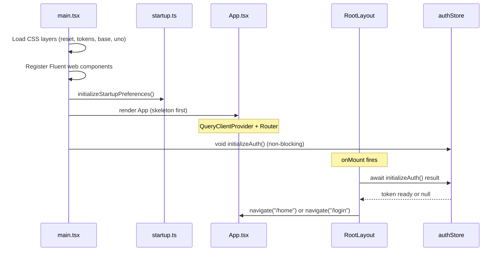

# Architecture Overview

## Monorepo Layout

`pixivizer/` is a **pnpm workspace** monorepo:

| Package | Location | Purpose |
|---------|----------|---------|
| `pictelio-app` | `/packages/app/` | SolidJS SPA — the core application |
| `pictelio-website` | `/packages/website/` | Astro landing page (GitHub Pages) |
| `pictelio-app-lynx` | `/packages/app-lynx/` | vue-lynx MVP on ReactLynx runtime — parallel rendering client |

Root `package.json` delegates all commands via `vp run --filter`. Build tooling uses **vite-plus** (`vp` CLI), which wraps Vite with oxlint, oxfmt, and vitest.

**Mobile targets:**
- **Android** — Four custom Capacitor plugins (Auth, ImageCache, OAuth, PixivApi) with Java implementations under `/packages/app/android/`. The **PixivApiPlugin** (v3.18.0+) replaced the now-deleted PictelioHttpPlugin as the single gateway for all Pixiv API requests (ADR-0037). See [Android Native & Build](/openwiki/integrations/android-native.md).
- **iOS** — Initially introduced in v3.18.0, iOS platform support and files (`/packages/app/ios/`) were **removed in v3.19.1** — the project is now **Android-only**.

## Boot Sequence

The application boots in `packages/app/src/main.tsx`:

1. **CSS loading** — Imports layer CSS: `reset.css` → `tokens.css` → `base.css` → `virtual:uno.css` → `novel-reader.css`
2. **Fluent Web Components** — Registers individual Fluent components (badge, button, dialog, etc.) and syncs theme via `MutationObserver` on `<html>.dark`
3. **Preference initialization** — `initializeStartupPreferences()` reads stored preferences before rendering
4. **Solid root render** — `render(() => <App />, root)` — renders **before** auth to show skeleton/UI immediately
5. **Auth initialization (non-blocking)** — `void initializeAuth()` called after render, does not block the first paint. `RootLayout.onMount` waits for auth result before navigating to `/home` or `/login`.



## Application Shell

`App.tsx` wraps everything in the QueryClient provider and the router:

```typescript
<QueryClientProvider client={queryClient}>
  <Router scrollRestoration>{routes}</Router>
</QueryClientProvider>
```

- **`queryClient`** (`/packages/app/src/api/queryClient.ts`) — TanStack Query client with custom error normalization
- **`routes`** (`/packages/app/src/router.tsx`) — `@solidjs/router` `RouteDefinition[]` array (migrated from `@tanstack/solid-router`). See [Routing](#routing).

## Immediate Navigation Pattern

Since v3.20.0, the project adopted the **immediate navigation pattern**: routes render chrome + skeleton screens instantly, and data loads in the component after mount. With the migration to `@solidjs/router` (v3.22.0, see [spec](/docs/spec/routing-migration.md)), this is now the **only** option — `@solidjs/router` does not have loader/Suspense concepts, so route transitions are synchronous by nature.

```
用户点击链接
  → 路由匹配（纯 Signal，零 async）
  → 组件即时挂载，无 Suspense 过渡
  → 渲染页面 chrome + 骨架屏
  → onMount / createEffect 发起数据请求
  → 数据到达 → 骨架屏替换为真实内容
```

## Routing

Routes are defined in `/packages/app/src/router.tsx` as a `@solidjs/router` `RouteDefinition[]` array (migrated from `@tanstack/solid-router` in v3.22.0). See [spec](/docs/spec/routing-migration.md).

Key differences from TanStack Router:
- **No loaders:** `@solidjs/router` does not have a loader concept. All data loading happens in component `onMount`/`createEffect`.
- **No Suspense transitions:** Route matching uses pure Signal + `createMemo`, no pending/Suspense state. Route switches are synchronous — no white flash.
- **Simpler API:** `path + component` only. No `createRoute()`, `asRoute()`, route tree construction, or `declare module` type registration.
- **Path syntax:** `$id` → `:id`, catch-all `$` → `*all`.
- **Outlet:** Child routes pass as `props.children` rather than TanStack `<Outlet>`.
- **History/navigate:** `navigate("/path")` with optional options as second argument.

| Route | Component | Data Loading |
|-------|-----------|-------------|
| `/login` | `Login` | — |
| `/home` | `HomePage` | C-shell `SideNavShell` + 6 feed stores (recommended/follow/bookmarks × illust/novel); data loads via `ensureLoaded` in `useFeedActivation` |
| `/illust/:id` | `IllustDetail` | `createEffect` on mount |
| `/novel/:id` | `NovelDetail` | `createEffect` on mount |
| `/me` | `PersonalCenter` | — |
| `/user/:id` | `PersonalCenter` | — |
| `/user/:id/illusts` | `UserIllusts` | `onMount` → `load(uid, contentType())` |
| `/user/:id/following` | `FollowListPage` | `onMount` → `load()` |
| `/user/:id/followers` | `FollowListPage` | `onMount` → `load()` |
| `/my/followers` | `FollowListPage` | `onMount` → `load()` |
| `/search` | `Search` | — |
| `/about` | `About` | — |
| `/age-confirmation` | `AgeConfirmation` | — |
| `/debug` | `DebugImage` | — |
| `/client-switch` | `ClientSwitch` | Engine-switch info page (engine diff, warnings, loading mask); triggers restart via `ClientInfoPlugin` |
| `/settings` | `Settings` | — |
| `/scroll-restoration-confirm` | `ScrollRestorationConfirm` | Second-confirmation page before enabling persistent scroll restoration |
| `/image-host` | `ImageHostSettings` | — |
| `/image-cache` | `ImageCacheSettings` | — |
| `/*all` | `HomePage` | Redirected to `/login` if unauthenticated via auth guard |

> **v3.21.5+ (commit `9aba13f`):** All 17 route components were converted from `lazy(() => import(...))` to **top-level static imports**. In a local APK, lazy loading provides no network benefit — it only added 17 extra chunk requests. Routes are resolved synchronously from the single JS bundle. **v3.22.0:** With the migration to `@solidjs/router`, there are no route-level loaders or pending states at all — the framework is inherently synchronous.

## Splash Screen Lifecycle (v3.21.0)

The native Splash Screen uses AndroidX `core-splashscreen` (compat library) with dismiss controlled from JavaScript via a custom Capacitor plugin bridge:

1. **Native setup**: `MainActivity.onCreate()` calls `SplashScreen.installSplashScreen(this)` with `setKeepOnScreenCondition(() -> keepSplashVisible.get())`. The `keepSplashVisible` `AtomicBoolean` starts as `true`.
2. **JS bridge**: `splashBridge.ts` exports `markContentReady()`, which calls `AuthPlugin.hideSplash()`. The native method sets `keepSplashVisible` to `false`, triggering the SplashScreen exit.
3. **Idempotent**: `markContentReady()` guards with a module-level `contentReady` flag; subsequent calls are no-ops.
4. **No `@capacitor/splash-screen` dependency**: The bridge uses the existing `AuthPlugin` Capacitor plugin, avoiding an additional npm dependency.

**Close decision matrix:**

| Route | Who closes splash | When |
|-------|-------------------|------|
| `/login` | `Login.tsx` `onMount` | Login page renders (user needs to authenticate) |
| `/home` | `HomePage.tsx` `onMount` | **Immediate on mount** — `markContentReady()` called directly in `onMount`. Splash exit animation (120ms scale+fade) runs from `MainActivity`. Skeleton is guaranteed visible because `createTQFeedStore` now uses `enabled: false` (ADR-0042) and data loading is deferred via `setTimeout(0)` (ADR-0043). |
| Other routes (age-confirmation, etc.) | `__root.tsx` fallback | Auth init completes (after `setIsLoading(false)`) |

> **v3.21.5+:** Splash close for feed routes moved from `Feed.tsx` (waited for first data load) to `TabFeedPage.tsx` (closes immediately on component mount, showing skeleton content). The JS loading overlay in `__root.tsx` was made invisible — the native Splash handled the full loading indicator lifecycle, eliminating a redundant `LoadingSpinner` flash after Splash exit. The router's `defaultPendingComponent: LoadingSpinner` was also removed (`router.tsx` commit `607c6f4`), removing a second source of loading flash during lazy route resolution.

> **Current (loading overlay re-introduced):** The `__root.tsx` loading overlay has been re-introduced as a full-screen `LoadingSpinner` wrapper (`<Show when={!isLoading()}>`) shown during the auth initialization phase — from app render until `initializeAuth()` resolves (`setIsLoading(false)`). After auth completes, the real route content renders. This provides visual feedback during the auth-boot window without router-level lazy loading indicators. The catch-all route `/*all` was also changed from `Login` to `HomePage`, so unknown paths now render the home page (which redirects to `/login` if unauthenticated via the auth guard in `__root.tsx`).
>
> **v3.21.6+ (commit `6ff2c6d`):** TabFeedPage splash dismiss refined from immediate `onMount` → `markContentReady()` to a **loading-triggered strategy**: a `createEffect` watches `loading()` (TanStack Query fetch start signal), and when `loading()` becomes `true`, it calls `markContentReady()` inside `requestAnimationFrame` — ensuring the skeleton screen has been painted to the display before the native Splash exits. A 100ms `setTimeout` fallback (reduced from 500ms) guarantees the splash is never left visible indefinitely. Splash exit animation duration reduced from 280ms to 100ms.
>
> **v3.21.7+ (commit `fa2015c`):** Loading-triggered strategy reverted back to simple `onMount` → `markContentReady()`. The `createEffect` watching `loading()` and the 100ms fallback timeout were both removed. This simplification is safe because the native splash exit animation was also removed — the splash now disappears immediately rather than animating, so there is no need to delay dismissal for animation synchronization. `MainActivity` no longer applies scale+fade to the splash icon view; it calls `splashScreenView.remove()` directly.
>
> **v3.21.8+ (committed, loading-triggered + exit animation):** TabFeedPage splash dismiss changed from a simple 400ms `onMount` timeout back to a **loading-triggered strategy**: a `createEffect` watches `loading()` (TanStack Query fetch start signal), and when `loading()` becomes `true`, it sets a 350ms `setTimeout` for `markContentReady()` — ensuring the skeleton screen has been painted to display before the native Splash exits. An 800ms `onMount` fallback guarantees the splash is never left visible indefinitely. The exit animation was **reintroduced** in `MainActivity` (`setOnExitAnimationListener`): the splash icon scales to 1.8x, fades to 0 over 120ms with `DecelerateInterpolator(2f)`, then the view is removed. This combines the skeleton-show guarantee of v3.21.6 (via `loading()` signal) with the visual polish of the original ADR-0040 animation.
>
> **Current (v3.22.0, simplified):** The loading-triggered strategy was replaced by a simple `onMount` → `markContentReady()` in HomePage. The skeleton guarantee is now achieved through **ADR-0042** (all queries `enabled: false`, data only loads on explicit `ensureLoaded`) and **ADR-0043** (data load deferred via `setTimeout(0)` to ensure skeleton paints before fetch). Splash exit animation retained.

This ensures the splash screen is dismissed at the earliest meaningful point — either when login UI is ready, feed content is visible, or the app has finished loading for non-feed pages. See [Android Native & Build](/openwiki/integrations/android-native.md#splash-screen-js-bridge) for full details.

**Root layout** (`/packages/app/src/routes/__root.tsx`) provides:
- **Auth-loading wrapper** — Full-screen `LoadingSpinner` via `<Show when={!isLoading()}>` shown during the auth initialization phase (from app render until `initializeAuth()` resolves)
- NavBar component (auto-hiding on scroll)
- Bottom navigation bar
- Pull-to-refresh behavior
- Update dialog (startup check)
- Error boundary
- Page transition wrapper

## Design System

Pictelio enforces **Microsoft Fluent Design System 2**:

- **Tokens:** Colors, spacing, border-radius, shadows as CSS variables in `/packages/app/src/styles/tokens.css` (derived from `@fluentui/tokens`)
- **Animation:** Only Fluent-authorized curves (decelerate, standard, accelerate, linear) and durations (100/150/200/300/500ms)
- **States:** All interactive elements must cover hover, active, and focus-visible
- **Touch targets:** Minimum 40×40px
- **Web Components:** Fluent badge, button, checkbox, dialog, divider, drawer, message-bar, radio, spinner, switch, textarea

### A2 Cardization (ADR-0069 → ADR-0074)

Since v4.x the app has rolled out a unified **"A2" card visual language** across the main client, then corrected it to the real Windows 11 / Fluent 2 spec (ADR-0074):

| Dimension | Value (post-ADR-0074) |
|-----------|-----------------------|
| Card radius | 8px (`--borderRadiusXLarge`) |
| Card border | 1px `--colorNeutralStroke1` |
| Shadow | none (border + background layering instead) |
| Card surface | `--colorNeutralBackground1` on `--colorNeutralBackground2` page |
| Overlays/drawers | 16px (`--borderRadius3XLarge`) |

The glass `NavBar` capsule remains a deliberately separate visual family (ADR-0044) and is **not** cardized. Canonical glossary: `docs/adr/glossary-ui-cards.md`.

The parallel **app-lynx** client instead aligns to **Material Design 3** (M3) tokens/components (see [app-lynx](#app-lynx-vue-lynx-client)).

Style is enforced via code review and documented in the CI linting pipeline.

## CSS Architecture

CSS loads in strict order via `main.tsx` imports:

1. **`reset.css`** — `modern-css-reset`, normalizes browser defaults
2. **`tokens.css`** — Fluent design tokens as CSS custom properties (~500 lines)
3. **`base.css`** — Typography, layout utilities, prose styles (~300 lines)
4. **`virtual:uno.css`** — UnoCSS-generated utility classes (on-demand scanning)
5. **`novel-reader.css`** — Novel-specific reading layout styles

Font sizes use fluid `clamp(rem + vw)` via UnoCSS preflights, defined in `/packages/app/uno.config.ts`.

## Build Tooling

| Tool | Config | Purpose |
|------|--------|---------|
| vite-plus / Rolldown | `vite.config.ts` | Wraps Rolldown bundler with Oxc minifier (production), dev mode uses Vite dev server; integrates oxlint, oxfmt, vitest |
| Rolldown + Oxc | (via vite-plus) | Production bundler and Rust-based minifier (replaced terser in v3.18.0) |
| UnoCSS | `uno.config.ts` | On-demand atomic CSS generation |
| TypeScript | `tsconfig.json` | Strict mode, path aliases (`@/`) |
| oxlint | `.oxlintrc.json` | Fast Rust-based linter |
| oxfmt | (oxlint config) | Opinionated formatter |

**Credentials injection:** Pixiv API credentials are stored in `credentials.json5` (gitignored). `vite.config.ts` splits them into `__CREDENTIALS__` (full, for native plugins) and `__PUBLIC_CONFIG__` (non-sensitive, for module code). Sensitive fields are never inlined into the production JS bundle.

**Proxy:** Web dev mode uses a Vite proxy for `/pixiv-img` to Pixiv's image CDN. Proxy URL is read from `https_proxy`/`HTTP_PROXY` env vars or defaults to `http://127.0.0.1:10808`.

## app-lynx (vue-lynx Client)

`packages/app-lynx/` is a **parallel rendering client** — a Vue 3 app running on the [ReactLynx](https://lynxjs.org/) runtime via `vue-lynx` (a Vue 3 custom renderer). It shares the same Pixiv backend credentials and API format as the main SolidJS app but targets Lynx's native rendering pipeline rather than a WebView. Status: **MVP pre-alpha**, now running inside the main Android app via [Lynx Brownfield Integration](/openwiki/integrations/android-native.md#lynx-brownfield-integration-51) with cross-client login sharing (same Keystore-backed token storage).

### Build & Styling

- **Bundler:** [Rspeedy](https://github.com/lynx-family/rspeedy) (`@lynx-js/rspeedy`), a Lynx-optimized build tool
- **CSS:** [Tailwind CSS v3](/packages/app-lynx/tailwind.config.ts) with `@lynx-js/tailwind-preset`, configured with `spacing` in `vw` and `fontSize` in `rpx` (see [ADR-0046](/docs/adr/ADR-0046-app-lynx-tailwind.md)). All 6 pages migrated from scoped CSS to Tailwind utilities (T2–T8).
- **Design tokens:** Color palette adapted to Tailwind's semantic color scale; components were systematically aligned to **Material Design 3** (M3) — FAB, chips, dialogs, snackbar, segmented buttons, pressed-state layers, and the official switch `handle-container` geometry (commit `bf3c4fb` and follow-ups)
- **Responsive strategy:** Width/spacing/padding use `vw` (viewport-relative), font sizes use `rpx` (Lynx responsive pixels). Rationale in [ADR-0044](/docs/adr/ADR-0044-lynx-responsive-units.md) and [glossary-lynx-units](/docs/adr/glossary-lynx-units.md).

### Routing

Uses a **hand-rolled in-memory router** (`/packages/app-lynx/src/router.ts`) rather than `vue-router`. Reason: `vue-router`'s `RouterView` renders empty in `vue-lynx` 0.5.1 + `web-core` 0.23.1 (verified empirically). Pattern matching logic is extracted to `/packages/app-lynx/src/routerCore.ts` for unit testability.

Routes: `/login`, `/recommended`, `/illusts`, `/illust/:id`, `/novels`, `/novel/:id`, `/user/:id`, `/user/:id/following`, `/user/:id/followers`, `/following`, `/bookmarks`, `/me`, `/update`, `/error`.

The four global tabs (推荐 / 插画 / 小说 / 我的) are defined once in [`navTabs.ts`](/packages/app-lynx/src/components/navTabs.ts) and rendered by [`NavigationBar.vue`](/packages/app-lynx/src/components/NavigationBar.vue) (ADR-0064). The 插画 tab routes to the new `/illusts` page (`IllustList.vue`, recommended/following sub-tabs + waterfall). `/following` is retained as a route but is no longer reachable from the nav. `/update` (forced-update page) and `/error` (session-expiry page) both use `backBehavior: 'exit'` — the back key exits the app with no return path.

**Initial route: `/recommended`** (first-frame content pattern, issues [#61](https://github.com/user/pixivizer/issues/61)/[#63](https://github.com/user/pixivizer/issues/63)). The default route was changed from `/login` to `/recommended` so that already-authenticated users see the recommended feed skeleton immediately on startup, eliminating the login-page flash. Unauthenticated users are redirected to `/login` by `initRouter`'s auth guard with replace semantics (no history push, preserving [ADR-0049](/docs/adr/ADR-0049-lynx-keepalive-page-cache.md) semantics).

> **IFR note:** IFR (Instant First-Frame Rendering, `enableIFR: true`) was evaluated via 32 benchmark runs on real devices and **rejected** — it is an FCP lever, not an interaction lever, and carries a gzip ×2.2, TTI ×1.36 cost. See [`docs/research/vue-lynx-benchmark-ifr.md`](/docs/research/vue-lynx-benchmark-ifr.md).

### Page Instance Caching & Navigation History

[ADR-0049](/docs/adr/ADR-0049-lynx-keepalive-page-cache.md) introduced two mechanisms to achieve "back without reload" (matching the main SolidJS app's feedStore caching + scroll restoration):

**KeepAlive page caching** (`App.vue`): `<KeepAlive :include="['recommended', 'novels', 'me']">` wraps the dynamic `<component :is>`. When navigating away from and back to a cached page, the component instance is **preserved** — `onMounted` does not re-run, so data, list DOM, scroll position, and image loading state are all retained. Detail pages are **not cached** (excluded from the include list) because they load data by `:id` — caching an old id's instance would show incorrect content.

**Navigation history stack** (`router.ts`): `navigate(path)` pushes the current path onto a history stack before switching. `goBack()` pops the previous path and navigates there; when the stack is empty (refresh/deep-link boundary), it falls back to `/recommended`. Login-related navigation (`/login`, login success → `/recommended`, `initRouter` first route) uses **replace semantics** (`{ replace: true }`) — these paths are not pushed onto the stack, so the login page is never reachable via back navigation. `resetHistory()` clears the stack on login/logout to start a fresh session.

Page components must declare a `name` via `defineOptions({ name: 'xxx' })` for KeepAlive's `include` to match them.

**First-frame content compensatory re-fetch** ([#63](https://github.com/user/pixivizer/issues/63)): Because the initial route is now `/recommended`, the `Recommended.vue` component may mount before `restoreToken()` completes — causing the initial fetch to 401. Two idempotent compensatory paths ensure data is fetched once auth is ready:

1. **`watch(isLoggedIn)`** — when `isLoggedIn` transitions `false→true` and illust data is still empty, triggers `fetchFirstPage()`. Does not check `loading` state because `restoreToken` may resolve while the initial 401 fetch is still in-flight (no subsequent trigger would fire otherwise).
2. **`onActivated`** — when returning from `/login` via a KeepAlive-cached instance (where `onMounted` does not re-run), re-fetches if data is empty, not loading, and logged in.

Both paths are idempotent: if data is already present (successful first fetch), neither triggers a redundant request.

### Auth & Security

- **Credential source:** `lynx.config.ts` reads from `../app/credentials.json5` (single source of truth with the main app)
- **Token storage:** [ADR-0050](/docs/adr/ADR-0050-lynx-login-persistence.md) — dual-path persistence in [`tokenStorage.ts`](/packages/app-lynx/src/utils/tokenStorage.ts): **web-core** (lynx-bg Worker, no `localStorage`) uses IndexedDB via the generic KV layer ([`idbKV.ts`](/packages/app-lynx/src/utils/idbKV.ts), DB `pictelio_lynx` v2); **native LynxView** (#52) uses `NativeModules.PictelioSecureStorage` — a [Lynx Native Module](/openwiki/integrations/android-native.md#lynx-native-module-picteliosecurestorage) backed by [`SecureStorageCompat`](/packages/app/android/app/src/main/java/io/pictelio/app/SecureStorageCompat.java), an AES/GCM encryption layer byte-compatible with the main project's `@aparajita/capacitor-secure-storage` (same Keystore alias + `WSSecureStorageSharedPreferences` ciphertext). This enables cross-client login sharing: the lynx client reads/writes the same encrypted `refresh_token` as the webview client.
- **Login method:** `refresh_token` login only (username/password removed per commit `bf226e6`). [`authStore.restoreToken()`](/packages/app-lynx/src/stores/authStore.ts) now actually restores from IndexedDB on startup; `saveRefreshToken`/`clearRefreshToken` keep the persisted token in sync.
- **Settings persistence & R18 masking:** [ADR-0051](/docs/adr/ADR-0051-lynx-r18-filter.md) (superseded: filtering replaced by overlay masking per issue #91) — [`settingsStore.ts`](/packages/app-lynx/src/stores/settingsStore.ts) manages `showR18`/`showR18G` switches (default `false`, persisted via the shared IndexedDB KV layer) and exposes `isRestricted(item)` — a pure reactive function that drives `RestrictOverlay.vue` (pseudo-glass mask, issue #97) instead of filtering. All feed pages render the full list; restricted entries get an R-18/R-18G badge with no click-through. `filterByRestrict` has been deleted. `initRouter()` calls `loadSettings()` on startup to restore settings.
- **Client switching:** Both clients can initiate the switch by writing `pictelio_client_kind` to `SharedPreferences("CapacitorStorage")` — the native `MainActivity` routing gate reads this on next launch (see [Main Activity & Application](/openwiki/integrations/android-native.md#main-activity--application)). The **Lynx side** uses `clientSwitchStore` (`/packages/app-lynx/src/stores/clientSwitchStore.ts`), which in native LynxView mode calls [`PictelioAppModule`](/openwiki/integrations/android-native.md#pictelioappmodule) to persist and restart, or `localStorage` + `location.reload()` in web mode. The **WebView side** mirrors this with [`clientSwitch.ts`](/packages/app/src/utils/clientSwitch.ts) (read/write the same preference via `@capacitor/preferences`) and a [`SettingsClient`](/packages/app/src/components/settings/SettingsClient.tsx) row ("切换渲染引擎") on the Settings page — confirming triggers `handleSwitchClient()` in [`Settings.tsx`](/packages/app/src/routes/Settings.tsx), which persists the switch and calls `App.exitApp()` for the native restart.
- **Security hardening:** Proxy URL log redaction ([`proxyRedact.ts`](/packages/app-lynx/src/utils/proxyRedact.ts)), `__DEV__` double-condition guards, host boundary tightening on `rewriteUrl`

### API Client

Located in `/packages/app-lynx/src/api/`. Mirrors the main app's Pixiv API surface (`auth.ts`, `client.ts`, `illust.ts`, `novel.ts`, `types.ts`) but uses `globalThis.fetch` via a [`fetchWrapper`](/packages/app-lynx/src/utils/fetchWrapper.ts) adapter (the Lynx worker runtime shadows bare `fetch`).

**Dual-mode transport (#53):** `client.ts` exports `isNativeMode()`, which detects the LynxView native environment by checking for actual Pictelio-specific Lynx Native Modules (`PictelioAuth`, `PictelioApi`, `PictelioSecureStorage`, `PictelioApp`) — not just `NativeModules` existence. This was tightened in #64 (E2E fix): web-core's worker environment injects an empty-shell `NativeModules` global, so checking bare-existence alone falsely detected native mode and caused "原生认证模块不可用" errors during login. In native mode, API requests and OAuth exchange are forwarded to Java-side Lynx Native Modules ([`PictelioApiModule`](/openwiki/integrations/android-native.md#pictelioapimodule) and [`PictelioAuthModule`](/openwiki/integrations/android-native.md#pictelioauthmodule)) — `access_token` stays in Java heap, JS is zero-knowledge. URL rewriting differs per mode:

| Mode | `rewriteUrl(path)` | OAuth URL | Bearer token |
|------|--------------------|-----------|-------------|
| **Web-core** (dev preview) | Rewrites to Vite proxy (`/pixiv-api/...`, `/pixiv-oauth/...`, `/pixiv-img/...`) | `/pixiv-oauth/auth/token` (proxied) | Attached to `/pixiv-` prefixed paths |
| **Native LynxView** | Absolute Pixiv URLs (`https://app-api.pixiv.net/...`); `/pixiv-img/` paths pass through for native `PictelioImageService` | `PIXIV_AUTH_BASE` (direct `oauth.secure.pixiv.net`) | Attached to all `http`-prefixed URLs |

In native mode, `execute()` dispatches to `PictelioApi.request()` (Java-side Bearer injection + 401 refresh) instead of `fetch`. OAuth login flows through `PictelioAuth.loginWithRefreshToken()` — the returned `userInfo` JSON includes user profile data and a rotated `refresh_token`, but **no `access_token`**, which is written directly into `PixivApiPlugin.accessToken` in the Java heap. JS never sees or stores the access token in native mode.

The `illust.ts` module includes [`addBookmark`](/packages/app-lynx/src/api/illust.ts) and `deleteBookmark` functions (POST `/v2/illust/bookmark/add` and `/v1/illust/bookmark/delete`, default `restrict: public`), [ADR-0052](/docs/adr/ADR-0052-lynx-illust-bookmark.md).

### Novel Body, Comments, Error & Update (v4.x)

- **Mixed feed (`createMixFeed`):** [`createMixFeed.ts`](/packages/app-lynx/src/primitives/createMixFeed.ts) merges two remote paginated sources (illust 4:1 novel) into a single render stream with the same interface as single-source feeds; `Recommended.vue` migrated to it (ADR-0064).
- **Novel body `requestRaw` gateway:** [`api/novel.ts`](/packages/app-lynx/src/api/novel.ts) fetches novel HTML through a new `apiClient.requestRaw` — web reuses `rewriteUrl`/Bearer logic, native routes through `PictelioApi` (Java attaches Bearer + 401 refresh), fixing build-mode failures where the JS heap has zero-knowledge `access_token` and relative proxy paths can't resolve.
- **Comment module:** [`api/comment.ts`](/packages/app-lynx/src/api/comment.ts) + [`useComments.ts`](/packages/app-lynx/src/primitives/useComments.ts) + `CommentOverlay.vue`/`CommentInputBar.vue`/`CommentItem.vue` — a bottom-sheet comment UI with two entry points (illust + novel detail), backed by [`modalStack.ts`](/packages/app-lynx/src/stores/modalStack.ts) for modal stacking/close.
- **Error presentation:** [`utils/errorPresentation.ts`](/packages/app-lynx/src/utils/errorPresentation.ts) provides in-page graded copy plus a full-screen session-expiry [`ErrorPage.vue`](/packages/app-lynx/src/pages/ErrorPage.vue) at `/error` (`backBehavior: 'exit'`).
- **Update check:** [`stores/updateStore.ts`](/packages/app-lynx/src/stores/updateStore.ts) + [`UpdatePage.vue`](/packages/app-lynx/src/pages/UpdatePage.vue) implement the forced-update flow (shared `@pictelio/update-check` logic, native HTTP via `PictelioAppModule.httpGet`). The disable switch is dev-only — production builds always run the real check.
- **Image quality & layout:** [`utils/imageQuality.ts`](/packages/app-lynx/src/utils/imageQuality.ts) (detail quality tiers, default `medium`) and [`utils/imageLayout.ts`](/packages/app-lynx/src/utils/imageLayout.ts) drive adaptive image sizing.

### Image Rendering & Loading States

The Lynx MVP has evolved specific patterns for image display and loading UX that differ from the main SolidJS app due to web-core rendering quirks (see [ADR-0048](/docs/adr/ADR-0048-lynx-recommended-card-layout.md) and [glossary-web-core-pitfalls](/docs/adr/glossary-web-core-pitfalls.md)):

- **Image display:** Lynx's `<image>` component does not support `widthFix` mode (silently falls back to `fill`, causing zero-height or stretched images). Two approaches are used depending on context:
  - **[`SkeletonImage`](/packages/app-lynx/src/components/SkeletonImage.vue)** — a wrapper that applies `aspectFill` mode with an explicit `aspect-ratio` container plus an optional `minH` vw fallback to prevent height collapse (ADR-0045). Used in `Recommended.vue` waterfall list cards. **Does not work inside `scroll-view`** on real LynxView devices (style-based `aspect-ratio`/`minHeight` collapses to 0), so `IllustDetail.vue` uses a fixed-height container instead.
  - **Fixed-height container** (`IllustDetail.vue`): `<view class="h-[100vw]">` + bare `<image>` with `aspectFill` mode — avoids the scroll-view style resolution bug entirely. No shimmer skeleton for detail images in this mode; the shimmer overlay is omitted since the `aspect-ratio` container that enabled it doesn't render inside scroll-view.
- **Waterfall card layout:** `Recommended.vue` list cards **must not use `w-full`** (web-core resolves percentage widths against the viewport, not the parent column). Width is left to the list engine's column constraint. Card spacing uses `<list>`'s `list-main-axis-gap` / `list-cross-axis-gap` attributes (not margin/padding on items, which do not participate in waterfall layout in web-core).
- **Two-layer shimmer skeleton:** A global `.shimmer` CSS class with `@keyframes shimmer` animation is defined in `App.vue` (uses `linear-gradient` + `background-position` — confirmed working in web-core; native LynxView support pending [#41](https://github.com/user/pixivizer/issues/41)). The skeleton strategy has two layers:
  - **Data layer:** 8 [`SkeletonCard`](/packages/app-lynx/src/components/SkeletonCard.vue) components render as shimmer placeholders (square image + two text bars matching `ImageCard` layout) during initial API fetch in `Recommended.vue`; `IllustDetail.vue` shows a square shimmer image + three text bars inline. These hide when API data arrives.
  - **Image layer:** [`SkeletonImage.vue`](/packages/app-lynx/src/components/SkeletonImage.vue) wraps each `<image>` with its own shimmer overlay that hides on image `@load` (not API response). Used in `Recommended.vue` waterfall cards where the `aspect-ratio` container renders correctly. **Not used in `IllustDetail.vue`** — inside `scroll-view` on real devices, the style-based container collapses to 0 height, so detail images use a fixed-height container without shimmer (see [Image display](#image-rendering--loading-states)).

- **Bookmark interaction:** The [`BookmarkButton.vue`](/packages/app-lynx/src/components/BookmarkButton.vue) component (ADR-0052) provides a reusable ♥ toggle shared between `IllustDetail.vue` and `Recommended.vue` feed cards. It maintains local `bookmarked`/`count` state, calls `addBookmark`/`deleteBookmark` from [`illust.ts`](/packages/app-lynx/src/api/illust.ts) (default `restrict: public`), and uses `@tap.stop` to prevent card-tap navigation when toggling. Optimistic count ±1 on success; failure displays "操作失败" inline.

### Known MVP Limitations

- **No cell recycling:** `vue-lynx` #302 cell recycling is a no-op; safe up to ~5k list items (empirically verified)
- **No canvas/measureText:** novel body renders as whole text blocks (Pretext library's line-level measurement cannot be ported)
- **No PKCE OAuth:** login is `refresh_token`-only; WebView-based OAuth needs native integration
- **Native token persistence:** Implemented via [PictelioSecureStorageModule](#auth--security) (LynxModule backed by [`SecureStorageCompat`](/openwiki/integrations/android-native.md#securestoragecompat), same Keystore alias + ciphertext as the webview client). Enables cross-client login sharing.
- **`@tap` on native `<text>` broken (real device):** On real LynxView devices, `@tap` handlers on native `<text>` elements do not fire. Workaround: wrap `<text>` in a `<view>` and bind `@tap` to the view (verified working on device). Applied to back buttons (`‹ 返回`) and navigation links across all pages.
- **`@tap` on `<list-item>` root broken (fiber):** On real devices, `@tap` bound directly to `<list-item>` does not trigger (fiber event system). Workaround: wrap all item content in a `<view>` and bind `@tap` there instead. Applied to `Recommended.vue` feed cards. Inner elements like `BookmarkButton` use `@tap.stop` to prevent card navigation.

See [package README](/packages/app-lynx/README.md) for the full architecture map and quick start.

## Component Architecture

The app has four key component layers:

1. **Route components** (`/packages/app/src/routes/`) — Page-level components, compose primitives and stores
2. **Skeleton components** (`/packages/app/src/components/skeletons/`) — Full-page shimmer placeholders matching each data route's layout (FeedSkeleton, IllustDetailSkeleton, NovelDetailSkeleton, ProfileSkeleton, ListSkeleton, GridSkeleton). Introduced by ADR-0038 for immediate navigation.
3. **UI components** (`/packages/app/src/components/`) — Reusable visual components (cards, overlays, dialogs)
4. **Primitives** (`/packages/app/src/primitives/`) — Logic-only hooks and factories (virtual scroll, novel layout). Custom scroll restoration primitives (`createScrollRestore`, `createVirtualScrollRestore`, `createFeedScrollStore`) have been **deleted** — scroll restoration is now handled by `@solidjs/router`'s built-in `<Router scrollRestoration>` prop.

Key relationship: Routes → Skeletons/Components + Primitives → Stores → API Client

## Error Handling Pattern

[ADR-0036](/docs/adr/ADR-0036-error-tuple-pattern.md) introduced the **error tuple pattern** as a project-wide replacement for try-catch:

```typescript
// Before: try-catch blocks block V8 TurboFan happy-path optimization
try { const data = await fetch(); return data; }
catch (e) { handle(e); return fallback; }

// After: error tuple, V8-friendly
const [err, data] = await tryAsync(fetch());
if (err) { handle(err); return fallback; }
```

**Key mechanism:**

- **`tryAsync`** (`src/utils/tryAsync.ts`) — wraps `Promise<T>` to return `[null, T] | [Error, undefined]`. Replaces `try { await ... } catch` without blocking V8 TurboFan optimization on the calling function.
- **`trySync`** (`src/utils/tryAsync.ts`) — wraps a factory `() => T` for synchronous operations (`JSON.parse`, DOM reads). Keeps the throwing code lazily evaluated inside the factory.
- **`unplugin-auto-import`** — automatically injects commonly-used APIs at build time, eliminating ~50 explicit import statements per source file across the project. Configured in both `vite.config.ts` (dev) and `vitest.config.ts` (test), the plugin auto-imports:
  - **All of `solid-js`** (createSignal, createEffect, createMemo, onMount, Show, For, etc. — 32 core APIs)
  - **`solid-js/store`** (createStore, produce, reconcile, createMutable)
  - **`solid-js/web`** (Dynamic, render, Portal, isServer, etc.)
  - **`@solidjs/router`** (useNavigate, useNavigate, Outlet, etc. — core APIs)
  - **`@/utils/tryAsync`** (`tryAsync`, `trySync` — from the error tuple pattern)
- All auto-imported APIs are declared as `readonly` globals in `.oxlintrc.json`. The generated `auto-imports.d.ts` is gitignored.
- A cleanup script at `scripts/cleanup-auto-imports.mjs` was provided for the one-time migration to scan all `.ts`/`.tsx` source files, remove redundant explicit imports now covered by auto-import, and rewrite multi-line import statements to single-line where applicable.

**Unified cleanup:** finally-block logic (`loading.set(false)`, `clearTimeout()`) moves after the `tryAsync` call and before the `err` check, written once instead of duplicated across try/catch/finally branches.

**Scope:** ~45 source files across API layer, stores, routes, components, primitives, services, and utils (110+ try-catch/try-finally blocks replaced).

## Related Pages

- [API Layer & Authentication](/openwiki/architecture/api-layer.md) — Pixiv HTTP client, OAuth, request dedup
- [Image Loading Pipeline](/openwiki/architecture/image-pipeline.md) — Three-layer cache, image host selection, WebView proxy
- [Feed Store Factory](/openwiki/domain/feed-and-browsing.md#feed-store-factory) — TanStack Query factory pattern
- [Android Native & Build](/openwiki/integrations/android-native.md) — Capacitor plugins, Gradle, signing
- [Testing Strategy](/openwiki/testing/overview.md) — Four test layers
