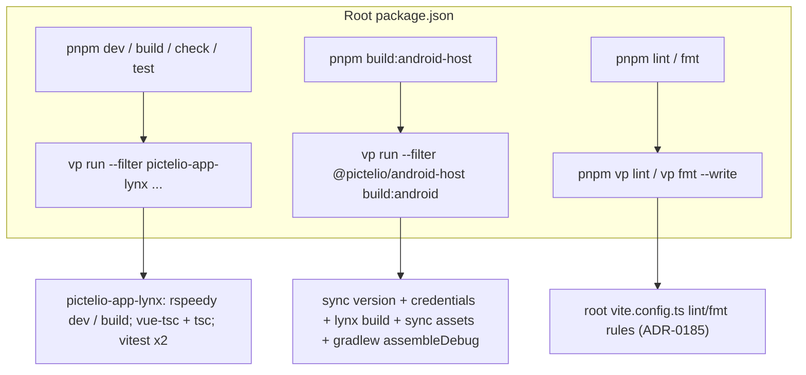
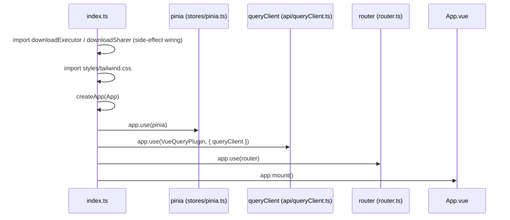
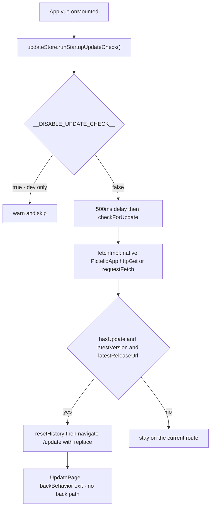

# Architecture Overview

Pictelio is a **single-engine Lynx client**: `pictelio-app-lynx` (`packages/app-lynx/`), a Vue 3 application running on the [ReactLynx](https://lynxjs.org/) runtime through the `vue-lynx` custom renderer. It is packaged into an Android APK by `@pictelio/android-host` (`packages/android-host/`), a Gradle build host that also carries the Java native modules the Lynx client talks to. There is no WebView engine anymore.

> **Single-engine (ADR-0202 / ADR-0203 / ADR-0204).** The SolidJS + Capacitor WebView client (`pictelio-app` / `packages/app`) was **deleted**, and its Android Gradle host moved to `packages/android-host`. Bare root commands `dev` / `build` / `check` / `test` / `preview` all delegate to `pictelio-app-lynx`; the build host is reachable only through explicitly named `*:android-host` commands. Client switching and the OTA web-bundle *publishing* channel were retired with it (ADR-0202), and the OTA web-bundle API left `@pictelio/update-check` when its only consumer (`packages/app/src/**`) was deleted.

## Monorepo Layout

The repository is a **pnpm workspace** (`pnpm-workspace.yaml`: the root plus `packages/*`), pinned by `devEngines` to Node `>=22.22.2` and pnpm `11.9.0`. The same file is the supply-chain policy surface: a 24-hour `minimumReleaseAge` cooldown with an explicit `@lynx-js` exemption list, `trustPolicy: no-downgrade`, `blockExoticSubdeps`, time-based dependency resolution, and `shellEmulator` for cross-platform scripts.

| Package | Location | Role |
|---------|----------|------|
| `pictelio-app-lynx` | `packages/app-lynx/` | The **only** application client — `vue-lynx` (Vue 3.5 + pinia 4 + vue-router + `@tanstack/vue-query` 5). Version `6.8.0` is the product/APK version source. |
| `@pictelio/android-host` | `packages/android-host/` | Android **build host** — Gradle project, Lynx native modules, release/sync scripts, android-e2e and JVM/Robolectric tests. Not a client. |
| `pictelio-website` | `packages/website/` | Astro landing page (GitHub Pages), and the publisher of the `version.json` the update check polls. |
| `@pictelio/update-check` | `packages/update-check/` | APK update-check pure logic only (`checkForUpdate` / `isNewer`, DI'd `FetchLike`). The OTA web-bundle contract (`isBelowMin` / `WebBundleMeta` / `parseWebBundle`) was removed with the WebView client (ADR-0202/0203). |
| `@pictelio/ugoira` | `packages/ugoira/` | Ugoira (animated illust) shared logic. |
| `@pictelio/ranking-core` | `packages/ranking-core/` | Ranking pure logic — rank modes, `mode`→API mapping, cache keys, date handling. |
| `@pictelio/search-core` | `packages/search-core/` | Search advanced-filter pure logic — filter state, request building, URL codec. |
| `@pictelio/net-diagnostics` | `packages/net-diagnostics/` | Network self-check pure logic (consumed by `/network-check`). |
| `@pictelio/novel-export` | `packages/novel-export/` | Novel export pure logic — format whitelist/MIME/ext, Pixiv HTML extraction, payload building. |

`pictelio-app-lynx` depends on six workspace packages (`@pictelio/net-diagnostics`, `novel-export`, `ranking-core`, `search-core`, `ugoira`, `update-check`). Persisted user state (the encrypted `refresh_token`) still follows the persisted-format contract described in [Android Native & Build](../integrations/android-native.md).

## Build & Command Tooling

There are **two** tooling layers, with different jobs:

- **Client bundling — rspeedy.** `packages/app-lynx` builds with [`@lynx-js/rspeedy`](https://github.com/lynx-family/rspeedy) (Rsbuild-based, Lynx-optimized). Its config is `packages/app-lynx/lynx.config.ts`; the package scripts are `rspeedy dev` / `build` / `preview`, driven through `vp run --filter pictelio-app-lynx`.
- **Workspace orchestration & lint/fmt — vite-plus.** The root `vite-plus@1.0.0-rc.0` CLI (`vp run --filter`) fans commands out to workspace packages (ADR-0185). Root `vite.config.ts` is the **single source** for repository-wide `oxlint`/`oxfmt` rules; `packages/app-lynx/**` and `packages/website/**` are currently **exempt** from root lint/fmt (existing style debt / unsupported `.astro` surface), so the client's own `lint`/`fmt` scripts are explicit no-ops.

```mermaid
flowchart TD
    subgraph Root package.json
      A["pnpm dev / build / check / test"] --> B["vp run --filter pictelio-app-lynx ..."]
      C["pnpm build:android-host"] --> D["vp run --filter @pictelio/android-host build:android"]
      E["pnpm lint / fmt"] --> F["pnpm vp lint / vp fmt --write"]
    end
    B --> G["pictelio-app-lynx: rspeedy dev / build; vue-tsc + tsc; vitest x2"]
    D --> H["sync version + credentials + lynx build + sync assets + gradlew assembleDebug"]
    F --> I["root vite.config.ts lint/fmt rules (ADR-0185)"]
```

*Bare root commands delegate to the Lynx client; the Android host is only reachable via explicit `:android-host` commands; lint/fmt resolve at the repo root.*

Key facts about the client build (`packages/app-lynx/lynx.config.ts`):

- **Credentials are fail-closed.** `credentials.json5` lives inside `packages/app-lynx` (the single source of truth after ADR-0203) and feeds both the JS injection and the Java-side OAuth config generation. `__DEV__` is true only when `NODE_ENV !== 'production'` **and** `PICTELIO_LYNX_DEV=1`; otherwise `__CREDENTIALS__` is compiled to an empty placeholder, never relying on minifier DCE to strip secrets.
- **Build-time constants** are injected via `source.define`: `__CREDENTIALS__`, `__PUBLIC_CONFIG__` (the non-secret credential fields), `__APP_VERSION__` (read from `packages/app-lynx/package.json`), `__DEV__`, `__DISABLE_UPDATE_CHECK__`, `__BENCH_NAV__` (`BENCH_NAV=1`), and `__HOME_BLEED_HEADER__` (polarity owned by `packages/app-lynx/homeBleedHeaderFlag.ts`, defaulting to `bleed` and reversible with `PICTELIO_HOME_BLEED=0`).
- **vue-lynx plugin options**: `optionsApi: false`, `enableCSSInlineVariables`, `enableCSSInheritance`, `enableCSSSelector: true` (so web-core preview matches class selectors) and `enableIFR: true` (instant first-frame rendering). Tailwind v3 is wired through `rsbuild-plugin-tailwindcss` with `@lynx-js/tailwind-preset`.
- **Dev proxy**: `/pixiv-img`, `/pixiv-api`, `/pixiv-oauth` are proxied through an HTTPS proxy agent (default `http://127.0.0.1:7897`) with the proxy URL redacted in logs, and the dev server is bound to `127.0.0.1` only so the credentialed bundle never reaches the LAN.
- **Web preview** is multi-entry in dev (`main` / `error-preview` / `login-preview`); production keeps only `main`.

Root `package.json` script names follow ADR-0204: `dev`/`build`/`check`/`test`/`preview` → the client, `*:android-host` → the host, and `lint`/`fmt`/`fmt:check` → `pnpm vp ...`. The Android build chain runs `sync:android-version` + `sync:credentials` (both read from `packages/app-lynx`), then the rspeedy production build, `sync-android-assets.mjs`, and `gradlew assembleDebug`/`assembleRelease`.

## Boot Sequence

The client boots in `packages/app-lynx/src/index.ts`. Import order matters: side-effect wiring happens at module load, and Tailwind must be a standalone CSS entry (inline `@tailwind` in a `.vue` `<style>` block is not processed by the rsbuild CSS chain).

1. **Side-effect wiring** — `downloadExecutor` and `downloadSharer` register on module load.
2. **Tailwind CSS** — imported from `styles/tailwind.css`.
3. **Vue app creation** — `createApp(App)` from `vue-lynx`.
4. **Pinia** — `app.use(pinia)` with the shared singleton from `stores/pinia.ts` (ADR-0139). Using any other `createPinia()` instance would split the store space.
5. **Vue Query** — `app.use(VueQueryPlugin, { queryClient })` with the global client from `api/queryClient.ts` (ADR-0141).
6. **vue-router** — `app.use(router)` (ADR-0138). Omitting it leaves the route area blank because `RouterView` never receives its injection.
7. **Mount** — `app.mount()`.

```mermaid
sequenceDiagram
    participant I as index.ts
    participant P as pinia (stores/pinia.ts)
    participant Q as queryClient (api/queryClient.ts)
    participant R as router (router.ts)
    participant A as App.vue

    I->>I: import downloadExecutor / downloadSharer (side-effect wiring)
    I->>I: import styles/tailwind.css
    I->>I: createApp(App)
    I->>P: app.use(pinia)
    I->>Q: app.use(VueQueryPlugin, { queryClient })
    I->>R: app.use(router)
    I->>A: app.mount()
```

*The three framework plugins are installed before mount; the router's module-level `router.replace('/discover')` sets the memory-history starting point.*

## Application Shell

`packages/app-lynx/src/App.vue` is the single root component. It renders:

- A root `<page class="Root">` whose class binding is `appearanceClasses(settings.themeColor, settings.resolvedDark)` (theme + dark-mode palette classes) and whose inline style carries only `paddingBottom: safeBottom` plus the `--shimmer-motion` reduced-motion gate. **Top inset is no longer compensated here**: it is a per-route declaration consumed by each page's own zero-content spacer (`composables/useTopInsetSpacer.ts` → `utils/topInset.ts`), and the root style contract asserts that no `safeTop`-derived padding exists (ADR-0214 / ADR-0216).
- `<RouterView v-slot>` wrapped in a route-transition container whose direction/stage is decided in `composables/routeTransition.ts` by the router's `afterEach`, with a `<KeepAlive :include="['discover', 'updates', 'shelf', 'me', 'ranking', 'mypixiv']">` so returning to those pages preserves instance/scroll state (ADR-0049). Detail pages are deliberately not cached — a cached instance keyed by `:id` would show the wrong content.
- Global overlays mounted once: `GlobalFab` (radial navigation FAB, ADR-0120), `SearchSheet` (global bottom-sheet search, ADR-0132), the engine-fallback notice, the exit-hint snackbar and the tag-mute hint snackbar. All are pill/centered rather than full-width boxes because native LynxView hit-testing does not honour `pointer-events` (ADR-0123).
- A `watch` on the `routeState` **object** that records top-level tab reach in `usageMetrics` (watching `.path` would miss the cold-start landing, which equals the placeholder value).

Startup side effects run in two `onMounted` hooks:

| Hook | Work |
|---|---|
| First | `initDeliveryProbeLifecycle()` (delivery-channel probe schedule, ADR-0220), usage-metrics `hydrate()` then `recordLaunch()` (revisit interval), and `notificationStore.refreshUnreadBadge()` (the value behind the "updates" nav badge). Every step is individually try/caught: a metric or badge failure must not block startup. |
| Second | `engineFallbackStore.check()`, `initRouter()` (401 handler registration + token restore + settings load + store hydration + first route), `updateStore.runStartupUpdateCheck()`, `initSafeArea()` (subscribe `pictelioInsets` and pull the initial value). |

A dev-only `useApiQuery` health probe (`__DEV__` gated, disabled while the search sheet is open) exercises the real data path — `apiClient` → generation-gated `useApiQuery` — without blocking startup. Shell and navigation internals are owned by [App Shell & Navigation](app-shell-and-navigation.md); inset/occlusion numbers by [Viewport Geometry & Motion](../concepts/viewport-geometry-and-motion.md).

## app-lynx Layer Map

The client is organized as **owned layers**, not a flat directory tree:

- **`api/`** — the Pixiv gateway and server-state layer. `client.ts` (dual-mode transport, 401 single-flight, rate-limit backoff), `types.ts`, `auth.ts`, `illust.ts`, `novel.ts`, `user.ts`, `comment.ts`, `search.ts`, `ranking.ts`, `notification.ts`, `ugoira.ts`, `translate.ts` / `nativeTranslate.ts`, `id.ts`, `rateLimitBackoff.ts`, plus `queryClient.ts` and `queryKeys.ts`.
- **`stores/`** — Pinia client state (see [State Management](#state-management-pinia)).
- **`pages/` + `components/`** — page components (one per route) and reusable visual components: cards, sheets, overlays, skeletons, `PageTopBar`, `SubTabBar`, `RefreshableList`, `GlobalFab`, `SearchSheet`, `FabAllowanceSpacer`, the consolidated M3 controls.
- **`primitives/`** — logic-only factories and hooks with their own lifecycle, kept **outside** Pinia: `createMixFeed`, `useSearch`, `useComments`, `useApiQuery`/`useApiInfiniteQuery`, `createGlobalFab`, `createFabMenu`, `createNovelTranslator`, `createTextSelection`, `createWatchlistPrompt`/`createWatchlistToggle`, `usageMetrics`, plus pure helpers (`generationGate`, `mergeByTime`, ranking/novel-layout/scroll-indicator math).
- **`composables/`** — Vue-composition behavior units: `useBookmarkMutation`, `useBookmarkPanel`, `useReducedMotion`, `useSheetDismiss`, `useRouteTransition`, `useTextSelection`, `useLongPress`, `useTopInsetSpacer`, `useImmersiveChrome`/`useImmersiveSystemBars`, `useNovelWatchlistToggle`, `motion.ts` / `heroTransition.ts`.
- **`router.ts` + `routerCore.ts`** — the routing shim and its pure-function core (see [Routing](#routing)).
- **`services/`, `utils/`, `i18n/`, `styles/`** — cross-cutting wiring (backup), pure utilities (download/image/safe-area/top-inset/appearance/fab-geometry/engine-state), the hand-written i18n module, and `tokens.css` + `tailwind.css` + `icon-font.css`.

The dependency direction is: **pages/components → primitives/composables → stores + api/client → native modules or fetch**. Pages own their data-loading lifecycle; stores own global client state; `api/` owns the transport and cache.

## Routing

Routing uses the official **vue-router** on `createMemoryHistory()` ([ADR-0138](../../docs/adr/ADR-0138-app-lynx-vue-router.md)). There is no URL and no URL-based routing — the app drives the queue programmatically. The earlier hand-rolled in-memory router was dropped after the empty-render root cause was found to be a template-compiler trap: kebab-case `<router-view>` compiles as a native custom element; the template must use PascalCase `<RouterView />`.

`packages/app-lynx/src/router.ts` is a thin shim keeping the page call surface stable (`navigate` / `goBack` / `requestBack` / `registerBackGuard` / `ensureAuth` / `resetHistory` / `routeState` / `currentParams` / `exitHint`), plus the bootstrap handoffs `markBootstrapDone` / `markSessionEstablished`; `routerCore.ts` holds the pure back-route adjudication, auth-gate decision and matching logic under unit test.

Key routing facts:

- **Route meta** drives guard behavior: `requiresAuth` (business pages only), `backBehavior: 'exit'` (`/update`, `/error`), and a **required** `topInset: 'self' | 'bleed'` — deliberately required so a forgotten declaration fails `vue-tsc` instead of silently falling back.
- **Initial route is `/discover`** (rendered by `Recommended.vue`) — first-frame content: authenticated users see the feed skeleton immediately; unauthenticated users are `replace`d to `/login`.
- **Auth is a synchronous `beforeEach` guard** that does not await the network. During bootstrap (`restoreToken` not yet resolved) navigation is allowed through; after `markBootstrapDone()` the guard redirects unauthenticated business-page access to `/login` with replace semantics.
- **"Can go back" = session mirror stack ∧ queue watchdog.** `memory history` cannot be physically cleared and retains stale session entries across logout→re-login, so a `_sessionStack` mirror carries the clear-stack semantics, with `hasBackEntryIn(history)` as a drift watchdog.
- **System back** (`pictelioBack` global event, registered only in native mode) runs the `evaluateBackRoute` chain: close modal → back-guards → history → `backBehavior: 'exit'` → root double-tap exit hint.
- **Notification landing** (not `__BENCH_NAV__`-gated, because it is product behavior): the host broadcasts `pictelioNotificationTarget` up to four times to survive bundle-render races, JS pulls any missed click and dedupes by `clickId`, and navigates with `push` — `replace` would leave the mirror stack inconsistent with the real queue and make back appear available forever.
- **benchNav deep links** (`__BENCH_NAV__`-gated, registered at module load so the broadcast window is not missed) let native `am start --es benchNav <scenario>` reach any page for device verification.

**Top-level destinations are `discover` / `updates` / `shelf` / `me`** (发现 / 更新 / 书架 / 我的), defined once in `packages/app-lynx/src/components/navTabs.ts` as a closed four-item `NAV_TABS` array and re-used by the radial FAB and by the tab-reach metric mapper ([ADR-0218](../../docs/adr/ADR-0218-app-lynx-top-nav-user-question-dimension.md)). Illust/novel are no longer top-level: they are in-page tabs inside 发现 (`SubTabBar`), and their routes `/illusts` / `/novels` are kept for deep links, benchNav and back targets. `/advanced` (AdvancedSettings) is a **secondary** page reached from 我的, holding the moved debug/self-check rows — it is not a FAB tab. The flat `routes` array holds 29 records overall: the four destinations, media/list/detail routes (`/illusts`, `/illust/:id`, `/illust/:id/tag-neighbors`, `/novels`, `/novel/:id`, `/novel/:id/intro`), user/social routes (`/user/:id`, `/user/:id/following`, `/user/:id/followers`, `/following`, `/mypixiv`, `/bookmarks`), and utility pages (`/ranking`, `/downloads`, `/watchlist`, `/later`, `/continue`, `/notifications`, `/mute-tags`, `/me`, `/advanced`, `/network-check`, `/platform-check`). `/update` and `/error` are deliberately not `requiresAuth` and always exit on back.

## State Management (Pinia)

Client state migrated from hand-written module-level `ref` singletons to **Pinia setup stores** ([ADR-0139](../../docs/adr/ADR-0139-app-lynx-pinia-migration.md), ADR-0140). `stores/pinia.ts` exports a single `pinia = createPinia()` shared by `index.ts`, router guards, and tests so a second instance can't split the store space.

Stores expose one `useXStore()` accessor each: `authStore`, `settingsStore`, `searchSheetStore`, `searchHistoryStore`, `modalStack`, `updateStore`, `globalFab`, `downloadStore`, `engineFallbackStore`, `notificationStore`, `novelTranslateStore`, `tagNeighbor`, `usageMetrics`, `watchLaterStore`, `continueReadingStore`, `browsingHistoryStore`, `relatedInjection`, `navMigrationNotice`, `deliveryProbeStore`.

- **`watchlistStore` stays outside Pinia** (a module-level `reactive` watch-state record plus a dismissed `Set`, not a Pinia store), and **instance-level primitives** (`useSearch`, `createMixFeed`, `useComments`, `createGlobalFab`) are deliberately not stores — their lifecycle is page/component-scoped.
- Tests isolate each case with `setActivePinia(createPinia())`; the old `resetXxxForTest` hooks were deleted (the surviving `resetWatchlistStoreForTest` belongs to the non-Pinia module).

## Data Fetching (TanStack Vue Query)

Server state uses **TanStack Vue Query v5** ([ADR-0141](../../docs/adr/ADR-0141-app-lynx-vue-query-migration.md)). It layers over the unchanged `apiClient` seam — the 401 single-flight lock stays in `apiClient` (not Vue Query) to preserve the Java `PixivApiCore.synchronized + isRefreshing` contract.

- **`api/queryKeys.ts`** — a centralized `as const` key factory (`illusts`/`novels`/`users`/`search`/`watchlist`/`notifications`/`settings` namespaces) enabling prefix-based `invalidateQueries`.
- **`api/queryClient.ts`** — the global `QueryClient` singleton (`createAppQueryClient()`): `staleTime 0` (pessimistic refresh), `gcTime 30s`, `retry false` (mutations too), `refetchOnWindowFocus false` (Lynx has no focus event), `refetchOnReconnect true`, `refetchOnMount true`, `placeholderData keepPreviousData`, `structuralSharing true`. Per-prefix `gcTime` overrides: 5 minutes for stable data (illust details / users / novels), 0 for feeds and search.
- **`primitives/useApiQuery.ts` / `useApiInfiniteQuery.ts`** — helpers wrapping `useQuery`/`useInfiniteQuery` with a `withGenerationGate` to drop stale responses (still needed because `cancelQueries` aborts but does not cancel the in-flight fetch).
- **`composables/useBookmarkMutation.ts`** — a `useMutation`-backed optimistic bookmark toggle with rollback and the 350 ms animation contract.
- **`createMixFeed`** remains a factory (multi-source merge plus throttle/generation-gate orchestration can't be expressed in Vue Query), but gained an internal `AbortController` for real cancellation.

## API Client & Dual-Mode Transport

`packages/app-lynx/src/api/client.ts` is the Pixiv gateway seam. It exposes `get` / `post` / `requestRaw` and runs in two modes, selected per request by `isNativeMode()`:

- **Web-core (dev preview)** — `fetch` via `fetchWrapper` (`globalThis.fetch`; the Lynx worker shadows bare `fetch`), with `rewriteUrl` mapping paths to the rspeedy `/pixiv-*` proxies and Bearer tokens attached only to those prefixed paths.
- **Native LynxView** — detected by probing for actual `PictelioAuth`/`PictelioApi`/`PictelioSecureStorage`/`PictelioApp` modules (never bare `NativeModules` existence, which the preview worker shims). Requests forward to `PictelioApiModule` in Java, which attaches the Bearer header and performs the 401 refresh; **JS is zero-knowledge for the access token** (a rotated `refresh_token` is persisted back to the Keystore).

Both modes share the request pipeline: an auth-ready gate (`authReadyProvider`, so first-frame GETs wait for `restoreToken` instead of racing into a 401 — the native branch needs it too, issue #815), an in-flight GET dedup map (skipped when the caller supplies an `AbortSignal`), the 401 single-flight `refreshPromise`, and 429 rate-limit backoff (`rateLimitBackoff.ts`, parameters injected from `settingsStore`). Error classification (`classifyError`) maps proxy failures, network failures, 401/403/429, OAuth `invalid_grant` and 5xx onto `ApiErrorType` values with i18n `messageKey`s.

## Design System (Material Design 3)

The Lynx client aligns to **Material Design 3** (ADR-0205–0212), replacing the deleted WebView client's Fluent/UnoCSS stack:

- **Tokens** are M3 `--md-*` CSS variables in `styles/tokens.css`; the root `<page>` surface color and shapes/typography come from this token set.
- **Theme color & dark mode** use **static pre-generated palettes** — 7 theme colors (`sky` default, `violet`, `pink`, `green`, `orange`, `teal`, `bili`) × light/dark, emitted by `scripts/generate-theme-palettes.mjs` as `.theme-X` plus compound `.theme-X.dark` rules — so there is zero runtime color math. `appearanceClasses(themeColorId, resolvedDark)` (`utils/appearanceClasses.ts`) composes the root class list from `utils/themeColor.ts` and `utils/darkMode.ts`, which own the id/class/validation/fallback single sources.
- **M3 components** are consolidated where geometry matters (`M3Switch.vue`, `M3SegmentedButton.vue`, M3 snackbar/sheet shapes) — see [MD3 Design System](../concepts/md3-design-system.md).
- **Styling** is Tailwind v3 with `@lynx-js/tailwind-preset`: spacing in `vw` and font sizes in `rpx` (viewport/Responsive-pixel units per the Lynx unit glossary). Icons are a base64-inlined icon font subset (`styles/icon-font.css`), rendered through `AppIcon.vue`.

## Internationalization (i18n)

The client uses a **hand-written message module** (`packages/app-lynx/src/i18n/index.ts`) rather than `vue-i18n`, because the Lynx runtime has no `Intl`/DOM. It provides:

- `zh-CN` (source) + `en` dictionaries under `i18n/locales/`, a module-level `locale` ref, `setLocale()` / `followSystemLocale()`, and `t(key, vars)` with `{{var}}` interpolation and a warn-on-missing-key fallback.
- `apiErrorMessage()` rendering `messageKey` + `params` with a raw `message` snapshot fallback, so server text stays data.
- The `Accept-Language` header for web-mode requests is snapshotted from the same `locale` at header-construction time (ADR-0200); in native mode the Java side injects it.

## Engine Availability and Single-Engine Fallback

[ADR-0164](../../docs/adr/ADR-0164-default-engine-lynx-bidirectional-fallback.md) flipped the default engine to Lynx and introduced **bidirectional** engine fallback. Only the first half survives: the default-engine half is now structural (`build.gradle` declares `CLIENT_KINDS = {"lynx"}` and `CLIENT_KINDS[0]` remains the single source of the Java default), while the whole bidirectional machinery — `EngineRouting` / `EnginePrefs` / `EngineRoute`, the failure-memory key, the auto-fallback switch, the 10 stable reason codes and the double-failure upgrade page — was **deleted** with single-engine consolidation (ADR-0203).

What remains on the native side is a single funnel, not a fallback: `LynxActivity` funnels runtime failures (init throw, bundle load failure, fatal render error, 10 s load timeout) into one error page. There is no engine to jump to, so no failure memory and no automatic jump; the 10 s timeout deliberately still does not auto-navigate, because a slow device is not an unsupported device.

The app-lynx side still contains the *consumers* of that retired protocol, which are inert in the current build:

- `App.vue` renders a dismissible notice from `stores/engineFallbackStore.ts`, which consumes the one-shot key `pictelio_engine_fallback_notice` via `utils/engineFallbackNotice.ts` (native `PictelioPrefs` or dev IndexedDB). No native writer for that key exists in `packages/android-host`, so the branch can no longer become true.
- `utils/engineState.ts` parses the `pictelio_engine_state` snapshot line (`preferred=… effective=… reason=…`, tolerant of unknown reason codes) and `engineFallback.reason.*` copy lists the 10 reason codes — both retained but **consumer-less**, since their only renderer (the "preferred / effective" row) was removed with the client-switch UI.

Treat these as retained compatibility seams: do not re-derive engine behavior from them, and do not remove them without accounting for the tests that still pin their contracts (`engineState.test.ts`, `engineFallbackNotice.test.ts`).

## Update Check (Startup Path)

Update checking is **automatic only** — there is no manual entry point. `App.vue`'s `onMounted` calls `useUpdateStore().runStartupUpdateCheck()`, and the store owns the whole path (`stores/updateStore.ts`):

```mermaid
flowchart TD
    A["App.vue onMounted"] --> B["updateStore.runStartupUpdateCheck()"]
    B --> C{"__DISABLE_UPDATE_CHECK__"}
    C -->|"true - dev only"| D["warn and skip"]
    C -->|"false"| E["500ms delay then checkForUpdate"]
    E --> F["fetchImpl: native PictelioApp.httpGet or requestFetch"]
    F --> G{"hasUpdate and latestVersion and latestReleaseUrl"}
    G -->|"yes"| H["resetHistory then navigate /update with replace"]
    G -->|"no"| I["stay on the current route"]
    H --> J["UpdatePage - backBehavior exit - no back path"]
```

*The forced-update path is entered only when a release URL exists, so a missing release page cannot lock the user inside an exit-less screen.*

- The network layer is a `FetchLike` seam: native mode goes through the `PictelioApp.httpGet` native module (Java OkHttp, with a matching JS-side timeout), while web-core and tests use `requestFetch`. `@pictelio/update-check`'s `checkForUpdate` polls `packages/website/version.json` from `raw.githubusercontent.com` with a 10 s timeout and returns an `error` field instead of throwing.
- Local version is `__APP_VERSION__`, injected at build time from `packages/app-lynx/package.json` — the same source the APK version is synced from, so bundle and APK can never disagree.
- On a hit, the store calls `resetHistory()` and `navigate('/update', { replace: true })`; `UpdatePage` cannot be backed out of (`meta.backBehavior: 'exit'`). Its actions route back through the store: `openReleasePage()` via the native `openUrl` bridge and `exitUpdatePage()` via `PictelioApp.exitApp`, each warning instead of silently no-op'ing when the bridge is missing (web-core preview).
- `.env`'s `PICTELIO_DISABLE_UPDATE_CHECK` is honored **only in dev builds** (the flag is forced to `false` when `NODE_ENV=production`), so a dev preview cannot get stuck on the update page while production keeps the check.

## Native Side (Android Host)

`packages/android-host` is the build host, not a second client. Its `android/` Gradle project contains:

- **Lynx native modules** under `android/app/src/lynx/java/io/pictelio/app/`: `LynxActivity` (the only LAUNCHER activity) + `LynxRuntimeInitializer` (process-level module registration and the availability probe), `PictelioAppLynx` (Application), `PictelioApiModule`, `PictelioAuthModule`, `PictelioAppModule`, `PictelioSecureStorageModule`, `PictelioImageService`, `PictelioDownloaderModule`, `PictelioGalleryModule`, `PictelioNotificationModule`, `PictelioTranslateModule`, `PictelioTranslateCacheModule`, `PictelioWebDavModule`, `PictelioShareModule`, `PictelioClipboardModule`, `PictelioPrefsModule`, `NetDiagModule`, `PictelioTemplateProvider`, `NotificationTapActivity`, `UgoiraStreamEngine`. Modules are registered both per-process (`LynxRuntimeInitializer`) and on the view builder (`LynxActivity`).
- **Core Java services** under `android/app/src/main/java/io/pictelio/app/`: `PixivApiCore`, `SecureStorageCompat`, `ImageHostConfig`, `WebDavClient`, `NovelExporter` + encoders, `PictelioDownloader`, `ShareHelper`, etc.

The host owns the JS↔Java contracts the client depends on: `pictelioInsets`, `pictelioDarkMode`, `pictelioBack`, `pictelioAppForeground` / `pictelioAppBackground`, the notification-tap extras, and the `CapacitorStorage` preference file shared with `settingsStore`. Its `build:android` / `build:android:release` scripts sync version and credentials from `packages/app-lynx`, build the rspeedy bundle, copy it into assets via `sync-android-assets.mjs`, then invoke Gradle. Full native-module and splash/inset details live in [Android Native & Build](../integrations/android-native.md).

## Related Pages

- [API Layer & Authentication](api-layer.md) — Pixiv HTTP client, OAuth, 401 single-flight, rate-limit backoff
- [App Shell & Navigation](app-shell-and-navigation.md) — route table, guards, back handling, FAB and modal stack
- [Image Loading Pipeline](image-pipeline.md) — image host selection, cache, proxy
- [Android Native & Build](../integrations/android-native.md) — Lynx native modules, Gradle, splash/insets
- [MD3 Design System](../concepts/md3-design-system.md) — tokens, palettes, M3 components
- [Viewport Geometry & Motion](../concepts/viewport-geometry-and-motion.md) — safe area, top-inset ownership, FAB allowance, motion
- [Release & Deploy](../operations/release-and-deploy.md) — APK build and release chain
- [Quickstart](../quickstart.md) — running dev/build/check/test
- [Testing Strategy](../testing/overview.md) — test layers and gates
