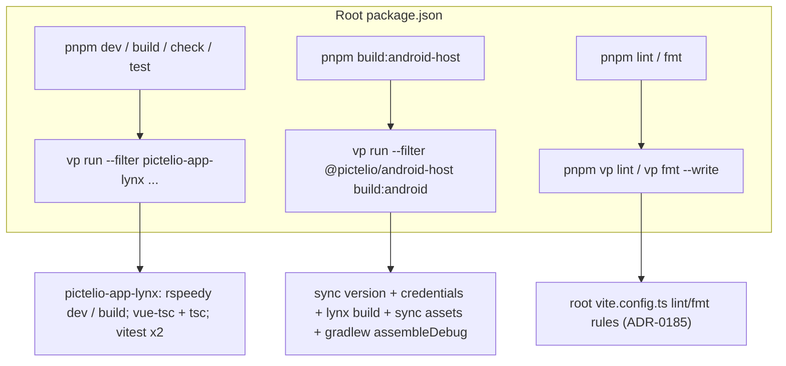
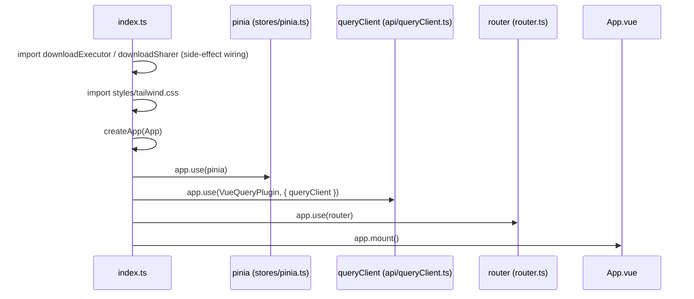

# Architecture Overview

Pictelio is a **single-engine Lynx client**: `pictelio-app-lynx` (`packages/app-lynx/`), a Vue 3 application running on the [ReactLynx](https://lynxjs.org/) runtime via the `vue-lynx` custom renderer. The client is packaged into an Android APK by `@pictelio/android-host` (`packages/android-host/`), a Gradle build host that also carries the Java native modules the Lynx client talks to. There is no WebView engine anymore.

> **Single-engine (ADR-0203 / ADR-0204, 2026-09-29).** The SolidJS + Capacitor WebView client (`pictelio-app` / `packages/app`) was **deleted**, and its Android Gradle host moved to `packages/android-host`. Root bare commands `dev` / `build` / `check` / `test` / `preview` now all delegate to `pictelio-app-lynx`; the build host only has explicitly named `:android-host` commands. Client switching and the OTA web-bundle channel were removed with it (ADR-0202 / ADR-0203 decisions 4 & 7).

## Monorepo Layout

The repository is a **pnpm workspace** (`pnpm-workspace.yaml`: root + `packages/*`). There is one application client and a set of shared pure-logic packages consumed by it.

| Package | Location | Role |
|---------|----------|------|
| `pictelio-app-lynx` | `packages/app-lynx/` | The **only** application client — `vue-lynx` (Vue 3.5 on ReactLynx). Version `6.8.0` is the product version source. |
| `@pictelio/android-host` | `packages/android-host/` | Android **build host** — Gradle project, Lynx native modules, release/sync scripts, android-e2e and JVM/Robolectric tests. Not a client. |
| `pictelio-website` | `packages/website/` | Astro landing page (GitHub Pages). |
| `@pictelio/update-check` | `packages/update-check/` | APK update-check pure logic (`checkForUpdate` / `isNewer` / `isBelowMin`). OTA web-bundle API was removed with the WebView client (ADR-0202/0203). |
| `@pictelio/ugoira` | `packages/ugoira/` | Ugoira (animated illust) shared logic. |
| `@pictelio/ranking-core` | `packages/ranking-core/` | Ranking pure logic — rank modes, `mode`→API mapping, cache keys, date handling. |
| `@pictelio/search-core` | `packages/search-core/` | Search advanced-filter pure logic — filter state, request building, URL codec. |
| `@pictelio/net-diagnostics` | `packages/net-diagnostics/` | Network self-check pure logic (consumed by `/network-check`). |
| `@pictelio/novel-export` | `packages/novel-export/` | Novel export pure logic — format whitelist/MIME/ext, Pixiv HTML extraction, payload building. |

`pictelio-app-lynx` depends on the six `@pictelio/*` workspace packages above (`packages/app-lynx/package.json`). Persisted user state (the encrypted `refresh_token`) still follows the persisted-format contract described in [Android Native & Build](../integrations/android-native.md).

## Build & Command Tooling

There are **two** tooling layers, with different jobs:

- **Client bundling — rspeedy.** `packages/app-lynx` builds with [`@lynx-js/rspeedy`](https://github.com/lynx-family/rspeedy) (Rsbuild-based, Lynx-optimized). Its config is `packages/app-lynx/lynx.config.ts`.
- **Workspace orchestration & lint/fmt — vite-plus.** The root `vite-plus@1.0.0-rc.0` CLI (`vp run --filter`) fans commands out to workspace packages (ADR-0185). Root `vite.config.ts` is the **single source** for repository-wide `oxlint`/`oxfmt` rules.

```mermaid
flowchart TD
    subgraph Root package.json
      A["pnpm dev / build / check / test"] --> B["vp run --filter pictelio-app-lynx ..."]
      C["pnpm build:android-host"] --> D["vp run --filter @pictelio/android-host build:android"]
      E["pnpm lint / fmt"] --> F["pnpm vp lint / vp fmt --write"]
    end
    B --> G["pictelio-app-lynx: rspeedy dev / build; vue-tsc + tsc; vitest x2"]
    D --> H["sync version + credentials + lynx build + sync assets + gradlew assembleDebug"]
    F --> I["root vite.config.ts lint/fmt rules (ADR-0185)"]
```

*Bare root commands delegate to the Lynx client; the Android host is only reachable via explicit `:android-host` commands; lint/fmt resolve at the repo root.*

Key facts about the client build (`packages/app-lynx/lynx.config.ts`):

- **Credentials are fail-closed.** `credentials.json5` lives inside `packages/app-lynx` (the single source of truth after ADR-0203). `__DEV__` is true only when `NODE_ENV !== 'production'` **and** `PICTELIO_LYNX_DEV=1`; otherwise `__CREDENTIALS__` is compiled to an empty placeholder, never relying on minifier DCE to strip secrets.
- **Build-time constants** are injected via `source.define`: `__CREDENTIALS__`, `__PUBLIC_CONFIG__`, `__APP_VERSION__` (read from `packages/app-lynx/package.json`), `__DEV__`, `__DISABLE_UPDATE_CHECK__`, `__BENCH_NAV__`, and `__HOME_BLEED_HEADER__`.
- **vue-lynx plugin options**: `enableCSSSelector: true` (so web-core preview matches class selectors) and `enableIFR: true` (instant first-frame rendering). Tailwind v3 is wired through `rsbuild-plugin-tailwindcss` with `@lynx-js/tailwind-preset`.
- **Dev proxy**: `/pixiv-img`, `/pixiv-api`, `/pixiv-oauth` are proxied through an HTTPS proxy agent (default `http://127.0.0.1:7897`), with the dev server bound to `127.0.0.1` only.
- **Web preview** is multi-entry in dev (`main` / `error-preview` / `login-preview`); production keeps only `main`.

Root `package.json` script names follow ADR-0204: `dev`/`build`/`check`/`test`/`preview` → the client, `*:android-host` → the host, and `lint`/`fmt` → `pnpm vp lint`/`fmt`. The Android build chain runs `sync:android-version` + `sync:credentials` (both read from `packages/app-lynx`), then the rspeedy build, `sync-android-assets.mjs`, and `gradlew assembleDebug`/`assembleRelease`.

## Boot Sequence

The client boots in `packages/app-lynx/src/index.ts`. Import order matters: side-effect wiring happens at module load, and Tailwind must be a standalone CSS entry (inline `@tailwind` in a `.vue` `<style>` block is not processed by the rsbuild CSS chain).

1. **Side-effect wiring** — `downloadExecutor` and `downloadSharer` register on module load.
2. **Tailwind CSS** — imported from `styles/tailwind.css`.
3. **Vue app creation** — `createApp(App)` from `vue-lynx`.
4. **Pinia** — `app.use(pinia)` with the shared singleton from `stores/pinia.ts` (ADR-0139).
5. **Vue Query** — `app.use(VueQueryPlugin, { queryClient })` with the global client from `api/queryClient.ts` (ADR-0141).
6. **vue-router** — `app.use(router)` (ADR-0138). Omitting it yields an empty route area.
7. **Mount** — `app.mount()`.

```mermaid
sequenceDiagram
    participant I as index.ts
    participant P as pinia (stores/pinia.ts)
    participant Q as queryClient (api/queryClient.ts)
    participant R as router (router.ts)
    participant A as App.vue

    I->>I: import downloadExecutor / downloadSharer (side-effect wiring)
    I->>I: import styles/tailwind.css
    I->>I: createApp(App)
    I->>P: app.use(pinia)
    I->>Q: app.use(VueQueryPlugin, { queryClient })
    I->>R: app.use(router)
    I->>A: app.mount()
```

*The three framework plugins are installed before mount; the router's module-level `router.replace('/discover')` sets the memory-history starting point.*

## Application Shell

`packages/app-lynx/src/App.vue` is the single root component. It renders:

- A root `<page class="Root">` whose class binding is `appearanceClasses(settings.themeColor, settings.resolvedDark)` (theme + dark-mode) and whose inline style carries only `paddingBottom: safeBottom` plus the `--shimmer-motion` reduced-motion gate.
- `<RouterView v-slot>` wrapped in a route-transition container, with a `<KeepAlive :include="['discover', 'updates', 'shelf', 'me', 'ranking', 'mypixiv']">` so returning to those pages preserves instance/scroll state (ADR-0049). Detail pages are deliberately not cached.
- Global overlays mounted once: `GlobalFab` (radial navigation FAB, ADR-0120), `SearchSheet` (global bottom-sheet search, ADR-0132), the engine-fallback notice, and the exit-hint / tag-mute snackbars.
- Startup side effects in `onMounted`: `initRouter()` (auth restore + first route), `runStartupUpdateCheck()`, `initSafeArea()`, the engine-fallback check, notification unread-badge prefetch, and usage-metrics hydration. A dev-only `useApiQuery` health probe exercises the real data path without blocking startup.

## app-lynx Layer Map

The client is organized as **owned layers**, not a flat directory tree:

- **`api/`** — the Pixiv gateway and server-state layer. `client.ts` (dual-mode transport, 401 single-flight, rate-limit backoff), `types.ts`, `auth.ts`, `illust.ts`, `novel.ts`, `comment.ts`, `search.ts`, `ranking.ts`, `notification.ts`, `ugoira.ts`, `translate.ts` / `nativeTranslate.ts`, `id.ts`, plus `queryClient.ts` and `queryKeys.ts`.
- **`stores/`** — Pinia client state (see [State Management](#state-management-pinia)).
- **`pages/` + `components/`** — page components (one per route) and reusable visual components (cards, sheets, overlays, skeletons, the FAB).
- **`primitives/`** — logic-only factories and hooks with their own lifecycle, kept **outside** Pinia: `createMixFeed`, `useSearch`, `useComments`, `useApiQuery`/`useApiInfiniteQuery`, `createGlobalFab`, `createFabMenu`, plus pure helpers (`generationGate`, `mergeByTime`, ranking/novel-layout utilities).
- **`composables/`** — Vue-composition behavior units: `useBookmarkMutation`, `useBookmarkPanel`, `useReducedMotion`, `useSheetDismiss`, `useRouteTransition`, `useTextSelection`, `useLongPress`, motion/hero-transition helpers, etc.
- **`router.ts` + `routerCore.ts`** — the routing shim and its pure-function core (see [Routing](#routing)).
- **`services/`, `utils/`, `i18n/`, `styles/`** — cross-cutting wiring (backup), pure utilities (download/image/safe-area/appearance/top-inset), the hand-written i18n module, and `tokens.css` + `tailwind.css`.

The dependency direction is: **pages/components → primitives/composables → stores + api/client → native modules or fetch**. Pages own their data-loading lifecycle; stores own global client state; `api/` owns the transport and cache.

## Routing

Routing uses the official **vue-router** with `createMemoryHistory()` ([ADR-0138](../../docs/adr/ADR-0138-app-lynx-vue-router.md)). The earlier hand-rolled in-memory router was dropped after the empty-render root cause was found to be a template-compiler trap: kebab-case `<router-view>` compiles as a native custom element; the template must use PascalCase `<RouterView />`.

`packages/app-lynx/src/router.ts` is a thin shim keeping the page call surface stable (`navigate` / `goBack` / `requestBack` / `registerBackGuard` / `ensureAuth` / `resetHistory` / `routeState` / `currentParams` / `exitHint`); `routerCore.ts` holds the pure back-route adjudication and matching logic under unit test.

Key routing facts:

- **Route meta** drives guard behavior: `requiresAuth` (business pages only), `backBehavior: 'exit'` (`/update`, `/error`), and a **required** `topInset: 'self' | 'bleed'` (`#900`).
- **Initial route is `/discover`** (rendered by `Recommended.vue`) — first-frame content: authenticated users see the feed skeleton immediately; unauthenticated users are `replace`d to `/login`.
- **Auth is a synchronous `beforeEach` guard** that does not await the network. During bootstrap (`restoreToken` not yet resolved) navigation is allowed through; after `markBootstrapDone()` the guard redirects unauthenticated business-page access to `/login` with replace semantics.
- **"Can go back" = session mirror stack ∧ queue watchdog.** `memory history` cannot be physically cleared and retains stale session entries across logout→re-login, so a `_sessionStack` mirror carries the clear-stack semantics, with `hasBackEntryIn(history)` as a drift watchdog.
- **System back** (`pictelioBack` global event) runs the `evaluateBackRoute` chain in `routerCore.ts`: close modal → back-guards → history → `backBehavior: 'exit'` → root double-tap exit hint.
- **benchNav deep links** (`__BENCH_NAV__`-gated) let native `am start --es benchNav <scenario>` reach any page for device verification.

Top-level destinations are `/discover`, `/updates`, `/shelf`, `/advanced` (the four FAB tabs), with media/list/detail routes (`/illusts`, `/illust/:id`, `/novels`, `/novel/:id`, `/novel/:id/intro`), user/social routes (`/user/:id`, `/following`, `/mypixiv`, …), and utility pages (`/ranking`, `/downloads`, `/me`, `/network-check`, `/platform-check`, `/notifications`, `/mute-tags`, `/later`, `/continue`, …). `/update` and `/error` are deliberately not `requiresAuth` and always exit on back.

## State Management (Pinia)

Client state migrated from hand-written module-level `ref` singletons to **Pinia setup stores** ([ADR-0139](../../docs/adr/ADR-0139-app-lynx-pinia-migration.md), ADR-0140). `stores/pinia.ts` exports a single `pinia = createPinia()` shared by `index.ts`, router guards, and tests so a second instance can't split the store space.

Stores expose one `useXStore()` accessor each: `authStore`, `settingsStore`, `searchSheetStore`, `searchHistoryStore`, `modalStack`, `updateStore`, `globalFab`, `downloadStore`, `engineFallbackStore`, `notificationStore`, `novelTranslateStore`, `tagNeighbor`, `usageMetrics`, `watchLaterStore`, `watchlistStore`, `continueReadingStore`, `browsingHistoryStore`, `relatedInjection`, `navMigrationNotice`.

- **`watchlistStore` stays outside Pinia** (a module-level `reactive` watch-state record plus a dismissed `Set`, not a Pinia store), and **instance-level primitives** (`useSearch`, `createMixFeed`, `useComments`, `createGlobalFab`) are deliberately not stores — their lifecycle is page/component-scoped.
- Tests isolate each case with `setActivePinia(createPinia())`; the old `resetXxxForTest` hooks were deleted.

## Data Fetching (TanStack Vue Query)

Server state uses **TanStack Vue Query v5** ([ADR-0141](../../docs/adr/ADR-0141-app-lynx-vue-query-migration.md)). It layers over the unchanged `apiClient` seam — the 401 single-flight lock stays in `apiClient` (not Vue Query) to preserve the Java `PixivApiCore.synchronized + isRefreshing` contract.

- **`api/queryKeys.ts`** — a centralized `as const` key factory (`illusts`/`novels`/`users`/`search`/`watchlist`/`notifications`/`settings` namespaces) enabling prefix-based `invalidateQueries`.
- **`api/queryClient.ts`** — the global `QueryClient` singleton: `staleTime 0` (pessimistic refresh), `gcTime 30s`, `retry false`, `refetchOnWindowFocus false` (Lynx has no focus event), `refetchOnReconnect true`, `placeholderData keepPreviousData`, `structuralSharing true`. Per-prefix `gcTime` overrides: 5 minutes for stable data (detail / users / novels), 0 for feeds/search.
- **`primitives/useApiQuery.ts` / `useApiInfiniteQuery.ts`** — helpers wrapping `useQuery`/`useInfiniteQuery` with a `withGenerationGate` to drop stale responses (still needed because `cancelQueries` aborts but does not cancel the in-flight fetch).
- **`composables/useBookmarkMutation.ts`** — a `useMutation`-backed optimistic bookmark toggle with rollback and the 350 ms animation contract.
- **`createMixFeed`** remains a factory (multi-source 4:1 merge plus throttle/generation-gate orchestration can't be expressed in Vue Query), but gained an internal `AbortController` for real cancellation.

## API Client & Dual-Mode Transport

`packages/app-lynx/src/api/client.ts` is the Pixiv gateway seam. It exposes `get` / `post` / `requestRaw` and runs in two modes:

- **Web-core (dev preview)** — `fetch` via `fetchWrapper` (`globalThis.fetch`; the Lynx worker shadows bare `fetch`), with `rewriteUrl` mapping paths to the rspeedy `/pixiv-*` proxies and Bearer tokens attached to those prefixed paths.
- **Native LynxView** — detected by `isNativeMode()` (checking for actual `Pictelio*` native modules, not bare `NativeModules` existence). Requests forward to `PictelioApiModule` in Java, which attaches the Bearer header and performs the 401 refresh; **JS is zero-knowledge for the access token**.

Both modes share the 401 single-flight `refreshPromise`, an auth-ready gate (`authReadyProvider`, so first-frame requests wait for `restoreToken` instead of racing into 401), and 429 rate-limit backoff (`rateLimitBackoff.ts`, configurable via `settingsStore`).

## Design System (Material Design 3)

The Lynx client aligns to **Material Design 3** (ADR-0205–0212), replacing the deleted WebView client's Fluent/UnoCSS stack:

- **Tokens** are M3 `--md-*` CSS variables in `styles/tokens.css`; the root `<page>` surface color and shapes/typography come from this token set.
- **Theme color & dark mode** use **static pre-generated palettes** (6 themes × light/dark via `scripts/generate-theme-palettes.mjs`) — zero runtime color math. `appearanceClasses(themeColorId, resolvedDark)` binds the root class; `utils/themeColor.ts` and `utils/darkMode.ts` are the id/class/validation single sources of truth.
- **M3 components** are consolidated where geometry matters (`M3Switch.vue`, `M3SegmentedButton.vue`, M3 snackbar/sheet shapes).
- **Styling** is Tailwind v3 with `@lynx-js/tailwind-preset`: spacing in `vw` and font sizes in `rpx` (viewport/Responsive-pixel units per the Lynx unit glossary).

## Internationalization (i18n)

The client uses a **hand-written message module** (`packages/app-lynx/src/i18n/index.ts`) rather than `vue-i18n`, because the Lynx runtime has no `Intl`/DOM. It provides:

- `zh-CN` (source) + `en` dictionaries under `i18n/locales/`, a module-level `locale` ref, `setLocale()` / `followSystemLocale()`, and `t(key, vars)` with interpolation.
- `apiErrorMessage()` rendering `messageKey` + `params` with a raw `message` snapshot fallback, so server text (`{{detail}}`) stays data.
- The `Accept-Language` header for web-mode requests derives from the same `locale` (ADR-0200).

## Native Side (Android Host)

`packages/android-host` is the build host, not a second client. Its `android/` Gradle project contains:

- **Lynx native modules** under `android/app/src/lynx/java/io/pictelio/app/`: `LynxActivity` + `LynxRuntimeInitializer` (the runtime host), `PictelioApiModule`, `PictelioAuthModule`, `PictelioAppModule`, `PictelioSecureStorageModule`, `PictelioImageService`, `PictelioDownloaderModule`, `PictelioGalleryModule`, `PictelioTranslateModule`, `PictelioTranslateCacheModule`, `PictelioWebDavModule`, `PictelioShareModule`, `PictelioClipboardModule`, `PictelioPrefsModule`, `NetDiagModule`, `UgoiraStreamEngine`.
- **Core Java services** under `android/app/src/main/java/io/pictelio/app/`: `PixivApiCore`, `SecureStorageCompat`, `ImageHostConfig`, `WebDavClient`, `NovelExporter` + encoders, `PictelioDownloader`, `ShareHelper`, etc.

The host's `build:android` / `build:android:release` scripts sync version and credentials from `packages/app-lynx`, build the rspeedy bundle, copy it into assets via `sync-android-assets.mjs`, then invoke Gradle. Full native-module and splash/insets details live in [Android Native & Build](../integrations/android-native.md).

## Related Pages

- [API Layer & Authentication](api-layer.md) — Pixiv HTTP client, OAuth, request dedup
- [Image Loading Pipeline](image-pipeline.md) — image host selection, cache, proxy
- [Android Native & Build](../integrations/android-native.md) — Lynx native modules, Gradle, splash/insets
- [Release & Deploy](../operations/release-and-deploy.md) — APK build and release chain
- [Quickstart](../quickstart.md) — running dev/build/check/test
- [Testing Strategy](../testing/overview.md) — test layers and gates
