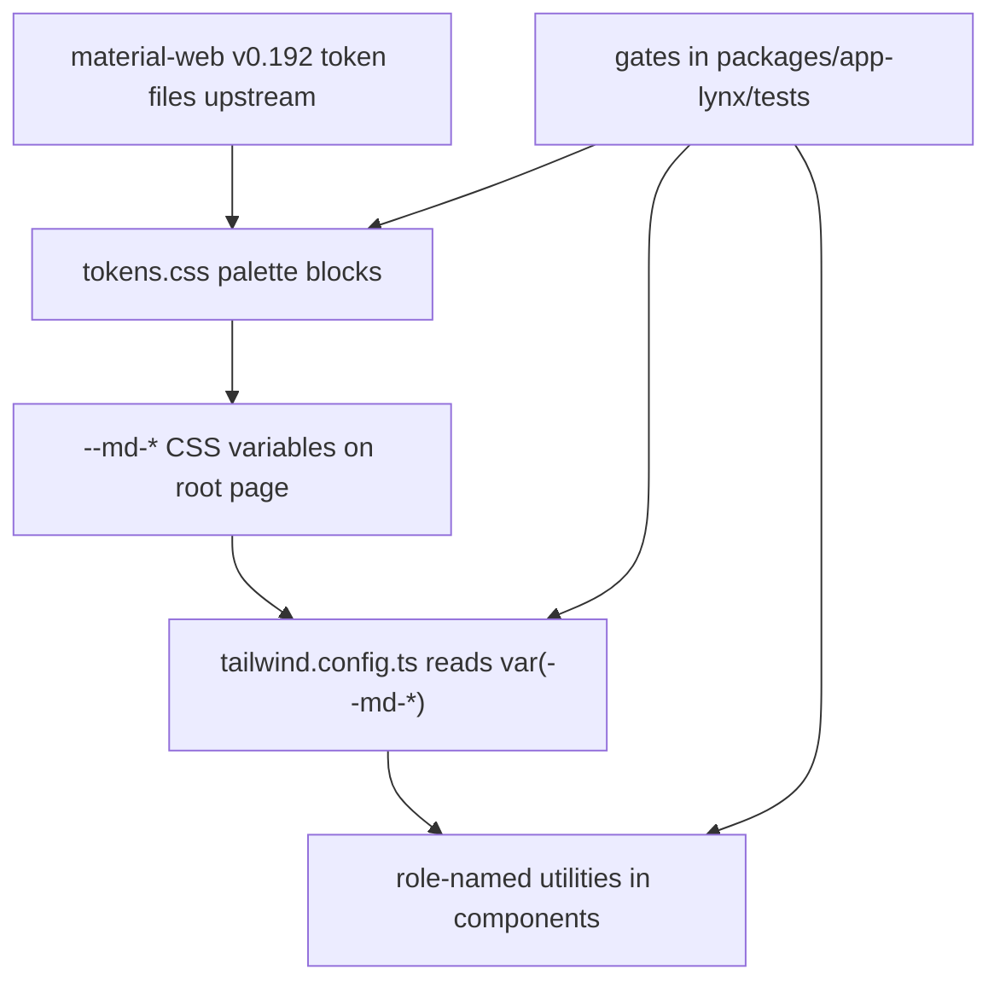

# MD3 Design System & Token Contract

`packages/app-lynx` is a **Material Design 3** client, and this page is the contract that any UI change must satisfy: where each design value lives, how new code is required to consume it, and which gate turns red when a change bypasses it. The baseline is [ADR-0205](../../docs/adr/ADR-0205-md3-baseline-and-scope.md), whose companion ADRs own the detail: [ADR-0206](../../docs/adr/ADR-0206-typography-type-scale.md) (type scale), [ADR-0207](../../docs/adr/ADR-0207-shape-and-state-layer-guardrails.md) (shape + state layer), [ADR-0208](../../docs/adr/ADR-0208-material-symbols-icons.md) (icons), [ADR-0209](../../docs/adr/ADR-0209-md3-filled-text-field-alignment.md) (filled text field), [ADR-0212](../../docs/adr/ADR-0212-tonal-elevation-surface-over-shadow.md) (tonal elevation). The per-tier term register is [glossary-md3-alignment.md](../../docs/adr/glossary-md3-alignment.md); consult it before quoting a value.

The Fluent Design chapter inherited from the deleted WebView client is **historical archive** and has no force here — the single current statement of app-lynx design constraints is the `### app-lynx 的 MD3 约定` section of [AGENTS.md](../../AGENTS.md#L207), and `packages/app-lynx/tests/agentsMdMd3Baseline.test.ts` fails if a second current-constraint statement reappears or if the deviation list drifts off the ADR.

Gate paths below are relative to `packages/app-lynx/` unless they start with `src/`. They all run under the app-lynx Vitest suite (`pnpm test:all` on CI, per [Testing Strategy](../testing/overview.md)).

Two scope boundaries apply to this page:

- **Layout, insets, occlusion and the motion contract are owned elsewhere** — geometry numbers and the motion presets live in [Viewport Geometry & Motion](viewport-geometry-and-motion.md). Here, motion appears only as a token family (where the values live and how to consume them).
- **This page documents the token contract, not every component.** Component-level behaviour belongs to [App Shell & Navigation](../architecture/app-shell-and-navigation.md), [Feed & Browsing](../domain/feed-and-browsing.md) and the other domain pages.

## The Numeric Baseline: material-web v0.192

MD3 numbers are **not** taken from memory, from `m3.material.io`, or from a secondary summary. The single authority is the generated token source in the upstream [material-web](https://github.com/material-components/material-web) repository, path `tokens/versions/v0_192/_md-sys-{shape,motion,state,typescale}.scss`. `m3.material.io` is JS-rendered, so its prose cannot be fetched and verified — it is illustrative only. **When values conflict, the upstream token file wins** (ADR-0205 decision 1; restated in [AGENTS.md](../../AGENTS.md#L212)).

Two disciplines follow from this and they are checked by humans, not by CI:

- Those `.scss` files are **deliberately not vendored** into this repository, so "matches material-web v0.192" is a *source-verified assertion a human made by fetch-to-upstream*, not a machine-comparable equation. `packages/app-lynx/tests/md3ConfigTokens.test.ts` compares `tokens.css` and `tailwind.config.ts` against expected values *copied into the test* — if both copies are wrong the same way, the gate stays green. Re-check against upstream before quoting a value.
- The repository has already paid twice for ignoring this rule: the easing curve that was mistakenly "corrected" away from `easing-standard`, and the filled-text-field spec that was mistakenly believed to be "top colour band + bottom 12dp radius". Both are recorded in [ADR-0205](../../docs/adr/ADR-0205-md3-baseline-and-scope.md) and [ADR-0209](../../docs/adr/ADR-0209-md3-filled-text-field-alignment.md) decision 1 as counter-examples, not history.

## Where Values Live and How They Are Wired



Token pipeline: values are declared once in `tokens.css`, wired into Tailwind as `var()` references, consumed as role-named utilities; gates audit all three layers.

Two files are the entire wiring layer. `tokens.css` owns the values; `tailwind.config.ts` owns the utility ladders and must express **every colour** as a `var(--md-*)` reference:

| File | Owns | Hard rule |
|---|---|---|
| `packages/app-lynx/src/styles/tokens.css` | Every `--md-*` value, per palette | Single source of truth; the only file allowed to contain colour hex literals (it is permanently exempted by the colour gate) |
| `packages/app-lynx/tailwind.config.ts` | Utility names and ladders: `spacing`, `fontSize`, `fontWeight`, `borderRadius`, `colors`, `transitionTimingFunction` | `colors` may only hold `var(--md-*)` references — **no literals**; `spacing` / `fontSize` use *top-level replacement*, not `extend`, so Tailwind's default rem ladders cannot leak back in |
| Components (`src/**/*.vue`) | Consumption only | No colour hex, no `rgb()`/`rgba()`, no named colours, no off-token radius, no self-chosen line-height on body text |

`tokens.css` is imported once, at the root: `App.vue` carries `@import './styles/tokens.css'` (and `'./styles/icon-font.css'` for the icon font) in its `<style>` block, so every palette variable is inherited down the tree.

## Token Family Map

Each row answers the three questions a change must answer: *where does the value live, how do I consume it, which gate fails if I bypass it.*

| Family | Value lives in | How new code consumes it | Gate that fails |
|---|---|---|---|
| **Colour roles** | `tokens.css` `--md-*` inside each palette block | Role-named Tailwind utilities (`bg-primary`, `text-surface-on-variant`, `border-outline`); never a colour name | `tests/mdTokenRefs.test.ts` (any `var(--md-*)` with no definition in `tokens.css`, e.g. a typo); `tests/hardcodeColorGate.test.ts` (hex / `rgb()` / `bg-white` in `src/**`); `md3GuardScans` rule 5 (new consumption of legacy `--color*` aliases); `md3ConfigTokens.test.ts` T14 (role completeness + WCAG contrast) |
| **Typography** | `tailwind.config.ts` `fontSize` — 15 semantic tiers, each `['<size>', { lineHeight, letterSpacing }]` | `text-body-medium` etc.; add `font-medium` only where the tier is medium-weight | `md3ConfigTokens.test.ts` T07 (per-tier size/line-height/tracking against the official table); `md3GuardScans` rule 3 (font-size class + `leading-*` on the same element); `tests/typographyFontWeight.test.ts` (700-weight usage outside its whitelist) |
| **Weight** | `tailwind.config.ts` `extend.fontWeight` (`regular` 400 / `medium` 500) | `font-regular` / `font-medium` written explicitly per component | `tests/typographyFontWeight.test.ts` |
| **Shape** | `tokens.css` `--md-shape-*` (6 tiers) → `tailwind.config.ts` `borderRadius` | `rounded-xs` / `sm` / `DEFAULT` / `lg` / `xl` / `full` | `md3ConfigTokens.test.ts` T05; `md3GuardScans` rule 2 (a `rounded-[<number>]` that does not reference `--md-shape-*`, or a directional class with a non-tier suffix) |
| **State layer** | `tokens.css` `--md-state-layer-{hover,focus,pressed,dragged}-{role}` (20 entries) | Top-level utilities `bg-layer-pressed-on-surface` etc., normally under the `active:` variant | `md3GuardScans` rule 4 (switching to pre-computed solid colour via `var()`); `tests/stateLayerOnPrimary.test.ts` (C1 scope closure, C3 consumption constraint, C4 no `hover-class`, C6 constructed class names) |
| **Disabled** | `tokens.css` `--md-state-disabled-container` / `-on-surface` | `bg-state-disabled-container` on its **own** overlay layer | `md3ConfigTokens.test.ts` T08 (12% / 38% per palette); `tests/md3FilledTextField.test.ts` (disabled layer must be a separate element) |
| **Elevation** | `tokens.css` `--md-elevation-0…5` | `shadow-[var(--md-elevation-N)]` for floating elements; surface-lying elements carry layering through `bg-surface-container-*` instead | `md3ConfigTokens.test.ts` T09 (six tiers present, `0 = none`, tiers 4/5 marked as extrapolated); `md3GuardScans` rules 9/10 (skeleton and surface-lying zero-shadow) |
| **Motion** | `tokens.css` `--motion-*` (4 curves) and `--duration*` | `ease-emphasized`, `duration-[var(--durationNormal)]`, or a preset from `composables/motion.ts` | `md3ConfigTokens.test.ts` T06; `md3GuardScans` rule 1 (MD2 legacy curve); `src/components/motionDurationTokens.template.test.ts` (literal durations) |
| **Icons** | `src/utils/iconMap.ts` (`ICON_CODEPOINTS` + `ICON_FONT_FAMILY`) and the generated `src/styles/icon-font.css` | `<AppIcon name="…" />`, always with a label | `tests/iconMap.test.ts` (map ↔ font subset ↔ official codepoints, both directions); `tests/iconConsumption.test.ts` (registered name with zero consumers); `md3GuardScans` rules 7/8 (bare glyph, stray `@font-face`) |
| **Palettes / themes** | `tokens.css`: 7 hand-tuned light blocks + 7 generated dark blocks | Root `<page>` classes only, via `appearanceClasses(themeColor, resolvedDark)` | `tests/palettes-drift.test.ts` (generated block ≡ generator output; generator anchors ≡ light `--md-primary`) |
| **Text field** | Component classes composed from the tokens above | Static class contract on `<input>` | `tests/md3FilledTextField.test.ts` |

### Colour Roles and the Seven Static Palettes

Colour is named by **role**, never by colour: `primary` / `on-primary` / `primary-container` / `secondary` / `tertiary` / `error` / `surface` / `surface-variant` / `on-surface-variant` / `outline` / `outline-variant` / `inverse-*` / the five `surface-container-*` brightness tiers / the `*-fixed-*` family / `scrim`. This role vocabulary is the distinguishing feature versus MD2/Fluent naming, and it is why `tailwind.config.ts`'s `colors` object is nothing but `var(--md-*)` references.

Structure on top of the roles:

- **Seven themes, id-persisted as `settings_theme_color`**, listed in `utils/themeColor.ts` (`sky` is the default and shares its rule with the bare `page` selector; `violet`, `pink`, `green`, `orange`, `teal`, `bili`). Choosing an unknown id warns once through `themeColorClass` and falls back to the default.
- **Three dark-mode states** (`light` / `dark` / `system`) in `utils/darkMode.ts`, orthogonal to the theme: 7 × 3 = 21 combinations. The root element carries both classes (`.theme-X.dark`), and the compound selector's higher specificity overrides the light values — `appearanceClasses` is the only place that composes the two class names.
- **Dark palettes are generated, not inverted.** `scripts/generate-theme-palettes.mjs` derives the seven `.theme-X.dark` blocks from the light `--md-primary` anchors via M3 `SchemeTonalSpot` (`isDark=true`). The generated block in `tokens.css` is marked *do not hand-edit*; `tests/palettes-drift.test.ts` locks both directions (generated text ≡ script `--stdout`, script anchors ≡ light `--md-primary`).
- **Zero runtime colour computation.** Lynx never computes palette values and never writes CSS variables at runtime; switching a theme or a dark mode is only a root class change. This is why the generated CSS is committed rather than produced in the build.

### Units: 2rpx per sp, 0.2667vw per dp

The conversion authority is [glossary-lynx-units.md](../../docs/adr/glossary-lynx-units.md) — a 375pt design width, therefore **`1sp = 2rpx`** and **`1dp = 0.2667vw`** (`1vw = 3.75px = 7.5rpx`). Consequences worth knowing before editing a ladder:

- `spacing` is expressed in `vw` with a `// Npx` comment per tier, so spacing, shape and layout all scale with screen width.
- `fontSize` is expressed in `rpx`, i.e. `rpx = sp × 2`.
- Scaling with screen width instead of using fixed dp/sp is a **deliberate trade-off** (ADR-0207 decision 3): the *proportions* between tiers stay intact even though the physical size differs per device. It is registered as a trade-off, not a defect.
- MD3's `sp` is nominally subject to user font scaling; project `rpx` only follows screen width. That gap is a registered engine/unit limitation, not an oversight.
- `rem` is banned across the config and the web-core preview path — `web-core` resolutions of rem-based properties are unreliable, which is exactly why the `spacing` / `fontSize` ladders replace Tailwind's defaults instead of extending them.

### Typography: 15 tiers as size + line-height + tracking quadruples

MD3's type scale is **not a font-size table**: every tier is a quadruple of size, line-height, tracking and weight, and the tiers move together. The project encodes the first three inside the `fontSize` array form and the fourth separately:

```ts
// tailwind.config.ts — pattern, not the whole table
'body-medium': ['28rpx', { lineHeight: '40rpx', letterSpacing: '0.5rpx' }],
'label-large': ['28rpx', { lineHeight: '40rpx', letterSpacing: '0.2rpx' }],
```

Rules for new code:

- **Use semantic tiers** (`text-body-medium`, `text-label-large`, …). `text-display-*` exists and is unused so far — it is expressible, not adopted.
- **Do not add `leading-*` to body/label text.** The tier already carries the line height; a self-chosen `leading-*` on the same element as a size class is a violation (rule 3). The only whitelisted residuals are arbitrary-size icon/text cases such as `TextSelectionToolbar.vue`'s `text-[2.4vw] leading-[3vw]`, each carrying a reason in `tests/md3-guard-whitelist.json`.
- **`tracking-*` is expected to be absent** from templates: the letter-spacing rides along with the tier class. Writing it is redundant, not forbidden.
- **Weight is explicit.** `fontWeight` registers only `regular` (400) and `medium` (500); 700 is outside that scale and is machine-limited to one documented brand wordmark in `pages/Login.vue`, whose whitelist entry must carry a marker string that exists in the source.
- **Legacy tiers are a read-only compatibility layer.** `xs/sm/base/lg/xl/2xl/3xl/4xl/5xl/6xl` remain registered and each now carries a full quadruple taken from its nearest MD3 tier, but `base`/`lg`/`xl` are deliberately collapsed to 28rpx and `5xl`/`6xl` to 56rpx. New code must use semantic tiers; the collapse is intentional, not a bug to fix.
- Typography has the largest regression surface of the whole alignment: every tier gaining a line-height shifts text boxes everywhere, which is why the layout impact is reviewed as a whole-site screenshot pass (see [Evidence discipline](#evidence-discipline-three-layers)).

### Shape: six tiers, and the `rounded-t` trap

`--md-shape-*` holds the six official tiers (`extra-small` 4dp / `small` 8dp / `medium` 12dp / `large` 16dp / `extra-large` 28dp / `full`), converted to `vw`. They were registered into Tailwind's `borderRadius` by **top-level replacement** — deliberately, because `extend` would keep Tailwind's default rem tiers (`rounded-md` = 6px, `rounded-3xl` = 24px), neither of which is on the MD3 scale, and because 28dp had no expressible class name at all. `2xl`/`3xl` are intentionally undefined.

Consumption rules:

- New code uses the tier names: `rounded-xs|sm|DEFAULT|lg|xl|full`.
- The ~250 existing `rounded-[var(--md-shape-*)]` arbitrary utilities are correct and **need no migration**; they are read-only legacy syntax. What is forbidden is a `rounded-[<number>]` that does not reference `--md-shape-*`.
- ⚠️ A bare directional class such as `rounded-t` resolves to `DEFAULT` = **medium (12dp)**, not extra-small. Directional classes must carry an explicit tier suffix (`rounded-t-[var(--md-shape-extra-small)]`), and an unregistered suffix like `rounded-t-2xl` produces no CSS at all.
- The point of registering tiers is not shorter syntax but **failing loudly**: Tailwind evaluates a registered tier's value, so a mistyped `--md-shape-*` reference surfaces at build time instead of rendering an element with no corner rounding.

### State Layer: alpha utilities, top-level naming, and one opaque exception

MD3 interaction feedback is a translucent **alpha layer** over the container colour. The official opacities are `hover 0.08 / focus 0.12 / pressed 0.12 / dragged 0.16`; the project expands each state over five roles (`primary`, `on-surface`, `error`, `surface`, `on-primary`) = 20 tokens, registered as **top-level** Tailwind colour keys.

- **Consume `bg-layer-{hover,focus,pressed,dragged}-{role}`**, normally behind `active:`. ⚠️ Registering them nested under `state` produces the differently-named `bg-state-layer-*` — writing the wrong nesting yields a *dead class name*, which is silent (no CSS, no error). The nested aliases exist for legacy compatibility, not as a second design language.
- **Pressed feedback goes through `active:` variants only.** `hover-class` is banned outright (real-device evidence: it produces no visual change at all, even for opaque positive controls), and rule C4 fails any `.vue` that binds `hover-class`, regardless of value — otherwise `hover-class="bg-error"` would slip past.
- **`on-primary` is the one opaque state layer.** Lynx's `background-color` is a *replacement*, not a composite, so an alpha layer over a solid `bg-primary` erases the fill instead of darkening it. ADR-0207 decision 8 therefore pre-computes the `on-primary` state layers as opaque hexes (per palette), and the scope is closed by machine judgement: a collapse audit over 14 palettes × 5 roles × 4 states (280 entries, CIELAB ΔE76 against the element's own base) shows the collapse cases are all in the `-on-primary` family and none remain. **Consumption constraint:** because the pre-computed value implicitly assumes the base colour, `bg-layer-*-on-primary` may only sit on an element that also carries `bg-primary`; `tests/stateLayerOnPrimary.test.ts` C3 enforces this per element.
- **Alpha remains mandatory for the other four roles.** C1 fails if any of them stops being translucent (following references to their terminal value, not their literal spelling).
- **`hover`, `focus`, `focus-visible`, `dragged` have no trigger here** — see the deviation list. The tokens are all present anyway, so a future pointer/keyboard peripheral does not need a palette rewrite.
- **Disabled is a separate state, not a fifth alpha tier**: `--md-state-disabled-container` (12%) and `--md-state-disabled-on-surface` (38%). ⚠️ The disabled container **must be its own layer**: putting `bg-state-disabled-container` and a `bg-surface-container-*` on the same element silently loses the 12% layer, because both compile to `background-color` and Tailwind's declaration order decides the winner. The structural gate asserts the disabled layer's element carries no second `bg-*`. Consumption of these two tokens is still incomplete — most components approximate disabled with `opacity-40/50`, which is accepted existing debt, not the target pattern.

### Elevation: surface tone first, shadow second

MD3 expresses hierarchy primarily through surface **tone** and only secondarily through `box-shadow`; the project states this as *tone first* (ADR-0207 decision 7, operationalised by [ADR-0212](../../docs/adr/ADR-0212-tonal-elevation-surface-over-shadow.md)). The tier-to-formula mapping is:

| UI kind | Surface tone | Shadow tier |
|---|---|---|
| Page background | `surface` | 0 |
| Top navigation bar | `surface-container` | 0 |
| Surface-lying list item / card, skeleton placeholder | `surface-container-lowest` | 0 |
| Floating card, refresh menu, FAB ring | `surface-container-high` / `primary-container` | 2 |
| Bottom sheet, centred dialog, snackbar, FAB, text-selection toolbar | `surface-container-high` / `inverse-surface` | 3 |

Rules:

- **A surface-lying element takes zero shadow**, and zero shadow is achieved by **deleting the `shadow-*` declaration**, not by writing `shadow-[var(--md-elevation-0)]`. `--md-elevation-0` therefore has zero consumers by design; if a consumer appears, that is a grep-able violation signal rather than progress.
- **Elevation is a height language, not a state language.** `active:shadow-[var(--md-elevation-*)]` is banned; pressed feedback belongs to the state layer or `opacity`. Rules 9/10 fail on a surface-lying or skeleton element that carries a level 1–5 shadow.
- **Levels 4 and 5 are extrapolated, and unused.** Their rows in `tokens.css` are marked as extrapolated from a reproducible rule rather than an upstream table, and they must stay unconsumed — if a level-4 need ever appears, the ADR must be re-opened before any whitelist is touched. (ADR-0212 records this as a criterion; it has no dedicated gate yet, so the residual risk is that a level-4 shadow could be added by hand and only code review would catch it.)
- **`--md-surface-tint` does not carry hierarchy.** In all 14 palettes it takes the same value as that palette's `--md-primary`, so it has no intensity ladder and cannot express level differences; its role is narrowed to a state-layer-style overlay (the single existing consumer, `PagePickerSheet.vue`, overlays it at 8%). Applying `bg-surface-tint` to a card or sheet to "elevate" it is a regression.

## Icon Pipeline: one map, one font subset, one component

Icons are Material Symbols (Outlined), delivered as a **subset font** — the full variable font is megabyte-scale while the app needs a few dozen glyphs. The pipeline has exactly one source:

1. `src/utils/iconMap.ts` — `ICON_CODEPOINTS` (name → codepoint) plus `ICON_FONT_FAMILY`. `iconChar()` throws on an unregistered name rather than rendering blank.
2. `scripts/generate-icon-subset.py` — parses that map and emits `src/styles/icon-font.css`, a base64-inlined `@font-face` (do not hand-edit). Base64 inlining is not a style choice: Lynx's `@font-face` `url()` only accepts remote addresses and base64, and the bundler's rewritten `webpack:///…ttf` path silently fails on device — every icon would render as a tofu box with all gates green.
3. `components/AppIcon.vue` — the only legal place a glyph is produced: `name` (typed `IconName`), `label` (forwarded to `accessibility-label`), `size` (default 6.4vw), and `class` for colour/spacing.

Rules for new code:

- Every icon position goes through `<AppIcon>`. Writing a glyph directly in a template puts the icon decision beyond auditable reach; rule 7 fails on bare glyphs in `<template>` (ranges: arrows, geometric shapes, misc symbols, dingbats, misc arrows, emoji, private use, VS16).
- **Keep the label.** Icons do not carry semantics: in the unicode era the label was the only semantic source, and deleting it after the icon switch would be a net loss for screen-reader users. Icon and label are complementary.
- Register a name before using it, then re-run the subset generator. Because the map is simultaneously the generator input, the runtime lookup and the gate oracle, both directions are asserted: a name with no glyph renders blank, and a glyph with no name wastes size.
- **Every registered name must have at least one consumer** (`tests/iconConsumption.test.ts`) — an entry with no consumer is either unused weight or a missing migration, and the gate cannot tell them apart, so zero-consumer entries fail.
- ⚠️ One known residual: `components/BottomSheet.vue` still renders a literal `×` (U+00D7) as its default close control. U+00D7 sits outside the rule-7 ranges, so this residue is not machine-guarded — it is a registered leftover, not a pattern to copy.
- Component-local `@font-face` is forbidden (rule 8); the only legal `@font-face` is the generated global one, and it is allowed exactly once so a second (broken) declaration cannot hide behind a file-level exemption.

## M3 Component Set and Migration Gates

Geometry-sensitive Material components are consolidated into components rather than copy-pasted, and each consolidation is held by a migration gate that fails if the inline markup returns:

| Component | Interface | Migration gate |
|---|---|---|
| `components/M3Switch.vue` | `{ checked: boolean }` only — no emit, no a11y bindings (deliberate, to avoid double TalkBack announcements; [ADR-0179](../../docs/adr/ADR-0179-app-lynx-m3-switch-component.md)) | `tests/m3-switch-migration-gate.test.ts`: callsite floors in `Me.vue` and `SettingsEndpoint.vue`, zero inline track-width residue there, component presence |
| `components/M3SegmentedButton.vue` | `{ options, v-model, disabled }`, segment-level a11y self-owned, dividers auto-generated per index | `tests/m3-segmented-button-migration-gate.test.ts`: the container signature and the per-segment signature may only appear in the component (plus its template test) |
| Filled text field | Static class contract on every production `<input>` (56dp tall, top 4dp / bottom 0dp radius, bottom 1px indicator) | `tests/md3FilledTextField.test.ts`, with `SearchSheet.vue` as the single registered exemption (dead registrations fail) |
| Card / sheet / snackbar / toolbar shapes | Shape and surface tokens only; e.g. `GlassCard.vue` defaults its radius to `var(--md-shape-medium)` | No dedicated gate — enforced by the shape, elevation and colour gates |

Three filled-text-field mechanics are worth copying elsewhere:

- **The floating label is driven by `bindfocus` / `bindblur` element events, not by the `:focus` pseudo-class.** The pseudo-class is unavailable here (see the deviation list); the events are available. The two facts are about different mechanisms and must not be conflated.
- **The focused indicator is a separate overlay element**, not a mutually exclusive class pair on the input. Two rules for the same CSS property resolve by Tailwind's declaration order, and the focused colour silently loses — the overlay form is the reliable one.
- The official container colour (`surface-container-highest`) is part of the required form but is deliberately **not** one of the gate's asserted class items — that is a documented, human-audited requirement rather than a machine-checked one.

## Legacy Compatibility Layer (read-only)

The Fluent-era names still exist so existing references keep resolving, with values pointing at the same MD3 tokens:

- 22 `--color*` aliases, 6 `--borderRadius*` aliases, and `--elevation2` / `--elevation4` in `tokens.css`, plus the corresponding Tailwind alias groups (`background`, `foreground`, `stroke`, `brand`, `danger`, …).
- **New code must not use them.** `md3GuardScans` rule 5 fails on new `--color*` consumption in all three shapes it can take (`var(--colorX)`, an arbitrary-value utility, or a string key). `tokens.css` is the only exempt file, because it is where the aliases are defined.
- The pre-computed state colours (`--md-state-pressed-*`) and the nested `state.*` colour keys are likewise a fallback path for pseudo-class-limited platforms, kept because roughly two dozen call sites still use them; rule 4 fails new `var()` consumption of them.

## Intentional MD3 Deviations (closed list of 5)

These five items were decided **not to be aligned**, and they are recorded so that they are not re-reported as new bugs in every review. The list is **closed**: a difference that is not on it is treated as a **defect** — "not on the list ⇒ to be fixed" is the default. Re-opening any item requires a new ADR overturning ADR-0205 decision 4; `tests/agentsMdMd3Baseline.test.ts` asserts the documented list has exactly five rows, each citing an existing ADR, and that AGENTS.md declares the list as closed. Reasons are expanded in [glossary-md3-alignment.md §11](../../docs/adr/glossary-md3-alignment.md) and the source ADRs, not here.

| # | Deviation | Why it is exempt | Where the evidence is gated |
|---|---|---|---|
| 1 | **Dynamic colour / wallpaper colour extraction is not implemented** — the seven build-time static palettes stay | The client has a brand colour; following the wallpaper would erase brand identity, and true dynamic colour would need host-side colour extraction plus runtime palette switching | `utils/themeColor.ts` option list; ADR-0205 decision 4 |
| 2 | **The global search box keeps its 42px fully-rounded pill**, not the M3 filled 56dp field | A pill search field is the mobile convention; the difference is a scenario difference, and 56dp would clash with the in-page chip system | `components/SearchSheet.vue` (`h-[11.2vw] rounded-[var(--md-shape-full)]`); registered as the single exemption in `tests/md3FilledTextField.test.ts` |
| 3 | **Secondary tabs stay 48px**, not 56px | 48px already satisfies WCAG 2.2 SC 2.5.8 (AA) and the Android 48dp suggestion; chip/tab controls do not carry the Material 48dp expectation reserved for primary navigation targets | `components/SubTabBar.vue` (`h-[12.8vw]`); ADR-0205 decision 4 |
| 4 | **`hover` is "not applicable"** rather than non-compliant | A pure touch surface has no hover semantics. The hover *tokens* exist; only the `hover:` variant is absent | ADR-0205 decision 4; `md3GuardScans` rule 6 does not cover hover, `hover-class` is covered by C4 instead |
| 5 | **`focus` / `focus-visible` are "not applicable"** — do not write either variant | Real-device probe with a positive control: `:active` changed the pixels while both focus pseudo-classes changed nothing; additionally `:focus-visible` needs a keyboard/D-pad trigger this app does not have. Accessibility is carried by `accessibility-element` plus the platform-drawn focus ring | ADR-0207 decision 5; `md3GuardScans` rule 6 fails any bare `:focus` / `focus-visible` / `focus:` / `focus-visible:` |

One further engine-driven compromise is **not** on the list and must not be described as a deliberate deviation: the pre-composed opaque `on-primary` state layer is the only workable solution given Lynx's replacement-not-composite `background-color` semantics (ADR-0207 decision 8). It is registered separately because it is an engine capability boundary, not a product choice.

Also not deviations, though they look like gaps: shape/spacing scaling with screen width (a registered trade-off), the collapsed legacy font-size aliases (intentional), and the deliberate absence of `tracking-*` classes in templates (the tier carries tracking).

## The Hardcode Rule and Its One Whitelisted File

Colour, spacing, radius, shadow and font size must go through tokens. There is exactly **one file-level exception named by the contract**: `src/errorPrototype/ErrorPagePreview.vue`, a prototype page that is **not in `router.ts`** and is only reachable through the dev web entry (`errorPreview.ts`). Its px hardcoding is deliberate; the no-hardcode clause does not cover it, and it is registered in the whitelists. **It is not an example to copy** — reproducing its style in a routed page is a violation, and `tests/agentsMdMd3Baseline.test.ts` asserts both that the file is outside the production router and that the documentation keeps the exception recorded.

Beyond that, `tests/hardcode-whitelist-colors.json` registers a small set of *semantic* colour exceptions, each with a reason and, in several cases, an explicit removal condition: white text over the M3 scrim gradient in immersive cards, and `utils/lynxPlatformColors.ts` (a Lynx platform property that cannot take `var()`). The whitelists are not a place to park convenience — entries carry reasons, and the shape/guard whitelists additionally enforce a dead-entry ratchet (an exemption that no longer matches a real violation turns the gate red).

## Evidence Discipline (three layers)

A claim that a screen "now matches MD3" is only accepted with three kinds of evidence (ADR-0205 decision 6, restated by ADR-0209 decision 4), because **Lynx's CSS is a subset: a declaration existing in the source does not prove it takes effect on device**:

1. **Static audit** — config/token comparison against the upstream token files and the source-level gates in this page.
2. **Device screenshots, judged by a human** — this is the only layer that can speak to overall impression. `packages/app-lynx/scripts/capture-md3-matrix.sh` drives the palette × light/dark × screen-width matrix on the existing AVD by changing runtime resolution, with `scripts/md3-matrix-inventory.py` maintaining the evidence inventory.
3. **Machine assertions on device** — Appium pixel sampling for numeric properties, which must not pretend to judge impression.

⚠️ **Every gate listed on this page is a source/AST/contract gate. None of them can see rendering.** "All gates green" means "no known violation in the source", not "the user-visible result is correct". Two verified cases show why the distinction matters: a `:style` binding that was rendered as literal page text with all gates green, and a full-page reflow on a system-bar toggle that has no machine defence at all. Closing a gap additionally requires the phenomenon to be gone, machine-judgeable parts to be asserted, and non-judgeable parts to be screenshotted — otherwise it is not closed.

## Extending the System

| If you need to… | Do this | Then |
|---|---|---|
| Add a colour role | Declare `--md-*` in every palette block (light themes, plus the generator's role list for dark ones) | Register it under `colors` in `tailwind.config.ts` as a `var()` reference, and update the generator + `tests/palettes-drift.test.ts` expectations |
| Add a theme | Add an entry to `THEME_COLOR_OPTIONS` and the generator's `THEMES` anchor list | Run the generator, re-run the drift test, and add its light palette block |
| Add a typographic tier | Add a `fontSize` entry as `['<size>', { lineHeight, letterSpacing }]` with values checked against the upstream typescale file | Update `md3ConfigTokens.test.ts`'s official-tier table in the same change |
| Add an icon | Register `name: codepoint` in `ICON_CODEPOINTS` | Re-run `scripts/generate-icon-subset.py`, then consume it through `<AppIcon>` with a label |
| Add a shape tier | Prefer the existing six; a new tier means the MD3 scale was misread | — |
| Add a state role | Add the token to all 20 state-layer slots across the palettes and both Tailwind key sets (top-level and the nested alias) | Keep the top-level utility name `bg-layer-*`; the nested name is not the contract |
| Support pointer/keyboard input | The `hover`/`focus` tokens already exist | Re-verify the engine questions (pseudo-class matching, `hover-class`) on device before writing variants — the tokens being present does not mean the engine applies them |

## Related Pages

- [Architecture Overview](../architecture/overview.md) — where the design system sits in the app-lynx layering
- [App Shell & Navigation](../architecture/app-shell-and-navigation.md) — shell, overlays and sheet hosts that consume these tokens
- [Viewport Geometry & Motion](viewport-geometry-and-motion.md) — insets, occlusion geometry, motion contract and coverage (deliberately out of scope here)
- [Feed & Browsing](../domain/feed-and-browsing.md) — card and list composition built on these tokens
- [Testing Strategy](../testing/overview.md) — how these gates fit the test pyramid and CI boundary
