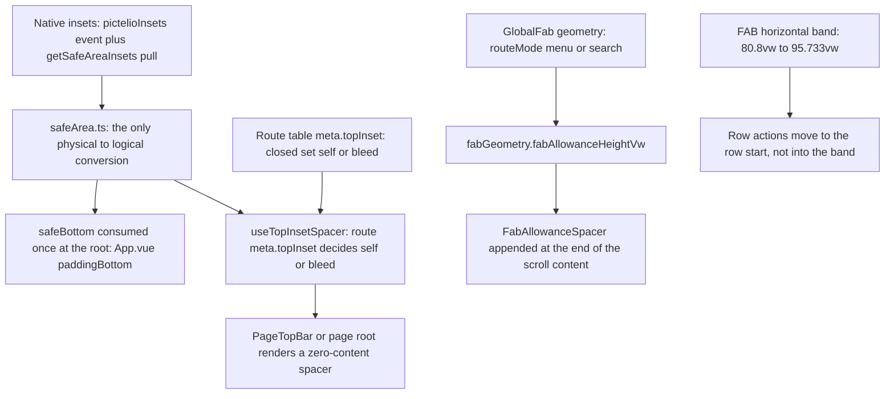
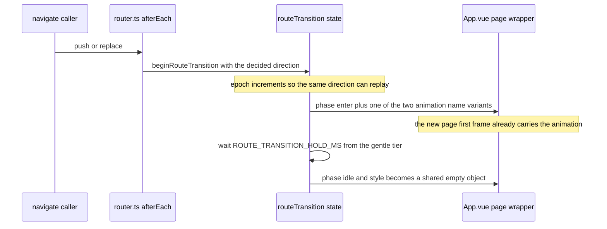

# Viewport Geometry, Insets & Motion Contract

This page owns two independent axes in `packages/app-lynx`:

1. **Who owns screen space.** Which layer consumes each known inset, which layer must *pay for* an overlay it drew itself, and where the geometry numbers live.
2. **How the UI moves.** Which durations/easings are legal, which element an entrance animation may bind to, what reduced motion turns off, and how navigation and hero transitions are sequenced.

They are separate contracts with separate gates. The rule that joins them is the repo's central distinction: **what the platform knows about, the platform inset solves; what the platform does not know about, we must make room for inside our own content.**

Space ownership: each platform-known inset is consumed once, and each app-drawn overlay is paid for at the end of scroll content.

## Unit Systems and the Content-Area Viewport

`vw` is the universal geometry unit: `100vw` is the viewport width, and any vertical quantity is expressed as the number of vw that equals its height. Vertical geometry for bottom-anchored overlays is derived from a *logical screen height in vw*.

Two unit boundaries must not be crossed:

- **`utils/safeArea.ts` is the only physical-pixel → logical-pixel conversion point.** Native `WindowInsetsCompat.getInsets()` reports physical px while Lynx `px` is logical px (= Android dp), so the value is divided by `SystemInfo.pixelRatio` exactly once, at subscription. Every downstream consumer (the root container, `useTopInsetSpacer`, the six bottom sheets) receives logical px and must not multiply or divide by density again. An earlier defect amplified every compensation by the density factor (72 physical px became 216 logical px) precisely because this conversion was missing; the machine proof that Lynx `1px` = 3 physical px on the reference device is recorded in the module header.
- **`utils/viewportGeometry.ts` is pure geometry; `utils/viewportSizeBridge.ts` owns the contract IO and sentinel decision.** The component only probes `NativeModules`, subscribes and stores a ref.

Insets arrive through a **subscribe-then-pull** channel: `initSafeArea()` first adds a `pictelioInsets` listener via `GlobalEventEmitter`, then calls `NativeModules.PictelioApp.getSafeAreaInsets` for the current value. Pull is the initial-value source because the first insets dispatch happens during view attach, before JS subscription — a pure push model always loses the first frame. A missing emitter or native module is a visible `console.warn`, never a silent zero (web-core preview is the expected zero case).

### The content-area size contract (ADR-0131)

The radial navigation FAB computes its bottom geometry from a *logical screen height in vw*, and the original implementation used `SystemInfo` (full-screen physical size). On the reference emulator that gave `vw = 177.78` while the actual LynxView rendering area was `720×1184` (`vw = 164.44`) — the content area is 96 px (48 dp) shorter because the gesture navigation bar inset is not part of it. The FAB was clipped to an arc and its hit target moved out of the content area.

The fix is an explicit cross-language contract:

- Native side: `LynxActivity` records the real LynxView content-area size (px) through an `OnLayoutChangeListener`, and `PictelioAppModule.getViewportSize(cb(w, h))` returns it. Before layout completes it returns the sentinel `-1, -1`.
- JS side: `subscribeViewportSize(nativeModules, apply)` registers the callback and applies the sentinel verdict — a non-finite or non-positive pair becomes `null`, which is how the consumer knows to fall back.
- `screenHeightVw(contentSize, systemInfo)` resolves in strict priority: **content area** `(h / w) × 100` → **`SystemInfo`** (physical / `pixelRatio`, with `pixelHeight` missing falling back to a 390×844 aspect) → **web-core fallback `216.4`**. Degrading to `SystemInfo` or to the fallback is a published part of the contract, not silent degradation.

The contract is deliberately one method plus one callback (no push channel and no new state), and because `getViewportSize` is typed in `rspeedy-env.d.ts`, any change to it must be made on both sides. The listener fires on first layout, which precedes bundle rendering, so the callback almost always carries a valid value; the `-1, -1` path only exists for the unlaid-out first query. `GlobalFab` queries once on mount; all its derived geometry (centre, scrim, outer and inner rings) is `computed`, so it recomputes when the callback lands.

## Top Inset: Per-Route Ownership

Top inset used to be compensated once by the root container's `paddingTop`. That made it structurally impossible for any page to draw content under the status bar, so ADR-0214 moved ownership down to the page and ADR-0216 removed the root's top half entirely.

**The declaration.** Every route carries a required `meta.topInset: TopInsetMode`. The vocabulary is closed at two values and lives in `utils/topInset.ts`:

| Mode | Meaning | Where used |
|---|---|---|
| `self` | The page renders its own zero-content spacer of height `safeTop` | 28 of the 29 route entries |
| `bleed` | Neither side yields: content is drawn under the status bar | Only the `discover` route, and only when the build macro says so |

A third mode `'root'` was **deleted**, not deprecated. Once the root compensation was removed it degraded to byte-for-byte "no yielding" — identical to `bleed` while looking nothing like it, so anyone writing `'root'` (natural, since it used to be the default) would push content under the status bar with compilation, unit tests and gates all green. `resolveTopInsetOwnership(mode, safeTop)` therefore normalises unknown modes to `'self'` **and warns once**; the failure direction is "does not yield" and must never silently become "bleed everything".

**The implementation.** `composables/useTopInsetSpacer()` is the single entry: it reads the current route's `meta.topInset` and `safeTop`, and returns the spacer height as a `ComputedRef<number>` (logical px). It deliberately makes no mode decision, defines no default and performs no fallback — the rule lives in `utils/topInset.ts`. Two consumption shapes exist: sixteen pages call `useTopInsetSpacer()` and render their own zero-content spacer, while thirteen pages render the shared `PageTopBar`, which renders the spacer *before* the visible bar row inside a single-column root (a `PageTopBar` page therefore gets its yield from the component rather than from its own markup). A page that declares `self` without rendering the spacer is invisible to the compiler, so a cross-language contract gate asserts that **declaration and implementation exist together** and names the offending route when either side is missing.

**Why a spacer and never parent padding.** Lynx's UA default is `border-box`, so padding eats content height, while the web-core preview does not replicate that default — the same utility string means different things in the two renderers. A zero-content element with an explicit inline height is identical in both.

**Home bleed is a build-time macro.** `router.ts` reads `__HOME_BLEED_HEADER__ ? 'bleed' : 'self'` at module scope, and the polarity's single source of truth is `homeBleedHeaderFlag.ts` (`PICTELIO_HOME_BLEED=0` is the escape hatch, tested with `!== '0'` rather than `=== '1'` so that a missing variable cannot silently revert the layout). Because it is a macro inlined at build time, a shipped APK cannot roll it back on device. Both paths run in CI as each other's existence proof.

## Bottom: Platform Safe Area vs App-Drawn Occlusion

The bottom of the screen holds two things of completely different nature, and conflating them is what makes "how much bottom whitespace" an unanswerable question:

| | Platform safe area | Bottom occlusion allowance |
|---|---|---|
| What it is | Area *taken* by the system navigation bar / gesture bar | Area covered by a floating control **we drew ourselves** |
| Does the platform know | Yes (real `WindowInsets` value) | No (an app-drawn layer is invisible to the inset pipeline) |
| Changes across devices | Yes (gesture bar vs three-button navigation) | No (derived from our own control geometry) |
| Who yields | The root container, once | The end of the scroll content, per scroll container |
| Value | `utils/safeArea.ts` `safeBottom` | `utils/fabGeometry.ts` `fabAllowanceHeightVw(mode)` |

`App.vue`'s `rootStyle` carries `paddingBottom: safeBottom + 'px'` and nothing top-related. This is single consumption: no parent-plus-child double inset. The six bottom sheets each additionally consume `safeBottom` for their own panel spacer, which is a different object rather than a second consumption of the same one.

The GlobalFab is an `absolute` zero-size anchor box with absolutely positioned children — it does not participate in flow, so no scroll container yields for it automatically. That is precisely the "app-drawn overlay" case the platform cannot know about, and the price is paid inside the content.

**There is no mode flag for the occlusion allowance.** `bottomInsetMode: 'self' | 'bleed'`-style options are explicitly rejected: the top has modes because bleeding is a *product choice*, whereas if a page has a FAB the last item must be able to scroll above it — inventing a "don't yield" mode would recreate exactly the silent-layout-breakage footgun that got `'root'` deleted.

### The allowance mechanism

`components/FabAllowanceSpacer.vue` is a zero-business, zero-content `<view>` whose height is computed from `fabAllowanceHeightVw(view.routeMode)`, and it is mounted at the **end of the scroll container**:

- inside `<list>`: appended as a trailing `full-span` `list-item` (the component only emits content, mirroring `FeedListFooter`, because a native `<list>` only accepts `list-item` children);
- inside `<scroll-view>`: appended as the last child.

Hard constraints, each of which has a failure mode that is invisible to the compiler:

- **It must not be folded into the existing footer `list-item`.** That footer is a three-state `v-if` (`loadingMore || pageErrorMsg || endOfFeed`); in the most common state — data present, not loading more, not at the end — the node does not exist at all, so the allowance would silently disappear on exactly the pages that need it.
- **It must not become parent padding, and must not go back to root `paddingBottom`.** Content cannot scroll past container padding, so an immersive page would start eating an unrelated blank band again.
- **It must not read a Tailwind `spacing` tier.** Tiers are compile-time constants while the FAB geometry is a JS constant, so they are not the same source and cannot follow each other; this was measured (changing `spacing.18` to 30vw left the allowance frozen) and the "same tier means it follows" attribution is a disproven old belief. The `spacing` tiers equal to the allowance height were deleted and a gate forbids their return.
- **It must not be conditional.** No `v-if`, no scroll-driven or overlay-driven visibility: it reads a route-derived tier only.
- **`item-key` must be stable and distinct** from neighbouring nodes, since native `<list>` uses it to detect change.

Appending a trailing `list-item` is the one safe structural operation on a waterfall `<list>`: ADR-0162 records insertion as **silently dropped**, removal as **leaving a gap** and replacement as **misaligning**, and a device spike verified that appending at the end falls outside all three.

### The two tiers

The allowance height is one function with a **required, defaultless** `mode` parameter:

| Tier | Pages | FAB bottom edge | Allowance height |
|---|---|---|---|
| `menu` | The 4 top-level tab pages | `4.267vw` | **19.2vw** (`FAB_EDGE_VW` + `FAB_SIZE_VW`) |
| `search` | Every other non-tab content page | `43.734vw` | **58.668vw** (`FAB_BOTTOM_SEARCH_VW` + `FAB_SIZE_VW`) |

`fabAllowanceHeightVw` is written as `mode === 'menu' ? low : high`, so `'search'` **and `'hidden'`** take the high tier. That is deliberate and load-bearing:

- **The failure directions are asymmetric.** Too small occludes content (the last item becomes untappable); too large only adds an invisible blank band, because the spacer is a zero-content transparent block. Non-`menu` therefore always takes the conservative side — including `hidden`, where the route name is unresolved or the page is a session page with no FAB.
- **`mode` has no default** because supplying one would make the choice for the caller, and choosing wrong is not symmetric. Making it required turns "which tier is this route's FAB" into a compile-time question, which is exactly what nine pages got wrong at once before the tier split.
- **The `hidden` degradation lives inside the function**, not at the call site. If `FabAllowanceSpacer` wrote its own `routeMode === 'menu' ? 'menu' : 'search'` ternary, that path would be guarded only by a textual criterion, and a mutant that hardcodes `'menu'` while keeping a dead `routeMode` read passes every assertion — restoring the full 39.467vw defect.

The tier is derived from the route, not from the FAB's runtime visibility: the spacer reads `globalFab.view.routeMode`. The distinction matters because `view.mode` folds in modal mutual exclusion (`hasOpenModal() → 'hidden'`), so following `mode` would make the allowance height jump and reflow the whole content the moment an overlay opens. This is anti-footgun as much as convenience: nine pages previously each decided 19.2vw themselves, which is the "every page judges, and misses" shape.

Changing the FAB's size or the search lift makes the allowance follow **only** because `GlobalFab.vue` and `FabAllowanceSpacer.vue` import the same JS constants. That is the whole mechanism — not a naming convention, not a tier.

Coverage is 17 pages (three root pages, nine list pages, four late-wired pages and `DownloadManager`, whose hand-written `h-[30vw]` was 310 px short). The gate reverse-looks-up pages from `router.ts` rather than holding a hand-maintained array, and names the specific page and the specific fix when a new unwired page appears.

## GlobalFab Geometry and the Occlusion Band

`utils/fabGeometry.ts` is the single source of truth for FAB geometry, because the allowance needs the same numbers the FAB uses:

- `FAB_SIZE_VW = 14.933` (56 dp) — the FAB body diameter;
- `FAB_EDGE_VW = 4.267` (16 dp) — the distance from the screen edge. It is **one name used twice**: `GlobalFab` calls it `FAB_RIGHT_VW` but also subtracts it as the bottom edge, so vertical clearance comes from the *bottom* edge and has nothing to do with the right edge. The two merely happen to be equal today; splitting them later must keep the allowance following the bottom edge only.
- `FAB_BOTTOM_SEARCH_VW = 43.734` — the search-mode bottom edge, lifted so the search FAB cannot cover the paginated menu's panel top at 42.667vw (which would swallow taps on the "refresh" pill).

The FAB is positioned by `fabCx = 100 - FAB_EDGE_VW - FAB_SIZE_VW/2` with `translate(-50%, -50%)` against a `(0,0)` zero-size anchor, never by `right`/`bottom`: native LynxView resolves `absolute` positioning against the nearest `view` ancestor rather than the viewport, so edge-relative positioning in a non-fullscreen parent resolves wrong and the FAB disappears.

### The horizontal band

The FAB's horizontal projection is `[FAB_BAND_LEFT_VW, FAB_BAND_RIGHT_VW]` = `[80.8, 95.733]vw`, and both edges **derive from the same two constants** rather than being third literals. Two properties matter:

1. **The band is independent of the route tier.** The two boundaries are plain constants with no `mode` parameter, and `routeMode` only changes the FAB's `top`, so both tiers have byte-identical horizontal bands. "Only search-tier pages collide" is an illusion: `menu`-tier pages are exposed identically, just with a lower FAB whose 19.2vw allowance happens to protect the last item.
2. **The band width is the FAB body, not body plus edge.** The right edge is the *gap* between FAB and screen edge and is not part of the projection; measured band width on device was 161 px = 14.907vw against a body of 14.933vw. Counting the edge would give 19.2vw and would make an "action already clears the band" criterion falsely green.

Because native LynxView does not recognise `pointer-events` (and hit-testing takes the topmost element, with the FAB always above), an interactive element inside the band is **deterministically** stolen by the FAB — not "hard to tap", but 100% of the time. The stated property is therefore "**the row's tail is not interactive**", which survives the FAB moving, hiding or collapsing, rather than "the element is close to the FAB". ADR-0221's decision is that in-row actions live at the **row start** as a 40 dp round icon button: horizontal allowance (13.9vw permanently lost per row, plus forced title wrapping) and FAB-collapse-on-scroll were both prototyped and rejected. The fix covered four sites with destructive actions; the remaining in-band sites are registered as tracked debt rather than fixed, and the gate does not scan the whole repository.

Vertical and horizontal are orthogonal axes: `FabAllowanceSpacer` guarantees the *last item* can scroll above the FAB, and it does nothing for a row in the middle whose tail sits in the band.

## Immersive Media and Chrome Mode

Immersive viewing is a **conjunction**: in-app chrome hidden (frontend) *and* system bars hidden (native + insets pipeline). Only the first still leaves the page "flush but not immersive", because hiding the system bars is what makes `safeTop`/`safeBottom` go to zero — and therefore what makes the content genuinely edge-to-edge.

- **State ownership.** `composables/useImmersiveChrome.ts` keeps `chromeHidden` as a *page-local* ref (a viewing state, not shared data, so not in Pinia) plus a module-level **single ownership token** holding the current owner's release action. A new owner forces the previous owner's idempotent release before taking over, which closes the "A enters immersive → push B → pop back → A already unmounted but the flag is still true" leak class. `chromeSuppressed` — the flag global chrome reads — is **derived from the token**, never a second boolean that must be kept in sync.
- **No auto-hide timer.** Toggling is manual only, so "timer not cleared" is structurally impossible; the price is that recovery depends on a click gesture, which is why the exit paths below are guaranteed.
- **Overlay priority.** `openOverlay(open)` is the single composite for comments / page picker / bookmark panel: exit immersive first, then open. Overlay components do not sense immersive state in reverse.
- **Release order.** `IllustDetail.vue` holds one idempotent exit, `releaseImmersive()`: `exit()` first (clears chrome and hands back ownership), then `onImmersiveExit()` (system bars fall back to the user's setting). The order *is* the semantics. It is wired to `onBeforeUnmount` (L2) and to a back guard that returns `false` (L3) so that the guard decides **before** the history stack pops and the previous page never renders a "no system bars" frame. The code-review finding that drove this: `useImmersiveChrome`'s own `onUnmounted` never touched the system bars, so leaving the page via back left them hidden.
- **System bars fall back to the user's own setting.** `useImmersiveSystemBars.onImmersiveExit()` applies `settingsStore.fullscreenMode`, never a hard-coded `false`, because hard-coding it would silently overwrite a user's global preference once for looking at a picture. The immersive path **never writes the persistence key**: writing it would drop the user into a chrome-less, unclickable app on next cold start. Native recovery from process death is driven by the persisted key in `LynxActivity.onCreate` and does not depend on JS.
- **Cinema backdrop.** `utils/immersiveBackdrop.ts` returns `bg-black` while immersive and `bg-surface` otherwise, using a literal `bg-black` on purpose: MD3's `surface*` family is light, and a square artwork in portrait inevitably exposes page background below the image. Stretching distorts and cropping discards the user's drawing, so the exposed area becomes a deliberate cinema letterbox.
- **Accessibility.** Image containers carry a **dynamic** `accessibility-label` ("enter / exit immersive", plus "image n of N" in the multi-image branch, since the visible badge is hidden). The dynamic interpolation binding was verified on device by reading the a11y tree in both states, and the multi-image branch supplies the position information that would otherwise be lost from both the visual and the spoken channel.

Two platform facts registered here: `accessibility-traits` swallows `content-desc` on the same element and is a **net regression**, not a fix; and `clickable="false"` on a `<view>` with a `@tap` handler is a red herring that does not block TalkBack activation.

## The Motion Contract (Rules, Not a Catalogue of Animations)

### Rule 1 — one entry point, and only tokens inside it

`composables/motion.ts` is the only place animation durations and curves are obtained. Components must not contain duration or easing literals in either the duration slot or the timing-function slot. The tiers are the existing token values, and `motion.ts` adds no token:

| Duration key | Token | ms | Default use |
|---|---|---|---|
| `fast` | `--durationFast` | 150 | press/state layer; sheet exit |
| `normal` | `--durationNormal` | 200 | switch track |
| `medium` | `--durationMedium1` | 250 | sheet enter; list item rise |
| `gentle` | `--durationGentle` | 300 | route transition |
| `longer` | `--durationMedium3` | 350 | one-shot (ring retract) |
| `loop` | `--durationExtraLong4` | 1000 | cyclic (shimmer, spinner) |

| Easing key | Token | Curve | Semantics |
|---|---|---|---|
| `standard` | `--motion-standard` | `(0.2, 0, 0, 1)` | standard in/out; press feedback |
| `emphasized` | `--motion-emphasized` | `(0.2, 0, 0, 1)` | same value as `standard` **officially** — not a typo to fix |
| `accelerate` | `--motion-emphasized-accelerate` | `(0.3, 0, 0.8, 0.15)` | exit semantics |
| `decelerate` | `--motion-emphasized-decelerate` | `(0.05, 0.7, 0.1, 1)` | enter semantics (decelerating into place) |

`MOTION_DURATION_MS` is a numeric mirror of the same tokens, needed only where JS requires a number (the two-phase exit timer, `animation-delay`). It is not a second source of truth: the contract gate parses `tokens.css` at run time and compares tier by tier, so a token change with a stale mirror turns red immediately.

### Rule 2 — the class form and the inline-style form are not interchangeable

The engine's actual transition coverage decides this: `.transition-colors` covers `background-color`, `border-color` and `color` — **not `opacity`, not `box-shadow`**. `.transition-opacity` / `-shadow` / `-transform` / `-all` produce zero rules in the artifact, and "zero rules" cannot distinguish "nobody wrote it" from "the engine does not support it". So:

- colour / border / text colour state layers → the literal class registry (`MOTION_CLASS`);
- `opacity`, `width` / `height`, `transform` → inline `:style` values;
- one-shot entrance / exit / cyclic → `@keyframes` inside a `<style>` block plus an `animation` shorthand.

Attaching `transition-colors` while expecting `opacity` to animate is a **silent failure**, and the press-state-layer gate checks the *carrier*, not merely the presence of a transition.

Shadow-expressed press states get **no** transition: neither verified carrier covers `box-shadow`, so this is a registered failure surface rather than a bet on an unverified path. Their colour feedback is unaffected because a pressed state layer sits alongside on the same element.

### Rule 3 — class names must appear as literals

Tailwind's content scan includes `**/*.ts`, so a literal class string inside `motion.ts` is found. A class name assembled at run time (`duration-[${x}]`) is not scanned: **zero rules in the artifact, zero motion at render, and no build-time signal whatsoever.** Therefore the class shape is a literal registry keyed by tier name, and anything parameterised by data (the stagger delay) goes through an inline `:style` value instead.

### Rule 4 — `transform` / `scale` / `translate` / `rotate` utilities are dead class names

They really do produce CSS rules. Those rules reference nine `--tw-*` variables that are never defined anywhere in the repository (the preset does not emit a base/preflight layer), so per the CSS spec the declaration is invalid at computed-value time and `transform` falls back to `none`. This is the third failure class — build passes, types pass, unit tests pass, the artifact contains rules, and only a device shows the empty render. The operational criterion is one sentence: **does every `var()` in this declaration resolve?** Transform itself is supported — a `@keyframes` body in the artifact contains `translateY(12px) scale(.92)` — so writing transform inside `@keyframes` or as an inline value is fine; the dead path is the utility class route. `hover-class` sits in the same family: the attribute silently does nothing.

### Rule 5 — four presets, and the exit timer is sourced from the same tier

`motion.ts` exports entry / exit / press / stagger, and `useMotion()` binds them to the reduced-motion state as `computed` values (a snapshot at setup would hand callers a stale preset after a runtime preference toggle).

The design pivot is that **Lynx has no `transitionend`**, so an exit cannot be event-driven. The exit preset carries an explicit `holdMs` for the "play the exit animation, then unmount" protocol, and that timer **must come from the same duration tier as the animation** — including going to zero together when reduced motion is on, otherwise closing a sheet leaves a visible stretch where the animation has stopped but the scrim is still sitting there. The known cost is that a sheet occupies space and does not respond to scrolling for the duration of its exit; the shortest tier was chosen for exit partially to shrink that window.

### Rule 6 — the entrance animation may not change whether content exists

This is the strongest rule on the page, and it was written after a real incident.

Every list-item entrance goes through `listItemStyle(index)`, which is the only outlet — the shared list base and the hand-written list pages all consume it, so no consumer has any route to write its own delay. The keyframe body it references has a hard visibility contract (`LIST_ITEM_VISIBILITY_CONTRACT = 'from-visible'`):

**The `from` state must be visible.** No `opacity: 0`, no `visibility: hidden`, no `display: none` — and no "almost invisible" compromise like `opacity: 0.001`, which still yields an empty card when the animation does not play.

The mechanism: the animation shorthand's trailing slot is `fill-mode: both`, which fills the element with the `from` state **before the animation starts and after it ends**. The engine does *not* start entrance animations on **cold-mounted static sibling** nodes (only patch-inserted `v-for` rows animate). So on those nodes the `from` state is simply retained forever: the element holds its place but renders invisible — no log, no error, all unit tests green. In the incident, only `Me.vue` — the one consumer that bound the style to a static sibling instead of a `v-for` row — had an entire settings section permanently invisible while every other consumer looked correct. Because that failure was intermittent, a single screenshot could not prove or disprove it; repeat sampling plus an edge-density criterion (brightness difference against the neighbouring pixel, which works in both light and dark themes, unlike absolute dark-pixel counting) was required.

Two consequences to preserve: **changing `both` to `none` alone does not fix it** (verified on device — the content still does not appear), so the `from` state itself must be harmless; and the accepted cost is that **entrance loses its fade** and keeps only translate/scale. The one-sentence form of the contract is: *motion may change how content appears, never whether it appears.* The gate can only pin the statically decidable half (the keyframe body source); whether the animation actually played is device-only.

The same two Lynx node semantics govern the trailing allowance: waterfall `list-item` **insertion is silently dropped, removal leaves a gap, replacement misaligns** — which is why the only structural operation this codebase performs on such a list is appending at the end.

### Rule 7 — reduced motion is a gate with three named rules, from one fact source

`composables/useReducedMotion.ts` is the only preference source; components may not build their own `matchMedia`. `motion.ts` bundles it into `useMotion()` so four presets share one gate.

| Rule | Covers | Reduced behaviour |
|---|---|---|
| **R1** transition | state layers, scrim fade, panel slide | the whole `transition` declaration becomes `none`; the Tailwind form is *not attaching* the classes at all (attaching a 0ms duration is a tautology) — state changes are instant |
| **R2** keyframes | sheet/list entrance, **including `infinite` cyclic animations** (shimmer, spinner) | the whole `animation` declaration becomes `none`; cyclic animations must stop, not slow down |
| **R3** spring and stagger | press-follow scale, bouncy feedback, per-item stagger delay | the motion is **not generated at all** — no animation node, no geometry change, stagger delay always 0; vestibular response scales with displacement, so shortening the duration is not a mitigation |

Two increments are part of the contract: under R1 the exit timer **must** zero out in lockstep (otherwise the "animation stopped but the scrim lingers" window opens), and under R3 the inline press transform returns `none` rather than merely losing its transition.

Degradation is explicit, never silent: an environment with no `matchMedia` is treated as "preference not enabled" **with a `console.warn`** naming the module, rather than pretending the preference was honoured; a `MediaQueryList` without `addEventListener` reads once at mount and warns that runtime toggling will not apply. If a component's immersive toggle is a `v-if` switch it has no transition classes at all, which is a stronger R1 form than conditionally attaching them — so `useImmersiveChrome` deliberately does **not** consume `useReducedMotion`; reading it there would create an interface that always returns an empty string.

### Rule 8 — route transitions are built at the navigation site, and back is a deliberate reduction

Lynx has no router transition support (vue-router's `<Transition>` and `transition` config do nothing), so direction and phase are held by `composables/routeTransition.ts`, written by `router.ts` and consumed by `App.vue`'s single page wrapper — no per-page edits, and existing `navigate()` / `goBack()` call sites are unchanged.

- **Direction is decided by a pure function.** `decideRouteDirection({ replace, declared })` returns `'none'` when `replace === true` (login/logout/first route/deep link/tab switch — otherwise a deep link would visibly slide) and otherwise the declared direction, defaulting to `'forward'`.
- **Timing is why the direction is written in `afterEach`.** vue-router sets `currentRoute` and triggers `afterEach` inside the same callback, *before* Vue's render flush is queued. Writing the direction from `afterEach` means the new page's **first frame** already carries the animation: no frame of un-animated new page, and no frame where the old page moves with the new direction. Writing it synchronously inside `navigate()` would degenerate into "old page slides a little, then hard-cut".
- **Replay needs name variants.** Each direction has two keyframe names with the same body (`route-forward-in` / `route-forward-in-alt`), because the same `animation-name` does not replay on the same element — the same rename-to-replay form used by the sheet dismiss protocol.
- **Duration and easing:** `ROUTE_TRANSITION_DURATION = 'gentle'` (300 ms, the M3 shared-axis X tier) with `decelerate`; `ROUTE_TRANSITION_HOLD_MS` is the numeric mirror of the *same* tier, and the `enter → idle` phase change removes the `animation` declaration so no `transform` residue is left behind (a residue would keep making the wrapper the containing block for `position: absolute` descendants).
- **Idle and reduced states bind a shared empty object**, so nothing is ever mounted on the element — the strongest form of "do not attach a transition class", and it also keeps the computed's value identity stable.
- **The two directions are deliberately asymmetric:** forward slides in from the right with a light fade, back slides in from the left **without** fade. Symmetry would make the two keyframes the same animation run forwards and backwards, which is explicitly unacceptable. The gate asserts the asymmetry so a future "symmetry is correctness" edit turns red.
- **Back is a capability reduction, registered as such.** Lynx cannot do "old page waits for new page to exit" (no `transitionend`, and two live pages are expensive), and vue-router replacement is hard — the old page is already gone before the animation starts. So `back` gives **only the re-entering page** a slide-in; the old page never slides out, and the exposed side shows the root `surface` colour during the slide.

The device evidence for this contract is a sign test on the same anchor: forward displacement was positive and back negative (symbol-opposite), with `replace` navigations showing zero displacement across the whole window — which simultaneously proves the criterion has discriminating power.

Route transition timing: direction is written before the render flush, so the new page's first frame is already animated and the stop timer is sourced from the same duration tier as the animation.

### Rule 9 — hero transitions interpolate the layout box, and degrade is a correctness requirement

`composables/heroTransition.ts` is the only implementation; pages only wire it. It is self-built because Lynx has no shared-element primitive, and it is built on `measureRects` (`SelectorQuery`), which is verified on both sides.

- **Interpolate the box, never `transform: scale()`.** Thumbnail and hero have different aspect ratios; scaling already aspect-filled bitmap content stretches it (forbidden). Animating `width`/`height` re-crops every frame inside `<image mode="aspectFill">`, so the ratio difference is absorbed by the crop window, not by a transform.
- **Only `transform` / `width` / `height` are animated** — the three channels the module declares as already evidenced in production. `left` / `top` are never transitioned: the overlay is statically placed at the origin and moved with `translate(dx, dy)`. The repo's discipline is that an unverified path is either evidenced first or not used.
- **Two-beat start plus a same-source timer.** CSS transitions need the start value laid out before the end value arrives; there is no `getComputedStyle` here to force a reflow, so two rAF beats commit the `from` state then switch to the `to` state. Because the `from` state exactly covers the tapped thumbnail, the extra frame or two reads as continuous.
- **Degradation is mandatory, not an optimisation** — a blank rectangle growing on screen looks far worse than a plain slide. There are ten named reasons (`no-source`, `id-mismatch`, `stale-generation`, `measure-failed`, `deadline`, `reduced-motion`, `not-cached`, `no-source-image`, `invalid-rect`, `cancelled`), each with observable behaviour and each logged with a module prefix (no silent degradation). Measurement failures, out-of-viewport rects and horizontally off-screen carousel items are all rejected as interpolation endpoints.
- **Per-page capability difference is derived, not hard-coded.** Whether the return direction is available is decided by asking Vue's own lifecycle: `onDeactivated` firing means the list instance was deactivated rather than destroyed, so the original image still exists. A page outside the `KeepAlive` include list automatically has "continuity forward, plain transition back" — a necessary consequence of the platform and architecture, registered as a reduction rather than papered over.

## Verification Discipline

The device-facing verification for this page is two scripts, and they are **isomorphic but not the same question**: one measures geometry and one measures colour. Geometry being green and "you cannot read it" can hold at the same time.

| Script | Answers | Applies to |
|---|---|---|
| `packages/app-lynx/scripts/verify-top-inset.mjs` | is the top inset correct? (amplitude in physical px) | routes declared `self` (a bar exists to measure) |
| `packages/app-lynx/scripts/verify-statusbar-contrast.mjs` | can you read the status bar text? (WCAG ratio) | routes declared `bleed` (no bar, scrim present) |

Both emit three non-equivalent verdicts with exit codes `0` PASS / `1` FAIL / `2` REJECT. **REJECT means the criterion cannot answer on this sample** — it is neither a pass nor a defect. Reading REJECT as a pass is optimistic (missed report); reading it as a defect is pessimistic (false alarm). The amplitude script refuses pages with no title bar by *route declaration* first (a spec-level fact from the built artifact, not from re-deriving `process.env`), then by two flat-surface measures, then by "implied inset ≤ 0" — **the order is the cost**, because a single measure has known blind spots (row-wise horizontal uniformity is exactly 1.000 for a vertical gradient cover, so that measure alone lets an entire family through).

The rest of the discipline, briefly:

- **Worst end.** The status-bar band is sampled for both the darkest and the lightest base colour and the verdict is taken on the **worse** of the two; polarity is fixed by the native appearance contract, so reporting the minimum is the honest form rather than picking whichever end passes.
- **Self-proving red.** Every new gate must be shown to turn red by injecting the defect (wrong polarity, reversed field order, changed constant, disabled branch). A gate that can only stay green is decoration.
- **The seam is its own object.** The Python metric scripts and the JS verdict functions are boundary-adjacent; the parse itself (`parseMetricsOutput`) was once entirely uncovered, and a field-order mistake silently bypassed two gate layers while all tests were green. It is now pinned by `metricsParse.test.ts`, including a ratio-must-be-in-`[0, 1]` value-domain invariant that is robust to reordering.
- **Registered blind spots are data, not comments.** `topInsetVerdict.mjs` exports `KNOWN_BLIND_SPOTS` (currently: a full-screen flat light background is statistically identical to a light title bar). The gate asserts each field is present and non-empty, a fixture drives the measured behaviour, and the script's REJECT message **consumes** the registration — so deleting the registration changes the operator's output.
- **Delete-or-register, never "tune the threshold".** That blind spot cannot be separated by a third colour signal, and adding one would only look more complete while having zero discriminating power.

Local gates that police this page (the full inventory, plus how they run, is on [Testing Strategy](../testing/overview.md)): `topInsetVerdict.test.ts` and `topInsetMetrics.test.ts` (synthetic fixtures for the three-layer judgement), `statusBarContrast.test.ts` (discriminating power with a mutation comparison), `fabGeometry.test.ts` (numeric oracle for both tiers and the band), `fabOcclusionBand.test.ts` (the four fixed row-start sites plus tracked in-band debt), `bottomOcclusionAllowance.test.ts` (spacer shape, wiring and the `router.ts` reverse lookup), `motionContract.test.ts` (M1–M6: single entry, no literals, no dead transform classes, `on-primary` stays in `.vue`, `.ts` consumption face), `entranceVisibility.test.ts`, `routeTransitionGate.test.ts`, `listItemStaggerContract.test.ts`, `heroTransitionOverlay.test.ts` / `heroTransitionWiring.test.ts`, `immersiveScrimContrast.test.ts` (AA 4.5 lower bound plus a positive control proving the criterion can go red), and `pressStateLayerTransition.test.ts`.

## Invariants to Preserve When Changing This Area

| If you change… | You must also… |
|---|---|
| `meta.topInset` for a route | render (or remove) the matching zero-content spacer — declaration and implementation are asserted together |
| anything about the FAB's size, edge or search lift | change it only in `utils/fabGeometry.ts`; `GlobalFab` and `FabAllowanceSpacer` follow because they import the same constants |
| a route's FAB tier | nothing at the call site — the tier is route-derived and `mode` is required precisely so a new call site has to think about it |
| list structure in a waterfall `<list>` | append only; insertion is silently dropped and replacement misaligns |
| anything about motion timing | change the token or the preset in `motion.ts`; components may not carry duration or curve literals |
| a `@keyframes` entrance body | keep the `from` state visible; motion may not decide whether content exists |
| the exit path of an immersive-capable page | release in order (`exit()` then system-bars fallback) on both the unmount and back-guard paths, and never write the fullscreen persistence key |
| a device-facing criterion | keep it self-proving red, keep `REJECT ≠ PASS`, and register what it cannot see |

Related pages: [MD3 Design System & Token Contract](md3-design-system.md) (where the duration and easing tokens come from), [App Shell & Navigation](../architecture/app-shell-and-navigation.md) (routing, tab structure, the FAB as navigation), [Feed & Browsing](../domain/feed-and-browsing.md) and [Continue Reading & History](../domain/continue-reading-and-history.md) (the list surfaces where the allowance and the occlusion band are consumed), [Testing Strategy](../testing/overview.md).
