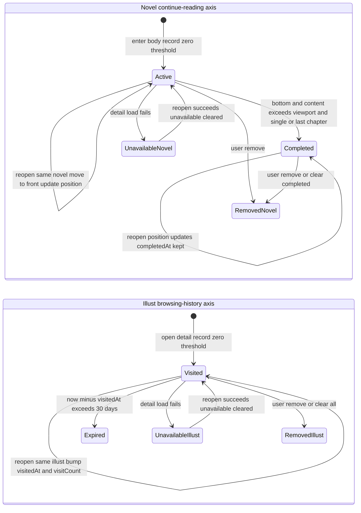

# Continue Reading & Browsing History

This page documents the "Continue Reading" surface (ADR-0219): the third segment of the
Shelf page (`/shelf`) plus the full-list page `/continue`. That one surface carries two
**physically disjoint** local datasets that are presented together as a single list:

- **Illust browsing history** — a *behavior log* of every illust detail page opened,
  with a 30-day expiry, an access counter, and no notion of "finished".
- **Novel continue reading** — a list of *unfinished items* that records the
  chapter-level reading position of each novel, with no expiry and a soft-delete
  "completed" state.

The two axes are implemented by two separate Pinia stores —
`stores/browsingHistoryStore.ts` and `stores/continueReadingStore.ts` — are merged
for display only by the pure aggregation layer `primitives/continueEntries.ts`, and are
rendered by one shared row component, `components/ContinueRow.vue`.

## Why two axes share one segment and one route

The design deliberately keeps the Shelf at **three** segments (bookmarks / watch-later /
continue-reading) and gives both axes a single `/continue` route rather than a separate
`/history` page or a fourth segment. Two facts make the merge safe:

1. **The axes are disjoint by work type.** Browsing history records only illusts
   (`illustId`), continue reading records only novels (`novelId`). Opening a novel never
   writes into the history store and opening an illust never writes into the
   continue-reading store, so there is zero dedup logic and zero overlapping data.
2. **The lifecycle difference is invisible to the user.** Expired history entries simply
   leave the list; the user never sees an "expired" state. The only per-row distinction
   that matters in the UI is the presence or absence of the chapter label, which is a
   per-row concern, not a reason to split the segment.

This is a display aggregation, not a data merge: `primitives/continueEntries.ts` imports
no store and only maps two arrays of snapshots into one row view model.

> **Correction note (2026-10-05).** The old WebView client's `historyStore` was removed
> with ADR-0203. ADR-0219 originally recorded "not rebuilt" for browsing history; that was
> later corrected: browsing history **is** rebuilt under the Lynx engine as
> `stores/browsingHistoryStore.ts`. What is rebuilt is the *concept* (illust-side only),
> not the old TanStack DB implementation from ADR-0094.

## The two stores at a glance

| Aspect | Browsing history (illust) | Continue reading (novel) |
|---|---|---|
| Nature | Behavior log | Unfinished item |
| Entry key | `illustId` | `novelId` |
| Persistence key | `browsing_history_${uid}` | `continue_reading_${uid}` |
| Expiry | 30 days (boundary inclusive) | None |
| Capacity | 300, drop oldest + warn | 200, drop oldest + warn |
| Completion state | None | `completedAt` soft-delete |
| Counter | `visitCount` (reopen = +1) | None |
| Position | None | `chapterNo` / `chapterTotal` (display-derived) |

Both stores persist through the `settingsStore` `prefs()` PrefsStorage seam (native
`PictelioPrefs` / web-core `idbKV`), the same seam used by watch-later. Neither key is in
the WebDAV backup domain (`ACCOUNT_KEY_PREFIXES` only covers the three R18/AI settings
keys), so neither axis migrates with backups.

Both stores are also **pre-warmed at router bootstrap**: `router.ts` fires
`void useContinueReadingStore().hydrate()` and `void useBrowsingHistoryStore().hydrate()`
right after the token/settings restore, unawaited. Without that, a cold deep link to
`/continue` or `/shelf` would render a genuinely empty first frame — the store-local
`ready` flags (below) are what let the pages tell "not yet known" apart from "nothing".

## Recording: zero-threshold, session-last position

Both axes record on **open, with zero threshold** — no dwell-time or scroll-percentage
gate, because the only observable signals in this stack are "which work was opened" and
"did it reach the bottom".

- **Illust side** (`IllustDetail.vue`): after a successful detail load,
  `historyStore.record(toIllustHistorySnapshot(res.illust))` is called. Reopening the
  same illust does not add a new entry; it bumps `visitCount`, updates `visitedAt`, and
  moves the entry to the front.
- **Novel side** (`NovelDetail.vue`): entering the body immediately calls
  `continueStore.record(toNovelContinueSnapshot(...))` from already-fetched detail data
  (zero new network). The chapter coordinates (`chapterNo` / `chapterTotal`) are then
  back-filled from the series detail response without blocking rendering; if the chapter
  is outside the first page of the series response, the coordinate is left unknown, the
  label simply does not render, and the page warns once.

The novel position uses **session-end semantics**: a re-record of the same `novelId`
updates the position and moves it to the front instead of appending, and the position may
be *rewound* (re-reading chapter 21 then reopening returns you to chapter 21). This is a
deliberate departure from Kindle's monotonic "furthest page read" and Mihon's "oldest
unread" rules — those exist to arbitrate cross-device conflicts, which a local
single-device client does not have. The re-read scenario is therefore correct.

Keeping the position at **chapter granularity** is a platform constraint rather than a
preference: `main-thread-bindscroll` is not confirmed to dispatch in this build, so
paragraph-level progress is not observable. That is why the completion decision (next
section) has no dwell-time or scroll-percentage input either.

## Completion: soft-delete, not removal

Completion applies only to the novel axis. `decideNovelCompletion` returns true only when
**all** of the following hold:

- `reachedBottom` is true (the `@scrolltolower` signal fired), and
- `contentExceedsViewport` is true (see below), and
- either the novel has no series (`seriesId == null` — single novels are the common
  Pixiv case and must be completable), **or** `chapterNo === chapterTotal` (the last
  chapter of a series).

An intermediate chapter of a series never completes, and missing coordinates always mean
"not completed" — the conservative side, because the cost of a wrong completion
(soft-deleting a book off the user's shelf) is asymmetric with the cost of a missed one
(the entry lingers and self-heals on the next bottom event).

**No dwell-time and no scroll-percentage threshold is ever introduced.** The only
observable signals are "opened which work" and "reached the bottom"; a source-level guard
in `continueReadingCompletion.test.ts` forbids the completion input interface from ever
gaining a dwell/elapsed/scroll-percent/progress field. The comparison that *is* used
(content height vs. viewport height) measures an objective quantity rather than picking a
number, and the ADR records why the arbitrary-threshold alternative was rejected.

When the decision is true, `markCompleted(novelId)` sets `completedAt` on the entry but
**does not delete it**. The store exposes the entry as two complementary computed
collections — `active` (no `completedAt`) for the main list, and `completed` (has
`completedAt`) for the `/continue` "finished" group. Completing keeps the entry visible
and clearable; hard-deleting it would give a re-read no re-entry point and would silently
discard user data.

Because Pixiv treats "one chapter" as "one novel", reading a 12-chapter series produces 12
entries. Completing only the last chapter would strand the other 11 as "in progress", so
`decideSeriesSweepIds` computes a cascade target set: all already-recorded entries with the
same `seriesId`, a `chapterNo < N`, and no `completedAt` are marked complete together with
the final chapter (the seed entry itself is excluded, and swept entries share the seed's
`completedAt` rather than refreshing it). The `<` (not `<=`) pins the rule to the
already-read range, and the sweep is only reached from the last-chapter decision
(intermediate chapters never call `markCompleted`).

Reopening a completed work does **not** revive it: `record` deliberately preserves the
existing `completedAt` while still updating the position. This closes the loop
*session-end position → completed-but-still-updates → re-read correct*.

### When the decision is evaluated

`decideNovelCompletion` is evaluated **idempotently from three points**, because both of
its async inputs can land after the user has already reached the bottom:

- the `@scrolltolower` handler (`onNovelToBottom`),
- the background chapter-coordinate response in `recordContinueReading` (coordinates are
  fetched without blocking render, so a bottom event can precede them),
- and a re-pulled native content-area size (rotation / split screen).

The viewport is re-pulled before each evaluation because the native content-area contract
is a one-shot query with no push channel. `markCompleted` is a no-op for an
already-completed entry, which keeps the repeated evaluations safe. All of
`reachedBottom`, `chapterPosition` and the warn-dedup flags are reset on every reload
(`loadNovel`), so a chapter-to-chapter jump inside the same component instance cannot
judge the new chapter with the previous chapter's coordinates.

### The content-height > viewport precondition

The most surprising completion rule is that "reached bottom" alone is insufficient. When a
single-screen novel fits in one viewport, the native `<list>` starts at its bottom edge and
`@scrolltolower` fires on the first frame — a geometric inevitability, not user behavior —
which would soft-delete an unread work. The fix is an objective precondition: the body
content height must be **strictly greater** than the viewport height.

`primitives/novelContentFitsViewport.ts` computes this with `resolveNovelContentGeometry`,
converting both heights to the `@375` design-px base (`viewportHeightDesignPx`) before
comparing. When the viewport height cannot be truly measured (no content-area contract and
no `SystemInfo`), it returns the conservative `contentExceedsViewport = false` and the
caller warns once — mis-completing would soft-delete a book from the user's shelf, whereas
missing a completion only leaves the entry a little longer and self-heals on the next
bottom event.

## Presentation: Shelf segment 3 and the `/continue` page

- **`pages/Shelf.vue`** renders segment 3 with `mergeContinueEntries(continueStore.active,
  historyStore.items)` sliced to a 3-row preview (`PREVIEW_N = 3`, same as segments 1/2),
  plus a "view all" link to `/continue` shown only once the preview is non-empty and no
  longer loading.
- **`pages/ContinueReading.vue`** renders the full merged list (same aggregation function,
  no shape drift) plus a separate "finished" group from
  `mergeContinueEntries(continueStore.completed, [])` — novels only, since illust history
  has no completed state. The group has its own header row and its own i18n key.
- **`primitives/continueEntries.ts`** produces the shared row view model (`ContinueEntry`):
  sorted by recent activity descending (`lastOpenedAt` for novels, `visitedAt` for
  illusts), with a type prefix in the list key (`n-${novelId}` / `h-${illustId}`) so the
  two independent id spaces cannot collide in the native `<list>`, and a fixed novel-first
  tiebreak so equal timestamps do not depend on which axis hydrated first.
- **`components/ContinueRow.vue`** renders each row; see the next section for its shape
  and its single-item action.

Readiness gating differs slightly between the two pages, and both spellings exist for a
reason:

- `/continue` uses the stores' own flags: `settled = continueStore.ready &&
  historyStore.ready`, and its skeleton and empty state additionally require *both* the
  main list and the finished group to be empty (a user whose only entries are finished
  novels must not be told "you have nothing").
- `Shelf.vue` instead drives a local `continueLoading` flag that it clears only once
  **both** axes' `hydrate()` promises settle, and keys both the skeleton and the empty
  state off the merged list length — never off the novel axis alone.

Both pages also gate their empty state on the *merged* list, and the clear bar (below) is
independent of both.

## The shared row and its single-item action

`components/ContinueRow.vue` is the **only** row renderer for both surfaces, so the two
cannot drift in shape. It takes the aggregated `ContinueEntry` (it knows no store) plus two
optional props:

- `detailed` — set only by `pages/ContinueReading.vue`. It is the **only gate** for the
  single-item remove affordance, so the Shelf's 3-row preview renders rows with no removal
  action at all.
- `thumbId` — the hero-transition anchor id, forwarded to `SkeletonImage`.

The two axes are distinguished inside the row by **the presence or absence of the
"上次读到 第N话" status line plus a type badge** — deliberately not by segmenting:

- The chapter line renders only when `entry.chapterNo !== null`, i.e. only for novels with
  computable coordinates; the aggregation layer hard-codes `chapterNo: null` for illust
  entries, so an illust row can never show a reading position. It is also suppressed when
  the entry is marked unavailable.
- The type badge (`continue.badge.novel` / `continue.badge.illust`) is what separates the
  two kinds for entries without a status line. Because the whole row carries a single
  accessibility label, the badge text is interpolated *into* that label — otherwise a
  screen-reader user would have no way to tell "reading" from "browsed".

**Restricted and unavailable presentation is decided locally, with zero network.** Each
snapshot stores `xRestrict`, so the row computes `restricted = entry.xRestrict > 0`
without any request:

- Restricted rows keep title and author and their remove entry, but the cover slot is
  replaced by an in-flow `RestrictOverlay` badge block (`overlay: false`) on a scrim — the
  single source of truth for that badge, sized for the compact row instead of the
  40vw `RestrictedNovelCard`.
- Unavailable rows render an explicit `continue.unavailable` text label instead of being
  hidden.
- `openable = !restricted && !unavailable`: a restricted or unavailable row does not
  navigate, its accessibility label states the reason instead of promising an "open"
  action, and (for restricted rows) no press-state feedback is attached at all.

**The remove affordance sits at the row head, before the cover**, not at the row tail
(ADR-0221 decision 2). The row tail falls inside the constant GlobalFab occlusion band
`x[80.80, 95.73]vw`, where a trailing remove pill was measured at 97% covered and a tap on
it opened the search sheet instead. The current form is a 40dp circular icon button
carrying the `close` glyph tinted `text-error` (a deliberate semantic borrow, since
`delete` is not registered in `ICON_CODEPOINTS`), with the press state layer supplied by
`pressColor.className` and `@tap.stop` so removal does not also trigger the row's own
navigation. The placement is pinned by source-level guards, because the failure mode was
"the button exists but cannot be tapped", which a mere existence assertion cannot catch.

Removing an item dispatches by kind (`continueStore.remove` for novels,
`historyStore.remove` for illusts) and then bumps the page's list epoch, forcing a
full-tree rebuild of the native `<list>`; the same epoch bump follows a bulk clear. Native
list deletion by child patch misindexes rows (ADR-0107 D4), and this page is the surface
where a wrong row would be most expensive.

## Navigation and recall

Tapping a row routes by kind:

- **Novel** → `openNovel(id, { resume: true })`, which bypasses the intro-page toggle and
  goes straight to the body (`utils/novelNavigation.ts`). This is implemented as an explicit
  intent argument on the existing `openNovel` single point, not a parallel `/novel/:id`
  shortcut — pages are forbidden from holding the `/intro` route string, and a source-level
  guard enforces that.
- **Illust** → the existing illust detail route.

The novel intro page's main CTA flips between "开始阅读" (no position) and "继续阅读"
(position exists) from `decideIntroReadAction(continueStore.has(novelId))`. Both branches
navigate to the same `/novel/:id`, because the recorded `novelId` *is* the last-read
chapter; only the label changes. Before hydration settles the CTA renders the
"start reading" branch as a safe default — the worst case is a first-frame label that is
one word less precise, never a wrong chapter.

## Lifecycle

The two axes' entry → active/visited → completion/expiry → removal transitions, plus the
unavailable marking and self-healing on successful reopen. Completion is soft-delete
(`completedAt`, and a completed entry stays completed while its position keeps updating),
expiry is lazy prune (applied at hydrate and before write), and removal is a hard,
user-confirmed delete.

## Invariants, failures, and degradation policy

- **No silent degradation.** Corrupt/invalid stored JSON, non-array values, and invalid
  entries are rejected with a module-prefixed `console.warn` and fall back to an empty list
  (invalid entries are skipped individually). Over-capacity values are truncated to the
  newest entries with a warn. Write failures warn and keep the in-memory state.
- **Hydration generation gate.** Each store keeps a `hydrateGeneration` counter and a
  `ready` flag. On uid switch (login/logout/account change) a watcher resets `ready` and
  re-hydrates; stale in-flight reads are discarded so an old account's response cannot
  overwrite the new account's data. `ready` lets pages distinguish "not yet known" from
  "genuinely empty".
- **Expiry is lazy and per-object.** History expiry (`isHistoryExpired`) uses a strict `>`,
  so an entry exactly 30 days old is still visible; pruning happens on parse and before each
  write, not via a background timer. Continue-reading deliberately has **no** expiry — the
  30-day rule is not generalized to "history-like" data.
- **Unavailable works stay visible.** A failed detail load marks an *existing* entry
  `unavailable` (it never creates an entry for a work that was never read). The list renders
  the entry with an explicit "unavailable" label and keeps the remove entry; there is no
  batch liveness probing. A later successful open clears the flag (`record` sets
  `unavailable: false`), so the mark self-heals.
- **Bulk clear is irreversible and axis-scoped.** `/continue` exposes two separate
  confirm-dialog actions: clear all browsing history (`browsingHistoryStore.clearAll`) and
  clear finished novels (`continueReadingStore.clearCompleted`, which keeps in-progress
  entries). They never cascade across axes. Both are gated on the page being settled and on
  there actually being something to clear, and the confirmation dialog reports the exact
  count it will delete (all history entries vs. the finished group).
- **The segment observation point fires once, on the merged segment.**
  `Shelf.vue` calls `recordSectionObserved('continueReading', empty)` after **both** axes
  settle, inside a `try/catch` that keeps a metrics failure from affecting rendering. It
  records one boolean for the whole segment — deliberately *not* split by axis (no consumer
  exists) and deliberately *not* a per-entry click counter (a click count without a
  denominator explains nothing). It is local, with no network egress.
- **The native `<list>` conditional chain must stay adjacent.** On `/continue` the skeleton
  (`v-if`), the empty state (`v-else-if`) and the `<list v-else>` have to be adjacent
  siblings, and the bulk-clear bar must be rendered *before* that chain. Inserting any
  `v-if`/`v-else` element between the empty state and the list orphans the `v-else`, so the
  whole list silently stops rendering — a device-observed blocking defect that unit tests
  and existence-style wiring guards did not catch. `continueReadingListChain.template.test.ts`
  guards this adjacency on `/continue`, and `continueReadingWiring.template.test.ts` does the
  same for the Shelf's segment-3 skeleton/empty pair.

## Focused tests

The regression surface is split by subject to respect the freeze-line size rule:

- `stores/continueReadingStore.test.ts` and `stores/continueReadingStore.pure.test.ts` —
  session-end rewind, completed-state preservation on reopen, the 200 cap, no-expiry
  counter-example, account-scoped key, corrupt-data fallback, and the pure parse/label
  helpers.
- `stores/continueReadingCompletion.test.ts` — `decideNovelCompletion` positive/negative
  cases (single novel, last chapter, intermediate chapter, unknown coordinates, out-of-range
  data), `markCompleted` / `active` / `completed` behavior, the intro-CTA pure decision, plus
  source-level guards: the completion input interface may contain no dwell/scroll-percent
  field, coordinates must be reset per reload, and both Shelf and `/continue` must consume
  `active` (never the unfiltered `items`).
- `stores/continueReadingSweep.pure.test.ts` — the cascade target set's coordinate matrix
  (`<` rather than `<=`, cross-series exclusion, missing coordinates, seed excluded,
  completed entries excluded).
- `stores/continueReadingBulkOps.test.ts` — the cascade actually landing in the store,
  `clearCompleted` / `clearAll`, cross-axis isolation, and the no-write-on-noop discipline.
- `stores/browsingHistoryStore.test.ts` and `stores/browsingHistoryStore.pure.test.ts` —
  open-record, reopen accumulation, 30-day boundary, the 300 cap, account isolation, and
  parse/prune helpers.
- `primitives/continueEntries.test.ts` — recent-activity merge, type-prefixed keys, novel
  tiebreak, illust `chapterNo === null`, and empty input.
- `primitives/novelContentFitsViewport.test.ts` — the viewport conversion's two
  wrong-direction counter-examples and the conservative fallback.
- Cross-file wiring guards — `continueReadingWiring.template.test.ts` (record placement,
  segment-3 wiring, `resume` navigation, the ADR-0221 row-head action contract, i18n keys),
  `browsingHistoryWiring.template.test.ts` (illust record/mark, merged-list consumption, no
  `/history` route), `continueReadingBulkWiring.template.test.ts` (the two clear entries and
  their confirmation layer), and `continueReadingListChain.template.test.ts` (the three-state
  chain adjacency).

## Related pages

- [Feed & Browsing](feed-and-browsing.md) — the broader browsing surface, bookmarks, and content control.
- [Novel Reader](novel-reader.md) — the novel body/intro pages that produce the continue-reading records.
- [Viewport Geometry, Insets & Motion Contract](../concepts/viewport-geometry-and-motion.md) — the GlobalFab occlusion band that forced the row-head action, and the motion contract behind the row's press state layer.
- [Testing Strategy](../testing/overview.md) — where the Vitest suites and template-level source guards run.
- [Architecture Overview](../architecture/overview.md)
- [Quickstart](../quickstart.md)
