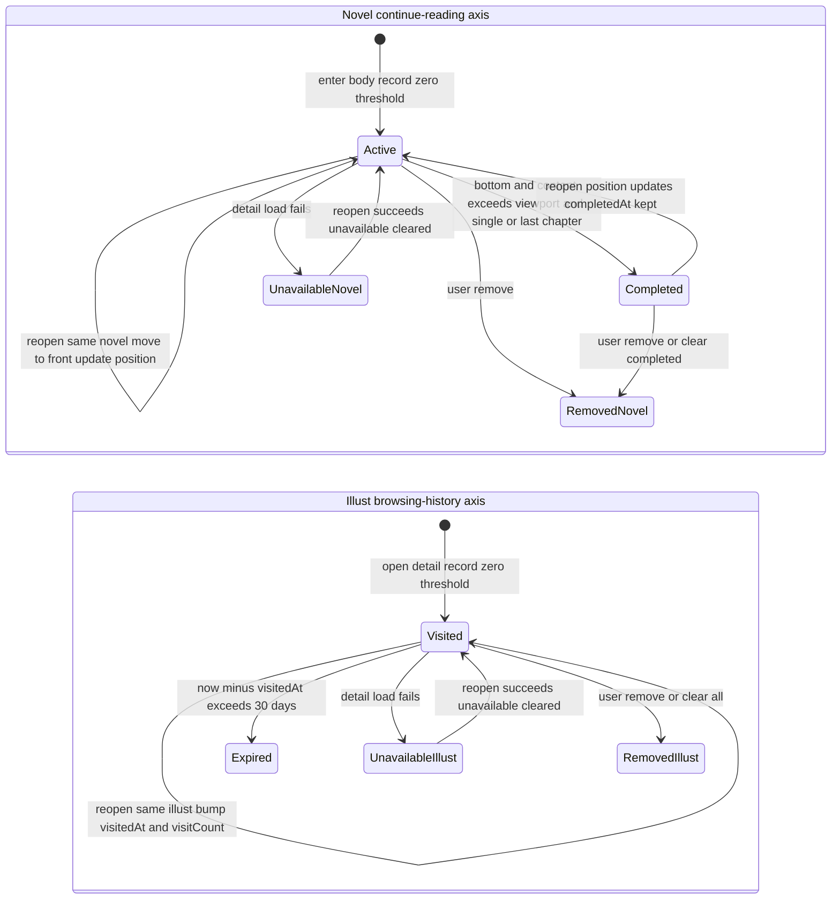

# Continue Reading & Browsing History

This page documents the "Continue Reading" surface (ADR-0219): the third segment of the
Shelf page (`/shelf`) plus the full-list page `/continue`. That one surface carries two
**physically disjoint** local datasets that are presented together as a single list:

- **Illust browsing history** — a *behavior log* of every illust detail page opened,
  with a 30-day expiry, an access counter, and no notion of "finished".
- **Novel continue reading** — a list of *unfinished items* that records the
  chapter-level reading position of each novel, with no expiry and a soft-delete
  "completed" state.

The two axes are implemented by two separate Pinia stores —
`stores/browsingHistoryStore.ts` and `stores/continueReadingStore.ts` — and are merged
for display only by the pure aggregation layer `primitives/continueEntries.ts`.

## Why two axes share one segment and one route

The design deliberately keeps the Shelf at **three** segments (bookmarks / watch-later /
continue-reading) and gives both axes a single `/continue` route rather than a separate
`/history` page or a fourth segment. Two facts make the merge safe:

1. **The axes are disjoint by work type.** Browsing history records only illusts
   (`illustId`), continue reading records only novels (`novelId`). Opening a novel never
   writes into the history store and opening an illust never writes into the
   continue-reading store, so there is zero dedup logic and zero overlapping data.
2. **The lifecycle difference is invisible to the user.** Expired history entries simply
   leave the list; the user never sees an "expired" state. The only per-row distinction
   that matters in the UI is the presence or absence of the chapter label, which is a
   per-row concern, not a reason to split the segment.

This is a display aggregation, not a data merge: `primitives/continueEntries.ts` imports
no store and only maps two arrays of snapshots into one row view model.

> **Correction note (2026-10-05).** The old WebView client's `historyStore` was removed
> with ADR-0203. ADR-0219 originally recorded "not rebuilt" for browsing history; that was
> later corrected: browsing history **is** rebuilt under the Lynx engine as
> `stores/browsingHistoryStore.ts`. What is rebuilt is the *concept* (illust-side only),
> not the old TanStack DB implementation from ADR-0094.

## The two stores at a glance

| Aspect | Browsing history (illust) | Continue reading (novel) |
|---|---|---|
| Nature | Behavior log | Unfinished item |
| Entry key | `illustId` | `novelId` |
| Persistence key | `browsing_history_${uid}` | `continue_reading_${uid}` |
| Expiry | 30 days (boundary inclusive) | None |
| Capacity | 300, drop oldest + warn | 200, drop oldest + warn |
| Completion state | None | `completedAt` soft-delete |
| Counter | `visitCount` (reopen = +1) | None |
| Position | None | `chapterNo` / `chapterTotal` (display-derived) |

Both stores persist through the `settingsStore` `prefs()` PrefsStorage seam (native
`PictelioPrefs` / web-core `idbKV`), the same seam used by watch-later. Neither key is in
the WebDAV backup domain (`ACCOUNT_KEY_PREFIXES` only covers the three R18/AI settings
keys), so neither axis migrates with backups.

## Recording: zero-threshold, session-last position

Both axes record on **open, with zero threshold** — no dwell-time or scroll-percentage
gate, because the only observable signals in this stack are "which work was opened" and
"did it reach the bottom".

- **Illust side** (`IllustDetail.vue`): after a successful detail load,
  `historyStore.record(toIllustHistorySnapshot(res.illust))` is called. Reopening the
  same illust does not add a new entry; it bumps `visitCount`, updates `visitedAt`, and
  moves the entry to the front.
- **Novel side** (`NovelDetail.vue`): entering the body immediately calls
  `continueStore.record(toNovelContinueSnapshot(...))` from already-fetched detail data
  (zero new network). The chapter coordinates (`chapterNo` / `chapterTotal`) are then
  back-filled from the series detail response without blocking rendering; if the chapter
  is outside the first page of the series response, the coordinate is left unknown and
  the label simply does not render.

The novel position uses **session-end semantics**: a re-record of the same `novelId`
updates the position and moves it to the front instead of appending, and the position may
be *rewound* (re-reading chapter 21 then reopening returns you to chapter 21). This is a
deliberate departure from Kindle's monotonic "furthest page read" and Mihon's "oldest
unread" rules — those exist to arbitrate cross-device conflicts, which a local
single-device client does not have. The re-read scenario is therefore correct.

## Completion: soft-delete, not removal

Completion applies only to the novel axis. `decideNovelCompletion` returns true only when
**all** of the following hold:

- `reachedBottom` is true (the `@scrolltolower` signal fired), and
- `contentExceedsViewport` is true (see below), and
- either the novel has no series (`seriesId == null` — single novels are the common
  Pixiv case and must be completable), **or** `chapterNo === chapterTotal` (the last
  chapter of a series).

When the decision is true, `markCompleted(novelId)` sets `completedAt` on the entry but
**does not delete it**. The store exposes the entry as two complementary computed
collections — `active` (no `completedAt`) for the main list, and `completed` (has
`completedAt`) for the `/continue` "finished" group. Completing keeps the entry visible
and clearable; hard-deleting it would give a re-read no re-entry point and would silently
discard user data.

Because Pixiv treats "one chapter" as "one novel", reading a 12-chapter series produces 12
entries. Completing only the last chapter would strand the other 11 as "in progress", so
`decideSeriesSweepIds` computes a cascade target set: all already-recorded entries with the
same `seriesId`, a `chapterNo < N`, and no `completedAt` are marked complete together with
the final chapter. The `<` (not `<=`) pins the rule to the already-read range, and the
sweep is only reached from the last-chapter decision (intermediate chapters never call
`markCompleted`).

Reopening a completed work does **not** revive it: `record` deliberately preserves the
existing `completedAt` while still updating the position. This closes the loop
*session-end position → completed-but-still-updates → re-read correct*.

### The content-height > viewport precondition

The most surprising completion rule is that "reached bottom" alone is insufficient. When a
single-screen novel fits in one viewport, the native `<list>` starts at its bottom edge and
`@scrolltolower` fires on the first frame — a geometric inevitability, not user behavior —
which would soft-delete an unread work. The fix is an objective precondition: the body
content height must be **strictly greater** than the viewport height.

`primitives/novelContentFitsViewport.ts` computes this with `resolveNovelContentGeometry`,
converting both heights to the `@375` design-px base (`viewportHeightDesignPx`) before
comparing. When the viewport height cannot be truly measured (no content-area contract and
no `SystemInfo`), it returns the conservative `contentExceedsViewport = false` and the
caller warns once — mis-completing would soft-delete a book from the user's shelf, whereas
missing a completion only leaves the entry a little longer and self-heals on the next
bottom event.

## Presentation: Shelf segment 3 and the `/continue` page

- **`pages/Shelf.vue`** renders segment 3 with `mergeContinueEntries(continueStore.active,
  historyStore.items)` sliced to a 3-row preview, plus a "view all" link to `/continue`.
- **`pages/ContinueReading.vue`** renders the full merged list (same aggregation function,
  no shape drift) plus a separate "finished" group from
  `mergeContinueEntries(continueStore.completed, [])` — novels only, since illust history
  has no completed state.
- **`primitives/continueEntries.ts`** produces the shared row view model (`ContinueEntry`):
  sorted by recent activity descending (`lastOpenedAt` for novels, `visitedAt` for
  illusts), with a type prefix in the list key (`n-${novelId}` / `h-${illustId}`) so the
  two independent id spaces cannot collide in the native `<list>`, and a fixed novel-first
  tiebreak so equal timestamps do not depend on which axis hydrated first.
- **`components/ContinueRow.vue`** renders each row. The two axes are distinguished by the
  presence/absence of the "上次读到 第N话" status line (novels with computable coordinates
  only) plus a type badge. Restricted (`xRestrict > 0`) and unavailable entries are decided
  locally from the snapshot (`xRestrict`), never by a network call, and are rendered with an
  explicit label and a remove entry rather than being hidden.

Both pages gate their empty state on **both** stores' `ready` flags, so a still-in-flight
`hydrate` is rendered as a skeleton rather than as "you have nothing".

## Navigation and recall

Tapping a row routes by kind:

- **Novel** → `openNovel(id, { resume: true })`, which bypasses the intro-page toggle and
  goes straight to the body (`utils/novelNavigation.ts`). This is implemented as an explicit
  intent argument on the existing `openNovel` single point, not a parallel `/novel/:id`
  shortcut. The intro page's main CTA flips between "开始阅读" (no position) and "继续阅读"
  (position exists) based on `continueStore.has(novelId)`.
- **Illust** → the existing illust detail route.

## Lifecycle

The two axes' entry → active/visited → completion/expiry → removal transitions, plus the
unavailable marking and self-healing on successful reopen. Completion is soft-delete
(`completedAt`), expiry is lazy prune (applied at hydrate and before write), and removal is
a hard, user-confirmed delete.

## Invariants, failures, and degradation policy

- **No silent degradation.** Corrupt/invalid stored JSON, non-array values, and invalid
  entries are rejected with a module-prefixed `console.warn` and fall back to an empty list
  (invalid entries are skipped individually). Over-capacity values are truncated to the
  newest entries with a warn. Write failures warn and keep the in-memory state.
- **Hydration generation gate.** Each store keeps a `hydrateGeneration` counter and a
  `ready` flag. On uid switch (login/logout/account change) a watcher resets `ready` and
  re-hydrates; stale in-flight reads are discarded so an old account's response cannot
  overwrite the new account's data. `ready` lets pages distinguish "not yet known" from
  "genuinely empty".
- **Expiry is lazy and per-object.** History expiry (`isHistoryExpired`) uses a strict `>`,
  so an entry exactly 30 days old is still visible; pruning happens on parse and before each
  write, not via a background timer. Continue-reading deliberately has **no** expiry — the
  30-day rule is not generalized to "history-like" data.
- **Unavailable works stay visible.** A failed detail load marks an *existing* entry
  `unavailable` (it never creates an entry for a work that was never read). The list renders
  the entry with an explicit "unavailable" label and keeps the remove entry; there is no
  batch liveness probing. A later successful open clears the flag (`record` sets
  `unavailable: false`), so the mark self-heals.
- **Bulk clear is irreversible and axis-scoped.** `/continue` exposes two separate
  confirm-dialog actions: clear all browsing history (`browsingHistoryStore.clearAll`) and
  clear finished novels (`continueReadingStore.clearCompleted`, which keeps in-progress
  entries). They never cascade across axes.

## Focused tests

The regression surface is split by subject to respect the freeze-line size rule:

- `stores/continueReadingStore.test.ts` and `stores/continueReadingStore.pure.test.ts` —
  session-end rewind, completed-state preservation on reopen, the 200 cap, no-expiry
  counter-example, account-scoped key, corrupt-data fallback, and the pure parse/label
  helpers.
- `stores/continueReadingCompletion.test.ts` — `decideNovelCompletion` positive/negative
  cases (single novel, last chapter, intermediate chapter, unknown coordinates, out-of-range
  data), plus `markCompleted` / `active` / `completed` behavior and the intro-CTA decision.
- `stores/browsingHistoryStore.test.ts` and `stores/browsingHistoryStore.pure.test.ts` —
  open-record, reopen accumulation, 30-day boundary, the 300 cap, account isolation, and
  parse/prune helpers.
- `primitives/continueEntries.test.ts` — recent-activity merge, type-prefixed keys, novel
  tiebreak, illust `chapterNo === null`, and empty input.
- `primitives/novelContentFitsViewport.test.ts` — the viewport conversion's two
  wrong-direction counter-examples and the conservative fallback.
- Cross-file wiring guards (`continueReadingWiring.template.test.ts`,
  `browsingHistoryWiring.template.test.ts`) pin the page/store/router/i18n connections.

## Related pages

- [Feed & Browsing](feed-and-browsing.md) — the broader browsing surface, bookmarks, and content control.
- [Novel Reader](novel-reader.md) — the novel body/intro pages that produce the continue-reading records.
- [Architecture Overview](../architecture/overview.md)
- [Quickstart](../quickstart.md)
