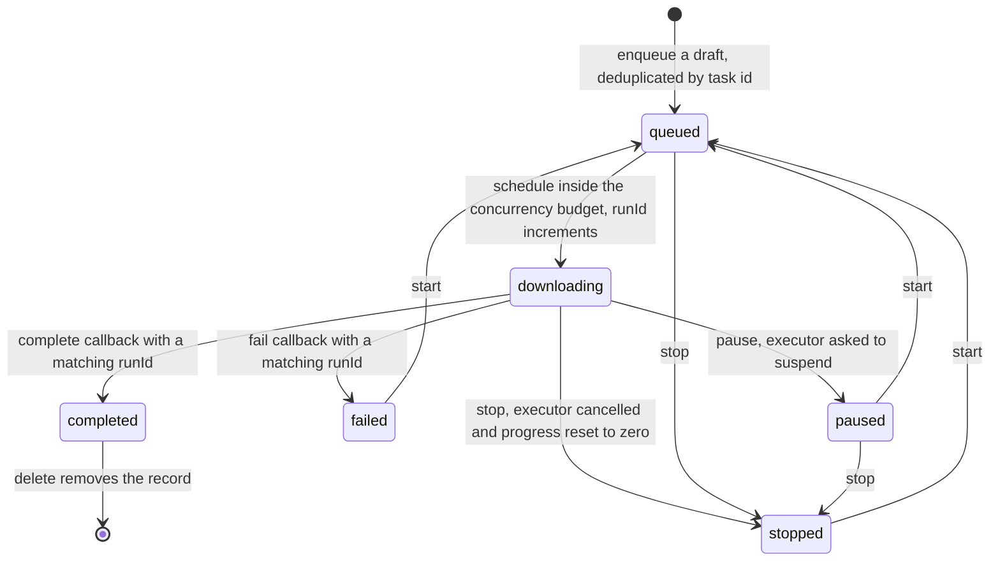
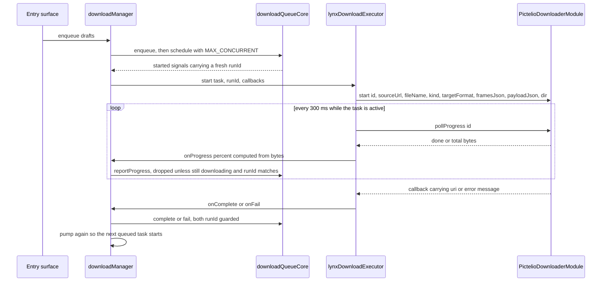

# Downloads, Gallery Save & Export

Everything a user does to get bytes **out** of Pictelio — saving an illust page to the
gallery, exporting a ugoira as one of six formats, exporting a novel document, watching
progress on the `/downloads` page, cancelling, deleting files, or handing a finished file
to the system share sheet — runs through one subsystem: a JS-side persistent task queue
plus one native executor per platform call surface.

The subsystem was designed in
[ADR-0146](../../docs/adr/ADR-0146-download-queue-export.md) on top of the earlier
synchronous "save to gallery" capability of
[ADR-0145](../../docs/adr/ADR-0145-image-save-download.md), specified in
[docs/specs/download-manager.md](../../docs/specs/download-manager.md) (with the ticket
plan in [docs/specs/download-manager-tickets.md](../../docs/specs/download-manager-tickets.md)),
and later extended with a naming template ([ADR-0192](../../docs/adr/ADR-0192-lynx-download-naming-template.md),
[spec](../../docs/specs/lynx-download-naming.md)) and a `novel` task kind
([ADR-0154](../../docs/adr/ADR-0154-novel-export.md)).

> **Single-engine note.** The bridge documented here originally had two call surfaces
> (a Capacitor plugin for the WebView client and a `LynxModule` for the Lynx client). The
> WebView client is gone ([ADR-0203](../../docs/adr/ADR-0203-webview-client-source-removal.md)),
> so the Capacitor plugin form and the "dual-engine contract" shape are history, not a
> template; the contract-coverage test that asserted the Capacitor half now says so
> explicitly ([`galleryBridgeContract.test.ts`](../../packages/app-lynx/src/utils/galleryBridgeContract.test.ts)).
> Module registration and ProGuard rules for the surviving Lynx modules belong to
> [Android Native & Build](../integrations/android-native.md).

## Ownership Map

The line that matters is between **deciding** and **moving bytes** (ADR-0146 D1, extending
the "image bytes never enter the JS heap" rule of ADR-0037):

| Concern | Owner |
|---|---|
| Task list, status, progress percentage, selection-derived availability, delete mode, queue JSON schema and persistence | JS — [`downloadQueueCore.ts`](../../packages/app-lynx/src/utils/downloadQueueCore.ts) (pure) + [`downloadManager.ts`](../../packages/app-lynx/src/utils/downloadManager.ts) (KV + executor seams) |
| Reactive mirror + prefs/executor/sharer wiring | [`stores/downloadStore.ts`](../../packages/app-lynx/src/stores/downloadStore.ts) (Pinia thin shell) |
| Output file names, extension inference, author-directory segment, ugoira format snapshot | JS — [`galleryDownload.ts`](../../packages/app-lynx/src/utils/galleryDownload.ts) (single source of truth) |
| Bytes: cache-first fetch, mirror/Referer/UA semantics, cancellation, streaming progress | Java — `PixivImageLoader` (see [Image Pipeline](../architecture/image-pipeline.md)) |
| MediaStore / app-directory writes, mime mapping, defensive file-name cleaning | Java — [`GallerySaver.java`](../../packages/android-host/android/app/src/main/java/io/pictelio/app/GallerySaver.java) |
| Ugoira frame decoding and the six container encoders | Java — [`UgoiraExporter.java`](../../packages/android-host/android/app/src/main/java/io/pictelio/app/UgoiraExporter.java), `GifEncoder`, `WebpEncoder`, `Mp4Encoder` |
| Share intents, FileProvider conversion, mime resolution | Java — [`ShareHelper.java`](../../packages/android-host/android/app/src/main/java/io/pictelio/app/ShareHelper.java) |

Consequences a reader should keep in mind: JS can re-derive or replay any queue transition
from JSON alone (node-testable, framework-free), and Java never learns what a queue is —
the executor is a single-task "download this URL to this name" operation with a cancel
token.

## Task Model

A **task is one output file**, not one work
([ADR-0146 D2](../../docs/adr/ADR-0146-download-queue-export.md)); a 5-page illust enqueues
5 tasks, a ugoira or novel export enqueues 1. `illustId` is what groups rows in the UI.

`DownloadTask` fields ([`downloadQueueCore.ts`](../../packages/app-lynx/src/utils/downloadQueueCore.ts)):

| Field | Notes |
|---|---|
| `id` | Stable unique id and the dedup key. Per-kind shapes: `img_<illustId>_p<page>` ([`buildImageTasks`](../../packages/app-lynx/src/utils/galleryDownload.ts)), `ugoira_<illustId>_<format>`, `novel_<id>_<format>_<sig>` (built by `@pictelio/novel-export`) |
| `illustId`, `title`, `thumbnailUrl` | Group header + artwork title; the thumbnail goes through `proxyImageUrl` like every other image |
| `kind` | `image` \| `ugoira` \| `novel` |
| `page` | 0-based page number for multi-page stills; absent for ugoira |
| `sourceUrl` | Official original URL (or the official ugoira ZIP URL) — never the `/pixiv-img/` proxy path, because the native executor runs the image-host chain on it |
| `targetFormat` | `jpg/png/...` for stills; one of the six ugoira formats; the chosen novel export format |
| `frames` | ugoira frame timing snapshot (`{file, delay}[]`) carried only when animation encoding needs it |
| `payloadJson` | Opaque serialized novel-export payload; the queue core never parses it |
| `fileName`, `dir` | The JS-decided output name and optional author-directory segment (see [File naming](#file-naming-and-destination-directories)) |
| `status`, `progress`, `bytesDone`/`bytesTotal` | State machine + 0–100 percentage; bytes are optional detail reported by the native side |
| `outputUri` | `content://` (MediaStore) or `file://` (API 28 fallback) after completion |
| `error` | Human-readable failure reason |
| `runId` | Generation counter for stale-callback rejection |
| `createdAt` / `updatedAt` | Ordering (scheduler) and persistence |

`enqueue` is **idempotent by `id`**: a draft whose id already exists is skipped, so
enqueueing the same page or the same ugoira format twice cannot produce a duplicate record.
Combined with "`completed` cannot be started" (below), this means re-downloading a finished
file requires deleting the record first, then enqueueing again.

## Queue State Machine

Six statuses and a small set of legal transitions; everything else is a no-op
([spec §3.2](../../docs/specs/download-manager.md), implemented by
`canStart` / `canPause` / `canStop` + `start` / `pause` / `stop` in
[`downloadQueueCore.ts`](../../packages/app-lynx/src/utils/downloadQueueCore.ts)):

*Queue state machine. `completed` has no outgoing start edge — a finished file is re-downloaded by deleting its record and enqueueing again.*

Rules that are easy to get wrong:

- **`start` is a re-queue, not a start.** It maps `queued | paused | stopped | failed` back
  to `queued` and clears `error`; only the scheduler then promotes it to `downloading`.
  Calling `start` on `completed` or on a task already `downloading` is a silent no-op.
- **`stop` discards partial artefacts**: status `stopped`, `progress` 0, and
  `bytesDone`/`bytesTotal`/`outputUri`/`error` cleared. The record survives so the user can
  start it again.
- **`pause` keeps the queue-level progress value** and leaves the record resumable — but see
  [Known limits](#known-limits-blind-spots-and-verification-status): the shipped native
  executor has no "suspend and keep bytes" capability, so a resumed pause re-downloads.
- Only the executor can produce `completed`/`failed`; neither the UI nor the scheduler may
  write those statuses directly.

## From Enqueue to Completion

`downloadQueueCore` is pure; the orchestration shell `createDownloadManager`
([`downloadManager.ts`](../../packages/app-lynx/src/utils/downloadManager.ts)) owns the two
injected seams — a KV store and a `DownloadExecutor` — and pumps the scheduler:

*Enqueue → single-concurrency scheduler → native executor → completion, with the pull-mode progress loop and the runId generation guard.*

- **Scheduling** — `schedule(state, limit, now)` counts tasks already `downloading`, takes
  the earliest `queued` tasks by `createdAt` (original array index as tie-break) up to the
  free slots, and returns the promoted ids with a **new `runId` = previous + 1** each.
  `MAX_CONCURRENT` is the constant `1` (spec §4.2: single connection per task, gentle on the
  CDN); the parameter exists so the limit can become configurable later.
- **Generation guard** — `reportProgress`, `complete` and `fail` accept an update only when
  the task is still `downloading` **and** the `runId` matches. Any callback from a cancelled,
  paused or deleted run is therefore dropped, and the queue cannot be dragged back into a
  state the user has already left. `progress` is clamped to 0–100.
- **Slot release** — `complete`/`fail` callbacks call `pump()` again, so the next queued task
  starts immediately; `pause`, `stop` and `deleteTasks` also call `pump()` because the
  suspended/cancelled task frees the single slot. `pause` only asks the executor to suspend
  for tasks that are actually `downloading`.
- **Terminal-callback contract** — `DownloadExecutor.start` must eventually call
  `onComplete` or `onFail` exactly once; after a cancel or suspend it must not call back at
  all. The JS layer enforces the same rule a second time: the Lynx executor deletes the
  task's entry from its `active` map on pause/cancel and ignores any later native callback
  whose callback identity no longer matches.
- **State emissions** — `commit()` compares references and `mapTasks` returns the original
  state when nothing changed, so a no-op operation emits no subscriber update (this is what
  keeps the Vue/Pinia layer from re-rendering on meaningless taps).

## Persistence and the Persisted-Format Contract

- One key, one JSON document: `DOWNLOAD_QUEUE_KEY = "download_queue_v1"`, holding
  `{version: QUEUE_SCHEMA_VERSION (= 1), tasks: DownloadTask[]}` from `serialize`.
- Written through a `DownloadKV` seam with a **300 ms debounce**, and writes are serialized
  (`pending` promise chain) so snapshots cannot land out of order. `flush()` drains a
  pending debounce; it is exposed for tests and lifecycle use, and **no production caller
  currently wires it**, so persistence is debounce-driven.
- Native storage is `NativeModules.PictelioPrefs`, i.e. the `SharedPreferences` file
  `CapacitorStorage` ([`PictelioPrefsModule.java`](../../packages/android-host/android/app/src/lynx/java/io/pictelio/app/PictelioPrefsModule.java));
  the web-core/dev path is IndexedDB via `idbKV`. Values read back from the native side go
  through `unquoteNativeString`, because a Lynx `Callback.invoke(String)` JSON-serializes its
  string argument.
- `hydrate()` reads once and is **idempotent by design** — re-running it must not overwrite
  in-memory state with the persisted snapshot, or a page remount would downgrade in-flight
  tasks. The store module triggers one hydration at import time and the page's `onMounted`
  calls the (idempotent) `hydrate` again. Hydration never auto-starts anything: restored
  tasks wait for an explicit user action so startup does not silently spend traffic.
- **Restore is strict and loud** (`restore` in `downloadQueueCore.ts`, spec §4.4):
  unparseable JSON, a `version` mismatch, or a non-array `tasks` field yields an **empty
  queue plus `console.warn`**; each entry is then re-validated by `normalizeTask`, which
  rebuilds a clean record from known fields and returns `null` for damaged entries (dropped
  with a count in the warning). A task that was `downloading` when the process died is
  downgraded to `paused` with a warning. No silent degradation anywhere — the same rule the
  repo's test hard-constraint #3 states elsewhere.

### Red lines

These are persisted formats, and changing them loses user data rather than failing a test:

- **`download_queue_v1`** as the key, **`version: 1`** as the schema version, and the
  `tasks` field: `restore` treats a version mismatch as "start from an empty queue"
  (warn only). Bumping `QUEUE_SCHEMA_VERSION` without a migration path silently empties every
  installed user's queue.
- **Task field names and types** are the record contract. `normalizeTask` copies fields by
  name and drops unknown ones, so renaming or changing the type of a persisted field turns
  existing records into dropped entries.
- **Device-level setting keys** shared with pre-WebView-removal installs:
  `settings_ugoira_download_format` ([`settingsStore.ts`](../../packages/app-lynx/src/stores/settingsStore.ts)),
  `download_file_template` and `download_by_author_dir`. All three are in the WebDAV backup
  domain (`BACKUP_DEVICE_KEYS`), and the queue itself is deliberately **not** in that domain —
  it is device-local task state, not a setting.
- **`CapacitorStorage` / `capacitor-storage_`** literals stay one character
  unchanged: they are legacy user-data formats retained for already-installed users
  ([ADR-0050](../../docs/adr/ADR-0050-lynx-login-persistence.md); see also
  [glossary-webview-client-removal](../../docs/adr/glossary-webview-client-removal.md)).
  The prefs file also carries the queue key, so renaming it would orphan every user's queue.

## Deletion: Files vs Records

Deleting is a two-way choice, and the split is enforced in three places
([ADR-0146 D4](../../docs/adr/ADR-0146-download-queue-export.md),
[spec §3.3](../../docs/specs/download-manager.md)):

| Mode | What happens |
|---|---|
| `files` ("删除文件与记录") | `selectDeleteFileUris` returns the `outputUri` of every selected task that is `completed` with a URI; the manager deletes each file (native `deleteFile`) and only then removes the records |
| `records` ("仅清空记录") | Files are left in the gallery/downloads folder; only the queue records disappear — the share action still works on files whose records were never deleted |

- The dialog offers the destructive action **only** when `hasDeletableFiles` is true, i.e. at
  least one selected task is `completed` with an `outputUri`; unfinished or failed entries
  therefore only show "delete record".
- `deleteTasks` cancels selected tasks that are still `downloading` before touching the
  registry, and then pumps the scheduler — but a `deleteFile` failure is **warned and
  swallowed**: the record is removed regardless, leaving a file the queue no longer knows
  about. That ordering (delete files first, remove records second) is what prevents a
  half-failed delete from creating an orphan record pointing at nothing.
- Native deletion is idempotent about absent files: a `content://` delete that matches zero
  rows is logged and treated as success, and a `file://` path that no longer exists is
  success; an unsupported scheme or a real failure throws a readable `IOException`.
- **Records can also be removed without the user asking**: a record whose `version`/field
  shape no longer passes `normalizeTask` is dropped at restore time. The files stay, but the
  queue forgets them forever.

## Sharing

Sharing is JS-side selection + one native intent:

- `downloadStore.share(ids)` collects the `outputUri` of selected tasks that are `completed`,
  throws a readable error when there is nothing to share or when no sharer is registered,
  and otherwise delegates to the registered sharer
  ([`downloadSharer.ts`](../../packages/app-lynx/src/utils/downloadSharer.ts) registers
  `PictelioShare` at module load). The absence of the native module in the web-core preview
  is a **one-time warning plus explicit rejection**, never a fake success.
- `ShareHelper.buildIntent` converts `file://` outputs through `FileProvider` (Android 7+
  forbids leaking `file://`), keeps `content://` as-is, picks `ACTION_SEND` for one URI and
  `ACTION_SEND_MULTIPLE` for several, grants read permission, and resolves the mime type in
  the order explicit argument → content resolver → extension whitelist → `application/octet-stream`.
- `PictelioShareModule` wraps the intent in `Intent.createChooser`, starts it with
  `FLAG_ACTIVITY_NEW_TASK`, and reports success as soon as the chooser launched — the callback
  does **not** mean the user shared anything.

Note the deliberate asymmetry in mime fallbacks: `GallerySaver.mimeFor` still falls back to
`image/jpeg` (its historical contract), while `ShareHelper.mimeForName` falls back to
`application/octet-stream`.

## Native Executors

### Lynx module surface

`PictelioDownloaderModule`, `PictelioGalleryModule` and `PictelioShareModule` (all
`LynxModule` + `@LynxMethod`, registered by `LynxRuntimeInitializer`) are thin: argument
validation, a thread from a cached pool, and result mapping. Callbacks are two-argument with
**no null contract** — `cb(value, "")` on success and `cb("", readable message)` on failure —
and every returned string needs `unquoteNativeString` because the Lynx callback layer
JSON-encodes it.

| Surface | Contract |
|---|---|
| `PictelioDownloader.start(id, sourceUrl, fileName, kind, targetFormat, framesJson, payloadJson, dir, cb)` | Dispatches by `kind` to the three Java entry points; `dir` sits just before the callback |
| `PictelioDownloader.pollProgress(id, cb)` | **Pull-mode** progress returning `"done/total"`, or `"-1/0"` when nothing is in flight (Lynx callbacks are one-shot, so the stream is polled, aligned with `UgoiraStreamEngine`) |
| `PictelioDownloader.cancel(id, cb)` | `"1"` when an in-flight task was hit, `"0"` otherwise (idempotent no-op) |
| `PictelioDownloader.deleteFile(uri, cb)` | MediaStore row delete for `content://`, file delete for `file://` |
| `PictelioGallery.saveImage(url, fileName, cb)` / `saveImageTo(url, fileName, dir, cb)` | Direct gallery save (three-argument form kept for compatibility; `dir` empty means "use the base directory") |
| `PictelioShare.share(urisJson, mime, cb)` | Chooser launch |

The JS side ([`lynxDownloadExecutor.ts`](../../packages/app-lynx/src/utils/lynxDownloadExecutor.ts))
drives progress itself: a 300 ms interval polls `pollProgress`, parses `done/total`, converts
to an integer percentage, and **suppresses unchanged percentages** so a slow download does not
flood the store with identical updates.

[`downloadExecutor.ts`](../../packages/app-lynx/src/utils/downloadExecutor.ts) resolves
`NativeModules.PictelioDownloader` **lazily, on first use**, not at bundle-evaluation time:
the native modules are injected after the bundle evaluates, and an eager probe would decide
"missing" forever and kill the queue for the whole session (a simulator-found defect now
pinned by [`downloadExecutor.test.ts`](../../packages/app-lynx/src/utils/downloadExecutor.test.ts)).
When the module really is absent (web-core preview), the first attempt warns once and fails
the task rather than degrading silently.

### Static images

`PictelioDownloader.download` validates its inputs, registers an `AtomicBoolean` cancel token
under the task id, streams the source through `PixivImageLoader.loadFileWithProgress`
(cache-first, mirror resolution, `Referer`/UA injection, progress callbacks, cancel polling —
all inherited from the shared image core, see
[Image Pipeline](../architecture/image-pipeline.md)), then hands the resulting local file to
`GallerySaver.saveFile`. The cancel registry is keyed by task id, so cancellation is
per-task and does not disturb other work; the token is removed in a `finally`.

`GallerySaver` then decides the destination
([spec §3 D1](../../docs/specs/image-save-download.md)):

- **API ≥ 29** — `MediaStore.Images` with `RELATIVE_PATH = "Pictures/Pictelio"` and the
  `IS_PENDING` two-phase write (insert pending → copy bytes → clear pending). A write failure
  deletes the pending row so no 0-byte placeholder is left in the gallery; a failed
  pending-clear is logged, because bytes are on disk but the image may stay gallery-invisible.
- **API 28 (minSdk)** — the app-specific external directory
  `getExternalFilesDir(Pictures)/Pictelio/` plus a best-effort `MediaScannerConnection.scanFile`,
  written atomically (`tmp` + rename), returning `file://`. `SaveResult.mediaStore === false`
  marks this path. No runtime storage permission is ever requested — gallery visibility on
  that API level is declared as best-effort rather than bought with a permission pipeline.
- Names are **not** de-duplicated here: MediaStore 29+ appends `" (1)"` itself, and the
  fallback path overwrites a same-named file.
- `sanitizeFileName` is the second line of defence: path separators and control characters
  become `_`, then trim; an empty result raises a readable failure instead of inventing a name.
  It is the oracle the JS `sanitizeNameSegment` is mirrored from, with a cross-language
  contract test keeping the two replacement tables identical.

### ugoira export

`PictelioDownloader.downloadUgoira` fetches the official ZIP with the same streaming core,
checks the cancel token, exports through `UgoiraExporter.export(context, zip, format, id, framesJson)`
into the app cache, and saves the result through `GallerySaver.saveDownloadFile`
(`MediaStore.Downloads`, base `Downloads/Pictelio`; API 28 fallback under the app-specific
Downloads directory). Frame timing arrives as `framesJson`; when it is missing or
unparseable the exporter falls back to ZIP entry order with 100 ms per frame **and logs a
warning** instead of guessing silently.

Each encoder is a deep module taking frame bytes/pixels plus delays and returning container
bytes ([spec §6](../../docs/specs/download-manager.md), [ADR-0146 D5](../../docs/adr/ADR-0146-download-queue-export.md)):

| `targetFormat` | Container | Strategy (all Java — bytes never enter the JS heap) | Verification status |
|---|---|---|---|
| `zip` | zip | Copy the source ZIP byte-for-byte | JVM test (size equality) |
| `tar` | ustar | `ZipFile` central directory for reliable sizes, 512-byte headers with checksum, double zero block | JVM test (alignment, magic, checksum) |
| `apng` | png | First frame's `IHDR` + pre-`IDAT` chunks, `acTL`, `fcTL`, `IDAT`, then `fcTL` + `fdAT` per later frame; non-PNG frames are re-encoded to PNG via `Bitmap.compress(PNG)` | Chunk assembly JVM-tested; `BitmapFactory` path device-pending |
| `gif` | gif89a | `BitmapFactory` decode → fixed 6×6×6 web-safe palette (216 colours + transparent index) → LZW, full-canvas frames, infinite loop | Pure-JVM encoder test with a decode helper as the oracle; frame decode path device-verified only by that test's fixtures |
| `mp4` | mp4 | `MediaCodec` (H.264, YUV420 flexible input) + `MediaMuxer`; frame rate derived from average delay (clamped 1–60, 10 fps fallback) | Pure parts (ARGB→YUV420, frame rate, PTS) JVM-tested; **codec path needs a real device** |
| `webp` | webp | Per-frame `Bitmap.compress(WEBP)` (device libwebp, no NDK/`.so`) → extract `ALPH`/`VP8`/`VP8L` → pure-Java RIFF `VP8X` + `ANIM` + `ANMF` container | Container assembly JVM-tested; **bitmap compression path needs a real device** |

Frame sizes must match across frames and a non-decodable frame raises a readable
`IOException`; an unknown format is rejected rather than silently mapped.

### Novel export

`kind: "novel"` tasks ride the same queue, executor, cancel token and delete/share
semantics; the payload is opaque to the queue core and the document encoding belongs to
[Novel Reader](novel-reader.md) and the `@pictelio/novel-export` package. Two queue-visible
consequences: the native path reports only coarse progress (5 % before encoding, 90 % before
saving, 100 % set by the queue on completion — encoding is not sliceable), and the
"already downloaded this novel" badge is a **derived** state, computed from the queue by
[`novelDownloadStatus.ts`](../../packages/app-lynx/src/utils/novelDownloadStatus.ts) rather
than from its own persistence layer — so clearing the queue resets it.

## File naming and destination directories

The file name has exactly one source of truth: JS
([ADR-0145 D3](../../docs/adr/ADR-0145-image-save-download.md),
[ADR-0192 D1/D2/D3](../../docs/adr/ADR-0192-lynx-download-naming-template.md)). Java receives
a finished name string (plus an optional directory segment) and only cleans it defensively.

- **Base form** — `Pictelio_<illustId>.<ext>` for a single page,
  `Pictelio_<illustId>_p<N>.<ext>` for multi-page (0-based `N`, aligned with Pixiv's own
  `_p0`), produced by `buildSaveFileName`.
- **Template form** — `download_file_template` (device-level, default `Pictelio_{id}`,
  truncated to 200 characters) is expanded by `buildSaveFileNameFromTemplate` /
  `buildUgoiraFileNameFromTemplate` with placeholders `{id}`, `{title}`, `{author}`, `{p}`.
  `{p}` is the 0-based page number for multi-page works and expands to the empty string for
  single-page works, with a neighbouring connector stripped so `{id}_p{p}` yields `<id>`;
  a template without `{p}` on a multi-page work gets the legacy `_p<N>` suffix appended.
  Unknown placeholders are kept verbatim and warned about **once per name** — a typo stays
  visible in the output instead of being swallowed.
- **Zero default behaviour change** — the default template must reproduce the legacy names
  byte-for-byte, which is why `buildSaveFileName` is itself implemented as a delegation to the
  default template rather than a parallel implementation. This is a hard acceptance item, and
  the naming tests pin the expansion matrix literally.
- **Sanitise and truncate** — each substituted value is sanitised with
  `sanitizeNameSegment` (path separators and `\x00-\x1f` → `_`, then trim; a byte-for-byte
  mirror of Java's rule) and truncated to 64 characters per `title`/`author` segment; the
  final assembled name including extension is capped at 120 characters with the extension
  always kept intact. Template **literals** are sanitised the same way, so a template can
  never inject a path — the directory is decided by a switch, not by the template string.
  An empty or all-sanitised-away template falls back to the default with a visible hint
  (no silent fallback).
- **Author directories** — `download_by_author_dir` (device-level boolean, default off)
  appends one sanitised author segment after the per-chain base. The bases are fixed:
  `Pictures/Pictelio` for the still-image chain (both the queue's image tasks and the
  direct-gallery module) and `Downloads/Pictelio` for non-image exports (ugoira, novel).
  A missing or empty-after-sanitise author name degrades to the base **with a warning**.
  Java only gained an optional `subPath` parameter appended after its base constant, and
  `subPath == ""` is byte-identical to the old behaviour, which is what lets old call sites
  remain untouched.
- **Snapshot at enqueue** — both the name-affecting settings and the ugoira format are read
  when the task draft is built and stored on the task. Changing the template, the author
  toggle or the format afterwards never rewrites queued work — the alternative would
  invalidate half-produced artefacts mid-flight.
- The two chains intentionally share this one module: the queue path
  (`buildImageTasks` / `buildUgoiraTask`) and the direct gallery path
  (`saveImageToGallery`) call the same naming functions, so the same illust gets the same
  name and directory segment whichever chain produced it.

Ugoira format is the other snapshot field: the key is `settings_ugoira_download_format`,
value set `gif | mp4 | webp | apng | zip | tar` (the whitelist lives in
`downloadQueueCore.UGOIRA_FORMATS`), default `zip` — lossless, and the only format that
cannot fail a pixel encoder. An illegal persisted value is warned about and the default is
kept. There is **no per-image format**: the format is a global setting, snapshotted per task.

## The /downloads Page

`/downloads` is a secondary page (route entry in
[`router.ts`](../../packages/app-lynx/src/router.ts), `requiresAuth: true`, `topInset: 'self'`);
its component is [`DownloadManager.vue`](../../packages/app-lynx/src/pages/DownloadManager.vue),
with all derived logic in the node-tested
[`downloadsViewModel.ts`](../../packages/app-lynx/src/utils/downloadsViewModel.ts) —
the component only renders and wires events.

- **Entry points** — the Me page's account group row "下载管理" (`ME_A11Y_LABELS.downloads`), and
  the inline "added to the download queue" notice on the illust detail page, whose "查看下载"
  chip navigates to `/downloads`. The route is also reachable through the bench-nav alias.
- **List** — tasks grouped by `illustId` (`groupByIllust`) into M3 cards: thumbnail
  (proxied), artwork title, a per-kind header label (动图 / 小说 / N 张), and one selectable
  row per task showing `fileName` plus a progress bar and status text while downloading.
  Selection is a set of task ids; **an empty selection means "all tasks"**, which is how the
  action bar doubles as a bulk control surface (`effectiveIds`, `summary`, and the
  availability computation all follow the same rule).
- **Actions** — start / pause / stop / share / delete. Availability is derived, not
  hand-written: `availabilityFor` asks `canStart` / `canPause` / `canStop` over the effective
  selection, `delete` is "something is selected", and `share` requires at least one
  `completed` task with an `outputUri`. Unavailable actions render a disabled state layer
  rather than disappearing, and each action is a method with its own availability guard
  (inline expressions in `@tap` do not fire in native LynxView — a measured engine
  constraint the component comments record).
- **Delete confirmation** — a two-action dialog (cancel / 仅清空记录 / 删除文件与记录), with the
  destructive branch rendered only when `hasDeletableFiles` is true. The dialog registers
  itself with `modalStack` so system back closes the dialog instead of leaving the page.
- **Layout constraints worth preserving** — the action bar is **in flow** (not an absolute
  overlay) because an overlaid bar did not receive taps in native LynxView; the scroll view is
  non-virtualized (task counts are small) but each group uses the shared staggered entrance
  style with a cap, so a long history cannot push the last group arbitrarily late; the bottom
  uses the shared `FabAllowanceSpacer` instead of the previously hand-tuned height; and the
  disabled-state overlay must be a separate element because two `background-color`
  declarations on one node silently cancel the MD3 disabled layer.
- **Accessibility** — every tappable element carries
  `:accessibility-element="A11Y_ELEMENT_ENABLED"` and a label from the `DOWNLOAD_A11Y_LABELS`
  registry; a source-level guard test asserts the registry is non-empty, unique, fully
  consumed by the template, and that label/element counts stay equal.
- **Degraded environments** — in the web-core preview there is no native module, so share and
  delete fail explicitly (warn + rejection surfaced as the page's status text) rather than
  pretending to succeed.

## Known Limits, Blind Spots and Verification Status

These are declared scope boundaries and untested paths, not incidental gaps. A green test run
must not be read as coverage of them.

- **No background continuation.** The queue lives in the app process: when the process is
  killed, a `downloading` task comes back as `paused` on the next hydration, and nothing
  resumes it automatically (WorkManager-style background continuation is explicitly out of
  scope for this phase and listed as a follow-up ticket). Progress polling is driven by a JS
  interval, so it also stops when JS is suspended.
- **Concurrency is fixed at 1.** No multi-threaded or segmented download, and no
  segment-merge resume. The spec leaves "does pause keep already-downloaded bytes?" to the
  executor, and the shipped executor's answer is **no**: `pause` is implemented as
  `native.cancel(id)` (the module documents "the native side has no suspend-and-keep-progress
  capability"), so a paused task restarts from zero, while the queue record keeps its old
  percentage until the rerun reports new values. Treat `pause` as "cancel and stay resumable"
  rather than "freeze a byte range".
- **No list-level cross-work batch download** (selecting several works in a feed to enqueue)
  — the page's batch means "batch over tasks that are already in the queue".
- **No per-image format.** The ugoira format comes from one global setting and is frozen per
  task at enqueue; two ugoira works cannot be exported in different formats in one pass
  without changing the setting between enqueues.
- **ugoira progress covers the download, not the encode.** The generator reports streaming
  ZIP progress; `UgoiraExporter` has no incremental progress channel, so the percentage jumps
  from the download's final value to 100 % on completion. (The same is true in spirit for
  novel exports, where the native side reports two fixed checkpoints.)
- **Which encoders are device-verified vs unit-verified.** `gif`, `tar`, `zip` and the APNG
  chunk assembly run as pure JVM/Robolectric tests. The `mp4` `MediaCodec` path and the `webp`
  per-frame `Bitmap.compress` path are **not** covered by those tests — Robolectric has no
  `MediaCodec` implementation, and the encoder headers state plainly that these paths are for
  device acceptance. The spec status line and the ticket table say the same thing for the
  MP4/WebP bitmap paths, real-device download and real-device sharing: pending a device batch.
- **No download E2E.** Ticket T14 (agent-browser flow plus android-e2e smoke) is still `todo`,
  and there is no download-specific spec under `packages/android-host/tests/android-e2e/specs`
  — the queue's coverage today is unit-level (pure core, manager, view model, executors) plus
  the Java unit suite.
- **MediaStore and permission behaviour is API-split by design.** On API ≥ 29 the write needs
  no permission and lands in `Pictures/Pictelio`; on API 28 the file goes to the app-specific
  directory and gallery visibility is best-effort (`MediaScannerConnection` may not index it).
  `SaveResult.mediaStore` is the only in-band signal distinguishing the two paths.
- **Delete-file failures leave orphans by contract**: the record is removed even when the file
  deletion throws, and that is warned rather than rolled back.
- **Restore can drop records silently from the user's point of view**: damaged entries and a
  schema-version mismatch produce warnings in the console and an empty/partial queue, with no
  user-facing surface for the loss.
- **Retired-code caveat.** The legacy synchronous single-save path
  (`saveIllustPages` + `saveImageToGallery` + `gallerySaveAvailable`) is still present and
  tested but has **no production caller left** in `packages/app-lynx` after the save entry
  points were converted to enqueueing ([spec §8](../../docs/specs/download-manager.md));
  the live gallery-save surface is the queue's image tasks. Reading those files as the current
  user path would be a mistake.
- **Deliberately out of scope**: iOS (Android-only project), cloud-side download services,
  and any format list beyond the six ugoira containers.

## Focused Tests

| Layer | What is pinned | Where |
|---|---|---|
| Pure queue core | All legal transitions and illegal no-ops, `MAX_CONCURRENT = 1` and `createdAt` ordering, the runId guard on stale progress/complete/fail, both delete modes, `dir` snapshot round-trip, corrupt-entry and version-mismatch handling, `downloading → paused` recovery | [`downloadQueueCore.test.ts`](../../packages/app-lynx/src/utils/downloadQueueCore.test.ts) |
| Manager shell | Enqueue-then-schedule, slot release on completion/failure/pause/stop, debounced persistence, `hydrate` idempotence, KV read/write failure warnings, delete cancellation | [`downloadManager.test.ts`](../../packages/app-lynx/src/utils/downloadManager.test.ts) |
| Executor | Lazy native-module resolution, one-time absence warning, pause/cancel cancel-equivalence, `deleteFile` passthrough, no post-cancel callback acceptance | [`downloadExecutor.test.ts`](../../packages/app-lynx/src/utils/downloadExecutor.test.ts), [`lynxDownloadExecutor.test.ts`](../../packages/app-lynx/src/utils/lynxDownloadExecutor.test.ts) |
| Naming + tasks | The default-template byte-equality baseline, placeholder matrix, sanitise/truncate boundaries, `dir` derivation and warn-on-empty, task field shapes and per-kind ids | [`galleryDownload.test.ts`](../../packages/app-lynx/src/utils/galleryDownload.test.ts), [`buildImageTasks.test.ts`](../../packages/app-lynx/src/utils/buildImageTasks.test.ts), [`buildUgoiraTask.test.ts`](../../packages/app-lynx/src/utils/buildUgoiraTask.test.ts), [`ugoiraFramesTask.test.ts`](../../packages/app-lynx/src/utils/ugoiraFramesTask.test.ts) |
| Cross-language contract | TS ⇄ Java literal drift: `saveImage`/`saveImageTo` signatures, the downloader `start` parameter order including `dir`, base-directory constants, and the sanitise replacement table | [`galleryBridgeContract.test.ts`](../../packages/app-lynx/src/utils/galleryBridgeContract.test.ts) |
| View model | Grouping, per-status action availability, share URI selection, `hasDeletableFiles`, selection helpers | [`downloadsViewModel.test.ts`](../../packages/app-lynx/src/utils/downloadsViewModel.test.ts) |
| Page + settings UI | a11y registry completeness and the literal delete-action labels; Me-page naming block structure, preview echo, fallback hint, author-directory switch | [`downloadManagerTemplate.test.ts`](../../packages/app-lynx/src/pages/downloadManagerTemplate.test.ts), [`meDownloadNaming.template.test.ts`](../../packages/app-lynx/src/pages/meDownloadNaming.template.test.ts) |
| Java deep modules | Download + progress + cancel registry + delete URI handling; author-directory landing and legacy-directory byte-equality; MediaStore values contract and pending cleanup; TAR/APNG/GIF/WebP/MP4 encoder contracts; FileProvider URI and chooser intent construction | `PictelioDownloaderTest.java`, `GallerySaverTest.java`, `GallerySaverMediaStoreTest.java`, `UgoiraExporterTest.java`, `UgoiraExporterApngTest.java`, `UgoiraExporterGifTest.java`, `GifEncoderTest.java`, `WebpEncoderTest.java`, `Mp4EncoderTest.java`, `ShareHelperTest.java` (under [`src/test/java/io/pictelio/app/`](../../packages/android-host/android/app/src/test/java/io/pictelio/app/)) |

Run them with `pnpm test:app-lynx` for the JS side and
`pnpm test:android-host:unit` for the JVM/Robolectric suite; see
[Testing Overview](../testing/overview.md) for the gate topology.

## Related

- [Image Pipeline](../architecture/image-pipeline.md) — the shared byte core (`PixivImageLoader`), cache keys, and image-host resolution the executors inherit
- [Novel Reader](novel-reader.md) — novel export formats, payloads and encoders that ride this queue
- [Android Native & Build](../integrations/android-native.md) — Lynx module registration, ProGuard keeps and the native test suite as a whole
- [App Shell & Navigation](../architecture/app-shell-and-navigation.md) — the route table, back-stack and modal stack the `/downloads` page cooperates with
- [Testing Overview](../testing/overview.md) — how to run and what a green gate does and does not prove
- ADRs: [ADR-0145](../../docs/adr/ADR-0145-image-save-download.md) (gallery save), [ADR-0146](../../docs/adr/ADR-0146-download-queue-export.md) (queue + export architecture), [ADR-0192](../../docs/adr/ADR-0192-lynx-download-naming-template.md) (naming template / author directory), [ADR-0154](../../docs/adr/ADR-0154-novel-export.md) (novel export as a task kind), [ADR-0143](../../docs/adr/ADR-0143-imagehost-download-source-java-sink.md) (download source in Java), [ADR-0037](../../docs/adr/ADR-0037-pixiv-api-plugin-gateway.md) (bytes never in the JS heap), [ADR-0050](../../docs/adr/ADR-0050-lynx-login-persistence.md) (persisted-format red lines), [ADR-0203](../../docs/adr/ADR-0203-webview-client-source-removal.md) (WebView removal)
- Specs: [download-manager](../../docs/specs/download-manager.md) + [tickets](../../docs/specs/download-manager-tickets.md), [image-save-download](../../docs/specs/image-save-download.md), [lynx-download-naming](../../docs/specs/lynx-download-naming.md)
