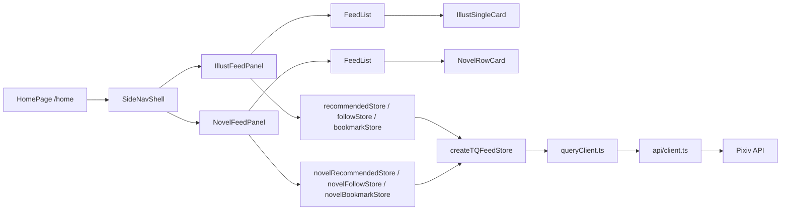

# Feed & Browsing

The feed and browsing system covers the primary user experience: discovering and viewing Pixiv illusts and novels.

## Feed Architecture

The home feed is rendered by **HomePage** (`/packages/app/src/routes/HomePage.tsx`) at `/home`, now structured as a **C shell + L5 fixed layout** (ADR-0075): a `SideNavShell` left icon rail drives navigation between the four content tabs (推荐/关注/收藏/历史), and a single-column content panel renders either illust or novel cards. The bottom `NavBar` is no longer rendered on the home page — navigation moved to `SideNavShell` — though `NavBar` remains in use on secondary pages (`UserIllusts`, `FollowListPage`).

Six feed stores back the six panel variants (3 tabs × illust/novel), all built on the shared `createTQFeedStore` factory:

| Tab | Illust store | Novel store | Card component |
|-----|-------------|-------------|----------------|
| recommended | `recommendedStore.ts` | `novelRecommendedStore.ts` | `IllustSingleCard` / `NovelRowCard` |
| follow | `followStore.ts` | `novelFollowStore.ts` | `IllustSingleCard` / `NovelRowCard` |
| bookmarks | `bookmarkStore.ts` | `novelBookmarkStore.ts` | `IllustSingleCard` / `NovelRowCard` |
| history | (built into `SideNavShell`) | — | `HistoryRowCard` |

> **Data activation:** `ensureLoaded` is the single data-loading entry point (queries default `enabled: false` per ADR-0042). `activate` only sets a subscription flag — calling `activate` alone previously left the bookmarks/follow tabs empty (regression fixed by always running `ensureLoaded` + `activate` together in `useFeedActivation`).
>
> **FeedList unification (ADR-0078):** All six panels render through the shared `FeedList` container, which splits `refreshing` (pull-to-refresh) from `loadingMore` (pagination append). The skeleton overlay only triggers on `pullPhase === "refreshing"`, so pagination no longer flashes the skeleton.
>
> **Illust stores — integrated:** `recommendedStore.ts` and `followStore.ts` power the home illust panels; the legacy monolithic `feedStore.ts` was deleted. Shared helpers (`dedupIllusts`, `nextPageOrLoad`) live in `feedHelpers.ts`.
>
> **Novel store split — integrated:** `novelRecommendedStore.ts`, `novelFollowStore.ts`, and `novelBookmarkStore.ts` power the home novel panels; the legacy monolithic `novelStore.ts` was deleted. Shared helpers (`adaptNovelResponse`, `dedupNovels`) live in `novelHelpers.ts`.

### HomePage (C Shell + L5)

`/packages/app/src/routes/HomePage.tsx` — the home page is now a thin shell delegating to `SideNavShell`:

- **`SideNavShell`** (`/packages/app/src/components/home/SideNavShell.tsx`) provides a 56px sticky left icon rail (search entry + 推荐/关注/收藏/历史 tabs + settings/me avatar), a sticky page title + username subtitle, and the `ContentTypeToggle`. The history tab is built into the shell (`HistoryRowCard` list + clear button) rather than passed through `renderPanel`.
- **Content panels** (`IllustFeedPanel` / `NovelFeedPanel`) map a tab to its feed store via `illustSource()` / `novelSource()`, then render a `FeedList` of `IllustSingleCard` (single-column large image) or `NovelRowCard` (56px row cards). `contentType()` from `uiStore` switches between illust and novel panels.
- **Pagination** is driven by `nextUrl` + `fetchMore` through `FeedPaginationSentinel` (infinite-scroll sentinel), not a "Load more" button.
- **Pull-to-refresh** (ADR-0076) is wired through `FeedList`'s `refreshMode="overlay"` → `store.refresh()` (refetch first page).
- **Splash dismiss:** simple `onMount` → `markContentReady()`; skeleton guarantee via ADR-0042 (`enabled: false`) + ADR-0043 (`setTimeout(0)`).
- **No per-tab scroll preservation** — cross-navigation scroll restore is handled by `@solidjs/router`'s `<Router scrollRestoration>` prop (sessionStorage keyed by history depth). Tab switches within `/home` do not restore scroll position.

### Feed Store Factory

All feed stores use `createTQFeedStore` (`/packages/app/src/stores/shared/createTQFeedStore.ts`), a shared factory that provides:
- TanStack Query-based data fetching with pagination
- Illust deduplication (`dedupIllusts` by illust ID)
- R18/R18G content filtering
- Sub-tab adapter functions converting between feed-store and factory naming conventions

**Concrete store instances (illusts):**

| Store | File | Sub-tabs | Tab adapter needed? |
|-------|------|----------|---------------------|
| Recommended (active) | `recommendedStore.ts` | mixed/illust/manga | Yes (mixed → factory "all") |
| Follow (active) | `followStore.ts` | all/public/private | No (maps 1:1) |
| Legacy monolithic | `feedStore.ts` | — | **Deleted** (commit `b30366f`) |

**Concrete store instances (novels):**

| Store | File | Sub-tabs | Tab adapter needed? |
|-------|------|----------|---------------------|
| Recommended (active) | `novelRecommendedStore.ts` | (single) | No |
| Follow (active) | `novelFollowStore.ts` | all/public/private | No (maps 1:1) |
| Bookmarks (active) | `novelBookmarkStore.ts` | (single with restrict) | No |
| Legacy monolithic | `novelStore.ts` | — | **Deleted** (commit `b30366f`) |

Shared helpers migrated from `feedStore.ts` to `feedHelpers.ts`:

- **`dedupIllusts`** — Deduplicates illusts by `illust.id`. Used by the factory's `dedupFn` option in merge-all mode.
- **`nextPageOrLoad`** — Routes paginated API calls: if `pageParam` is set, calls `apiClient.get(nextUrl)`; otherwise calls the initial loader function. Both paths normalize the response to `{ items, next_url }`.

Shared helpers migrated from `novelStore.ts` to `novelHelpers.ts`:

- **`adaptNovelResponse`** — Novel-specific pagination adapter that normalizes `{ novels, next_url }` API responses to `{ items, next_url }`. Works like `nextPageOrLoad` from `feedHelpers.ts` but handles the `novels` key used by novel API endpoints.
- **`dedupNovels`** — Deduplicates novels by `novel.id`. Used by the factory's `dedupFn` option in merge mode (e.g. `novelFollowStore`'s all/private merge).



### Nav Components & Adaptive Tags

- **`SideNavShell`** — the home page's primary navigation (left icon rail). The selected tab highlights with a `BrandBackground2` rounded block. It reads/writes `currentTab` from `uiStore`, so entries from `PersonalCenter` ("我的收藏" → bookmarks) preset the initial tab.
- **`ContentTypeToggle`** (`/packages/app/src/components/home/ContentTypeToggle.tsx`) — the 插画/小说 switch in the page header, hidden on the history tab.
- **`NavBar`** (`/packages/app/src/components/NavBar.tsx`) — still used on secondary pages (`UserIllusts`, `FollowListPage`) but no longer on `/home`.
- **`GlassTabBar`** (`/packages/app/src/components/ui/GlassTabBar.tsx`) and the standalone `RecommendedFeed`/`FollowFeed` components are no longer wired into the home page after the C-shell refactor (glass-tab adoption was rolled back to global nav only, #84).
- **`AdaptiveTags`** (`/packages/app/src/components/home/AdaptiveTags.tsx`) + `adaptiveTagFit.ts` — renders an illust/novel's tag chips on a card and **imperatively truncates** them to one line: overflow chips collapse into a "+N" chip via a measured `max-width`. Built on `useContainerWidth` and the new [`viewportWidth`](/packages/app/src/primitives/viewportWidth.ts) primitive; the `adaptive-tags-240.test.ts` E2E regression guards narrow-viewport (240px) truncation.

## Virtual Scrolling & Layout

The home page renders **fixed single-column layouts** via `FeedList` (no masonry/grid mode switcher):

| Content type | Card | Layout |
|--------------|------|--------|
| Illust | `IllustSingleCard` | Single-column large image, original aspect ratio (corrected per ADR-0073) |
| Novel | `NovelRowCard` | Single-column 56px row cards |
| History | `HistoryRowCard` | Single-column A2 row card list |

**`FeedList`** (`/packages/app/src/components/home/FeedList.tsx`, ADR-0078) is the unified home-feed container: it accepts a generic `FeedSource` (`items`/`loading`/`refreshing`/`loadingMore`/`nextUrl`/`fetchMore`/`refresh`), renders skeleton on refresh, an empty hint when done, a `FeedPaginationSentinel` for infinite scroll, and a pull-to-refresh overlay (`createPullToRefresh`).

**`createPullToRefresh`** (`/packages/app/src/primitives/createPullToRefresh.ts`, ADR-0076) provides the home page's six-panel pull-to-refresh with an A1 overlay mask; `createFastScrollbar` serves the novel detail page (see [Novel Reader](/openwiki/domain/novel-reader.md)).

**Secondary virtualized feeds** still use the older `VirtualFeed` + `createFeedVirtualizer` stack with three layout modes (waterfall/single/grid): `IllustBookmarks`, `UserWorksFeed`, and the novel `NovelRecommendedFeed`/`NovelFollowFeed`/`NovelBookmarks` routes (via `NovelVirtualFeed`). The home feed itself no longer uses `createFeedVirtualizer`.

**`VirtualFeed`** (`/packages/app/src/components/VirtualFeed.tsx`) accepts `illusts`/`loading`/`error`/`hasMore` data state, `onIllustClick`/`onAuthorClick`/`onLoadMore`/`onRefresh` callbacks, a `layoutMode` (`waterfall` | `single` | `grid`), and `emptyText`/`skipAnimation`/`onNavigateToSettings`. It tracks a component-level `loadAttempted` flag: the "暂无新作品" empty message renders only when `loadAttempted` is `true`, and the skeleton renders while `loading` is `true` **or** `loadAttempted` is `false` (prevents an empty-state flash before the first fetch). Scroll restoration is handled by `@solidjs/router`'s `<Router scrollRestoration>` prop; the custom `createScrollRestore`/`createVirtualScrollRestore`/`createFeedScrollStore` primitives were deleted (commit `b30366f`).

`ImageCard` (`/packages/app/src/components/ImageCard.tsx`) and `GridCard` (`GridCard.tsx`) remain the card components for these secondary virtualized feeds (image loading, skeleton shimmer, author info, bookmark button).

## R18 Filtering & Age Confirmation

`/packages/app/src/utils/r18Filter.ts` — Filters illusts and novels by `xRestrict` values:
- `xRestrict = 0` — Safe
- `xRestrict = 1` — R18 (adult content)
- `xRestrict = 2` — R18G (extreme content)

User settings control visibility of each tier. An **AgeConfirmation** gate (`/packages/app/src/routes/AgeConfirmation.tsx`) appears on first launch, requiring the user to confirm they are 18+.

**app-lynx equivalent:** [`settingsStore.ts`](/packages/app-lynx/src/stores/settingsStore.ts) provides `showR18`/`showR18G` switches (default `false`, persisted via IndexedDB KV) and `isRestricted(item)` — a pure reactive function that drives a glass overlay (`RestrictOverlay.vue`) instead of removing items from the list. All feed pages render the full list; restricted entries show an R-18 / R-18G badge with "该内容已在设置中隐藏" and no click-through. Toggling a switch in settings makes the overlay disappear instantly without re-fetching. `filterByRestrict` has been deleted. Also adds `SkeletonNovel.vue` for novel list/detail loading states. Switches live on the Me page. Spec: [app-lynx R18 overlay + skeleton](/docs/specs/app-lynx-r18-overlay-skeleton.md), originating from [ADR-0051](/docs/adr/ADR-0051-lynx-r18-filter.md).

## Search

`/packages/app/src/routes/Search.tsx` — Dedicated search page for illusts and novels with a back button in the search bar. Backed by:
- `/packages/app/src/api/search.ts` — API search endpoints
- `/packages/app/src/stores/searchStore.ts` — Search state (query, history, results)

**Popular sort routing:** When `sort=popular_desc` is selected, the search API routes to Pixiv's `/v1/search/popular-preview/illust` or `/v1/search/popular-preview/novel` endpoints instead of the standard `/v1/search/illust` or `/v1/search/novel` endpoints. These popular-preview endpoints return a single un-paginated page of popular results in that category without the `sort` parameter — the `popular_desc` sort mode is implicit in the endpoint choice.

**Re-entrancy guard:** `executeSearch()` skips a duplicate in-flight search carrying the same `keyword_scope_sort` key (the first request owns result writing). This prevents a race where the search-box submit navigates (changing the URL) and the URL-sync effect re-triggers `executeSearch()` — without the guard the second call would abort the first, leaving both to fail silently and clearing results. The guard is cleared in a `finally` block.

**Auto-load via sentinel:** `SearchResults` (`/packages/app/src/components/SearchResults.tsx`) uses an IntersectionObserver sentinel (`createSentinel`) placed at the bottom of the results list. When the sentinel scrolls into view and `hasMore` is true, `onLoadMore` fires automatically — replacing the earlier manual "Load more" button UX. An end-of-results separator ("没有更多了") appears when `hasMore` becomes false.

## Bookmarks

Bookmarks is no longer a standalone route. The **bookmarks tab** inside `/home` renders `IllustSingleCard`/`NovelRowCard` lists backed directly by `bookmarkStore` / `novelBookmarkStore` (via the `IllustFeedPanel`/`NovelFeedPanel` mapping). The older `BookmarksFeed` component and the `IllustBookmarks`/`NovelBookmarks` route components still exist but are no longer embedded in the home page. The `PersonalCenter` "My Bookmarks" link navigates to `/home` with `setCurrentTab("bookmarks")`.

Bookmark state is managed by `/packages/app/src/stores/bookmarkStore.ts` (illusts) and `novelBookmarkStore.ts` (novels), which integrate with the Pixiv API and toggle bookmarks with optimistic UI updates.

## Author Click Navigation

Per [ADR-0032](/docs/adr/ADR-0032-author-click-navigation.md), all card components now support clicking a third-party username to navigate to that user's personal center (`/user/${userId}`). The feature uses a uniform `onAuthorClick` prop chain:

```
Route Page (navigate) → VirtualFeed (prop pass-through)
  → LazyImageCard/ImageCard/GridCard (prop pass-through)
  → button onClick → e.stopPropagation() → onAuthorClick(user.id)
```

### Affected Components

| Component | Route / Usage | Change |
|-----------|--------------|--------|
| `ImageCard` | Feed (waterfall/single) | `onAuthorClick` prop, `@user.name` is now a clickable button |
| `GridCard` | Feed (grid mode) | Same pattern as ImageCard |
| `NovelCard` | Novel feed (list mode) | `onAuthorClick` prop added |
| `NovelCoverCard` | Novel feed (cover wall) | `onAuthorClick` prop added |
| `VirtualFeed` | All illust feeds | Passes `onAuthorClick` through to cards |
| `NovelVirtualFeed` | Novel feeds | Passes `onAuthorClick` through to cards |
| `SearchResults` | Search page | Author names are clickable |
| `UserWorksFeed` | User profile / illusts | Author names are clickable |
| `HistoryPage` / `HistoryEntry` | Browsing history | `authorId` field stored; old entries degrade gracefully to plain text |

### Key Implementation Details

- **`e.stopPropagation()`** prevents the click from bubbling to the card container, which would trigger navigation to the illust/novel detail page
- **Fluent-compliant touch targets:** all author buttons have `min-h-[40px]` for mobile usability
- **`historyStore`** now stores an optional `authorId` field for history entries; entries without it render as plain text

## Browsing History

`/packages/app/src/stores/historyStore.ts` — Persists history using **TanStack DB** with `localStorageCollectionOptions`:
- L1 = in-memory collection (TanStack DB)
- L2 = full serialization to localStorage (`pictelio-browsing-history`)
- Composite key: `${userId}_${type}_${id}` for user isolation
- Lazy expiry: entries older than 30 days cleared on write
- `historyVersion` signal acts as a non-reactive invalidation token

**History tab:** The history tab is now built into `SideNavShell` (`SideNavShell.tsx` `HistoryPanel`) rather than rendered via a separate `HistoryFeed` route component. It renders an A2 `HistoryRowCard` list (sorted by `visitedAt` descending) with a clear-all button and empty state, reading `historyCollection` filtered by `userId`. The older `HistoryFeed` component still exists but is no longer wired into `/home`. History entries retain author click navigation per [ADR-0032](/docs/adr/ADR-0032-author-click-navigation.md); old entries without `authorId` degrade gracefully to plain text.

The `contentType()` toggle from `uiStore` is hidden on the history tab — history is displayed as a single unified timeline regardless of content type.

## User Pages

| Route | Component | Data |
|-------|-----------|------|
| `/user/:id` | `PersonalCenter` | User profile + recent illusts |
| `/user/:id/illusts` | `UserIllusts` | All illusts by user |
| `/user/:id/following` | `FollowListPage` | Who the user follows |
| `/user/:id/followers` | `FollowListPage` | User's followers |

User profile data is loaded via `/packages/app/src/primitives/useUserProfile.ts`. Follow/unfollow uses optimistic UI with rollback on error.

## Key Source Files

| Purpose | Path |
|---------|------|
| Home page (C shell + L5) | `/packages/app/src/routes/HomePage.tsx` |
| Side nav shell | `/packages/app/src/components/home/SideNavShell.tsx` |
| Unified feed list | `/packages/app/src/components/home/FeedList.tsx` |
| Illust single card | `/packages/app/src/components/home/IllustSingleCard.tsx` |
| Novel row card | `/packages/app/src/components/home/NovelRowCard.tsx` |
| History row card | `/packages/app/src/components/home/HistoryRowCard.tsx` |
| Adaptive tags | `/packages/app/src/components/home/AdaptiveTags.tsx` |
| Pagination sentinel | `/packages/app/src/components/home/FeedPaginationSentinel.tsx` |
| Pull-to-refresh primitive | `/packages/app/src/primitives/createPullToRefresh.ts` |
| Recommended store | `/packages/app/src/stores/recommendedStore.ts` |
| Follow store | `/packages/app/src/stores/followStore.ts` |
| TQ feed store factory | `/packages/app/src/stores/shared/createTQFeedStore.ts` |
| Feed helpers | `/packages/app/src/stores/shared/feedHelpers.ts` |
| Virtual feed component (secondary feeds) | `/packages/app/src/components/VirtualFeed.tsx` |
| Feed virtualizer (secondary feeds) | `/packages/app/src/primitives/createFeedVirtualizer.ts` |
| Image card (secondary feeds) | `/packages/app/src/components/ImageCard.tsx` |
| Grid card (secondary feeds) | `/packages/app/src/components/GridCard.tsx` |
| Nav bar (secondary pages) | `/packages/app/src/components/NavBar.tsx` |
| Bookmarks feed component (legacy) | `/packages/app/src/components/BookmarksFeed.tsx` |
| History feed component (legacy) | `/packages/app/src/components/HistoryFeed.tsx` |
| Search page | `/packages/app/src/routes/Search.tsx` |
| Search store | `/packages/app/src/stores/searchStore.ts` |
| History store | `/packages/app/src/stores/historyStore.ts` |
| Novel recommended feed component | `/packages/app/src/routes/NovelRecommendedFeed.tsx` |
| Novel follow feed component | `/packages/app/src/routes/NovelFollowFeed.tsx` |
| Bookmark store | `/packages/app/src/stores/bookmarkStore.ts` |
| R18 filter utility | `/packages/app/src/utils/r18Filter.ts` |
| Age confirmation | `/packages/app/src/routes/AgeConfirmation.tsx` |
| Block/report store | `/packages/app/src/stores/blockStore.ts` |
| User illusts | `/packages/app/src/routes/UserIllusts.tsx` |
| Follow list page | `/packages/app/src/routes/FollowListPage.tsx` |
| Personal center | `/packages/app/src/routes/PersonalCenter.tsx` |
