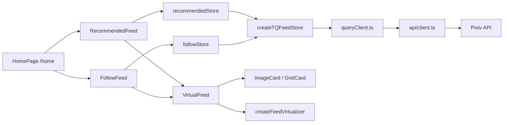

# Feed & Browsing

The feed and browsing system covers the primary user experience: discovering and viewing Pixiv illusts and novels.

## Feed Architecture

Two feed content types are rendered inside the consolidated **HomePage** (`/packages/app/src/routes/HomePage.tsx`) at the `/home` route. Navigation between all four tabs — recommended, follow, bookmarks, and history — is handled by **NavBar** (`/packages/app/src/components/NavBar.tsx`), which maps every tab to `/home` and uses in-page CSS display toggling via `currentTab()` (no router-level navigation between tabs). The standalone `/bookmarks` and `/history` routes were removed; bookmarks and history are now HomePage sub-components only.

| Feed | Route | Component | Store(s) |
|------|-------|-----------|----------|
| Recommended (illusts) | `/home` (tab: recommended) | `RecommendedFeed` | `recommendedStore.ts` (new split store) |
| Follow (illusts) | `/home` (tab: follow) | `FollowFeed` | `followStore.ts` (new split store) |
| Bookmarks (illusts/novels) | `/home` (tab: bookmarks) | `BookmarksFeed` | `bookmarkStore.ts` (delegates to `IllustBookmarks`/`NovelBookmarks`) |
| History | `/home` (tab: history) | `HistoryFeed` | `historyStore.ts` (TanStack DB, localStorage) |
| Novel Feed (recommended) | `/home` (tab: recommended, novel mode) | `NovelFeedPage tab="recommended"` (embedded fallback) | `novelStore.ts` (legacy) |
| Novel Feed (follow) | `/home` (tab: follow, novel mode) | `NovelFeedPage tab="follow"` (embedded fallback) | `novelStore.ts` (legacy) |

> **Illust stores — integrated (v3.21.x):** The illust feed split is now live. `RecommendedFeed` and `FollowFeed` import directly from the new split stores (`recommendedStore.ts` and `followStore.ts`). The legacy `feedStore.ts` remains in the codebase but is no longer imported by any route component. Shared helpers (`dedupIllusts`, `nextPageOrLoad`) live in `feedHelpers.ts`.

> **Ongoing refactor (novels):** The monolithic `novelStore.ts` is being split into dedicated per-tab stores in the same pattern. `novelRecommendedStore.ts`, `novelFollowStore.ts`, and `novelBookmarkStore.ts` are added but not yet imported by routes — the novel feed components embedded in HomePage still pass through to `NovelFeedPage`, which imports from `novelStore.ts`. Shared helpers (`adaptNovelResponse`, `dedupNovels`) have been extracted to `novelHelpers.ts`.

### HomePage (Consolidated Home)

`/packages/app/src/routes/HomePage.tsx` — The single home page at `/home` replacing the old separate `/recommended`, `/following`, `/bookmarks`, and `/history` routes:

- **Shared sticky header** with user avatar, app title, and content-type toggle (illust / novel)
- **Content type switching** toggles between illust feeds and novel feeds via `contentType()` from `uiStore` — **hidden on the history tab** (`currentTab() !== "history"`) since browsing history is text-based timeline
- **Tab panels** use CSS `display` toggling (`currentTab() === "recommended" ? "block" : "none"`) — all feed components are mounted, only one visible at a time
  - **Bookmarks tab:** Renders `BookmarksFeed` (`/packages/app/src/components/BookmarksFeed.tsx`), which delegates to `IllustBookmarks` (illust mode) or `NovelBookmarks` (novel mode) based on `contentType()`
  - **History tab:** Renders `HistoryFeed` (`/packages/app/src/components/HistoryFeed.tsx`), a full browsing history timeline with inline search and date-range filtering, backed by `useLiveQuery` from TanStack DB
- **Data loaded in `onMount`** (not via router loader): each feed component calls `ensureLoaded(signal)` with AbortController for cancel-on-unmount
- **Splash dismiss:** Merges `recLoading()` and `folLoading()` into one `createEffect` — fires 350ms `setTimeout` → `markContentReady()` on first loading signal; 800ms `onMount` fallback for cached-data case
- **Scroll state saved per-tab** via `saveTabScroll("recommended")` / `saveTabScroll("follow")` on unmount

### Feed Store Factory

All feed stores use `createTQFeedStore` (`/packages/app/src/stores/shared/createTQFeedStore.ts`), a shared factory that provides:
- TanStack Query-based data fetching with pagination
- Illust deduplication (`dedupIllusts` by illust ID)
- R18/R18G content filtering
- Scroll state save/restore (`saveFeedScrollState` / `getFeedScrollState`)
- Sub-tab adapter functions converting between feed-store and factory naming conventions

**Concrete store instances (illusts):**

| Store | File | Sub-tabs | Tab adapter needed? |
|-------|------|----------|---------------------|
| Legacy monolithic | `feedStore.ts` | recommended: mixed/illust/manga; follow: all/public/private | Yes (dual-tab) |
| Recommended (new) | `recommendedStore.ts` | mixed/illust/manga | Yes (mixed → factory "all") |
| Follow (new) | `followStore.ts` | all/public/private | No (maps 1:1) |

**Concrete store instances (novels):**

| Store | File | Sub-tabs | Tab adapter needed? |
|-------|------|----------|---------------------|
| Legacy monolithic | `novelStore.ts` | follow: all/public/private; recommended; bookmarks | Yes (triple-tab) |
| Recommended (new) | `novelRecommendedStore.ts` | (single) | No |
| Follow (new) | `novelFollowStore.ts` | all/public/private | No (maps 1:1) |
| Bookmarks (new) | `novelBookmarkStore.ts` | (single with restrict) | No |

Shared helpers migrated from `feedStore.ts` to `feedHelpers.ts`:

- **`dedupIllusts`** — Deduplicates illusts by `illust.id`. Used by the factory's `dedupFn` option in merge-all mode.
- **`nextPageOrLoad`** — Routes paginated API calls: if `pageParam` is set, calls `apiClient.get(nextUrl)`; otherwise calls the initial loader function. Both paths normalize the response to `{ items, next_url }`.

Shared helpers migrated from `novelStore.ts` to `novelHelpers.ts`:

- **`adaptNovelResponse`** — Novel-specific pagination adapter that normalizes `{ novels, next_url }` API responses to `{ items, next_url }`. Works like `nextPageOrLoad` from `feedHelpers.ts` but handles the `novels` key used by novel API endpoints.
- **`dedupNovels`** — Deduplicates novels by `novel.id`. Used by the factory's `dedupFn` option in merge mode (e.g. `novelFollowStore`'s all/private merge).



## Virtual Scrolling

`/packages/app/src/primitives/createFeedVirtualizer.ts` — The core virtualizer for efficient rendering of large illust lists. It:
- Manages a virtual window of visible items
- Coordinates pull-to-refresh, infinite scroll, and scroll restoration
- Supports three layout modes (waterfall, single, grid)
- Works with `createVirtualScrollRestore` for scroll position memory

**`VirtualFeed`** (`/packages/app/src/components/VirtualFeed.tsx`) is the reusable component accepting 16 props:
- `illusts`, `loading`, `error`, `hasMore` — data state
- `onIllustClick`, `onAuthorClick`, `onLoadMore`, `onRefresh` — callbacks
- `layoutMode` — `waterfall` | `single` | `grid`
- `scrollKey`, `initialScrollState`, `onScrollStateChange` — scroll restoration
- `emptyText`, `skipAnimation`, `suppressHeaderVisibility`, `onNavigateToSettings`

**Empty-state & skeleton fix (`loadAttempted`, v3.21.6+):** VirtualFeed tracks a component-level `loadAttempted` boolean that becomes `true` once `loading`, `error`, or `illusts.length > 0` is observed.
- The "暂无新作品" empty-text message only renders when `loadAttempted` is `true` — preventing an empty-state flash before the first data load completes.
- The skeleton `<div>` now renders when either `loading` is `true` **or** `loadAttempted` is `false` (commit `fa2015c`). This ensures the skeleton fills the viewport even in the brief window before TanStack Query begins its first fetch — when `loading` is still `false` and no data or error has been observed. Previously this gap could show a blank area.

## Layout Modes

| Mode | Columns | Card Component | Description |
|------|---------|----------------|-------------|
| `waterfall` | 2 | `ImageCard` | Masonry layout with variable-height cards |
| `single` | 1 | `ImageCard` | Single-column scroll, largest thumbnails |
| `grid` | 3 | `GridCard` | Uniform grid with compact cards |

`ImageCard` (`/packages/app/src/components/ImageCard.tsx`) handles image loading with skeleton shimmer, author info, bookmark button, and follow/unfollow. `GridCard` is a compact variant.

## R18 Filtering & Age Confirmation

`/packages/app/src/utils/r18Filter.ts` — Filters illusts and novels by `xRestrict` values:
- `xRestrict = 0` — Safe
- `xRestrict = 1` — R18 (adult content)
- `xRestrict = 2` — R18G (extreme content)

User settings control visibility of each tier. An **AgeConfirmation** gate (`/packages/app/src/routes/AgeConfirmation.tsx`) appears on first launch, requiring the user to confirm they are 18+.

## Search

`/packages/app/src/routes/Search.tsx` — Dedicated search page for illusts and novels with a back button in the search bar. Backed by:
- `/packages/app/src/api/search.ts` — API search endpoints
- `/packages/app/src/stores/searchStore.ts` — Search state (query, history, results)

**Popular sort routing:** When `sort=popular_desc` is selected, the search API routes to Pixiv's `/v1/search/popular-preview/illust` or `/v1/search/popular-preview/novel` endpoints instead of the standard `/v1/search/illust` or `/v1/search/novel` endpoints. These popular-preview endpoints return a single un-paginated page of popular results in that category without the `sort` parameter — the `popular_desc` sort mode is implicit in the endpoint choice.

**Auto-load via sentinel:** `SearchResults` (`/packages/app/src/components/SearchResults.tsx`) uses an IntersectionObserver sentinel (`createSentinel`) placed at the bottom of the results list. When the sentinel scrolls into view and `hasMore` is true, `onLoadMore` fires automatically — replacing the earlier manual "Load more" button UX. An end-of-results separator ("没有更多了") appears when `hasMore` becomes false.

## Bookmarks

Bookmarks is no longer a standalone route. The **bookmarks tab** inside `/home` renders `BookmarksFeed` (`/packages/app/src/components/BookmarksFeed.tsx`), which delegates to:
- `/packages/app/src/routes/IllustBookmarks.tsx` — Illust bookmark list (when `contentType() === "illust"`)
- `/packages/app/src/routes/NovelBookmarks.tsx` — Novel bookmark list (when `contentType() === "novel"`)

These sub-pages are still full route components but are embedded inside `HomePage` rather than mounted at their own route. The `PersonalCenter` "My Bookmarks" link now navigates to `/home` with `setCurrentTab("bookmarks")`.

Bookmark state is managed by `/packages/app/src/stores/bookmarkStore.ts`, which integrates with the Pixiv API and drive, also a `bookmarkStore` that toggles bookmarks with optimistic UI updates.

## Author Click Navigation

Per [ADR-0032](/docs/adr/ADR-0032-author-click-navigation.md), all card components now support clicking a third-party username to navigate to that user's personal center (`/user/${userId}`). The feature uses a uniform `onAuthorClick` prop chain:

```
Route Page (navigate) → VirtualFeed (prop pass-through)
  → LazyImageCard/ImageCard/GridCard (prop pass-through)
  → button onClick → e.stopPropagation() → onAuthorClick(user.id)
```

### Affected Components

| Component | Route / Usage | Change |
|-----------|--------------|--------|
| `ImageCard` | Feed (waterfall/single) | `onAuthorClick` prop, `@user.name` is now a clickable button |
| `GridCard` | Feed (grid mode) | Same pattern as ImageCard |
| `NovelCard` | Novel feed (list mode) | `onAuthorClick` prop added |
| `NovelCoverCard` | Novel feed (cover wall) | `onAuthorClick` prop added |
| `VirtualFeed` | All illust feeds | Passes `onAuthorClick` through to cards |
| `NovelVirtualFeed` | Novel feeds | Passes `onAuthorClick` through to cards |
| `SearchResults` | Search page | Author names are clickable |
| `UserWorksFeed` | User profile / illusts | Author names are clickable |
| `HistoryPage` / `HistoryEntry` | Browsing history | `authorId` field stored; old entries degrade gracefully to plain text |

### Key Implementation Details

- **`e.stopPropagation()`** prevents the click from bubbling to the card container, which would trigger navigation to the illust/novel detail page
- **Fluent-compliant touch targets:** all author buttons have `min-h-[40px]` for mobile usability
- **`historyStore`** now stores an optional `authorId` field for history entries; entries without it render as plain text

## Browsing History

`/packages/app/src/stores/historyStore.ts` — Persists history using **TanStack DB** with `localStorageCollectionOptions`:
- L1 = in-memory collection (TanStack DB)
- L2 = full serialization to localStorage (`pictelio-browsing-history`)
- Composite key: `${userId}_${type}_${id}` for user isolation
- Lazy expiry: entries older than 30 days cleared on write
- `historyVersion` signal acts as a non-reactive invalidation token

**History tab:** The history tab inside `/home` renders `HistoryFeed` (`/packages/app/src/components/HistoryFeed.tsx`), a full browsing history timeline with:
- **Timeline view:** Entries grouped by date headers, sorted oldest-first within each day
- **Inline search:** Debounced 300ms search input with highlighted match `<mark>` elements
- **Date-range filtering:** Start/end date inputs with memoized timestamp conversion
- **Clear all:** Confirmation dialog before clearing all history
- **Author click navigation:** Author names are clickable per [ADR-0032](/docs/adr/ADR-0032-author-click-navigation.md); old entries without `authorId` degrade gracefully to plain text
- **R18/R18G filtering:** Respects user's adult content settings and filters out entries exceeding those thresholds
- **Virtual scroll:** Offloaded to `useLiveQuery` with conditional `where` clauses — the content-type toggle is hidden on the history tab since browsing history is a single text-based timeline

The `contentType()` toggle from `uiStore` is hidden on the history tab (`<Show when={currentTab() !== "history"}>` in `HomePage.tsx`) — history is displayed as a single unified timeline regardless of content type.

## User Pages

| Route | Component | Data |
|-------|-----------|------|
| `/user/:id` | `PersonalCenter` | User profile + recent illusts |
| `/user/:id/illusts` | `UserIllusts` | All illusts by user |
| `/user/:id/following` | `FollowListPage` | Who the user follows |
| `/user/:id/followers` | `FollowListPage` | User's followers |

User profile data is loaded via `/packages/app/src/primitives/useUserProfile.ts`. Follow/unfollow uses optimistic UI with rollback on error.

## Key Source Files

| Purpose | Path |
|---------|------|
| Home page (consolidated) | `/packages/app/src/routes/HomePage.tsx` |
| Recommended feed component | `/packages/app/src/components/RecommendedFeed.tsx` |
| Follow feed component | `/packages/app/src/components/FollowFeed.tsx` |
| Tab feed page (legacy, unused by routes) | `/packages/app/src/routes/TabFeedPage.tsx` |
| Recommended store (new) | `/packages/app/src/stores/recommendedStore.ts` |
| Follow store (new) | `/packages/app/src/stores/followStore.ts` |
| Feed store (legacy) | `/packages/app/src/stores/feedStore.ts` |
| TQ feed store factory | `/packages/app/src/stores/shared/createTQFeedStore.ts` |
| Feed helpers | `/packages/app/src/stores/shared/feedHelpers.ts` |
| Virtual feed component | `/packages/app/src/components/VirtualFeed.tsx` |
| Feed virtualizer | `/packages/app/src/primitives/createFeedVirtualizer.ts` |
| Image card | `/packages/app/src/components/ImageCard.tsx` |
| Grid card | `/packages/app/src/components/GridCard.tsx` |
| Nav bar (tab router) | `/packages/app/src/components/NavBar.tsx` |
| Bookmarks feed component | `/packages/app/src/components/BookmarksFeed.tsx` |
| History feed component | `/packages/app/src/components/HistoryFeed.tsx` |
| Search page | `/packages/app/src/routes/Search.tsx` |
| Search store | `/packages/app/src/stores/searchStore.ts` |
| History store | `/packages/app/src/stores/historyStore.ts` |
| History page | `/packages/app/src/routes/HistoryPage.tsx` |
| Bookmark store | `/packages/app/src/stores/bookmarkStore.ts` |
| R18 filter utility | `/packages/app/src/utils/r18Filter.ts` |
| Age confirmation | `/packages/app/src/routes/AgeConfirmation.tsx` |
| Block/report store | `/packages/app/src/stores/blockStore.ts` |
| User illusts | `/packages/app/src/routes/UserIllusts.tsx` |
| Follow list page | `/packages/app/src/routes/FollowListPage.tsx` |
| Personal center | `/packages/app/src/routes/PersonalCenter.tsx` |
