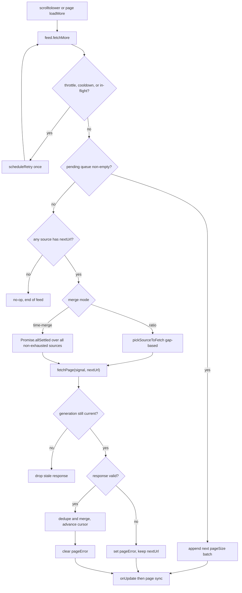
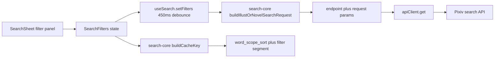

# Feed & Browsing

This page documents how the Pictelio **app-lynx** client discovers and browses Pixiv illusts and novels: the four root destinations and the surfaces hanging off them, the single pagination contract behind every list page, the discover carousel, search, ranking, the local collection surfaces, related-works injection and tag neighbors, and content control.

app-lynx is the repository's **only runtime client**: the former SolidJS + Capacitor webview client (`packages/app`) was deleted in [ADR-0203](../../docs/adr/ADR-0203-webview-client-source-removal.md) (its Android host moved to `packages/android-host`, its OAuth credentials/version facts moved to app-lynx). Two layout decisions survived that removal: **fixed layouts with no user-configurable layout mode**, and **engine virtualization instead of a self-built JS virtualizer** ([ADR-0075](../../docs/adr/ADR-0075-home-c-shell-fixed-layout.md), [ADR-0096](../../docs/adr/ADR-0096-virtual-scroll-migration.md)). lynx realizes them with a native `<list>` waterfall for illusts, single-column lists for novels, and a hand-rolled swipe carousel for the discover page.

## Destinations and browsing surfaces

The four top-level destinations are single-sourced in `packages/app-lynx/src/components/navTabs.ts` (`NAV_TABS`, a deliberately **closed 4-item array**) and answer four different user questions ([ADR-0218](../../docs/adr/ADR-0218-app-lynx-top-nav-user-question-dimension.md)): 发现 `/discover`, 更新 `/updates`, 书架 `/shelf`, 我的 `/me`. The media axis was demoted from navigation to in-page tabs, so `/illusts` and `/novels` keep their routes (deep links, benchNav, back targets) but no longer appear in navigation. Radial-FAB behaviour, `RouteMeta` (`requiresAuth` / `topInset` / `backBehavior`) and the destination contract are owned by [App Shell & Navigation](../architecture/app-shell-and-navigation.md); this page states which browsing surfaces exist and how each loads.

| Route | Surface | How it loads |
|-------|---------|--------------|
| `/discover` | `pages/Recommended.vue` — mixed illust+novel **single-card carousel**, in-page `all / illust / novel` tabs | `createMixFeed` with `merge: 'time-merge'`, one feed instance per tab |
| `/illusts` | `pages/IllustList.vue` — illust waterfall (`list-type="waterfall"`), `recommend / follow` sub-tabs | `createMixFeed` single source (`loadRecommended` / `loadFollow('public')` + `loadNext`) |
| `/novels` | `pages/NovelList.vue` — single-column novel list, `recommend / follow` | `createMixFeed` single source (`loadRecommendedNovels` / `loadFollow` + `loadNovelNext`) |
| `/following` | `pages/Following.vue` — followed users | `createMixFeed` |
| `/user/:id` | `pages/UserHome.vue` — profile + user works (illusts and novels) | `createMixFeed` per work type |
| `/bookmarks` | `pages/Bookmarks.vue` — own bookmarks, `illust / novel` tabs | `createMixFeed` per tab (`loadBookmarks(uid, 'public')`) |
| `/updates` | `pages/Updates.vue` — three stacked preview sections: 关注更新 / 追更新 / 通知 | one-shot preview loads (not `createMixFeed`) |
| `/shelf` | `pages/Shelf.vue` — three preview segments: bookmarks / watch later / continue reading | `loadBookmarks` preview + two local stores |
| `/ranking` | `pages/Ranking.vue` — mode + date | `createRankingFeed`, a single-source `createMixFeed` wrapper |
| `/watchlist` | `pages/Watchlist.vue` — novel **series** follow list | `createWatchlistFeed` |
| `/later` | `pages/WatchLater.vue` — local snapshot list | `stores/watchLaterStore.ts` (zero network, no pagination) |
| `/continue` | `pages/ContinueReading.vue` — novel positions + illust browsing history | `continueReadingStore` + `browsingHistoryStore` — see [Continue Reading & Browsing History](continue-reading-and-history.md) |
| `/mute-tags` | `pages/MuteTags.vue` — mute-tag management | `settingsStore.mutedTags()` (local, no network) |
| `/illust/:id/tag-neighbors` | `pages/TagNeighbors.vue` — explainable similar works | `collectTagNeighbors` kernel via `stores/tagNeighbor.ts` |

`/updates` and `/shelf` are **aggregate previews**, not full lists: each section renders at most `PREVIEW_N = 3` rows and links into the owning secondary page. Their three sections fail independently — one failed request only marks that section, and each section carries its own loading flag so an unfinished hydrate is never rendered as "you have nothing" (the `Shelf` page keeps separate `loading` / `laterLoading` / `continueLoading` flags for exactly this reason).

## The shared pagination seam: `createMixFeed`

`packages/app-lynx/src/primitives/createMixFeed.ts` is the single deep module that owns pagination for **all list feeds and the discover carousel**. [ADR-0104](../../docs/adr/ADR-0104-app-lynx-feed-pagination-convergence.md) migrated five hand-written `loadMore` implementations onto it (IllustList / NovelList / Following / UserHome / Bookmarks) and fixed the native "double-host URL" 404 (`rewriteUrl` strips the domain from an absolute Pixiv `next_url` before the native module prepends `apiBase`; URL normalization itself is owned by [API Layer](../architecture/api-layer.md)).

A `createMixFeed` instance hides the following coordination from pages:

- **Sources**: `MixFeedSource { name, fetchPage(signal, nextUrl) }` returning `{ items, nextUrl }` (`nextUrl === null` = exhausted). The first load calls `fetchPage(signal)` with no cursor; pagination passes that source's current `next_url` (offset-cursor semantics — recommendation endpoints may ignore it).
- **Merge modes** (`merge`): default `ratio` (fixed-ratio alternation, default `ratio: [4, 1]` illust:novel) and `time-merge` (global `create_date` descending interleave via the shared `mergeByTime` pure function), used by the discover page ([ADR-0115](../../docs/adr/ADR-0115-app-lynx-recommended-carousel.md)).
- **Batch rendering**: first load and every page expose at most `pageSize = 20` items to the render stream, buffering the rest in a `pending` queue (ADR-0060 — a fully rendered list causes an image-load storm).
- **Double debounce**: `throttleMs = 800` + `cooldownMs = 3000`, plus a **one-shot retry timer**. Native `<list>` emits `scrolltolower` as a single low-frequency event, so a swallowed event would dead-lock the list; when a gate swallows a call while work remains, one retry is scheduled (`scheduleRetry`, never stacked, skipped once exhausted) and the page is re-snapshotted through `onUpdate`.
- **Race protection (generation gate + AbortController pool)**: `loadFirstPage()` bumps `generation` and aborts the previous controller, so in-flight responses whose generation no longer matches are dropped **and** the abort reaches `apiClient`/OkHttp. `dispose()` clears the retry timer, aborts, and bumps the generation.
- **Dedupe**: a `seen` key set (`i-<id>` / `n-<id>`) drops duplicates across sources and pages.
- **Page-turn priority** (`ratio` mode only): `pickSourceToFetch` selects among non-exhausted sources by the gap between a source's target ratio share and its current rendered share ("fetch whichever kind is under-represented"), breaking ties by source order.
- **Error-slot separation**: `error()` is the first-load/refresh error (rendered as a full-page state), `pageError()` is the pagination error (rendered inline at the list bottom, keeping loaded items and retaining `nextUrl` so the next scroll retries). A successful page only clears `pageError()`.
- **Timeout and malformed-response guards**: every request is wrapped in a 15 s `withTimeout`; a non-array `items` payload is treated as a failure instead of rendering blank.
- **Settle flag**: `settled()` is true once some source has answered successfully — **including a genuinely empty answer** — and returns to false on refresh/dispose. It is the input to the page-level first-load switch (`deriveFirstLoadView`).

```mermaid
flowchart TD
    P["scrolltolower or page loadMore"] --> FB["feed.fetchMore"]
    FB --> D{"throttle, cooldown, or in-flight?"}
    D -->|yes| R1["scheduleRetry once"] --> FB
    D -->|no| PEND{"pending queue non-empty?"}
    PEND -->|yes| APPEND["append next pageSize batch"] --> UPD["onUpdate then page sync"]
    PEND -->|no| HAS{"any source has nextUrl?"}
    HAS -->|no| NOP["no-op, end of feed"]
    HAS -->|yes| MODE{"merge mode"}
    MODE -->|ratio| PICK["pickSourceToFetch gap-based"]
    MODE -->|time-merge| FAN["Promise.allSettled over all non-exhausted sources"]
    PICK --> FETCH["fetchPage(signal, nextUrl)"]
    FAN --> FETCH
    FETCH --> G{"generation still current?"}
    G -->|no| STALE["drop stale response"]
    G -->|yes| OK{"response valid?"}
    OK -->|no| PE["set pageError, keep nextUrl"] --> UPD
    OK -->|yes| M["dedupe and merge, advance cursor"] --> CLR["clear pageError"] --> UPD
```

*`createMixFeed` pagination: debounce/re-entry gates, the ratio-vs-time-merge fan-out, generation-gated fetch, and the split first-load vs pagination error slots.*

The two merge modes differ in how a page turn is fetched and where the new items land:

- `ratio` fetches **one** source (gap-based pick) and appends its batch to the stream.
- `time-merge` fetches **every** non-exhausted source in parallel with `Promise.allSettled`, then re-merges successful batches together with the already-rendered/pending items by `create_date`, so the stream stays globally descending and a persistently failing source cannot stall the infinite stream; if every source fails, only `pageError()` is set.

`createRankingFeed` reuses `createMixFeed` with a single source and adds `setQuery()` (dispose + rebuild) so the ranking page can switch `(mode, date)` with the same generation-gate semantics.

The first load always merges source pages before rendering: in `ratio` mode with `mergeByRatio` (each round taking `ratio[i]` items per source, skipping empty sources and taking the remainder when a round is incomplete), in `time-merge` mode with `mergeByTime`. Single-source pages degenerate to plain cursor-following.

### What list pages must do (thin ref-snapshot bridges)

Pages hold local `ref`s, call `feed.fetchMore()` / `feed.refresh()` from event handlers, and re-copy `items() / loading() / loadingMore() / settled() / error() / pageError() / nextUrl()` in a `sync()`. Two conventions are load-bearing:

- **Mode/tab switches dispose and rebuild** the instance (`autoStart: false` plus an explicit `refreshFeed()`), never mutate state: the old instance's in-flight requests and timers must be released so they cannot write stale data into shared refs.
- **Refresh bumps a rebuild epoch in the same tick the data lands**, bound as `<list :key>` (or `CarouselSwiper :key` on discover) — see [List feeds, virtualization and row geometry](#list-feeds-virtualization-and-row-geometry).

| Surface | Pagination owner |
|---|---|
| IllustList / NovelList / Following / UserHome / Bookmarks / Recommended (discover) | `createMixFeed` |
| Ranking | `createRankingFeed` (single-source `createMixFeed`) |
| Watchlist (novel series) | `createWatchlistFeed` — same semantics for series-shaped items, which do not fit `MixFeedItem` |
| WatchLater / MuteTags / Shelf previews / Updates sections | local store or one-shot preview load — no pagination at all |
| FollowList (`/user/:id/following`, `/user/:id/followers`) | hand-written cursor paging — ADR-0104 deliberately left the follow/fan list (and comment paging) outside `createMixFeed` |

## Discover: the recommended carousel

`pages/Recommended.vue` (`/discover`, destination 发现) renders the mixed illust+novel feed as a **single-card swipe carousel** ([ADR-0115](../../docs/adr/ADR-0115-app-lynx-recommended-carousel.md)), not a waterfall. An in-page `SubTabBar` switches the media axis (`all / illust / novel`) — the same page, not separate routes. Each tab builds its own source list (`all` = illust + novel, otherwise one source) and **disposes and rebuilds** the `createMixFeed` instance with `merge: 'time-merge'` (the tab switch is also a local usage-metric read point).

- **Hand-rolled swipe** (`components/CarouselSwiper.vue`): background-thread `@touchstart / @touchmove / @touchend` handlers plus a reactive style binding; slide width and offset are px derived from `SystemInfo`, and the release animation is a `requestAnimationFrame` ease. Snap uses a **1/3 screen-width threshold plus fling detection** ([ADR-0118](../../docs/adr/ADR-0118-app-lynx-recommended-carousel-polish-r2.md), `primitives/swiperMath.ts` `calcSnapTarget` / `clampOffset`).
- **Translation must be `marginLeft`, not `transform: translateX`**: on device LynxView, children of a container translated with `transform: translateX` are not rendered at all (from the second slide onward, not just its images). The single-variable device experiment and the `marginLeft` fix are recorded in the component header. The cost is in-flow reflow instead of a compositor-only shift.
- **Main-thread scripts are usable — the earlier "unavailable" verdict was falsified**: the blank page originally attributed to `main-thread-*` bindings was caused by importing a helper module without the `'main thread'` directive (the MT bundler strips it). The component deliberately stays on the background-thread implementation, but as a **performance choice** (MTS only removes the post-handler cross-thread hop, not the ~48 ms input dispatch floor). If it ever switches to MTS, helpers must be inlined into the component and the translation property must stay `marginLeft`.
- **Infinite slide stream**: sliding near the end (`distanceToEnd`, default 3) triggers `feed.fetchMore()`; there are no prev/next buttons. Refresh is a single action registered on the global radial FAB, not a pull-to-refresh gesture.
- **Cover proportional display**: covers fill the width and keep the source aspect ratio (illust `width/height`; novels have no size fields and use a documented 1:1 square), with very tall covers falling back to `aspectFill` clipping (`utils/coverDisplay.ts`). The slide viewport is derived from `SystemInfo` minus the top-bar deduction (zeroed under the `__HOME_BLEED_HEADER__` variant) **and** the in-flow secondary tab bar — missing the tab-bar term silently skews every cover.
- **Page-level scrim**: the title/author/tags/bookmark scrim is a **single fixed overlay that reads the current slide index** (`currentItem`), not one scrim per slide. The text block sits on a stable `inverse-surface` / `inverse-on-surface` background because the gradient alone cannot reach AA contrast for text placed over unpredictable cover pixels (measured 1.56:1 / 2.17:1 before the change). The scrim's `@tap` opens the current work (bookmark button stops propagation), and the pagination error is an inline chip above it.
- **Restricted/AI/tag-mute filtering is render-layer**: `visibleItems` filters the data-layer stream with `isRestricted`, `shouldHideByAi`, and `isTagMuted`, so the data stays loaded and flipping a setting re-runs the `computed` without re-fetching. Unlike list pages, restricted items are **skipped** here rather than rendered as restricted cards.
- **Immersive skeleton**: while the render stream is empty and no error is set, the page shows a slide-shaped `CarouselSkeleton`, never a bare loading label; a first-load error with an empty stream renders the error text instead.
- A `refreshEpoch` bump remounts `CarouselSwiper` after refresh so it returns to the first slide, since the swiper's offset/index are persistent refs.
- Each slide-level control is keyed by the feed's cross-kind `key` (`i-` / `n-`), because components such as `BookmarkButton` read their props once at setup — a shared key would freeze bookmark state onto the wrong work.

## List feeds, virtualization and row geometry

Illust and novel lists use native `<list>` engine virtualization (`list-type="waterfall"` for illusts, `list-type="single"` for novels), **not** a JavaScript virtualizer — there is no `@tanstack/solid-virtual` / `createFeedVirtualizer` in the lynx client. The platform constraints that shape every list page:

- **Epoch rebuild**: native `<list>` mis-handles structural in-place patches (mid-list insert is silently dropped, a single remove leaves a hole, a whole replace misaligns indices; ADR-0107/ADR-0162). Pages therefore bump a `refreshEpoch` ref in the same tick data lands and bind it as `<list :key>` so the whole tree is replaced instead of patched. The same rebuild implements "back to top" (no JS scroll-to-offset API exists). Local delete surfaces (`WatchLater`, `Watchlist`, `MuteTags`) use the same trick because deletion is the highest-risk patch.
- **No `pointer-events` hit-testing**: native LynxView does not honour `pointer-events`, so a full-screen layer is always a hit surface. Any overlay must be `v-if`-gated with its own tap handler or reduced to a zero-size positioning anchor — the full-screen-layer rule in [glossary-app-lynx-hit-testing.md](../../docs/adr/glossary-app-lynx-hit-testing.md). This is why restricted entries in list feeds are rendered **in flow** as restricted cards (`RestrictOverlay`, `RestrictedNovelCard`) rather than filtered out: the overlay must be an interactive surface, so the item cannot be removed from the flow.
- **Row-internal layout limits**: `list-item` roots must be one stable `view` without conditional branches and without event handlers — taps bind on an inner view. Absolute positioning inside a `list-item` is forbidden because the engine counts absolutely positioned boxes into content height (that is why `AdaptiveTagRow` renders all chips first under `overflow-hidden`, measures them with `createSelectorQuery` bounding rects, and re-renders, with a fixed-cap fallback plus a `console.warn` when measurement never becomes valid).
- **Row-internal actions live at the row start**: the GlobalFab's horizontal band is a **permanent** occupant of the row tail (independent of route mode), so a trailing action there is deterministically stolen by the FAB. [ADR-0221](../../docs/adr/ADR-0221-row-action-leaves-trailing-band.md) moved the four destructive row actions (`ContinueRow`, `Watchlist`, `WatchLater`, `MuteTags`) to a leading 40 dp round icon button, keeping destructive semantics in the icon colour (`text-error`), adding a press-state layer where it was missing, and requiring `@tap.stop` only on rows whose root carries its own tap. The band's numbers live in [Viewport Geometry & Motion](../concepts/viewport-geometry-and-motion.md); non-destructive in-band sites (`UserRow`, ranking entry collapse, detail follow pill, user chips) are registered debt rather than fixed.
- **Row tap targets are full-width**: the card body is the tap target (navigation to detail or resume), while in-row actions are separate leading buttons; the discover page's scrim plays the same role for a slide.

### List chrome: refresh container, footer, first-load switch

- `components/RefreshableList.vue` is the list scroll/operations container. It owns the FAB menu state machine (refresh + back-to-top, busy mutex), the rotation animation, and the **only** `useScrollIndicator` instance in the app; pages consume a scoped `onScroll` prop and must bind `scroll-event-throttle="0"` (the default throttle dispatches nothing). Back-to-top is emitted to the page, which rebuilds the list — the rebuild *is* the scroll-to-top.
- Tab pages keep `RefreshableList` as the container but pass `fab="false"` and register `refresh` / `backToTop` on the global radial FAB via `useGlobalFabStore().usePage(name, …)`, unregistering on unmount (`IllustList`, `NovelList`, `Recommended`, `Shelf`, `Updates`).
- `components/FeedListFooter.vue` is the three-state list tail (loading / inline pagination error / end-of-feed); the error state optionally renders a tap-to-retry form (ranking's precedent). Each page keeps the wrapping `<list-item full-span>` because native `<list>` only accepts `list-item` children.
- `utils/firstLoadView.ts` `deriveFirstLoadView({ hasItems, loading, settled, hasError })` is the single four-state decision (content → skeleton → error → empty) used by every network-backed list page; the skeleton appears while the first load is *unsettled* and never for a settled-empty result.

## Content control (R18 / AI / tag mute)

Content filtering is **account-scoped** and expressed as pure predicates over reactive refs on `stores/settingsStore.ts`, so toggling re-renders without re-fetching:

- **R18/R18G**: keys `show_r18_${uid}` / `show_r18g_${uid}` (default off). `isRestricted(item) = (!showR18 && x_restrict === 1) || (!showR18G && x_restrict === 2)`. Lists render the full item and overlay a restricted card; the discover carousel instead skips the slide. The first-launch age-confirmation gate was removed in [ADR-0103](../../docs/adr/ADR-0103-account-scoped-content-settings.md).
- **AI three-state** ([ADR-0155](../../docs/adr/ADR-0155-ai-artwork-three-state-filter.md)): `ai_filter_mode_${uid}` ∈ `show | mask | only` (default `show`). `isAiWork` = `(illust_ai_type ?? novel_ai_type ?? 0) >= 1`. `mask` renders AI-restricted cards; `only` is the **only** AI state that removes items at the data layer (non-AI works are dropped). `shouldHideByAi` is the unified predicate used where one call must cover both AI states (discover, tag neighbors).
- **Tag mute** ([ADR-0187](../../docs/adr/ADR-0187-tag-mute.md)): account-scoped `mute_tags_${uid}` holding a JSON `string[]` of trimmed original `tag.name` values. `isTagMuted(item)` is an exact `tag.name.trim()` set-membership test — **no** case folding, normalization, or `translated_name` matching. It is applied as **data-layer removal** (mute = invisible, unlike R18's mask), reads a **non-reactive snapshot** of the set so that muting does not hot-recompute an already-assembled list (which would hit the native mid-remove bug), and therefore takes effect on the next assembly (refresh / page append).

### Where the mute predicate is wired

- **List pages** funnel through two composables: `visible = useTagMuteVisible(useAiOnlyVisible(items))` — `IllustList`, `NovelList`, `Following`, `UserHome` (illust + novel), `Bookmarks` (illust + novel).
- **Discover** composes all three predicates inline in `visibleItems` (`isRestricted` + `shouldHideByAi` + `isTagMuted`).
- **Ranking** calls `assignRanksThenDropMuted(items, isTagMuted)`: rank is assigned by pre-filter index first, so removed entries leave rank holes and later ranks never shift.
- **Search** removes muted rows at the data layer; muted rows are deliberately **not** part of `isRowMasked` (they never render, so no mask state).
- **Related injection** appends `!settings.isTagMuted(i)` to its filter chain.
- **Tag neighbors** keeps a pure kernel and surfaces a **visible** `gatedCount` instead of silently filtering.
- **WatchLater snapshots** are exempt by design: a snapshot has no full tag/work data, so no restriction overlay is computed and the detail page owns restricted handling after navigation.

### Mute management and entry points

- Muting is triggered by a **long press (500 ms) on a tag chip** and needs no confirmation dialog (the management page is the undo path). The gesture is bound at the `view` layer (`components/TagPressChip.vue` via `useLongPress`, swallowing the following tap); `TagChipRow` / `AdaptiveTagRow` stay store-free pure-display components that emit `tag-long-press`, and the hosts that wire it are the illust detail tag row, `Recommended`, `NovelList` and `NovelIntro`.
- `settingsStore.muteTag(name)` trims, is idempotent, no-ops when logged out, and persists through `setMuteTags`; a lightweight hint payload (`muted` / `failed`) is driven by the **disk-write result** and rendered by an `App.vue` snackbar that auto-clears after 2 s. Repeat muting reports success without a re-write.
- `pages/MuteTags.vue` (`/mute-tags`, reachable from the 我的 content group) lists `settings.mutedTags()` synchronously (no skeleton, no pagination — a local set) with a leading 40 dp `close`-glyph removal button per row and an empty state.
- The muted set is part of the account-level backup domain: `backupAccountKeys(uid)` includes `mute_tags_${uid}` alongside the R18/R18G and AI-mode keys, while `mute_tags` stays out of `BACKUP_DEVICE_KEYS` (the lynx `sets` object remains empty by contract).

Account-scoped settings are written to the shared `CapacitorStorage` channel via `PictelioPrefs` (native) or `idbKV` (web-core) per ADR-0103; the `prefs()` seam exported from `settingsStore` is reused by other account-scoped stores (`watchLaterStore`). Logout resets the in-memory values (R18/R18G, AI mode, mute set, hint) to defaults **without writing**.

## Search

Search is a **global bottom-sheet command palette** (`components/SearchSheet.vue`, 80 vh panel) opened from the radial FAB and from tag-chip taps (prefill + auto-search; [ADR-0132](../../docs/adr/ADR-0132-app-lynx-global-search.md), [ADR-0133](../../docs/adr/ADR-0133-app-lynx-tag-tap-search.md)) — there is **no `/search` route**. The state machine is `primitives/useSearch.ts`.

- **Debounce & race handling**: 300 ms input debounce; every search trigger aborts the previous in-flight request and rotates a new `AbortController` (last-write-wins); settled requests whose signal is aborted or whose controller is disposed are silently dropped (no state write). IME composition is filtered out.
- **Scopes & sorts**: `all | illust | novel` × `date_desc | date_asc | popular_desc`. `scope=all` issues illust and novel requests **in parallel** with one signal and merges them into a single `create_date`-descending timeline (illust wins same-millisecond ties); single-scope keeps server order. A partial failure keeps the successful class with a visible `console.warn`.
- **Pagination**: dual cursors (`nextIllustUrl` / `nextNovelUrl`); `loadMore` runs both in parallel for `all`. A failed page leaves `status='ready'`, keeps loaded results, sets `error` + `paginationError=true`, and does **not** advance the cursor — the UI shows an inline retry bar instead of a full error.
- **History**: `stores/searchHistoryStore.ts` persists a device-level (not account-scoped) 10-item `search_history` list in `idbKV`; writes happen only at commit points (enter / history-chip tap / result-row tap), never on intermediate input.
- **SSRF guard**: `api/search.ts` asserts a pagination `next_url` resolves to `app-api.pixiv.net` (or the local proxy prefix) before fetching, with a module-prefixed warning on violation; `rewriteUrl` normalization stays in `client.ts`.

### Advanced filters & `@pictelio/search-core`

`packages/search-core` is the zero-IO **single source of truth** for search filter state and request construction (it replaced per-engine mirroring). `SearchFilters` has five dimensions: **period** (`any` / presets `1d|1w|1m|6m|1y` / custom range), **bookmark count band** (7 bands, 10–29 … 1000+), **aspect ratio** (illust only), **min resolution** (illust only), and an **AI override** (`follow | all | hide`) which is a per-search override that does **not** write back the account-level `ai_filter_mode_${uid}`.

- `buildParams.ts` constructs endpoint and params. `popular_desc` routes to `/v1/search/popular-preview/{illust,novel}` with **no `sort`, no pagination, and no bookmark band** (the server ignores it). `search_target` differs by class: a single-word illust query **omits** the parameter (omitting ≡ partial + title hits), while novels always send it (`partial_match_for_tags`, or `exact_match_for_tags` for multi-word queries). Period maps to `start_date`/`end_date`; bookmark maps to `bookmark_num_min/max`; ratio and min-pixels are illust-only.
- `filters.ts` normalizes untrusted input field-by-field (invalid → default) and exports `DEFAULT_SEARCH_FILTERS`, `BOOKMARK_BANDS`, `countActiveFilters`, `isDefaultFilters`.
- `urlCodec.ts` round-trips filter state through URL query keys (`fp/fd/fb/fr/fw/fa`) for the historical webview URL contract; `cacheKey.ts` builds the result-LRU key `word_scope_sort + filter segment`.
- `ai.ts` `resolveAiMode(setting, override)` maps the per-search override to an effective `show|mask|only`; `fallback.ts` `filterByBookmarkBand` is the **client-side** bookmark-band fallback applied on non-popular paths (free accounts have the server-side interval silently ignored). `useSearch.buildResults` applies it and drops the band on the popular path.
- Filter edits are **immediately re-searched** when a keyword is present: `setFilters` stores the state and debounces the re-run by `FILTER_DEBOUNCE_MS = 450` (an empty keyword only stores state). A search-core filter change is one of only two debounce windows in the sheet (the other is the 300 ms input debounce).

```mermaid
flowchart LR
    UI["SearchSheet filter panel"] --> FS["SearchFilters state"]
    FS --> UF["useSearch.setFilters 450ms debounce"]
    UF --> BUILD["search-core buildIllustOrNovelSearchRequest"]
    BUILD --> REQ["endpoint plus request params"]
    REQ --> GET["apiClient.get"]
    GET --> API["Pixiv search API"]
    FS --> KEY["search-core buildCacheKey"]
    KEY --> CK["word_scope_sort plus filter segment"]
```

*Search filter state fans out to two search-core derivations: request params (consumed by lynx `useSearch`) and the shared LRU cache key.*

lynx `useSearch` consumes `buildIllust/NovelSearchRequest` directly and deliberately does **not** memoize results, so `buildCacheKey` currently survives in search-core as the shared cache-key contract used by its own tests and the deleted webview client.

## Ranking

Ranking is a shared [`@pictelio/ranking-core`](../../packages/ranking-core/) zero-IO package plus a thin page/wrapper in app-lynx.

- **Mode catalog** (`modes.ts`): 7 `RANK_MODES` — daily/weekly/monthly/rookie/original/R18/R18G — each with a client-stable `id` and a server `apiMode` string (`day`, `week`, `month`, `week_rookie`, `week_original`, `day_r18`, `week_r18g`). R18 uses `day_r18` and R18G uses `week_r18g` (server catalog asymmetry, not a typo).
- **Request & cache key**: `buildRankingRequest` emits `/v1/illust/ranking` with `mode` + constant `filter=for_ios`, omitting `date` when "today" (`date=null`). `rankingCacheKey` normalizes `null` and an explicit JST-today to the same `ranking_<mode>_today` segment. Date helpers are hand-written UTC arithmetic (JST boundary, **no `Intl`**, no local-timezone `new Date(iso)` drift).
- **Feed**: `primitives/createRankingFeed.ts` is a single-source `createMixFeed`; `setQuery()` disposes and rebuilds for a new `(mode, date)`. **Rank = render-stream index + 1**, because the single source is never re-sorted — page order × within-page order is rank order.
- **Restricted vs muted** (`pages/Ranking.vue`, `primitives/rankingRows.ts`): restricted (R18/R18G/AI) items are **kept and masked with rank preserved**; tag-muted items are assigned rank **first** (pre-filter index + 1) and then dropped, leaving rank holes that do not renumber later entries (ADR-0158 order-preservation spirit). `visibleRows` therefore drives both the list and the first-load empty/skeleton decision. The R18/R18G modes show a guidance notice instead of a normal empty/error state when empty or failed, with a link to Pixiv's web viewing settings.
- **Entry**: `components/RankingEntryCard.vue` (fixed to today's daily ranking, gated by the device-level `ranking_entry` setting, collapsible until the next refresh/remount) is rendered on `IllustList`'s **recommend sub-tab**, not on the discover page; it navigates to `/ranking`, and mode/date state stays on the ranking page. No top-level nav category exists for ranking (ADR-0158).
- The page has no calendar: lynx `input` supports only text/number/digit/password/tel/email, not `date`; date navigation is arrow-stepping bounded at "today".

## Bookmarks and the local collection surfaces

- **Bookmarks** (`/bookmarks`): illust/novel sub-tabs, each a `createMixFeed` single source (`loadBookmarks(uid, 'public')` + `loadNext`). Un-bookmarking uses a local hide-set rather than mutating feed state.
- **Bookmark toggling** is `components/BookmarkButton.vue`: a **single tap is a fast bookmark** (optimistic with rollback), a **long press opens `BookmarkPanel.vue`** for visibility + tags + inline tag creation ([ADR-0160](../../docs/adr/ADR-0160-illust-bookmark-tags.md)). Tags are space-joined into one `tags[]` form field and re-sent with the full tag set via `bookmark/add` (no delete-then-add; no edit endpoint exists). Prefill combines `/v2/illust/bookmark/detail`, `/v1/user/bookmark-tags/illust`, and the work's own tags, capped at 10.
- **Watch later** (`/later`, `stores/watchLaterStore.ts`): a purely local staging list — Pixiv has no server-side "watch later" endpoint ([ADR-0191](../../docs/adr/ADR-0191-lynx-watch-later.md)). Storage is the account-scoped key `watch_later_${uid}` through the same `prefs()` seam, holding an ordered array of **snapshot entries** `{ kind, id, title, coverUrl, userId, userName, addedAt }` built from data the page already has (no extra detail request). Dedupe key is `(WorkKind, id)`; new entries are prepended; `WATCH_LATER_CAP = 500` drops the **oldest** entries with a module-prefixed warning rather than silently truncating. Tolerant parsing (`parseWatchLaterRaw`) skips non-conforming entries and reports the reason. The list page renders `list-type="single"` over snapshots with zero network, no pagination, no footer, and deliberately no restriction overlay (snapshots carry no tag/restriction data). Account switches re-hydrate the key under a `hydrateGeneration` guard, so a stale in-flight read cannot overwrite the new account's list.
- **Watchlist** (`/watchlist`, `stores/watchlistStore.ts` + `primitives/createWatchlistFeed.ts` + `createWatchlistToggle.ts` + `createWatchlistPrompt.ts`): the **server-side novel-series** follow list, kept physically separate from watch later (the term split is a naming red line). Because entries are *series*, not works, it uses its own pagination deep module with the same semantics as `createMixFeed` (series-id dedupe, generation gate, split error slots, an in-flight-lock retry for swallowed `scrolltolower`, `removeItem` so a cancelled follow cannot resurrect on the next page sync) but no AbortController pass-through. Masked series (`isWatchlistSeriesMasked`) render `mask_text` read-only with no action. The store holds the cross-entry reactive series watch-state cache and the session-only "not now" dismissal set.
- **Shelf** (`/shelf`) previews bookmarks, watch later and continue-reading; **Updates** (`/updates`) previews following, watchlist and notifications. Segment 3 of the shelf and `/continue` are owned by [Continue Reading & Browsing History](continue-reading-and-history.md).
- Every one of these local surfaces renders its removal action as a **leading** icon button per ADR-0221 (see [List feeds, virtualization and row geometry](#list-feeds-virtualization-and-row-geometry)).

## Related works injection

`stores/relatedInjection.ts` injects Pixiv-official `/v2/illust/related` results after an anchor illust. Clicking a card records a one-shot `{tab, illustId}` pending anchor; on page re-activation (`onActivated`, KeepAlive) the page consumes it, fetches `loadRelated`, and renders an **inline expanding section inside the anchor card** (`components/RelatedInlineSection.vue`, `related.rowFor(tab, illustId)`). This inline-in-card form ([ADR-0162](../../docs/adr/ADR-0162-lynx-related-inline-section.md)) replaced a v1 interleaved-row approach because native waterfall lists **silently drop mid-list insertions**. Constraints: max 3 anchors per tab, 20 fetched items per row (4 shown in the card grid), 5-minute related cache with a 50-entry FIFO cap, dedupe against the anchor and already-shown IDs, a filter chain of `isRestricted + isAiRestricted + isTagMuted`, and a device-level `related_injection` switch that gates the whole feature. Every early-return path logs a distinct `SKIP_*` reason code, so "the section did not render" is diagnosable rather than silent.

## Tag neighbors (ADR-0197)

`/illust/:id/tag-neighbors` (`pages/TagNeighbors.vue`, `primitives/collectTagNeighbors.ts`, `stores/tagNeighbor.ts`) is the **explainable** in-Pixiv similar-works search — a complement to, not a replacement for, the black-box official related feed. It uses the work's tag combination, progressively relaxing from the tail of the API's association-ordered `tags` array:

1. **Author-first**: pull the author's recent ≤300 illusts via `/v1/user/illusts` (items already carry tags — no per-illust detail requests), compute local **Jaccard ≥ 30%**, take the top 20.
2. **Global fallback**: only when phase 1 yields < 5 items, search Pixiv with the first `n`, then `n-1`, … tags until a layer returns ≥ 5; each layer is one request, results accumulate, and the strictest match is presented first. Works with fewer than 2 tags skip phase 1 outright and say so.

All queries use raw `tag.name` (never `translated_name`, which is frequently absent), never mix in author names (`/v1/search/illust`'s `word` only matches tags), and reuse `@pictelio/search-core`'s `buildIllustSearchRequest` rather than a bespoke parameter builder. The store keeps the kernel pure and the deps injected: results are de-duplicated across phases, exclude the current work, carry a Jaccard + "common-tags / total-tags" + source attribution line, and pass the R18/R18G/AI/tag-mute gate through the injected predicate with a **visible count** of hidden items rather than silent filtering (ADR-0197 correction 2). i18n text stays in the host — the store stores enum codes only. This replaced the off-site source-tracing direction (ADR-0196, superseded) because Pixiv's image host enforces Referer, making engine-side URL pulls non-viable.

## Key source files

| Purpose | Path |
|---------|------|
| Unified feed pagination deep module | `packages/app-lynx/src/primitives/createMixFeed.ts` |
| Ranking feed wrapper | `packages/app-lynx/src/primitives/createRankingFeed.ts` |
| Time-merge / ratio merge helpers | `packages/app-lynx/src/primitives/mergeByTime.ts` |
| Watchlist series feed module | `packages/app-lynx/src/primitives/watchlistFeed.ts` |
| Discover carousel page / swiper / math | `packages/app-lynx/src/pages/Recommended.vue`, `components/CarouselSwiper.vue`, `primitives/swiperMath.ts` |
| Illust / novel list pages | `packages/app-lynx/src/pages/IllustList.vue`, `packages/app-lynx/src/pages/NovelList.vue` |
| Ranking page / row derivation | `packages/app-lynx/src/pages/Ranking.vue`, `primitives/rankingRows.ts` |
| Refresh container / footer / first-load switch | `packages/app-lynx/src/components/RefreshableList.vue`, `components/FeedListFooter.vue`, `utils/firstLoadView.ts` |
| Global search sheet / state machine / API adapter | `packages/app-lynx/src/components/SearchSheet.vue`, `primitives/useSearch.ts`, `api/search.ts` |
| Shared search core | `packages/search-core/src/` |
| Shared ranking core | `packages/ranking-core/src/` |
| Watch later store / page | `packages/app-lynx/src/stores/watchLaterStore.ts`, `pages/WatchLater.vue` |
| Watchlist state / page | `packages/app-lynx/src/stores/watchlistStore.ts`, `pages/Watchlist.vue` |
| Mute-tag store API / management page / chip gesture | `packages/app-lynx/src/stores/settingsStore.ts`, `pages/MuteTags.vue`, `components/TagPressChip.vue` |
| Content-control predicates | `packages/app-lynx/src/stores/settingsStore.ts`, `composables/useAiOnlyVisible.ts`, `composables/useTagMuteVisible.ts` |
| Related-works injection | `packages/app-lynx/src/stores/relatedInjection.ts`, `components/RelatedInlineSection.vue` |
| Tag neighbors page / kernel / store | `packages/app-lynx/src/pages/TagNeighbors.vue`, `primitives/collectTagNeighbors.ts`, `stores/tagNeighbor.ts` |
| Aggregate destinations | `packages/app-lynx/src/pages/Updates.vue`, `pages/Shelf.vue` |
| Hit-testing and row-action glossary | `docs/adr/glossary-app-lynx-hit-testing.md` |
