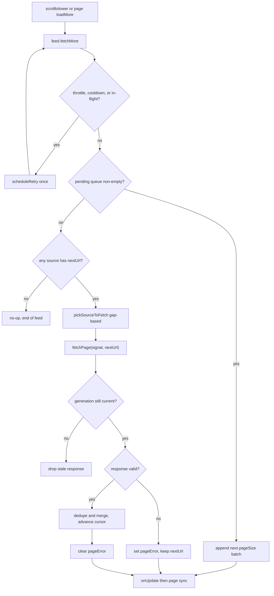
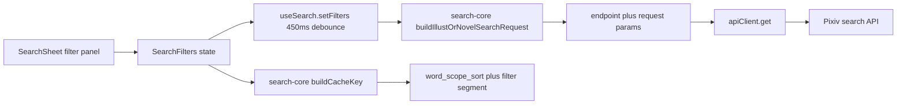

# Feed & Browsing

This page documents how the Pictelio **app-lynx** client discovers and browses Pixiv illusts and novels. app-lynx is the repository's **only runtime client**: the former SolidJS + Capacitor webview client (`packages/app`) was deleted in [ADR-0203](../../docs/adr/ADR-0203-webview-client-source-removal.md) (its Android host moved to `packages/android-host`, and its OAuth credentials/version facts moved to app-lynx). See [CONTEXT-MAP.md](../../../CONTEXT-MAP.md) and [`packages/app-lynx/CONTEXT.md`](../../../packages/app-lynx/CONTEXT.md) for the client-level domain language.

Consequently the webview-era home C-shell ([ADR-0075](../../docs/adr/ADR-0075-home-c-shell-fixed-layout.md)) and self-built → TanStack Virtual migration ([ADR-0096](../../docs/adr/ADR-0096-virtual-scroll-migration.md)) are historical. Their surviving decisions are: **fixed layouts with no user-configurable layout mode**, and **engine virtualization instead of a self-built JS virtualizer** — lynx realizes these with a native `<list>` waterfall for illust lists, single-column lists for novels, and a hand-rolled swipe carousel for the discover page.

## Navigation & feed surfaces

Navigation is a global **radial FAB** (ADR-0120), not a bottom navigation bar. It opens a double-ring menu: the outer ring carries the four top-level tabs, the inner ring carries the active page's refresh/back-to-top actions. After the [ADR-0218](../../docs/adr/ADR-0218-app-lynx-top-nav-user-question-dimension.md) dimension rework the four tabs are **发现 / 更新 / 书架 / 我的** (`/discover`, `/updates`, `/shelf`, `/me`); illust/novel became in-page secondary tabs rather than top-level destinations.

The browsing routes relevant to this page:

| Route | Page | Content |
|-------|------|---------|
| `/discover` | `pages/Recommended.vue` | Mixed illust+novel single-card carousel, in-page `all/illust/novel` tabs |
| `/illusts` | `pages/IllustList.vue` | Illust waterfall, `recommend/follow` sub-tabs |
| `/novels` | `pages/NovelList.vue` | Novel single-column list, `recommend/follow` sub-tabs |
| `/following` | `pages/Following.vue` | Followed users |
| `/user/:id` | `pages/UserHome.vue` | User profile + works |
| `/bookmarks` | `pages/Bookmarks.vue` | Own bookmarks, `illust/novel` tabs |
| `/ranking` | `pages/Ranking.vue` | Ranking page (mode + date) |
| `/illust/:id/tag-neighbors` | `pages/TagNeighbors.vue` | Explainable similar-works search |
| `/mute-tags` | `pages/MuteTags.vue` | Tag-mute management |
| `/watchlist` | `pages/Watchlist.vue` | Series watchlist |
| `/later` | `pages/WatchLater.vue` | Watch-later local snapshots |
| `/shelf` | `pages/Shelf.vue` | Aggregated bookmarks / watch-later / continue-reading |

All list pages render through the shared `RefreshableList` container (the only legal refresh/back-to-top FAB carrier), `FeedListFooter` (three-state footer), and a page-level first-load skeleton driven by `deriveFirstLoadView` (ADR-0150): the skeleton shows while the first source has not yet *settled* (success — even 0 items — counts as settled; failure does not).

## Unified pagination: `createMixFeed`

The single deep module `packages/app-lynx/src/primitives/createMixFeed.ts` owns pagination for **all list feeds and the discover carousel** (IllustList / NovelList / Following / UserHome / Bookmarks, plus discover). [ADR-0104](../../docs/adr/ADR-0104-app-lynx-feed-pagination-convergence.md) migrated five hand-written `loadMore` implementations onto it and fixed the native "double-host URL" 404 (`rewriteUrl` now strips the domain from absolute Pixiv `next_url` before the native module prepends `apiBase`).

A `createMixFeed` instance hides the following coordination from pages:

- **Sources**: an array of `MixFeedSource { name, fetchPage(signal, nextUrl) }`; `fetchPage` returns `{ items, nextUrl }` (`nextUrl === null` = exhausted). `nextUrl` is the offset pagination cursor.
- **Merge modes**: default `ratio` (fixed-ratio alternation, `ratio=[4,1]` illust:novel); `time-merge` (global `create_date` descending interleave) used only by discover (ADR-0115).
- **Batch rendering**: first load and each `fetchMore` expose at most `pageSize=20` items to the render stream, buffering the rest in a `pending` queue (ADR-0060, avoids image-load storms).
- **Double debounce**: `throttleMs=800` + `cooldownMs=3000`, plus a one-shot retry timer that re-fires a `fetchMore` swallowed by the debounce — native `<list>` emits `scrolltolower` as a single low-frequency event, so a swallowed event would otherwise dead-lock the list. Retries notify the page via `onUpdate`.
- **Race protection (generation gate)**: `refresh()` bumps a `generation`; in-flight first-load/pagination responses whose generation no longer matches are dropped. A T6 change (ADR-0141 revision) adds an `AbortController` pool so `generation++`/`dispose()` also call `abort()` and the cancellation reaches `apiClient`/OkHttp, not just the JS state write.
- **Dedupe**: a `seen` key set drops duplicate keys across sources and pages.
- **Page-turn priority**: `pickSourceToFetch` chooses among non-exhausted sources by the gap between the target ratio share and the current rendered share ("fetch whichever kind is under-represented"), breaking ties by source order.
- **Error-slot separation**: `error()` is the first-load/refresh error (rendered as a full-page error state); `pageError()` is the pagination error (rendered inline at the list bottom, keeping loaded items and retaining `nextUrl` for scroll retry). `settled()` is the first-load settle flag for the skeleton↔empty-state switch.
- **Timeout and empty-page guards**: each page request is wrapped in a 15s `withTimeout`; a malformed (non-array) `items` response is treated as failure rather than silently rendering blank.

Pages are **thin ref-snapshot bridges**: they hold local `ref`s, call `feed.fetchMore()`/`feed.refresh()` from event handlers, and re-copy `items()/loading()/settled()/error()/pageError()/nextUrl()` in a `sync()`. Mode/tab switches (recommend↔follow, all↔illust↔novel, illust↔novel bookmarks) **dispose the old instance and rebuild** rather than mutating state — the old instance's in-flight requests and timers must be released so they cannot write stale data into shared refs.

```mermaid
flowchart TD
    P["scrolltolower or page loadMore"] --> FB["feed.fetchMore"]
    FB --> D{"throttle, cooldown, or in-flight?"}
    D -->|yes| R1["scheduleRetry once"] --> FB
    D -->|no| PEND{"pending queue non-empty?"}
    PEND -->|yes| APPEND["append next pageSize batch"] --> UPD["onUpdate then page sync"]
    PEND -->|no| HAS{"any source has nextUrl?"}
    HAS -->|no| NOP["no-op, end of feed"]
    HAS -->|yes| PICK["pickSourceToFetch gap-based"]
    PICK --> FETCH["fetchPage(signal, nextUrl)"]
    FETCH --> G{"generation still current?"}
    G -->|no| STALE["drop stale response"]
    G -->|yes| OK{"response valid?"}
    OK -->|no| PE["set pageError, keep nextUrl"] --> UPD
    OK -->|yes| M["dedupe and merge, advance cursor"] --> CLR["clear pageError"] --> UPD
```

*`createMixFeed` pagination: debounce/re-entry gates, generation-gated fetch, and the split first-load vs pagination error slots.*

The `createRankingFeed` wrapper reuses `createMixFeed` with a **single source** and adds `setQuery()` (dispose + rebuild) so the ranking page can switch `(mode, date)` with the same generation-gate semantics — see [Ranking](#ranking).

## Discover: the recommended carousel

`pages/Recommended.vue` (`/discover`) renders the mixed illust+novel feed as a **single-card swipe carousel** (ADR-0115), not a waterfall. `createMixFeed` is used with `merge: 'time-merge'` over two sources (illust `/v1/illust/recommended`, novel `/v1/novel/recommended`).

- **Hand-rolled swipe** (`components/CarouselSwiper.vue`): background-thread `@touchstart/@touchmove/@touchend` + a Vue reactive `:style` `translateX`, with px-based slide width and a `requestAnimationFrame` snap on release. The official vue-lynx "main-thread script" swiper tutorial renders blank on this project's native LynxView, so it is not used (ADR-0115 T5 revision). Snap uses a **1/3 screen-width threshold plus fling detection** (ADR-0118), replacing the earlier round-to-50% rule.
- **Infinite slide stream**: sliding near the end triggers `feed.fetchMore()`; there are no prev/next buttons. Refresh is a single M3 FAB action registered on the global radial FAB (not a pull-to-refresh gesture).
- **Cover proportional display**: covers fill width and keep their original aspect ratio (illust `width/height`, novel square 1:1); very tall covers fall back to `aspectFill` clipping. Viewport height is derived from `SystemInfo` minus the top bar/secondary tab bar, with a `__HOME_BLEED_HEADER__` variant zeroing the top-bar deduction (ticket #906).
- **Page-level scrim**: the title/author/tags/bookmark scrim is a single fixed overlay that reads the current slide index, **not** one scrim per slide — on native LynxView, `<text>` inside a translated flex-row is never rendered for non-first slides (a documented platform fact).
- **Restricted/AI/tag-mute filtering is render-layer**: `visibleItems` filters the data-layer stream with `isRestricted`, `shouldHideByAi`, and `isTagMuted`. The data is still loaded, so flipping a settings switch re-runs the `computed` without re-fetching (unlike list pages, restricted items are **skipped** here rather than shown as restricted cards).
- **Immersive skeleton**: when the render stream is empty and the source has not settled, the page shows a slide-shaped `CarouselSkeleton` (page-level first-load placeholder), never a bare loading label.
- A `refreshEpoch` bump remounts `CarouselSwiper` after refresh so it resets to the first slide (its internal offset/index are persistent refs).

## List feeds & virtualization

Illust and novel lists use native `<list>` engine virtualization (`list-type="waterfall"` for illusts, `list-type="single"` for novels), **not** a JavaScript virtualizer — there is no `@tanstack/solid-virtual`/`createFeedVirtualizer` in the lynx client. Two platform constraints shape every list page:

- **Epoch rebuild**: native `<list>` mis-handles structural in-place patches (mid-list insert = silently dropped, single remove = hole left behind, whole replace = index misalignment, per ADR-0107/ADR-0162). Pages therefore bump a `refreshEpoch` ref in the same tick data lands and bind it as `<list :key>` so the whole tree is replaced instead of patched. The same rebuild is how "back to top" is implemented (no JS scroll-to-offset API exists).
- **Full-list restricted rendering**: restricted entries are rendered in-flow as restricted cards (`RestrictOverlay` for lists, `RestrictedNovelCard` for novels) rather than filtered out; `pointer-events: none` does not work on native LynxView for full-screen overlays (ADR-0123), so overlays must be `v-if`-gated interactive surfaces or zero-size anchors.

A typical list page (`IllustList.vue`) combines:

- `createMixFeed` single source over `loadRecommended` / `loadFollow('public')` with `loadNext` for pagination.
- `visibleIllusts = useTagMuteVisible(useAiOnlyVisible(illusts))` — a **data-layer** filter for AI-`only` and tag-mute (these are "remove from render", unlike R18's mask).
- `RelatedInlineSection` rendered inside an anchor card via `related.rowFor(...)` (see [Related works injection](#related-works-injection)).
- `RankingEntryCard` injected atop the recommend sub-tab (see [Ranking](#ranking)).
- `RefreshableList` (FAB refresh + rebuild-to-top), `FeedListFooter` (loading / end-of-feed / inline pagination error), and `deriveFirstLoadView` for the skeleton/error/empty/content switch.
- `useHeroSource` for the thumbnail→detail continuity transition (ADR-0211).

`pages/Bookmarks.vue` additionally keeps a `removedIllustIds` hide-set so an un-bookmark action removes the card from the render stream without mutating the feed's internal state.

## Content control (R18 / AI / tag mute)

Content filtering is **account-scoped** and split into three predicates that live on `stores/settingsStore.ts` (pure functions over reactive refs, so toggling recomputes without refetch):

- **R18/R18G**: `show_r18_${uid}` / `show_r18g_${uid}` (default off). `isRestricted(item) = (!showR18 && x_restrict === 1) || (!showR18G && x_restrict === 2)`. The first-launch age-confirmation gate was removed in [ADR-0103](../../docs/adr/ADR-0103-account-scoped-content-settings.md). Lists render the full item and overlay a restricted card; detail pages use an absolute `RestrictOverlay`. Toggling the switch makes the mask disappear instantly.
- **AI three-state** ([ADR-0155](../../docs/adr/ADR-0155-ai-artwork-three-state-filter.md)): `ai_filter_mode_${uid}` ∈ `show | mask | only` (default `show`). `isAiWork` = `(illust_ai_type ?? novel_ai_type ?? 0) >= 1`. `mask` renders AI-restricted cards (`AiRestrictedIllustCard` / `AiRestrictedNovelCard`); `only` is the **only** AI state that removes items at the data layer (non-AI works are dropped); `show` does nothing.
- **Tag mute** ([ADR-0187](../../docs/adr/ADR-0187-tag-mute.md)): account-scoped `mute_tags_${uid}` storing a `string[]` of trimmed original `tag.name` values. `isTagMuted(item)` is an exact `tag.name.trim()` set membership test — **no** case folding, normalization, or `translated_name` matching. It is applied as **data-layer removal** (mute = invisible, unlike R18's mask) at each assembly point (feeds, bookmarks, search rows, related rows). It reads a **non-reactive snapshot** of the muted set so toggling does not hot-recompute an already-assembled list (which would trip the native list mid-remove bug); changes take effect on the next refresh/page append.

Account-scoped settings are written to the shared `CapacitorStorage` via `PictelioPrefs` (native) or `idbKV` (web-core), per the [ADR-0103](../../docs/adr/ADR-0103-account-scoped-content-settings.md) cross-engine contract. Logout resets the in-memory values to defaults without writing (ADR-0103 Q5).

## Search

Search is a **global bottom-sheet command palette** (`components/SearchSheet.vue`, 80vh panel) opened from the FAB and from tag-chip taps ([ADR-0132](../../docs/adr/ADR-0132-app-lynx-global-search.md), [ADR-0133](../../docs/adr/ADR-0133-app-lynx-tag-tap-search.md)) — there is no `/search` route. The state machine is `primitives/useSearch.ts`.

- **Debounce & race handling**: 300ms input debounce; every search trigger aborts the previous in-flight request and rotates a new `AbortController` (last-write-wins). Settled requests whose signal is aborted/disposed are silently dropped (no state write). IME composition is filtered out (`isComposing`).
- **Scopes & sorts**: `all | illust | novel` × `date_desc | date_asc | popular_desc`. `scope=all` issues illust and novel requests **in parallel** and merges them into one `create_date`-descending timeline (illust wins same-millisecond ties); single-scope keeps server order. A partial failure (one of two classes) keeps the successful class with a visible `console.warn`.
- **Pagination**: dual cursors (`nextIllustUrl` / `nextNovelUrl`); `loadMore` runs both in parallel for `all`. A failed page leaves `status='ready'`, keeps loaded results, sets `error` + `paginationError=true`, and does **not** advance the cursor — the UI shows an inline retry bar instead of a full error.
- **History**: `stores/searchHistoryStore.ts` persists a device-level (not account-scoped) 10-item `search_history` list in `idbKV`; writes happen only at commit points (enter / history-chip tap / result-row tap), never on intermediate input.
- **SSRF guard**: `api/search.ts` asserts a pagination `next_url` resolves to `app-api.pixiv.net` (or the local proxy prefix) before fetching; `rewriteUrl` normalization stays in `client.ts`.

### Advanced filters & `@pictelio/search-core`

Both clients share [`@pictelio/search-core`](../../../packages/search-core/) as the **zero-IO single source of truth** for search filter state and request construction (replacing ADR-0132's per-engine mirroring). The filter state `SearchFilters` has five dimensions: **period** (`any`/preset `1d|1w|1m|6m|1y`/custom range), **bookmark count band** (7 bands 10–29 … 1000+), **aspect ratio** (illust only), **min resolution** (illust only), and **AI override** (`follow | all | hide`, a per-search override that does **not** write back the account-level `ai_filter_mode_${uid}`).

- `buildParams.ts` constructs the endpoint and request params. `popular_desc` routes to `/v1/search/popular-preview/{illust,novel}` with **no `sort`, no pagination, and no bookmark band** (the server ignores it). `search_target` differs by class: a single-word illust query **omits** the parameter (omitting ≡ partial + title hits), while novels always send it (`partial_match_for_tags`, or `exact_match_for_tags` for multi-word queries). Period maps to `start_date`/`end_date`; bookmark maps to `bookmark_num_min/max`; ratio and min-pixels are illust-only.
- `filters.ts` normalizes untrusted URL input field-by-field (invalid → default) and exports `DEFAULT_SEARCH_FILTERS`, `BOOKMARK_BANDS`, `countActiveFilters`, `isDefaultFilters`.
- `urlCodec.ts` round-trips filter state through webview URL query keys (`fp/fd/fb/fr/fw/fa`); `cacheKey.ts` builds the result-LRU key `word_scope_sort + filter segment`.
- `ai.ts` `resolveAiMode(setting, override)` maps the per-search override to an effective `show|mask|only`; `fallback.ts` `filterByBookmarkBand` is the **client-side** bookmark-band fallback applied on non-popular paths (free accounts have the server-side interval silently ignored). lynx applies this in `useSearch.buildResults`, which also drops the band on the popular path (`#478`).

```mermaid
flowchart LR
    UI["SearchSheet filter panel"] --> FS["SearchFilters state"]
    FS --> UF["useSearch.setFilters 450ms debounce"]
    UF --> BUILD["search-core buildIllustOrNovelSearchRequest"]
    BUILD --> REQ["endpoint plus request params"]
    REQ --> GET["apiClient.get"]
    GET --> API["Pixiv search API"]
    FS --> KEY["search-core buildCacheKey"]
    KEY --> CK["word_scope_sort plus filter segment"]
```

*Search filter state fans out to two search-core derivations: request params (consumed by lynx `useSearch`) and the shared LRU cache key.*

lynx `useSearch` consumes `buildIllust/NovelSearchRequest` directly and deliberately does **not** memoize results (spec D2), so `buildCacheKey` currently survives in search-core as the shared cache-key contract used by its own tests and the (removed) webview client.

## Ranking

Ranking is a shared [`@pictelio/ranking-core`](../../../packages/ranking-core/) zero-IO package plus a thin page/wrapper in app-lynx.

- **Mode catalog** (`modes.ts`): 7 `RANK_MODES` — daily/weekly/monthly/rookie/original/R18/R18G — each with a client-stable `id` and a server `apiMode` string (`day`, `week`, `month`, `week_rookie`, `week_original`, `day_r18`, `week_r18g`). R18 uses `day_r18` and R18G uses `week_r18g` (server catalog asymmetry, not a typo).
- **Request & cache key**: `buildRankingRequest` emits `/v1/illust/ranking` with `mode` + constant `filter=for_ios`, omitting `date` when "today" (`date=null`). `rankingCacheKey` normalizes `null` and an explicit JST-today to the same `ranking_<mode>_today` segment. Date helpers are hand-written UTC arithmetic (JST boundary, **no `Intl`**, no local-timezone `new Date(iso)` drift).
- **Feed** (`primitives/createRankingFeed.ts`): a single-source `createMixFeed`; `setQuery()` disposes and rebuilds for a new `(mode, date)`. **Rank = render-stream index + 1**, because the single source is never re-sorted (no `create_date` merge path) — page order × within-page order is rank order.
- **Restricted vs muted** (`pages/Ranking.vue`): restricted (R18/R18G/AI) items are **kept and masked with rank preserved**; tag-muted items are assigned rank **first** (pre-filter index + 1) and then dropped, leaving rank holes that do not renumber later entries (ADR-0158 order-preservation spirit). The R18/R18G modes show a guidance notice instead of a normal empty/error state when empty or failed, with a link to Pixiv's web viewing settings.
- **Entry** (`components/RankingEntryCard.vue`): a "榜首编辑大卡" (top-3 editor card) injected atop the illust recommend tab. It carries only "today's daily ranking" and navigates to `/ranking`; mode/date state stays on the ranking page. No new top-level nav category exists for ranking (ADR-0158).
- The page has no calendar: lynx `input` supports only text/number/digit/password/tel/email, not `date`; date navigation is arrow-stepping bounded at "today".

## Bookmarks

`/bookmarks` renders own bookmarks with illust/novel sub-tabs, each a `createMixFeed` single source (`loadBookmarks(uid, 'public')` + `loadNext`). Un-bookmarking uses a local `removedIllustIds` hide-set rather than mutating feed state.

Bookmark toggling is `components/BookmarkButton.vue`: a **single tap is a fast bookmark** (zero decisions, optimistic with rollback), a **long-press opens `BookmarkPanel.vue`** (detail pages, both clients) for visibility + tags + inline tag creation ([ADR-0160](../../docs/adr/ADR-0160-illust-bookmark-tags.md)). Tags are space-joined into a single `tags[]` form field and re-sent with the full tag set via `bookmark/add` (no delete-then-add; no edit endpoint exists). Prefill combines `/v2/illust/bookmark/detail`, `/v1/user/bookmark-tags/illust`, and the work's own tags, capped at 10.

## Related works injection

`stores/relatedInjection.ts` injects Pixiv-official `/v2/illust/related` results after an anchor illust. Clicking a card records a one-shot `{tab, illustId}` pending anchor; on page re-activation (`onActivated`, KeepAlive) the page consumes it, fetches `loadRelated`, and renders an **inline expanding section inside the anchor card** (`components/RelatedInlineSection.vue`). This inline-in-card form (ADR-0162) replaces the v1 interleaved-row approach because native waterfall lists **silently drop mid-list insertions**. Constraints: max 3 anchors per tab, 20 items per row, 5-minute related cache (50-entry cap), dedupe against the anchor and already-shown IDs, and a filter chain of `isRestricted + isAiRestricted + isTagMuted`. The `relatedInjection` settings switch gates the whole feature.

## Tag neighbors (ADR-0197)

`/illust/:id/tag-neighbors` (`pages/TagNeighbors.vue`, `primitives/collectTagNeighbors.ts`, `stores/tagNeighbor.ts`) is the **explainable** in-Pixiv similar-works search — a complement to, not a replacement for, the black-box official `/v2/illust/related`. It uses the work's tag combination, progressively relaxing from the tail of the API's association-ordered `tags` array:

1. **Author-first**: pull the author's recent ≤300 illusts via `/v1/user/illusts` (items already carry tags — no per-illust detail requests), compute local **Jaccard ≥ 30%**, take top 20.
2. **Global fallback**: only when phase 1 yields < 5 items, search Pixiv with the first `n`, then `n-1`, … tags until a layer returns ≥ 5; each layer is one request, results accumulate, and the strictest match is presented first.

All queries use raw `tag.name` (never `translated_name`, which is frequently absent), never mix in author names (`/v1/search/illust`'s `word` only matches tags), and reuse `@pictelio/search-core`'s `buildIllustSearchRequest`. Results are de-duplicated across phases, exclude the current work, show a Jaccard + "common-tags/total-tags" + source attribution line, and pass the R18/R18G/AI/tag-mute gate with a **visible count** of hidden items rather than silent filtering (ADR-0197 correction 2). This replaced the off-site source-tracing direction (ADR-0196, superseded) because Pixiv's image host enforces Referer, making engine-side URL pulls non-viable.

## Adjacent browsing surfaces

These local/aggregate surfaces sit next to the feed system (full store detail is out of scope here):

- **Shelf** (`/shelf`): an aggregated "书架" of three preview segments — Pixiv bookmarks, watch-later, and continue-reading + browsing history.
- **Watch later** (`/later`, `stores/watchLaterStore.ts`): local snapshot items (illust + novel) under account-scoped `watch_later_${uid}`, 500-item cap, zero-network full render, no R18 overlay on snapshot cards (snapshots lack full work data).
- **Series watchlist** (`/watchlist`, `stores/watchlistStore.ts` + `createWatchlistPrompt`): novel series follow state, with a back-key prompt and session-level dismissal memory.
- **Continue reading & browsing history** (`/continue` and shelf segment 3): `continueReadingStore` (novel reading position) and `browsingHistoryStore` (illust-only behavior log, `browsing_history_${uid}`, 300-item cap, 30-day per-item expiry) are physically separate stores merged only for display.

## Key source files

| Purpose | Path |
|---------|------|
| Unified feed pagination deep module | `packages/app-lynx/src/primitives/createMixFeed.ts` |
| Discover carousel page | `packages/app-lynx/src/pages/Recommended.vue` |
| Illust list page | `packages/app-lynx/src/pages/IllustList.vue` |
| Novel list page | `packages/app-lynx/src/pages/NovelList.vue` |
| Bookmarks page | `packages/app-lynx/src/pages/Bookmarks.vue` |
| Ranking page | `packages/app-lynx/src/pages/Ranking.vue` |
| Ranking feed wrapper | `packages/app-lynx/src/primitives/createRankingFeed.ts` |
| Global search sheet | `packages/app-lynx/src/components/SearchSheet.vue` |
| Search state machine | `packages/app-lynx/src/primitives/useSearch.ts` |
| Search API adapter / SSRF guard | `packages/app-lynx/src/api/search.ts` |
| Content-control predicates + settings | `packages/app-lynx/src/stores/settingsStore.ts` |
| Search history | `packages/app-lynx/src/stores/searchHistoryStore.ts` |
| Related-works injection | `packages/app-lynx/src/stores/relatedInjection.ts` |
| Related inline section | `packages/app-lynx/src/components/RelatedInlineSection.vue` |
| Tag neighbors page / core | `packages/app-lynx/src/pages/TagNeighbors.vue`, `packages/app-lynx/src/primitives/collectTagNeighbors.ts` |
| Shared search core | `packages/search-core/src/` |
| Shared ranking core | `packages/ranking-core/src/` |
| Refresh/back-to-top container | `packages/app-lynx/src/components/RefreshableList.vue` |
| Three-state list footer | `packages/app-lynx/src/components/FeedListFooter.vue` |
| First-load view derivation | `packages/app-lynx/src/utils/firstLoadView.ts` |
