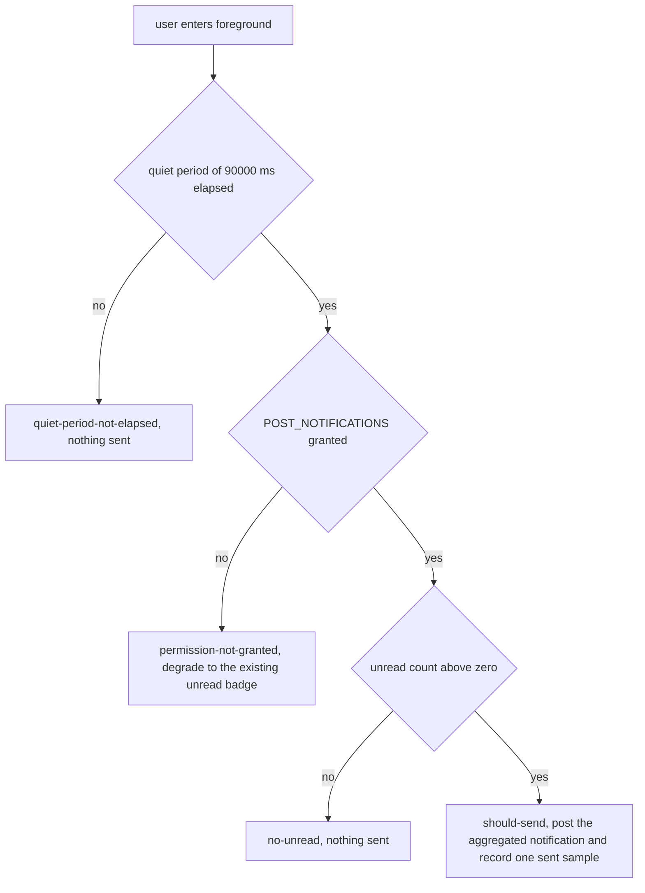
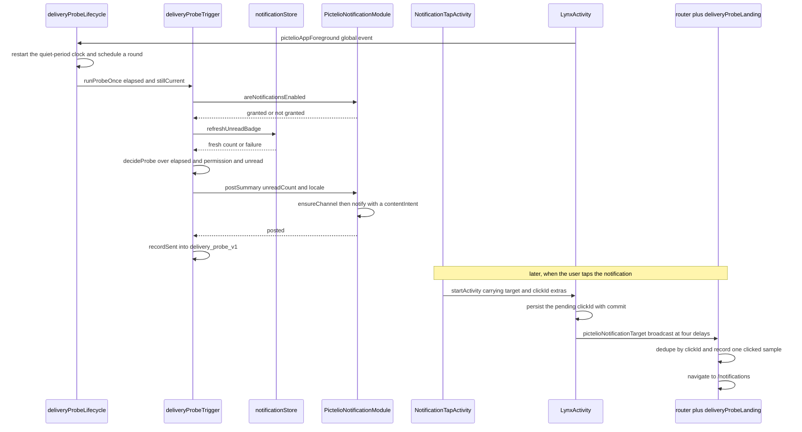

# Notifications & Delivery Probe

Two related but differently motivated things live under "notifications" in Pictelio:

1. **The in-app notification center** — a pull-based `/notifications` page that lists Pixiv server notifications, expands grouped entries inline, derives an unread badge from a device-local read timestamp, and routes `target_url` taps to in-app pages. It is a shipped product surface ([ADR-0188](../../docs/adr/ADR-0188-notification-center.md)).
2. **The delivery probe** — a *measurement*, not a feature ([ADR-0220](../../docs/adr/ADR-0220-notification-delivery-channel-probe.md)): while the user is in the foreground and has not looked at updates for a quiet period, the app posts **one aggregated local system notification** and counts how many rounds were sent and how many notifications were tapped. Counts stay on the device; the verdict is qualitative by construction.

The probe uses the notification center's unread state as its trigger input and the notification center page as its landing target, which is why the two share one page. Terminology (system notification vs. notification-center item vs. push) is fixed in [`docs/adr/glossary-notification-center.md`](../../docs/adr/glossary-notification-center.md); the wording there is load-bearing because all three words mean something different here.

ADR-0188 designed the center for two clients (WebView + Lynx). The WebView client was deleted in [ADR-0203](../../docs/adr/ADR-0203-webview-client-source-removal.md), so what remains is the Lynx client (`packages/app-lynx`) plus its host (`packages/android-host`), and the "both ends byte-identical" contract tests were rewritten as single-end contracts — `utils/notificationText.ts` explicitly says it may no longer call itself a differential test.

## In-app notification center

### Endpoints and data layer

`api/notification.ts` wraps exactly two GET endpoints, both confirmed by a 2026-09-26 live capture whose sanitized fixtures live in `api/__fixtures__/`:

- `loadNotifications(nextUrl?)` → `GET /v1/notification/list` for the first page, then transparent `next_url` passthrough.
- `loadNotificationChildren(id, nextUrl?)` → `GET /v1/notification/view-more` with `notification_id` required and the `older_than` cursor arriving inside the server's `next_url`.

Both return the same `PixivNotificationListResponse` envelope and inherit the gateway's URL normalization, bearer gating, error classification and 401 single-flight for free (see [API Layer](../architecture/api-layer.md)); no Java change was needed because `PictelioApiModule.request` forwards an arbitrary path with no whitelist. Response types are deliberately permissive — every field except `id` and `created_datetime` is optional — so a new server-side notification `type` cannot break parsing; rendering depends on `content.text`, and `type` is a hint only.

`stores/notificationStore.ts` splits into **testable pure functions** (`parseCreatedTimeMs`, `countUnreadNotifications`, `flattenNotifications`, `isGroupHeader`, `buildNotificationRows`) and the Vue Query consumption surface (`useNotificationsList`, `useNotificationChildren` under `queryKeys.notifications.*`). The pure half exists so ordering and unread truth tables can be unit-tested in node without a component context.

### Rows, group expansion, text and thumbnails

`view_more != null` marks a **group header** (e.g. "フォローされた"). `buildNotificationRows` produces a flat row model of `header` / `item` rows with stable keys (`h-{id}` / `n-{id}`); expanding a header only flips a boolean on an existing row, so the row count never changes. The expanded child list renders **inside the header row's own `list-item` root view** (`components/NotificationChildren.vue`), because inserting a new `list-item` into a native `<list>` mid-flight is documented in this repo as "insert = silently dropped" ([ADR-0162](../../docs/adr/ADR-0162-lynx-related-inline-section.md) style structural avoidance). Expansion is one-way — there is no collapse — which removes insert/remove state management entirely. `NotificationChildren` owns its own infinite query and uses plain views only, since `list-item` semantics cannot nest inside an item.

`utils/notificationText.ts` (`notificationPlainText`) strips every tag while keeping inner text, decodes a fixed subset of HTML entities in a **single pass** (so `&amp;lt;` decodes one level, matching DOM semantics), trims, and maps null/undefined to `""`. The result is plain text; no HTML fragment is ever handed to a rendering channel. The `Updates` page and the notification page deliberately share this one function so their wording cannot drift.

Thumbnails go through `utils/imageUrl.ts#proxyImageUrl`: `i.pximg.net` content thumbnails are rewritten to the local `/pixiv-img/` path, other trusted `*.pximg.net` hosts (the public `s.pximg.net` icons) are passed through unchanged, untrusted hosts become empty strings, and a failed load hides the image area for that row (no placeholder card, no retry storm). Row rendering prefers `content.left_image` and falls back to `content.left_icon`.

### `target_url` routing

`utils/notificationTarget.ts` is a pure resolver plus a thin runtime jump layer. `pixiv://users/{id}` → `/user/{id}`, `pixiv://illusts/{id}` → `/illust/{id}`, `pixiv://novels/{id}` → the novel entry point (`openNovel`, so the intro-page setting is respected), `http(s)://` → the system browser, and anything else — unknown scheme, unknown `pixiv://` host segment, non-numeric or empty id — is **silently ignored** rather than thrown. Parsing is string-based on purpose: the Lynx URL polyfill has no working `hostname` ([ADR-0163](../../docs/adr/ADR-0163-qa-defense-lines.md)). Trailing `?query` / `#hash` is stripped before the numeric check, so the server can add parameters without breaking routing.

### Unread, badge, and the read-memory invariant

Unread is derived **locally**, never from the server's `is_read` (Pixiv exposes no mark-read endpoint; its `is_read` flips server-side after a view-more expansion and is deliberately not consumed). The rule is one comparison against the device-level key `notifications_last_read_time`:

- `countUnreadNotifications(items, lastReadMs)` parses each `created_datetime` (+09:00 ISO) to milliseconds, counts entries **strictly later** than the read timestamp, counts every parsable entry when the key is missing, and **excludes** an entry whose timestamp fails to parse while logging a warning — the repo bans silent degradation, so a bad server value must not look like "no unread".
- The key is written **only after a successful notification-list fetch**: `Notifications.vue` watches `list.isSuccess` and calls `notifyListLoaded(true)`, which writes the current timestamp and zeroes the badge; a failed write warns and leaves the old value (unread is never lost), and a failed fetch never advances it.
- `refreshUnreadBadge()` fetches page 1 through the shared infinite query key and recomputes the count. **It returns a boolean on purpose**: on failure the store keeps the *previous* count and returns `false`, so any caller that treats the count as fresh input must check the return value first.

**Invariant: posting a probe system notification must not advance the read memory.** The probe's notification is a reminder to go look, not a read; advancing the timestamp would zero the badge and erase the probe's own comparison baseline. `deliveryProbeTrigger.ts` never calls `markNotificationsRead`, and the contract gate asserts that this stays true.

Read points for the badge value: the global radial FAB's `navBadge` for the `updates` ring item (`stores/globalFab.ts`), the Me entry row's dot, and the Updates page's third segment capsule. Because a badge with no per-session read point would be permanently zero, `App.vue` triggers one `refreshUnreadBadge()` at cold start, and `Me.vue` refreshes it in `onActivated` (Me is inside the KeepAlive `:include`, where `onMounted` fires once per session — see [App Shell & Navigation](../architecture/app-shell-and-navigation.md)).

### The Updates page's notification segment

`pages/Updates.vue` shows a preview of the notification list and is *not* the notification center. Two traps are documented there and in ADR-0220 §6:

- It reuses the **store's** query cache (`useNotificationsList()`) instead of calling the endpoint again, so the badge count and the page preview come from one response rather than two.
- It derives unread with the same rule but into a **page-local** `unreadCount` ref, which is *not* `notificationStore.unreadCount`. The degradation path and the probe must read the store's value; wiring the local one is the explicitly flagged mistake.

## Delivery probe

### What is being measured

ADR-0220 reframes the old "Phase 2: system notifications" backlog item as an **experiment**. Acceptance is *one decidable data point* — "does the user want this receipt?" — not "notifications work", because a feature-shaped acceptance criterion drifts toward "it works", and "it works" cannot demonstrate "it is wanted". The probe:

- measures only `clicked ÷ sent` and compares it against how often the user opens the app by themselves (a ratio is self-calibrating; absolute thresholds are guesses);
- sets **no statistical threshold**: with roughly five app opens a day, of which most are filtered by the quiet period, a single user yields on the order of 14 sent samples a week — this cannot separate 20% from 40%, and no experiment duration fixes it, because a single user's sample ceiling *is* their open frequency;
- therefore produces **qualitative** verdicts only. "Nobody clicked" can argue against building server-side push; "somebody clicked" **cannot be generalised**, and the probe deliberately does not cover the "app long unopened, user called back from the tray" moment that server push actually addresses.

### Trigger: foreground event plus quiet period

The shape is "entered foreground + quiet period elapsed", **not** `WorkManager` scheduling. Background periodic work may not run for hours under Doze, which would distort the time distribution of sent samples on which a ratio-based verdict depends; and background scheduling costs a persistent/foreground service and its permissions.

The Lynx side has no window-focus event (the query client therefore sets `refetchOnWindowFocus: false`), so "the user is not actively looking" is approximated from lifecycle events:

- The host sends `pictelioAppForeground` in `onResume` and `pictelioAppBackground` in `onPause` via `sendGlobalEvent` — the same mechanism as the insets / dark-mode events, and explicitly not a new paradigm. `LynxView.onEnterForeground()` does not become a JS event, and no debounce is applied (resume/pause are paired; re-entering the foreground is *supposed* to restart the clock).
- `utils/deliveryProbeLifecycle.ts` subscribes to both, records the foreground instant, and schedules one round `QUIET_PERIOD_MS` (90 s) later; going background drops the instant, cancels the timer, and invalidates the round. Re-scheduling replaces rather than queues, so repeatedly switching foreground does not accumulate pending rounds.
- **Cold-start backfill is mandatory**: Android's `onResume` precedes JS mount, so the first foreground event is always lost in push-only mode, leaving the clock null and the probe permanently silent with no warning. On subscribe, the module therefore treats "subscribed" as "currently foreground", records the instant **and schedules a round** — both foreground paths schedule, which the contract gate pins separately.
- Every foreground/background transition increments a **generation counter**; a scheduled round captures it and re-checks it after *each* await (permission query, unread refresh), so a round in flight when the user leaves is abandoned instead of posting later. "Is the app currently foreground?" is insufficient: after leaving and returning it is true again, and the stale round would double-post.



The decision chain is a pure function, `decideProbe`, and the order *is* the semantics: quiet period first, then permission, then unread. Ordering it differently would surface "permission not granted" at the moment the user just opened the app and mask the real stage. Both inputs are external and must not be invented locally: permission comes from the host query (JS has no API for it), unread comes from **the notification store's** `unreadCount` via `refreshUnreadBadge()`, whose return value is checked so a failed refresh is treated as "no unread" rather than as a stale count. Every round logs its decision whether or not it sends — without that, a report cannot distinguish "nobody clicked" from "nothing was ever sent".

### The notification

One poll produces **one** notification, counted as one sent sample regardless of how many updates that batch contains. The aggregated form's click-through rate is an **upper bound** on a per-item form, which is the right thing to measure first: if the upper bound is low, the whole route can be dropped. The body states only the count — never the notification text, which is Japanese HTML that would both leak and be unreadable in a tray.

Text and channel names are assembled **in the host** (`PictelioNotificationModule.summaryText` / `channelName` / `channelDescription`) from a locale string that JS passes in ("zh-CN" / "en", unknown values fall back to the Chinese wording). JS cannot post notifications, and keeping the wording table in the host keeps the "count → wording" rule testable on the JVM side. The channel id is `pictelio_delivery_probe` and the notification id is a fixed value, so consecutive rounds overwrite each other instead of stacking — the probe cares about delivery, not about accumulating tray entries. Android 8+ silently drops notifications whose channel was never *registered*, so `ensureChannel` must actually call `createNotificationChannel`, not merely construct the object; the contract gate and a mutation fixture both target that distinction.

### Permission track

The module only *queries* permission (`areNotificationsEnabled`, backed by the real `NotificationManager.areNotificationsEnabled()`) and **never requests** `POST_NOTIFICATIONS`: querying plus degrading to the already-shipped unread badge costs nothing new, whereas a permission dialog would make the decision for the user and a second prompt is harassment. A query failure resolves as "not granted" (the degrade path) with a warning, and the native callback contract forbids passing `null` (it crashes the callback implementation). Consequence, registered as a known limitation: on a fresh install, `POST_NOTIFICATIONS` is not granted and there is no in-product path to acquire it, so the probe is structurally data-free unless permission is granted out of band; the device evidence the ADR cites came from a manual `pm grant`.

### Counting storage

Counts are one JSON value under the key `delivery_probe_v1` in the shared preference file (`CapacitorStorage`, via `PictelioPrefsModule` on device, IndexedDB in dev) — no new storage module, keyed without a uid because this is device behaviour, not account data. A single JSON value rather than three keys exists so that "reset" can clear only the counters and keep `startedAt` in one atomic write:

- `{ sent, clicked, startedAt }`; `startedAt` is stamped on the first send so an empty round does not pollute the timeline.
- `resetRound()` clears `sent` and `clicked` and **preserves `startedAt`**, which is what lets successive rounds form one continuous timeline.
- Missing, malformed, or partially malformed values fall back per field with an explicit warning; a silent fallback would let a read failure be read later as "zero sends, therefore nobody clicked" — the exact confusion the probe exists to avoid.
- **Single-writer invariant**: only JS writes the key. The contract gate scans both host sources to assert the native side never touches it, because two writers would produce two half-truths about the same counter.
- There is no product UI for reading (or calling `resetRound()`); `resetRound()` currently has no production call site, so starting a new round means editing the stored value by hand. The read path is an operator recipe:

```bash
ADB=~/Library/Android/sdk/platform-tools/adb
# counters — note &quot; is XML-layer escaping, while JS receives real quotes
$ADB shell run-as io.pictelio.app cat shared_prefs/CapacitorStorage.xml \
  | grep -o '<string name="delivery_probe_v1">[^<]*'
# was the permission actually granted
$ADB shell dumpsys package io.pictelio.app | grep POST_NOTIFICATIONS
```

The native bridge returns strings JSON-quoted by the Lynx callback, so the JS side must run `unquoteNativeString` before `JSON.parse` — the same trap as refresh-token storage. The report tests carry device-original counter JSON specifically because mixing the XML escape layer with the callback quoting layer silently turns 16 sends into 0.

### Click landing

The tap path is where three platform constraints meet: a tap must execute *at tap time*, it must be able to launch the app under Android 10+ background-Activity-launch restrictions, and JS must not count the same tap four times.



The notification's `PendingIntent` targets `NotificationTapActivity`, a `NoDisplay` Activity that only forwards: it is the one place that can run at tap time *and* is exempt from the background-launch restriction because the system started it. It copies the click id into the Lynx activity's launch intent (missing that copy would make every click share the dedupe key `0`, so the first click counts and all later ones are swallowed — a suspiciously real-looking zero click rate).

`LynxActivity` persists the pending click id synchronously (`commit()`), then broadcasts `pictelioNotificationTarget` at four fixed delays (1.5 / 3 / 4.5 / 6 s) because bundle rendering can be slower than a single broadcast; a probe-era review found both "smart" broadcast-count criteria wrong, so the count is now fixed and the redundant arrivals are absorbed by dedupe. On the JS side `deliveryProbeLanding.ts` subscribes to the event, dedupes by click id in a bounded window, records one click, and the router navigates to `/notifications` with **push, not replace** — the back decision reads a session mirror stack, and `replace` would leave back presses unable to leave the page. This landing chain is deliberately **not** behind `__BENCH_NAV__` / `BuildConfig.DEBUG` (that gate removes the bench deep-link chain from release builds), and it reuses the bench chain's technique rather than its gate.

The four broadcasts can all land before JS subscribes. Broadcasts alone therefore cannot be the only mechanism: the host also writes the pending click id to preferences, and the router **pulls** it once after subscribing — the same "events for while it is running, pull for the ones you missed" pattern the safe-area and dark-mode channels already use. One caveat worth carrying forward: the host writes that pending id into the `CapacitorStorage` preferences file, while `pullPendingClick` reads it through `idbGet`, the IndexedDB KV store. The contract gate pins the key string and the existence of both halves, but not that the two sides agree on a store, so this half of the chain deserves device evidence before it is trusted.

Warm-start taps go through `onNewIntent`, which must call `setIntent(intent)` — without it `getIntent()` keeps returning the launch intent, the click extras are dropped silently, and the tap looks broken (ADR-0220 §6-3 named this mechanism in advance).

### Why cold and warm clicks are not separable

The counter stores only a total `clicked`. An earlier design had `clickedCold` / `clickedWarm`; it was withdrawn after four candidate in-process criteria were falsified on device — lifecycle callback type, an in-process static flag, a persisted "is foreground" marker, and process lifetime. All four fail for the same reason: handling the tap *is* the state transition, so any observation taken while handling it is polluted by the thing being observed. Keeping a plausible-looking but untrustworthy split is more dangerous than keeping only the total, because a report reader will inevitably treat it as measured. Consequence for interpretation: `clicked` means "the user tapped the notification", and the report may not present it as the share of users "called back" from the tray.

### The report and its constraints

`utils/deliveryProbeReport.ts#buildProbeReport` turns the counters plus a permission state into a verdict, with the honesty rules encoded rather than left to the reader:

- The rate is `null`, never `0`, when nothing was sent (or when `clicked > sent`). "0%" can mean "30 sent, nobody clicked" or "nothing was ever sent" — opposite conclusions from an identical-looking number. Supplying a numeric `0` there would be the single easiest way to invert the experiment's answer.
- `verdict` is `no-data` / `not-clicked` / `clicked`, and `no-data` takes precedence: it covers a zero denominator *and* a permission state of `denied` (no permission implies nothing could be posted, so the counters cannot be trusted at all).
- Permission has **three** states — granted / denied / **unknown** — because "the host module is unavailable or the query failed" is not the same claim as "the user refused". Writing unknown as denied would record a probe fault as a user's decision.
- Contradictory input (permission denied yet sends recorded, or clicks exceeding sends) is surfaced as `anomalies` and blocks a "nobody clicked" verdict rather than being averaged away.
- Four fixed caveats ship with every report, in stable order: this is a qualitative observation with no statistical significance; the shape does not cover "app long unopened, called back from the tray", so a "nobody clicked" verdict may not be used to reject server push; a "somebody clicked" result is not generalisable; and clicks cannot be split into warm/cold. They are the conclusion's applicability boundary, not boilerplate.

### Operating the probe

Posting is logged for every round (`deliveryProbe` tag) with the decision reason, and the notification module logs failures explicitly; the tray itself can be inspected with `dumpsys notification` for the `pictelio_delivery_probe` channel. A round-sensitive state coupling must be respected between rounds: the landing page is the notification center, whose successful fetch advances the read memory, so unread drops to zero and the next round decides `no-unread` and never posts. Starting a new round therefore requires rewinding `notifications_last_read_time` (the e2e gate does this as "step 0") as well as resetting the counters. The same coupling means an e2e run changes the product state it is measuring.

## The native channel

Everything the JS side cannot do itself is a thin Lynx bridge plus one Activity:

- **`PictelioNotificationModule`** — two `@LynxMethod`s, `areNotificationsEnabled` and `postSummary`, registered as `PictelioNotification` in `LynxRuntimeInitializer` together with the other bridges (the module map lives in [Android Native & Build](../integrations/android-native.md)). It never requests permission and never writes counters.
- **`NotificationTapActivity`** — declared in the manifest with `exported="false"`, `excludeFromRecents`, `noHistory` and `Theme.NoDisplay`; `exported=false` matters, since an externally callable launcher would let other apps forge taps and inflate the click count.
- **The manifest** declares `android.permission.POST_NOTIFICATIONS` (without the declaration a runtime request could not succeed; the probe itself never requests it) — see [Release & Deploy](../operations/release-and-deploy.md) for how the manifest is packaged.
- **`LynxActivity`** owns the lifecycle events, the tab extras, the pending-click key and the four broadcast delays; those constants are explicitly *not* dev extras, because the landing chain must work in release.

## Cross-side contract

The JS and Java halves meet at string and name boundaries, and `src/stores/deliveryProbeContract.test.ts` is the gate that pins them: it reads the host Java/XML sources, strips comments (block, XML, then line, in that order), and asserts **both sides** contain each symbol. The pinned symbols are:

| Symbol | JS side | Host side |
| --- | --- | --- |
| `pictelioAppForeground` / `pictelioAppBackground` | `EVENT_APP_FOREGROUND` / `EVENT_APP_BACKGROUND` in `deliveryProbeStore.ts` | `sendGlobalEvent` calls in `LynxActivity.onResume` / `onPause` |
| `pictelioNotificationTarget` | `EVENT_NOTIFICATION_TARGET` in `deliveryProbeLanding.ts`, subscribed in `router.ts` | `LynxActivity.EVENT_NOTIFICATION_TARGET`, broadcast four times |
| `delivery_probe_v1` | `DELIVERY_PROBE_KEY` (single writer) | must **not** appear in any host source |
| `delivery_probe_pending_click` | `PENDING_CLICK_KEY`, read via `pullPendingClick` | `LynxActivity.KEY_PENDING_NOTIFICATION_CLICK`, written with `commit()` |
| `pictelio_notification_target` / `..._click_id` | payload consumed by the router | extras on the tap and launch intents |
| `PictelioNotification` + `areNotificationsEnabled` / `postSummary` | `mod.*` calls in `deliveryProbeTrigger.ts` | `@LynxMethod` declarations in the module |
| channel registration and permission | — | `createNotificationChannel(` call + `POST_NOTIFICATIONS` declaration |

The event names are extracted **from the JS source** rather than hard-coded in the test, so renaming on one side turns the gate red instead of passing by substring accident. Each detector ships with a fixture self-check (a realistic fixture must match, a comment-only fixture must not), and the method-name assertion compares the full expected set of calls, not one-directional containment — the file records the mutations that made those distinctions necessary. The same discipline explains why some assertions pin "the notification has a `contentIntent` with a `clickId`": the earlier version pinned the *absence* of a click intent as a tripwire for exactly this work.

Focused tests, in the tiers described by [Testing Overview](../testing/overview.md):

- **JS unit** — `notificationStore.test.ts` (unread/unread-advance and badge behaviour), `deliveryProbeStore.test.ts` (count parsing, field-level fallback, reset semantics, the decision chain and its ordering), `deliveryProbeReport.test.ts` (verdict honesty, plus device-original counter JSON), `deliveryProbeLanding.test.ts` (dedupe window, one click counted once), `notificationTarget.test.ts`, `notificationText.test.ts`, `api/notification.test.ts` (captured fixtures, both endpoints, error path) and the page template gates.
- **JVM/Robolectric** — `PictelioNotificationModuleTest` drives the package-visible static seams and asserts against the *system* notification table and channel table (not "the call did not throw"): count wording, zero-count wording, localized channel naming, overwrite rather than stack, permission reflecting the system switch, and a non-null `contentIntent` carrying the click id. `NotificationTapActivityTest` covers the forwarding extras.
- **Android e2e (manual release gate, not in CI)** — `tests/android-e2e/specs/delivery-probe-cold-start.spec.ts` logs in, rewinds the read memory, waits through the quiet period for the notification, `am kill`s the process, taps the notification by screen-relative coordinates, and asserts from **native log lines** that the landing was dispatched, broadcast four times, and counted once. Its header registers the honesty limits: the tap coordinate can drift with tray contents, the spec stalls by design when permission was never granted, `am force-stop` would clear the notification (so `am kill` is required), and the 90 s quiet period makes a single run take minutes. It is explicitly an addition to the unit and contract gates, not their replacement — the ADR's own retrospective credits this e2e run with four real defects that no green unit test or source-shape gate could see, because they ask whether the event actually arrived, when the subscriber mounted, and how many clicks were counted.

## Known limits and risks

- **Permission is never requested.** On a fresh install the probe produces no data and there is no in-product path to grant it; the device evidence behind ADR-0220 comes from a manual `pm grant`. For a single-user probe this is acceptable; shipping this shape to ordinary users would require an acquisition path first.
- **Coverage is deliberately narrow.** The probe only samples "the user came back to the app and did not immediately go look at updates". It cannot answer "do users want update reminders" in general, and a "nobody clicked" verdict may not be used to reject server push, which lives in the excluded scenario.
- **Sample ceiling.** One user yields too few sent samples for any statistical claim; verdicts stay qualitative, and the report says so structurally.
- **The landing page mutates the probe's input.** Landing in `/notifications` advances the read memory, so rounds contaminate each other; a new round needs both a counter reset and a rewound read timestamp, and `resetRound()` has no production caller.
- **The pull half of the click landing is unproven on device.** The host's pending-click write goes to preferences while the JS pull reads IndexedDB, and the gate does not pin that alignment.
- **The quiet period is an approximation.** With no window-focus event on the Lynx side, "the user is not looking" can only be approximated by lifecycle events plus 90 seconds.
- **Content coverage.** The captured samples only contain notification types 7 and 8; rendering deliberately depends on `content.text` and tolerates unknown types, but new type semantics are unverified. Rich text, translation, R18 thumbnail masking, collapse, the announcement surface (`/v1/info/latest`) and server-side read reporting are all out of scope, as is any behaviour change to the delivered unread badge.

## Related pages

- [API Layer](../architecture/api-layer.md) — the `apiClient` gateway and query-key layer the notification endpoints sit on.
- [App Shell & Navigation](../architecture/app-shell-and-navigation.md) — the `/notifications` route, entry rows, the radial badge wiring and the click-landing routing half.
- [Android Native & Build](../integrations/android-native.md) — the `LynxModule` map, `LynxActivity` as host, manifest and build packaging.
- [Testing Overview](../testing/overview.md) — test tiers, contract-gate discipline and the manual e2e boundary.
- [`ADR-0188`](../../docs/adr/ADR-0188-notification-center.md), [`ADR-0220`](../../docs/adr/ADR-0220-notification-delivery-channel-probe.md), [`glossary-notification-center.md`](../../docs/adr/glossary-notification-center.md), [`notification-center.md`](../../docs/specs/notification-center.md), [`notification-delivery-probe.md`](../../docs/specs/notification-delivery-probe.md).
