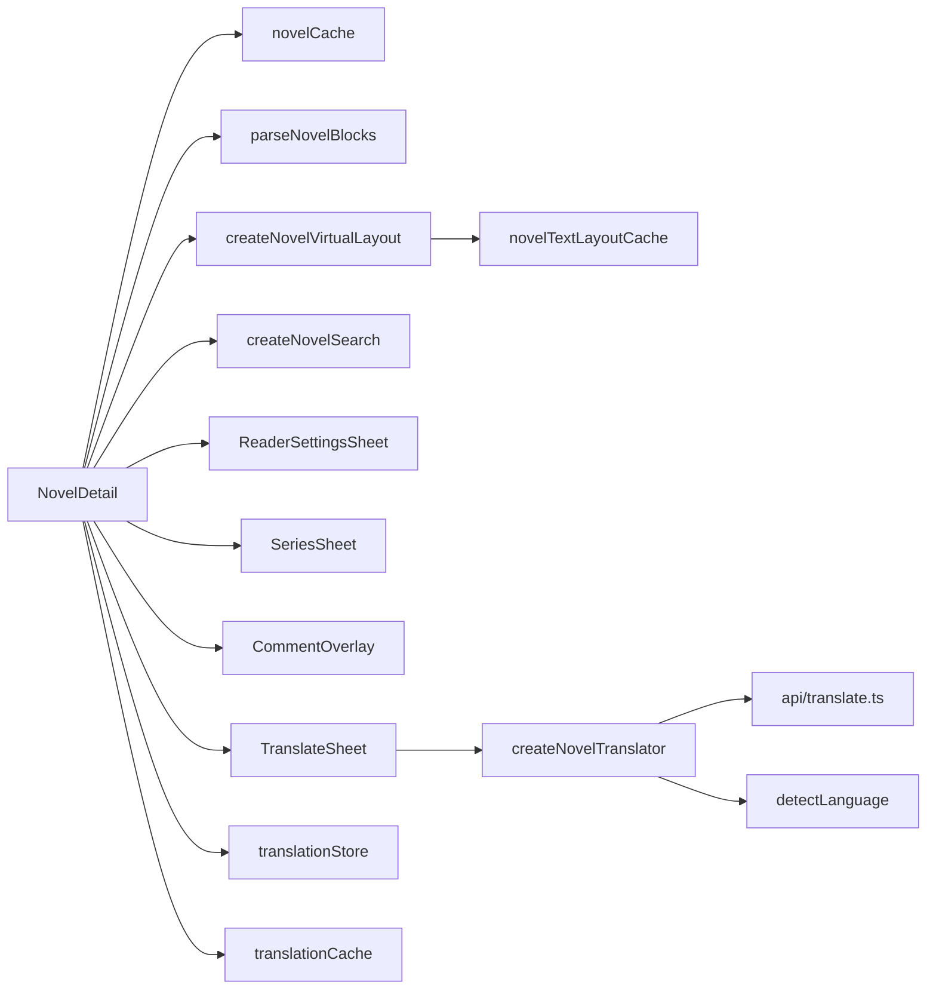

# Novel Reader

Pictelio includes a full-featured novel reader for Pixiv novels, with virtualized text rendering, in-text search, reading progress, and series navigation.

## Novel Detail Page

`/packages/app/src/routes/NovelDetail.tsx` (~28 KB) — The main novel reader at route `/novel/$id`. It manages:

- **Data loading:** Component-level via `createEffect` reacting to `currentNovelId()` (not via router loader). Shows `NovelDetailSkeleton` while `detailLoading` is true. Cache-first: `peekEntry()` fills data synchronously on mount, avoiding the skeleton entirely when cached (ADR-0038).

- **Content rendering:** Parses novel content into typed blocks (`TextBlock`, `ImageBlock`) via `parseNovelBlocks`
- **Marked-up text rendering:** `novelBlocks.ts` parses chapter titles, `jump` links, and inline decorations into distinct block types rendered by `createNovelVirtualLayout` (C-scheme, commit `c39202b`)
- **Virtual layout:** Only renders visible paragraphs using `createNovelVirtualLayout`
- **In-text search:** `NovelSearchBar` component with highlighting
- **Reader settings:** Overlay sheet (`ReaderSettingsSheet`) controlling font size (auto or manual), weight, family, line-height via CSS custom properties
- **Series navigation:** `SeriesSheet` for navigating multi-chapter series (A2 cardized)
- **FastScroller:** `createFastScrollbar` — a draggable overlay scrollbar with chapter-preview bubble (ADR-0077)
- **Comments:** `CommentOverlay` for viewing novel comments
- **Image handling:** Inline `NovelImageBlock` sub-component that memoizes aspect ratios
- **Reading progress:** Scroll-position tracking with `createNovelLoader`
- **AI translation:** BYOK DeepSeek translation — `TranslateSheet` bottom panel, original/translation toggle in `NovelFooterNav`, translated text injected through the `displayBlocks` memo (see [AI Translation](#ai-translation))

*Novel detail composition, including the AI translation flow (sheet → translator pipeline → DeepSeek protocol layer, with the LRU translation cache read/written by the detail page).*

## Novel Cache

`/packages/app/src/stores/novelCache.ts` — A sophisticated caching layer for novel content:
- `getEntry` / `peekEntry` / `loadNovelEntry` — tiered access (cache → API)
- Separate cache for novel metadata, content blocks, and text layout measurements
- Supports prefetching for series navigation

## Text Layout & Measurement

The novel reader uses a chain of primitives for efficient text layout:

### `createNovelTextLayout` (`/packages/app/src/primitives/createNovelTextLayout.ts`)
- Calculates paragraph positions based on font metrics and container width
- Returns an array of paragraph bounding boxes for virtual scrolling

### `measureText` (`/packages/app/src/primitives/measureText.ts`)
- Measures individual text blocks using Canvas 2D `measureText`
- Accounts for line-height, font-size, and font-family from reader settings

### `novelTextLayoutCache` (`/packages/app/src/primitives/novelTextLayoutCache.ts`)
- Cache for text layout measurements keyed by content hash + font settings
- Avoids recalculation when reader settings change

### `createNovelVirtualLayout` (`/packages/app/src/primitives/createNovelVirtualLayout.ts`)
- Higher-level primitive combining text layout with scroll-based visibility
- Produces the virtual item array for the feed component
- Handles resize events and font setting changes

### Pretext Library

The project uses `@chenglou/pretext` for novel text layout. `isPretextSupported` (`/packages/app/src/primitives/isPretextSupported.ts`) checks if Pretext is available in the current runtime, with a fallback to the Canvas-based measurement.

## In-Text Search

`/packages/app/src/primitives/createNovelSearch.ts` + `/packages/app/src/components/NovelSearchBar.tsx`:
- Full-text search within the current novel
- Navigation between matches (prev/next)
- Scroll-to-match with automatic scroll adjustment
- Match highlighting in rendered text

## Reader Settings

`/packages/app/src/stores/readerSettingsStore.ts` — Persistent reader preferences stored as CSS custom properties on the novel container:
- `--reader-font-size` (clamp-based, with an **`autoFontSize`** mode — default `true` — that computes the best size from viewport width)
- `--reader-font-weight`
- `--reader-font-family` (Segoe UI, Georgia, serif, etc.)
- `--reader-line-height` (1.5 — 2.0)

**Auto font-size** reads [`viewportWidth`](/packages/app/src/primitives/viewportWidth.ts), a dedicated viewport-width signal extracted out of the store so the module no longer self-registers a `window` listener at import time (removes import-time IO side effects and enables non-browser/node test injection via `setViewportWidth`).

`ReaderSettingsSheet` (`/packages/app/src/components/ReaderSettingsSheet.tsx`, ~12.7 KB) — The overlay sheet for adjusting these settings interactively.

## AI Translation

AI translation is a complete pipeline (milestones S1–S7, committed back-to-back): user-supplied DeepSeek API key (**BYOK** — bring your own key, direct to provider, no server) → chunked whole-chapter translation with first-screen priority → original/translation toggle, failure resume, and LRU persistence. Full spec: [docs/specs/novel-ai-translation.md](/docs/specs/novel-ai-translation.md); research: [docs/research/novel-ai-translation-feasibility.md](/docs/research/novel-ai-translation-feasibility.md) and [docs/research/deepseek-api-docs-summary.md](/docs/research/deepseek-api-docs-summary.md); UI prototype: `docs/prototypes/novel-translation-prototype.html`.

### Protocol layer — `api/translate.ts`

OpenAI-compatible `POST https://api.deepseek.com/chat/completions`:
- **Dual-mode transport** — Web dev uses `fetch`; Android native uses `CapacitorHttp` (WebView `fetch` hits CORS on most Chinese providers). `defaultTransport()` picks by `Capacitor.isNativePlatform()` and is injectable for tests. Deliberately does **not** reuse the Pixiv `apiClient` (bound to the Pixiv domain + 401 auto-refresh) — see [API Layer & Authentication](/openwiki/architecture/api-layer.md) for how the Pixiv client differs.
- **Thinking switch** — `thinking: { type: "disabled" }` by default (faster, no reasoning-token billing, `temperature` stays effective); enabled when the user flips the thinking toggle (S6, decision #22). `temperature` defaults to 0.5. Models: `deepseek-v4-flash` / `deepseek-v4-pro` (`TRANSLATE_MODELS`), mapped from the quality tier by `TIER_MODELS` in the store.
- **Cancellation** — the `AbortSignal` passes through to Web `fetch` (truly aborts in-flight requests); `CapacitorHttp` has no signal support, so native in-flight requests are discarded by the caller's generation-gate instead.
- **Keep-alive tolerance** — DeepSeek emits blank lines (non-streaming) or `: keep-alive` comments / `data:` lines (streaming) before the response; `sanitizeResponseBody()` strips them before `JSON.parse`.
- **Error normalization** — `classifyTranslateError()` maps 401 → `unauthorized`, 402 → `insufficient_balance`, 429 → `rate_limit`, 5xx → `server`, network failure → `network`; `finish_reason=content_filter` → typed `TranslateError` "content_filter" (policy rejection, fail-fast per decision #23; those paragraphs fall back to original text with a 〔未翻译〕 marker via S4).

### Pipeline — `primitives/createNovelTranslator.ts`

S2 turned the S1 single-block `translateParagraphs()` (kept for compatibility with ≤2000-char content) into a chunked concurrent pipeline — `translateNovel()`:
- **Chunking** — `chunkParagraphs()` splits on paragraph boundaries, ≤2000 chars per chunk (paragraph separators count toward the budget; an oversized single paragraph forms its own chunk).
- **First-screen priority** — `buildChunkOrder()` schedules the chunk containing the current reading paragraph (`priorityParagraph` from `virtualLayout.currentCharIndex()`) first, then the rest in order — first-screen text appears in 3–10s while the remainder continues in the background.
- **Concurrency & retry** — a fixed worker pool of ≤3 (well within DeepSeek's concurrency budget) with exponential backoff `retryDelayMs()` (500ms base × 2^attempt) retrying retryable errors (429 / 5xx / network) up to 2×; auth/balance/policy errors fail fast. Abort (`AbortSignal`) stops workers silently — no failure warning, no progress advance.
- **Ordered reassembly** — returns a `paragraphIndex → text` map; failed chunks are **not** written (paragraphs fall back to original text and are marked for retry — S4).
- **Prompts** (`utils/prompts.ts`) — a **stable system-prompt prefix** shared across chunks maximizes DeepSeek KV-cache hits (hit ¥0.02 vs miss ¥1, per `deepseek-api-docs-summary.md` §5); the prompt contract requires output paragraphs separated by blank lines, count = input count, and preserves any 〔未翻译〕 markers present in the source.
- **`alignParagraphsWithMeta()`** — splits model output on blank lines and aligns to the original paragraph count, reporting `fallbackCount` so the caller can block half-done cache writes. Mismatch is a contract break: too few → trailing paragraphs fall back to original text; too many → truncated; both paths `console.warn` with the `[createNovelTranslator]` prefix (no silent degradation, per AGENTS.md).

### Cache — `utils/translationCache.ts`

S3 persistence (decision #24) in an IndexedDB `translations` object store — `db.ts` was bumped **DB_VERSION 1→2** and the upgrade path must rebuild the store or the runtime throws `NotFoundError`:
- **LRU 200 chapters (~8MB)** — `enforceTranslationLimits()` evicts least-recently-used entries; reads touch `cachedAt` (MRU refresh) at most once per 60s.
- **Composite key** — `buildTranslationKey()` is an FNV-1a 32-bit hash of `novelId | targetLang | modelId`, so quality-tier and target-language translations never collide.
- **Invalidation** — each entry stores `sourceHash` (spark-md5 of the joined original paragraphs); when the author edits the source text the hash no longer matches → automatic miss → re-translate.
- **Content rules** — plain-text paragraphs only (no HTML; injection-safe and 1:1 with source paragraphs); **half-done results (any failed/fallback chunk) are never written**, so the cache never serves a partial chapter.
- `clearTranslationCache()` — exposed from the settings page; `setTestStore()` mirrors the `novelCache` injectable-store pattern.

### State — `stores/translationStore.ts`

Module-level signals shared by the detail page and settings:
- **BYOK key** — `dsApiKey` persisted via `@aparajita/capacitor-secure-storage` (Android Keystore; base64-plaintext on Web — known limitation). `loadDsApiKey()` on mount/settings; `saveDsApiKey()` (empty string = clear); `clearDsApiKey()` never invalidates already-cached translations (decision #24).
- **Sensitive-content switches (S5)** — `translateR18` / `translateR18G` plus the persisted `r18Confirmed` flag; `decideTranslatePolicy(x_restrict, …)` is a pure, unit-tested gate (see below).
- **Quality tier & thinking (S6)** — `defaultTier` (`flash`/`pro` → `TIER_MODELS`) and `thinkingEnabled` (default off), both persisted via `@capacitor/preferences`.
- **Display state** — `translatedParagraphs` (key = `TextBlock.index`), `showTranslation` (original/translation toggle), `translating`, `translationError`, `translationProgress` (`done`/`total` chunks, S2), `failedParagraphs` (S4 补翻 set), and `translationUsedThinking` — set once a thinking-mode translation runs for the chapter, which forces all cache writes to be skipped (thinking output must not pollute the non-thinking cache).
- `resetTranslationState()` — called on chapter switch, route change, and tier change to prevent cross-chapter / cross-tier bleed.

### Language detection — `utils/detectLanguage.ts`

`detectNovelLanguage()` samples the first 500 chars: kana > 1% → `ja`; Latin > 10% → `en`; CJK hanzi > 30% → `zh`; else `other` (hangul maps to `other` — Korean targets are Phase 2). Used to hide the translate entry for `zh` sources (spec US25) and to phrase the prompt's source language.

### Sensitive content grading (S5, decision #23)

`x_restrict` drives a client-side gate **before any content leaves the device**:
- `0` (all-ages) → allow straight through
- `1` (R18) → requires the 「翻译 R18 内容」 switch
- `2` (R18G) → requires the 「翻译 R18G 内容」 switch (stronger warning — legal red line; the provider may report to authorities)

When blocked, `startTranslate()` shows an in-sheet error and **sends nothing** (spec US26). Enabling either switch in settings opens a risk-confirmation dialog (R18: account suspension / model-training risk; R18G: legal + reporting), and the **first** R18/R18G translation shows a second confirmation (`markR18Confirmed()` persists it). The confirmation is promise-based and generation-gated, so switching chapters while it is open cannot bypass the R18G gate.

### NovelDetail integration

- **Injection point** — the `displayBlocks` memo swaps only `TextBlock.text` when `showTranslation()` is on; `novelHtml` is never rewritten (rewriting would trigger three `createEffect` side-effects, per the code-facts research). The virtual layout consumes this memo, so re-layout is automatic.
- **Generation-gate + abort** — a `translateVersion` counter increments on chapter switch and component cleanup, and an `AbortController` cancels the in-flight pipeline; a late response whose version no longer matches is discarded, preventing cross-chapter pollution of the module-level store.
- **Cache-first start** — `getTranslation()` is consulted before any request (skipped in thinking mode or in 补翻 retry mode); a hit fills the map and flips the toggle on without spending tokens.
- **Progressive injection** — the S2 progress callback merges completed chunks into `translatedParagraphs` as they land and records failed paragraphs in `failedParagraphs`, rendered with a trailing 〔未翻译〕 marker (S4). The sheet's 补翻 button re-runs only failed paragraphs, so successful ones are never re-billed.
- **Cache write discipline** — the full chapter is persisted only when every paragraph succeeded (no failures, no fallback chunks, no thinking-mode run).
- **Layout cache variant** — [novelTextLayoutCache](#text-layout--measurement) keys on a translation `variant` (`""` original vs `"translated"`), and `createNovelVirtualLayout` accepts a `translationVariant` accessor. Original and translated layouts are cached separately, so toggling never hits a stale layout.

### UI

- `NovelFooterNav` — 🌐 翻译 button (`showTranslateEntry` hidden for `zh` sources). Once a translation exists it becomes a 原文/译文 toggle.
- `TranslateSheet` — bottom sheet: unconfigured-key guidance (primary button jumps to `/settings`), start-translate, in-flight chunked progress bar (`done/total`, "首屏内容已出，其余后台续翻中…"), error display, failure summary + 补翻 button (S4), and a **per-page temporary quality tier selector (S7)** — 标准/高质量 with per-token price captions; re-clicking the active tier restores "follow global default", and selecting a tier resets translation state (cache stays isolated per model).
- `SettingsTranslate` (`components/settings/SettingsTranslate.tsx`) — "翻译设置" group on the Settings page: API key password field with show/hide, save/clear, storage notice (S1); default quality tier + thinking-mode switch (S6); R18/R18G switches with confirmation dialogs (S5); 清除翻译缓存 entry (S3).

### Tests

6 files / 86 cases cover the feature: `tests/unit/api/translate.test.ts` (contract tests using the official DeepSeek response-schema sample, dual-mode branches via a `@capacitor/core` mock), `tests/unit/primitives/createNovelTranslator.test.ts` (paragraph alignment + degradation warnings, chunking boundaries, first-screen ordering, retry/backoff, abort), `tests/unit/stores/translationStore.test.ts` (policy decisions, tier/thinking persistence, failure tracking), `tests/unit/utils/translationCache.test.ts` (LRU eviction, hash invalidation, composite keys), `tests/unit/utils/detectLanguage.test.ts`, and `tests/unit/primitives/novelTextLayoutCache.test.ts` (variant separation) — consistent with the [testing hard constraints](/openwiki/testing/overview.md).

## Series Navigation

`SeriesSheet` (`/packages/app/src/components/SeriesSheet.tsx`, ~11.8 KB) — Overlay sheet showing all chapters in a series with:
- Current chapter indicator
- Chapter titles and page counts
- Tap-to-navigate to any chapter
- Preloading of adjacent chapter content

## Novel Feed

The novel feed is rendered two ways:

- **Home page** — `NovelRowCard` single-column row cards in the `NovelFeedPanel`, backed directly by `novelRecommendedStore` / `novelFollowStore` / `novelBookmarkStore` (see [Feed & Browsing](/openwiki/domain/feed-and-browsing.md)).
- **Secondary route** — only `UserWorksFeed` (user illusts + user novels, rendered by the `UserIllusts` route) still uses `NovelVirtualFeed` with three layout modes; the standalone `NovelRecommendedFeed`/`NovelFollowFeed`/`NovelBookmarks` route panels were **deleted** in the ADR-0083 dead-code cleanup:

| Mode | Component | Description |
|------|-----------|-------------|
| `list` | `NovelCard` | Card with cover, title, author, tags |
| `coverWall` | `NovelCard` | Cover image grid |
| `textList` | `NovelTextListCard` | Compact text-only list |

- `/packages/app/src/routes/NovelFeedPage.tsx` — Novel feed discovery page
- `/packages/app/src/components/NovelVirtualFeed.tsx` — Virtualized novel feed renderer
- `/packages/app/src/stores/novelRecommendedStore.ts` — Dedicated recommended store
- `/packages/app/src/stores/novelFollowStore.ts` — Dedicated follow store with `all`/`public`/`private` sub-tabs
- `/packages/app/src/stores/novelBookmarkStore.ts` — Dedicated bookmark store with `public`/`private` restrict
- `/packages/app/src/stores/shared/novelHelpers.ts` — Shared helpers (`adaptNovelResponse`, `dedupNovels`) extracted from the deleted `novelStore.ts`

> The monolithic `novelStore.ts` was **deleted** — the split stores are now imported directly by route components (mirroring the illust `feedStore.ts` split).

## Key Source Files

| Purpose | Path |
|---------|------|
| Novel detail page | `/packages/app/src/routes/NovelDetail.tsx` |
| Novel feed page | `/packages/app/src/routes/NovelFeedPage.tsx` |
| Novel recommended store | `/packages/app/src/stores/novelRecommendedStore.ts` |
| Novel follow store | `/packages/app/src/stores/novelFollowStore.ts` |
| Novel bookmark store | `/packages/app/src/stores/novelBookmarkStore.ts` |
| Novel feed helpers | `/packages/app/src/stores/shared/novelHelpers.ts` |
| Novel cache | `/packages/app/src/stores/novelCache.ts` |
| Novel loader primitive | `/packages/app/src/primitives/createNovelLoader.ts` |
| Novel virtual layout | `/packages/app/src/primitives/createNovelVirtualLayout.ts` |
| Novel text layout | `/packages/app/src/primitives/createNovelTextLayout.ts` |
| Text measurement | `/packages/app/src/primitives/measureText.ts` |
| Text layout cache | `/packages/app/src/primitives/novelTextLayoutCache.ts` |
| Novel search | `/packages/app/src/primitives/createNovelSearch.ts` |
| Reader settings store | `/packages/app/src/stores/readerSettingsStore.ts` |
| Reader settings sheet | `/packages/app/src/components/ReaderSettingsSheet.tsx` |
| Translate protocol layer | `/packages/app/src/api/translate.ts` |
| Novel translator pipeline | `/packages/app/src/primitives/createNovelTranslator.ts` |
| Translation store | `/packages/app/src/stores/translationStore.ts` |
| Translate sheet | `/packages/app/src/components/TranslateSheet.tsx` |
| Settings translate group | `/packages/app/src/components/settings/SettingsTranslate.tsx` |
| Language detection | `/packages/app/src/utils/detectLanguage.ts` |
| Translation prompts | `/packages/app/src/utils/prompts.ts` |
| Translation cache | `/packages/app/src/utils/translationCache.ts` |
| Series sheet | `/packages/app/src/components/SeriesSheet.tsx` |
| Series sheet item | `/packages/app/src/components/SeriesSheetItem.tsx` |
| Novel card | `/packages/app/src/components/NovelCard.tsx` |
| Novel text list card | `/packages/app/src/components/NovelTextListCard.tsx` |
| Novel virtual feed | `/packages/app/src/components/NovelVirtualFeed.tsx` |
| Novel cover card | `/packages/app/src/components/novel/NovelCoverCard.tsx` |
| Novel top bar | `/packages/app/src/components/novel/NovelTopBar.tsx` |
| Fast scrollbar primitive | `/packages/app/src/primitives/createFastScrollbar.ts` |
| Novel footer nav | `/packages/app/src/components/NovelFooterNav.tsx` |
| Novel search bar | `/packages/app/src/components/NovelSearchBar.tsx` |
| Novel blocks parser | `/packages/app/src/utils/novelBlocks.ts` |
| Novel image dimensions | `/packages/app/src/utils/novelImageDimensions.ts` |
| Pretext support check | `/packages/app/src/primitives/isPretextSupported.ts` |
| Novels stylesheet | `/packages/app/src/styles/novel-reader.css` |
l blocks parser | `/packages/app/src/utils/novelBlocks.ts` |
| Novel image dimensions | `/packages/app/src/utils/novelImageDimensions.ts` |
| Pretext support check | `/packages/app/src/primitives/isPretextSupported.ts` |
| Novels stylesheet | `/packages/app/src/styles/novel-reader.css` |
