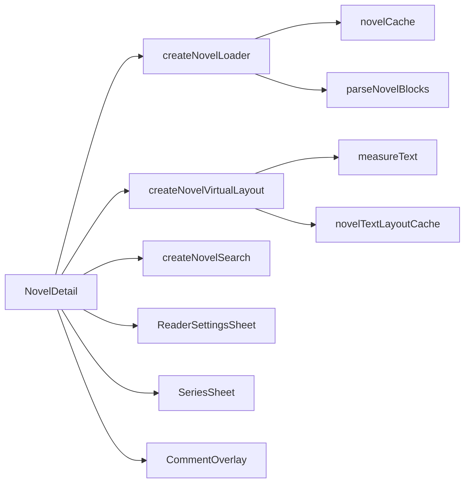

# Novel Reader

Pictelio includes a full-featured novel reader for Pixiv novels, with virtualized text rendering, in-text search, reading progress, and series navigation.

## Novel Detail Page

`/packages/app/src/routes/NovelDetail.tsx` (~28 KB) — The main novel reader at route `/novel/$id`. It manages:

- **Content rendering:** Parses novel content into typed blocks (`TextBlock`, `ImageBlock`) via `parseNovelBlocks`
- **Virtual layout:** Only renders visible paragraphs using `createNovelVirtualLayout`
- **In-text search:** `NovelSearchBar` component with highlighting
- **Reader settings:** Overlay sheet (`ReaderSettingsSheet`) controlling font size, weight, family, line-height via CSS custom properties
- **Series navigation:** `SeriesSheet` for navigating multi-chapter series
- **Comments:** `CommentOverlay` for viewing novel comments
- **Image handling:** Inline `NovelImageBlock` sub-component that memoizes aspect ratios
- **Reading progress:** Scroll-position tracking with `createNovelLoader`

## Novel Cache

`/packages/app/src/stores/novelCache.ts` — A sophisticated caching layer for novel content:
- `getEntry` / `peekEntry` / `loadNovelEntry` — tiered access (cache → API)
- Separate cache for novel metadata, content blocks, and text layout measurements
- Supports prefetching for series navigation

## Text Layout & Measurement

The novel reader uses a chain of primitives for efficient text layout:

### `createNovelTextLayout` (`/packages/app/src/primitives/createNovelTextLayout.ts`)
- Calculates paragraph positions based on font metrics and container width
- Returns an array of paragraph bounding boxes for virtual scrolling

### `measureText` (`/packages/app/src/primitives/measureText.ts`)
- Measures individual text blocks using Canvas 2D `measureText`
- Accounts for line-height, font-size, and font-family from reader settings

### `novelTextLayoutCache` (`/packages/app/src/primitives/novelTextLayoutCache.ts`)
- Cache for text layout measurements keyed by content hash + font settings
- Avoids recalculation when reader settings change

### `createNovelVirtualLayout` (`/packages/app/src/primitives/createNovelVirtualLayout.ts`)
- Higher-level primitive combining text layout with scroll-based visibility
- Produces the virtual item array for the feed component
- Handles resize events and font setting changes

### Pretext Library

The project uses `@chenglou/pretext` for novel text layout. `isPretextSupported` (`/packages/app/src/primitives/isPretextSupported.ts`) checks if Pretext is available in the current runtime, with a fallback to the Canvas-based measurement.

## In-Text Search

`/packages/app/src/primitives/createNovelSearch.ts` + `/packages/app/src/components/NovelSearchBar.tsx`:
- Full-text search within the current novel
- Navigation between matches (prev/next)
- Scroll-to-match with automatic scroll adjustment
- Match highlighting in rendered text

## Reader Settings

`/packages/app/src/stores/readerSettingsStore.ts` — Persistent reader preferences stored as CSS custom properties on the novel container:
- `--reader-font-size` (clamp-based)
- `--reader-font-weight`
- `--reader-font-family` (Segoe UI, Georgia, serif, etc.)
- `--reader-line-height` (1.5 — 2.0)

`ReaderSettingsSheet` (`/packages/app/src/components/ReaderSettingsSheet.tsx`, ~12.7 KB) — The overlay sheet for adjusting these settings interactively.

## Series Navigation

`SeriesSheet` (`/packages/app/src/components/SeriesSheet.tsx`, ~11.8 KB) — Overlay sheet showing all chapters in a series with:
- Current chapter indicator
- Chapter titles and page counts
- Tap-to-navigate to any chapter
- Preloading of adjacent chapter content

## Novel Feed

Three layout modes for the novel feed:

| Mode | Component | Description |
|------|-----------|-------------|
| `list` | `NovelCard` | Card with cover, title, author, tags |
| `coverWall` | `NovelCard` | Cover image grid |
| `textList` | `NovelTextListCard` | Compact text-only list |

- `/packages/app/src/routes/NovelFeedPage.tsx` — Novel feed discovery page
- `/packages/app/src/components/NovelVirtualFeed.tsx` — Virtualized novel feed renderer
- `/packages/app/src/stores/novelStore.ts` — Novel feed state (uses `createTQFeedStore` factory per ADR-0021)

## Key Source Files

| Purpose | Path |
|---------|------|
| Novel detail page | `/packages/app/src/routes/NovelDetail.tsx` |
| Novel feed page | `/packages/app/src/routes/NovelFeedPage.tsx` |
| Novel store | `/packages/app/src/stores/novelStore.ts` |
| Novel cache | `/packages/app/src/stores/novelCache.ts` |
| Novel loader primitive | `/packages/app/src/primitives/createNovelLoader.ts` |
| Novel virtual layout | `/packages/app/src/primitives/createNovelVirtualLayout.ts` |
| Novel text layout | `/packages/app/src/primitives/createNovelTextLayout.ts` |
| Text measurement | `/packages/app/src/primitives/measureText.ts` |
| Text layout cache | `/packages/app/src/primitives/novelTextLayoutCache.ts` |
| Novel search | `/packages/app/src/primitives/createNovelSearch.ts` |
| Reader settings store | `/packages/app/src/stores/readerSettingsStore.ts` |
| Reader settings sheet | `/packages/app/src/components/ReaderSettingsSheet.tsx` |
| Series sheet | `/packages/app/src/components/SeriesSheet.tsx` |
| Series sheet item | `/packages/app/src/components/SeriesSheetItem.tsx` |
| Novel card | `/packages/app/src/components/NovelCard.tsx` |
| Novel text list card | `/packages/app/src/components/NovelTextListCard.tsx` |
| Novel virtual feed | `/packages/app/src/components/NovelVirtualFeed.tsx` |
| Novel cover header | `/packages/app/src/components/NovelCoverHeader.tsx` |
| Novel footer nav | `/packages/app/src/components/NovelFooterNav.tsx` |
| Novel search bar | `/packages/app/src/components/NovelSearchBar.tsx` |
| Novel blocks parser | `/packages/app/src/utils/novelBlocks.ts` |
| Novel image dimensions | `/packages/app/src/utils/novelImageDimensions.ts` |
| Pretext support check | `/packages/app/src/primitives/isPretextSupported.ts` |
| Novels stylesheet | `/packages/app/src/styles/novel-reader.css` |
