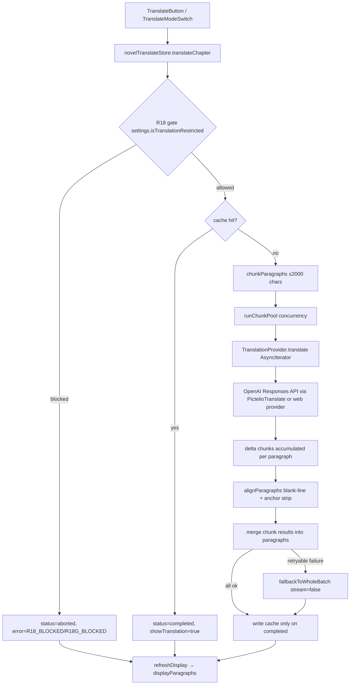
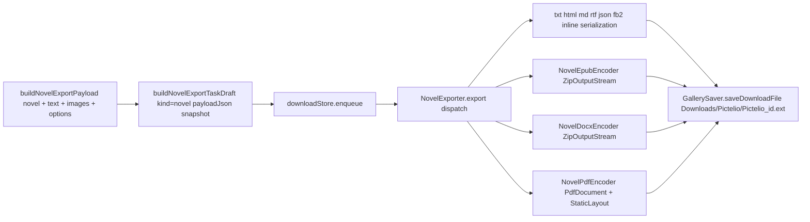

# Novel Reader

Pictelio's novel reader lives entirely in the **app-lynx** single-engine client. The former SolidJS + Capacitor webview client (`packages/app`) — and with it the webview-era DeepSeek translation pipeline, TanStack virtualizer, and three-mode novel feed — was deleted in [ADR-0203](../../docs/adr/ADR-0203-webview-client-source-removal.md); its Android host moved to `packages/android-host`. This page documents the surviving lynx reader: the `/novels` list, the optional `/novel/:id/intro` page, the virtualized `/novel/:id` body, long-press text selection, BYOK AI translation, and 9-format export.

| Route | Page | Role |
|-------|------|------|
| `/novels` | [`pages/NovelList.vue`](../../packages/app-lynx/src/pages/NovelList.vue) | Single-column novel feed, `recommend`/`follow` sub-tabs |
| `/novel/:id/intro` | [`pages/NovelIntro.vue`](../../packages/app-lynx/src/pages/NovelIntro.vue) | Optional pre-read decision surface (cover, tags, intro, actions) |
| `/novel/:id` | [`pages/NovelDetail.vue`](../../packages/app-lynx/src/pages/NovelDetail.vue) | Virtualized novel body with translation, selection, and export |

## app-lynx Novel List

`/novels` renders the recommended or followed novel feed as a native single-column list. The page is a thin ref-snapshot bridge over [`createMixFeed`](./feed-and-browsing.md#unified-pagination-createmixfeed): a single `novel` source (`loadRecommendedNovels` or `loadFollow('public')`, plus `loadNovelNext` for pagination), with `SubTabBar` switching `recommend`/`follow` by disposing and rebuilding the feed instance.

- **Engine virtualization**: the content is a native `<list list-type="single">` inside the shared `RefreshableList` container — no JavaScript virtualizer. A `refreshEpoch` bump drives `:key` replacement after refresh/back-to-top because native `<list>` mis-handles in-place patches (ADR-0107/ADR-0162).
- **Restricted vs removed**: R18/R18G and AI-`mask` rows are rendered in-flow as `RestrictedNovelCard`/`AiRestrictedNovelCard`; AI-`only` and tag-mute are **data-layer removals** via `useAiOnlyVisible`/`useTagMuteVisible` (mute = invisible, unlike R18's mask).
- **Row content**: title, author, character count, bookmark count, and an `AdaptiveTagRow` (chip tap → global search, long-press → tag mute, overflow → open the novel).
- **Navigation**: every tap funnels through [`openNovel(id)`](../../packages/app-lynx/src/utils/novelNavigation.ts), the ADR-0183 seam that honors the `novel_intro_first` switch and emits the intro or body route.

See [Feed & Browsing](./feed-and-browsing.md) for the shared pagination, refresh, and content-control machinery.

## Novel Intro Page (`/novel/:id/intro`)

The intro page is the middle surface of the three-segment lynx flow `list → intro → body`. Every novel entry point (recommended carousel, novel list, bookmarks, user home, followed-latest chapter, and search sheet) can route here first; `/novel/:id` itself stays directly reachable because the three-segment flow is a **UI constraint, not a route constraint** — there is no route-level redirect (ADR-0167). The intro is **optional for high-frequency readers**: a device-level `novel_intro_first` setting (default `true`, so upgrades are zero-perception) lets entry points jump straight to the body through the single [`openNovel(id)`](../../packages/app-lynx/src/utils/novelNavigation.ts) seam; the `/intro` route string now exists only in that module (ADR-0183).

The page reuses the recommended-carousel "D" visual family — a full-screen cover (`CoverImage` `aspectFill`) plus a bottom gradient scrim carrying:

- AI badge, series row (+ watched chip), title, author row (→ user home), tag capsules (→ global search; long-press → mute), a two-line caption (tap opens `NovelCaptionSheet`; 「暂无简介」 when empty), stats, and the comment entry.
- Restricted/AI masking uses the **same predicates as the body page** (`settings.isRestricted` / `settings.isAiRestricted`, R18 first then AI mask): cover/title/author stay visible, the caption area is masked, and the main CTA + caption-expand entry grey out via handler guards (`if (masked.value) return`) — not CSS `pointer-events`, which is a dead class in this project.
- A two-row action area: Row 1 = bookmark, series watchlist (series only), download/export, series directory (series only), and watch-later; Row 2 = the full-width main CTA.

The main CTA is now **position-aware** (ADR-0219 §2.4): it reads 「继续阅读」 when a continue-reading position exists and 「开始阅读」 otherwise, but **both branches navigate to the same `/novel/:id`** (position is session-last semantics keyed by `novelId`, so no chapter-id jump is needed).

Bookmark and watch-later are **object-bound, not route-bound**: after the 2026-10-03 dimension refactor the body page also exposes them, so the same novel can be bookmarked/added from either the intro or the body (the intro page originally introduced the `targetKind: 'novel'` bookmark mutation).

Intro export is a **narrower snapshot** than body export: the intro page does not prefetch the body, so [`enqueueNovelExport`](../../packages/app-lynx/src/pages/NovelIntro.vue) builds the payload with `text: captionText` and `images: {}` — metadata plus the caption as the minimal content slice.

## Novel Body Page (`/novel/:id`)

`NovelDetail.vue` is the actual reader. Loading is **two-phase and generation-gated**: `loadNovelDetail` resolves first (to determine restricted/AI state), then — only if the novel is not restricted/AI-masked — `fetchNovelData` fetches body text + the inline-image map. A `loadGeneration` counter discards any in-flight response from a switched chapter or unmounted instance. Restricted/AI novels **do not fetch the body** (mask = content unreachable, not merely hidden) and render the header + `RestrictOverlay`/`AiOverlay` branch instead of the list.

### Body virtualization (ADR-0134)

The body is a native `<list list-type="single">` whose paragraphs are individual `<list-item>` elements — replacing the earlier full-text `v-for` inside one `<scroll-view>`. The spike measured deep-scroll jank falling from a 22.6% median to 8.2% and memory falling ~42% (288 MB → 167 MB).

- Each paragraph item uses a stable double key — Vue `:key` and Lynx `:item-key` both set to `p-<idx>` via `selection.paragraphId(idx)` — plus `estimated-main-axis-size-px` derived from [`novelAverageParagraphHeightPx`](../../packages/app-lynx/src/primitives/novelParagraphEstimate.ts).
- `meta`, `end`, and `fab-allowance` are fixed items; **restricted novels bypass the list entirely** (they keep the header + overlay branch).
- The rendered source is `displayParagraphs`, which the translation store swaps between original and translated text.

### Scroll signals & reading progress

- `:main-thread-bindscroll="onNovelScrollMT"` receives `scrollTop`/`scrollHeight` on the **main thread** (background-thread `@scroll` does not dispatch scrollTop on native `<list>`). The handler throttles to an 8%-height delta and bridges to the background thread via `runOnBackground` to feed the watchlist prompt's ≥70% progress signal (ADR-0134). The implementation notes the signal was confirmed on a same-day prototype but re-verified absent in the current build, so progress falls back to bottom-only with a visible `console.warn`.
- `@scrolltolower` is the **authoritative bottom signal**: it sets `reachedBottom`, runs the completion decision, and feeds the watchlist prompt.
- The watchlist prompt (`createWatchlistPrompt`) triggers for series works that are not yet watched, not session-dismissed, with ≥10 s dwell and (≥70% progress **or** bottom).
- Continue-reading (ADR-0219) records a session-last position **on entry, zero threshold**; chapter coordinates are back-filled from `loadNovelSeriesChapters` for the 「第N话」 label, and completion (`decideNovelCompletion`) is evaluated at bottom, after coordinates land, and after a re-pulled viewport size (native content-size is pull-only, ADR-0131). Degraded paths warn rather than silently marking or failing to mark completion.

### Selection, translation, export, and comments

The body page wires four feature seams together without owning their internals:

- **Text selection**: `useTextSelection({ paragraphs })` owns the session; the `<text>` paragraphs carry three **static literal** selection attributes and `:bindselectionchange` (see [Text Selection](#text-selection--action-menu-adr-0165)).
- **Translation**: `useNovelTranslateStore` is the single seam; `TranslateButton` starts/aborts/retranslates, `TranslateModeSwitch` toggles original/translated, and `translateStore.reset()` runs on chapter switch and unmount (see [AI Translation](#ai-translation-app-lynx)).
- **Export**: `NovelExportSheet` opens from the header action; `enqueueNovelExport` builds a full-body payload (`text` + `novelImages` + settings options) and enqueues a `kind="novel"` download task (see [Novel Export](#novel-export-adr-0154)).
- **Comments**: `CommentOverlay type="novel"`.

## Text Selection & Action Menu (ADR-0165)

The lynx body page gained long-press selection with a self-drawn M3 action menu (copy / search-in-Pixiv) where it previously could not select body text at all. Three platform facts had to be verified on-device:

1. The selection attributes must be **static string literals** — `text-selection="true"` / `flatten="false"` / `custom-context-menu="true"`. A dynamic `:custom-context-menu` binding is silently dropped by vue-lynx, leaving the engine's own ActionMode menu visible; `flatten="false"` is a hard precondition for `selectionchange`.
<!-- openwiki: broken internal link [../integrations/android-native.md#lynx-native-modules] heading anchor "lynx-native-modules" does not exist in "../integrations/android-native.md". Fix the href or restore the target, then delete this comment. -->
2. The runtime has **no `navigator`/clipboard JS API**, so copy needs the native [`PictelioClipboardModule`](../integrations/android-native.md#lynx-native-modules) channel.
3. Selection indices are **UTF-16 code units** that can split a surrogate pair, so the range must snap outward to a code-point boundary before `String.slice`; and `getTextBoundingRect` fails on a full-paragraph range, so measurement converges to `len - 1`.

The framework-neutral [`createTextSelection.ts`](../../packages/app-lynx/src/primitives/createTextSelection.ts) deep module owns the whole chain — event parsing → index slicing → async rect measurement → toolbar placement → dismissal → action execution and feedback — through injected ports (engine, clipboard, search, modal registration). [`TextSelectionToolbar.vue`](../../packages/app-lynx/src/components/TextSelectionToolbar.vue) is the dumb view; `useTextSelection.ts` is a thin Vue binding; copy success is judged only by the native `ok === "1"` (no optimistic/fake success). Dismissal is unified in `dismiss()` and covers tap-away (host `@tap`), list scroll (zero-cost early-out when hidden), back-key via `modalStack`, chapter-switch/unmount, and action-completion feedback. A long-press-release tap is consumed via a guard window so it does not immediately close the menu.

## AI Translation (app-lynx)

The lynx client built its **own, from-scratch** BYOK novel translation stack (ADR-0169–ADR-0178). It does **not** reuse the deleted webview DeepSeek stack and does **not** extract a shared `@pictelio/novel-translate` package — it only borrows the webview stack's abstract boundaries (provider-interface shape, cache-key design, policy decision points).

```mermaid
flowchart TD
    UI["TranslateButton / TranslateModeSwitch"] --> STORE["novelTranslateStore.translateChapter"]
    STORE --> GATE{"R18 gate settings.isTranslationRestricted"}
    GATE -->|blocked| BLOCK["status=aborted, error=R18_BLOCKED/R18G_BLOCKED"]
    GATE -->|allowed| CACHE{"cache hit?"}
    CACHE -->|yes| HIT["status=completed, showTranslation=true"]
    CACHE -->|no| CHUNK["chunkParagraphs ≤2000 chars"]
    CHUNK --> POOL["runChunkPool concurrency"]
    POOL --> PROV["TranslationProvider.translate AsyncIterator"]
    PROV --> NATIVE["OpenAI Responses API via PictelioTranslate or web provider"]
    NATIVE --> DELTA["delta chunks accumulated per paragraph"]
    DELTA --> ALIGN["alignParagraphs blank-line + anchor strip"]
    ALIGN --> MERGE["merge chunk results into paragraphs"]
    MERGE -->|all ok| WRITE["write cache only on completed"]
    MERGE -->|retryable failure| FALLBACK["fallbackToWholeBatch stream=false"]
    FALLBACK --> WRITE
    WRITE --> DISPLAY["refreshDisplay → displayParagraphs"]
    BLOCK --> DISPLAY
    HIT --> DISPLAY
```

*The lynx chunked-streaming pipeline: consent gate → cache → chunking/pool → provider → alignment → whole-batch fallback → cache write → display.*

### Provider & endpoint (ADR-0169)

- The endpoint is **user-filled** (base URL / API key / model, no provider presets) and speaks the **OpenAI Responses API** (`POST /v1/responses`); providers that do not implement it are hard-rejected. Azure base URLs get `/openai/v1` auto-completion plus an `api-version: preview` header.
- [`TranslationProvider`](../../packages/app-lynx/src/api/translate.ts) is provider-agnostic; the single implementation `OpenAIResponsesProvider` reduces the Responses API's 30+ event types to **5 `TranslationChunk` types** (`delta` / `reasoning_delta` / `cached` / `done` / `error`). `LlmEndpointConfig` carries the key field but the JS side only ever sees the redacted `LlmEndpointPublic` mirror (`hasKey`, base URL, model, languages, `updatedAt`).

### Native bridge & API key isolation (ADR-0170)

The API key lives in Android Keystore via the Java [`PictelioTranslateModule`](../../packages/android-host/android/app/src/lynx/java/io/pictelio/app/PictelioTranslateModule.java) and **never enters the JS heap** (ADR-0037); JS only receives the redacted mirror. The stream is fetched by Java with a **dedicated OkHttp client** (`callTimeout=0`, `readTimeout=45s`) so a normal long stream is not killed by the shared client's call timeout. `responsesUrl(baseURL)` appends `/responses` (not `/v1/responses`) when the base URL already ends in `/v1` or `/openai/v1`.

A key implementation revision: the per-chunk `Callback` channel proved unreliable on-device (only one frame delivered in several experiments), so the final delivery path is the **global event bus** — `LynxView.sendGlobalEvent("pictelioTranslateFrame", frameJson)` — carrying whole-chapter frames (`delta_all` / `done` / `error` / `pending`) deduplicated by `(streamId, seq)`. The parser also synthesizes `done` when DeepSeek closes a stream without a terminal `response.completed`.

### Chunked pipeline (`createNovelTranslator`)

[`createNovelTranslator.ts`](../../packages/app-lynx/src/primitives/createNovelTranslator.ts) implements the chunked pipeline (ADR-0169 D5):

- `chunkParagraphs` splits on paragraph boundaries at ≤2000 chars (an oversized single paragraph becomes its own chunk).
- `runChunkPool` runs a fixed worker pool (default concurrency 3; **1 on the native bridge** because three concurrent DeepSeek SSE streams starve each other on-device); `AbortSignal` exits silently.
- `fetchChunkViaProvider` consumes the `AsyncIterator`, accumulates `delta` text, and throws `TranslationChunkError` on `error` chunks.
- `alignParagraphs` splits model output on blank lines, strips `[N]` anchors, and reports `fallbackCount`/`overflowCount` — a count mismatch is a contract break that `console.warn`s and (for shortfalls) falls back to original text.

### State machine & store (`novelTranslateStore`)

[`novelTranslateStore.ts`](../../packages/app-lynx/src/stores/novelTranslateStore.ts) is the **single seam** all translation UI and side effects read/write. It holds the 8-state machine `idle / pending / translating / translating_queued / partial / failed / completed / aborted`, a **generation gate** (`gen` bump on reset/translate discards late responses), a per-chapter in-flight `Map` (reuses the running translation instead of starting a duplicate), and an `AbortController`. `displayParagraphs` is the only render source: translated text when `showTranslation` is on, original otherwise, with a `〔未翻译〕` placeholder for missing paragraphs in `partial`.

### Cache (ADR-0171 / ADR-0175)

Cache keys are the 6-tuple `novelId | chapterId | targetLang | modelId | sourceHash | baseURLHash`; `sourceHash`/`baseURLHash` are FNV-1a 32-bit fingerprints so author edits, model changes, and endpoint changes all auto-miss. The LRU cap is **200 chapters**, and only `completed` chapters are ever written (half-done results never pollute the cache); `providerId` mismatches are treated as a miss. The adapter is dual (ADR-0103 pattern): web-core dev uses IndexedDB (`pictelio_lynx` → `translations`, DB v3), while native PrimJS — which has no `indexedDB` — uses the **filesystem channel** from ADR-0175: `cacheDir/translations/` with one JSON entry file per key (Base64URL-safe filename) plus a `manifest.json` LRU index, backed by [`PictelioTranslateCacheModule`](../../packages/android-host/android/app/src/lynx/java/io/pictelio/app/PictelioTranslateCacheModule.java).

### R18 consent gate (ADR-0173)

`settings.isTranslationRestricted(xRestrict)` is **independent of content-display predicates** — seeing R18 does not authorize sending R18 body text to a third-party LLM. The gate runs before any request leaves the device: `xRestrict=1` requires the R18 translation switch, `xRestrict=2` the R18G switch; blocked calls set `status='aborted'` with `R18_BLOCKED`/`R18G_BLOCKED` and send nothing.

### Probe & credential verification (ADR-0173)

Endpoint compatibility (address layer) and credential validity (key layer) are two orthogonal states. `probeCompatibility` sends a **dummy key** and is therefore usable without a configured key; the native layer returns only `ok/partial/incompatible/unknown` (+ `keyInvalid`), and the JS side attributes `azure`/`deepseek` by hostname. `testConnection` uses the real key and persists only the result enum + timestamp + base URL (never key material); the UI compares the recorded base URL against the current input so a stale "verified" badge cannot survive an address change.

### Retry & partial UI (ADR-0178)

When the chunked pipeline ends `partial`/`failed` with a retryable error, the store triggers **one whole-batch fallback** (`stream=false`, single POST, raised `max_output_tokens`) with 0 ms backoff; `isRetryingHint` shows 「重试中…」 and progress resets to 0%. A fallback with zero output and no explicit error is classified `content_filter`. User retry/retranslate is debounced at 1.5 s; `partial` shows translated paragraphs plus the `〔未翻译〕` placeholder for missing ones, and never reports 100% progress.

## Novel Export (ADR-0154)

Novels export to **9 formats** — `txt` / `html` / `md` / `docx` / `pdf` / `epub` / `rtf` / `json` / `fb2` — with shared pure logic and native Java encoding:

```mermaid
flowchart LR
    PAYLOAD["buildNovelExportPayload novel + text + images + options"] --> DRAFT["buildNovelExportTaskDraft kind=novel payloadJson snapshot"]
    DRAFT --> QUEUE["downloadStore.enqueue"]
    QUEUE --> EXPORT["NovelExporter.export dispatch"]
    EXPORT --> TEXT["txt html md rtf json fb2 inline serialization"]
    EXPORT --> EPUB["NovelEpubEncoder ZipOutputStream"]
    EXPORT --> DOCX["NovelDocxEncoder ZipOutputStream"]
    EXPORT --> PDF["NovelPdfEncoder PdfDocument + StaticLayout"]
    TEXT --> SAVE["GallerySaver.saveDownloadFile Downloads/Pictelio/Pictelio_id.ext"]
    EPUB --> SAVE
    DOCX --> SAVE
    PDF --> SAVE
```

*Export flow: shared payload construction → download queue → Java encoder dispatch → text serialization or container/PDF encoders → GallerySaver.*

- **Shared pure-logic package** [`@pictelio/novel-export`](../../packages/novel-export/) is the zero-DOM single source of truth: `formats.ts` (whitelist/labels/extensions/MIME, default `txt`), `blocks.ts` (`parseNovelBlocks`/`parseInlineRuns`/`buildSearchText`), `extract.ts` (`extractNovelTextFromHtml`/`extractNovelDataFromHtml`), and `exportPayload.ts` (`buildNovelExportPayload`/`buildNovelExportTaskDraft`, task id, and filename). The payload IR is `{ schema: 1, meta, options, blocks }`; the three content switches (`includeMetadata`/`includeCover`/`includeInlineImages`, default on) are snapshotted into the task at enqueue time.
- **Java encoding** lives in `packages/android-host`'s `main` source set. [`NovelExporter.java`](../../packages/android-host/android/app/src/main/java/io/pictelio/app/NovelExporter.java) is the facade/dispatch entry: `txt`/`html`/`md`/`rtf`/`json`/`fb2` are inline string serialization, while `epub`/`docx` delegate to `NovelEpubEncoder`/`NovelDocxEncoder` (ZipOutputStream containers) and `pdf` to `NovelPdfEncoder` (`PdfDocument` + `StaticLayout`, system CJK fonts, zero font payload). `NovelExportModel.parse(payloadJson)` decodes the payload; a cancellable `export(..., BooleanSupplier cancelled)` variant aborts with `NovelExportCancelledException`. Encoders write to the cache subdirectory `pictelio-novel-export`, then `GallerySaver.saveDownloadFile` persists to `Downloads/Pictelio/Pictelio_<novelId>.<ext>`.
<!-- openwiki: broken internal link [../integrations/android-native.md#pixivimageloader] heading anchor "pixivimageloader" does not exist in "../integrations/android-native.md". Fix the href or restore the target, then delete this comment. -->
- **Images** are fetched by [`PixivImageLoader`](../integrations/android-native.md#pixivimageloader) in Java (bytes never enter the JS heap, ADR-0037). A single image failure warns and skips that image (export still succeeds); metadata/body hard failures throw a readable `IOException` — no silent degradation.
- **Download-queue reuse**: export is a `kind="novel"` queue task whose `payloadJson` is an opaque snapshot, so persistence, cross-restart recovery, start/pause/stop/delete, progress, and share come free (ADR-0146). `targetFormat` and content switches are snapshotted at enqueue.
- **Settings**: `settings_novel_export_format` (default `txt`) plus the three include switches; the export sheet allows a per-export temporary override without writing back the global default. Web-core preview cannot generate any format (the Java encoder runs only on Android) and fails explicitly with a `console.warn`.

## Key Source Files

| Purpose | Path |
|---------|------|
| Novel list page | `packages/app-lynx/src/pages/NovelList.vue` |
| Novel intro page | `packages/app-lynx/src/pages/NovelIntro.vue` |
| Novel body page | `packages/app-lynx/src/pages/NovelDetail.vue` |
| Novel navigation seam | `packages/app-lynx/src/utils/novelNavigation.ts` |
| Translation store | `packages/app-lynx/src/stores/novelTranslateStore.ts` |
| Translation chunked pipeline | `packages/app-lynx/src/primitives/createNovelTranslator.ts` |
| Translation provider/endpoint | `packages/app-lynx/src/api/translate.ts` |
| Translation native bridge | `packages/app-lynx/src/api/nativeTranslate.ts` |
| Translation cache | `packages/app-lynx/src/utils/translationCache.ts` |
| Native filesystem translation cache | `packages/app-lynx/src/utils/filesystemTranslationCache.ts` |
| Text selection primitive | `packages/app-lynx/src/primitives/createTextSelection.ts` |
| Text selection toolbar | `packages/app-lynx/src/components/TextSelectionToolbar.vue` |
| Translate button / mode switch | `packages/app-lynx/src/components/TranslateButton.vue`, `TranslateModeSwitch.vue` |
| Novel export sheet | `packages/app-lynx/src/components/NovelExportSheet.vue` |
| Series sheet | `packages/app-lynx/src/components/SeriesSheet.vue` |
| Shared export logic | `packages/novel-export/src/` (`formats.ts`, `blocks.ts`, `extract.ts`, `exportPayload.ts`, `types.ts`) |
| Java export facade + model | `packages/android-host/android/app/src/main/java/io/pictelio/app/NovelExporter.java`, `NovelExportModel.java` |
| Java epub/docx/pdf encoders | `packages/android-host/android/app/src/main/java/io/pictelio/app/NovelEpubEncoder.java`, `NovelDocxEncoder.java`, `NovelPdfEncoder.java` |
| Java translation module | `packages/android-host/android/app/src/lynx/java/io/pictelio/app/PictelioTranslateModule.java` |
| Java translation cache module | `packages/android-host/android/app/src/lynx/java/io/pictelio/app/PictelioTranslateCacheModule.java` |
