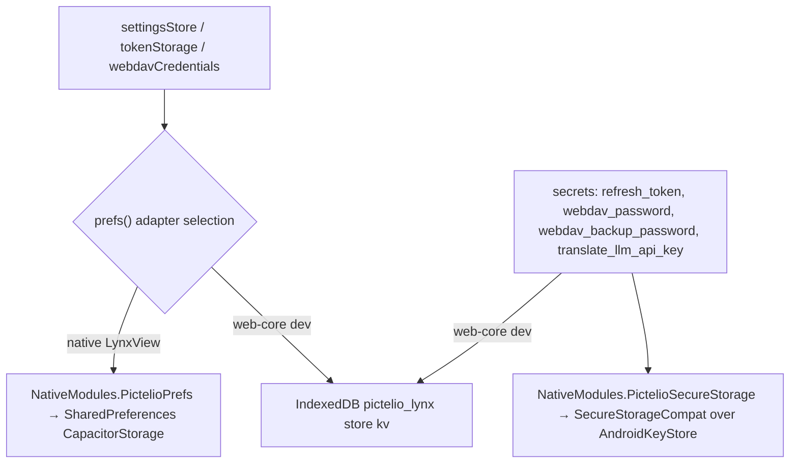
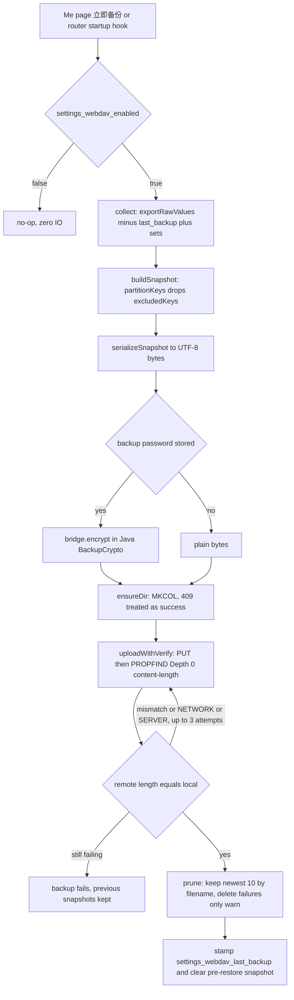
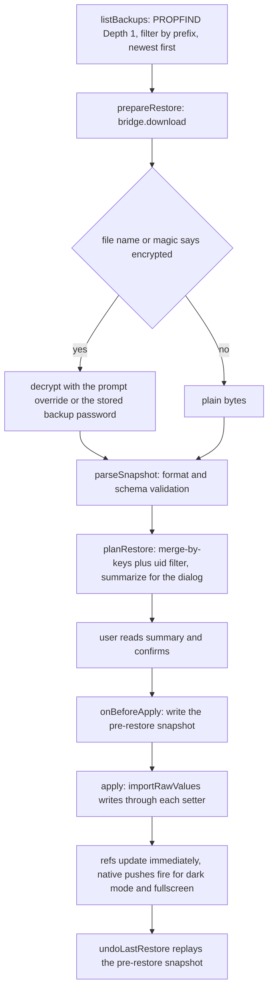

# Settings, Persistence & WebDAV Backup

`packages/app-lynx` owns every setting the user can change, the storage layers those settings land in, and the only export channel out of the device: WebDAV snapshot backup. This page documents the **key ownership map**, the **three persistence layers** (and what may never be written to each), and the **backup/restore pipeline** with its fixed v1 values and refusal boundaries.

Neighbouring pages own the parts deliberately not repeated here:

- Pixiv OAuth, the `refresh_token` lifecycle and the 401 refresh live on [API Layer & Authentication](../architecture/api-layer.md); this page only states where the token is stored and what may never hold it.
- The Java `LynxModule` inventory, the Kotlin/Java build and the Keystore utility's byte format live on [Android Native Integration & Build](../integrations/android-native.md).
- The *semantics* of content control (R18/R18G masks, AI three-state, tag mute) live on [Feed & Browsing](feed-and-browsing.md); here they appear only as keys.

### One historical note first

[ADR-0156](../../docs/adr/ADR-0156-webdav-backup-architecture.md) D1 and the [WebDAV backup spec](../../docs/specs/webdav-backup.md) describe a **dual-engine** design: one Java core plus *two* thin bridges (`WebDavPlugin` for the WebView/Capacitor client and `PictelioWebDavModule` for Lynx) plus per-engine TS copies. That text is decision history. The WebView client and its `packages/app` package were deleted in [ADR-0203](../../docs/adr/ADR-0203-webview-client-source-removal.md); `WebDavPlugin` and the differential "webview ⇄ lynx" test pairs no longer exist. **The live bridge is the Lynx native-module contract**: `NativeModules.PictelioWebDav` → [`PictelioWebDavModule`](../../packages/android-host/android/app/src/lynx/java/io/pictelio/app/PictelioWebDavModule.java) → [`WebDavClient`](../../packages/android-host/android/app/src/main/java/io/pictelio/app/WebDavClient.java) / [`BackupCrypto`](../../packages/android-host/android/app/src/main/java/io/pictelio/app/BackupCrypto.java), consumed by [`utils/webDavBridge.ts`](../../packages/app-lynx/src/utils/webDavBridge.ts). Snapshots still carry an `engine` field (`"webview" | "lynx"`) and a `sets` object — both are envelope compatibility, not live features (see [Restore](#restore-select-decrypt-summarize-merge)).

## The settings registry is the ownership map

[`stores/settingsStore.ts`](../../packages/app-lynx/src/stores/settingsStore.ts) is a single Pinia setup store that declares **every** persisted key of the client as a module-level constant, plus:

- `BACKUP_DEVICE_KEYS` — the exported list of device-scoped keys that belong to the backup domain.
- `backupAccountKeys(uid)` — the generated account-scoped keys for the current uid (`show_r18_${uid}`, `show_r18g_${uid}`, `ai_filter_mode_${uid}`, `mute_tags_${uid}`).
- `BACKUP_IDB_KEYS` — the subset of device keys that live in IndexedDB rather than through the preferences seam (`settings_ugoira_mode`, `settings_detail_quality`).

New keys must be added to those lists: source-scanning tests assert that every `*_KEY` literal in the file is present in `BACKUP_DEVICE_KEYS`, and that every `BACKUP_DEVICE_KEYS` entry has a matching branch in `applyRawKey` ([`stores/settingsStore.test.ts`](../../packages/app-lynx/src/stores/settingsStore.test.ts)). Keys outside both lists are outside the backup domain by construction.

### Account-scoped keys (per-uid content control)

Account-scoped keys carry the Pixiv `userId` as a `_${uid}` suffix. They are read and written only while a uid is known, which is why `loadSettings()` runs *after* token restore.

| Key | Owner action | Persisted where | In backup domain |
|-----|--------------|-----------------|------------------|
| `show_r18_${uid}` | `setShowR18` | preferences seam | yes |
| `show_r18g_${uid}` | `setShowR18G` | preferences seam | yes |
| `ai_filter_mode_${uid}` (`show`/`mask`/`only`) | `setAiFilterMode` | preferences seam | yes |
| `mute_tags_${uid}` (JSON `string[]`) | `setMuteTags` / `muteTag` / `unmuteTag` | preferences seam | yes |
| `settings_translate_r18_${uid}` | `setTranslateR18` | preferences seam | **no** |

The last row matters: *account-scoped* and *in the backup domain* are independent properties. The BYOK translation consents are per-account on device but deliberately outside the snapshot.

### Device-scoped keys (shared across accounts)

`BACKUP_DEVICE_KEYS` groups as follows (all via the preferences seam unless noted):

| Group | Keys |
|-------|------|
| Ugoira / image quality | `settings_ugoira_mode`*, `settings_ugoira_download_format`, `settings_detail_quality`* |
| Appearance | `settings_theme_color`, `settings_dark_mode`, `settings_language` |
| Navigation & UI | `related_injection`, `ranking_entry`, `novel_intro_first`, `settings_fullscreen_mode`, `pictelio_engine_auto_fallback` |
| Downloads | `download_file_template`, `download_by_author_dir`, `settings_novel_export_format`, `settings_novel_export_include_metadata`, `settings_novel_export_include_cover`, `settings_novel_export_include_images` |
| WebDAV connection | `settings_webdav_enabled`, `settings_webdav_url`, `settings_webdav_username`, `settings_webdav_dir`, `settings_webdav_auto_backup`, `settings_webdav_auto_backup_days`, `settings_webdav_last_backup`, `settings_webdav_excluded_keys` |
| Rate-limit backoff | `settings_rate_limit_backoff_enabled`, `settings_rate_limit_max_retries`, `settings_rate_limit_base_delay_ms`, `settings_rate_limit_max_delay_ms` |

`*` = the two IndexedDB-only keys. The rate-limit four are assembled into the API client through `setRateLimitBackoffConfig` on load and after every setter, so a restored value takes effect without a restart.

Device-scoped keys that are **not** in the backup domain, on purpose: engine device facts (ADR-0164 residue — `pictelio_engine_state` and friends, plus `pictelio_client_kind`), `delivery_probe_v1`, `delivery_probe_pending_click`, `notifications_last_read_time`, `usage_metrics_v1`, `nav_migration_v1_seen`, `search_history`, the browsing-history and continue-reading keys, and `webdav_pre_restore_snapshot`. Several of these have their own source-level guards ([`stores/notificationStore.ts`](../../packages/app-lynx/src/stores/notificationStore.ts), [`stores/usageMetrics.ts`](../../packages/app-lynx/src/stores/usageMetrics.ts), [`stores/browsingHistoryStore.test.ts`](../../packages/app-lynx/src/stores/browsingHistoryStore.test.ts)).

### Two keys whose owner is Java, not JS

`settings_dark_mode` and `settings_fullscreen_mode` are written by JS but **read** by `LynxActivity` at cold start, and `settings_language` is read by `PictelioApiModule` to build `Accept-Language`. Those JS↔Java key literal pairs are pinned by [`utils/darkModeJavaContract.test.ts`](../../packages/app-lynx/src/utils/darkModeJavaContract.test.ts) and [`utils/safeAreaJavaContract.test.ts`](../../packages/app-lynx/src/utils/safeAreaJavaContract.test.ts); renaming a key on one side silently detaches the other. One residue: `pictelio_engine_auto_fallback` still lives in the data layer and in the backup domain, but the fallback machinery (and its Java reader) was deleted with the WebView client — see [Android Native Integration & Build](../integrations/android-native.md).

### Contract-frozen keys and literals

These are read by code that cannot be migrated in lockstep, so they are frozen:

- **Account key format** `show_r18_${uid}` / `show_r18g_${uid}` / `ai_filter_mode_${uid}` (underscore separator, ADR-0103) and the migration semantics *seed the new key, then delete the old one* ([ADR-0103](../../docs/adr/ADR-0103-account-scoped-content-settings.md)).
- **The eight `settings_webdav_*` names** — a contract test asserts the set is exactly those eight, either side of a rename.
- **Persisted-format strings that must never be renamed** ([ADR-0203](../../docs/adr/ADR-0203-webview-client-source-removal.md) "存量格式契约", [ADR-0050](../../docs/adr/ADR-0050-lynx-login-persistence.md)): the SharedPreferences file name `CapacitorStorage`, the secure-storage file name `WSSecureStorageSharedPreferences`, and the key prefix `capacitor-storage_`. Renaming any of them orphans every installed user's settings and token.

### Load, migrate, hydrate

`initRouter()` is the single bootstrap ordering point: `auth.restoreToken()` (uid now known) → `settingsStore.loadSettings()` → store warm-ups → `runStartupAutoBackup()` → first route ([`router.ts`](../../packages/app-lynx/src/router.ts)). Inside `loadSettings()`:

1. Every device-scoped key is read, **validated against its own domain** (enumerations, `"true"`/`"false"`, numeric ranges, JSON shape) and assigned. An illegal stored value is never applied: it stays at the default and logs `console.warn` — the repository's "no silent degradation" rule. Write failures are fire-and-forget with a `.catch(warn)`, so the in-memory value updates even when the disk write fails.
2. If no uid is resolved, all account refs reset to defaults and **nothing is written**. This is what stops account A's switch state leaking into session B.
3. With a uid, the two legacy `show_r18*` keys are migrated first (see below), then the account keys are read.

Migration (`migrateLegacy`) is idempotent and ordered: if the account key exists, return; if the legacy key is absent, return; otherwise write the new key **and only then** remove the legacy key. The legacy set is environment-dependent — native uses `show_r18` / `show_r18g`, web-core dev uses `settings_show_r18` / `settings_show_r18g`.

On logout, a `watch(currentUser, …, { flush: "sync" })` resets the R18/R18G/AI/mute-tag refs, and every account setter early-returns without persisting when no uid is resolved. Account handles for a previous uid simply stop being visible.

Because the settings surface is lazy (`prefs()` is called per operation, not per module load), the same store code runs against the native module on device and against IndexedDB in the dev preview.

## The three persistence layers



*Two adapters for ordinary settings, and a separate Keystore-backed path for every secret; in the dev preview both collapse onto IndexedDB.*

### 1. Keystore-backed secure storage — secrets only

[`SecureStorageCompat`](../../packages/android-host/android/app/src/main/java/io/pictelio/app/SecureStorageCompat.java) is the only writer for secret values, reached through `NativeModules.PictelioSecureStorage` (`PictelioSecureStorageModule`). Its format is byte-compatible with `@aparajita/capacitor-secure-storage` 8.x ([ADR-0050](../../docs/adr/ADR-0050-lynx-login-persistence.md)): `AES/GCM/NoPadding`, one AndroidKeyStore AES key per storage key, ciphertext stored in `WSSecureStorageSharedPreferences` under `capacitor-storage_ + key` as `Base64(ciphertext) + "\u0010" + Base64(iv)`.

Secret keys in use:

| Key | Owner module | Note |
|-----|--------------|------|
| `refresh_token` | [`utils/tokenStorage.ts`](../../packages/app-lynx/src/utils/tokenStorage.ts) | Keystore on device, IndexedDB in dev; never in preferences (see [API Layer](../architecture/api-layer.md) for the OAuth lifecycle) |
| `webdav_password` | [`utils/webdavCredentials.ts`](../../packages/app-lynx/src/utils/webdavCredentials.ts) | Basic-auth password for the DAV server |
| `webdav_backup_password` | same | Optional snapshot-encryption password, independent of the login password |
| `translate_llm_api_key` | `PictelioTranslateModule` (Java-side only) | Written and read inside Java; JS only ever sees `hasKey` |

**Isolation rules, enforced by tests:** the two WebDAV password keys must not appear in `settingsStore` at all, and the credentials module must go through `PictelioSecureStorage` — [`tests/contract/webdavSettingsBaseline.test.ts`](../../packages/app-lynx/tests/contract/webdavSettingsBaseline.test.ts) asserts both. Neither password ever enters a snapshot; only the non-sensitive connection configuration does.

### 2. `SharedPreferences "CapacitorStorage"` — cross-engine settings

[`PictelioPrefsModule`](../../packages/android-host/android/app/src/lynx/java/io/pictelio/app/PictelioPrefsModule.java) is a deliberately generic three-method KV bridge (`prefsGet` / `prefsSet` / `prefsRemove`) over the same `CapacitorStorage` file the host's `@capacitor/preferences` default group used. Values are **plain strings** (booleans as `"true"`/`"false"`, numbers stringified, arrays JSON-encoded with the key doing the type contract).

Callback contract: a missing key returns `""` (mapped to `null` in JS) because the Lynx `CallbackImpl` crashes on `null` arguments, and string values arrive **JSON-quoted** — the preferences adapter therefore runs every value through `unquoteNativeString` before use. That quoting is the root cause recorded for the login-restore bug in `tokenStorage`; see the caveat about the WebDAV credential path below.

The JS-side seam is `prefs()` in `settingsStore`, exported so other stores reuse it rather than hand-rolling their own native/dev split.

### 3. IndexedDB — the dev preview store and rebuildable caches

[`utils/idbKV.ts`](../../packages/app-lynx/src/utils/idbKV.ts) opens `pictelio_lynx` at version 3 with two object stores: `kv` (settings, tokens and credentials in the dev preview) and `translations` (translation cache). Two documented hazards shaped this file: a version bump is required to create a new store (v2 created `kv`, v3 created `translations`), and every store must be created under the same version because a live v2 connection would otherwise block an upgrade forever — `onblocked` is turned into an explicit rejection instead of hanging.

This layer is *preview-and-cache*, not a production store:

- On native PrimJS, `indexedDB` is **undefined** ([ADR-0172](../../docs/adr/ADR-0172-app-lynx-runtime-web-api-constraints.md)). `idbGet` swallows the failure and returns `null`; `idbRemove` swallows it; `idbSet` awaits the open and therefore rejects.
- Consequence for settings: `settings_ugoira_mode` and `settings_detail_quality` are read and written through `idbGet`/`idbSet` directly (not the seam), so on device they never persist — the setter's `.catch` hides the rejection. They are preview-only values.
- Consequence for backup: `collect()` reads those two keys through `idbGet`, so on device they are simply absent from the snapshot (no failure).
- Consequence for restore: the pre-restore snapshot is written with `idbSet`, and the backup pipeline awaits that write before applying anything. See [Caveats](#caveats-and-unverified-device-paths).

## WebDAV connection configuration and the two passwords

The Me page renders this block **only on native** ([`pages/Me.vue`](../../packages/app-lynx/src/pages/Me.vue)); the web-core dev preview never shows it (spec §2 boundary, asserted by [`pages/meWebdavTemplate.test.ts`](../../packages/app-lynx/src/pages/meWebdavTemplate.test.ts)).

Configuration keys live in the backup domain, so a restore onto a fresh device brings the server address, username, directory and auto-backup settings back — the user re-enters only the passwords:

| Setting | Key | Default / validation |
|---------|-----|----------------------|
| Master switch (gates the whole block and the startup hook) | `settings_webdav_enabled` | `false` |
| Server URL (non-HTTPS shows an inline warning) | `settings_webdav_url` | empty |
| Username (Basic auth; no header is sent when empty) | `settings_webdav_username` | empty |
| Remote directory | `settings_webdav_dir` | `Pictelio/backup` |
| Auto backup + period | `settings_webdav_auto_backup`, `settings_webdav_auto_backup_days` | `false`, `7` (UI offers 1/3/7/30; load validates 1–30) |
| Last backup stamp (read-only display) | `settings_webdav_last_backup` | empty = never |
| Sensitive-key exclusion list | `settings_webdav_excluded_keys` | JSON `string[]`, seeded from the account keys currently in storage |

The exclusion picker is built from the account keys actually present (`show_r18_*`, `show_r18g_*`, `ai_filter_mode_*`, `mute_tags_*`); a ticked key is stored in `settings_webdav_excluded_keys` and is removed from the snapshot while still being recorded in the snapshot's own `excludedKeys` field.

## Backup: collect, encrypt, upload, verify, rotate, stamp



*The backup pipeline. Only the retry branch is bounded; retention and attempt counts are fixed constants.*

Steps and their invariants:

1. **Collect** — `createLynxBackupWiring().collect()` calls `settingsStore.exportRawValues()` (double-sourced: the two IndexedDB keys plus the seam) and strips the runtime keys in `BACKUP_RUNTIME_KEYS`. Today that is exactly `settings_webdav_last_backup`: exporting it would rewind the schedule it drives. `sets` is always `{}` for this client — the array-valued `sets` in the envelope belonged to the block/report stores of the deleted WebView client.
2. **Snapshot** — `buildSnapshot` partitions by `excludedKeys` and the account-key prefixes, then `serializeSnapshot` emits UTF-8 bytes. UTF-8 is hand-rolled in [`utils/utf8.ts`](../../packages/app-lynx/src/utils/utf8.ts) because PrimJS has neither `TextEncoder` nor `TextDecoder` — a defect the device pass caught before the first successful lynx upload.
3. **Encryption (optional)** — if `webdav_backup_password` is set, the plain bytes and the password cross the bridge to Java; the TS layer never implements crypto.
4. **Directory** — `MKCOL` is idempotent; `409` is success. A genuine missing parent surfaces later as a `PUT` failure rather than being swallowed.
5. **Upload + verification** — `PUT`, then a `PROPFIND Depth 0` read-back comparing `getcontentlength` with the local byte count. When the server omits `getcontentlength` (a common self-hosted variation) the client falls back to a full `GET` byte comparison. Mismatch, `NETWORK` and `SERVER` are retried up to `VERIFY_MAX_ATTEMPTS = 3`; `AUTH_FAILED`/`FORBIDDEN`/`NOT_FOUND`/`QUOTA_EXCEEDED`/`CONFLICT` are *not* retried. Exhausting the attempts fails the backup and leaves older snapshots untouched.
6. **Rotation** — `prune` lists the directory, sorts candidate names (fixed-width timestamps make filename order time order) and deletes the excess until `KEEP_BACKUPS = 10` remain. A failed delete only logs; it never blocks the backup.
7. **Stamp** — after the whole pipeline succeeds the caller writes `settings_webdav_last_backup` and clears the pre-restore snapshot (the emergency copy is kept "until the next successful backup").

Names: `<dir>/pictelio-backup-<yyyyMMdd-HHmmss>.json` and the same with `.json.enc` when encrypted. Timestamped names make collisions impossible, which is why v1 has **no lock file and no `ETag`/`If-Match` conditional requests** (weak-`ETag` 412 loops are a known trap). Error classification is a closed set of eight kinds — `AUTH_FAILED`, `FORBIDDEN`, `NOT_FOUND`, `QUOTA_EXCEEDED`, `CONFLICT`, `NETWORK`, `SERVER`, plus `CRYPTO` which is produced by the bridge, not by `WebDavClient` — each mapped to user-facing copy in `WEBDAV_ERROR_MESSAGES`.

### Auto backup on the startup lifecycle

There is no background scheduler (a WebView/Lynx app has no background execution). `runStartupAutoBackup()` is called from `initRouter()` *after* `loadSettings()` — reading the config before it is hydrated would silently see the defaults and skip. Rules in `maybeAutoBackup`: disabled → return without any IO; never backed up → run; elapsed ≤ N days (including exactly N) → skip; elapsed > N → run; an unparseable stamp logs a warning and is treated as "never backed up". Failures only warn — startup is never blocked, and a failed attempt is retried on the next launch.

### Snapshot envelope v1

```json
{
  "format": "pictelio-backup",
  "schemaVersion": 1,
  "appVersion": "6.8.0",
  "engine": "lynx",
  "createdAt": "2026-09-11T17:30:05.000Z",
  "excludedKeys": ["show_r18_12345"],
  "deviceKeys": { "settings_ugoira_mode": "fflate" },
  "accountKeys": { "show_r18g_12345": "true", "ai_filter_mode_12345": "show" },
  "sets": {}
}
```

Values are the **raw storage strings**, not typed JSON, so a restored value passes through exactly the same validation as a value read from disk. `engine` and `appVersion` are metadata for the summary dialog; restore behaviour does not depend on the source engine.

Encryption wraps those bytes in a self-describing envelope: `PICTELIO-ENC1` magic (13 bytes, format version embedded) + salt (16) + iv (12) + AES-256-GCM ciphertext, key derived with PBKDF2-HMAC-SHA256 at 600 000 iterations. It is implemented on the Java side only, so both engines' bytes are identical by construction and `crypto.subtle` is never assumed. `isEncrypted` decides by magic alone, so a mislabelled file is handled correctly; a wrong password or a corrupt file both surface as `CRYPTO` → "password wrong or file corrupt".

## Restore: select, decrypt, summarize, merge

Restore is deliberately two-phase so that no local state is touched before the user confirms: `prepareRestore` downloads/decrypts/parses/builds the plan and summary, and a separate `applyPreparedRestore` performs the write-back.



*Restore never writes before the summary is confirmed, and the emergency snapshot is written immediately before the first write.*

Plan semantics (all pure functions in [`utils/backupCore.ts`](../../packages/app-lynx/src/utils/backupCore.ts)):

- **merge-by-keys**: only keys present in the snapshot appear in `plan.apply`. Keys that exist locally but not in the snapshot — anything added by a newer app version — keep their local values. v1 never performs a full reset.
- **account isolation**: `accountKeys` entries are applied only when `accountUidOf(key) === currentUid`. Signed out with a signed-in snapshot, everything account-scoped is skipped and the result reports the skipped count; the Me page distinguishes "not signed in" from "belongs to another account".
- **excluded keys**: keys listed in the snapshot's own `excludedKeys` are never written, even if the file contains them.
- **write-back goes through the setters**, so each value is validated by the same code path as a normal change and invalid values are counted as skipped rather than written. Because the setters update reactive refs at the same time, the UI re-renders without a restart and native-side consumers (status-bar appearance, splash theme, system-bar hiding) are re-pushed.
- **unknown keys are skipped.** The lynx store's `applyRawKey` recognises exactly its own key list; anything else (an uplevel key from a future version, another engine's key) is reported in `skipped`.
- **`sets` is inert here**: the wiring writes back `plan.apply` only, so array-valued sets in an old snapshot do not resurrect deleted stores.
- **remote files are never modified** by a restore.

Refusal boundaries: `format !== "pictelio-backup"` or unparseable JSON → `NOT_BACKUP` ("not a valid Pictelio backup"); `schemaVersion` greater than supported → `SCHEMA_TOO_NEW` ("backup comes from a newer app version, upgrade before restoring"); a missing/illegal version or malformed field set → `CORRUPT`. The three kinds are kept distinct on purpose — telling a user to upgrade for a corrupt file is a wrong instruction, so a non-numeric version maps to `CORRUPT`, not `SCHEMA_TOO_NEW`.

## What v1 fixes versus what it deliberately does not do

Fixed, not configurable:

| Item | Value | Single source of truth |
|------|-------|------------------------|
| Rotation retention | newest 10 | `WebDavClient.KEEP_BACKUPS` |
| Write-verify retries | 3 attempts | `WebDavClient.VERIFY_MAX_ATTEMPTS` |
| Snapshot schema | `schemaVersion: 1`, nine fields | `BACKUP_SCHEMA_VERSION` + the spec |
| Encryption envelope | `PICTELIO-ENC1`, PBKDF2-HMAC-SHA256 600k, AES-256-GCM | `BackupCrypto` |
| File naming | `pictelio-backup-<yyyyMMdd-HHmmss>.json[.enc]` | `backupService` |

The TS copies of those constants are pinned against the Java literals by the contract tests, so the two sides cannot drift silently.

Out of scope in v1 (explicitly, not by omission): bidirectional or incremental sync and multi-device conflict merging; browsing history, search history and download-queue records; **any** credential (`refresh_token`, both WebDAV passwords); non-WebDAV targets such as S3 or local export; background scheduling beyond the startup hook; and transport security beyond what the user's server provides (the client only warns on non-HTTPS).

## Focused tests

| Concern | Gate |
|---------|------|
| Snapshot format, nine fields, account prefixes, refusal kinds, error kinds, export surface, fixed values 3/10, `onBeforeApply` ordering | [`tests/contract/webdavBackupFormatContract.test.ts`](../../packages/app-lynx/tests/contract/webdavBackupFormatContract.test.ts) — cites the spec and reads the Java sources |
| Bridge ⇄ Java: verb set, `Kind` enum set-equality, error payload keys, double-argument callback, registration point, protocol subset (no `LOCK`/`MOVE`/`If-Match`) | [`tests/contract/webdavBridgeJavaContract.test.ts`](../../packages/app-lynx/tests/contract/webdavBridgeJavaContract.test.ts) |
| The eight `settings_webdav_*` names, defaults, and the password-key red lines | [`tests/contract/webdavSettingsBaseline.test.ts`](../../packages/app-lynx/tests/contract/webdavSettingsBaseline.test.ts) |
| Pipeline steps, file naming, selection order, auto-backup boundaries | [`src/utils/backupService.test.ts`](../../packages/app-lynx/src/utils/backupService.test.ts), [`src/utils/backupCore.test.ts`](../../packages/app-lynx/src/utils/backupCore.test.ts) |
| Wiring: collect/apply, cross-account skips, pre-restore snapshot lifecycle, startup hook | [`src/services/backupWiring.test.ts`](../../packages/app-lynx/src/services/backupWiring.test.ts) |
| Key registry: account-scoped load/migrate/logout, device-key coverage, backup-domain whitelist | [`src/stores/settingsStore.test.ts`](../../packages/app-lynx/src/stores/settingsStore.test.ts) |
| Me-page block structure, native-only rendering, error copy | [`src/pages/meWebdavTemplate.test.ts`](../../packages/app-lynx/src/pages/meWebdavTemplate.test.ts) |
| Protocol behaviour per verb (MKCOL 409, read-back verification, rotation, error mapping) | [`WebDavClientTest.java`](../../packages/android-host/android/app/src/test/java/io/pictelio/app/WebDavClientTest.java) with MockWebServer |
| Envelope layout, KDF parameters, wrong-password/tamper/truncation classification | [`BackupCryptoTest.java`](../../packages/android-host/android/app/src/test/java/io/pictelio/app/BackupCryptoTest.java) |
| Native preferences file and key round-trip | [`PictelioPrefsModuleTest.java`](../../packages/android-host/android/app/src/test/java/io/pictelio/app/PictelioPrefsModuleTest.java) |
| Real device upload path (real server, real SharedPreferences write-back) | [`tests/android-e2e/specs/webdav-backup-lynx.spec.ts`](../../packages/android-host/tests/android-e2e/specs/webdav-backup-lynx.spec.ts) — gated by `WEBDAV_E2E_ENABLED=1` |

The device spec asserts the *backup* path only: it seeds the WebDAV preferences, lets the startup hook run, and checks that a new file appeared with `engine: "lynx"`, a real build-injected `appVersion`, and that `settings_webdav_last_backup` was written back. That is the one end-to-end oracle independent of the TS layer.

## Caveats and unverified device paths

These follow from the source plus the device-verified runtime facts recorded in the ADRs, and are worth re-checking on hardware before trusting the related affordances:

- **The pre-restore snapshot goes through `idbSet`.** On native PrimJS, `indexedDB` is undefined ([ADR-0172](../../docs/adr/ADR-0172-app-lynx-runtime-web-api-constraints.md)), so that write either rejects or never settles, and `applyPreparedRestore` awaits it *before* the first local write. The rollback affordance reads the same key through `idbGet`, which degrades to `null`. Net effect to verify on device: whether a restore can complete at all on native, and whether "undo last restore" can ever report a snapshot. The android e2e spec does not cover restore.
- **WebDAV credentials are the one callback consumer that does not call `unquoteNativeString`.** Every other reader of a Lynx string callback (`tokenStorage`, the preferences adapter, `gallerySaver`, `engineState`, …) strips the JSON quoting recorded in `tokenStorage`; [`utils/webdavCredentials.ts`](../../packages/app-lynx/src/utils/webdavCredentials.ts) returns the value as received. The device spec exercises backup with an empty password, so a quoted password — which would be sent verbatim as the Basic-auth credential — has no test behind it. Verify before assuming stored passwords work on device.
- **`mute_tags_${uid}` is classified as a device key on export.** `backupAccountKeys` includes it, so it is collected, but `ACCOUNT_KEY_PREFIXES` in `backupCore` lists only `show_r18_`, `show_r18g_` and `ai_filter_mode_`, so `partitionKeys` files it under `deviceKeys`. Write-back is still uid-gated by `applyRawKey` (it only matches `mute_tags_${current uid}`), so a foreign-account entry is skipped rather than applied — but it is not counted as an account-key skip in the plan.
- **`settings_webdav_last_backup` is stripped on export yet recognised on import.** If a snapshot contains it (for example a file produced by the deleted WebView client), a restore will write that stamp back.
