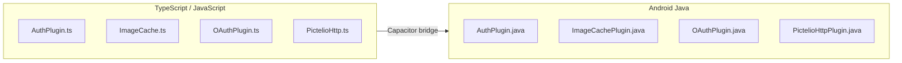

# Android Native & Build

Pictelio packages the SolidJS SPA as a native Android app via Capacitor, with four custom native plugins and a comprehensive build pipeline.

## Native Plugin Architecture

Four custom Capacitor plugins bridge the TypeScript SPA to Android platform capabilities. Each has a Java implementation and a TypeScript wrapper:

### AuthPlugin

**Java:** `/packages/app/android/app/src/main/java/io/pictelio/app/AuthPlugin.java` (8.1 KB)
**TypeScript:** `/packages/app/src/native/AuthPlugin.ts`

Handles OAuth token refresh with Pixiv credentials **hidden from the JavaScript layer**:
- `setCredentials(credentials)` — stores Pixiv client credentials in native memory
- `refreshToken(refreshToken)` — performs the OAuth token refresh call natively, returning the new token pair
- Credentials are never exposed to the WebView, preventing credential theft via XSS

### ImageCachePlugin

**Java:** `/packages/app/android/app/src/main/java/io/pictelio/app/ImageCachePlugin.java` (6.3 KB)
**TypeScript:** `/packages/app/src/native/ImageCache.ts`

Android disk cache for Pixiv images, implementing **L3** of the [Image Loading Pipeline](/openwiki/architecture/image-pipeline.md):
- Intercepts image requests via `shouldInterceptRequest()` in the WebView
- Checks disk cache before making network requests
- Returns cached `WebResourceResponse` when available
- Configurable max disk cache size
- Periodic garbage collection for stale entries

### OAuthPlugin

**Java:** `/packages/app/android/app/src/main/java/io/pictelio/app/OAuthPlugin.java` (15.4 KB)
**TypeScript:** `/packages/app/src/native/OAuthPlugin.ts`

The largest native plugin, handling the PKCE authorization code flow:
- `startOAuth(url, redirectScheme)` — opens Pixiv login in a native WebView
- `onPageFinished` interceptor — captures redirect URL with authorization code
- Extracts the code from the redirect and returns it to JavaScript
- SSRF protection via URL whitelist (per ADR-0002)

### PictelioHttpPlugin

**Java:** `/packages/app/android/app/src/main/java/io/pictelio/app/PictelioHttpPlugin.java` (6.4 KB)
**TypeScript:** `/packages/app/src/native/PictelioHttp.ts`

Native HTTP client replacement for environments where `fetch` is unreliable (some Android WebView configurations):
- `nativeGet(options)` / `nativePost(options)` — native HTTP calls with proper TLS handling
- Used as the transport backend in the [dual-mode API client](/openwiki/architecture/api-layer.md) when running natively
- Supports custom headers, timeout, and response streaming

## Main Activity & Application

### MainActivity.java

`/packages/app/android/app/src/main/java/io/pictelio/app/MainActivity.java` (8.5 KB)

The Android entry point. Key responsibilities:
- Registers all four custom plugins
- Configures WebView settings (JavaScript enabled, DOM storage, mixed content)
- Sets up the back-gesture handler for predictive back navigation
- Initializes the image cache and auth plugin on startup
- Handles Android lifecycle events

### PictelioApp.java

`/packages/app/android/app/src/main/java/io/pictelio/app/PictelioApp.java` (1.3 KB)

Custom `Application` class for app-level initialization.

## WebView Configuration

- **JavaScript:** Enabled
- **DOM Storage:** Enabled
- **Mixed Content:** Allowed (Pixiv API uses both HTTP and HTTPS)
- **User Agent:** Customized for Pixiv API compatibility
- **shouldInterceptRequest:** ImageCachePlugin intercepts image URLs
- **SSRF Whitelist:** Only Pixiv domains and configured image hosts are accessible via WebView proxy (ADR-0002)

## Capacitor Configuration

`/packages/app/capacitor.config.ts` (678 bytes) — Capacitor project configuration:
- App ID: `io.pictelio.app`
- App Name: `Pictelio`
- Server URL: (varies by build — localhost for dev, none for production)
- Android-specific settings for back gesture and navigation

## Build Pipeline

Pictelio uses an automated Android build pipeline with several scripts:

### Key Scripts

| Script | Purpose |
|--------|---------|
| `/packages/app/scripts/release.mjs` | Full release: version bump → build → sign → GitHub release |
| `/packages/app/scripts/release-github.mjs` | GitHub Releases upload |
| `/packages/app/scripts/dev-android.mjs` | One-command dev: Vite → Capacitor sync → Gradle → install |
| `/packages/app/scripts/sync-android-version.mjs` | Syncs version name from `package.json` to `build.gradle` |
| `/packages/app/scripts/sync-credentials.mjs` | Injects Pixiv API credentials for CI builds |
| `/packages/app/scripts/capture-screenshots.mjs` | Automated screenshot pipeline for store listings |

### Build Commands

| Command | What it does |
|---------|--------------|
| `pnpm build:android` | TypeScript check → Vite build → Capacitor sync → Gradle debug build |
| `pnpm build:android:release` | Full signed release APK build (requires signing env vars) |
| `pnpm dev:android` | Vite dev server → Wi-Fi IP detection → Capacitor sync → Gradle → install |
| `pnpm cap:sync` | Copy Web build output + update Capacitor configs |
| `pnpm cap:copy` | Copy Web build output only |
| `pnpm cap:open:android` | Open Android Studio |

### Release Signing

Release APKs are signed using Gradle configuration. Signing credentials are provided via environment variables (never committed). See `/docs/release-signing.md` for the full signing guide.

### Release Checklist

The full release process is documented in `/docs/release-checklist.md` (6.2 KB), covering:
1. Version bump and changelog update
2. Build verification
3. Obfuscation (ProGuard) verification
4. Screenshot capture
5. GitHub release creation
6. Store listing updates

## Platform Compatibility

- **Minimum Android:** 11.0 (API 30)
- **WebView:** ≥ 85 (older versions show upgrade prompt)
- See `/docs/platform-compatibility.md` for details

## Key Source Files

| Purpose | Path |
|---------|------|
| AuthPlugin (Java) | `/packages/app/android/app/src/main/java/io/pictelio/app/AuthPlugin.java` |
| ImageCachePlugin (Java) | `/packages/app/android/app/src/main/java/io/pictelio/app/ImageCachePlugin.java` |
| OAuthPlugin (Java) | `/packages/app/android/app/src/main/java/io/pictelio/app/OAuthPlugin.java` |
| PictelioHttpPlugin (Java) | `/packages/app/android/app/src/main/java/io/pictelio/app/PictelioHttpPlugin.java` |
| MainActivity (Java) | `/packages/app/android/app/src/main/java/io/pictelio/app/MainActivity.java` |
| PictelioApp (Java) | `/packages/app/android/app/src/main/java/io/pictelio/app/PictelioApp.java` |
| AuthPlugin TS bridge | `/packages/app/src/native/AuthPlugin.ts` |
| ImageCache TS bridge | `/packages/app/src/native/ImageCache.ts` |
| OAuthPlugin TS bridge | `/packages/app/src/native/OAuthPlugin.ts` |
| PictelioHttp TS bridge | `/packages/app/src/native/PictelioHttp.ts` |
| Capacitor config | `/packages/app/capacitor.config.ts` |
| Dev Android script | `/packages/app/scripts/dev-android.mjs` |
| Release script | `/packages/app/scripts/release.mjs` |
| GitHub release script | `/packages/app/scripts/release-github.mjs` |
| Version sync script | `/packages/app/scripts/sync-android-version.mjs` |
| Credentials sync script | `/packages/app/scripts/sync-credentials.mjs` |
| Release checklist | `/docs/release-checklist.md` |
| Release signing guide | `/docs/release-signing.md` |
| Platform compat | `/docs/platform-compatibility.md` |
| GitHub release docs | `/docs/github-release.md` |
