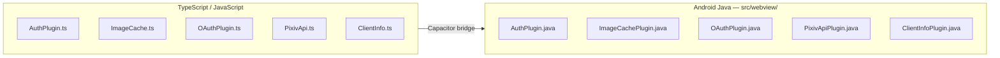
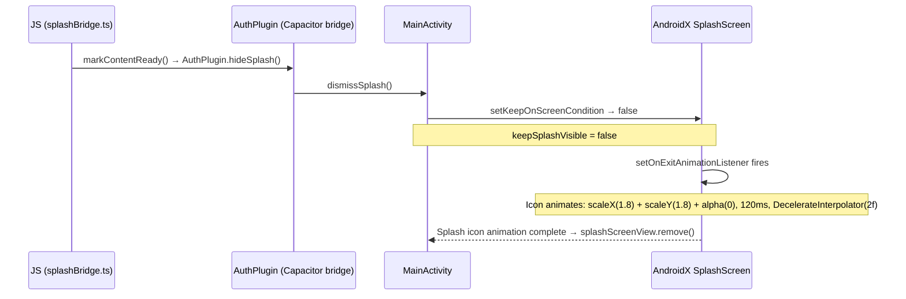

# Android Native & Build

Pictelio packages the SolidJS SPA as a native Android app via Capacitor, with four custom native plugins, three Lynx Native Modules, and a comprehensive build pipeline.

## Three-Flavor Architecture (v4.0.0+)

Since v4.0.0 (issues #115–#119), the Android project uses **Gradle product flavors** to produce three separate APKs from a single codebase:

| Flavor | Client engines | Launcher Activity | Application class |
|--------|---------------|-------------------|-------------------|
| **full** | WebView + Lynx | `MainActivity` | `PictelioApp` |
| **webview** | WebView only | `MainActivityWebview` | `PictelioAppWebview` |
| **lynx** | Lynx only | `LynxActivity` | `PictelioAppLynx` |

Each flavor injects a `BuildConfig.CLIENT_KINDS` array (`{"webview", "lynx"}`, `{"webview"}`, or `{"lynx"}`) used by ADR-0062 to hide the client-switch UI in single-engine builds.

Source files are split across flavor sourceSets:

| SourceSet | Contains |
|-----------|----------|
| `src/main/` | Shared: `PixivApiCore`, `PixivImageLoader`, `SecureStorageCompat`, `OAuthUtils`, `SplashController`, `OAuthConfig`, resources |
| `src/webview/` | Capacitor plugins: `AuthPlugin`, `ImageCachePlugin`, `OAuthPlugin`, `PixivApiPlugin`, `ClientInfoPlugin`; WebView-only entry: `MainActivityWebview`, `PictelioAppWebview` |
| `src/lynx/` | Lynx Native Modules: `PictelioApiModule`, `PictelioAppModule`, `PictelioAuthModule`, `PictelioSecureStorageModule`, `PictelioImageService`, `PictelioTemplateProvider`; Lynx-only entry: `LynxActivity`, `PictelioAppLynx` |
| `src/full/` | Full-flavor overlays: `MainActivity` (routing gate), `PictelioApp` (conditional init) — merges both `webview` + `lynx` sources |

The `main/AndroidManifest.xml` uses `${launcherActivity}` and `${appClass}` manifest placeholders resolved per-flavor in `build.gradle`.

## Native Plugin Architecture

Four custom Capacitor plugins bridge the TypeScript SPA to Android platform capabilities. Each has a Java implementation and a TypeScript wrapper. Since v4.0.0 (flavor migration), the Capacitor plugin Java sources reside under `src/webview/java/`:

### AuthPlugin

**Java:** `/packages/app/android/app/src/webview/java/io/pictelio/app/AuthPlugin.java` (8.1 KB)
**TypeScript:** `/packages/app/src/native/AuthPlugin.ts`

Handles OAuth token refresh with Pixiv credentials **hidden from the JavaScript layer**, plus native splash screen control:

**Methods:**
- `setCredentials(credentials)` — stores Pixiv client credentials in native memory
- `refreshToken(refreshToken)` — performs the OAuth token refresh call natively, returning the new token pair
- `hideSplash()` — calls `MainActivity.dismissSplash()`, triggering native Splash Screen exit. Called from `splashBridge.ts` when content is ready (v3.21.0+, see [Splash Screen JS Bridge](#splash-screen-js-bridge))

**Security:**
- Credentials are never exposed to the WebView, preventing credential theft via XSS

### ImageCachePlugin

**Java:** `/packages/app/android/app/src/main/java/io/pictelio/app/ImageCachePlugin.java` (6.3 KB)
**TypeScript:** `/packages/app/src/native/ImageCache.ts`

Android disk cache for Pixiv images, implementing **L3** of the [Image Loading Pipeline](/openwiki/architecture/image-pipeline.md):
- Intercepts image requests via `shouldInterceptRequest()` in the WebView
- Checks disk cache before making network requests
- Returns cached `WebResourceResponse` when available
- Configurable max disk cache size
- Periodic garbage collection for stale entries

### OAuthPlugin

**Java:** `/packages/app/android/app/src/webview/java/io/pictelio/app/OAuthPlugin.java` (15.4 KB)
**TypeScript:** `/packages/app/src/native/OAuthPlugin.ts`

The largest native plugin, handling the PKCE authorization code flow:
- `startOAuth(url, redirectScheme)` — opens Pixiv login in a native WebView
- `onPageFinished` interceptor — captures redirect URL with authorization code
- Extracts the code from the redirect and returns it to JavaScript
- SSRF protection via URL whitelist (per ADR-0002)

### PixivApiPlugin (Gateway)

**Java:** `/packages/app/android/app/src/main/java/io/pictelio/app/PixivApiPlugin.java` (15 KB)
**TypeScript:** `/packages/app/src/native/PixivApi.ts`

Introduced in **v3.18.0** as the sole gateway for all Pixiv API communication (ADR-0037). Replaces the former PictelioHttpPlugin, which was deleted:

- `request({ method, path, params, body })` — all Pixiv App-API requests go through this single plugin method
- **access_token is never exposed to the JavaScript layer** — stored in a Java `volatile` field, injected into OkHttp requests internally
- **401 auto-refresh** — Java side detects 401 responses, uses `synchronized` + `isRefreshing` flag to refresh the token internally, then retries once. The `refresh_token` used for the exchange is read from Java memory (injected by JS) — no SharedPreferences disk read. No JS-side Promise queue needed in production.
- **`syncToken({ token })`** (v3.21.6, replaces `setRefreshToken`) — syncs the `refresh_token` into Java memory only, never written to disk. A `null`/empty token clears the memory value (and, on logout, the `access_token` as defense-in-depth) and idempotently removes the historical plaintext residue in `PictelioPrefs.xml` left by the old native `setRefreshToken`.
- **`refreshTokenRotated` event** — if the Java-side 401 silent refresh receives a rotated `refresh_token`, Java updates its own memory and notifies JS via this event so `authStore` persists the new value (`saveRefreshToken`) instead of restoring a stale token after restart. Pixiv does not currently rotate refresh tokens, so this is defensive (see [API Layer — Token Persistence](/openwiki/architecture/api-layer.md#token-persistence--backup-integrity)).
- **`prefetchImage({ url })`** — downloads images directly to the Android disk cache directory, zero bytes enter the JS heap
- **`getSharedClient()`** (static, package-private) — exposes the internal shared `OkHttpClient` so `MainActivity.interceptImage()` can reuse the same connection pool instead of creating per-request `HttpURLConnection` instances. Reduces connection setup overhead for image proxy requests.
- Credentials and OAuth config live only in compiled Java bytecode

**Deprecated/Deleted:** PictelioHttpPlugin.java and PictelioHttp.ts — the dual-path transport for native HTTP is gone. All native API requests now route through PixivApiPlugin.

### Splash Screen JS Bridge

**TypeScript:** `/packages/app/src/native/splashBridge.ts` (new in v3.21.0)
**Java:** `AuthPlugin.hideSplash()` method in `/packages/app/android/app/src/main/java/io/pictelio/app/AuthPlugin.java`

Controls the native Splash Screen via a custom Capacitor plugin bridge. `markContentReady()` calls `AuthPlugin.hideSplash()`, which calls `MainActivity.dismissSplash()`, setting the private `keepSplashVisible` `AtomicBoolean` to `false`. This triggers the `SplashScreen.setKeepOnScreenCondition()` closure on the native AndroidX `SplashScreen` (compat library).

This replaced a prior attempt to use `@capacitor/splash-screen` npm package; the final implementation uses the existing AuthPlugin bridge to avoid adding a new dependency.

- **`markContentReady()`** — idempotent function that calls `AuthPlugin.hideSplash()`. After first call, a module-level `contentReady` flag prevents subsequent calls.
- Silently skipped in web/dev environments — `AuthPlugin.hideSplash()` catch handler logs a warning without crashing.
- No dynamic import needed; `AuthPlugin` is always registered as a Capacitor plugin.

**Architecture:**

**Call sites:**
| Location | When Called | Purpose |
|----------|-------------|---------|
| `Login.tsx` `onMount` | Login page renders | Closes splash when user needs to authenticate |
| `HomePage.tsx` (`createEffect` + `onMount`) | `createEffect` watches `recLoading()`/`folLoading()` → 350ms delay → `markContentReady()`; 800ms fallback | Loading-triggered strategy ensures skeleton paints before splash closes. Exit animation (120ms scale+fade) reintroduced for visual polish. |
| `__root.tsx` `onMount` | Auth init completes (fallback) | Closes splash for non-feed pages (about, settings, etc.) if Login/HomePage haven't already |

**Android native:**
- `MainActivity.java`: retains `SplashScreen.installSplashScreen(this)` + `setKeepOnScreenCondition(() -> keepSplashVisible.get())`. The private `keepSplashVisible` `AtomicBoolean` defaults to `true` and is set to `false` via the package-private `dismissSplash()` method, called by `AuthPlugin.hideSplash()`
- **Exit animation (reintroduced):** The previously-removed `setOnExitAnimationListener` is back: the splash icon now scales to 1.8x with alpha(0) over 120ms using `DecelerateInterpolator(2f)`, then `splashScreenView.remove()` is called. This animation had been removed in commit `fa2015c` when the splash dismiss was simplified to immediate `onMount`-only. Now that dismiss is loading-triggered again, the animation was restored for visual polish. See [HomePage](/openwiki/domain/feed-and-browsing.md#homepage-consolidated-home) for the full loading-triggered dismiss flow.
- `styles.xml`: `AppTheme.NoActionBarLaunch` inherits `Theme.SplashScreen` — splash background and icon defined in theme XML
- `build.gradle`: retains `androidx.core:core-splashscreen` dependency
- `variables.gradle`: retains `coreSplashScreenVersion = '1.2.0'`

### ClientInfoPlugin (ADR-0062)

**Java:** `/packages/app/android/app/src/webview/java/io/pictelio/app/ClientInfoPlugin.java`
**TypeScript:** `/packages/app/src/native/ClientInfo.ts`

A Capacitor plugin (`@CapacitorPlugin(name = "ClientInfo")`) that exposes the current build flavor's client capabilities to the WebView JavaScript layer, plus Activity-level restart for engine switching. Used by [ADR-0062](/docs/adr/ADR-0062-single-engine-client-switch-hiding.md) to hide the engine-switch UI in single-engine builds:

- **`getClientKinds()`** — returns `{ kinds: ["webview", "lynx"] }` (full), `{ kinds: ["webview"] }` (webview), or `{ kinds: ["lynx"] }` (lynx). Reads from `BuildConfig.CLIENT_KINDS` injected per-flavor by Gradle.
- **`restart()`** (issue #120) — Activity-level restart via `FLAG_ACTIVITY_NEW_TASK | FLAG_ACTIVITY_CLEAR_TASK`. Keeps the process alive (preserving token memory state, OkHttp connection pool, and image disk cache); the old Activity is destroyed with its WebView. The new Activity's entry routing dispatches by `pictelio_client_kind` (written before restart by `clientSwitch.ts`). Aligned with the lynx-side `PictelioAppModule.restart` — both use the same restart mechanism (issue #124).
- Registered in both `MainActivity` (full) and `MainActivityWebview` (webview-only).
- The lynx client reads the same information via `PictelioAppModule.getClientKinds()`.

See [clientSwitch.ts](/packages/app/src/utils/clientSwitch.ts) for the frontend `supportsClientSwitch()` logic and [SettingsClient.tsx](/packages/app/src/components/settings/SettingsClient.tsx) for the UI hiding behavior.

## Lynx Native Modules

The following Lynx Native Modules reside under `src/lynx/java/` (lynx flavor) and are also merged into the full flavor. Unlike the Capacitor plugins above, these extend `com.lynx.jsbridge.LynxModule` and are registered in the LynxView's module registry.

Introduced in #52 for the [app-lynx vue-lynx client](/openwiki/architecture/overview.md#app-lynx-vue-lynx-client). Unlike the four Capacitor plugins above, `PictelioSecureStorageModule` is a **LynxModule** — it extends `com.lynx.jsbridge.LynxModule` and is registered in the LynxView's module registry rather than via Capacitor's plugin system.

**Java:** `/packages/app/android/app/src/main/java/io/pictelio/app/PictelioSecureStorageModule.java`
**Type declarations:** `/packages/app-lynx/src/rspeedy-env.d.ts` (under `globalThis.NativeModules`)
**JS caller:** `/packages/app-lynx/src/utils/tokenStorage.ts` (`nativeModule()` probe)

Provides three callback-based methods exposed to Lynx JS via `NativeModules.PictelioSecureStorage`:

| Method | Contract |
|--------|----------|
| `getItem(key, cb)` | Success: `cb(value)`; failure: `cb(errMsg)` |
| `setItem(key, data, cb)` | Success: `cb()`; failure: `cb(errMsg)` |
| `removeItem(key, cb)` | Success: `cb()`; failure: `cb(errMsg)` |

> **Callback signature:** Lynx `CallbackImpl` crashes on `null` arguments on real devices. All success callbacks use single-arg (value only) or no-arg forms — never pass `null` as a placeholder.

**Storage backend:** [`SecureStorageCompat`](#securestoragecompat) — a pure-Java AES/GCM utility byte-compatible with `@aparajita/capacitor-secure-storage` 8.x. Uses the same Keystore alias (`capacitor-storage_refresh_token`) and `WSSecureStorageSharedPreferences` ciphertext file as the main app's [token persistence](/openwiki/architecture/api-layer.md#token-persistence--backup-integrity). This means the lynx client and webview client share a single login state — logging in on one client makes the token available to the other.

### SecureStorageCompat

**Java:** `/packages/app/android/app/src/main/java/io/pictelio/app/SecureStorageCompat.java`
**Tests:** `/packages/app/android/app/src/test/java/io/pictelio/app/SecureStorageCompatTest.java` (Robolectric)

A self-contained encryption utility that mirrors `@aparajita/capacitor-secure-storage`'s ciphertext format field-for-field:

- **Algorithm:** AES/GCM/NoPadding, AndroidKeyStore, one AES key per storage key (`PURPOSE_ENCRYPT|DECRYPT`, `BLOCK_MODE_GCM`, `ENCRYPTION_PADDING_NONE`)
- **SharedPreferences:** `WSSecureStorageSharedPreferences` (MODE_PRIVATE) — same file as the Capacitor plugin
- **Storage key:** `capacitor-storage_` + key (e.g., `capacitor-storage_refresh_token`)
- **Ciphertext format:** `Base64(ciphertext) + "\u0010" + Base64(iv)` — NO_PADDING + NO_WRAP

The `encryptString` / `decryptString` static methods are key-injected (accept a `SecretKey` parameter) so they can be unit-tested with Robolectric without AndroidKeyStore. `SecureStorageCompatTest` covers round-trip, Unicode, format contract validation, format errors, and wrong-key detection via GCM authentication failure (`AEADBadTagException`).

### PictelioAppModule

**Java:** `/packages/app/android/app/src/lynx/java/io/pictelio/app/PictelioAppModule.java`

A LynxModule for client-switching and native app control, used by the [app-lynx client](/openwiki/architecture/overview.md#app-lynx-vue-lynx-client)'s [`clientSwitchStore`](/packages/app-lynx/src/stores/clientSwitchStore.ts). Exposed to Lynx JS via `NativeModules.PictelioApp`:

| Method | Contract |
|--------|----------|
| `setClientKind(kind, cb)` | Writes `pictelio_client_kind` to `SharedPreferences("CapacitorStorage")`. Success: `cb()`; failure: `cb(errMsg)`. |
| `getClientKind(cb)` | Reads current client kind. Success: `cb(kind)`; failure: `cb(errMsg)`. |
| `getClientKinds(cb)` | Returns `BuildConfig.CLIENT_KINDS` array for ADR-0062 switch-UI hiding. Success: `cb(kinds[])`. |
| `restart(cb)` | Activity-level restart via `FLAG_ACTIVITY_NEW_TASK \| FLAG_ACTIVITY_CLEAR_TASK`. Keeps the process alive (token memory state, OkHttp pool, disk cache preserved). The old `LynxActivity` is destroyed by `CLEAR_TASK`. Aligned with webview-side `ClientInfoPlugin.restart` (issue #120/#124). |
| `httpGet(url, cb)` | Native HTTP GET for the lynx update-check — implements the `fetchImpl` seam of the shared `@pictelio/update-check` layer (ADR-0089, evolved from ADR-0065): fetches `version.json` from a background thread pool with an http/https scheme whitelist, 10s call timeout, and a response-body size cap (the lynx native runtime has no `fetch`). |

Callback signatures follow the same null-free pattern as `PictelioSecureStorageModule` — `CallbackImpl` on real devices crashes on `null` arguments.

### PictelioApiModule

**Java:** `/packages/app/android/app/src/main/java/io/pictelio/app/PictelioApiModule.java` (57 lines, new in #53)

A LynxModule for Pixiv API forwarding, used by the [app-lynx client](/openwiki/architecture/overview.md#app-lynx-vue-lynx-client)'s [API layer](/openwiki/architecture/overview.md#api-client). Exposed to Lynx JS via `NativeModules.PictelioApi`. Wraps `PixivApiPlugin.executeRequest()` — the same package-private static method used by the Capacitor plugin path — so both webview and Lynx clients share a single OkHttp connection pool and 401 refresh logic.

| Method | Contract |
|--------|----------|
| `request(method, path, body, cb)` | JS passes HTTP method, API path (may include query string), and body; Java constructs the full URL (`app-api.pixiv.net`), injects `Authorization: Bearer`, `Referer`, and `User-Agent` headers, and handles 401 → silent token refresh → retry internally. Callback receives `(status, data, rotatedRefreshToken)` — status is the HTTP code (0 on network/forwarding error), data is the response body JSON string, and the third param is a new `refresh_token` if rotation occurred (empty string otherwise). **access_token is never returned to JS.** |

The rotated `refresh_token` callback (third parameter) allows the JS side to persist the new token via `saveRefreshToken()` → `PictelioSecureStorage`, preventing the client from restoring a stale token after restart.

### PictelioAuthModule

**Java:** `/packages/app/android/app/src/lynx/java/io/pictelio/app/PictelioAuthModule.java` (87 lines, new in #53)

A LynxModule for OAuth authentication, used by the [app-lynx client](/openwiki/architecture/overview.md#app-lynx-vue-lynx-client)'s [`authStore`](/packages/app-lynx/src/stores/authStore.ts). Exposed to Lynx JS via `NativeModules.PictelioAuth`. Wraps `PixivApiPlugin.oauthTokenExchange()` for the OAuth refresh_token exchange — same logic as the Capacitor `AuthPlugin`.

| Method | Contract |
|--------|----------|
| `loginWithRefreshToken(token, cb)` | Performs the OAuth token exchange via `PixivApiPlugin.oauthTokenExchange()`. On success: writes `access_token` into `PixivApiPlugin.accessToken` (Java heap only, **never returned to JS**), writes rotated `refresh_token` (if any) into `PixivApiPlugin.refreshToken`, and calls back with `(userInfoJson, "")` — userInfoJson contains `userId`, `userName`, `userAccount`, `profileImageUrls`, and the `refreshToken` (for JS-side persistence). On failure: `("", errMsg)`. |
| `setAccessToken(token)` | Fallback: pushes an access_token into Java heap (used when JS has a token from a web-mode OAuth flow). No callback. |
| `clearTokens(cb)` | Logout: nullifies both `PixivApiPlugin.accessToken` and `PixivApiPlugin.refreshToken`. Callback: `("", "")`. |

**Security model:** The `access_token` flows in only one direction — JS → Java (via `setAccessToken` or `loginWithRefreshToken`). It is never extracted back to JS. All API requests go through `PictelioApiModule.request()`, where Java injects the Bearer token internally. This mirrors the Capacitor `PixivApiPlugin` security model: the WebView and LynxView are both treated as untrusted JS environments.

### Lynx SDK Dependency

`build.gradle` includes these Lynx SDK dependencies:
- `org.lynxsdk.lynx:lynx:4.0.1` — core SDK, required for `PictelioSecureStorageModule` to extend `LynxModule` and use `@LynxMethod` / `Callback` / `LynxContext`
- `org.lynxsdk.lynx:lynx-service-http:4.0.1` — native HTTP service; without this `lynx.fetch` is unavailable, breaking all API calls and OAuth token refresh
- `org.lynxsdk.lynx:lynx-service-log:4.0.1` — official logging service baseline
- `org.lynxsdk.lynx:xelement:4.0.1` + `org.lynxsdk.lynx:xelement-input:4.0.1` — XElement official extension components (#51, required on real devices): provides `<input>`/`<textarea>` behaviors. Without these, `LynxError 990200 "No BehaviorController defined for class input"` breaks login form rendering on real devices (2026-08-01, `Login.vue` input fields failed to render).
- `lynx-service-image` (Fresco) is **not** included — `i.pximg.net` requires `Referer` headers, which Fresco does not forward, causing 403 errors; replaced by custom [`PictelioImageService`](#pictelioimageservice) (#59), which implements `ILynxImageService` on top of [`PixivImageLoader`](#pixivimageloader)

## Backup Rules & Token Storage Exclusions (ADR-0003)

The `refresh_token` is stored in Android Keystore-backed encrypted storage (`@aparajita/capacitor-secure-storage` 8.x — self-implemented AES/GCM, ciphertext file `WSSecureStorageSharedPreferences.xml`). Because `android:allowBackup="true"`, backup is defended by three layers per [ADR-0003](/docs/adr/0003-backup-security-three-layer-defense.md) (grounded in [docs/research/android-token-storage.md](/docs/research/android-token-storage.md)):

1. **Android 12+ (API 31+):** `res/xml/data_extraction_rules.xml` excludes `WSSecureStorageSharedPreferences.xml` and `PictelioPrefs.xml` from both the `cloud-backup` and `device-transfer` sections.
2. **Android 11- (API 30-):** `res/xml/backup_rules.xml` applies the same `sharedpref` exclusions for full backups.
3. **Runtime integrity check:** `secureStorage.restoreRefreshToken()` — a marker-read or token-decrypt failure (e.g. backup restored onto a device without the Keystore key) clears the token and forces re-login. This layer is documented with the [Token Persistence & Backup Integrity](/openwiki/architecture/api-layer.md#token-persistence--backup-integrity) module.

`AndroidManifest.xml` wires the XML layers with `android:allowBackup="true"`, `android:dataExtractionRules="@xml/data_extraction_rules"` (Android 12+), and `android:fullBackupContent="@xml/backup_rules"` (Android 11-).

**Why byte-exact file names matter:** backup `exclude path` is an exact filename match. The rules previously excluded a nonexistent `_capacitor_secure_storage.xml` while the plugin actually writes `WSSecureStorageSharedPreferences.xml`, so ciphertext was silently exported with backups. Since v3.21.6 the exclusions match the real constant, and [backupRulesConsistency.test.ts](/packages/app/tests/unit/utils/backupRulesConsistency.test.ts) extracts that constant from the plugin source to keep all three XML sections in sync (see [Testing Strategy — Config Consistency Anti-Drift Tests](/openwiki/testing/overview.md#config-consistency-anti-drift-tests)).

**Native side (v3.21.6):** `PixivApiPlugin` never persists the `refresh_token` — `syncToken()` holds it in Java memory only, and `PictelioPrefs.xml` is historical plaintext residue that `syncToken(null)`/`syncToken("")` idempotently removes.

## Main Activity & Application

### MainActivity.java

`/packages/app/android/app/src/main/java/io/pictelio/app/MainActivity.java` (11 KB)

The Android entry point. Key responsibilities:
- **Client routing gate (#51):** Before any Capacitor/WebView initialization, reads `SharedPreferences("CapacitorStorage")` key `pictelio_client_kind`. If `"lynx"`, **must** call `super.onCreate(savedInstanceState)` first (Android hard constraint — `SuperNotCalledException` on real devices), then starts [`LynxActivity`](#lynxactivity) and calls `finish()` — no Capacitor bridge, plugin registration, or WebView checks are performed after `super.onCreate`. The dual-Activity approach was chosen because `BridgeActivity.onCreate` unconditionally creates a WebView (see [research](/docs/research/lynx-android-brownfield-integration.md)).
- Registers all five custom plugins: **`ImageCachePlugin`**, **`AuthPlugin`**, **`OAuthPlugin`**, **`PixivApiPlugin`** (v3.18.0+, replaced PictelioHttpPlugin), **`ClientInfoPlugin`** (ADR-0062) — only when the webview path is taken
- Configures WebView settings (JavaScript enabled, DOM storage, mixed content)
- Sets up the back-gesture handler for predictive back navigation
- Initializes the image cache and auth plugin on startup
- Handles Android lifecycle events
- Intercepts `/pixiv-img/` WebView requests via `shouldInterceptRequest` for image caching (retained from previous architecture)
- Image proxy via `shouldInterceptRequest` now delegates to a shared [`PixivImageLoader`](#pixivimageloader) singleton (double-checked locking), which centralizes URL rewriting, disk cache read/write, and OkHttp download — per-URL locking prevents concurrent cache writes from multi-threaded WebView interception. Previously used `HttpURLConnection` then direct `OkHttpClient` calls inline.

> **v3.20.0–v3.21.0:** Splash Screen dismiss moved from Android-only `core-splashscreen` API to JS-controlled via `AuthPlugin.hideSplash()` bridge. `MainActivity` retains `SplashScreen.installSplashScreen(this)` but defers exit to `keepSplashVisible` AtomicBoolean controlled by the plugin (see [Splash Screen JS Bridge](#splash-screen-js-bridge)).

### OAuthUtils

**Java:** `/packages/app/android/app/src/main/java/io/pictelio/app/OAuthUtils.java`

Extracted shared utility class (v3.18.0) containing helper methods used by native plugins:
- `md5Hex()` — MD5 hashing for OAuth code challenge verification
- `urlEncode()` — URL-safe encoding for OAuth parameters
- `URLSearchParams` — query string construction from key-value pairs

Previously duplicated across plugins; now centralized in a single utility class.

### PixivImageLoader

**Java:** `/packages/app/android/app/src/main/java/io/pictelio/app/PixivImageLoader.java` (new in #57)
**Test:** `/packages/app/android/app/src/test/java/io/pictelio/app/PixivImageLoaderTest.java`

Shared image loading core — the single source of truth for Pixiv image download logic, consumed by both the WebView proxy path and the Lynx image service:

- **URL rewriting:** `/pixiv-img/{path}` → `OAuthConfig.IMAGE_CDN_URL + "/" + path` with URI normalization
- **OkHttp download:** Reuses `PixivApiPlugin.getSharedClient()` shared connection pool, injects `Referer` and `User-Agent` headers (required by `i.pximg.net` anti-hotlinking)
- **Disk cache:** Read/write/evict using `OAuthConfig.CACHE_DIR` / `pictelio-images/`, Base64 URL-safe filename encoding, LRU eviction with configurable `maxCacheBytes` — same cache directory and naming conventions as `ImageCachePlugin` and `PixivApiPlugin.prefetchImage()`, so both clients share the same on-disk cache
- **Per-URL locking:** `ConcurrentHashMap` prevents concurrent writes to the same cache file from multi-threaded callers (WebView interception is multi-threaded)

**Consumers:**
- **WebView path:** `MainActivity.interceptImage()` — calls `PixivImageLoader.cachedFile()` for disk cache hits, `loadBytes()` for cache-miss-with-write, or `download()` when disk cache is off; wraps results in `WebResourceResponse` via `bytesResponse()` and `mimeFor()` helpers
- **Lynx path:** [`PictelioImageService`](#pictelioimageservice) — reads cached bytes, decodes to `Bitmap`, and delivers via `ImageLoadListener.onSuccess`

### PictelioImageService

**Java:** `/packages/app/android/app/src/main/java/io/pictelio/app/PictelioImageService.java` (new in #59)
**Test:** `/packages/app/android/app/src/test/java/io/pictelio/app/PictelioImageServiceTest.java`

Custom Lynx image service implementing `ILynxImageService` — the sole image loading backend for the vue-lynx client. Registered in `PictelioApp.initLynx()` via `LynxServiceCenter.inst().registerService()` before any `LynxView` is created.

- **Backend:** Delegates all download and caching logic to [`PixivImageLoader`](#pixivimageloader) — no duplicated URL rewriting or HTTP logic
- **Behavior registration (#59):** The constructor registers `<image>` and `<inline-image>` element behaviors via `LynxEnv.inst().addBehaviors()` — creating `UIImage`/`FlattenUIImage`/`AutoSizeImage` (for `image`) and `InlineImageShadowNode` (for `inline-image`). Without this, the Lynx engine cannot create image UI on real devices (skeleton remains visible, no image logs). This mirrors the official `LynxImageService` constructor logic and is required in addition to implementing `ILynxImageService`.
- **`fetchImage()`:** Offloads download + bitmap decode to a `CachedThreadPool`, calls `ImageLoadListener.onSuccess(imageInfo, ImageContent(Bitmap))` on the Lynx image thread
- **Static images only:** Animation callbacks (`canAnimate`, `startAnimation`, etc.) all return `false`/no-op — ugoira/GIF support is not planned for the Lynx MVP
- **Singleton:** `getInstance()` returns the single `INSTANCE`; `onInitialize(context)` stores the Application context for lazy `PixivImageLoader` creation

This replaces the unviable Fresco `lynx-service-image` dependency (see [Lynx SDK Dependency](#lynx-sdk-dependency)), because Fresco cannot inject the `Referer` header required by `i.pximg.net`.

### Native Bitmap Memory Cache

**Java:** [`ImageMemoryCache.java`](/packages/app/android/app/src/main/java/io/pictelio/app/ImageMemoryCache.java) + [`LruCache.java`](/packages/app/android/app/src/main/java/io/pictelio/app/LruCache.java) (new, #145/#147)
**Tests:** `ImageMemoryCacheTest.java`, `LruCacheTest.java` (Robolectric)

A native Bitmap LRU memory cache that accelerates second renders: decoded `Bitmap`s are cached in Java memory (LRU eviction) so re-visiting an image renders instantly instead of re-decoding from disk. Introduced alongside detail image quality tiers (default `medium`) that skip the original image for single-page works (#145/#146/#148).

### PictelioApp.java (full flavor)

`/packages/app/android/app/src/full/java/io/pictelio/app/PictelioApp.java`

Custom `Application` class for the full flavor. Since v4.0.0, each flavor has its own Application class: `PictelioApp` (full), `PictelioAppWebview` (`src/webview/`), `PictelioAppLynx` (`src/lynx/`). The full-flavor version conditionally initializes either the Lynx or WebView path based on `pictelio_client_kind` from `SharedPreferences("CapacitorStorage")`:

- **`"lynx"`** → `initLynx()`: Delegates to [`LynxRuntimeInitializer.ensureInitialized(this)`](#lynxruntimeinitializer) — the shared, idempotent Lynx init point. Skips WebView warmup entirely.
- **`"webview"` (default)** → `warmUpWebView()`: Pre-warms the WebView service process (unchanged behavior).

Exception safety: Lynx init failure is caught and logged — the app does not crash, but the lynx client path will be unavailable.

### LynxActivity

`/packages/app/android/app/src/lynx/java/io/pictelio/app/LynxActivity.java`

The dedicated LynxView host Activity, launched by `MainActivity` when `pictelio_client_kind` is `"lynx"`. Extends `AppCompatActivity` directly (no Capacitor bridge), and:

- **LynxEnv fallback init (issue #120/#122):** In `onCreate`, before creating the `LynxView`, calls `LynxRuntimeInitializer.ensureInitialized(getApplication())` as a defensive fallback. This covers the process-reuse scenario — when the user switches engines, `Application.onCreate` does not re-run (process is kept alive by the new Activity-level restart), so `LynxEnv` would be uninitialized. Without this fallback, the LynxView creation fails with error 102. `LynxEnv.init` is idempotent (internal `hasInit` guard), so calling it again is safe. On failure, exits splash and shows error fallback instead of crashing.
- **XElement behaviors (#51):** Sets `builder.addBehaviors(new XElementBehaviors().create())` on the `LynxViewBuilder` before view creation — required on real devices for `<input>`/`<textarea>` and other extension components. Without this, login input fields fail with `LynxError 990200`.
- **Per-view module registration:** Registers `PictelioSecureStorage` and `PictelioApp` LynxModules (coexists with `PictelioApp` global registration; global `LynxEnv` takes priority).
- **Template provider:** Uses `PictelioTemplateProvider` for loading the Lynx template bundle (`template.js`).

### LynxRuntimeInitializer

**Java:** `/packages/app/android/app/src/lynx/java/io/pictelio/app/LynxRuntimeInitializer.java` (new, issue #120/#122)

Shared, idempotent Lynx runtime initialization point. Extracted from `PictelioApp.initLynx()` so both cold-start and process-reuse paths share the same logic:

- **`ensureInitialized(Application app)`** — Registers Lynx services (`LynxHttpService`, `LynxLogService`, `PictelioImageService`) via `LynxServiceCenter`, calls `LynxEnv.inst().init(app, …)` (idempotent — internal `hasInit` `AtomicBoolean`), globally registers four LynxModules (`PictelioSecureStorage`, `PictelioApp`, `PictelioAuth`, `PictelioApi`), and enables `LynxDebug` in debug builds. Must be called before any `LynxView` is created.

**Callers:**
| Caller | Scenario |
|--------|----------|
| `PictelioApp.initLynx()` | Process cold start (full flavor) |
| `LynxActivity.onCreate()` | Process reuse after engine switch (error 102 fix) |

## WebView Configuration

- **JavaScript:** Enabled
- **DOM Storage:** Enabled
- **Mixed Content:** Allowed (Pixiv API uses both HTTP and HTTPS)
- **User Agent:** Customized for Pixiv API compatibility
- **Image interception:** `shouldInterceptRequest` in `MainActivity` intercepts `/pixiv-img/` requests, delegating to [`PixivImageLoader`](#pixivimageloader) for URL rewriting, disk cache lookup (L3), and proxied download with `Referer`/`User-Agent` headers
- **SSRF Whitelist:** Only Pixiv domains and configured image hosts are accessible via WebView proxy (ADR-0002)

## Capacitor Configuration

`/packages/app/capacitor.config.ts` (678 bytes) — Capacitor project configuration:
- App ID: `io.pictelio.app`
- App Name: `Pictelio`
- Server URL: (varies by build — localhost for dev, none for production)
- Android-specific settings for back gesture and navigation
- `plugins.CapacitorHttp: { enabled: true }` — enables Capacitor's native HTTP plugin for API requests

## Build Pipeline

Pictelio uses an automated Android build pipeline with several scripts:

### Key Scripts

| Script | Purpose |
|--------|---------|
| `/packages/app/scripts/release.mjs` | Full release: version bump → build → sign → GitHub release |
| `/packages/app/scripts/dev-android.mjs` | One-command dev: Vite → Capacitor sync → Gradle → install |
| `/packages/app/scripts/sync-android-version.mjs` | Syncs version name from `package.json` to `build.gradle` |
| `/packages/app/scripts/sync-credentials.mjs` | Injects Pixiv API credentials for CI builds |

### Build Commands

| Command | What it does |
|---------|--------------|
| `pnpm build:android` | TypeScript check → Vite build → Capacitor sync → Gradle debug build |
| `pnpm build:android:release` | Full signed release APK build (requires signing env vars) |
| `pnpm dev:android` | Vite dev server → Wi-Fi IP detection → Capacitor sync → Gradle → install |
| `pnpm cap:sync` | Copy Web build output + update Capacitor configs |
| `pnpm cap:copy` | Copy Web build output only |
| `pnpm cap:open:android` | Open Android Studio |

### Release Signing

Release APKs are signed using Gradle configuration. Signing credentials are provided via environment variables (never committed). See `/docs/release-signing.md` for the full signing guide.

### Release Checklist

The full release process is documented in `/docs/release-checklist.md` (6.2 KB), covering:
1. Version bump and changelog update
2. Build verification
3. Obfuscation (ProGuard) verification
4. Screenshot capture
5. GitHub release creation
6. Store listing updates

### ProGuard / R8 Keep Rules

`/packages/app/android/app/proguard-rules.pro` includes release-only keep rules critical for Lynx native integration:

- **`LynxBaseTrace` / `LynxLog`** (issue #120/#121) — The native `lynxbase.so` library uses JNI `GetStaticMethodID` to locate static methods by name (no `@CalledByNative` annotation). R8 renames these methods during obfuscation, causing `"Failed to find staticlog(...)"` → `SIGABRT` crash on real devices in release builds. Debug builds are unaffected (no obfuscation).
- **`PictelioImageService`** — Kept as defense-in-depth. Registered via `LynxServiceCenter` by interface (`ILynxImageService`), so R8 renaming is actually safe; the keep rule is precautionary against potential reflection-based lookups by the Lynx runtime.

These rules are in addition to the base ProGuard rules from ADR-0001 (native plugin keep rules).

## Platform Compatibility

- **Minimum Android:** 11.0 (API 30)
- **WebView:** ≥ 85 (older versions show upgrade prompt)
- See `/docs/platform-compatibility.md` for details

## Key Source Files

### Capacitor Plugins (webview flavor, also in full)

| Purpose | Path |
|---------|------|
| AuthPlugin (Java) | `/packages/app/android/app/src/webview/java/io/pictelio/app/AuthPlugin.java` |
| ImageCachePlugin (Java) | `/packages/app/android/app/src/webview/java/io/pictelio/app/ImageCachePlugin.java` |
| OAuthPlugin (Java) | `/packages/app/android/app/src/webview/java/io/pictelio/app/OAuthPlugin.java` |
| PixivApiPlugin (Java) | `/packages/app/android/app/src/webview/java/io/pictelio/app/PixivApiPlugin.java` |
| ClientInfoPlugin (Java, ADR-0062) | `/packages/app/android/app/src/webview/java/io/pictelio/app/ClientInfoPlugin.java` |
| MainActivityWebview (Java) | `/packages/app/android/app/src/webview/java/io/pictelio/app/MainActivityWebview.java` |
| PictelioAppWebview (Java) | `/packages/app/android/app/src/webview/java/io/pictelio/app/PictelioAppWebview.java` |

### Lynx Native Modules (lynx flavor, also in full)

| Purpose | Path |
|---------|------|
| LynxActivity (Java) | `/packages/app/android/app/src/lynx/java/io/pictelio/app/LynxActivity.java` |
| PictelioAppLynx (Java) | `/packages/app/android/app/src/lynx/java/io/pictelio/app/PictelioAppLynx.java` |
| PictelioApiModule (Java) | `/packages/app/android/app/src/lynx/java/io/pictelio/app/PictelioApiModule.java` |
| PictelioAppModule (Java) | `/packages/app/android/app/src/lynx/java/io/pictelio/app/PictelioAppModule.java` |
| PictelioAuthModule (Java) | `/packages/app/android/app/src/lynx/java/io/pictelio/app/PictelioAuthModule.java` |
| PictelioImageService (Java) | `/packages/app/android/app/src/lynx/java/io/pictelio/app/PictelioImageService.java` |
| PictelioSecureStorageModule (Java) | `/packages/app/android/app/src/lynx/java/io/pictelio/app/PictelioSecureStorageModule.java` |
| PictelioTemplateProvider (Java) | `/packages/app/android/app/src/lynx/java/io/pictelio/app/PictelioTemplateProvider.java` |
| LynxRuntimeInitializer (Java) | `/packages/app/android/app/src/lynx/java/io/pictelio/app/LynxRuntimeInitializer.java` |

### Shared (main sourceSet, all flavors)

| Purpose | Path |
|---------|------|
| PixivApiCore (Java) | `/packages/app/android/app/src/main/java/io/pictelio/app/PixivApiCore.java` |
| PixivImageLoader (Java) | `/packages/app/android/app/src/main/java/io/pictelio/app/PixivImageLoader.java` |
| SecureStorageCompat (Java) | `/packages/app/android/app/src/main/java/io/pictelio/app/SecureStorageCompat.java` |
| OAuthUtils (Java) | `/packages/app/android/app/src/main/java/io/pictelio/app/OAuthUtils.java` |
| SplashController (Java) | `/packages/app/android/app/src/main/java/io/pictelio/app/SplashController.java` |
| OAuthConfig (Java) | `/packages/app/android/app/src/main/java/io/pictelio/app/config/OAuthConfig.java` |

### Full-flavor additions (full sourceSet)

| Purpose | Path |
|---------|------|
| MainActivity (Java) | `/packages/app/android/app/src/full/java/io/pictelio/app/MainActivity.java` |
| PictelioApp (Java) | `/packages/app/android/app/src/full/java/io/pictelio/app/PictelioApp.java` |

### Tests

| Purpose | Path |
|---------|------|
| SecureStorageCompatTest (Java) | `/packages/app/android/app/src/test/java/io/pictelio/app/SecureStorageCompatTest.java` |
| PixivImageLoaderTest (Java) | `/packages/app/android/app/src/test/java/io/pictelio/app/PixivImageLoaderTest.java` |
| PictelioImageServiceTest (Java) | `/packages/app/android/app/src/test/java/io/pictelio/app/PictelioImageServiceTest.java` |

### Resources & Config

| Purpose | Path |
|---------|------|
| Backup rules (Android 12+) | `/packages/app/android/app/src/main/res/xml/data_extraction_rules.xml` |
| Backup rules (Android 11-) | `/packages/app/android/app/src/main/res/xml/backup_rules.xml` |

### TypeScript Bridges

| Purpose | Path |
|---------|------|
| AuthPlugin TS bridge | `/packages/app/src/native/AuthPlugin.ts` |
| ImageCache TS bridge | `/packages/app/src/native/ImageCache.ts` |
| OAuthPlugin TS bridge | `/packages/app/src/native/OAuthPlugin.ts` |
| PixivApi TS bridge | `/packages/app/src/native/PixivApi.ts` |
| ClientInfo TS bridge (ADR-0062) | `/packages/app/src/native/ClientInfo.ts` |
| Splash Bridge | `/packages/app/src/native/splashBridge.ts` |
| Capacitor config | `/packages/app/capacitor.config.ts` |
| Dev Android script | `/packages/app/scripts/dev-android.mjs` |
| Release script | `/packages/app/scripts/release.mjs` |
| Version sync script | `/packages/app/scripts/sync-android-version.mjs` |
| Credentials sync script | `/packages/app/scripts/sync-credentials.mjs` |
| Release checklist | `/docs/release-checklist.md` |
| Release signing guide | `/docs/release-signing.md` |
| Platform compat | `/docs/platform-compatibility.md` |
