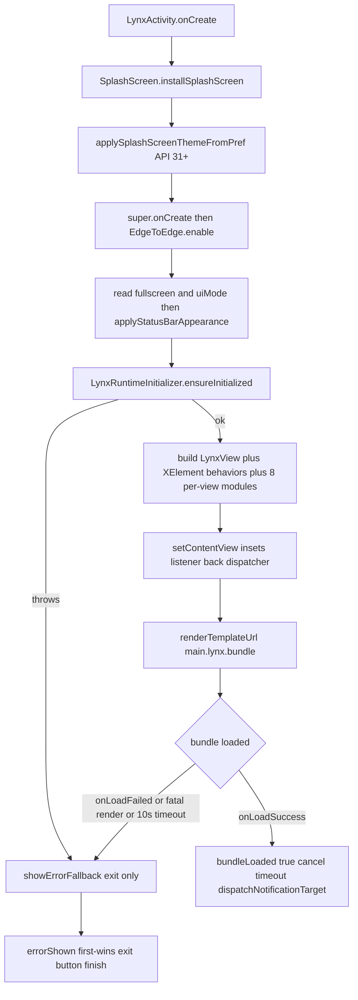
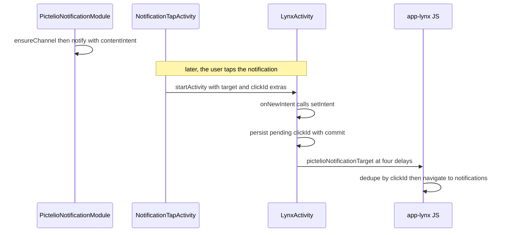
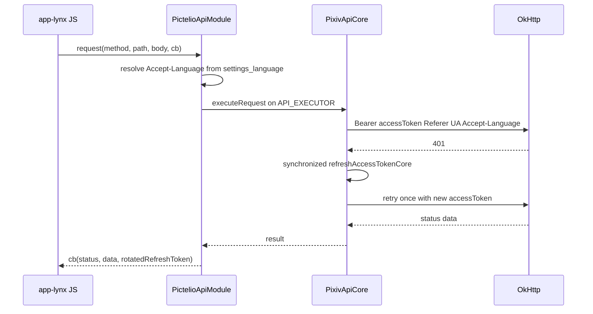
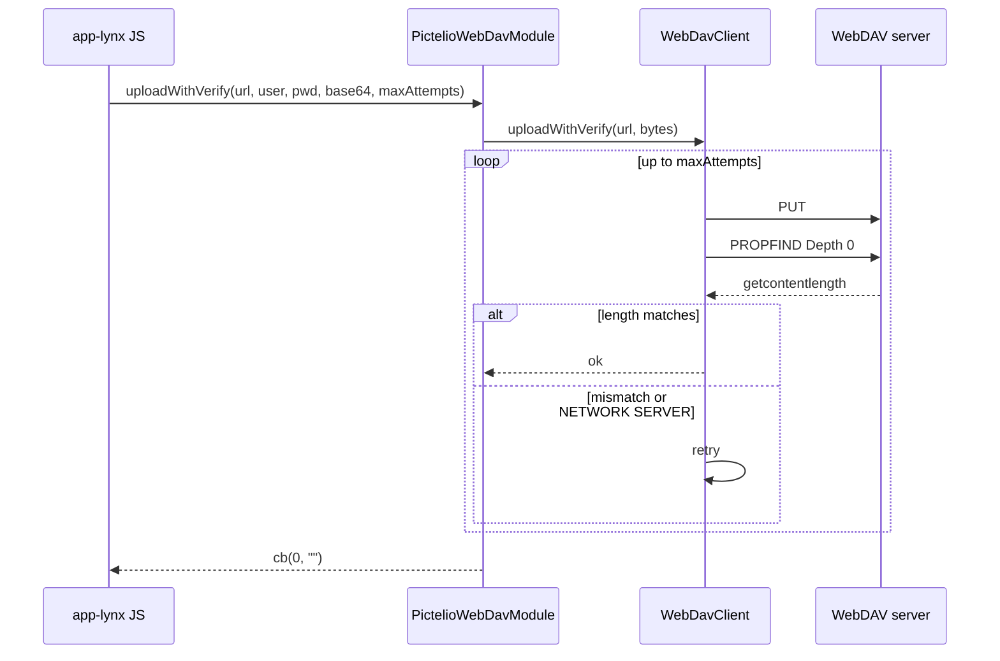

# Android Native Integration & Build

Pictelio ships one rendering engine today: **Lynx**. The native side lives in the `packages/android-host` package (`@pictelio/android-host`), which packages the `@pictelio/app-lynx` bundle into an APK through a **single-variant Gradle project** plus a set of Java `LynxModule` bridges. The former Capacitor plugin layer, the three-flavor Gradle architecture (full/webview/lynx), the `packages/app` WebView client, and the OTA web-bundle channel were all deleted with the WebView client in [ADR-0203](../../docs/adr/ADR-0203-webview-client-source-removal.md). The 22,559 lines of Java production code were moved verbatim from `packages/app/android/` to `packages/android-host/android/`.

## Host-package boundary

`@pictelio/android-host` is explicitly **not a client**. Its `package.json` description says so: it is the Android *build host* (Gradle project, release scripts, native E2E, JVM unit tests), while the actual client is `@pictelio/app-lynx` under `packages/app-lynx` (ADR-0203). Two facts that previously lived in the deleted `packages/app` moved into `packages/app-lynx` as the single source of truth:

| Fact | Source of truth | Consumed by |
|------|-----------------|-------------|
| Pixiv OAuth credentials | `packages/app-lynx/credentials.json5` | `sync-credentials.mjs` → generates `io.pictelio.app.config.OAuthConfig` |
| Product version | `packages/app-lynx/package.json` `version` | `sync-android-version.mjs` → writes `versionName`/`versionCode` into `build.gradle` |

The native host holds no client source: `packages/app-lynx` builds the bundle, and `scripts/sync-android-assets.mjs` (in app-lynx) writes `main.lynx.bundle` into the host's `android/app/src/main/assets/`.

## Single-engine Gradle build

`packages/android-host/android/app/build.gradle` is a single `com.android.application` module with **no product flavors**. The former `lynx` flavor's source directory is promoted into `main` instead of being physically moved, so the class paths and package names are unchanged:

```groovy
sourceSets {
    main { java.srcDir 'src/lynx/java' }
    test { java.srcDir 'src/testLynx/java' }
}
```

Build configuration points:

- `namespace` and `applicationId` are both `io.pictelio.app`.
- `CLIENT_KINDS = {"lynx"}` is injected via `buildConfigField`; the mechanism and consumers are retained even though the value collapsed to a single engine, so a future WebView rebuild can reuse it (ADR-0062 / ADR-0164).
- `manifestPlaceholders = [launcherActivity: ".LynxActivity", appClass: ".PictelioAppLynx"]` resolves the launcher in `AndroidManifest.xml`.
- SDK/toolchain (from `variables.gradle`): `minSdkVersion = 28`, `compileSdkVersion = 36`, `targetSdkVersion = 36`, `buildToolsVersion = "36.1.0"`, Java 21. The old "minimum Android 11 (API 30)" figure is wrong; the host's real minSdk is **28** — see [Platform requirements](#platform-requirements).
- `versionCode 60800` / `versionName "6.8.0"` are the checked-in values, but `pnpm sync:android-version` rewrites them from `app-lynx/package.json` using `major×10000 + minor×100 + patch`.
- Release signing uses `pictelio-release.keystore` with `PICTELIO_KEYSTORE_PASSWORD` / `PICTELIO_KEY_PASSWORD` env vars (key alias `pictelio`), validated only when a release task is in the Gradle task graph.
- An APK rename task produces `pictelio-{versionName}-{buildType}.apk`.
- The OTA Ed25519 public key is compiled in as a `buildConfigField` with a build-time length check (32 raw bytes).
- `minifyEnabled true` for release, with `proguard-rules.pro` (see [ProGuard / R8](#proguard--r8-keep-rules)).

Dependencies: AndroidX `appcompat` + `core-splashscreen:1.2.0`, OkHttp `4.12.0`, and the Lynx SDK `4.0.1` (`lynx`, `lynx-service-http`, `lynx-service-log`, `xelement`, `xelement-input`). Fresco's `lynx-service-image` is deliberately **not** included because it cannot forward the `Referer` header required by `i.pximg.net` (403s); the custom [`PictelioImageService`](#image-pipeline-native-side) replaces it.

## Manifest entries

`packages/android-host/android/app/src/main/AndroidManifest.xml` is small and its entries are load-bearing:

- `<queries>` declares `VIEW https` / `VIEW http` intents, without which `resolveActivity` returns null for system browsers on Android 11+ (`PictelioAppModule.openUrl` would otherwise refuse to open an external link).
- `<application>` sets `android:name="${appClass}"`, `allowBackup="true"`, `dataExtractionRules` / `fullBackupContent` (see [Keystore storage & backup rules](#keystore-storage--backup-rules)), and `enableOnBackInvokedCallback="true"` so Android 16+ predictive back routes through the `OnBackPressedDispatcher` bridge rather than being swallowed.
- The single `<activity>` is the injected launcher (`${launcherActivity}` → `.LynxActivity`) with `launchMode="singleTask"`, `exported="true"`, a `MAIN`/`LAUNCHER` intent filter, a long `configChanges` list (including `uiMode`, so dark-mode flips arrive as `onConfigurationChanged` instead of recreating the Activity), and `@style/AppTheme.NoActionBarLaunch`.
- A `androidx.core.content.FileProvider` provider with authority `${applicationId}.fileprovider` backs the `content://` conversion used by `ShareHelper`.
- `NotificationTapActivity` is declared `exported="false"`, `excludeFromRecents`, `noHistory`, `@android:style/Theme.NoDisplay` — the notification tap trampoline (see [Notification & delivery-probe native channel](#notification--delivery-probe-native-channel)). `exported=false` matters: an externally launchable trampoline would let other apps forge taps and inflate the click counter.
- Permissions: `INTERNET`, `ACCESS_NETWORK_STATE` (normal permission, used by the network self-check), and `POST_NOTIFICATIONS` (Android 13+; declared so a runtime grant *can* succeed — the app itself never requests it).

## Engine availability & failure funnel (ADR-0153 / ADR-0164 residue)

Both ADR-0153 ("WebView unavailable → Lynx") and ADR-0164 ("default engine Lynx + bidirectional fallback") describe the **removed dual-engine world**. They are archived decision history, not current behavior: with the WebView client gone in v6.3.0 (#610), there is no second engine to fall back to.

The surviving residue is the *availability probe* and the *single-engine failure funnel*:

- `LynxRuntimeInitializer.isAvailable(Application)` still implements ADR-0153's three-condition conjunct — `CLIENT_KINDS` contains `lynx` ∧ `ensureInitialized()` does not throw ∧ `LynxEnv.inst().isNativeLibraryLoaded()` — but it now exists only as an engine-capability check, not as a routing input.
- `LynxActivity.onFatal` converges four producers (init throw, bundle load failure, fatal render error, 10s load timeout) into `showErrorFallback`, which renders a single "退出应用" exit-only error page. There is no failure-memory key, no auto-switch, and no "back to WebView" button; a 10s timeout still never auto-switches (slow device ≠ unsupported).


```mermaid
flowchart TD
    A["LynxActivity.onCreate"] --> B["SplashScreen.installSplashScreen"]
    B --> B2["applySplashScreenThemeFromPref API 31+"]
    B2 --> C["super.onCreate then EdgeToEdge.enable"]
    C --> C2["read fullscreen and uiMode then applyStatusBarAppearance"]
    C2 --> D["LynxRuntimeInitializer.ensureInitialized"]
    D -->|throws| E["showErrorFallback exit only"]
    D -->|ok| F["build LynxView plus XElement behaviors plus 8 per-view modules"]
    F --> G["setContentView insets listener back dispatcher"]
    G --> H["renderTemplateUrl main.lynx.bundle"]
    H --> I{"bundle loaded"}
    I -->|onLoadSuccess| J["bundleLoaded true cancel timeout dispatchNotificationTarget"]
    I -->|onLoadFailed or fatal render or 10s timeout| E
    E --> K["errorShown first-wins exit button finish"]
```

*The single-engine boot path: there is no fallback branch, and every fatal failure lands on the exit-only error page.*

## LynxActivity & runtime initialization

`LynxActivity` (`packages/android-host/android/app/src/lynx/java/io/pictelio/app/LynxActivity.java`) is the **sole launcher Activity** — a plain `AppCompatActivity` with no Capacitor bridge. Key responsibilities:

- **Splash:** `SplashScreen.installSplashScreen(this)` runs **before** `super.onCreate` (an AndroidX hard requirement, restated in ADR-0201 and ADR-0213); `setKeepOnScreenCondition(() -> !bundleLoaded.get())` holds the splash until bundle success/failure/timeout. Between `installSplashScreen` and `super.onCreate` the Activity also applies the persisted splash theme from the `settings_dark_mode` preference (see below).
- **Edge-to-edge + insets:** `EdgeToEdge.enable(this)` establishes the base; a `setOnApplyWindowInsetsListener` records `systemBars() ∪ displayCutout()` into `sInsetTop`/`sInsetBottom` (physical px — the logical-px conversion lives on the JS side in `safeArea.ts`), recomputes the visible content area, and pushes the `pictelioInsets` global event only when the values change. `PictelioAppModule.getSafeAreaInsets` is the pull channel because the first insets dispatch fires before JS subscribes.
- **Content-area viewport (ADR-0131 / ADR-0168):** `contentSize` = LynxView bounds − visible system-bar insets; `PictelioAppModule.getViewportSize` returns `(-1, -1)` before layout so JS falls back to `SystemInfo`.
- **Fullscreen (ADR-0168):** `applySystemBarsHidden` uses `WindowInsetsControllerCompat` (`hide/show systemBars()` + `BEHAVIOR_SHOW_TRANSIENT_BARS_BY_SWIPE`) and is re-applied on `onCreate` when `settings_fullscreen_mode == "true"` (only `"true"` is truthy). It also writes back the host's `statusBarHidden` latch through `syncStatusBarHidden`, which re-issues the status-bar appearance on exit-fullscreen — without that write the latch stays `true` and the icon appearance is skipped forever (#689).
- **Dark mode (ADR-0180):** a three-state `settings_dark_mode` (`light`/`dark`/`system`, default `system`, normalized by `normalizeDarkMode` with a warning on illegal values) drives status-bar icon appearance and, on API 31+, the persisted splash theme. The `pictelioDarkMode` event itself reports the **system** `uiMode` (`{"mode":"light"|"dark"}`), emitted on `onConfigurationChanged` and re-checked in `onResume`; `PictelioAppModule.getDarkMode` is the pull-side counterpart.
- **System back (ADR-0066):** an `OnBackPressedCallback` forwards `pictelioBack` to JS when the bundle is ready; otherwise it finishes directly (including on the error page).
- **Render failure:** `onLoadFailed`, `onReceivedNativeError`, `onReceivedError`, and the 10s watchdog all funnel into `showErrorFallback` (first-wins via `errorShown`).
- **Notification landing:** `onLoadSuccess` calls `dispatchNotificationTarget(getIntent())`, deliberately **outside** the `BuildConfig.DEBUG` gate so it also works in release builds (see [Notification & delivery-probe native channel](#notification--delivery-probe-native-channel)).
- **DEBUG-only dev hooks:** `am start` extras for refresh-token auto-login, force-R18, LLM endpoint seeding, and `benchNav` deep links; all gated behind `BuildConfig.DEBUG` so R8 removes them from release.
- **Lifecycle:** forwards `onEnterForeground`/`onEnterBackground`/`destroy()` to the `LynxView`, emits the `pictelioAppForeground` / `pictelioAppBackground` global events in `onResume`/`onPause`, and resets its static viewport/inset/dark-mode sentinels in `onDestroy`. `LynxActivity.current()` (a `WeakReference` maintained in `onCreate`/`onDestroy`) is the `exitApp` target, and `hasLiveActivityInstance()` exposes "a host still exists" for the notification broadcast.

`LynxRuntimeInitializer.ensureInitialized(Application)` is the shared, idempotent init point called by both `PictelioAppLynx.onCreate` (cold start) and `LynxActivity.onCreate` (process-reuse fallback). Its `InitGate` only latches on success, so a failed init stays retryable. In order, it registers three services (`LynxHttpService`, `LynxLogService`, `PictelioImageService`), calls `LynxEnv.inst().init(app, null, null, null)`, globally registers the **12** modules listed in [Native module map](#native-module-map), and finally calls `LynxEnv.inst().enableLynxDebug(BuildConfig.DEBUG)`.

## Native module map

There are **14 `LynxModule` classes** in `src/lynx/java`, plus a custom image *service*, a template *provider*, and a pure-Java streaming *engine*. Twelve are registered globally by `LynxRuntimeInitializer`, in this order: `PictelioSecureStorage`, `PictelioApp`, `PictelioAuth`, `PictelioApi`, `PictelioPrefs`, `PictelioGallery`, `PictelioDownloader`, `PictelioShare`, `NetDiag`, `PictelioWebDav`, `PictelioClipboard`, `PictelioNotification`. The two translation modules are **not** global; `LynxActivity` also registers a per-view set of **8** modules on the `LynxViewBuilder` — `PictelioSecureStorage`, `PictelioApp`, `PictelioAuth`, `PictelioApi`, `PictelioTranslate`, `PictelioTranslateCache`, `PictelioPrefs`, `NetDiag` — of which the first four, `PictelioPrefs` and `NetDiag` duplicate the global registration (harmless; the global `LynxEnv` registration wins) and only `PictelioTranslate` / `PictelioTranslateCache` are per-view-only. Every module follows the ADR-0053 callback contract: `CallbackImpl` crashes on `null` arguments on real devices, so success callbacks use `cb()` / `cb(value)` forms and errors use a single non-null error string.

| Module (`NativeModules.*`) | Bridge for | Deep module / core |
|----------------------------|------------|--------------------|
| `PictelioSecureStorage` | Keystore token storage | `SecureStorageCompat` |
| `PictelioApp` | viewport, exit, safe-area pull, system bars, dark mode, external URL, update-check GET, diag export | `LynxActivity` statics |
| `PictelioAuth` | OAuth refresh-token login, token clear | `PixivApiCore.oauthTokenExchange` |
| `PictelioApi` | Pixiv API forwarding + ugoira extract/stream | `PixivApiCore`, `UgoiraStreamEngine` |
| `PictelioPrefs` | cross-client settings KV | `SharedPreferences("CapacitorStorage")` |
| `PictelioGallery` | save image to album | `GallerySaver`, `PixivImageLoader` |
| `PictelioDownloader` | download/export queue execution | `PictelioDownloader` |
| `PictelioShare` | system share | `ShareHelper` |
| `NetDiag` | network self-check | `NetDiagProbe` |
| `PictelioWebDav` | WebDAV backup transport + crypto | `WebDavClient`, `BackupCrypto` |
| `PictelioClipboard` | clipboard write | Android `ClipboardManager` |
| `PictelioNotification` | notification permission query + aggregated notification post | `NotificationManager`, `NotificationTapActivity` |
| `PictelioTranslate` (per-view) | LLM translation streaming | OkHttp SSE, `TranslationSseParser` |
| `PictelioTranslateCache` (per-view) | native translation cache | filesystem LRU manifest |

Non-`LynxModule` pieces: `PictelioImageService` implements `ILynxImageService` and is registered with `LynxServiceCenter`; `PictelioTemplateProvider` (`AbsTemplateProvider`) serves `assets/main.lynx.bundle`; `UgoiraStreamEngine` is a pure-Java pull-mode state machine with no Lynx dependency. `NotificationTapActivity` is a second, non-launcher Activity that only forwards intents.

## Cross-process contract rules

Four rules govern everything that crosses the JS ↔ Java boundary here, and each one has a concrete failure mode behind it:

1. **Callbacks are one-shot.** A Lynx `Callback` can be invoked at most once per call in practice (and frames pushed through it in a burst are dropped), so anything continuous is **pull-mode or event-bus**. Progress uses `pollProgress(id)` returning `"done/total"` (`"-1/0"` when idle); translation frames are published on the `pictelioTranslateFrame` global event with `translatePoll(streamId, cb)` retained as a fallback; ugoira streaming uses the `ugoiraExtractStreamPoll` trio.
2. **No `null` callback arguments.** `com.lynx.react.bridge.CallbackImpl` throws on a `null` argument (real-device finding, ADR-0053). Success paths call `cb()` or `cb(value)`; failures call a single non-null error string; "absent" values are encoded as `""` (e.g. `PictelioPrefsModule.prefsGet` returns `""` for a missing key) rather than `null`.
3. **Key material stays out of the JS heap.** The Pixiv `access_token` lives only in `PixivApiCore` static fields — `PictelioAuthModule.loginWithRefreshToken` never returns it, and `clearTokens` nulls both heap fields. The stored LLM API key is likewise never returned: `PictelioTranslateModule.getEndpoint` reports `hasKey` and only Java reads the secret. The deliberate exception is the `refresh_token`, which *is* handed to JS (`loginWithRefreshToken` returns it in `userInfoJson`) so JS can persist it through `PictelioSecureStorage`, whose `getItem` therefore also returns a decrypted value.
4. **Preference strings arrive JSON-quoted.** The Lynx bridge JSON-quotes string callback arguments, so a value stored as `{"sent":1}` reaches JS as `"{\"sent\":1}"` (and `&quot;` in the on-device XML layer is a separate escape). JS must run its `unquoteNativeString` helper before `JSON.parse` — otherwise parse failures silently turn a non-zero counter into zero.

## Notification & delivery-probe native channel

The delivery probe's *product* semantics (aggregated reminder, counters, verdict honesty) live on the [Notifications & Delivery Probe](../domain/notifications-and-delivery-probe.md) page; what the host owns is a two-method bridge, one trampoline Activity, a permission declaration, and three JS-visible channels.

- **`PictelioNotificationModule`** (registered globally as `PictelioNotification`) exposes exactly two `@LynxMethod`s and does only what JS cannot:
  - `areNotificationsEnabled(cb)` → `cb(granted, err)`, backed by the real `NotificationManager.areNotificationsEnabled()`. A failure resolves as "not granted" (the degrade path) with a warning; it never throws at JS.
  - `postSummary(unreadCount, locale, cb)` → `cb(posted, err)`. It creates/updates the notification channel `pictelio_delivery_probe` (`createNotificationChannel`, not merely constructing the object — Android 8+ silently drops notifications for a channel that was never registered), then posts with a **fixed notification id** so consecutive rounds overwrite instead of stacking.
  - Wording is assembled **host-side** from `summaryText` / `channelName` / `channelDescription`, keyed off the locale string JS passes in (`"en"` → English, everything else → Chinese). The body states only the count, never the notification text.
  - The module **never requests** `POST_NOTIFICATIONS` and **never writes counters** — counting is a JS single-writer concern over `PictelioPrefs` (ADR-0220 decisions 3 / 13). `minSdk 28` means `areNotificationsEnabled()` needs no version branch.
  - The package-visible static seams (`notificationsEnabledNow`, `summaryText`, `ensureChannel`, `postTo`, `clickIntent`) exist so JVM/Robolectric tests can drive them without a `LynxContext`.
- **Tap landing.** The notification's `contentIntent` is `PendingIntent.getActivity(...)` pointed at `NotificationTapActivity` with the per-delivery `clickId` extra. `NotificationTapActivity` is a `NoDisplay`, `exported=false` trampoline: it is the one place that both runs at tap time inside the app process and is exempt from the Android 10+ background-Activity-launch restriction (a receiver-based design gets blocked; the system-initiated Activity is not). It copies the target (`notifications`) and `clickId` onto a `LynxActivity` intent with `FLAG_ACTIVITY_NEW_TASK | FLAG_ACTIVITY_SINGLE_TOP`, then finishes.
- **`LynxActivity` dispatch.** `dispatchNotificationTarget` validates the target (unknown targets are logged and skipped, never silently navigated), writes the pending `clickId` to `PictelioPrefsModule.PREFS_FILE` under `delivery_probe_pending_click` with `commit()` (synchronous — the process may be reclaimed), then broadcasts `pictelioNotificationTarget` with the `clickId` payload at four fixed delays (1.5 / 3 / 4.5 / 6 s). Both "smart" count criteria were falsified on device, so the count is fixed and duplicate arrivals are absorbed by JS-side dedupe on the `clickId`. Warm-start taps arrive through `onNewIntent`, which must call `setIntent(intent)` — without it `getIntent()` keeps returning the launch intent and the click extras are dropped silently.
- **Lifecycle events.** `onResume` sends `pictelioAppForeground` and `onPause` sends `pictelioAppBackground` (plain `sendGlobalEvent`, no debounce — re-entering the foreground is supposed to restart the quiet-period clock). These are the only foreground/background channel the JS side has, because `LynxView.onEnterForeground()` does not become a JS event and Lynx has no window-focus event.
- **Contract gate.** `packages/app-lynx/src/stores/deliveryProbeContract.test.ts` reads the host Java/XML sources and asserts both sides contain each event name, extra key, method name and the channel-registration call, so a rename on one side turns the gate red.


```mermaid
sequenceDiagram
    participant NotifyMod as PictelioNotificationModule
    participant Tap as NotificationTapActivity
    participant Host as LynxActivity
    participant JS as app-lynx JS
    NotifyMod->>NotifyMod: ensureChannel then notify with contentIntent
    Note over Tap,Host: later, the user taps the notification
    Tap->>Host: startActivity with target and clickId extras
    Host->>Host: onNewIntent calls setIntent
    Host->>Host: persist pending clickId with commit
    Host->>JS: pictelioNotificationTarget at four delays
    JS->>JS: dedupe by clickId then navigate to notifications
```

*The tap path: the trampoline Activity exists so the tap can launch the app under Android 10+ background-launch limits, and the four broadcasts exist because bundle rendering can be slower than one broadcast.*

## API & auth: access_token Java-heap isolation

`PictelioApiModule` and `PictelioAuthModule` implement the ADR-0053 / ADR-0037 security model: the Pixiv `access_token` is held only in `PixivApiCore` static Java-heap fields and is **never returned to JS**.

- `PictelioAuthModule.loginWithRefreshToken(refreshToken, cb)` runs the OAuth refresh-token exchange on its own executor, writes `access_token` into `PixivApiCore.accessToken` (and a rotated `refresh_token` into `PixivApiCore.refreshToken`), then calls back with `userInfoJson` containing `userId`/`userName`/`userAccount`/`profileImageUrls`/`refreshToken` — never the access token. `setAccessToken` is the one-way JS→Java push for web-mode OAuth, and `clearTokens` nulls both heap fields on logout.
- `PictelioApiModule.request(method, path, body, cb)` constructs the absolute `https://app-api.pixiv.net` URL, reads `settings_language` on the worker thread to resolve an `Accept-Language` header (ADR-0200: `en` → `en`, everything else → `zh-CN`), and delegates to `PixivApiCore.executeRequest`. The callback is `cb(status, data, rotatedRefreshToken)` where `rotatedRefreshToken` is non-empty only if a 401 refresh rotated the token.
- `PixivApiCore.executeRequest` injects `Authorization: Bearer`, `Referer`, `User-Agent`, and (optionally) `Accept-Language`; on a first 401 it performs a `synchronized` refresh (with an `isRefreshing` guard and reference-identity token comparison to avoid redundant refreshes under concurrency) and retries once.


```mermaid
sequenceDiagram
    participant JS as app-lynx JS
    participant API as PictelioApiModule
    participant Core as PixivApiCore
    participant Http as OkHttp
    JS->>API: request(method, path, body, cb)
    API->>API: resolve Accept-Language from settings_language
    API->>Core: executeRequest on API_EXECUTOR
    Core->>Http: Bearer accessToken Referer UA Accept-Language
    Http-->>Core: 401
    Core->>Core: synchronized refreshAccessTokenCore
    Core->>Http: retry once with new accessToken
    Http-->>Core: status data
    Core-->>API: result
    API-->>JS: cb(status, data, rotatedRefreshToken)
```

*The native API forward: the access token is injected inside Java and never appears in the JS callback.*

`PictelioApiModule` also exposes the ugoira paths: `ugoiraExtract` (download zip → single-pass extract → write frames to `cache/ugoira/<illustId>/frame_N.{png|jpg}` with an LRU-style cap of 300 files / 50 MB, cache-hit short-circuit), and the ADR-0128 streaming trio `ugoiraExtractStream` / `ugoiraExtractStreamPoll` / `ugoiraExtractStreamCancel` built on `UgoiraStreamEngine`.

## Keystore storage & backup rules

`SecureStorageCompat` (`src/main`) is a pure-Java AES/GCM utility that is byte-compatible with `@aparajita/capacitor-secure-storage` 8.x (ADR-0050). It is the backend for `PictelioSecureStorageModule` (`getItem` / `setItem` / `removeItem`) and for the translate API-key key.

- **Algorithm:** AES/GCM/NoPadding, AndroidKeyStore, one AES key per storage key (`PURPOSE_ENCRYPT|DECRYPT`, `BLOCK_MODE_GCM`, `ENCRYPTION_PADDING_NONE`).
- **SharedPreferences file:** `WSSecureStorageSharedPreferences` (MODE_PRIVATE).
- **Storage key:** `capacitor-storage_` + key (e.g. `capacitor-storage_refresh_token`).
- **Ciphertext format:** `Base64(ciphertext) + "\u0010" + Base64(iv)` (NO_PADDING + NO_WRAP).
- `encryptString` / `decryptString` are static and key-injected so Robolectric tests run without AndroidKeyStore.

Because `android:allowBackup="true"`, backup is defended per ADR-0003: `res/xml/data_extraction_rules.xml` (Android 12+) and `res/xml/backup_rules.xml` (Android 11-) exclude `WSSecureStorageSharedPreferences.xml` and the historical plaintext residue `PictelioPrefs.xml` from both cloud backup and device transfer. The literal strings `capacitor-storage_` and `CapacitorStorage` must remain (ADR-0203 decision 8): renaming them would orphan every existing user's token and settings.

## WebDAV backup (ADR-0156)

Backup transport is a three-layer design: a single Java core plus a thin Lynx bridge plus a TS shared pure-function layer (the latter lives in app-lynx).

- **`WebDavClient`** (pure Java, no Android deps) implements the minimal WebDAV subset — MKCOL (409 treated as success), PUT, GET, PROPFIND Depth 0&1, DELETE — over OkHttp with HTTP Basic auth. PROPFIND multistatus parsing is lenient regex (href / `resourcetype:collection` / `getcontentlength`). Errors are classified into `Kind` (`AUTH_FAILED`/`FORBIDDEN`/`NOT_FOUND`/`QUOTA_EXCEEDED`/`CONFLICT`/`NETWORK`/`SERVER`). `uploadWithVerify` performs PUT → PROPFIND `getcontentlength` comparison (falling back to a GET byte compare when the server omits the field) with up to 3 retries; `prune` keeps the last 10 timestamp-named backups by filename order.
- **`BackupCrypto`** implements the v1 envelope: `PICTELIO-ENC1` magic (13 B) + salt (16 B) + iv (12 B) + AES-256-GCM ciphertext, with the key derived by PBKDF2-HMAC-SHA256 at 600k iterations from the user password. Passwords never enter the backup file.
- **`PictelioWebDavModule`** is the thin bridge: `ensureDir` / `upload` / `uploadWithVerify` / `download` / `list` / `stat` / `delete` / `prune` / `encrypt` / `decrypt` / `isEncrypted`. Bytes cross the bridge as base64, blocking IO runs on a module executor, and every callback is `cb(code, payload)` (code 0 success / code 1 failure with a JSON error object).


```mermaid
sequenceDiagram
    participant JS as app-lynx JS
    participant WV as PictelioWebDavModule
    participant Client as WebDavClient
    participant Server as WebDAV server
    JS->>WV: uploadWithVerify(url, user, pwd, base64, maxAttempts)
    WV->>Client: uploadWithVerify(url, bytes)
    loop up to maxAttempts
        Client->>Server: PUT
        Client->>Server: PROPFIND Depth 0
        Server-->>Client: getcontentlength
        alt length matches
            Client-->>WV: ok
        else mismatch or NETWORK SERVER
            Client->>Client: retry
        end
    end
    WV-->>JS: cb(0, "")
```

*The write-then-read-back verification loop inside WebDavClient.uploadWithVerify.*

## Download, save & export bridge

The data-management cluster (ADR-0145 / ADR-0146 / ADR-0154) keeps bytes in the Java heap (ADR-0037) while JS holds only metadata and progress.

- **`PictelioDownloaderModule`** (`start` / `pollProgress` / `cancel` / `deleteFile`) is a thin shell over the shared `PictelioDownloader` deep module. Progress is **pull-mode** (`pollProgress` returns `"done/total"`, or `"-1/0"` when idle) because a Lynx `Callback` is one-shot.
- **`PictelioDownloader`** executes one task at a time: `download` (image), `downloadUgoira` (zip → `UgoiraExporter`), and `downloadNovel` (payload → `NovelExporter`). It acquires bytes through `PixivImageLoader.loadFileWithProgress` (cache-first + image-host resolve + Referer/UA), lands them through `GallerySaver`, and supports per-`taskId` cancellation via an `AtomicBoolean` map.
- **`GallerySaver`** routes disk writes: API ≥ 29 → `MediaStore` (`Pictures/Pictelio`, `IS_PENDING` two-phase, no permission); API 28 (minSdk) → app-specific external dir + `MediaScannerConnection`. Non-image products (ugoira exports) go to `Downloads/Pictelio`. Filenames are generated in JS (`Pictelio_<illustId>[_p<N>].<ext>`), and Java only does defensive `sanitizeFileName` plus an optional author subdirectory (ADR-0192).
- **`NovelExporter`** implements 9 formats — `txt/html/md/rtf/json/fb2` string serialization, `epub`/`docx` via `ZipOutputStream`, and `pdf` via `android.graphics.pdf.PdfDocument` + `StaticLayout` (system CJK fonts, zero font payload). Cover/inline images are fetched through the injected `PixivImageLoader`; a single image failure is skipped with a warning while metadata/body contract failures throw.
- **`UgoiraExporter`** exports `zip`/`tar`/`apng` and delegates `gif`/`webp`/`mp4` to dedicated encoders (`GifEncoder`/`WebpEncoder`/`Mp4Encoder`).
- **`PictelioShareModule`** + **`ShareHelper`** build `ACTION_SEND` / `ACTION_SEND_MULTIPLE` intents, converting `file://` (API 28 fallback) to `content://` through `FileProvider`.
- **`PictelioClipboardModule`** writes to the system clipboard because the Lynx JS runtime has no `navigator`/clipboard API.

See [ADR-0145](../../docs/adr/ADR-0145-image-save-download.md), [ADR-0146](../../docs/adr/ADR-0146-download-queue-export.md), and [ADR-0154](../../docs/adr/ADR-0154-novel-export.md) for the spec-level behavior; the queue state machine and file naming stay in app-lynx.

## Translation module surface

`PictelioTranslateModule` and `PictelioTranslateCacheModule` are the two per-view modules. The translation *pipeline* (prompt assembly, paragraph alignment, provider fallback) is documented on [Novel Reader](../domain/novel-reader.md); the native surface is:

- Seven `@LynxMethod`s: `setApiKey(apiKey, cb)` (writes the key through `SecureStorageCompat` under `translate_llm_api_key`, never returned), `getEndpoint(cb)` (a redacted mirror: baseURL / model / targetLang / sourceLang defaults plus `hasKey`), `clearEndpoint(cb)`, `translateStream(requestJson, cb)`, `translatePoll(streamId, cb)`, `probeEndpoint(baseURL, apiKey, model, cb)`, `abortStream(streamId, cb)`.
- **Delivery is event-bus first.** Parsed frames are stamped with `streamId`/`seq` and pushed via `sendGlobalEvent("pictelioTranslateFrame", ...)`; because the callback channel was measured to deliver at most one frame per stream, `translatePoll` is kept as a pull fallback that reads the same already-stamped buffers. The publish path snapshots frames **without draining** them, so frames survive a window where no JS listener exists; `translatePoll`'s terminal handshake cleans up.
- `abortStream` registers the `streamId` in a `USER_ABORTED` set before cancelling the OkHttp call, because `Call.isCanceled()` cannot distinguish a user abort from a client-side timeout — conflating them (the historical bug) left the JS promise unsettled and the UI stuck at "N% translating" with no error.
- `probeEndpoint` POSTs a minimal scalar-string body and classifies the response (`ok` for 2xx / 401 / 403 / `invalid_api_key` 400s, `incompatible` for 404, `partial` for 405, `unknown` otherwise), using the shared `PixivApiCore` client with a streaming-specific variant that drops `callTimeout` but keeps a bounded read timeout.
- `PictelioTranslateCacheModule` is a filesystem LRU cache (default 10 MB / 200 entries) under `cacheDir/pictelio_translate_cache` with a `manifest.json` index, `sha256(key)` filenames, atomic temp+rename writes serialized on a single-thread executor, and a one-shot orphan cleanup at construction.

## Image pipeline native side

See [Image Pipeline](../architecture/image-pipeline.md) for the end-to-end pipeline. The host's contribution is: `PixivImageLoader` (the single source of truth for Pixiv image downloads, `/pixiv-img/` rewriting, `Referer`/`User-Agent` injection, and the `pictelio-images/` disk cache), `ImageHostConfig` (the download-source decision module, ADR-0143), and `PictelioImageService` (the only Lynx image backend — it registers `<image>`/`<inline-image>` behaviors in its constructor, decodes to `Bitmap`, serves static images only, and hands the cached `Bitmap` instance over zero-copy with an `isRecycled()` guard).

## ProGuard / R8 keep rules

`proguard-rules.pro` carries release-only rules that are load-bearing for Lynx:

- `com.lynx.base.LynxBaseTrace` and `com.lynx.base.log.LynxLog` — `lynxbase.so` looks up their static methods by JNI `GetStaticMethodID` name; renaming causes a SIGABRT on real devices.
- `io.pictelio.app.PictelioImageService` — defensive keep (registered by interface, so renaming would be safe).
- `**$$PropsSetter` / `**$$PropsHolder` with `<init>()` and members — Lynx reflects these annotation-generated classes by name; stripping the no-arg constructors produces the `990200` white screen.
- `* extends androidx.room.RoomDatabase { <init>(); }` and `androidx.work.impl.WorkDatabase_Impl { <init>(); }` — ADR-0124, `work-runtime`'s `InitializationProvider` reflectively constructs `WorkDatabase_Impl`.
- The Capacitor-era `@com.getcapacitor.annotation.CapacitorPlugin` keep rule is still present; it is inert now (no annotated classes remain) and is left in place for a WebView rebuild.
- `-dontwarn` for Fresco/Gson/Markdown classes that are statically referenced but unreachable (Fresco and Markdown are deliberately absent).

## Build scripts, version & credentials sync

The host package owns the Android build chain (see [Release & Deploy](../operations/release-and-deploy.md) for the full procedure, not duplicated here):

- `pnpm build:android` / `pnpm build:android:release` — `sync:android-version` + `sync:credentials` + build app-lynx + `sync-android-assets.mjs` + Gradle `assembleDebug`/`assembleRelease renameReleaseApk`.
- `pnpm test:android:unit` — `sync:credentials` then `./gradlew testDebugUnitTest`; the credentials sync must precede Gradle because Gradle compilation depends on the gitignored generated `OAuthConfig.java` (ADR-0203 decision 8's "clean checkout can grow itself" invariant).
- `pnpm dev:android` (`dev-android.mjs`) and `pnpm release` (`release.mjs`) round out the chain.
- `sync-credentials.mjs` reads `../app-lynx/credentials.json5` and generates `io.pictelio.app.config.OAuthConfig` (OAuth credentials, request-header disguises, endpoint URLs, timeouts, `MIN_WEBVIEW_VERSION`, `CACHE_DIR`/`CACHE_MAX_BYTES`).
- `sync-android-version.mjs` reads `../app-lynx/package.json` and rewrites `versionCode`/`versionName`.

## Platform requirements

Two platform-level constraints sit under everything above:

- **`SplashScreen.installSplashScreen(this)` must run before `super.onCreate(savedInstanceState)`.** This is an AndroidX requirement (the library installs an exit-animation listener and a theme bridge that the framework's `onCreate` path depends on); the host also uses the gap between the two calls to apply the persisted splash theme on API 31+. The requirement is restated in ADR-0201 and ADR-0213 and is asserted by `LynxSplashScreenApiGuardTest` / the splash theme resource tests.
- **`minSdkVersion = 28` (Android 9), `targetSdkVersion = 36`, Java 21.** The minimum is enforced at install time by `PackageManagerService`; `targetSdk 36` is what makes Android 15+ force edge-to-edge. The host's real minimum is API 28 — the historical "Android 11 / API 30" and "Chrome 85 WebView" figures belong to the deleted WebView world. The platform matrix lives in [`docs/platform-compatibility.md`](../../docs/platform-compatibility.md), which is now an archived document retained for decision history.

## Focused tests

JVM/Robolectric tests live in `android/app/src/test/` (main modules) and `src/testLynx/` (Lynx modules, merged into `test`). The suites that pin the behaviors on this page:

- Host lifecycle & system UI: `LynxSystemBarsTest`, `LynxDarkModeTest`, `LynxStatusBarAppearanceTest`, `LynxStatusBarLatchTest`, `LynxSplashScreenApiGuardTest`, `LynxSplashThemeResourcesTest` / `…NightTest`, `LynxRuntimeInitializerTest`.
- Native channel: `PictelioNotificationModuleTest` (drives the static seams and asserts against the *system* notification and channel tables — wording, locale fallback, overwrite-not-stack, permission reflecting the system switch, non-null `contentIntent` carrying the click id) and `NotificationTapActivityTest` (the forwarded target and click id).
- Secrets & prefs: `SecureStorageCompatTest`, `PictelioPrefsModuleTest`, `PictelioClipboardModuleTest` (the no-`null` callback convention).
- Translation: `TranslateEventContractTest` (the event-name cross-end contract), `TranslationSseParserTest`, `PictelioTranslateProbeTest`, `PictelioTranslateBuildInputTest`, and the `testLynx` suite `PictelioTranslateModuleSuccessTest` / `…TerminalTest` / `…CancelTest` / `…EmptyStreamTest` / `PictelioTranslateAbortStreamTest` / `PictelioTranslateCacheModuleTest`.
- Deep modules: `PixivImageLoaderTest` (+ `…ProgressTest`), `ImageHostConfigTest`, `PictelioImageServiceTest`, `WebDavClientTest`, `BackupCryptoTest`, `PictelioWebDavModuleTest`, `PictelioApiModuleTest`, `PictelioAcceptLanguageTest`, `PictelioDownloaderTest`, `GallerySaverTest` / `GallerySaverMediaStoreTest`, `NovelExporterTest` + per-encoder tests, `UgoiraExporter*Test`, `NetDiagProbeTest`, `ShareHelperTest`.

The manual Android e2e gate for the notification landing is `packages/android-host/tests/android-e2e/specs/delivery-probe-cold-start.spec.ts` (logs in, rewinds the read memory, waits out the quiet period, `am kill`s the process, taps the notification, and asserts from native log lines that the landing was dispatched, broadcast four times and counted once). Host-level TS invariants — including `tests/unit/webviewRemovalInvariants.test.ts`, the repository-wide "is the WebView client really gone" gate — live under `packages/android-host/tests/unit/`.

## Key source files

All paths are under `packages/android-host/android/app/src/`.

| Layer | Files |
|-------|-------|
| Entry points | `lynx/java/io/pictelio/app/LynxActivity.java`, `PictelioAppLynx.java`, `LynxRuntimeInitializer.java`, `NotificationTapActivity.java` |
| Lynx modules | `lynx/java/io/pictelio/app/Pictelio{Api,App,Auth,Clipboard,Downloader,Gallery,Notification,Prefs,SecureStorage,Share,Translate,TranslateCache,WebDav}Module.java`, `NetDiagModule.java` |
| Lynx services/engines | `PictelioImageService.java`, `PictelioTemplateProvider.java`, `UgoiraStreamEngine.java` |
| Shared deep modules | `main/java/io/pictelio/app/{PixivApiCore,PixivImageLoader,ImageHostConfig,SecureStorageCompat,WebDavClient,BackupCrypto,GallerySaver,PictelioDownloader,NovelExporter,UgoiraExporter,ShareHelper,NetDiagProbe,TranslationSseParser,ImageMemoryCache,LruCache}.java` |
| Build/config | `../../packages/android-host/android/app/build.gradle`, `../../packages/android-host/android/variables.gradle`, `../../packages/android-host/android/app/proguard-rules.pro`, `src/main/AndroidManifest.xml`, `src/main/res/xml/{data_extraction_rules,backup_rules}.xml` |
