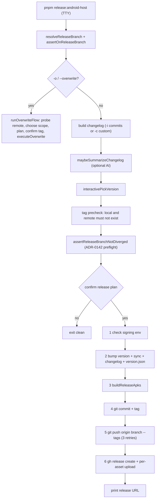

# Release, Deploy & Runbook

This page is the operator entrypoint for building, signing, releasing, and deploying Pictelio. It consolidates the procedures that otherwise live only in `docs/`, the release scripts, and `package.json`. For the Gradle project shape, native modules, and engine internals, see [Android Native & Build](../integrations/android-native.md); for the monorepo layout and tooling split, see [Architecture Overview](../architecture/overview.md).

## Prerequisites

| Dependency | Required version / fact | Source |
|------------|------------------------|--------|
| Node.js | `>=22.22.2` (repo pins `24.18.0` in `.node-version`) | `package.json` `devEngines`, `.node-version` |
| pnpm | `11.9.0` (npm is rejected via `engine-strict` + `.npmrc`) | `package.json`, `.npmrc` |
| JDK / keytool | Java 21 toolchain for Gradle; `keytool` for keystore generation | `android/app/build.gradle` `compileOptions` |
| Android SDK | `compileSdkVersion 36`, `buildToolsVersion "36.1.0"`, `minSdkVersion 28` | `variables.gradle`, `build.gradle` |
| GitHub CLI (`gh`) | authenticated (`gh auth login`) for release create/edit and token/keyring | `release.mjs`, `upload-release-assets.mjs` |
| git | `origin` remote must be a GitHub repo (slug is parsed from it) | `release-utils.mjs` `getRepoSlug` |

Install with `pnpm install`, then run `pnpm build` / `pnpm check` / `pnpm test` once to verify the toolchain before any release.

### Proxy environment variables

The release uploader decides its network path from the standard proxy variables using Go `httpproxy` semantics (`NO_PROXY` supports `*`, IPv4, CIDR, IPv6, and domain-with-subdomain matching):

- `HTTPS_PROXY` / `ALL_PROXY` route `uploads.github.com` through the proxy; `NO_PROXY` / `no_proxy` force direct.
- `NO_PROXY` domain entries match the domain **and all subdomains** — writing `github.com` also bypasses the proxy for `uploads.github.com`, so the documented direct-fallback value is exactly `NO_PROXY=api.github.com,uploads.github.com` (not `github.com`).
- The **default Node native uploader always bypasses the proxy** (Node `https` does not read proxy env vars). Set `PICTELIO_UPLOADER=gh` to route through the proxy via `gh`.

Source: `packages/android-host/scripts/lib/proxy-probe.mjs` and `docs/release-checklist.md` (§上传网络说明).

## Authoritative command map

Root `package.json` fans bare commands out to the single client (`pictelio-app-lynx`); the Android host is only reachable through explicit `:android-host` commands (ADR-0204).

| Task | Command | Notes |
|------|---------|-------|
| Client dev | `pnpm dev` / `pnpm dev:app-lynx` | rspeedy dev for the Lynx client |
| Website dev | `pnpm dev:website` | Astro landing page |
| Android host dev | `pnpm dev:android-host` | `dev-android.mjs` |
| Client build | `pnpm build` / `pnpm build:app-lynx` | rspeedy production bundle |
| Website build | `pnpm build:website` | Astro build |
| Debug APK | `pnpm build:android-host` | sync + bundle + `gradlew assembleDebug` |
| Signed release APK | `pnpm build:android-host:release` | sync + bundle + `gradlew assembleRelease renameReleaseApk` |
| Type checks | `pnpm check:android-host` | `tsc --noEmit` over host scripts |
| Host unit tests | `pnpm test:android-host:unit` | sync credentials + `gradlew testDebugUnitTest` |
| Android E2E | `pnpm test:android-host:e2e` | vitest over `tests/android-e2e` |
| Interactive release | `pnpm release:android-host` | `@pictelio/android-host release` → `scripts/release.mjs` |
| Non-main release | `PICTELIO_RELEASE_BRANCH=<branch> pnpm release:android-host` | tag must point at that branch's commit |
| Website preview deploy | `pnpm deploy` / `pnpm deploy:dry` | `scripts/deploy.mjs` |
| Sync bundle to host | `pnpm sync:app-lynx-bundle` | `sync-android-assets.mjs` |

Inside the host package, `pnpm release` is `node scripts/release.mjs`, `pnpm build:android:release` is the raw release-build script, and `pnpm sync:android-version` / `pnpm sync:credentials` are the sync entrypoints.

## Building an APK

Release builds are one command, and the single-engine build produces **one** APK (build type `release`, no flavor dimension):

```bash
pnpm build:android-host:release
```

The build chain (defined in `packages/android-host/package.json` and step-ordered in `scripts/lib/release-build-steps.mjs`) is:

1. `sync:android-version` — write `versionName` / `versionCode` into `build.gradle`.
2. `sync:credentials` — generate `io.pictelio.app.config.OAuthConfig` from `credentials.json5`.
3. Build the Lynx bundle with `NODE_ENV=production` (hard fallback so dev credentials never leak into a release bundle).
4. `sync-android-assets.mjs` — copy `main.lynx.bundle` into `android/app/src/main/assets/`.
5. `./gradlew assembleRelease renameReleaseApk`.

The signed artifact lands at:

```text
packages/android-host/android/app/build/outputs/apk/release/pictelio-{version}-release.apk
```

A missing `main.lynx.bundle` inside the APK is the historical white-screen failure mode; verify `android/app/src/main/assets/main.lynx.bundle` exists after a build. See [Android Native & Build](../integrations/android-native.md) for Gradle source sets, R8 rules, and module wiring (not duplicated here).

## Release signing

Release signing is configured in `packages/android-host/android/app/build.gradle` and injects secrets **only via environment variables** — never hardcoded:

```groovy
signingConfigs {
    release {
        storeFile file("pictelio-release.keystore")
        storePassword System.getenv("PICTELIO_KEYSTORE_PASSWORD")
        keyAlias "pictelio"
        keyPassword System.getenv("PICTELIO_KEY_PASSWORD")
    }
}
```

Before any signed build or release:

1. Generate the keystore at `packages/android-host/android/app/pictelio-release.keystore` (alias `pictelio`). Full `keytool` instructions live in [`docs/release-signing.md`](../../docs/release-signing.md).
2. Export `PICTELIO_KEYSTORE_PASSWORD` and `PICTELIO_KEY_PASSWORD` in the releasing shell. In CI, inject them from secrets.
3. Never commit the keystore — `packages/android-host/android/app/*.keystore` (and `android/.gitignore`'s `*.keystore`) ignore it.

`build.gradle`'s `validateReleaseSigning()` runs only when a release task (`assembleRelease`, `packageRelease`, `bundleRelease`, `signReleaseApk`, `signReleaseBundle`) is in the Gradle task graph, so debug builds never require these variables. Release step 1 of the interactive flow performs the same check up front and aborts with a pointer to `docs/release-signing.md`.

## Interactive release flow

`pnpm release:android-host` runs `scripts/release.mjs`, an interactive, TTY-only one-command release. It has three modes:

- `-i` (default): pick commits since the last tag, generate a changelog, pick a version.
- `-c`: paste a custom changelog, pick a version.
- `-o` / `--overwrite`: repair an **already-published** Release's notes/assets without bumping the version (see below).

Retired flags `--web-only` / `--min-web` (OTA web-bundle channel, ADR-0202) **fail loudly** instead of silently running a full release. Optional AI changelog summarization (`-i` and `-c`) reads `PICTELIO_AI_BASE_URL` / `PICTELIO_AI_API_KEY` / `PICTELIO_AI_MODEL` / `PICTELIO_AI_PROTOCOL` from `packages/app-lynx/.env` (not the host package).



*The normal release flow: preflight and confirmation happen before any version bump so a divergence/failed confirm leaves zero half-finished artifacts (ADR-0142).*

### The six steps and their failure recovery

| Step | What it does | Failure handling |
|------|--------------|------------------|
| 1 | Check keystore file + both password env vars | Throws before any write; fix env and rerun |
| 2 | Bump `app-lynx/package.json`, run `sync-android-version`, write fastlane changelog + `packages/website/version.json` | Auto-rollback tracked files and delete the changelog |
| 3 | Build the release APK via `releaseBuildSteps` | Gradle transient/cache failures retry once with `--stacktrace`; code errors fail immediately |
| 4 | `git add` only the release files, reject unrelated workspace changes, `git commit`, `git tag -a` | Detects whether commit/tag already exist and gives reset/retag or checkout guidance |
| 5 | `git push origin <branch> --tags` with 3 backoff retries | Reports which of main/tag may have partially pushed |
| 6 | `gh release create` then per-asset upload | Prints manual `gh release create` / `gh release upload --clobber` recovery commands |

The release files committed in step 4 are exactly `packages/app-lynx/package.json`, `packages/android-host/android/app/build.gradle`, and `packages/website/version.json`; the fastlane changelog is intentionally not tracked.

### Branch safety and preflight

- Release must run **on the target branch**. The target is `main` unless `PICTELIO_RELEASE_BRANCH` is set; setting it switches branch check, divergence preflight, and push target together (a half-open switch would push a tag to a commit that is not on the remote branch).
- Step 0 rejects an already-existing local or remote `tag`.
- The ADR-0142 preflight (`assertReleaseBranchNotDiverged`) fetches `origin/<branch>` and fails fast **before** the confirmation prompt if the remote has commits the local branch lacks (the usual cause is OpenWiki CI merging docs PRs). The fix is `git fetch origin && git rebase origin/<branch>`; a fetch failure only warns and lets the pre-push hook be the last line of defense.

## Overwrite release (`-o`)

`pnpm release:android-host -o` (alias `--overwrite`, plus `--dry-run` to preview) repairs a **published, non-draft** GitHub Release without bumping the version, moving the tag, or creating a commit. Use it for missing assets or wording fixes — not for code fixes, because the `versionCode` stays the same and already-installed users cannot install the corrected APK over the same version.

Flow:

1. Probe the remote (tag existence + release draft/asset state) and local APK presence.
2. Choose scope: `1` notes only / `2` assets only / `3` both (default).
3. Reuse local APKs or rebuild (rebuild is forced when a variant is missing).
4. Prepare/confirm notes, then show the plan with warnings and require a second tag-name confirmation.
5. Back up replaced assets → `gh release edit` notes → per-asset upload; failed assets are restored from backup (new assets have no backup and can be re-run to fill in).

The target release must exist, be non-draft, and its tag must equal `v{package.json version}`; any mismatch is rejected. See [`docs/release-checklist.md`](../../docs/release-checklist.md) §覆盖发布 for the full interaction.

## Per-asset upload orchestration

Both step 6 and the overwrite flow share the same upload engine (ADR-0065 / ADR-0067):

- Each APK is uploaded independently with concurrency = number of assets (one in the single-engine world), max 3 attempts per asset with 1s/2s/4s backoff, and failure isolation (`scripts/lib/release-uploader.mjs`).
- A TTY panel shows one row per asset (size / elapsed / retries / average rate); non-TTY degrades to one event line per asset (`scripts/lib/release-panel.mjs`).
- The **default uploader is the Node native uploader** (`scripts/lib/upload-release-assets.mjs`): it calls the GitHub REST API directly, bypasses the proxy, caches `upload_url` per tag, streams the file (O(1) memory), and takes its token from `gh auth token` (never logged). `PICTELIO_UPLOADER=gh` restores the `gh` subprocess path.
- Clobber semantics match `gh --clobber`: a 422 "name already exists" triggers list → DELETE the same name → re-upload once. Network/5xx are retryable; other 4xx are permanent and fail immediately.
- Before uploading, `probeProxyRouting("uploads.github.com")` prints whether the run will go direct or through a proxy, with uploader-specific advice.

## Version and credential sync

Two sync scripts keep the host buildable from facts owned by the client package (ADR-0203 decision 3):

| Script | Reads | Writes | Rule |
|--------|-------|--------|------|
| `sync-android-version.mjs` | `packages/app-lynx/package.json` `version` | `build.gradle` `versionCode` / `versionName` | `versionCode = major×10000 + minor×100 + patch` (`minor`/`patch` must be `< 100`) |
| `sync-credentials.mjs` | `packages/app-lynx/credentials.json5` | generated `OAuthConfig.java` | OAuth creds, request-header disguises, endpoints, timeouts, `MIN_WEBVIEW_VERSION`, cache config |

`sync:credentials` must run before Gradle compiles because the generated `OAuthConfig.java` is gitignored (a clean checkout must be able to grow itself). Release step 2 also regenerates `packages/website/version.json` (`version`, `url`, truncated `changelog`) via `release-version-json.mjs`.

## Website deploy

The landing page is `pictelio-website` (`packages/website/`). Two distinct operations:

1. **Local preview deploy** — `pnpm deploy` runs `scripts/deploy.mjs`, which copies `packages/website/dist/` into `_site/` for preview. `pnpm deploy:dry` passes `--dry-run`. This script is local verification only.
2. **GitHub Pages publish** — the actual site is served from the `origin/gh-pages` branch at `https://a1121611810.github.io/pixivizer`. Push the built site to `gh-pages` and, once, enable GitHub Pages in the repo settings with `gh-pages` + `/ (root)` (see `docs/release-checklist.md` §官网部署).

## Platform compatibility (operator summary)

- **Minimum Android OS**: API 28 (Android 9.0), enforced by `minSdkVersion = 28` in `packages/android-host/android/variables.gradle`; the system rejects installs below that at package-manager level.
- **Single engine**: the WebView client and dual-engine fallback were removed in v6.3.0 (#610 / ADR-0203). There is no engine to fall back to — the archived `docs/platform-compatibility.md` matrix is decision history, not current behavior. Current single-engine behavior is documented in [Android Native & Build](../integrations/android-native.md).

## Focused tests

Release-script invariants are unit-tested under `packages/android-host/tests/unit/scripts/`:

- `release-build-steps.test.ts` — asserts every pnpm script and Gradle task referenced by the build steps exists, and the APK path matches `build.gradle`'s rename rule.
- `release-branch.test.ts` / `release-preflight.test.ts` — branch-switch parsing/validation/warnings and real-git divergence topologies (ADR-0142 / #816).
- `release-uploader.test.ts`, `upload-release-assets.test.ts`, `proxy-probe.test.ts` — upload orchestration, Node uploader clobber/error classification/token+uploadUrl caching, and direct-vs-proxy routing.
- `release-overwrite` / `release-panel` have unit coverage for the pure `planOverwrite` / event-format seams.

Run them with `pnpm test:android-host` (vitest over the host package).
