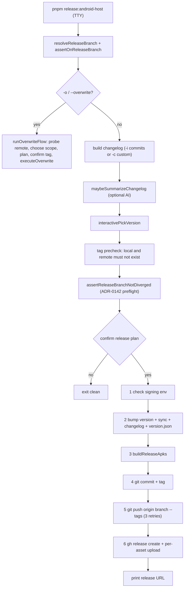

# Release, Deploy & Runbook

This page is the operator entrypoint for building, signing, releasing, and deploying Pictelio. It consolidates the procedures that otherwise live only in `docs/`, the release scripts, and `package.json`. For the Gradle project shape, native modules, and engine internals, see [Android Native & Build](../integrations/android-native.md); for the monorepo layout and tooling split, see [Architecture Overview](../architecture/overview.md); for test tiers and the full gate inventory, see [Testing Strategy](../testing/overview.md).

## Prerequisites

| Dependency | Required version / fact | Source |
|------------|------------------------|--------|
| Node.js | `>=22.22.2` (repo pins `24.18.0` in `.node-version`) | `package.json` `devEngines`, `.node-version` |
| pnpm | `11.9.0` (npm is rejected via `engine-strict` + `.npmrc`) | `package.json`, `.npmrc` |
| JDK / keytool | Java 21 toolchain for Gradle (`sourceCompatibility`); `keytool` for keystore generation | `android/app/build.gradle` `compileOptions` |
| Android SDK | `minSdkVersion 28`, `compileSdkVersion 36`, `buildToolsVersion "36.1.0"` | `variables.gradle`, `build.gradle` |
| GitHub CLI (`gh`) | authenticated (`gh auth login`) for release create/edit and for the token/keyring the default uploader reads | `release.mjs`, `upload-release-assets.mjs` |
| git | `origin` remote must be a GitHub repo (the slug is parsed from it) | `release-utils.mjs` `getRepoSlug` |

Install with `pnpm install`, then run `pnpm build` / `pnpm check` / `pnpm test` once to verify the toolchain before any release.

### Proxy and credential contract

Pixiv and API traffic on the developer machine is expected to reach the **local HTTP proxy**; the tooling resolves it in this order and falls back to `http://127.0.0.1:7897`:

- **Dev/preview (rspeedy):** `lynx.config.ts` reads `https_proxy` → `HTTPS_PROXY` → `http_proxy` → `HTTP_PROXY` → `http://127.0.0.1:7897` and routes the `/pixiv-img`, `/pixiv-api`, and `/pixiv-oauth` dev-server proxies through that agent (the dev server binds `127.0.0.1` only, so an OAuth-bearing dev bundle never leaves the host).
- **Emulator E2E:** `ANDROID_E2E_HTTP_PROXY` (for example `10.0.2.2:7897`) sets the emulator's global HTTP proxy to the host proxy via `settings put global http_proxy`, and teardown clears it; the Chromedriver download also needs a reachable proxy because the downloader ignores proxy env vars.
- **Release upload:** proxy routing is judged with Go `httpproxy` semantics by `probeProxyRouting("uploads.github.com")`.
- **Credentials never enter CI:** the refresh token and AI keys live in the gitignored `packages/app-lynx/.env`, and the keystore/key passwords live in the releasing shell's environment — none of them are wired into CI. `.github/workflows/ci.yml` injects no Pixiv, OAuth, or signing secret.

Source: `packages/app-lynx/lynx.config.ts`, `packages/android-host/scripts/lib/proxy-probe.mjs`, `packages/android-host/scripts/lib/upload-release-assets.mjs`, and `docs/release-checklist.md` (§上传网络说明).

## Authoritative command map

Root `package.json` fans bare commands out to the single client (`pictelio-app-lynx`); the Android host is only reachable through explicit `:android-host` commands (ADR-0204).

| Task | Command | Notes |
|------|---------|-------|
| Client dev | `pnpm dev` / `pnpm dev:app-lynx` | rspeedy dev for the Lynx client |
| Website dev | `pnpm dev:website` | Astro landing page |
| Android host dev | `pnpm dev:android-host` | build + install a debug APK (`dev-android.mjs`) |
| Client build | `pnpm build` / `pnpm build:app-lynx` | rspeedy production bundle |
| Website build | `pnpm build:website` | Astro build |
| Debug APK | `pnpm build:android-host` | sync + bundle + `gradlew assembleDebug` |
| Signed release APK | `pnpm build:android-host:release` | sync + bundle + `gradlew assembleRelease renameReleaseApk` |
| Type checks | `pnpm check:android-host` | `tsc --noEmit` over host scripts |
| Host unit tests | `pnpm test:android-host:unit` | sync credentials + `gradlew testDebugUnitTest` |
| Android E2E | `pnpm test:android-host:e2e` | vitest over `tests/android-e2e` (manual, not in CI) |
| Interactive release | `pnpm release:android-host` | `@pictelio/android-host release` → `scripts/release.mjs` |
| Non-main release | `PICTELIO_RELEASE_BRANCH=<branch> pnpm release:android-host` | tag must point at that branch's commit; `pnpm release:android-host:transition` freezes the branch to `release/transition-6.2.0` |
| Website preview deploy | `pnpm deploy` / `pnpm deploy:dry` | `scripts/deploy.mjs` (local preview only; see [Website deploy](#website-deploy)) |
| Sync bundle to host | `pnpm sync:app-lynx-bundle` | `sync-android-assets.mjs` |

Inside the host package, `pnpm release` is `node scripts/release.mjs`, `pnpm build:android:release` is the raw release-build script, and `pnpm sync:android-version` / `pnpm sync:credentials` are the sync entrypoints.

## Building an APK

There is **one** publishable APK: the single-engine build has one build type (`release`), no flavor dimension, and nothing to fall back to.

```bash
pnpm build:android-host:release
```

The build chain (declared in `packages/android-host/package.json`, step-ordered in `scripts/lib/release-build-steps.mjs`) is:

1. `sync:android-version` and `sync:credentials` — write `versionName`/`versionCode` into `build.gradle` and generate `io.pictelio.app.config.OAuthConfig` from `credentials.json5`. (In the interactive release, `sync:android-version` runs in step 2 as part of the version bump.)
2. Build the Lynx bundle with `NODE_ENV=production` (hard fallback so dev credentials never leak into a release bundle — `__CREDENTIALS__` degrades to placeholders whenever the build is not an explicit `PICTELIO_LYNX_DEV=1` dev build).
3. `sync-android-assets.mjs` — copy `dist/main.lynx.bundle` into `android/app/src/main/assets/` and mirror `dist/static/**` (hash-named icon fonts) with a byte-size check; static mirroring clears the destination first so stale hashed files do not accumulate.
4. `./gradlew assembleRelease renameReleaseApk`.

The signed artifact lands at:

```text
packages/android-host/android/app/build/outputs/apk/release/pictelio-{version}-release.apk
```

The rename task is driven by `build.gradle`'s `buildTypeList2` (`debug`, `release`) and always rewrites the newest artifact (`outputs.upToDateWhen { false }`), so a stale `pictelio-*.apk` cannot be published. A missing `main.lynx.bundle` inside the APK is the historical white-screen failure mode (LynxActivity cannot load it); verify `android/app/src/main/assets/main.lynx.bundle` exists after a build. See [Android Native & Build](../integrations/android-native.md) for Gradle source sets, R8 rules, and module wiring (not duplicated here).

### Debug install path

`pnpm dev:android-host` (`scripts/dev-android.mjs`) is the fast loop: sync version + credentials → build the Lynx bundle with `NODE_ENV=production` → sync assets → `./gradlew assembleDebug` → `adb install -r android/app/build/outputs/apk/debug/app-debug.apk`, then suggests launching with `adb shell monkey -p io.pictelio.app 1`. There is **no dev-server or hot-reload variant**: the APK loads `main.lynx.bundle` from assets, so "dev" here only means the debug build type. Debug builds never need the release keystore or signing passwords.

## Release signing

Release signing is configured in `packages/android-host/android/app/build.gradle` and injects secrets **only via environment variables** — never hardcoded:

```groovy
signingConfigs {
    release {
        storeFile file("pictelio-release.keystore")
        storePassword System.getenv("PICTELIO_KEYSTORE_PASSWORD")
        keyAlias "pictelio"
        keyPassword System.getenv("PICTELIO_KEY_PASSWORD")
    }
}
```

Before any signed build or release:

1. Generate the keystore at `packages/android-host/android/app/pictelio-release.keystore` (alias `pictelio`). Full `keytool` instructions live in [`docs/release-signing.md`](../../docs/release-signing.md).
2. Export `PICTELIO_KEYSTORE_PASSWORD` and `PICTELIO_KEY_PASSWORD` in the releasing shell. On CI they would come from secrets, but the current workflows never build a signed APK.
3. **Never commit the keystore.** Both [`packages/android-host/android/.gitignore`](../../packages/android-host/android/.gitignore) (`*.keystore`, `*.jks`, `app/release/`) and the root `.gitignore` (`packages/android-host/android/app/*.keystore|*.jks`, `.../app/release/`) ignore it; do not `git add -f`.

`build.gradle`'s `validateReleaseSigning()` runs only when a release task (`assembleRelease`, `packageRelease`, `bundleRelease`, `signReleaseApk`, `signReleaseBundle`) is in the Gradle task graph, so debug builds never require these variables. Interactive release step 1 performs the same check up front and aborts with a pointer to `docs/release-signing.md`.

> `docs/release-signing.md` still describes the WebView/Capacitor era: `pnpm run build:android:release`, `app-release.apk`, and a bare `cd android` path. The current command, APK name, and paths are the ones on this page; treat that document as keytool/procedure reference only.

## Interactive release flow

`pnpm release:android-host` runs `scripts/release.mjs`, an interactive, TTY-only one-command release (a non-TTY invocation exits immediately with "需要 TTY"). It has three modes:

- `-i` (default): pick commits since the last tag, generate a changelog, pick a version.
- `-c`: paste a custom changelog, pick a version.
- `-o` / `--overwrite`: repair an **already-published** Release's notes/assets without bumping the version (see below).

Retired flags `--web-only` / `--min-web` (OTA web-bundle channel, ADR-0202) **fail loudly** with `exit 1` before the TTY guard, instead of silently turning into a full release. Optional AI changelog summarization (`-i` and `-c`; not `-o`) reads `PICTELIO_AI_BASE_URL` / `PICTELIO_AI_API_KEY` / `PICTELIO_AI_MODEL` / `PICTELIO_AI_PROTOCOL` from **`packages/app-lynx/.env`** (not the host package); any missing key means "not configured" → the step is skipped with a warn. The protocol is explicit (`chat` → `/chat/completions`, `responses` → `/responses`), the default per-call timeout is 240 s, and only transient failures (network, 429, 5xx, non-JSON, empty output) retry once — 4xx and timeouts fail immediately. This step runs **before** step 1, so a release with a stale signing environment pays one model call before failing on the keystore check.



*The normal release flow: preflight and confirmation happen before any version bump so a divergence or a declined prompt leaves zero half-finished artifacts (ADR-0142).*

### The six steps and their failure recovery

| Step | What it does | Failure handling |
|------|--------------|------------------|
| 1 | Check keystore file + both password env vars | Throws before any write; fix env and rerun |
| 2 | Bump `app-lynx/package.json`, run `sync-android-version`, write the fastlane changelog and `packages/website/version.json` | Auto-rollback tracked files and delete the changelog |
| 3 | Build the release APK via `releaseBuildSteps` | Gradle retries once with `--stacktrace` for cache/dependency-looking failures; compile/R8/missing-class errors fail immediately |
| 4 | `git add` only the release files, reject unrelated workspace changes, `git commit`, `git tag -a` | Checks whether commit/tag already exist and prints reset/retag or checkout guidance |
| 5 | `git push origin <branch> --tags` with 3 backoff retries | Reports which of branch/tag may have partially pushed and how to check |
| 6 | `gh release create` (no assets) then per-asset upload | Prints manual `gh release create` / `gh release upload --clobber` recovery commands for the failed assets only |

The release files committed in step 4 are exactly `packages/app-lynx/package.json`, `packages/android-host/android/app/build.gradle`, and `packages/website/version.json`; the fastlane changelog is intentionally untracked and gitignored. Step 4 rejects **any** other workspace change, untracked files included.

### Branch safety and preflight

- Release must run **on the target branch**. The target is `main` unless `PICTELIO_RELEASE_BRANCH` is set; setting it switches branch check, divergence preflight, and push target together (a half-open switch would push a tag to a commit that is not on the remote branch). Non-`main` releases warn at branch check and again on the confirmation screen.
- Step 0 rejects an already-existing local or remote `tag`.
- The ADR-0142 preflight (`assertReleaseBranchNotDiverged`) fetches `origin/<branch>` and fails fast **before** the confirmation prompt if the remote has commits the local branch lacks (the usual cause is OpenWiki CI merging docs PRs). The fix is `git fetch origin && git rebase origin/<branch>`; a fetch failure only warns and lets the pre-push hook be the last line of defense.

## Overwrite release (`-o`)

`pnpm release:android-host -o` (alias `--overwrite`, plus `--dry-run` to preview commands) repairs a **published, non-draft** GitHub Release without bumping the version, moving the tag, or creating a commit. Use it for missing assets or wording fixes — not for code fixes, because the `versionCode` stays the same and already-installed users cannot install the corrected APK over the same version.

Flow:

1. Probe the remote (tag existence + release draft/asset state) and local APK presence.
2. Choose scope: `1` notes only / `2` assets only / `3` both (default).
3. Reuse local APKs or rebuild (rebuild is forced when a variant is missing, and the remote is re-validated before an expensive rebuild).
4. Prepare/confirm notes, then show the plan with warnings and require a second tag-name confirmation.
5. Back up replaced assets → `gh release edit` notes → per-asset upload; failed assets are restored from backup (new assets have no backup and can be re-run to fill in). The backup directory is kept when upload fails so a human can finish the job.

The target release must exist, be non-draft, and its tag must equal `v{package.json version}`; any mismatch is rejected. On success the script also resyncs the `changelog` field of `packages/website/version.json` (a local write failure only warns). See [`docs/release-checklist.md`](../../docs/release-checklist.md) §覆盖发布 for the full interaction.

## Per-asset upload orchestration

Both step 6 and the overwrite flow share the same upload engine (ADR-0065 / ADR-0067):

- Each asset is uploaded independently with concurrency = number of assets, max 3 attempts per asset with 1s/2s/4s backoff, and failure isolation; duplicate basenames are rejected before anything is uploaded (`scripts/lib/release-uploader.mjs`).
- A TTY panel shows one row per asset (size / elapsed / retries / average rate); non-TTY degrades to one event line per asset (`scripts/lib/release-panel.mjs`).
- The **default uploader is the Node native uploader** (`scripts/lib/upload-release-assets.mjs`): it calls the GitHub REST API directly, always bypasses the proxy (Node `https` ignores proxy env vars), caches `upload_url` per tag, streams the file (O(1) memory), and takes its token from `gh auth token` (never logged). `PICTELIO_UPLOADER=gh` restores the `gh` subprocess path.
- Clobber semantics match `gh --clobber`: a 422 "name already exists" triggers list → DELETE the same name → re-upload once. Network/5xx are retryable; other 4xx are permanent and fail immediately.
- Before uploading, `probeProxyRouting("uploads.github.com")` prints whether the run goes direct or through a proxy, with uploader-specific advice.

### Upload routing and `NO_PROXY` semantics

`probeProxyRouting` mirrors Go's `httpproxy` (the same logic `gh` uses) for `https` targets: `HTTPS_PROXY`/`https_proxy` first, then `ALL_PROXY`/`all_proxy`, with `NO_PROXY`/`no_proxy` forcing a direct connection (plain `HTTP_PROXY` does not apply to https uploads). Two consequences matter operationally:

- `NO_PROXY` domain entries match the domain **and all subdomains** — writing `github.com` also bypasses the proxy for `uploads.github.com`. The documented direct-fallback value is exactly `NO_PROXY=api.github.com,uploads.github.com`.
- Because the Node uploader ignores proxy configuration entirely, `HTTPS_PROXY` only matters in `PICTELIO_UPLOADER=gh` mode.

## Version and credential sync

Two sync scripts keep the host buildable from facts owned by the client package (ADR-0203 decision 3):

| Script | Reads | Writes | Rule |
|--------|-------|--------|------|
| `sync-android-version.mjs` | `packages/app-lynx/package.json` `version` | `build.gradle` `versionCode` / `versionName` | `versionCode = major×10000 + minor×100 + patch` (`minor`/`patch` must be `< 100`) |
| `sync-credentials.mjs` | `packages/app-lynx/credentials.json5` | generated `OAuthConfig.java` | OAuth creds, request-header disguises, endpoints, timeouts, `MIN_WEBVIEW_VERSION`, cache config |

`sync:credentials` must run before Gradle compiles because the generated `OAuthConfig.java` is gitignored (a clean checkout must be able to grow itself) — CI does exactly that before `testDebugUnitTest`. Release step 2 also regenerates `packages/website/version.json` (`version`, `url`, truncated `changelog`) via `release-version-json.mjs`.

## Website deploy

The landing page is `pictelio-website` (`packages/website/`; Astro, `site`/`base` = `https://a1121611810.github.io/Pictelio`). Two distinct operations:

1. **Local preview** — `pnpm deploy` runs `scripts/deploy.mjs`, which copies `packages/website/dist/` into `_site/` at the repo root for preview. `pnpm deploy:dry` passes `--dry-run`, but the script does not parse arguments, so the flag is currently ignored and the copy happens anyway. `_site/` is not gitignored, and release step 4 rejects workspace changes outside the release file list — clean it up before running an interactive release.
2. **GitHub Pages publish** — `.github/workflows/deploy.yml` deploys on pushes to `main` that touch `packages/website/**` or the workflow itself (plus manual `workflow_dispatch`): it builds Astro (`pnpm --filter pictelio-website build`), copies `packages/website/version.json` into `dist/`, uploads the artifact with `actions/upload-pages-artifact`, and publishes with `actions/deploy-pages`. No `gh-pages` branch push is involved; `docs/release-checklist.md` §官网部署 still documents the older gh-pages + manual Pages-enable flow and is stale.

## Pre-release verification gates

The test tiers and the full gate inventory live in [Testing Strategy](../testing/overview.md); this section records only what the release operator must run or check.

- **Transition matrix (`@release-gate`)**: [`transition-matrix.spec.ts`](../../packages/android-host/tests/android-e2e/specs/transition-matrix.spec.ts) is the only spec marked `@release-gate`. It is the ADR-0163 pre-release manual gate (3 rows after single-engine consolidation) and runs through the manual emulator E2E suite, never in per-PR CI. Because the suite skips as a whole when the device gate does not match, verify after a run that the gate actually executed (the suite-level skipped count and `--reporter=verbose` suite names are the two legal verdicts; details and the enumerated legal skip sources are in [`docs/release-checklist.md`](../../docs/release-checklist.md) and [Testing Strategy](../testing/overview.md)).
- **Staged release**: GitHub Releases is the only distribution channel, so the pre-release marker *is* the staged rollout. Publish the tag as a pre-release, collect real-device feedback for ≥3 days, then promote it (`gh release edit <tag> --prerelease=false`). The release script itself does not pass `--prerelease`.
- **Build-flag-gated verification** — two flags are inlined at build time and therefore **cannot** be changed on an installed APK:
  - `BENCH_NAV=1` enables the `__BENCH_NAV__` deep-link hooks used by device verification and E2E. It must be injected for the **whole** build chain (`BENCH_NAV=1 pnpm build:android-host`); injecting only `build:app-lynx` is overwritten by the chain's own bundle build. Without it the hook block is tree-shaken; the shipping chain does not inject it, and the native forwarding is additionally gated on `BuildConfig.DEBUG`, so the chain is dead in a release APK.
  - `PICTELIO_HOME_BLEED` selects the homepage top-bar variant (default **on**; exactly `=0` rolls back to the old 64dp bar). The polarity's single source of truth is `packages/app-lynx/homeBleedHeaderFlag.ts`. Check `env | grep PICTELIO_HOME_BLEED` before releasing: a leftover `=0` silently ships the old top bar, and a successful build does not prove the polarity flipped. Because it is a macro, rolling it back requires a rebuild and a new release; see [Viewport Geometry & Motion](../concepts/viewport-geometry-and-motion.md) and [`docs/release-checklist.md`](../../docs/release-checklist.md) §六之二 for the verification procedure.
- **Release builds contain no debug channels**: the `pictelio_dev_*` intent extras (auto-login token, force-R18, LLM endpoint seeding) and the benchNav native forwarding are wrapped in `BuildConfig.DEBUG` and removed by R8 in release, and Lynx debug mode is `enableLynxDebug(BuildConfig.DEBUG)` — false in release.
- **Unenforced / unresolved gates (do not record as passed)**: the dual-engine transition checklist (`docs/agents/qa-transition-checklist.md`, R1–R4) and the engine-degradation evidence matrix are unexecutable after single-engine consolidation, and the night-mode walkthrough acceptance record (`docs/research/lynx-night-mode-walkthrough-acceptance.md`) does not exist yet, so that gate is still closed. [`docs/release-checklist.md`](../../docs/release-checklist.md) §发版前 QA 防线 states these must be treated as unenforced until redefined (tracked in #805) — including the formerly meaningful "debug backdoor key must not be in the APK" check, which is now always zero and therefore useless.
- **Other verification channels**: device-side tools drive a real APK outside the Appium harness (`tests/android-e2e/tools/verify-translation.sh` builds with `BENCH_NAV=1`, refuses to test a stale APK, and asserts the request really fired), `packages/app-lynx/scripts/verify-top-inset.mjs` measures top-inset magnitude against the platform inset (with its verdict logic in `topInsetVerdict.mjs`), and `.github/workflows/sysbars-acceptance.yml` is a manual `workflow_dispatch` assertion gate that runs the system-bar acceptance matrix on an API 35/36 emulator on a GitHub runner. See [Testing Strategy](../testing/overview.md) for the inventory.
- **Stale verification scripts (do not use for a release)**: `packages/app-lynx/scripts/lynx-device-check.sh` and `lynx-flow-check.sh` still launch `io.pictelio.app/.MainActivity` and seed the removed `pictelio_client_kind` preference, and `tests/android-e2e/tools/verify-abort.sh` still pins flavor-era artifacts (`assembleLynxDebug`, `apk/lynx/debug/app-lynx-debug.apk`). The launcher is `LynxActivity` and the only variant is the `debug`/`release` build type, so these scripts cannot run against the single-engine build as written.

## Platform compatibility (operator summary)

- **Minimum Android OS**: API 28 (Android 9.0), enforced by `minSdkVersion = 28` in `packages/android-host/android/variables.gradle`; the system rejects installs below that at package-manager level. `compileSdk`/`targetSdk` are 36.
- **Single engine**: the WebView client and dual-engine fallback were removed in v6.3.0 (#610 / ADR-0203). There is no engine to fall back to — the archived `docs/platform-compatibility.md` matrix is decision history, not current behavior. Current single-engine behavior is documented in [Android Native & Build](../integrations/android-native.md).

## Focused tests

Release-script invariants are unit-tested under `packages/android-host/tests/unit/scripts/` and run with `pnpm test:android-host` (which also feeds `pnpm test:all` in CI):

- `release-build-steps.test.ts` — asserts every pnpm script and Gradle task referenced by the build steps exists, and the APK path matches `build.gradle`'s rename rule (the guard against post-consolidation leftovers such as the removed `cap:sync` step).
- `release-branch.test.ts` / `release-preflight.test.ts` — branch-switch parsing/validation/warnings and real-git divergence topologies (ADR-0142 / #816).
- `release-retired-flags.test.ts` — runs `release.mjs` as a subprocess to prove `--web-only` / `--min-web` are rejected before the TTY guard (with a control case proving the rejection is not a generic early exit).
- `release-uploader.test.ts`, `upload-release-assets.test.ts`, `proxy-probe.test.ts` — upload orchestration, Node uploader clobber/error classification/token and `upload_url` caching, and direct-vs-proxy routing.
- `release-overwrite.test.ts`, `release-version-json.test.ts`, `release-notes-ai.test.ts`, `changelog.test.ts`, `release-utils.test.ts`, `git-refs.test.ts`, `release-panel.test.ts`, `check-push-refs.test.ts` — the pure `planOverwrite` / `executeOverwrite` seams, version.json shape, AI summarization protocol and retry matrix, changelog truncation, ref helpers, upload-panel formatting, and the pre-push ref check.
