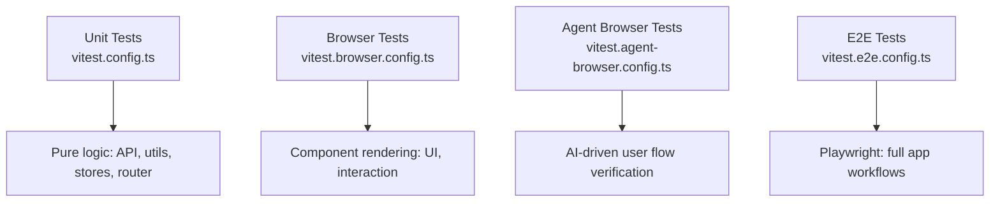

# Testing Strategy

Pictelio uses a four-tier testing architecture, each with its own configuration and purpose. Tests live under `/packages/app/tests/`. The canonical conventions are documented in `/packages/app/tests/TESTING.md`.



## Test Tiers

### 1. Unit Tests (`tests/unit/`)

- **Runner:** Vitest (`vitest.config.ts`)
- **Scope:** Pure logic — API layer, utilities, stores, router definitions, services, primitives
- **No DOM required** — tests run in Node.js
- **Key pattern:** `createManualFetch` (`/packages/app/src/primitives/createManualFetch.ts`) — a test-oriented primitive that allows injecting mock responses into the API client, simulating any Pixiv API response without actual network calls
- Runs via: `pnpm test`

### 2. Browser Tests (`tests/browser/`)

- **Runner:** Vitest browser mode (`vitest.browser.config.ts`)
- **Scope:** Component rendering with `@solidjs/testing-library` — VirtualFeed, IllustDetail, NovelDetail, Login, NavBar, SeriesSheet, ThemeSelector, etc.
- **Provides a real browser environment** (Playwright-based) for DOM interaction
- Can test reactive behavior, user interaction, and component lifecycle
- Runs via: `pnpm test:browser`

### 3. Agent Browser Tests (`tests/agent-browser/`)

- **Runner:** Custom Vitest config (`vitest.agent-browser.config.ts`)
- **Scope:** AI-driven user flow verification — uses a custom agent driver to simulate complex user interactions
- Has its own `TESTING.md` for conventions
- **Custom infrastructure:** Agent driver, fixtures, setup scripts, and spec files
- Designed for testing multi-step flows that are tedious to script manually

### 4. End-to-End Tests (`tests/e2e/`)

- **Runner:** Playwright (`vitest.e2e.config.ts`)
- **Scope:** Full app workflows — login, feed browsing, novel reading, settings changes
- **Infrastructure:**
  - Global setup (`global-setup.ts`) — loads Pixiv auth token from environment
  - Global teardown (`global-teardown.ts`)
  - Fixtures and helpers for common test patterns
  - Spec files organized by feature
- Runs via: `pnpm test:e2e`

## File Naming Conventions

Per `TESTING.md`:

| Pattern | Test Tier | Purpose |
|---------|-----------|---------|
| `*.test.ts`  | Unit | Pure logic tests (no DOM) |
| `*.browser.test.ts` | Browser | Component rendering tests |
| `*.agent-browser.test.ts` | Agent browser | AI-driven flow tests |
| `*.e2e.test.ts` | E2E | Playwright end-to-end tests |

## Test Infrastructure

### `createManualFetch`

Located at `/packages/app/src/primitives/createManualFetch.ts`. This primitive is critical for all API-level testability:

- Wraps the Pixiv API client to intercept requests
- Returns mock responses defined inline in the test
- Supports simulating error states (401, 400, network failure)
- Works in both unit and browser test environments

### Memory Store

`/packages/app/src/stores/db.ts` exports `createMemoryStore` — a TanStack DB collection backed by in-memory storage instead of IndexedDB. This allows testing browsing history, bookmarks, and other persisted stores without side effects:

```typescript
// Unit test setup for historyStore
import { createMemoryStore } from "../stores/db";
jest.mock("../stores/db", () => ({
  ...jest.requireActual("../stores/db"),
  getCollection: () => createMemoryStore({ key: "test-history" }),
}));
```

### AI-Shared Test Utilities (`tests/ai-shared/`)

Shared infrastructure between agent-browser and other AI-driven test types:
- Assertion helpers for common patterns
- Global setup/teardown for auth token loading
- Driver abstraction for the agent browser

## Running Tests

| Command | Tests |
|---------|-------|
| `pnpm test` | Unit tests (Vitest) |
| `pnpm test:watch` | Unit tests in watch mode |
| `pnpm test:browser` | Browser component tests |
| `pnpm test:e2e` | Playwright E2E tests |
| `pnpm test:e2e:ui` | Playwright with UI mode |
| `pnpm test:all` | Unit + browser tests combined |
| `pnpm test:browser --run` | Single-run browser tests (no watch) |

## Key Source Files

| Purpose | Path |
|---------|------|
| Testing conventions doc | `/packages/app/tests/TESTING.md` |
| Unit test config | `/packages/app/vitest.config.ts` |
| Browser test config | `/packages/app/vitest.browser.config.ts` |
| Agent browser config | `/packages/app/vitest.agent-browser.config.ts` |
| E2E test config | `/packages/app/vitest.e2e.config.ts` |
| Test helpers | `/packages/app/tests/helpers.ts` |
| Manual fetch primitive | `/packages/app/src/primitives/createManualFetch.ts` |
| Memory store | `/packages/app/src/stores/db.ts` |
| Unit tests | `/packages/app/tests/unit/` |
| Browser tests | `/packages/app/tests/browser/` |
| Agent browser tests | `/packages/app/tests/agent-browser/` |
| E2E tests | `/packages/app/tests/e2e/` |
| AI shared utilities | `/packages/app/tests/ai-shared/` |
