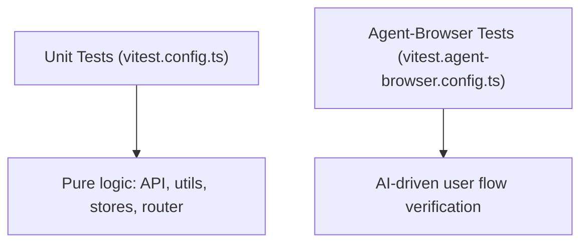

# Testing Strategy

Pictelio uses two active testing tiers. Previously there were component-level browser tests (Vitest browser mode) and Playwright E2E — both have been fully migrated to agent-browser per [ADR-0034](/docs/adr/ADR-0034-migrate-playwright-e2e-to-agent-browser.md) and [ADR-0035](/docs/adr/ADR-0035-migrate-component-tests-to-e2e-and-unit.md). Tests live under `/packages/app/tests/`. The canonical conventions are documented in `/packages/app/tests/TESTING.md`.

The `app-lynx` package has its own separate test suite at [`/packages/app-lynx/tests/unit.test.ts`](/packages/app-lynx/tests/unit.test.ts) — 19 unit test cases covering image URL rewriting, error classification, OAuth error recognition, novel body extraction, and route matching (Vitest, run via `pnpm --filter pictelio-app-lynx test`). It also includes real-device verification scripts under [`/packages/app-lynx/scripts/`](/packages/app-lynx/scripts/): [`lynx-device-check.sh`](/packages/app-lynx/scripts/lynx-device-check.sh) (automated login→recommended page→image ratio check via adb), [`lynx-screen-analyze.py`](/packages/app-lynx/scripts/lynx-screen-analyze.py) (PNG screenshot analyzer for login-element detection and page-state identification), and [`e2e-first-frame.mjs`](/packages/app-lynx/scripts/e2e-first-frame.mjs) (CDP + Vivaldi persistent-profile E2E regression for the first-frame content pattern, #64 — verifies `/recommended` renders immediately for authenticated users without login-page flash).



## Test Tiers

### 1. Unit Tests (`tests/unit/`)

- **Runner:** Vitest (`vitest.config.ts`)
- **Scope:** Pure logic — API layer, utilities, stores, router definitions, services, primitives
- **No DOM required** — tests run in Node.js
- **Key pattern:** `createManualFetch` (`/packages/app/src/primitives/createManualFetch.ts`) — a test-oriented primitive that allows injecting mock responses into the API client, simulating any Pixiv API response without actual network calls
- Runs via: `pnpm test`

### 2. Agent-Browser E2E Tests (`tests/agent-browser/`)

- **Runner:** Vitest (`vitest.agent-browser.config.ts`)
- **Scope:** AI-driven user flow verification — covers core user flows, UI component behavior, page navigation, and settings
- **Infrastructure:**
  - **AgentBrowserDriver** (`driver.ts`) — spawns `agent-browser` CLI via `spawnSync` (migrated from `execSync`/`shell:true` for better error handling and security). Declared as `agent-browser ^0.31.1` devDependency with `pnpm-workspace.yaml` `allowBuilds: agent-browser: true`
  - **Daemon cleanup (`setup.ts`, 5aef5a7)** — the daemon is now killed via `lsof -t <daemon socket>` and `kill -9`. The previous `pkill -f 'agent-browser.*daemon'` matched neither the real binary name (`agent-browser-darwin-arm64`) nor sibling suites, letting 4 daemons accumulate — the root cause of flaky consecutive runs
  - **`evaluate(js)`** — executes a raw JS expression via `ab("eval", js)`. **Contract:** pass the expression directly (no extra wrapping quotes — the CLI `JSON.stringify`s the result); injected JS must be a **single line** (the CLI does not support multi-line arguments); callers `JSON.parse` the returned string
  - **`mockFetch(urlContains, responseJson)`** — page-level fetch mock: intercepts any `fetch` whose URL contains the given fragment and returns the fixed JSON; all other requests pass through to the real fetch. Multiple calls **accumulate** rules (each call appends, later calls never overwrite earlier patterns); payloads are embedded as `JSON.stringify` literals so escapes (e.g. `\n` in JSON) survive the injection path (7a0a5f5). Used to construct states E2E cannot reach naturally (e.g., the update dialog; the translation flow mocks DeepSeek + novel detail + novel body simultaneously). **Injection timing:** page navigation clears injected JS, so inject after the target page has loaded
  - **`spyOnWindowOpen()` / `getWindowOpenCalls()`** — replaces `window.open` with a recorder so tests can assert a navigation "really happened" without opening tabs, then read back the recorded URLs (results come back JSON-encoded; `JSON.parse`)
  - **`clickFirst`** — targets clickable elements; `skipCount` parameter skips top UI elements (avatar, title) to land on content cards. Since 5aef5a7 it has an evaluate-injected fallback so off-viewport cards are clickable (white-screen race fix, Issue #19 T3)
  - **`clickReliable`** — fallback chain: `@e` ref → aria-label → direct text → CSS selector → evaluate-injected `el.click()` (5th fallback added in 1edb316: the agent-browser CLI click is unreliable on `fluent-button` custom elements, which silently failed age-confirmation/login clicks; the fallback finds `button, fluent-button, [role="button"]` by text content and calls `el.click()` directly via `evaluate`). Since 5aef5a7 it also accepts a `scopeSelector` that locates the button inside a given container via evaluate, eliminating duplicate-text ambiguity (e.g. the bottom-nav 关注 tab vs a card's 关注 button, Issue #19 T5)
  - **`navigateSpa(path)`** — SPA-internal navigation via `window.history.pushState` + a dispatched `popstate` event. Unlike full-page `navigate()`, it does not re-run the startup flow, so it bypasses the `__root.tsx` startup-navigation override that would force a sub-route back to `/home` (11 call sites migrated in 5aef5a7, Issue #19 T2)
  - **`waitForPageContent(timeoutMs)` / `waitForSelector(selector, timeoutMs)`** — poll until the page has substantive text / a CSS selector appears. Guards against white-screen races where an AI assertion would misreport "page text empty" during route/data loading (Issue #19 T3)
  - **`getAttribute`/`getComputedStyle`** — bridge methods for precise DOM property assertions via `evaluate()`; results are JSON-encoded and parsed with `JSON.parse` (fallback to raw string)
  - **`aiAssert`** (`tests/ai-shared/assertion.ts`) — sends page state (accessibility tree + page text) to DeepSeek Flash for semantic validation
- **File structure:**
  - `main-flow.test.ts` — single long-chain test covering end-to-end user journey
  - `sub-flows.test.ts` — medium-chain tests organized by feature (discovery, artwork, reading, personal, login, settings, navigation)
  - `update-flow.test.ts` — regression spec for the v3.21.7 update-dialog fix: "check update → update dialog → go to download" using `mockFetch` + `spyOnWindowOpen` to simulate a newer remote version without a real release; guards `updateService.ts` `latestReleaseUrl` (parsed from version.json `url` field)
  - `translation-flow.test.ts` — E2E regression guard for the [AI translation](/openwiki/domain/novel-reader.md#ai-translation) chain (S1–S7): settings key config → mock novel detail → translate → mock DeepSeek response injected into the body → toggle back to 原文. Self-contained via `mockFetch` (DeepSeek `/chat/completions` + `novel/detail` + `webview/v2/novel`), so it needs no real `DEEPSEEK_API_KEY` and incurs no token cost
  - `route-switch-instant.spec.ts` — asserts shell chrome (floating-nav, sticky header) renders before API data
- **E2E state construction:** paths that depend on external state (e.g., the update dialog requiring a *newer* remote version) are covered by page-level injection rather than real networks — `driver.mockFetch()` for the version.json response and `driver.spyOnWindowOpen()`/`getWindowOpenCalls()` to assert the download navigation fires. Reference: `update-flow.test.ts`. Injection must happen **after** the target page navigates (navigation clears injected JS).
- **Login-state E2E:** settings page and similar routes sit behind the login guard (`__root.tsx` startup navigation forces `/home`). These specs need `PIXIV_REFRESH_TOKEN` (already in `~/.zshrc`; CI must configure a secret). Since 1edb316, **all 16 agent-browser describes** in `main-flow.test.ts` and `sub-flows.test.ts` (plus `update-flow.test.ts` and, since e9b8399, `translation-flow.test.ts`) are wrapped in `describe.skipIf(!process.env.PIXIV_REFRESH_TOKEN)` — previously only update-flow had the guard and the rest threw instead of skipping. Without a token, 42/43 cases skip (the remaining one fails only due to a missing `DEEPSEEK_API_KEY`, which is expected). The invalid-token login case also retries `clickReliable("已满")` until the login page (fluent-textarea) is ready in `beforeAll`. Because direct `navigate` to a sub-route gets overridden by startup navigation, the spec must reach the route through the UI path (`/home` top user name → `/me` → "设置" row → `/settings`).
- **Logged-in session setup (5aef5a7, Issue #19):** `createLoggedInDriver` in `fixtures.ts` was rebuilt as a **4-phase looped wait** — (1) age-confirmation popup dismissed in a loop, (2) wait for login page or auto-login via leftover token, (3) fill `PIXIV_REFRESH_TOKEN` into `fluent-textarea`, (4) wait for main UI markers — with **up to 3 launch retries** so one daemon hiccup cannot sink the suite. Login markers no longer include "插画" (the login page's brand copy contains that word and caused false already-logged-in detection). The invalid-token case cleans `localStorage` precisely (keeping `ageConfirmed`) and retries on `SecurityError`. Suite status after the fix: **42/42 passing** (was 19/42); the suite has since grown to 43 token-guarded cases with `translation-flow.test.ts` (latest full run: 40 passed / 3 skipped / 1 flaky — the sub-flows card-click flake passes on rerun).
- Runs via: `pnpm test:agent-browser`

### Migration History

Previously Pictelio had:
- **Playwright E2E tests** (11 spec files) — migrated to agent-browser per ADR-0034
- **Vitest browser component tests** (29 files, `@vitest/browser-playwright`) — migrated to agent-browser E2E or removed per ADR-0035

Both `playwright` and `@vitest/browser-playwright` dependencies have been removed.

## Hard Constraints (enforced in AGENTS.md & TESTING.md)

The testing conventions in `/packages/app/tests/TESTING.md` (mirrored in `AGENTS.md` "测试硬约束") treat violations as architecture violations:

1. **IO-boundary coverage is mandatory** — every function that reads from an external source (fetch/HTTP, Preferences, native bridge, JSON parsing) must have both success-path and failure/degradation-path unit tests. Testing only pure functions is not enough; E2E cannot construct states that depend on external publishing or network timing, so function-level tests backstop those.
2. **Contract tests must use real samples** — mocks for cross-file/cross-platform data contracts (JSON field names, storage keys, native bridge params) must come from real data sources (live files, plugin source constants, real response snapshots), never hand-written "self-consistent" mock fields. The `backupRulesConsistency.test.ts` pattern (extracting constants from plugin source) is the reference.
3. **No silent degradation** — every fallback path (`?? ""`, `?? null`, catch → default value) must emit `console.warn` (with a module prefix) or explicitly expose an error state. A missing field is a contract break and must be visible.
4. **Refactor behavior-unchanged constraint** — refactor commits that touch field names, constants, config values, or defaults must check whether a corresponding contract test exists (add one if missing) and note the behavior-change points in the commit message. "Tests pass" alone is not sufficient evidence of no regression.
5. **E2E coverage principle** — user-reachable interaction paths should have E2E coverage; paths depending on external state are covered via `driver.mockFetch()` + `driver.spyOnWindowOpen()` state construction.

> **Note:** `@vitest/coverage-v8` (4.1.10) appears in `pnpm-lock.yaml` only as a **transitive peer** of `vite-plus`/`vitest` — it is **not** a declared devDependency in `packages/app/package.json`, and there is no `coverage` npm script, `coverage` block in `vitest.config.ts`, or CI coverage step. Coverage reporting is not wired up.

## File Naming Conventions

Per `TESTING.md`:

| Pattern | Test Tier | Purpose |
|---------|-----------|---------|
| `*.test.ts`  | Unit | Pure logic tests (no DOM) |
| `*.test.ts` (in agent-browser/) | Agent-browser E2E | AI-driven flow tests |

## Test Infrastructure

### `createManualFetch`

Located at `/packages/app/src/primitives/createManualFetch.ts`. This primitive is critical for all API-level testability:

- Wraps the Pixiv API client to intercept requests
- Returns mock responses defined inline in the test
- Supports simulating error states (401, 400, network failure)
- Works in both unit and browser test environments

### TQ Query Mock Pattern (Store Tests)

`tests/unit/stores/followStore.test.ts` and `recommendedStore.test.ts` introduce a complementary pattern for testing TanStack Query-based stores: they mock `@tanstack/solid-query`'s `createInfiniteQuery` directly, returning configurable mock data per query key (e.g. `"follow_public"`, `"recommended_illust"`). This allows testing sub-tab routing and merge behavior at the store level without API calls:

- `getQ(key)` returns a `QueryMock` with controllable `data`, `isFetching`, `error`, `hasNextPage`, `fetchNextPage`, and `refetch`
- `setQueryData(key, illusts, next_url)` populates paginated mock data
- `resetQueryMocks()` clears state between tests
- The mock respects `enabled: false` by returning `undefined` data

This pattern is lighter than `createManualFetch` when the goal is to verify store-level signal derivation and action delegation rather than HTTP behavior.

The same pattern is also used for the novel-side store tests (`novelRecommendedStore.test.ts`, `novelFollowStore.test.ts`, `novelBookmarkStore.test.ts`), with a variation: the novel bookmark test uses a hardcoded `"bookmarks"` key lookup (single-tab store), while the novel follow test uses dynamic `queryKeyToLookupKey` routing matching its merge-mode sub-tabs (`"follow_public"`, `"follow_private"`).

### Memory Store

`/packages/app/src/stores/db.ts` exports `createMemoryStore` — a TanStack DB collection backed by in-memory storage instead of IndexedDB. This allows testing browsing history, bookmarks, and other persisted stores without side effects:

```typescript
// Unit test setup for historyStore
import { createMemoryStore } from "../stores/db";
jest.mock("../stores/db", () => ({
  ...jest.requireActual("../stores/db"),
  getCollection: () => createMemoryStore({ key: "test-history" }),
}));
```

### Config Consistency Anti-Drift Tests

`tests/unit/utils/backupRulesConsistency.test.ts` (added in v3.21.6) guards the [backup exclusion XML files](/openwiki/integrations/android-native.md#backup-rules--token-storage-exclusions-adr-0003) from silent drift. Because Android backup `exclude path` entries are exact filename matches, the rules previously pointed at a nonexistent `_capacitor_secure_storage.xml` while the plugin actually writes `WSSecureStorageSharedPreferences.xml` — ciphertext was exported with backups. The test:

- Extracts the real SharedPreferences filename constant from the `@aparajita/capacitor-secure-storage` plugin source (`node_modules/.../SecureStorage.java`) instead of hardcoding it
- Asserts `data_extraction_rules.xml` (`cloud-backup` + `device-transfer`) and `backup_rules.xml` (`full-backup-content`) all exclude `WSSecureStorageSharedPreferences.xml` + `PictelioPrefs.xml`
- Asserts the three XML sections stay identical to each other

This is a reusable pattern for config-vs-source consistency: parse the constant from source, compare against the config, fail loudly on drift.

### AI-Shared Test Utilities (`tests/ai-shared/`)

Shared infrastructure for AI-driven E2E tests:
- **`assertion.ts`** — The `aiAssert` function that sends the page accessibility tree + innerText to DeepSeek Flash (`DEEPSEEK_API_KEY` env var required) and returns a structured `{passed, reason}` result with automatic retries
- **`globalSetup.ts`** — Loads `.env`, checks `PIXIV_REFRESH_TOKEN`, manages the agent-browser daemon socket, and starts/reuses the Vite dev server on port 5173
- **`globalTeardown.ts`** — Kills the Vite dev server if started by globalSetup

## Running Tests

| Command | Tests |
|---------|-------|
| `pnpm test` | Unit tests (Vitest) |
| `pnpm test:watch` | Unit tests in watch mode |
| `pnpm test:agent-browser` | Agent-browser E2E tests |
| `pnpm test:all` | Unit + agent-browser E2E combined |

## Key Source Files

| Purpose | Path |
|---------|------|
| Testing conventions doc | `/packages/app/tests/TESTING.md` |
| Unit test config | `/packages/app/vitest.config.ts` |
| Agent-browser test config | `/packages/app/vitest.agent-browser.config.ts` |
| Test helpers | `/packages/app/tests/helpers.ts` |
| Manual fetch primitive | `/packages/app/src/primitives/createManualFetch.ts` |
| Memory store | `/packages/app/src/stores/db.ts` |
| Backup rules consistency test | `/packages/app/tests/unit/utils/backupRulesConsistency.test.ts` |
| Unit tests | `/packages/app/tests/unit/` |
| Unit component tests (migrated from browser/) | `/packages/app/tests/unit/components/` |
| Agent-browser tests | `/packages/app/tests/agent-browser/` |
| Agent-browser conventions | `/packages/app/tests/agent-browser/TESTING.md` |
| AI shared utilities | `/packages/app/tests/ai-shared/` |
| Playwright→agent-browser ADR | `/docs/adr/ADR-0034-migrate-playwright-e2e-to-agent-browser.md` |
| Component test→unit/E2E ADR | `/docs/adr/ADR-0035-migrate-component-tests-to-e2e-and-unit.md` |
e-playwright-e2e-to-agent-browser.md` |
| Component test→unit/E2E ADR | `/docs/adr/ADR-0035-migrate-component-tests-to-e2e-and-unit.md` |
