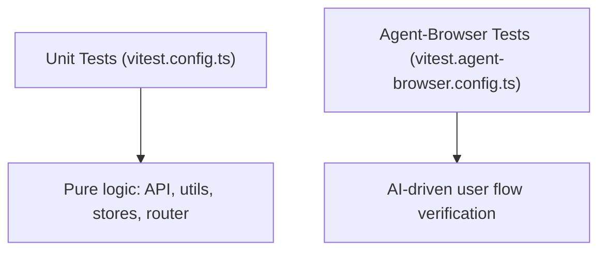

# Testing Strategy

Pictelio uses two active testing tiers. Previously there were component-level browser tests (Vitest browser mode) and Playwright E2E — both have been fully migrated to agent-browser per [ADR-0034](/docs/adr/ADR-0034-migrate-playwright-e2e-to-agent-browser.md) and [ADR-0035](/docs/adr/ADR-0035-migrate-component-tests-to-e2e-and-unit.md). Tests live under `/packages/app/tests/`. The canonical conventions are documented in `/packages/app/tests/TESTING.md`.



## Test Tiers

### 1. Unit Tests (`tests/unit/`)

- **Runner:** Vitest (`vitest.config.ts`)
- **Scope:** Pure logic — API layer, utilities, stores, router definitions, services, primitives
- **No DOM required** — tests run in Node.js
- **Key pattern:** `createManualFetch` (`/packages/app/src/primitives/createManualFetch.ts`) — a test-oriented primitive that allows injecting mock responses into the API client, simulating any Pixiv API response without actual network calls
- Runs via: `pnpm test`

### 2. Agent-Browser E2E Tests (`tests/agent-browser/`)

- **Runner:** Vitest (`vitest.agent-browser.config.ts`)
- **Scope:** AI-driven user flow verification — covers core user flows, UI component behavior, page navigation, and settings
- **Infrastructure:**
  - **AgentBrowserDriver** (`driver.ts`) — spawns `agent-browser` CLI via `spawnSync` (migrated from `execSync`/`shell:true` for better error handling and security)
  - **`clickFirst`** — targets clickable elements; `skipCount` parameter skips top UI elements (avatar, title) to land on content cards
  - **`clickReliable`** — fallback chain: `@e` ref → aria-label → direct text → CSS selector
  - **`getAttribute`/`getComputedStyle`** — bridge methods for precise DOM property assertions via `evaluate()`
  - **`aiAssert`** (`tests/ai-shared/assertion.ts`) — sends page state (accessibility tree + page text) to DeepSeek Flash for semantic validation
- **File structure:**
  - `main-flow.test.ts` — single long-chain test covering end-to-end user journey
  - `sub-flows.test.ts` — medium-chain tests organized by feature (discovery, artwork, reading, personal, login, settings, navigation)
- Runs via: `pnpm test:agent-browser`

### Migration History

Previously Pictelio had:
- **Playwright E2E tests** (11 spec files) — migrated to agent-browser per ADR-0034
- **Vitest browser component tests** (29 files, `@vitest/browser-playwright`) — migrated to agent-browser E2E or removed per ADR-0035

Both `playwright` and `@vitest/browser-playwright` dependencies have been removed.

> **Note (3.21.7 prep):** `@vitest/coverage-v8` (^4.1.10) was added to `packages/app/package.json` devDependencies (uncommitted alongside the 3.21.7 version bump), but no `coverage` npm script, `coverage` block in `vitest.config.ts`, or CI coverage step exists yet — the dependency is installed but not wired up.

## File Naming Conventions

Per `TESTING.md`:

| Pattern | Test Tier | Purpose |
|---------|-----------|---------|
| `*.test.ts`  | Unit | Pure logic tests (no DOM) |
| `*.test.ts` (in agent-browser/) | Agent-browser E2E | AI-driven flow tests |

## Test Infrastructure

### `createManualFetch`

Located at `/packages/app/src/primitives/createManualFetch.ts`. This primitive is critical for all API-level testability:

- Wraps the Pixiv API client to intercept requests
- Returns mock responses defined inline in the test
- Supports simulating error states (401, 400, network failure)
- Works in both unit and browser test environments

### TQ Query Mock Pattern (Store Tests)

`tests/unit/stores/followStore.test.ts` and `recommendedStore.test.ts` introduce a complementary pattern for testing TanStack Query-based stores: they mock `@tanstack/solid-query`'s `createInfiniteQuery` directly, returning configurable mock data per query key (e.g. `"follow_public"`, `"recommended_illust"`). This allows testing sub-tab routing and merge behavior at the store level without API calls:

- `getQ(key)` returns a `QueryMock` with controllable `data`, `isFetching`, `error`, `hasNextPage`, `fetchNextPage`, and `refetch`
- `setQueryData(key, illusts, next_url)` populates paginated mock data
- `resetQueryMocks()` clears state between tests
- The mock respects `enabled: false` by returning `undefined` data

This pattern is lighter than `createManualFetch` when the goal is to verify store-level signal derivation and action delegation rather than HTTP behavior.

The same pattern is also used for the novel-side store tests (`novelRecommendedStore.test.ts`, `novelFollowStore.test.ts`, `novelBookmarkStore.test.ts`), with a variation: the novel bookmark test uses a hardcoded `"bookmarks"` key lookup (single-tab store), while the novel follow test uses dynamic `queryKeyToLookupKey` routing matching its merge-mode sub-tabs (`"follow_public"`, `"follow_private"`).

### Memory Store

`/packages/app/src/stores/db.ts` exports `createMemoryStore` — a TanStack DB collection backed by in-memory storage instead of IndexedDB. This allows testing browsing history, bookmarks, and other persisted stores without side effects:

```typescript
// Unit test setup for historyStore
import { createMemoryStore } from "../stores/db";
jest.mock("../stores/db", () => ({
  ...jest.requireActual("../stores/db"),
  getCollection: () => createMemoryStore({ key: "test-history" }),
}));
```

### Config Consistency Anti-Drift Tests

`tests/unit/utils/backupRulesConsistency.test.ts` (added in v3.21.6) guards the [backup exclusion XML files](/openwiki/integrations/android-native.md#backup-rules--token-storage-exclusions-adr-0003) from silent drift. Because Android backup `exclude path` entries are exact filename matches, the rules previously pointed at a nonexistent `_capacitor_secure_storage.xml` while the plugin actually writes `WSSecureStorageSharedPreferences.xml` — ciphertext was exported with backups. The test:

- Extracts the real SharedPreferences filename constant from the `@aparajita/capacitor-secure-storage` plugin source (`node_modules/.../SecureStorage.java`) instead of hardcoding it
- Asserts `data_extraction_rules.xml` (`cloud-backup` + `device-transfer`) and `backup_rules.xml` (`full-backup-content`) all exclude `WSSecureStorageSharedPreferences.xml` + `PictelioPrefs.xml`
- Asserts the three XML sections stay identical to each other

This is a reusable pattern for config-vs-source consistency: parse the constant from source, compare against the config, fail loudly on drift.

### AI-Shared Test Utilities (`tests/ai-shared/`)

Shared infrastructure for AI-driven E2E tests:
- **`assertion.ts`** — The `aiAssert` function that sends the page accessibility tree + innerText to DeepSeek Flash (`DEEPSEEK_API_KEY` env var required) and returns a structured `{passed, reason}` result with automatic retries
- **`globalSetup.ts`** — Loads `.env`, checks `PIXIV_REFRESH_TOKEN`, manages the agent-browser daemon socket, and starts/reuses the Vite dev server on port 5173
- **`globalTeardown.ts`** — Kills the Vite dev server if started by globalSetup

## Running Tests

| Command | Tests |
|---------|-------|
| `pnpm test` | Unit tests (Vitest) |
| `pnpm test:watch` | Unit tests in watch mode |
| `pnpm test:agent-browser` | Agent-browser E2E tests |
| `pnpm test:all` | Unit + agent-browser E2E combined |

## Key Source Files

| Purpose | Path |
|---------|------|
| Testing conventions doc | `/packages/app/tests/TESTING.md` |
| Unit test config | `/packages/app/vitest.config.ts` |
| Agent-browser test config | `/packages/app/vitest.agent-browser.config.ts` |
| Test helpers | `/packages/app/tests/helpers.ts` |
| Manual fetch primitive | `/packages/app/src/primitives/createManualFetch.ts` |
| Memory store | `/packages/app/src/stores/db.ts` |
| Backup rules consistency test | `/packages/app/tests/unit/utils/backupRulesConsistency.test.ts` |
| Unit tests | `/packages/app/tests/unit/` |
| Unit component tests (migrated from browser/) | `/packages/app/tests/unit/components/` |
| Agent-browser tests | `/packages/app/tests/agent-browser/` |
| Agent-browser conventions | `/packages/app/tests/agent-browser/TESTING.md` |
| AI shared utilities | `/packages/app/tests/ai-shared/` |
| Playwright→agent-browser ADR | `/docs/adr/ADR-0034-migrate-playwright-e2e-to-agent-browser.md` |
| Component test→unit/E2E ADR | `/docs/adr/ADR-0035-migrate-component-tests-to-e2e-and-unit.md` |
