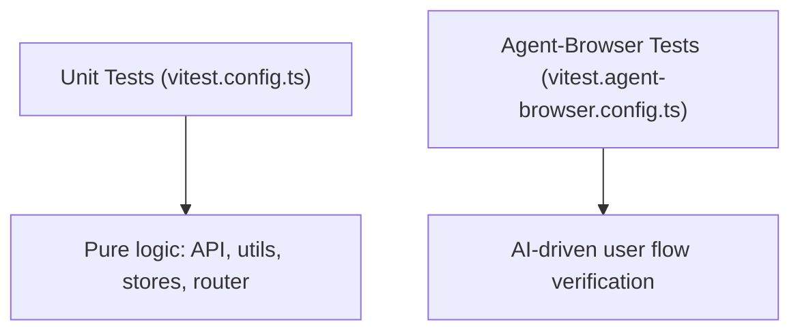

# Testing Strategy

Pictelio uses two active testing tiers. Previously there were component-level browser tests (Vitest browser mode) and Playwright E2E — both have been fully migrated to agent-browser per [ADR-0034](/docs/adr/ADR-0034-migrate-playwright-e2e-to-agent-browser.md) and [ADR-0035](/docs/adr/ADR-0035-migrate-component-tests-to-e2e-and-unit.md). Tests live under `/packages/app/tests/`. The canonical conventions are documented in `/packages/app/tests/TESTING.md`.



## Test Tiers

### 1. Unit Tests (`tests/unit/`)

- **Runner:** Vitest (`vitest.config.ts`)
- **Scope:** Pure logic — API layer, utilities, stores, router definitions, services, primitives
- **No DOM required** — tests run in Node.js
- **Key pattern:** `createManualFetch` (`/packages/app/src/primitives/createManualFetch.ts`) — a test-oriented primitive that allows injecting mock responses into the API client, simulating any Pixiv API response without actual network calls
- Runs via: `pnpm test`

### 2. Agent-Browser E2E Tests (`tests/agent-browser/`)

- **Runner:** Vitest (`vitest.agent-browser.config.ts`)
- **Scope:** AI-driven user flow verification — covers core user flows, UI component behavior, page navigation, and settings
- **Infrastructure:**
  - **AgentBrowserDriver** (`driver.ts`) — spawns `agent-browser` CLI via `spawnSync` (migrated from `execSync`/`shell:true` for better error handling and security)
  - **`clickFirst`** — targets clickable elements; `skipCount` parameter skips top UI elements (avatar, title) to land on content cards
  - **`clickReliable`** — fallback chain: `@e` ref → aria-label → direct text → CSS selector
  - **`getAttribute`/`getComputedStyle`** — bridge methods for precise DOM property assertions via `evaluate()`
  - **`aiAssert`** (`tests/ai-shared/assertion.ts`) — sends page state (accessibility tree + page text) to DeepSeek Flash for semantic validation
- **File structure:**
  - `main-flow.test.ts` — single long-chain test covering end-to-end user journey
  - `sub-flows.test.ts` — medium-chain tests organized by feature (discovery, artwork, reading, personal, login, settings, navigation)
- Runs via: `pnpm test:agent-browser`

### Migration History

Previously Pictelio had:
- **Playwright E2E tests** (11 spec files) — migrated to agent-browser per ADR-0034
- **Vitest browser component tests** (29 files, `@vitest/browser-playwright`) — migrated to agent-browser E2E or removed per ADR-0035

Both `playwright` and `@vitest/browser-playwright` dependencies have been removed.

## File Naming Conventions

Per `TESTING.md`:

| Pattern | Test Tier | Purpose |
|---------|-----------|---------|
| `*.test.ts`  | Unit | Pure logic tests (no DOM) |
| `*.test.ts` (in agent-browser/) | Agent-browser E2E | AI-driven flow tests |

## Test Infrastructure

### `createManualFetch`

Located at `/packages/app/src/primitives/createManualFetch.ts`. This primitive is critical for all API-level testability:

- Wraps the Pixiv API client to intercept requests
- Returns mock responses defined inline in the test
- Supports simulating error states (401, 400, network failure)
- Works in both unit and browser test environments

### Memory Store

`/packages/app/src/stores/db.ts` exports `createMemoryStore` — a TanStack DB collection backed by in-memory storage instead of IndexedDB. This allows testing browsing history, bookmarks, and other persisted stores without side effects:

```typescript
// Unit test setup for historyStore
import { createMemoryStore } from "../stores/db";
jest.mock("../stores/db", () => ({
  ...jest.requireActual("../stores/db"),
  getCollection: () => createMemoryStore({ key: "test-history" }),
}));
```

### AI-Shared Test Utilities (`tests/ai-shared/`)

Shared infrastructure between agent-browser and other AI-driven test types:
- Assertion helpers for common patterns
- Global setup/teardown for auth token loading
- Driver abstraction for the agent browser

## Running Tests

| Command | Tests |
|---------|-------|
| `pnpm test` | Unit tests (Vitest) |
| `pnpm test:watch` | Unit tests in watch mode |
| `pnpm test:agent-browser` | Agent-browser E2E tests |
| `pnpm test:all` | Unit + agent-browser E2E combined |

## Key Source Files

| Purpose | Path |
|---------|------|
| Testing conventions doc | `/packages/app/tests/TESTING.md` |
| Unit test config | `/packages/app/vitest.config.ts` |
| Agent-browser test config | `/packages/app/vitest.agent-browser.config.ts` |
| Test helpers | `/packages/app/tests/helpers.ts` |
| Manual fetch primitive | `/packages/app/src/primitives/createManualFetch.ts` |
| Memory store | `/packages/app/src/stores/db.ts` |
| Unit tests | `/packages/app/tests/unit/` |
| Browser tests | `/packages/app/tests/browser/` |
| Agent-browser tests | `/packages/app/tests/agent-browser/` |
| AI shared utilities | `/packages/app/tests/ai-shared/` |
| E2E migration ADR | `/docs/adr/ADR-0034-migrate-playwright-e2e-to-agent-browser.md` |
