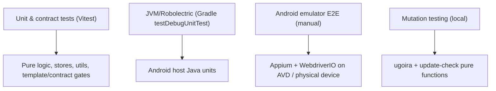

# Testing Strategy

Pictelio is a **Lynx single-engine** client since the WebView client was removed in [ADR-0203](../../docs/adr/ADR-0203-webview-client-source-removal.md). The test pyramid is therefore built around one client package (`pictelio-app-lynx`), one build host (`@pictelio/android-host`), and a set of shared pure-logic packages. The active tiers are:

- **Vitest unit/template/contract tests** — `pictelio-app-lynx` (`pnpm test`) and `@pictelio/android-host` (`pnpm test:android-host`).
- **JVM/Robolectric unit tests** — `@pictelio/android-host` Gradle `testDebugUnitTest` (`pnpm test:android-host:unit`).
- **Android emulator E2E** — Appium + WebdriverIO under `packages/android-host/tests/android-e2e/` (`pnpm test:android-host:e2e`, manual, not in CI).
- **Mutation testing** — local, non-CI StrykerJS over `@pictelio/ugoira` and `@pictelio/update-check` (`pnpm test:mutation`).

The former **agent-browser** (AI-driven browser E2E), **Playwright** E2E, and **Vitest browser component** suites were removed with the WebView client (`packages/app`); see [Removed suites](#removed-suites-history).

```mermaid
flowchart TD
    U["Unit & contract tests (Vitest)"] --> S["Pure logic, stores, utils, template/contract gates"]
    J["JVM/Robolectric (Gradle testDebugUnitTest)"] --> JAVA["Android host Java units"]
    E["Android emulator E2E (manual)"] --> EMU["Appium + WebdriverIO on AVD / physical device"]
    M["Mutation testing (local)"] --> PURE["ugoira + update-check pure functions"]
```

## CI gate boundaries

The authoritative gate boundary is `.github/workflows/ci.yml` plus the [AGENTS.md](../../AGENTS.md) "测试" section:

| CI job | Command | Scope |
|--------|---------|-------|
| `check` | `pnpm check:all` + `pnpm lint:all` | Type check (`vue-tsc` for app-lynx) + lint across packages |
| `test` | `pnpm test:all` | Vitest unit tests only — **Android E2E never enters CI** |
| `android-unit-test` | `./gradlew testDebugUnitTest --no-daemon` (after `sync:credentials`) | JVM/Robolectric Java units |

- **E2E is manual and not in CI.** This follows [ADR-0084](../../docs/adr/ADR-0084-e2e-testing-localization.md): the old agent-browser E2E job needed a real Pixiv network path plus `PIXIV_REFRESH_TOKEN`, which GitHub runners cannot reproduce, so the job was an empty shell (42/43 skipped) that produced false confidence. `PIXIV_REFRESH_TOKEN` is loaded only from a local `.env` and **never** enters GitHub Secrets or CI logs.
- **Task-cache scoping.** `pnpm check:all` runs with `--cache`; `pnpm test:all` deliberately does **not**. A cache hit on the test gate would mean the tests never actually ran — replaying logs and producing the same fake green that ADR-0084 eliminated. The cache flag lives on the command line because `vp`'s `run.cache = { scripts: false, tasks: true }` makes package.json scripts uncached by default and `run.cache.scripts` is all-or-nothing, so "cache only `check`" cannot be expressed in config (see [AGENTS.md](../../AGENTS.md) and root [package.json](../../package.json)).
- **Gate freeze line.** AGENTS.md also caps gate growth: a single gate file must not exceed ~30% of the size of the object it guards, "fake green is worse than no gate" (known blind spots must be registered, not just wins), and a gate's only proof of value is an external re-check, not a self-authored "N/N caught".

## Test tiers

### 1. app-lynx Vitest — unit, template, and contract gates

- **Config:** [packages/app-lynx/vitest.config.ts](../../packages/app-lynx/vitest.config.ts) — `environment: "node"`, includes `tests/**/*.test.ts` and `src/**/*.test.ts`, excludes `**/*.fallback.test.ts`, and injects the same compile-time constants as `lynx.config.ts` (`__APP_VERSION__` from the package `version`, `__HOME_BLEED_HEADER__: 'true'`, `__PUBLIC_CONFIG__`, `__CREDENTIALS__`). A `setupFiles` script pins the i18n locale so Node ≥22's `navigator.language` does not skew tests.
- **Fallback config:** [packages/app-lynx/vitest.fallback.config.ts](../../packages/app-lynx/vitest.fallback.config.ts) flips `__HOME_BLEED_HEADER__` to `'false'` and collects only `src/**/*.fallback.test.ts`. The home-top-bar build flag is a compile-time macro, so the default (new header) and fallback (bleed → self, ticket #920/#906) paths each need their own run; `pnpm test` runs **both** configs.
- **Layout:** classic logic tests under `tests/unit/` (`api/`, `composables/`, `i18n/`, `primitives/`, `stores/`, `utils/`), single-engine behavior-baseline fixtures under `tests/contract/` (shared truth tables for R18/R18G restriction, URL rewrite, OAuth error classification, illust-type badges, tag mute, AI filter), and a large set of source-text/template gates at `tests/*.test.ts` (MD3 token/hardcode gates, icon consumption, motion contract, top-inset metrics, route transition wiring, etc.). Co-located `src/**/*.test.ts` files cover components and utils such as `BookmarkButton.host-matrix.test.ts`, `settingsStore.test.ts`, and `safeAreaJavaContract.test.ts`.
- **`check`** runs `vue-tsc --noEmit -p src/tsconfig.json && tsc --noEmit -p tsconfig.node.json`, so `.vue` template expressions and `defineProps`/slot inference are actually type-checked (closing the blind spot pure `tsc` silently skipped).

### 2. android-host Vitest — contract gates and repo invariants

- **Config:** [packages/android-host/vitest.config.ts](../../packages/android-host/vitest.config.ts) — `environment: "node"`, `passWithNoTests: false`, includes **two globs listed separately** (`tests/unit/**/*.test.ts` and `tests/android-e2e/unit/**/*.test.ts`) and excludes `tests/android-e2e/specs/**` (emulator specs must never leak into CI). The second glob is a deliberate gate fix from issue #818: those contract tools' pure-function tests were previously only collected by the emulator config and silently went unrun for months.
- **[webviewRemovalInvariants.test.ts](../../packages/android-host/tests/unit/webviewRemovalInvariants.test.ts)** — the authoritative "WebView client fully removed" gate: **10 invariant groups** (no `packages/app`; Capacitor dependency declarations zeroed; host assets present; persisted-format literals still intact; app-lynx does not cross-read the deleted dir; root command table points at the single client; facade wording converged; client-switch capability gone; Gradle entry generation present; pnpm call sites resolve), plus **19 counterfactual positive controls** (a compliant tree is built in `os.tmpdir()` and each violation is injected back to prove the same `evaluateInvariants` turns red) and **2 scan-coverage assertions** pinning the scan root/exclude list itself.
- **[agentsMd.contract.test.ts](../../packages/android-host/tests/unit/agentsMd.contract.test.ts)** — the AGENTS.md contract gate: a ≤30 KiB volume hard gate (reset after ADR-0203), Fluent-spec verbatim assertions now pointing at the archive file plus an entry pointer in AGENTS.md, hard-constraint anchor survival, single-engine facade wording (`LynxActivity`, no `MainActivity`/`registerPlugin`, "Lynx 单引擎" present and "双引擎" absent), OPENWIKI marker-pair survival, stale-phrase zeroing, and root command-table reachability (every command in the AGENTS.md table must exist in root `package.json` scripts).
- **[e2eContractSuiteCollected.test.ts](../../packages/android-host/tests/unit/e2eContractSuiteCollected.test.ts)** — guards that the 8 `tests/android-e2e/unit/**` contract tests are both on disk and matched by the host `vitest.config.ts` include globs, so they reach `pnpm test` → `test:all` → CI. This exists because `passWithNoTests: false` can detect "nothing collected" but not "one directory dropped".
- **Release-script units** under `tests/unit/scripts/` cover the publish tooling (`release-preflight`, `release-build-steps`, `release-notes-ai`, `upload-release-assets`, `changelog`, `check-push-refs`, `git-refs`, `proxy-probe`, etc.); `tests/unit/android/proguardRulesConsistency.test.ts` guards ProGuard config vs source constants.

### 3. android-host JVM/Robolectric

- **Gate:** `./gradlew testDebugUnitTest --no-daemon`, run from `packages/android-host/android` after `sync:credentials` (CI's `android-unit-test` job). After the WebView client removal there are **no product flavors**, so the old per-flavor `testFullDebugUnitTest` variant gate ([ADR-0177](../../docs/adr/ADR-0177-android-gradle-test-variant-gate.md), now archived) collapsed to the single build-type task.
- **Source set:** `packages/android-host/android/app/src/test/java/io/pictelio/app/` — Robolectric/JVM units for native modules (`PictelioApiModuleTest`, `PictelioPrefsModuleTest`, `PictelioWebDavModuleTest`, `LynxSystemBarsTest`, `LynxStatusBarAppearanceTest`, `LynxDarkModeTest`), encoders/exporters (`Mp4EncoderTest`, `WebpEncoderTest`, `NovelEpubEncoderTest`, `UgoiraExporter*Test`, `BackupCryptoTest`), image pipeline (`PixivImageLoaderTest`, `ImageMemoryCacheTest`), and shared core (`SecureStorageCompatTest`, `WebDavClientTest`, `ImageHostConfigTest`).

### 4. Android emulator E2E (manual)

- **Config:** [packages/android-host/tests/android-e2e/vitest.config.ts](../../packages/android-host/tests/android-e2e/vitest.config.ts) — `root` points at the directory, includes `specs/**/*.spec.ts` + `unit/**/*.test.ts`, serial execution (`fileParallelism: false`), `testTimeout: 300_000`, `hookTimeout: 1_500_000`, `retry: 0`, and a light `globalSetup` that injects `packages/app-lynx/.env` into `process.env` (never overwriting an already-exported value).
- **Orchestration:** `setup.ts` → `setupAndroidE2e()` chains AVD detection/start, Chromedriver provisioning, APK build/install (`pnpm build:android-host`), Appium server, and a WebdriverIO session. Support modules: `appium.ts`, `avd.ts`, `chromedriver.ts`, `build-install.ts`, `driver.ts`, plus shared `pixel.ts` screenshot/color/region utilities and `env.ts` SDK/subprocess/timeout helpers. See [README.md](../../packages/android-host/tests/android-e2e/README.md) for AVD setup, env vars (`ANDROID_E2E_AVD`, `ANDROID_E2E_SKIP_BUILD`, `ANDROID_E2E_HTTP_PROXY`, …), and the `BENCH_NAV=1` deep-link hook.
- **11 specs**, all under `specs/`: `smoke`, `background-resume`, `transition-matrix`, `webdav-backup-lynx`, `fab-hit-testing-regression`, `lynx-bookmark-tags`, `lynx-boot-renders`, `lynx-detail-image-probe`, `lynx-network-check`, `settings-sync-contract`, and `md3-visual-tokens` (the only spec that skips login and Appium session — screenshot sampling only, not release-gated).
- **Assertion reality:** Lynx 4.0.1's `LynxView` accessibility tree does **not** expose view/text nodes, and `uiautomator dump` is SIGKILLed on the reference AVD, so interaction is driven by adb taps/swipes and content is asserted via **screenshot + pixel analysis** (region-scoped frame diffs), not text reads.
- **Removed specs:** the `client-kind-contract.spec.ts` and `switch-client-*` family were deleted with the client-switch capability (ADR-0203 decision 7); `MainActivity`/`MainActivityWebview` are gone, so there is no WebView↔native context switching and `LynxActivity` is the only entry.

### 5. Mutation testing (local)

StrykerJS (with the official Vitest runner) is a **local, non-CI** sensitivity gate over the two in-process pure packages `@pictelio/ugoira` and `@pictelio/update-check`; `pnpm test:mutation` runs both and writes HTML/JSON reports to gitignored local dirs (configs at [packages/ugoira/stryker.config.ts](../../packages/ugoira/stryker.config.ts) and [packages/update-check/stryker.config.ts](../../packages/update-check/stryker.config.ts)). Mutation score is explicitly a **weak-assertion detector, never correctness evidence** — complementary to the oracle check (which catches wrong expectations). See [ADR-0101](../../docs/adr/ADR-0101-stryker-mutation-trial.md).

## QA defense lines (ADR-0163)

Four real-device defects (2026-09-15/16) all lived in state transitions and in two layers code review plus happy-dom unit tests structurally cannot see — the **Lynx runtime-semantics layer** (`URL` polyfill `.hostname === undefined` broke search pagination) and the **cross-component contract layer** (init-only props froze the bookmark count across carousel slides). [ADR-0163](../../docs/adr/ADR-0163-qa-defense-lines.md) erects three defense lines reusing existing infra:

- **Transition matrix** — [`transition-matrix.spec.ts`](../../packages/android-host/tests/android-e2e/specs/transition-matrix.spec.ts), an `@release-gate` android-e2e spec parameterizing `list surface × user action × engine × content assertion`. After single-engine consolidation it runs **3 rows** (R1 detail-return related-works + scroll preservation; R2 search pagination + scope switch; R3 carousel card-swipe bookmark-count change). Assertions must be **content comparison** (region-scoped frame diffs), not single-frame existence — revising the old #374 existence-check doctrine. It runs before release and on big-PR manual trigger, not per-PR CI (#539).
- **Host-matrix contract test** — [`BookmarkButton.host-matrix.test.ts`](../../packages/app-lynx/src/components/BookmarkButton.host-matrix.test.ts) compiles the real `BookmarkButton.vue` (vue/compiler-sfc + a custom `createRenderer` nodeOps) to lock the init-only-props lifecycle contract across host forms: a reused carousel host must remount per work (`:key`) or state freezes on the first card.
- **Platform consistency self-check page** — [`PlatformCheck.vue`](../../packages/app-lynx/src/pages/PlatformCheck.vue) (benchNav-only `/platform-check` route, no nav entry) renders a spec-derived PASS/FAIL matrix for the platform APIs the project depends on (URL parsing, `URLSearchParams` round-trip, bridge callback quote contract) on the **real Lynx runtime**, backed by the [`safeParseUrl.ts`](../../packages/app-lynx/src/utils/safeParseUrl.ts) consolidation (`extractHostname`/`extractAuthority`) guarded by a template test forbidding bare `new URL(`.
- **Third code-review audit axis** — `.agents/skills/code-review/SKILL.md` adds platform/host contract checks (native `<list>` structure changes require epoch defense/spike; new Lynx global-API usage requires device probe + source guard; init-only components into a new host require a host-matrix test).

Net effect: happy-dom unit tests are **demoted from the oracle for Lynx runtime behavior** to a "browser-semantics reference", and the release checklist gains a "transition matrix must pass" step (GitHub Releases pre-release ≥3 days before stable).

## Hard constraints

The testing conventions in [docs/testing/conventions.md](../../docs/testing/conventions.md) (verbatim-promoted from the deleted `packages/app/tests/TESTING.md`) are the detailed source of truth; [AGENTS.md](../../AGENTS.md) carries the summary. Violations count as architecture violations.

The **six hard constraints** (AGENTS.md summary numbers):

1. **IO dual-path coverage** — every function reading an external source (fetch/HTTP, Preferences, native bridge, JSON parsing) must have both success-path and failure/degradation-path unit tests.
2. **Real-sample contracts** — mocks for cross-file/cross-platform data contracts must come from real sources (live files, plugin source constants, real response snapshots), never hand-written "self-consistent" fields (the `backupRulesConsistency` pattern is the reference).
3. **No silent degradation** — every fallback path (`?? ""`, `?? null`, catch → default) must emit `console.warn` (with a module prefix) or expose an error state.
4. **Refactor invariance** — refactors touching field names, constants, config values, or defaults must check for a corresponding contract test (add one if missing) and note behavior-change points in the commit message.
5. **E2E reachability** — user-reachable interaction paths should have E2E coverage; external-state paths are covered by state construction. The constraint's named WebView-era mechanism (`driver.mockFetch()` + `driver.spyOnWindowOpen()`) was removed with the agent-browser client; today's state construction is benchNav deep links (`BENCH_NAV=1`) plus `loginViaDevIntent`.
6. **Oracle traceability** — every test expectation must trace to an independent source (spec / acceptance sample / real data snapshot / property invariant); implementation-reverse-derived expectations, self-consistent mocks, and tautologies are suspect.

> **Numbering offset.** The detailed doc numbers the oracle constraint as **#5** (= AGENTS #6) and adds a **detail-only #6, async-test determinism**, not yet mirrored in the AGENTS summary: unit tests must wait on the condition (`vi.waitFor(() => expect(...))`), never on a fixed wall-clock sleep; failure paths must finish in-flight async via `try/finally`; concurrent-mock count assertions must be keyed by business identifier (e.g. `chapterId`), never call ordinal. The defense precedent is `novelTranslateStore.test.ts`'s `describe.each` timing table.

## Oracle provenance & test quality

- **Repo-localized code-review skill** ([.agents/skills/code-review/SKILL.md](../../.agents/skills/code-review/SKILL.md), ADR-0097) shadows the global skill; its Spec axis blocks on **Oracle check** (per-test expectation provenance) and **Test strength** (assertions must observe behavior and name the intended regression).
- **T0 mechanical gates** — `passWithNoTests: false` (rejects empty/leaked test files) and oxlint `expect-expect: error` (tests must contain assertions).
- **T0.5 format gate** — [`scripts/verify-agent-skills.mjs`](../../scripts/verify-agent-skills.mjs) validates `.agents/skills/` frontmatter, name↔directory consistency, and required markers; wired into pre-push when a push touches `.agents/`.
- **Differential/property tests after ADR-0203** — the old dual-engine differential suites (WebView↔Lynx byte-identical assertions) lost their peer and were reshaped into **single-engine behavior baselines** under `tests/contract/` (`sharedRestrictionTruthTable.ts`, `sharedUrlRewriteCases.ts`, `sharedOAuthErrorCases.ts`, `sharedIllustTypeBadgeCases.ts`, …). [`truthTableFixtureIntegrity.test.ts`](../../packages/app-lynx/tests/contract/truthTableFixtureIntegrity.test.ts) now guards fixture coverage completeness and zero-framework-dependency instead of cross-engine byte equality. Property tests with fast-check remain over pure functions (`r18Filter`, `novelBlocks`, `searchMerger`, `isNewer`).

## Removed suites (history)

- **Agent-browser E2E** (`packages/app/tests/agent-browser/`, 16 spec files, `pnpm test:agent-browser`) — removed with the WebView client. It drove flows through an agent-browser CLI (`evaluate`, `mockFetch`, `spyOnWindowOpen`, `aiAssert`) and required a local Vite dev server on port 5173 plus `PIXIV_REFRESH_TOKEN`; no replacement exists (ADR-0203 consequence 4).
- **Playwright E2E** (11 spec files) had already migrated to agent-browser (ADR-0034), and **Vitest browser component tests** (29 files, `@vitest/browser-playwright`) were migrated or removed (ADR-0035); both `playwright` and `@vitest/browser-playwright` dependencies are gone.
- **WebView static anchor validation** (`packages/app/scripts/check-e2e-anchors.mjs`) was removed with the client; the remaining pre-push domains are the app-lynx anchor check ([`check-app-lynx-anchors.mjs`](../../packages/app-lynx/scripts/check-app-lynx-anchors.mjs)) and the `.agents/` skill check, orchestrated by [`scripts/check-push-refs.mjs`](../../scripts/check-push-refs.mjs).

## Running tests

| Command | What it runs |
|---------|--------------|
| `pnpm test` / `pnpm test:app-lynx` | app-lynx Vitest (main config + fallback config) |
| `pnpm test:android-host` | android-host Vitest (repo invariants + contract gates) |
| `pnpm test:android-host:unit` | android-host JVM/Robolectric `testDebugUnitTest` |
| `pnpm test:android-host:e2e` | Android emulator E2E (manual, Appium + WebdriverIO) |
| `pnpm test:all` | all packages' Vitest unit tests (bounded concurrency; CI `test` job) |
| `pnpm test:ugoira` / `:update-check` / `:novel-export` / `:net-diagnostics` | individual shared-package unit tests |
| `pnpm test:mutation` | Stryker mutation over `@pictelio/ugoira` + `@pictelio/update-check` (local, non-CI) |
| `pnpm check:all` | type check (vue-tsc for app-lynx) + `tsc` across packages, with task cache |
| `pnpm lint:all` | oxlint across packages |

`pnpm test:agent-browser` no longer exists.

## Key source files

| Purpose | Path |
|---------|------|
| Testing conventions (detailed) | `docs/testing/conventions.md` |
| Gate boundary + hard constraints summary | `AGENTS.md` |
| CI workflow | `.github/workflows/ci.yml` |
| app-lynx Vitest config | `packages/app-lynx/vitest.config.ts` |
| app-lynx fallback Vitest config | `packages/app-lynx/vitest.fallback.config.ts` |
| android-host Vitest config | `packages/android-host/vitest.config.ts` |
| android-e2e Vitest config | `packages/android-host/tests/android-e2e/vitest.config.ts` |
| Repo invariants gate | `packages/android-host/tests/unit/webviewRemovalInvariants.test.ts` |
| AGENTS.md contract gate | `packages/android-host/tests/unit/agentsMd.contract.test.ts` |
| E2E contract-suite collection gate | `packages/android-host/tests/unit/e2eContractSuiteCollected.test.ts` |
| Release-gate transition matrix | `packages/android-host/tests/android-e2e/specs/transition-matrix.spec.ts` |
| Release-gate three-state classifier | `packages/android-host/tests/android-e2e/support/releaseGate.ts` |
| Host-matrix contract test | `packages/app-lynx/src/components/BookmarkButton.host-matrix.test.ts` |
| Platform consistency self-check | `packages/app-lynx/src/pages/PlatformCheck.vue` |
| URL-domain-parse consolidation | `packages/app-lynx/src/utils/safeParseUrl.ts` |
| Behavior-baseline fixtures | `packages/app-lynx/tests/contract/` |
| Repo-localized code-review skill | `.agents/skills/code-review/SKILL.md` |
| Agent-skills format gate | `scripts/verify-agent-skills.mjs` |
| Mutation configs | `packages/ugoira/stryker.config.ts`, `packages/update-check/stryker.config.ts` |
